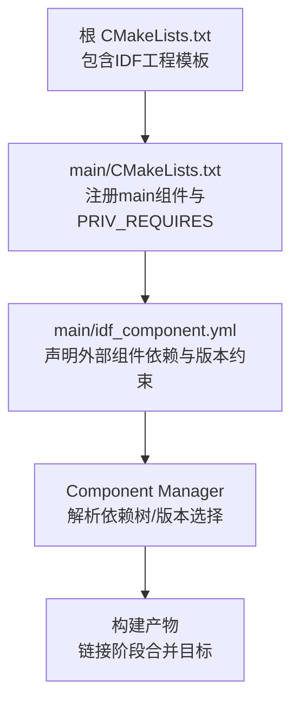
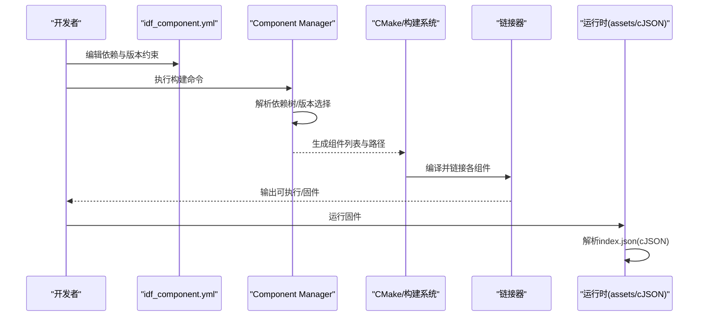
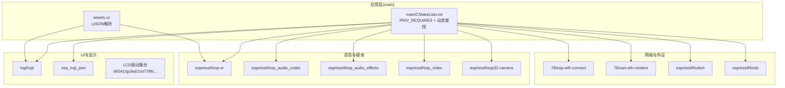
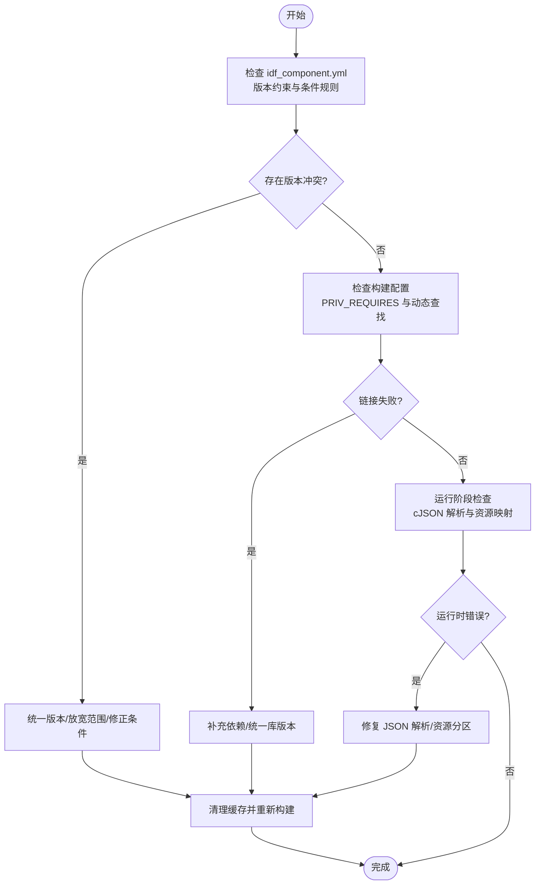

# 依赖库冲突与缺失

<cite>
**本文引用的文件**   
- [main/idf_component.yml](file://main/idf_component.yml)
- [CMakeLists.txt](file://CMakeLists.txt)
- [main/CMakeLists.txt](file://main/CMakeLists.txt)
- [main/assets.cc](file://main/assets.cc)
- [main/mcp_server.h](file://main/mcp_server.h)
- [main/boards/common/board.cc](file://main/boards/common/board.cc)
- [main/boards/jiuchuan-s3/README.md](file://main/boards/jiuchuan-s3/README.md)
- [main/boards/m5stack-tab5/README.md](file://main/boards/m5stack-tab5/README.md)
</cite>

## 目录
1. [简介](#简介)
2. [项目结构](#项目结构)
3. [核心组件](#核心组件)
4. [架构总览](#架构总览)
5. [详细组件分析](#详细组件分析)
6. [依赖关系分析](#依赖关系分析)
7. [性能考量](#性能考量)
8. [故障排查指南](#故障排查指南)
9. [结论](#结论)
10. [附录](#附录)

## 简介
本指南聚焦于 ESP-IDF 组件管理中的依赖库冲突与缺失问题，围绕 idf_component.yml 配置错误、版本冲突、依赖循环、组件注册失败、动态编译配置错误、链接失败等典型场景，提供系统化的诊断方法与修复流程。文档同时覆盖 LVGL、ESP-SR、cJSON 等核心依赖的版本兼容性问题，并给出缓存清理与重新下载的操作建议。

## 项目结构
本项目使用 ESP-IDF 的 Component Manager 进行依赖管理，关键入口包括：
- 根级 CMake 脚本用于初始化构建系统与最小化构建策略
- main 模块通过 idf_component.yml 声明所有第三方与官方组件依赖
- main/CMakeLists.txt 中通过 PRIV_REQUIRES 显式声明对 IDF 内部组件的私有依赖，并在构建期动态查找部分组件路径（如 ESP-SR 模型目录）

图表来源
- [CMakeLists.txt:1-13](file://CMakeLists.txt#L1-L13)
- [main/CMakeLists.txt:1047-1071](file://main/CMakeLists.txt#L1047-L1071)
- [main/idf_component.yml:1-151](file://main/idf_component.yml#L1-L151)

章节来源
- [CMakeLists.txt:1-13](file://CMakeLists.txt#L1-L13)
- [main/CMakeLists.txt:1047-1071](file://main/CMakeLists.txt#L1047-L1071)
- [main/idf_component.yml:1-151](file://main/idf_component.yml#L1-L151)

## 核心组件
- 依赖清单与版本约束：位于 main/idf_component.yml，集中声明了 LVGL、esp_lvgl_port、ESP-SR、cJSON（间接）、各类 LCD/TCP/触摸驱动、摄像头、视频、音频、网络等组件及版本范围。
- 构建与链接：根 CMakeLists.txt 启用最小化构建；main/CMakeLists.txt 通过 PRIV_REQUIRES 声明对 IDF 内部组件的依赖，并通过 find_component_by_pattern 动态定位 ESP-SR 与字体资源路径。
- 运行时 JSON 处理：assets.cc 与 mcp_server.h 中使用 cJSON 解析 index.json 与属性描述，若 cJSON 版本或 API 不匹配，将导致解析失败或链接异常。

章节来源
- [main/idf_component.yml:1-151](file://main/idf_component.yml#L1-L151)
- [CMakeLists.txt:1-13](file://CMakeLists.txt#L1-L13)
- [main/CMakeLists.txt:1047-1071](file://main/CMakeLists.txt#L1047-L1071)
- [main/assets.cc:214-261](file://main/assets.cc#L214-L261)
- [main/mcp_server.h:41-46](file://main/mcp_server.h#L41-L46)

## 架构总览
下图展示了从依赖声明到构建链接的关键路径，以及常见冲突点（版本约束、条件规则、动态查找）。

图表来源
- [main/idf_component.yml:1-151](file://main/idf_component.yml#L1-L151)
- [main/CMakeLists.txt:1047-1071](file://main/CMakeLists.txt#L1047-L1071)
- [main/assets.cc:214-261](file://main/assets.cc#L214-L261)

## 详细组件分析

### 依赖清单与版本约束（main/idf_component.yml）
- 版本约束类型
  - 精确版本：例如某些 LCD 驱动使用 ==x.y.z 锁定版本，避免上游变更破坏兼容性。
  - 范围约束：^x.y.z、~x.y.z 允许在兼容范围内升级。
  - 通配符：* 表示任意版本，需谨慎使用。
- 条件规则
  - rules.if.target 针对特定目标芯片启用不同依赖，避免无关平台引入多余组件。
- 公共组件
  - public: true 标记的组件会被上层可见，影响依赖图与链接顺序。

常见问题与定位要点
- 版本冲突：多个组件对同一库有不同版本要求时，Component Manager 会尝试满足约束；若不满足则报错。优先检查是否使用了过于严格的 == 版本或相互矛盾的 ^/~= 范围。
- 条件规则遗漏：未为目标平台添加必要依赖，或在非目标平台引入了仅支持特定平台的组件。
- 公共组件暴露：public: true 可能改变依赖拓扑，需确认上层是否需要该组件。

章节来源
- [main/idf_component.yml:1-151](file://main/idf_component.yml#L1-L151)

### 构建与链接（CMakeLists.txt 与 main/CMakeLists.txt）
- 根 CMakeLists.txt
  - 包含 IDF 工程模板，设置最小化构建，减少不必要的组件参与编译。
- main/CMakeLists.txt
  - 通过 PRIV_REQUIRES 声明对 IDF 内部组件的私有依赖（如 esp_pm、spi_flash、fatfs 等），这些是链接阶段必须满足的符号来源。
  - 使用 find_component_by_pattern 动态查找 ESP-SR 与字体组件路径，便于在不同版本下正确定位资源目录。

常见问题与定位要点
- 链接失败：若出现“未定义引用”或“找不到库”，通常由以下原因引起：
  - 缺少必要的 PRIV_REQUIRES 项
  - 组件版本不匹配导致 API 变化
  - 动态查找失败（组件未被安装或命名不一致）
- 动态查找失败：当组件名被 Component Manager 改写（如前缀 espressif__），需确保模式匹配正确。

章节来源
- [CMakeLists.txt:1-13](file://CMakeLists.txt#L1-L13)
- [main/CMakeLists.txt:1047-1071](file://main/CMakeLists.txt#L1047-L1071)
- [main/CMakeLists.txt:1100-1111](file://main/CMakeLists.txt#L1100-L1111)

### 运行时 JSON 处理（cJSON 使用）
- assets.cc 使用 cJSON_ParseWithLength 解析 index.json，并进行版本校验与主题/字体加载。
- mcp_server.h 使用 cJSON_CreateObject/AddXxx/Delete 等 API 构造属性描述。

常见问题与定位要点
- 解析失败：index.json 格式错误或版本不被支持，会导致应用逻辑提前返回。
- 链接失败：若 cJSON 版本或头文件路径不一致，可能出现重复定义或未定义引用。
- 内存释放：cJSON_PrintUnformatted 返回的字符串需调用 cJSON_free 释放，否则可能导致内存泄漏。

章节来源
- [main/assets.cc:214-261](file://main/assets.cc#L214-L261)
- [main/mcp_server.h:41-46](file://main/mcp_server.h#L41-L46)

## 依赖关系分析
下图展示主要依赖方向与潜在冲突点。

图表来源
- [main/idf_component.yml:1-151](file://main/idf_component.yml#L1-L151)
- [main/CMakeLists.txt:1047-1071](file://main/CMakeLists.txt#L1047-L1071)
- [main/assets.cc:214-261](file://main/assets.cc#L214-L261)

章节来源
- [main/idf_component.yml:1-151](file://main/idf_component.yml#L1-L151)
- [main/CMakeLists.txt:1047-1071](file://main/CMakeLists.txt#L1047-L1071)

## 性能考量
- 最小化构建：根 CMakeLists.txt 已启用 MINIMAL_BUILD，有助于减少编译时间与二进制体积。
- 条件依赖：通过 rules.if.target 仅在需要的目标上引入组件，降低冗余。
- 资源映射：assets.cc 使用分区映射与校验，避免运行时额外拷贝，提升启动效率。

[本节为通用指导，无需具体文件分析]

## 故障排查指南

### 一、依赖版本冲突
症状
- 构建时报错提示多个组件对同一库存在不兼容版本。
- 链接阶段出现重复定义或符号冲突。

排查步骤
- 审查 main/idf_component.yml 中的版本约束，尤其是 == 精确版本与 ^/~= 范围是否矛盾。
- 关注 rules.if.target 的条件分支，确认当前目标平台是否启用了正确的依赖集。
- 对于公共组件（public: true），检查其是否被上层意外引入导致版本漂移。

修复建议
- 将冲突组件统一为经过验证的稳定版本，必要时放宽范围约束。
- 对强依赖的 LCD 驱动等保持 == 锁定，避免上游破坏性更新。

章节来源
- [main/idf_component.yml:1-151](file://main/idf_component.yml#L1-L151)

### 二、依赖关系循环
症状
- 构建系统无法解析依赖图，提示循环依赖。

排查步骤
- 检查是否存在跨组件互相依赖的情况，特别是自定义本地组件与第三方组件之间。
- 确认是否有通过 include 或路径拼接导致的隐式循环。

修复建议
- 抽取公共接口至独立组件，打破循环。
- 使用条件编译或运行时加载替代静态依赖。

[本节为通用指导，无需具体文件分析]

### 三、组件注册失败
症状
- 构建阶段报告组件未找到或注册失败。

排查步骤
- 确认 idf_component.yml 中组件名称与版本号是否正确。
- 检查网络镜像源与加速器状态，必要时切换国内镜像。

修复建议
- 参考板级 README 提示，调整 idf_component.yml 以使用国内镜像源。
- 清理组件缓存后重试。

章节来源
- [main/boards/jiuchuan-s3/README.md:7](file://main/boards/jiuchuan-s3/README.md#L7)

### 四、动态编译配置错误
症状
- 构建时报错找不到组件路径或变量未定义。

排查步骤
- 检查 main/CMakeLists.txt 中 find_component_by_pattern 的模式是否与 Component Manager 生成的组件名一致（如 espressif__esp-sr）。
- 确认相关组件已被成功安装且版本满足约束。

修复建议
- 修正模式匹配或显式指定组件路径。
- 对齐 SDK 与依赖版本，必要时回退到已知稳定组合。

章节来源
- [main/CMakeLists.txt:1100-1111](file://main/CMakeLists.txt#L1100-L1111)

### 五、组件链接失败
症状
- 链接阶段出现未定义引用或找不到库。

排查步骤
- 核对 main/CMakeLists.txt 的 PRIV_REQUIRES 是否包含所需 IDF 内部组件。
- 检查是否存在多份相同符号（重复定义）或头文件路径不一致。

修复建议
- 补充缺失的 PRIV_REQUIRES 项。
- 统一 cJSON 等第三方库版本，避免混用不同版本头文件与库。

章节来源
- [main/CMakeLists.txt:1047-1071](file://main/CMakeLists.txt#L1047-L1071)

### 六、LVGL 版本兼容性问题
症状
- UI 渲染异常、API 不匹配、编译报错。

排查步骤
- 确认 lvgl/lvgl 与 esp_lvgl_port 的版本组合在项目内已验证。
- 检查是否有代码改动需要对应旧版 API（如 README 明确提醒不要随意更改 esp_video 等版本）。

修复建议
- 遵循仓库中已锁定的版本范围，除非同步修改源码适配新 API。
- 参考板级说明，避免误改依赖版本。

章节来源
- [main/boards/m5stack-tab5/README.md:12](file://main/boards/m5stack-tab5/README.md#L12)
- [main/idf_component.yml:59-60](file://main/idf_component.yml#L59-L60)

### 七、ESP-SR 组件配置与模型路径
症状
- 语音识别功能不可用或模型加载失败。

排查步骤
- 确认 ESP-SR 组件已被正确安装且路径可通过 find_component_by_pattern 动态获取。
- 检查 model 目录是否存在且与固件版本匹配。

修复建议
- 若路径为空，检查组件安装与版本约束。
- 重建并确保模型资源随固件打包。

章节来源
- [main/CMakeLists.txt:1100-1111](file://main/CMakeLists.txt#L1100-L1111)

### 八、cJSON 使用与冲突
症状
- JSON 解析失败、内存泄漏、链接重复定义。

排查步骤
- 检查 assets.cc 中对 index.json 的解析与版本校验逻辑。
- 检查 mcp_server.h 中 cJSON 对象的创建与释放是否成对。

修复建议
- 确保只使用单一 cJSON 版本，避免混入不同版本的头文件与库。
- 严格遵循 cJSON 的分配/释放约定。

章节来源
- [main/assets.cc:214-261](file://main/assets.cc#L214-L261)
- [main/mcp_server.h:41-46](file://main/mcp_server.h#L41-L46)

### 九、组件缓存清理与重新下载
操作步骤
- 清理构建目录与组件缓存后重新构建，确保依赖解析基于最新状态。
- 若网络受限，按板级 README 提示切换国内镜像源。

章节来源
- [main/boards/jiuchuan-s3/README.md:7](file://main/boards/jiuchuan-s3/README.md#L7)

### 十、运行时资产与分区映射问题
症状
- 启动时报错“未找到 index.json”、“校验和不匹配”、“分区大小不足”。

排查步骤
- 检查 assets.cc 中的分区映射与校验逻辑，确认分区表与资源打包正确。
- 查看日志输出的存储大小与分区大小对比信息。

修复建议
- 重新生成并烧录资源分区，确保校验和与布局一致。
- 调整分区表以满足资源需求。

章节来源
- [main/assets.cc:130-185](file://main/assets.cc#L130-L185)

### 十一、系统信息与调试辅助
- board.cc 中收集应用与分区信息，可用于辅助定位版本与环境差异。

章节来源
- [main/boards/common/board.cc:124-150](file://main/boards/common/board.cc#L124-L150)

## 结论
依赖库冲突与缺失问题的核心在于：清晰的版本约束、正确的条件依赖、稳定的第三方库组合以及规范的构建与链接配置。通过系统化地审查 idf_component.yml、PRIV_REQUIRES、动态查找逻辑与运行时 JSON 处理，可以快速定位并修复大多数问题。建议在团队内维护一份“已验证的依赖版本矩阵”，并结合 CI 自动化验证，以降低回归风险。

[本节为总结性内容，无需具体文件分析]

## 附录

### 快速诊断流程图

[此图为概念流程，无需具体文件分析]