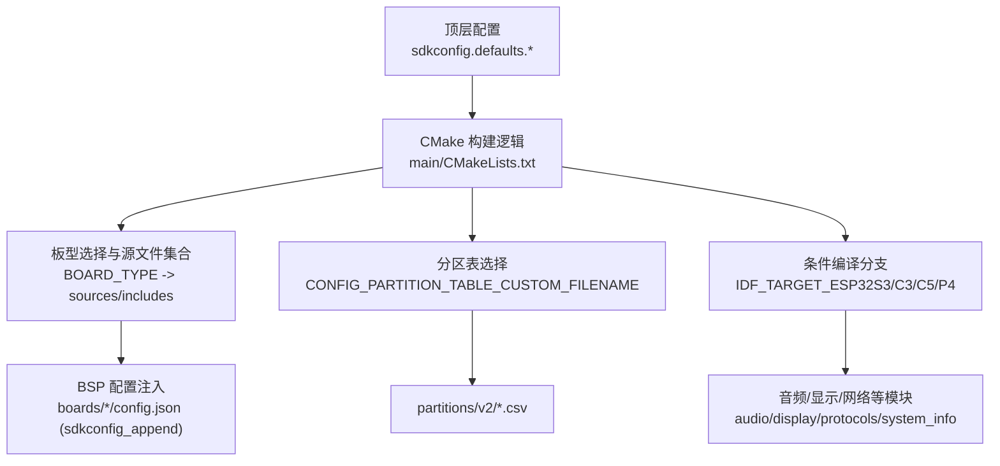
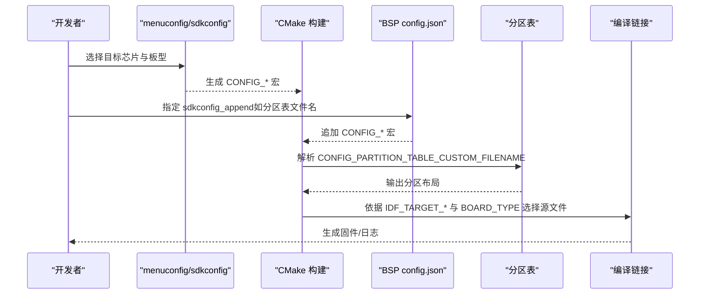
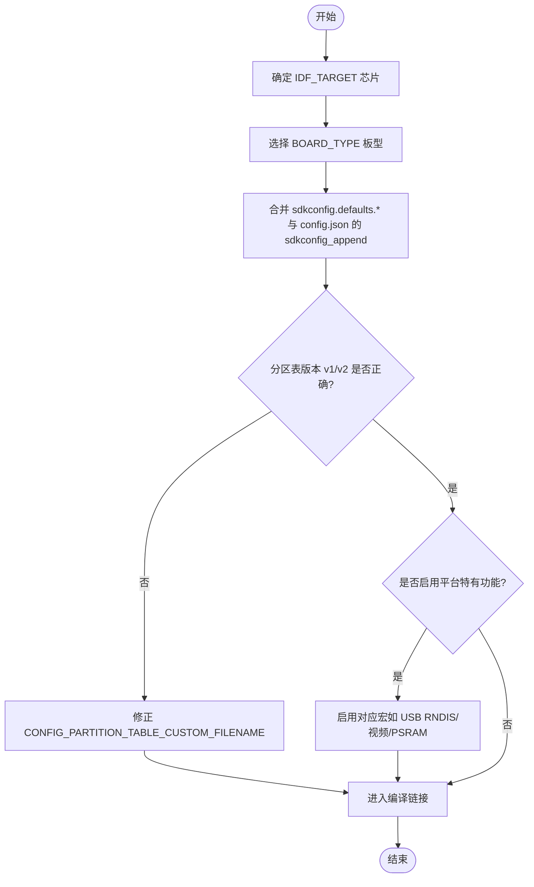
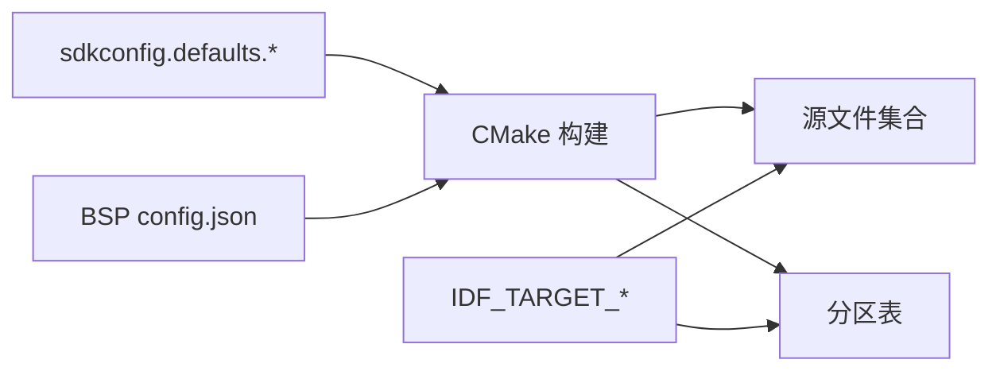

# 平台特定编译错误

<cite>
**本文引用的文件**
- [README.md](file://README.md)
- [sdkconfig.defaults.esp32s3](file://sdkconfig.defaults.esp32s3)
- [sdkconfig.defaults.esp32c3](file://sdkconfig.defaults.esp32c3)
- [sdkconfig.defaults.esp32c5](file://sdkconfig.defaults.esp32c5)
- [sdkconfig.defaults.esp32p4](file://sdkconfig.defaults.esp32p4)
- [partitions/v2/README.md](file://partitions/v2/README.md)
- [main/CMakeLists.txt](file://main/CMakeLists.txt)
- [main/audio/audio_service.cc](file://main/audio/audio_service.cc)
- [main/boards/common/rndis_board.cc](file://main/boards/common/rndis_board.cc)
- [main/boards/common/rndis_board.h](file://main/boards/common/rndis_board.h)
- [main/boards/esp-spot/config.json](file://main/boards/esp-spot/config.json)
- [main/boards/esp-hi/config.json](file://main/boards/esp-hi/config.json)
- [main/boards/atom-echos3r/config.json](file://main/boards/atom-echos3r/config.json)
- [main/boards/atoms3r-echo-base/config.json](file://main/boards/atoms3r-echo-base/config.json)
- [main/boards/lilygo-t-display-p4/t_display_p4_config.h](file://main/boards/lilygo-t-display-p4/t_display_p4_config.h)
- [main/display/lcd_display.cc](file://main/display/lcd_display.cc)
- [main/system_info.cc](file://main/system_info.cc)
- [main/assets.cc](file://main/assets.cc)
</cite>

## 目录
1. [简介](#简介)
2. [项目结构](#项目结构)
3. [核心组件](#核心组件)
4. [架构总览](#架构总览)
5. [详细组件分析](#详细组件分析)
6. [依赖关系分析](#依赖关系分析)
7. [性能与资源考量](#性能与资源考量)
8. [故障排查指南](#故障排查指南)
9. [结论](#结论)
10. [附录](#附录)

## 简介
本指南聚焦于 ESP32-S3、ESP32-C3、ESP32-C5、ESP32-P4 等芯片平台的“平台特定编译错误”排查，覆盖 SDK 默认配置差异（sdkconfig.defaults.*）、Flash 分区表 v1/v2 差异与冲突、内存布局与 PSRAM 配置、外设驱动条件编译分支、以及不同板级支持包（BSP）的常见构建问题。目标是帮助开发者快速定位并修复跨平台开发中的编译期问题，确保一次配置、多平台可构建。

## 项目结构
本项目采用“按功能分层 + 按板型聚合”的组织方式：
- 顶层 sdkconfig.defaults.* 提供各目标芯片的默认配置
- partitions/v2 提供新版分区表说明与模板
- main/CMakeLists.txt 根据 BOARD_TYPE 选择板型源文件与字体/表情集等
- boards/* 下每个子目录代表一个 BSP，包含 config.json（用于脚本注入 sdkconfig_append）和板级实现
- 音频、显示、协议、系统信息等模块通过 IDF_TARGET 宏进行条件编译

图表来源
- [main/CMakeLists.txt:1-120](file://main/CMakeLists.txt#L1-L120)
- [partitions/v2/README.md:1-40](file://partitions/v2/README.md#L1-L40)

章节来源
- [README.md:16-38](file://README.md#L16-L38)
- [main/CMakeLists.txt:1-120](file://main/CMakeLists.txt#L1-L120)

## 核心组件
- 平台默认配置（sdkconfig.defaults.*）
  - ESP32-S3：启用 PSRAM（Octal, 80MHz）、较大任务栈、USB Host 控制传输大小、LVGL 快照等
  - ESP32-C3：使用 v2 分区表（16m_c3.csv），关闭 WPA3 SAE、ESPNOW 加密数限制、禁用 IPv6，降低空闲任务栈
  - ESP32-C5：与 C3 类似的网络与唤醒词配置，启用 USE_ESP_WAKE_WORD
  - ESP32-P4：启用实验特性、PSRAM 200MHz、XIP from PSRAM、主任务栈增大、视频 ISP 管线、USB Host 控制传输大小调整等
- 分区表 v2
  - 引入 assets 分区，替换旧 model 分区；不同 Flash 容量有不同布局；C3 的 assets 受 mmap 页限制为 4MB
- 构建与板型选择
  - CMake 中大量 if(CONFIG_BOARD_TYPE_*) 分支决定源码与资源；部分分支仅对特定 IDF_TARGET 有效
- 条件编译与平台相关代码
  - audio_service、rndis_board、lcd_display、system_info 等模块通过 IDF_TARGET_* 宏区分实现

章节来源
- [sdkconfig.defaults.esp32s3:1-32](file://sdkconfig.defaults.esp32s3#L1-L32)
- [sdkconfig.defaults.esp32c3:1-15](file://sdkconfig.defaults.esp32c3#L1-L15)
- [sdkconfig.defaults.esp32c5:1-15](file://sdkconfig.defaults.esp32c5#L1-L15)
- [sdkconfig.defaults.esp32p4:1-32](file://sdkconfig.defaults.esp32p4#L1-L32)
- [partitions/v2/README.md:1-107](file://partitions/v2/README.md#L1-L107)
- [main/CMakeLists.txt:1-120](file://main/CMakeLists.txt#L1-L120)

## 架构总览
下图展示从“目标芯片 + 板型选择”到“最终产物”的关键路径，突出易出错的配置点。

图表来源
- [main/CMakeLists.txt:1-120](file://main/CMakeLists.txt#L1-L120)
- [partitions/v2/README.md:1-40](file://partitions/v2/README.md#L1-L40)

## 详细组件分析

### 平台默认配置差异与典型编译错误
- ESP32-S3
  - 现象：未启用 PSRAM 或 SPIRAM 模式不匹配导致链接失败或运行时崩溃
  - 检查项：SPIRAM、SPIRAM_MODE_OCT、SPIRAM_SPEED_80M、SPIRAM_MALLOC_ALWAYSINTERNAL/RESERVE_INTERNAL
  - 参考：[sdkconfig.defaults.esp32s3:1-32](file://sdkconfig.defaults.esp32s3#L1-L32)
- ESP32-C3
  - 现象：使用了 v1 分区表或错误的 16m_c3.csv 导致 assets 分区不足
  - 检查项：CONFIG_PARTITION_TABLE_CUSTOM_FILENAME 指向 partitions/v2/16m_c3.csv
  - 参考：[sdkconfig.defaults.esp32c3:1-15](file://sdkconfig.defaults.esp32c3#L1-L15), [partitions/v2/README.md:60-66](file://partitions/v2/README.md#L60-L66)
- ESP32-C5
  - 现象：唤醒词模型未启用导致语音功能不可用或链接缺失
  - 检查项：USE_ESP_WAKE_WORD、SR_WN_WN9S_NIHAOXIAOZHI
  - 参考：[sdkconfig.defaults.esp32c5:1-15](file://sdkconfig.defaults.esp32c5#L1-L15)
- ESP32-P4
  - 现象：未开启实验特性或视频/USB 相关宏导致头文件缺失
  - 检查项：IDF_EXPERIMENTAL_FEATURES、ESP_VIDEO_ENABLE_ISP_PIPELINE_CONTROLLER、USB_HOST_CONTROL_TRANSFER_MAX_SIZE
  - 参考：[sdkconfig.defaults.esp32p4:1-32](file://sdkconfig.defaults.esp32p4#L1-L32)

章节来源
- [sdkconfig.defaults.esp32s3:1-32](file://sdkconfig.defaults.esp32s3#L1-L32)
- [sdkconfig.defaults.esp32c3:1-15](file://sdkconfig.defaults.esp32c3#L1-L15)
- [sdkconfig.defaults.esp32c5:1-15](file://sdkconfig.defaults.esp32c5#L1-L15)
- [sdkconfig.defaults.esp32p4:1-32](file://sdkconfig.defaults.esp32p4#L1-L32)
- [partitions/v2/README.md:60-66](file://partitions/v2/README.md#L60-L66)

### Flash 分区表 v1/v2 差异与冲突诊断
- 关键差异
  - v2 新增 assets 分区，替换 v1 的 model 分区；应用分区缩小，assets 空间增大
  - C3 的 16m_c3.csv 将 assets 限制为 4MB（受 mmap 页限制）
- 常见问题
  - 混用 v1/v2 分区表导致运行时报错或 OTA 失败
  - 小 Flash 设备未选择对应分区表（4m/8m）导致溢出
- 诊断步骤
  - 确认 CONFIG_PARTITION_TABLE_CUSTOM_FILENAME 指向正确的 v2 文件
  - 核对 Flash 容量与分区表匹配（4m/8m/16m/32m）
  - 升级时遵循迁移说明：备份数据、刷写新分区表、首次启动下载 assets
- 参考
  - [partitions/v2/README.md:1-107](file://partitions/v2/README.md#L1-L107)

章节来源
- [partitions/v2/README.md:1-107](file://partitions/v2/README.md#L1-L107)

### 内存布局与 PSRAM 配置冲突
- 典型症状
  - 分配失败、堆碎片化、WiFi/LWIP 分配异常
- 关键点
  - S3/P4 均启用 PSRAM，但速度/模式不同（S3 Octal 80MHz，P4 200MHz 且 XIP from PSRAM）
  - P4 主任务栈更大，需关注 FreeRTOS 频率与统计宏
- 建议
  - 保持 sdkconfig.defaults.* 中对应平台配置一致
  - 若自定义板型，务必在 config.json 中追加必要的 PSRAM 与任务栈宏

章节来源
- [sdkconfig.defaults.esp32s3:1-32](file://sdkconfig.defaults.esp32s3#L1-L32)
- [sdkconfig.defaults.esp32p4:1-32](file://sdkconfig.defaults.esp32p4#L1-L32)

### 外设驱动与条件编译分支
- USB RNDIS（仅 S3/P4）
  - 现象：在非 S3/P4 上编译出现未定义符号
  - 原因：rndis_board 相关接口被 #if CONFIG_IDF_TARGET_ESP32P4 || CONFIG_IDF_TARGET_ESP32S3 保护
  - 处理：确保目标芯片正确设置，或在非 S3/P4 板型中禁用相关功能
  - 参考：
    - [main/boards/common/rndis_board.cc:14-247](file://main/boards/common/rndis_board.cc#L14-L247)
    - [main/boards/common/rndis_board.h:5-71](file://main/boards/common/rndis_board.h#L5-L71)
- 音频服务（S3/P4 分支）
  - 现象：音频初始化失败或链接错误
  - 原因：audio_service 中存在 S3/P4 专用实现
  - 处理：确认目标芯片宏生效，必要时调整 I2S/Codec 引脚配置
  - 参考：[main/audio/audio_service.cc:30-702](file://main/audio/audio_service.cc#L30-L702)
- LCD 显示（P4 分支）
  - 现象：LCD 初始化报错或缺少函数
  - 原因：lcd_display 中对 P4 有专门处理
  - 处理：确保 P4 目标启用，并检查显示驱动兼容性
  - 参考：[main/display/lcd_display.cc:498](file://main/display/lcd_display.cc#L498)
- 系统信息（P4 以太网分支）
  - 现象：系统信息接口缺失
  - 原因：system_info 中针对 P4 与非以太网场景的条件编译
  - 处理：根据是否启用以太网选择合适配置
  - 参考：[main/system_info.cc:11-38](file://main/system_info.cc#L11-L38)

章节来源
- [main/boards/common/rndis_board.cc:14-247](file://main/boards/common/rndis_board.cc#L14-L247)
- [main/boards/common/rndis_board.h:5-71](file://main/boards/common/rndis_board.h#L5-L71)
- [main/audio/audio_service.cc:30-702](file://main/audio/audio_service.cc#L30-L702)
- [main/display/lcd_display.cc:498](file://main/display/lcd_display.cc#L498)
- [main/system_info.cc:11-38](file://main/system_info.cc#L11-L38)

### 板级支持包（BSP）特定问题与解决
- ESP32-C3 小 Flash 设备（如 esp-hi）
  - 现象：构建失败或运行后无控制台输出
  - 原因：需要 4m 分区表、关闭 WPA3/Enterprise、减小栈与 LWIP 参数
  - 处理：在 config.json 的 sdkconfig_append 中追加相应宏
  - 参考：[main/boards/esp-hi/config.json:1-34](file://main/boards/esp-hi/config.json#L1-L34)
- ESP32-C5 设备（如 esp-spot-c5）
  - 现象：无法选择 8m 分区表或功耗相关宏缺失
  - 处理：在 config.json 中指定 8m 分区表与 PM/TICKLESS 选项
  - 参考：[main/boards/esp-spot/config.json:1-14](file://main/boards/esp-spot/config.json#L1-L14)
- ESP32-S3 小 Flash 设备（如 atom-echos3r、atoms3r-echo-base）
  - 现象：应用过大导致写入失败
  - 处理：使用 8m 分区表并精简资源
  - 参考：
    - [main/boards/atom-echos3r/config.json:1-12](file://main/boards/atom-echos3r/config.json#L1-L12)
    - [main/boards/atoms3r-echo-base/config.json:1-12](file://main/boards/atoms3r-echo-base/config.json#L1-L12)
- ESP32-P4 显示板（lilygo-t-display-p4）
  - 现象：显示驱动初始化失败
  - 处理：确认 t_display_p4_config.h 中驱动与引脚配置与硬件一致
  - 参考：[main/boards/lilygo-t-display-p4/t_display_p4_config.h](file://main/boards/lilygo-t-display-p4/t_display_p4_config.h)

章节来源
- [main/boards/esp-hi/config.json:1-34](file://main/boards/esp-hi/config.json#L1-L34)
- [main/boards/esp-spot/config.json:1-14](file://main/boards/esp-spot/config.json#L1-L14)
- [main/boards/atom-echos3r/config.json:1-12](file://main/boards/atom-echos3r/config.json#L1-L12)
- [main/boards/atoms3r-echo-base/config.json:1-12](file://main/boards/atoms3r-echo-base/config.json#L1-L12)
- [main/boards/lilygo-t-display-p4/t_display_p4_config.h](file://main/boards/lilygo-t-display-p4/t_display_p4_config.h)

### 构建流程与条件编译决策图

图表来源
- [main/CMakeLists.txt:1-120](file://main/CMakeLists.txt#L1-L120)
- [partitions/v2/README.md:1-40](file://partitions/v2/README.md#L1-L40)

## 依赖关系分析
- 构建层依赖
  - CMake 根据 BOARD_TYPE 添加源文件与包含目录
  - 分区表由 CONFIG_PARTITION_TABLE_CUSTOM_FILENAME 指定
- 平台层依赖
  - IDF_TARGET_* 宏控制条件编译分支
  - 各 BSP 的 config.json 通过 sdkconfig_append 注入平台相关宏
- 潜在循环与耦合
  - 条件编译较多，建议在 BSP 中集中管理平台差异，避免在通用模块中散落过多 #ifdef

图表来源
- [main/CMakeLists.txt:1-120](file://main/CMakeLists.txt#L1-L120)

章节来源
- [main/CMakeLists.txt:1-120](file://main/CMakeLists.txt#L1-L120)

## 性能与资源考量
- PSRAM 速度与模式：S3 Octal 80MHz，P4 200MHz 且支持 XIP from PSRAM，影响图像/媒体加载性能
- 任务栈与调度：P4 主任务栈更大，FreeRTOS_HZ 与统计宏开启有助于调试
- 网络缓冲：C3 默认关闭 WPA3/IPv6，减少内存占用
- 建议：在小 Flash 设备上优先选择 v2 小分区表，并精简字体/表情等资源

章节来源
- [sdkconfig.defaults.esp32s3:1-32](file://sdkconfig.defaults.esp32s3#L1-L32)
- [sdkconfig.defaults.esp32p4:1-32](file://sdkconfig.defaults.esp32p4#L1-L32)
- [sdkconfig.defaults.esp32c3:1-15](file://sdkconfig.defaults.esp32c3#L1-L15)

## 故障排查指南
- 分区表相关
  - 症状：OTA 失败、assets 无法写入、首次启动卡住
  - 排查：确认 v2 分区表与 Flash 容量匹配；C3 使用 16m_c3.csv；迁移时遵循 v2 README 的步骤
  - 参考：[partitions/v2/README.md:94-107](file://partitions/v2/README.md#L94-L107)
- 资源写入与校验
  - 症状：写入失败、校验错误
  - 排查：检查分区擦除范围是否越界、日志中的扇区信息与分区大小
  - 参考：[main/assets.cc:514-540](file://main/assets.cc#L514-L540)
- 平台宏缺失
  - 症状：未定义符号、头文件缺失
  - 排查：确认 IDF_TARGET_* 与 BOARD_TYPE 宏生效；在 menuconfig 或 config.json 中补齐
  - 参考：
    - [main/boards/common/rndis_board.cc:14-247](file://main/boards/common/rndis_board.cc#L14-L247)
    - [main/audio/audio_service.cc:30-702](file://main/audio/audio_service.cc#L30-L702)
    - [main/display/lcd_display.cc:498](file://main/display/lcd_display.cc#L498)
    - [main/system_info.cc:11-38](file://main/system_info.cc#L11-L38)
- 小 Flash 设备构建失败
  - 症状：链接错误或烧录失败
  - 排查：使用 4m/8m 分区表，关闭非必要功能（WPA3/IPv6/Enterprise），减小栈与 LWIP 参数
  - 参考：[main/boards/esp-hi/config.json:1-34](file://main/boards/esp-hi/config.json#L1-L34)

章节来源
- [partitions/v2/README.md:94-107](file://partitions/v2/README.md#L94-L107)
- [main/assets.cc:514-540](file://main/assets.cc#L514-L540)
- [main/boards/common/rndis_board.cc:14-247](file://main/boards/common/rndis_board.cc#L14-L247)
- [main/audio/audio_service.cc:30-702](file://main/audio/audio_service.cc#L30-L702)
- [main/display/lcd_display.cc:498](file://main/display/lcd_display.cc#L498)
- [main/system_info.cc:11-38](file://main/system_info.cc#L11-L38)
- [main/boards/esp-hi/config.json:1-34](file://main/boards/esp-hi/config.json#L1-L34)

## 结论
通过统一使用 sdkconfig.defaults.* 与 v2 分区表，并在 BSP 的 config.json 中精准注入 sdkconfig_append，可以显著降低跨平台编译错误。遇到问题时，优先核查目标芯片宏、分区表版本与容量匹配、PSRAM 配置、以及条件编译分支是否覆盖当前平台。

## 附录
- 快速自检清单
  - 目标芯片与板型是否一致？
  - 分区表是否为 v2 且与 Flash 容量匹配？
  - 小 Flash 设备是否选择了 4m/8m 分区表？
  - 是否需要启用实验特性或视频/USB 相关宏？
  - 是否在 BSP 的 config.json 中追加了必要的 sdkconfig_append？