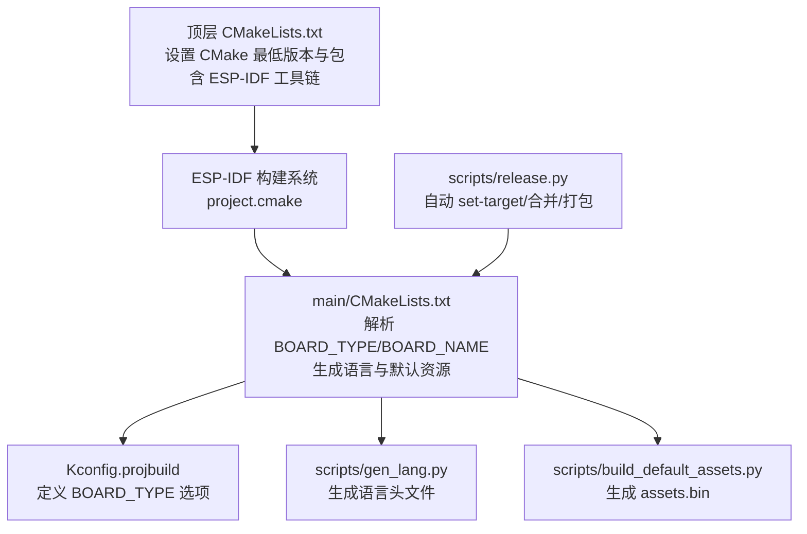
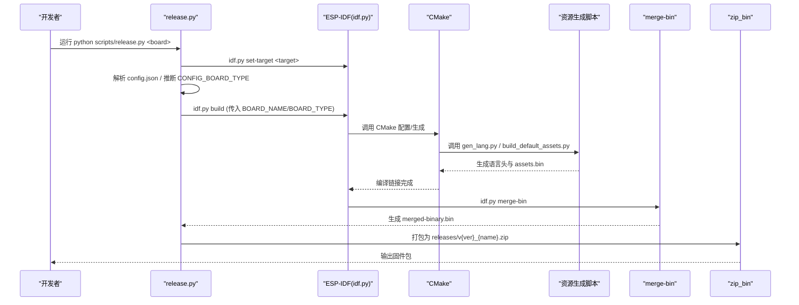
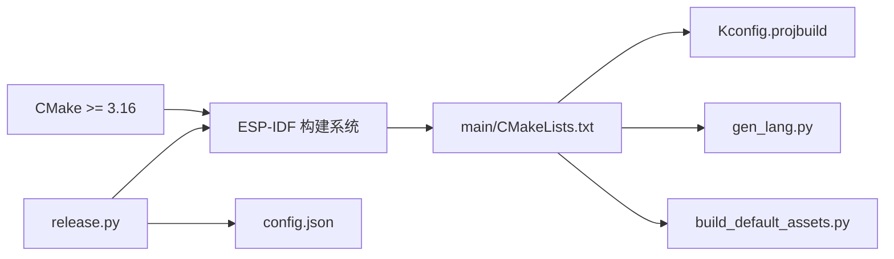

# 开发环境配置错误

<cite>
**本文引用的文件**   
- [CMakeLists.txt](file://CMakeLists.txt)
- [README_zh.md](file://README_zh.md)
- [main/CMakeLists.txt](file://main/CMakeLists.txt)
- [scripts/release.py](file://scripts/release.py)
- [docs/custom-board_zh.md](file://docs/custom-board_zh.md)
</cite>

## 目录
1. [简介](#简介)
2. [项目结构](#项目结构)
3. [核心组件](#核心组件)
4. [架构总览](#架构总览)
5. [详细组件分析](#详细组件分析)
6. [依赖关系分析](#依赖关系分析)
7. [性能与构建特性](#性能与构建特性)
8. [故障排查指南](#故障排查指南)
9. [结论](#结论)
10. [附录](#附录)

## 简介
本指南聚焦于基于 ESP-IDF 框架的固件项目在 Windows、Linux、macOS 下的常见环境搭建问题，包括：
- CMake 版本要求（3.16+）不满足时的诊断与修复
- ESP-IDF 路径与环境变量配置
- Python 版本与脚本执行问题
- Git 子模块与依赖库下载失败
- 开发板类型与 Kconfig/CMake 配置不一致导致的编译失败
- 资源生成与默认资源打包流程异常

目标是提供一套可操作的“从现象到根因再到修复”的完整排错流程。

## 项目结构
本项目使用 ESP-IDF 的 CMake 构建系统，顶层 CMakeLists.txt 声明最低 CMake 版本并引入 ESP-IDF 工具链；主工程在 main/ 下通过 Kconfig 和 CMake 选择具体开发板类型，并通过脚本完成语言资源与默认资源的生成与打包。

图表来源
- [CMakeLists.txt:1-13](file://CMakeLists.txt#L1-L13)
- [main/CMakeLists.txt:1071-1111](file://main/CMakeLists.txt#L1071-L1111)
- [main/CMakeLists.txt:1189-1225](file://main/CMakeLists.txt#L1189-L1225)
- [scripts/release.py:307-394](file://scripts/release.py#L307-L394)

章节来源
- [CMakeLists.txt:1-13](file://CMakeLists.txt#L1-L13)
- [main/CMakeLists.txt:1071-1111](file://main/CMakeLists.txt#L1071-L1111)
- [main/CMakeLists.txt:1189-1225](file://main/CMakeLists.txt#L1189-L1225)
- [scripts/release.py:307-394](file://scripts/release.py#L307-L394)

## 核心组件
- 构建入口与版本约束
  - 顶层 CMakeLists.txt 声明 cmake_minimum_required(VERSION 3.16)，并 include ESP-IDF 的 project.cmake。
- 开发板选择与宏注入
  - main/CMakeLists.txt 根据 Kconfig 的 CONFIG_BOARD_TYPE_xxx 设置 BOARD_TYPE/BOARD_NAME，并注入字体、表情等编译期常量。
- 资源生成
  - 语言头文件由 gen_lang.py 生成；默认资源由 build_default_assets.py 生成，最终嵌入固件。
- 自动化发布脚本
  - scripts/release.py 负责读取 config.json、推断或显式指定 CONFIG_BOARD_TYPE、调用 idf.py set-target、追加 sdkconfig、构建、合并二进制并打包 zip。

章节来源
- [CMakeLists.txt:1-13](file://CMakeLists.txt#L1-L13)
- [main/CMakeLists.txt:1071-1111](file://main/CMakeLists.txt#L1071-L1111)
- [main/CMakeLists.txt:1189-1225](file://main/CMakeLists.txt#L1189-L1225)
- [scripts/release.py:307-394](file://scripts/release.py#L307-L394)

## 架构总览
下图展示一次典型构建的关键步骤与依赖关系，便于定位环境问题出现在哪个环节。

图表来源
- [scripts/release.py:307-394](file://scripts/release.py#L307-L394)
- [main/CMakeLists.txt:1071-1111](file://main/CMakeLists.txt#L1071-L1111)
- [main/CMakeLists.txt:1189-1225](file://main/CMakeLists.txt#L1189-L1225)
- [CMakeLists.txt:1-13](file://CMakeLists.txt#L1-L13)

## 详细组件分析

### CMake 版本与 ESP-IDF 集成
- 关键约束
  - 顶层 CMakeLists.txt 要求 CMake 3.16 及以上。
  - 通过 include($ENV{IDF_PATH}/tools/cmake/project.cmake) 接入 ESP-IDF 构建系统。
- 常见问题
  - 本地 CMake 版本过低导致初始化失败。
  - IDF_PATH 未设置或指向错误路径，导致找不到 ESP-IDF 工具链。
- 诊断要点
  - 检查 cmake --version 是否满足 3.16+。
  - 确认环境变量 IDF_PATH 指向正确的 ESP-IDF 安装目录。
  - 若使用 IDE 插件，确保插件内选择的 SDK 版本与期望一致。

章节来源
- [CMakeLists.txt:1-13](file://CMakeLists.txt#L1-L13)
- [README_zh.md:115-121](file://README_zh.md#L115-L121)

### 开发板类型与 Kconfig/CMake 一致性
- 机制说明
  - main/CMakeLists.txt 根据 CONFIG_BOARD_TYPE_xxx 设置 BOARD_TYPE/BOARD_NAME，并注入字体、表情等宏。
  - release.py 会尝试从 CMakeLists.txt 反向推导对应的 Kconfig 符号，或在 config.json 中显式指定。
- 常见问题
  - 新增开发板未在 Kconfig.projbuild 添加选项或未在 main/CMakeLists.txt 增加对应分支。
  - 同一 board_leaf 存在多个候选 CONFIG_BOARD_TYPE，导致歧义。
- 诊断要点
  - 确认 main/CMakeLists.txt 中存在 set(BOARD_TYPE "<leaf>") 分支。
  - 确认 Kconfig.projbuild 中对应 choice 项已添加且 depends on 目标芯片正确。
  - 若需强制，可在 config.json 的 builds.sdkconfig_append 中显式写入 CONFIG_BOARD_TYPE_xxx=y。

章节来源
- [main/CMakeLists.txt:1071-1111](file://main/CMakeLists.txt#L1071-L1111)
- [scripts/release.py:143-249](file://scripts/release.py#L143-L249)
- [docs/custom-board_zh.md:293-329](file://docs/custom-board_zh.md#L293-L329)

### 资源生成与默认资源打包
- 语言头文件生成
  - main/CMakeLists.txt 通过 add_custom_command 调用 scripts/gen_lang.py 生成语言头文件。
- 默认资源生成
  - main/CMakeLists.txt 通过 add_custom_command 调用 scripts/build_default_assets.py 生成 assets.bin，并作为构建依赖。
- 常见问题
  - Python 不可用或版本不兼容导致资源生成失败。
  - 缺少字体/表情集合或模型路径参数导致生成中断。
- 诊断要点
  - 确认 python/python3 可用且版本满足脚本需求。
  - 检查构建日志中关于 gen_lang.py 与 build_default_assets.py 的输出。
  - 核对 main/CMakeLists.txt 中传递给脚本的参数是否正确。

章节来源
- [main/CMakeLists.txt:1071-1111](file://main/CMakeLists.txt#L1071-L1111)
- [main/CMakeLists.txt:1189-1225](file://main/CMakeLists.txt#L1189-L1225)

### 自动化发布脚本 release.py
- 主要职责
  - 解析 config.json，推断或显式指定 CONFIG_BOARD_TYPE。
  - 调用 idf.py set-target 设置目标芯片。
  - 向 sdkconfig 追加配置项，执行构建、合并二进制、打包 zip。
- 常见问题
  - 未找到 board_type 对应的 CMake 分支。
  - 多候选 CONFIG_BOARD_TYPE 导致歧义告警。
  - set-target 或 build 失败。
- 诊断要点
  - 使用 --list-boards 查看支持的 board 列表。
  - 检查 config.json 中的 target 与 builds.sdkconfig_append。
  - 关注脚本输出的警告与错误信息，必要时显式指定 CONFIG_BOARD_TYPE。

章节来源
- [scripts/release.py:307-394](file://scripts/release.py#L307-L394)
- [scripts/release.py:143-249](file://scripts/release.py#L143-L249)
- [scripts/release.py:297-301](file://scripts/release.py#L297-L301)

## 依赖关系分析
- 构建依赖
  - CMake >= 3.16
  - ESP-IDF（推荐 v5.4+，IDE 插件中选择对应版本）
  - Python（用于资源生成与 release.py）
- 内部依赖
  - main/CMakeLists.txt 依赖 Kconfig.projbuild 的 BOARD_TYPE 选项。
  - 资源生成依赖 gen_lang.py 与 build_default_assets.py。
  - release.py 依赖 ESP-IDF 命令行工具与 CMake。

图表来源
- [CMakeLists.txt:1-13](file://CMakeLists.txt#L1-L13)
- [main/CMakeLists.txt:1071-1111](file://main/CMakeLists.txt#L1071-L1111)
- [main/CMakeLists.txt:1189-1225](file://main/CMakeLists.txt#L1189-L1225)
- [scripts/release.py:307-394](file://scripts/release.py#L307-L394)

章节来源
- [CMakeLists.txt:1-13](file://CMakeLists.txt#L1-L13)
- [main/CMakeLists.txt:1071-1111](file://main/CMakeLists.txt#L1071-L1111)
- [main/CMakeLists.txt:1189-1225](file://main/CMakeLists.txt#L1189-L1225)
- [scripts/release.py:307-394](file://scripts/release.py#L307-L394)

## 性能与构建特性
- 最小化构建
  - 顶层 CMakeLists.txt 启用 MINIMAL_BUILD，仅包含必要组件，提升构建速度。
- 资源预生成
  - 语言与默认资源在构建前生成，避免运行时开销。

章节来源
- [CMakeLists.txt:1-13](file://CMakeLists.txt#L1-L13)
- [main/CMakeLists.txt:1189-1225](file://main/CMakeLists.txt#L1189-L1225)

## 故障排查指南

### 一、CMake 版本不满足（低于 3.16）
- 现象
  - 初始化阶段报错提示 CMake 版本过低。
- 诊断
  - 运行 cmake --version 确认版本。
  - 检查 PATH 中是否存在旧版 CMake。
- 解决
  - 升级 CMake 至 3.16 或以上。
  - 清理构建缓存后重试。

章节来源
- [CMakeLists.txt:1-13](file://CMakeLists.txt#L1-L13)

### 二、ESP-IDF 路径与环境变量配置错误
- 现象
  - 构建时找不到 ESP-IDF 工具链或 project.cmake。
- 诊断
  - 检查环境变量 IDF_PATH 是否指向正确的 ESP-IDF 安装目录。
  - 若使用 IDE 插件，确认插件内选择的 SDK 版本。
- 解决
  - 设置 IDF_PATH 为 ESP-IDF 根目录。
  - 重启终端/IDE，使环境变量生效。
  - 参考 README 中推荐的 SDK 版本。

章节来源
- [CMakeLists.txt:1-13](file://CMakeLists.txt#L1-L13)
- [README_zh.md:115-121](file://README_zh.md#L115-L121)

### 三、Python 版本或脚本执行问题
- 现象
  - 资源生成失败，或 release.py 无法执行。
- 诊断
  - 确认 python/python3 可用且版本满足脚本需求。
  - 检查构建日志中关于 gen_lang.py 与 build_default_assets.py 的错误。
- 解决
  - 安装或切换合适的 Python 版本。
  - 在 Windows 上注意将 python 加入 PATH，或使用 python3 别名。
  - 重新执行构建以触发资源生成。

章节来源
- [main/CMakeLists.txt:1071-1111](file://main/CMakeLists.txt#L1071-L1111)
- [main/CMakeLists.txt:1189-1225](file://main/CMakeLists.txt#L1189-L1225)

### 四、Git 子模块初始化失败与依赖下载失败
- 现象
  - 首次克隆后构建失败，提示缺失组件或网络错误。
- 诊断
  - 确认是否已初始化并更新子模块。
  - 检查网络连接与代理设置。
- 解决
  - 执行 git submodule update --init --recursive。
  - 如受网络限制，配置代理或镜像源后再试。
  - 清理构建目录后重试。

章节来源
- [无直接代码引用]

### 五、开发板类型配置不一致（Kconfig/CMake）
- 现象
  - 构建时报找不到 board_type 或出现歧义告警。
- 诊断
  - 检查 main/CMakeLists.txt 是否存在 set(BOARD_TYPE "<leaf>") 分支。
  - 检查 Kconfig.projbuild 是否添加了对应 CONFIG_BOARD_TYPE_xxx 选项。
  - 若存在多个候选，考虑在 config.json 中显式指定 CONFIG_BOARD_TYPE_xxx=y。
- 解决
  - 补齐 Kconfig 与 CMake 配置。
  - 使用 release.py 的 --list-boards 验证支持列表。
  - 必要时在 sdkconfig_append 中显式指定目标配置。

章节来源
- [main/CMakeLists.txt:1071-1111](file://main/CMakeLists.txt#L1071-L1111)
- [scripts/release.py:143-249](file://scripts/release.py#L143-L249)
- [scripts/release.py:297-301](file://scripts/release.py#L297-L301)
- [docs/custom-board_zh.md:293-329](file://docs/custom-board_zh.md#L293-L329)

### 六、Windows/Linux/macOS 特定问题
- Windows
  - 驱动与串口权限问题：确保以管理员权限或正确配置串口驱动。
  - Python 命令名：优先使用 python3 或将 python 加入 PATH。
- Linux
  - 用户组权限：将当前用户加入 dialout 组以便访问串口。
  - 包管理器安装 CMake/ESP-IDF 时注意版本匹配。
- macOS
  - Homebrew 安装的 CMake/Python 需在 PATH 中可见。
  - 如遇证书问题，按系统提示更新信任或配置代理。

章节来源
- [README_zh.md:115-121](file://README_zh.md#L115-L121)

### 七、资源生成失败（语言/默认资源）
- 现象
  - 构建过程中语言头文件或 assets.bin 生成失败。
- 诊断
  - 查看构建日志中 gen_lang.py 与 build_default_assets.py 的输出。
  - 检查传递给脚本的参数（字体、表情集合、模型路径等）。
- 解决
  - 修正 main/CMakeLists.txt 中的参数。
  - 确保相关资源路径存在且可读。
  - 清理构建缓存后重试。

章节来源
- [main/CMakeLists.txt:1071-1111](file://main/CMakeLists.txt#L1071-L1111)
- [main/CMakeLists.txt:1189-1225](file://main/CMakeLists.txt#L1189-L1225)

### 八、release.py 自动化构建失败
- 现象
  - set-target、build、merge-bin 或 zip 阶段失败。
- 诊断
  - 检查 config.json 的 target 与 builds.sdkconfig_append。
  - 关注脚本输出的错误与警告。
- 解决
  - 修正 config.json 配置。
  - 显式指定 CONFIG_BOARD_TYPE_xxx=y 消除歧义。
  - 清理构建目录后重试。

章节来源
- [scripts/release.py:307-394](file://scripts/release.py#L307-L394)
- [scripts/release.py:143-249](file://scripts/release.py#L143-L249)

## 结论
通过明确 CMake 与 ESP-IDF 的版本要求、规范环境变量与脚本执行环境、保证开发板类型在 Kconfig 与 CMake 的一致性，以及正确处理资源生成与依赖下载，绝大多数环境搭建问题均可快速定位与修复。建议在新环境中先执行最小化构建，再逐步启用高级功能与自定义资源。

## 附录
- 常用命令参考
  - 设置目标芯片：idf.py set-target <target>
  - 进入配置菜单：idf.py menuconfig
  - 构建与烧录：idf.py build && idf.py flash monitor
  - 自动化构建与打包：python scripts/release.py <board>

章节来源
- [docs/custom-board_zh.md:345-389](file://docs/custom-board_zh.md#L345-L389)
- [scripts/release.py:307-394](file://scripts/release.py#L307-L394)