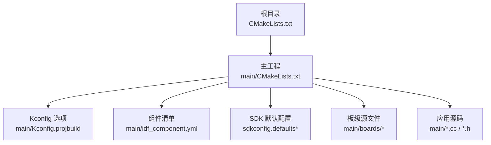
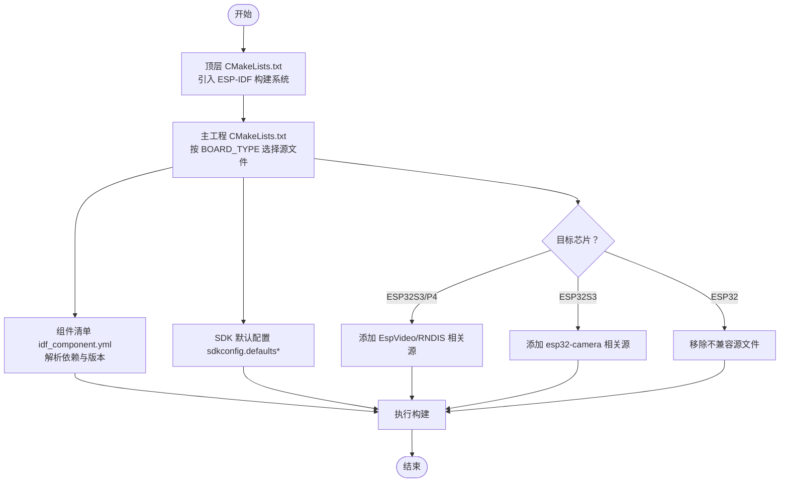
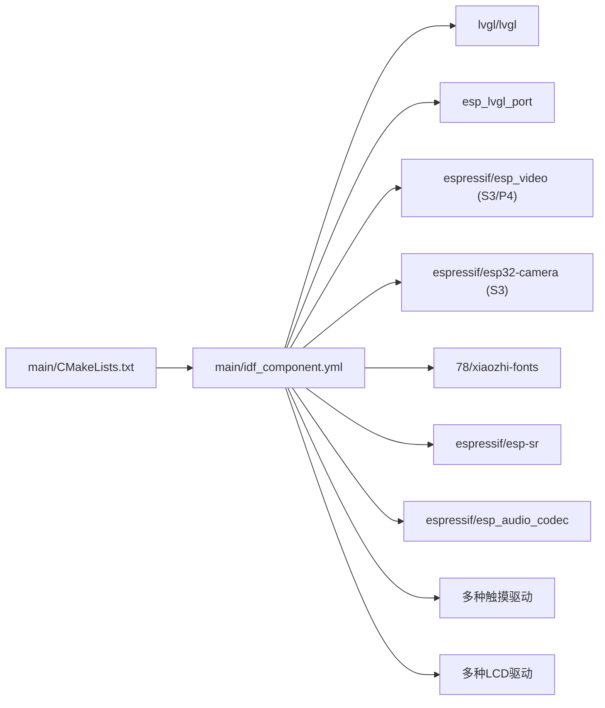
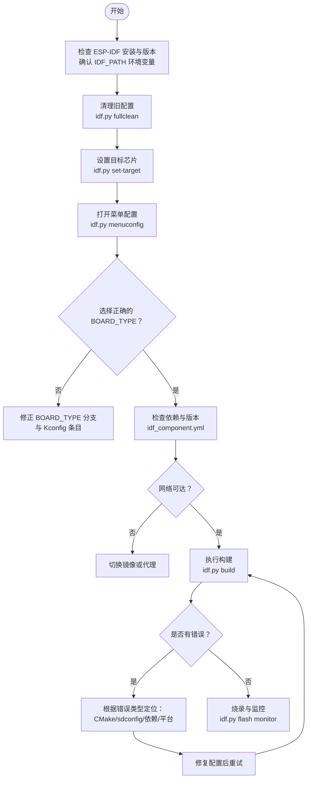

# 编译错误排查

<cite>
**本文引用的文件列表**
- [CMakeLists.txt](file://CMakeLists.txt)
- [main/CMakeLists.txt](file://main/CMakeLists.txt)
- [main/idf_component.yml](file://main/idf_component.yml)
- [sdkconfig.defaults](file://sdkconfig.defaults)
- [sdkconfig.defaults.esp32s3](file://sdkconfig.defaults.esp32s3)
- [sdkconfig.defaults.esp32c3](file://sdkconfig.defaults.esp32c3)
- [README.md](file://README.md)
- [docs/custom-board.md](file://docs/custom-board.md)
</cite>

## 目录
1. [简介](#简介)
2. [项目结构](#项目结构)
3. [核心组件](#核心组件)
4. [架构总览](#架构总览)
5. [详细组件分析](#详细组件分析)
6. [依赖关系分析](#依赖关系分析)
7. [性能与构建优化](#性能与构建优化)
8. [故障排查指南](#故障排查指南)
9. [结论](#结论)
10. [附录](#附录)

## 简介
本指南面向在 ESP-IDF 框架下开发 xiaozhi-esp32 项目的开发者，聚焦“编译期”问题的系统化诊断与修复。内容覆盖：
- CMakeLists.txt 配置错误的定位与修复
- sdkconfig 默认配置与平台差异导致的冲突
- IDF Component Manager 依赖缺失、版本不兼容问题
- 不同芯片平台（ESP32-S3、ESP32-C3、ESP32-P4 等）的特定编译问题
- 开发环境搭建常见问题（ESP-IDF 安装、工具链、路径设置）
- 完整的编译错误诊断与修复流程

## 项目结构
本项目采用 ESP-IDF 工程结构，顶层 CMakeLists.txt 引入 ESP-IDF 构建系统，并在 main 子工程中通过 Kconfig 和 CMake 条件编译选择板级实现与功能开关。idf_component.yml 声明了所有第三方组件依赖及目标平台约束。

图示来源
- [CMakeLists.txt:1-14](file://CMakeLists.txt#L1-L14)
- [main/CMakeLists.txt:1-120](file://main/CMakeLists.txt#L1-L120)
- [main/idf_component.yml:1-151](file://main/idf_component.yml#L1-L151)
- [sdkconfig.defaults:1-79](file://sdkconfig.defaults#L1-L79)

章节来源
- [CMakeLists.txt:1-14](file://CMakeLists.txt#L1-L14)
- [main/CMakeLists.txt:1-120](file://main/CMakeLists.txt#L1-L120)
- [main/idf_component.yml:1-151](file://main/idf_component.yml#L1-L151)
- [sdkconfig.defaults:1-79](file://sdkconfig.defaults#L1-L79)

## 核心组件
- 顶层 CMake 入口：包含 ESP-IDF 构建脚本、最小化构建开关、项目版本定义
- 主工程 CMake：按 BOARD_TYPE 动态选择板级源文件、字体与表情集；根据目标芯片裁剪源文件；生成语言头文件与资源包
- 组件清单 idf_component.yml：集中声明依赖库、版本范围与目标平台规则
- SDK 默认配置：全局与平台相关的编译与运行时选项（分区表、LVGL、WiFi、内存等）

章节来源
- [CMakeLists.txt:1-14](file://CMakeLists.txt#L1-L14)
- [main/CMakeLists.txt:1-120](file://main/CMakeLists.txt#L1-L120)
- [main/idf_component.yml:1-151](file://main/idf_component.yml#L1-L151)
- [sdkconfig.defaults:1-79](file://sdkconfig.defaults#L1-L79)

## 架构总览
下图展示了从顶层 CMake 到主工程、再到组件与 SDK 配置的构建链路，以及按目标芯片与板型进行条件编译的关键分支点。

图示来源
- [CMakeLists.txt:1-14](file://CMakeLists.txt#L1-L14)
- [main/CMakeLists.txt:1001-1032](file://main/CMakeLists.txt#L1001-L1032)
- [main/idf_component.yml:1-151](file://main/idf_component.yml#L1-L151)
- [sdkconfig.defaults:1-79](file://sdkconfig.defaults#L1-L79)

## 详细组件分析

### 顶层 CMakeLists.txt 关键项与常见错误
- 必须顺序包含 ESP-IDF 构建脚本，否则无法识别 idf_build_* 命令
- 启用 MINIMAL_BUILD 可减小构建规模，但需确保所需组件被正确引入
- 自定义编译选项用于抑制特定警告，避免干扰构建输出

常见错误与修复
- 未设置或找不到 IDF_PATH：检查环境变量是否指向正确的 ESP-IDF 安装目录
- cmake_minimum_required 版本过低：升级本地 CMake 至满足要求版本
- 缺少必要组件：确认 idf_component.yml 中依赖完整且网络可达

章节来源
- [CMakeLists.txt:1-14](file://CMakeLists.txt#L1-L14)

### 主工程 CMakeLists.txt 条件编译与资源生成
- 按 CONFIG_BOARD_TYPE_* 分支设置 BOARD_TYPE、内置字体与表情集
- 针对目标芯片裁剪源文件（如 ESP32 不支持的部分音频编解码器与网络模块）
- 为 ESP32S3/P4 增加视频与 RNDIS 支持；为 ESP32S3 增加摄像头支持
- 动态查找组件路径（如 ESP-SR、xiaozhi-fonts），并生成语言头文件与资源包

常见错误与修复
- 未正确选择 BOARD_TYPE：导致未匹配任何分支，BOARD_TYPE 为空，后续宏定义失败
- 目标芯片与源文件不匹配：例如在 ESP32 上编译了仅适用于 S3/P4 的源文件
- 资源下载失败：网络不可达或镜像源不可用，导致构建中断
- 组件路径未找到：ESP-SR 或字体组件未被正确解析，需检查依赖与缓存

章节来源
- [main/CMakeLists.txt:1-120](file://main/CMakeLists.txt#L1-L120)
- [main/CMakeLists.txt:1001-1032](file://main/CMakeLists.txt#L1001-L1032)
- [main/CMakeLists.txt:1071-1111](file://main/CMakeLists.txt#L1071-L1111)

### 组件清单 idf_component.yml 依赖管理与版本约束
- 集中声明各组件及其版本范围，并通过 rules 指定目标平台适用性
- 对 LVGL、esp_video、esp32-camera 等关键组件有严格版本要求
- 部分组件仅在特定目标平台生效（如 P4、S3、C3）

常见错误与修复
- 依赖版本冲突：多个组件要求同一库的不同版本，需统一版本或调整依赖
- 目标平台不匹配：在非适用平台上启用了受限组件，需在 rules 中修正
- 网络访问失败：组件仓库不可达，需切换国内镜像或代理

章节来源
- [main/idf_component.yml:1-151](file://main/idf_component.yml#L1-L151)

### SDK 默认配置 sdkconfig.defaults* 与平台差异
- 全局默认配置：分区表、LVGL 裁剪、WiFi 内存优化、mbedtls 安全选项等
- 平台差异化配置：ESP32-S3 开启 SPIRAM、更高 CPU 频率、USB 控制传输大小等；ESP32-C3 使用专用分区表与精简 WiFi 能力
- 语言与特性开关：通过 Kconfig 与 sdkconfig 控制功能启用与否

常见错误与修复
- 分区表与 Flash 容量不一致：Flashsize 与 partitions/v2/*.csv 不匹配导致烧录失败
- 内存不足：关闭不必要的 LVGL 控件、禁用企业级 WiFi 支持、减少缓冲区
- 目标平台配置错配：在 C3 上使用了 S3 专属配置，导致链接或运行异常

章节来源
- [sdkconfig.defaults:1-79](file://sdkconfig.defaults#L1-L79)
- [sdkconfig.defaults.esp32s3:1-32](file://sdkconfig.defaults.esp32s3#L1-L32)
- [sdkconfig.defaults.esp32c3:1-15](file://sdkconfig.defaults.esp32c3#L1-L15)

## 依赖关系分析
下图展示主工程与组件清单之间的依赖关系，以及按目标平台的条件启用逻辑。

图示来源
- [main/CMakeLists.txt:1001-1032](file://main/CMakeLists.txt#L1001-L1032)
- [main/idf_component.yml:1-151](file://main/idf_component.yml#L1-L151)

章节来源
- [main/CMakeLists.txt:1001-1032](file://main/CMakeLists.txt#L1001-L1032)
- [main/idf_component.yml:1-151](file://main/idf_component.yml#L1-L151)

## 性能与构建优化
- 使用 MINIMAL_BUILD 减少无关组件参与构建，缩短编译时间
- 合理裁剪 LVGL 控件与字体，降低 Flash 与 RAM 占用
- 针对目标芯片选择合适的内存与缓存配置（如 ESP32-S3 的 SPIRAM 与指令缓存）
- 关闭不必要的日志与统计信息，提升启动速度

[本节为通用指导，无需具体文件引用]

## 故障排查指南

### 一、开发环境搭建问题
- ESP-IDF 安装与版本
  - 建议安装 ESP-IDF 5.4 或以上版本，并确保命令行可用
  - 参考项目说明中的开发环境建议
- 工具链与路径
  - 确认 IDF_PATH 环境变量指向正确的 ESP-IDF 安装目录
  - Windows 下注意驱动与串口权限；Linux 下优先以获得更快编译与更少驱动问题
- 常用命令
  - 设置目标芯片：idf.py set-target <target>
  - 清理旧配置：idf.py fullclean
  - 打开菜单配置：idf.py menuconfig
  - 构建与烧录：idf.py build && idf.py flash monitor

章节来源
- [README.md:115-121](file://README.md#L115-L121)
- [docs/custom-board.md:332-357](file://docs/custom-board.md#L332-L357)

### 二、CMakeLists.txt 配置错误诊断
- 顶层 CMake 入口
  - 确认包含 ESP-IDF 构建脚本的顺序与位置
  - 检查 cmake_minimum_required 版本是否满足要求
- 主工程 CMake
  - 检查 BOARD_TYPE 分支是否正确匹配所选板型
  - 核对目标芯片条件分支（ESP32/ESP32S3/ESP32P4）下的源文件增删逻辑
  - 验证组件路径动态查找（ESP-SR、字体）是否成功
- 资源生成
  - 语言头文件生成依赖 Python 脚本与语言 JSON 文件
  - 资源下载失败时检查网络与镜像源

章节来源
- [CMakeLists.txt:1-14](file://CMakeLists.txt#L1-L14)
- [main/CMakeLists.txt:1-120](file://main/CMakeLists.txt#L1-L120)
- [main/CMakeLists.txt:1071-1111](file://main/CMakeLists.txt#L1071-L1111)

### 三、sdkconfig 配置文件问题排查
- 分区表与 Flash 容量
  - 确认 CONFIG_PARTITION_TABLE_CUSTOM_FILENAME 与 CONFIG_ESPTOOLPY_FLASHSIZE_* 一致
  - 不同平台使用不同的分区表（如 ESP32-C3 使用 16m_c3.csv）
- 内存与性能
  - 若出现内存不足，适当关闭 LVGL 控件、禁用企业级 WiFi、减少缓冲区
- 平台差异
  - ESP32-S3 启用 SPIRAM 与更高 CPU 频率，注意 USB 控制传输大小
  - ESP32-C3 禁用 IPv6 与 WPA3 SAE，减少空闲任务栈大小

章节来源
- [sdkconfig.defaults:1-79](file://sdkconfig.defaults#L1-L79)
- [sdkconfig.defaults.esp32s3:1-32](file://sdkconfig.defaults.esp32s3#L1-L32)
- [sdkconfig.defaults.esp32c3:1-15](file://sdkconfig.defaults.esp32c3#L1-L15)

### 四、依赖库缺失与版本不兼容
- 组件清单
  - 检查 idf_component.yml 中依赖的版本范围与目标平台规则
  - 对于 LVGL、esp_video、esp32-camera 等关键组件，保持与项目要求的版本一致
- 网络与镜像
  - 若在线库访问失败，尝试切换加速器或修改为国内镜像源
- 依赖冲突
  - 当多个组件要求同一库的不同版本时，优先遵循项目已指定的版本，避免自行更改

章节来源
- [main/idf_component.yml:1-151](file://main/idf_component.yml#L1-L151)

### 五、不同芯片平台特定问题
- ESP32-S3
  - 启用 SPIRAM、更高 CPU 频率、USB 控制传输大小；确保分区表与 Flash 容量匹配
  - 启用摄像头与视频相关源文件时需保证对应组件可用
- ESP32-C3
  - 使用专用分区表；禁用 IPv6 与 WPA3 SAE；减少空闲任务栈大小
- ESP32-P4
  - 启用视频与 Hosted WiFi 远程组件；注意目标平台规则限制

章节来源
- [sdkconfig.defaults.esp32s3:1-32](file://sdkconfig.defaults.esp32s3#L1-L32)
- [sdkconfig.defaults.esp32c3:1-15](file://sdkconfig.defaults.esp32c3#L1-L15)
- [main/CMakeLists.txt:1001-1032](file://main/CMakeLists.txt#L1001-L1032)
- [main/idf_component.yml:103-110](file://main/idf_component.yml#L103-L110)

### 六、完整编译错误诊断与修复流程

[此图为概念流程图，无需图示来源]

## 结论
通过系统化地检查顶层 CMake、主工程 CMake、组件清单与 SDK 默认配置，并结合目标芯片与板型的条件编译逻辑，可以高效定位与修复绝大多数编译期问题。建议在新增板型或修改依赖时，严格遵循项目既定的版本与平台规则，避免因配置不一致导致的构建失败。

[本节为总结性内容，无需具体文件引用]

## 附录

### 常用命令速查
- 设置目标芯片：idf.py set-target <target>
- 清理旧配置：idf.py fullclean
- 打开菜单配置：idf.py menuconfig
- 构建：idf.py build
- 烧录与监控：idf.py flash monitor

章节来源
- [docs/custom-board.md:332-357](file://docs/custom-board.md#L332-L357)