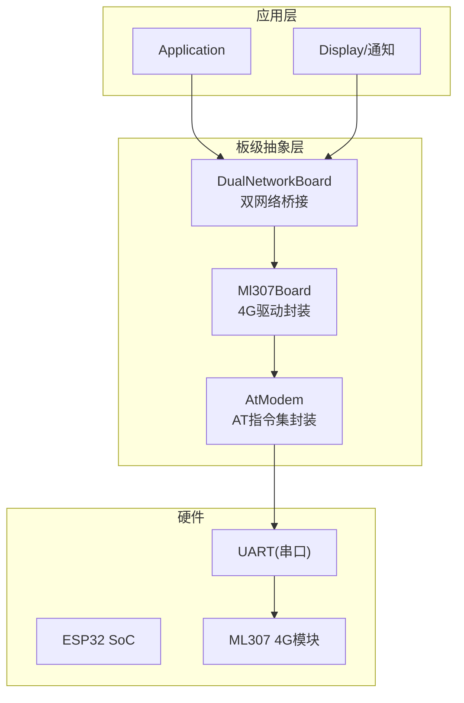
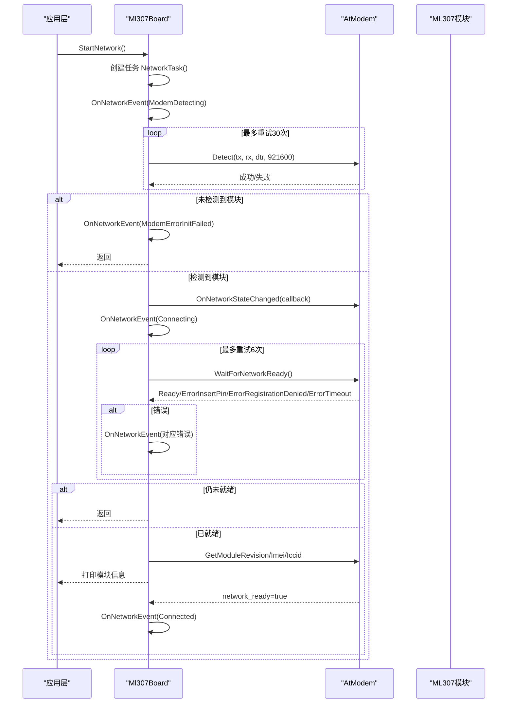
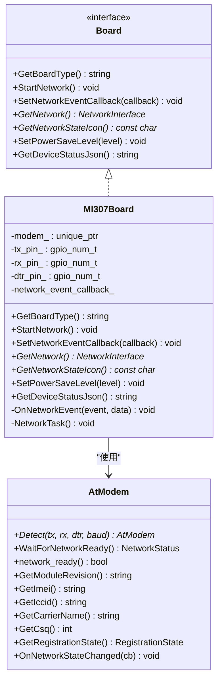
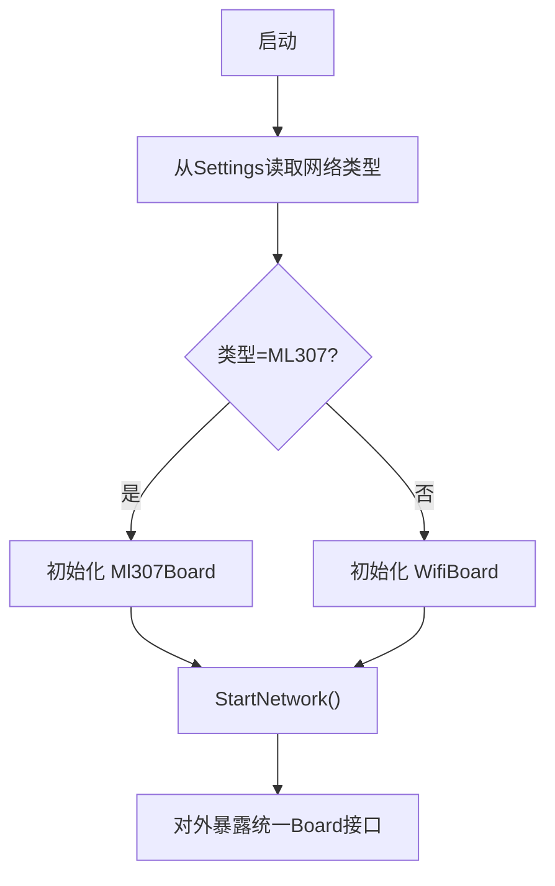
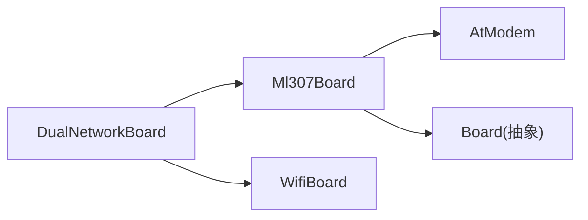

# 4G网络连接问题

<cite>
**本文引用的文件**   
- [ml307_board.h](file://main\boards\common\ml307_board.h)
- [ml307_board.cc](file://main\boards\common\ml307_board.cc)
- [dual_network_board.h](file://main\boards\common\dual_network_board.h)
- [dual_network_board.cc](file://main\boards\common\dual_network_board.cc)
- [config.h（面包板ML307）](file://main\boards\bread-compact-ml307\config.h)
- [config.h（星知立方1.54TFT ML307）](file://main\boards\xingzhi-cube-1.54tft-ml307\config.h)
</cite>

## 目录
1. [简介](#简介)
2. [项目结构](#项目结构)
3. [核心组件](#核心组件)
4. [架构总览](#架构总览)
5. [详细组件分析](#详细组件分析)
6. [依赖关系分析](#依赖关系分析)
7. [性能与稳定性考虑](#性能与稳定性考虑)
8. [故障排查指南](#故障排查指南)
9. [结论](#结论)
10. [附录：AT命令调试清单](#附录at命令调试清单)

## 简介
本文件面向使用ML307等4G模块的ESP32设备，聚焦于4G网络连接问题的系统化排查与定位。内容覆盖SIM卡识别失败、运营商注册失败、数据业务开通失败、信号质量差、网络切换失败、APN配置错误、超时与断线重连、流量控制机制，以及不同运营商网络的兼容性问题与解决方案。文档同时提供基于AT命令的调试方法与监控指标建议，帮助快速定位并解决问题。

## 项目结构
本项目中与4G连接相关的代码主要位于“common”通用板级抽象层与各具体板卡的引脚配置中：
- 通用ML307板级实现：负责4G模块检测、注册、状态上报、图标显示、设备状态JSON输出等。
- 双网络板级封装：在WiFi与ML307之间进行切换与转发。
- 各板卡引脚配置：定义ML307的TX/RX引脚，便于硬件适配与排障。

图表来源
- [ml307_board.h:1-38](file://main\boards\common\ml307_board.h#L1-L38)
- [ml307_board.cc:1-185](file://main\boards\common\ml307_board.cc#L1-L185)
- [dual_network_board.h:1-60](file://main\boards\common\dual_network_board.h#L1-L60)
- [dual_network_board.cc:1-99](file://main\boards\common\dual_network_board.cc#L1-L99)

章节来源
- [ml307_board.h:1-38](file://main\boards\common\ml307_board.h#L1-L38)
- [ml307_board.cc:1-185](file://main\boards\common\ml307_board.cc#L1-L185)
- [dual_network_board.h:1-60](file://main\boards\common\dual_network_board.h#L1-L60)
- [dual_network_board.cc:1-99](file://main\boards\common\dual_network_board.cc#L1-L99)

## 核心组件
- Ml307Board：封装ML307模块的初始化、网络注册、事件回调、信号强度图标映射、设备状态JSON生成等。
- DualNetworkBoard：在WiFi与ML307之间做统一入口，支持从设置加载当前网络类型、切换网络并重启生效。
- AtModem：底层AT指令封装（由上层调用），用于模块检测、等待网络就绪、获取CSQ/IMEI/ICCID/运营商名称等。

关键职责与交互
- 启动流程：StartNetwork创建独立任务执行NetworkTask，完成模块检测与网络注册。
- 事件回调：OnNetworkEvent将内部事件转换为外部回调，供UI或上层处理。
- 状态查询：GetNetworkStateIcon根据CSQ返回信号图标；GetDeviceStatusJson汇总音频、屏幕、电池、网络信息。

章节来源
- [ml307_board.h:1-38](file://main\boards\common\ml307_board.h#L1-L38)
- [ml307_board.cc:1-185](file://main\boards\common\ml307_board.cc#L1-L185)
- [dual_network_board.h:1-60](file://main\boards\common\dual_network_board.h#L1-L60)
- [dual_network_board.cc:1-99](file://main\boards\common\dual_network_board.cc#L1-L99)

## 架构总览
下图展示了4G连接的关键时序：模块检测→网络注册→状态回调→图标与状态JSON输出。

图表来源
- [ml307_board.cc:67-132](file://main\boards\common\ml307_board.cc#L67-L132)
- [ml307_board.cc:134-141](file://main\boards\common\ml307_board.cc#L134-L141)

## 详细组件分析

### Ml307Board 类分析
- 成员与接口
  - 私有：modem_（AtModem指针）、tx_pin_/rx_pin_/dtr_pin_、network_event_callback_
  - 公共：GetBoardType、StartNetwork、SetNetworkEventCallback、GetNetwork、GetNetworkStateIcon、SetPowerSaveLevel、GetDeviceStatusJson
- 关键逻辑
  - StartNetwork：创建FreeRTOS任务执行NetworkTask，非阻塞启动。
  - NetworkTask：模块检测（带最大重试次数）、注册网络（带最大重试次数）、错误事件分发、成功后读取模块信息。
  - OnNetworkEvent：日志记录+外部回调。
  - GetNetworkStateIcon：依据CSQ值映射到信号图标。
  - GetDeviceStatusJson：聚合音频、屏幕、电池、网络信息（含carrier、csq、signal等级）。

图表来源
- [ml307_board.h:1-38](file://main\boards\common\ml307_board.h#L1-L38)
- [ml307_board.cc:1-185](file://main\boards\common\ml307_board.cc#L1-L185)

章节来源
- [ml307_board.h:1-38](file://main\boards\common\ml307_board.h#L1-L38)
- [ml307_board.cc:1-185](file://main\boards\common\ml307_board.cc#L1-L185)

### DualNetworkBoard 双网络桥接
- 功能
  - 从Settings加载网络类型（默认ML307），仅初始化当前网络类型的板卡。
  - SwitchNetworkType：保存新类型到Settings，显示提示，延时后触发系统重启以生效。
  - 所有Board接口均转发至current_board_。
- 适用场景
  - 同一设备同时具备WiFi与4G能力，通过用户选择或策略动态切换。

图表来源
- [dual_network_board.cc:10-43](file://main\boards\common\dual_network_board.cc#L10-L43)
- [dual_network_board.cc:45-57](file://main\boards\common\dual_network_board.cc#L45-L57)

章节来源
- [dual_network_board.h:1-60](file://main\boards\common\dual_network_board.h#L1-L60)
- [dual_network_board.cc:1-99](file://main\boards\common\dual_network_board.cc#L1-L99)

### 板级引脚配置（示例）
- 面包板ML307：定义ML307_RX_PIN/ML307_TX_PIN，便于确认硬件接线。
- 星知立方1.54TFT ML307：同样定义ML307_RX_PIN/ML307_TX_PIN，并包含显示屏相关配置。

章节来源
- [config.h（面包板ML307）:52-54](file://main\boards\bread-compact-ml307\config.h#L52-L54)
- [config.h（星知立方1.54TFT ML307）:37-38](file://main\boards\xingzhi-cube-1.54tft-ml307\config.h#L37-L38)

## 依赖关系分析
- 耦合关系
  - Ml307Board依赖AtModem进行AT指令通信；依赖Board抽象作为统一接口。
  - DualNetworkBoard组合Ml307Board/WifiBoard，并通过Settings持久化网络类型。
- 外部依赖
  - FreeRTOS任务调度、ESP-IDF日志、cJSON（设备状态JSON）。
- 潜在风险
  - 若AtModem未正确初始化或串口波特率不匹配，会导致模块检测失败。
  - 网络注册阶段长时间无响应可能触发超时错误。

图表来源
- [dual_network_board.h:1-60](file://main\boards\common\dual_network_board.h#L1-L60)
- [ml307_board.h:1-38](file://main\boards\common\ml307_board.h#L1-L38)

章节来源
- [dual_network_board.h:1-60](file://main\boards\common\dual_network_board.h#L1-L60)
- [ml307_board.h:1-38](file://main\boards\common\ml307_board.h#L1-L38)

## 性能与稳定性考虑
- 任务与并发
  - 网络初始化在独立任务中运行，避免阻塞主流程。
- 重试与退避
  - 模块检测最大重试次数与间隔、网络注册最大重试次数与间隔已在实现中定义，可根据现场环境调整。
- 资源占用
  - 频繁AT查询（如CSQ、运营商名）会占用串口带宽，建议在非必要场景降低频率。
- 功耗
  - SetPowerSaveLevel在ML307路径中标记为TODO，后续可结合模块省电模式优化待机功耗。

章节来源
- [ml307_board.cc:15-18](file://main\boards\common\ml307_board.cc#L15-L18)
- [ml307_board.cc:181-184](file://main\boards\common\ml307_board.cc#L181-L184)

## 故障排查指南

### 一、SIM卡识别失败
现象
- 启动后出现“未检测到SIM卡”事件或注册阶段返回插入SIM错误。

定位步骤
- 检查模块是否检测到SIM：查看网络注册阶段的错误分支是否为“插入SIM错误”。
- 检查SIM卡物理接触与锁扣方向。
- 更换已知正常的SIM卡验证。
- 确认模块固件版本与运营商要求。

关联实现
- 网络注册阶段对“插入SIM错误”进行事件上报。

章节来源
- [ml307_board.cc:105-118](file://main\boards\common\ml307_board.cc#L105-L118)

### 二、运营商注册失败
现象
- 多次尝试后仍无法注册网络，或上报“注册被拒绝”。

定位步骤
- 观察“注册被拒绝”事件是否持续出现。
- 确认SIM卡套餐与运营商侧权限（是否欠费、是否开通漫游/数据业务）。
- 检查天线与安装位置，评估信号质量（CSQ）。
- 尝试手动选择运营商或重置网络参数。

关联实现
- 网络注册阶段对“注册被拒绝”进行事件上报。

章节来源
- [ml307_board.cc:105-118](file://main\boards\common\ml307_board.cc#L105-L118)

### 三、数据业务开通失败（APN配置）
说明
- 若模块需要显式配置APN，应在AT层或模块侧完成。本项目在设备状态JSON中输出运营商与CSQ等信息，便于判断数据通道可用性。

定位步骤
- 通过AT命令检查当前APN配置是否正确。
- 对比不同运营商APN差异，必要时更新模块配置。
- 在数据业务建立前，确保网络已就绪且信号良好。

章节来源
- [ml307_board.cc:168-179](file://main\boards\common\ml307_board.cc#L168-L179)

### 四、信号质量差
现象
- CSQ偏低导致TCP握手慢、丢包率高、视频卡顿。

定位步骤
- 通过GetNetworkStateIcon或GetDeviceStatusJson中的CSQ字段评估信号等级。
- 移动设备位置、更换天线、避开金属遮挡。
- 在弱信号区域启用更稳健的重传与超时策略。

关联实现
- 信号图标映射基于CSQ区间划分。

章节来源
- [ml307_board.cc:147-166](file://main\boards\common\ml307_board.cc#L147-L166)
- [ml307_board.cc:247-263](file://main\boards\common\ml307_board.cc#L247-L263)

### 五、网络切换失败（WiFi↔4G）
现象
- 切换后设备未恢复连接或重启未生效。

定位步骤
- 确认SwitchNetworkType已将新类型写入Settings并触发重启。
- 重启后检查默认网络类型加载逻辑。
- 分别测试WiFi与4G的连通性。

关联实现
- 切换时保存设置、显示提示、延时后重启。

章节来源
- [dual_network_board.cc:45-57](file://main\boards\common\dual_network_board.cc#L45-L57)
- [dual_network_board.cc:23-27](file://main\boards\common\dual_network_board.cc#L23-L27)

### 六、超时与断线重连
现象
- 长时间无响应或偶发断线。

定位步骤
- 关注“操作超时”事件与网络断开事件。
- 适当增加模块检测与网络注册的重试上限与间隔。
- 在上层协议层实现心跳与自动重连。

关联实现
- 模块检测与网络注册均有最大重试次数与延时。

章节来源
- [ml307_board.cc:15-18](file://main\boards\common\ml307_board.cc#L15-L18)
- [ml307_board.cc:105-123](file://main\boards\common\ml307_board.cc#L105-L123)

### 七、流量控制与拥塞
说明
- 4G链路受基站拥塞与运营商限速影响，需在上层应用做自适应：
  - 降低码率/帧率
  - 增大缓冲与重传窗口
  - 分片传输与断点续传

章节来源
- [ml307_board.cc:247-263](file://main\boards\common\ml307_board.cc#L247-L263)

### 八、不同运营商兼容性
常见问题
- APN差异、VoLTE/VoNR开关、频段差异、漫游限制。

解决建议
- 针对不同运营商维护APN白名单。
- 在模块侧预置常用APN，并在首次注册成功后校验并固化。
- 针对海外/跨境设备开启漫游与多频段扫描。

章节来源
- [ml307_board.cc:168-179](file://main\boards\common\ml307_board.cc#L168-L179)

## 结论
通过对Ml307Board与DualNetworkBoard的实现分析，可以明确4G连接的启动流程、错误事件模型与状态上报机制。实际排障应围绕SIM识别、运营商注册、APN配置、信号质量、超时与重连策略展开，并结合AT命令与设备状态JSON进行交叉验证。对于多运营商场景，建议完善APN管理与频段策略，以提升整体稳定性与用户体验。

## 附录：AT命令调试清单
以下为通用AT命令参考，用于定位4G模块相关问题（请根据模块手册确认具体命令与返回值）：
- 基础通信
  - AT：回显测试
  - AT+CGMI/AT+CGMM/AT+CGMR：查询厂商、型号、固件版本
- SIM与IMSI/ICCID
  - AT+CPIN?：SIM卡状态
  - AT+CIMI：IMSI
  - AT+CCID：ICCID
- 网络注册与运营商
  - AT+COPS=?：可用运营商列表
  - AT+COPS?：当前运营商
  - AT+CREG?：网络注册状态
- 信号质量
  - AT+CSQ：信号强度与误码率
- 数据业务与APN
  - AT+CGDCONT？：查看PDP上下文/APN
  - AT+CGACT=1,1：激活PDP上下文（按模块要求）
- 诊断与日志
  - AT+CFUN=1,1：软复位模块
  - AT+ERRO：错误码查询（视模块支持）

注意
- 上述命令仅为通用参考，具体行为请以模块官方AT手册为准。
- 在高频查询CSQ/运营商名时注意串口带宽与延迟，避免影响实时性。