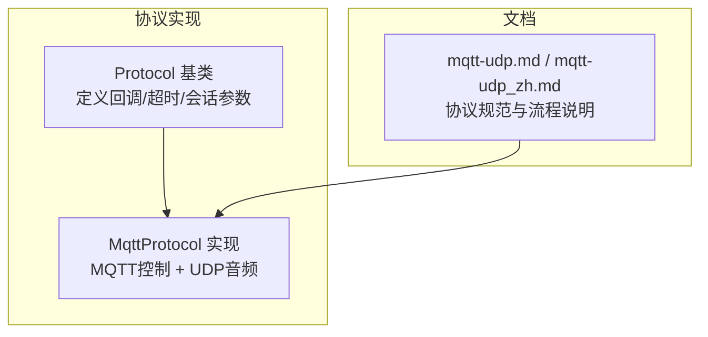
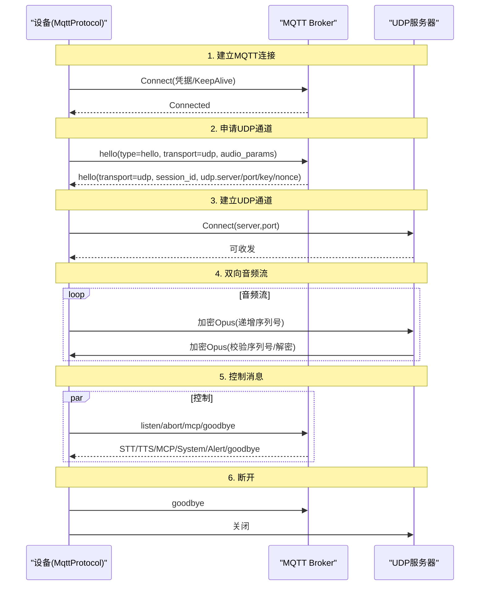
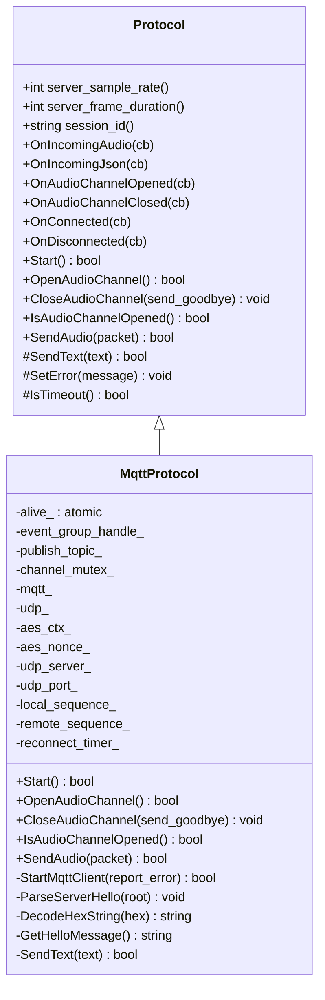
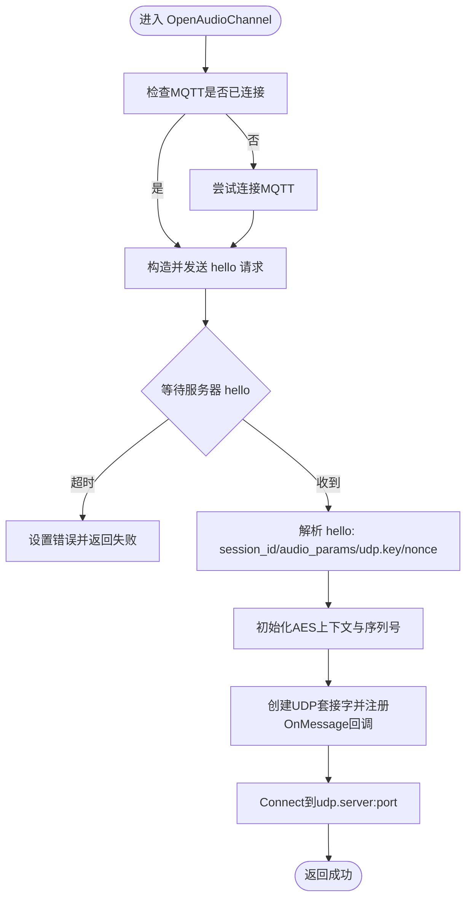
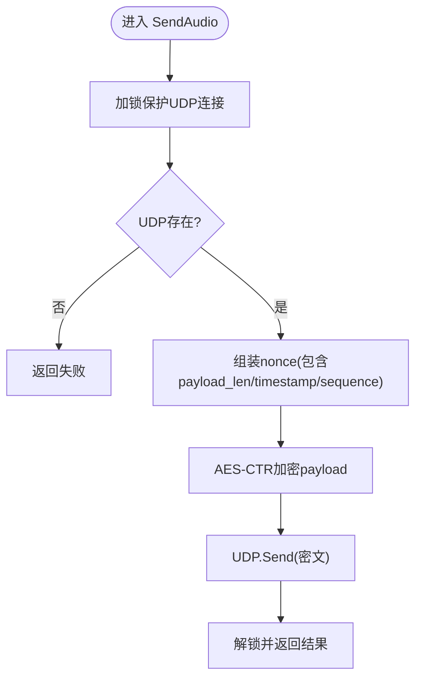
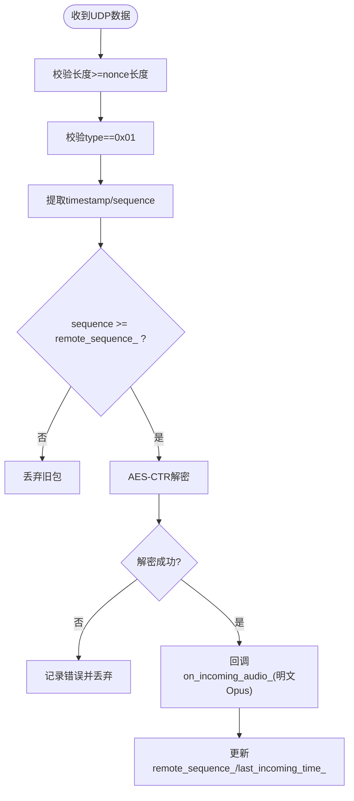
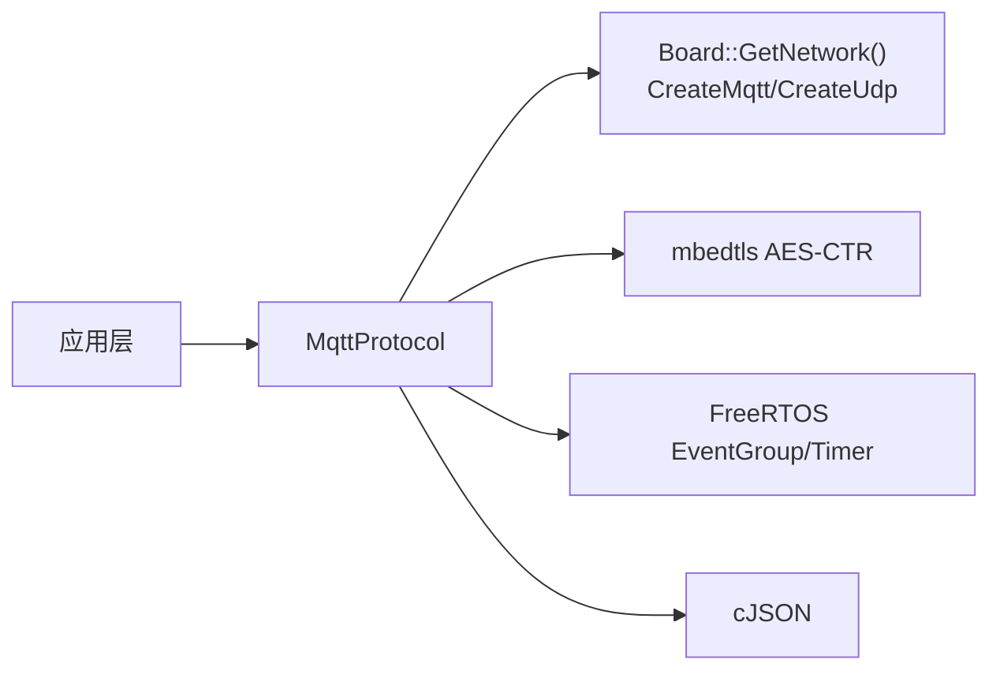

# MQTT+UDP协议问题

<cite>
**本文引用的文件**
- [main/protocols/mqtt_protocol.h](file://main/protocols/mqtt_protocol.h)
- [main/protocols/mqtt_protocol.cc](file://main/protocols/mqtt_protocol.cc)
- [main/protocols/protocol.h](file://main/protocols/protocol.h)
- [main/protocols/protocol.cc](file://main/protocols/protocol.cc)
- [docs/mqtt-udp.md](file://docs/mqtt-udp.md)
- [docs/mqtt-udp_zh.md](file://docs/mqtt-udp_zh.md)
</cite>

## 目录
1. [简介](#简介)
2. [项目结构](#项目结构)
3. [核心组件](#核心组件)
4. [架构总览](#架构总览)
5. [详细组件分析](#详细组件分析)
6. [依赖关系分析](#依赖关系分析)
7. [性能与稳定性考量](#性能与稳定性考量)
8. [故障排查指南](#故障排查指南)
9. [结论](#结论)
10. [附录：MQTT调试工具与最佳实践](#附录mqtt调试工具与最佳实践)

## 简介
本文件面向“MQTT+UDP混合协议”的端到端连接与传输问题排查，覆盖以下关键主题：
- MQTT控制通道：连接配置、Hello协商、消息类型、重连策略、超时处理
- UDP数据通道：音频包格式、AES-CTR加密、序列号与防重放、错误处理
- 协作机制：控制面与数据面分离、状态机流转、错误恢复路径
- 诊断方法：日志定位、常见问题清单、不同MQTT服务器差异与最佳实践
- 调试工具：连接测试、消息监控、性能分析建议（通用方法）

## 项目结构
本项目在“协议层”实现了MQTT+UDP混合通信。核心位于 protocols 目录，文档说明位于 docs 目录。

图表来源
- [main/protocols/protocol.h:44-95](file://main/protocols/protocol.h#L44-L95)
- [main/protocols/mqtt_protocol.h:26-62](file://main/protocols/mqtt_protocol.h#L26-L62)
- [docs/mqtt-udp.md:1-60](file://docs/mqtt-udp.md#L1-L60)

章节来源
- [main/protocols/protocol.h:44-95](file://main/protocols/protocol.h#L44-L95)
- [main/protocols/mqtt_protocol.h:26-62](file://main/protocols/mqtt_protocol.h#L26-L62)
- [docs/mqtt-udp.md:1-60](file://docs/mqtt-udp.md#L1-L60)

## 核心组件
- Protocol 基类
  - 提供统一的回调接口（音频/JSON/通道开关/网络事件）、会话参数（采样率、帧时长、session_id）、超时检测与错误上报。
- MqttProtocol 实现
  - 基于 MQTT 建立控制通道，完成 Hello 协商后建立 UDP 音频通道；负责音频包的 AES-CTR 加解密、序列号管理、重连与清理。

章节来源
- [main/protocols/protocol.h:44-95](file://main/protocols/protocol.h#L44-L95)
- [main/protocols/protocol.cc:35-90](file://main/protocols/protocol.cc#L35-L90)
- [main/protocols/mqtt_protocol.h:26-62](file://main/protocols/mqtt_protocol.h#L26-L62)
- [main/protocols/mqtt_protocol.cc:59-152](file://main/protocols/mqtt_protocol.cc#L59-L152)

## 架构总览
设备与服务器通过两条独立通道协作：
- 控制面：MQTT（JSON），用于握手、指令、状态同步
- 数据面：UDP（AES-CTR 加密的 Opus 音频），低延迟实时传输

图表来源
- [docs/mqtt-udp.md:25-58](file://docs/mqtt-udp.md#L25-L58)
- [main/protocols/mqtt_protocol.cc:215-295](file://main/protocols/mqtt_protocol.cc#L215-L295)
- [main/protocols/mqtt_protocol.cc:100-132](file://main/protocols/mqtt_protocol.cc#L100-L132)

## 详细组件分析

### 组件A：MqttProtocol 类
职责
- 启动并维护 MQTT 客户端，解析服务器 hello，建立 UDP 音频通道
- 发送/接收 JSON 控制消息，转发到上层回调
- 对 UDP 音频进行 AES-CTR 加解密，维护本地/远端序列号
- 处理断开与自动重连、超时检测

图表来源
- [main/protocols/protocol.h:44-95](file://main/protocols/protocol.h#L44-L95)
- [main/protocols/mqtt_protocol.h:26-62](file://main/protocols/mqtt_protocol.h#L26-L62)

章节来源
- [main/protocols/mqtt_protocol.h:26-62](file://main/protocols/mqtt_protocol.h#L26-L62)
- [main/protocols/mqtt_protocol.cc:13-53](file://main/protocols/mqtt_protocol.cc#L13-L53)
- [main/protocols/mqtt_protocol.cc:59-152](file://main/protocols/mqtt_protocol.cc#L59-L152)
- [main/protocols/mqtt_protocol.cc:215-295](file://main/protocols/mqtt_protocol.cc#L215-L295)
- [main/protocols/mqtt_protocol.cc:166-190](file://main/protocols/mqtt_protocol.cc#L166-L190)
- [main/protocols/mqtt_protocol.cc:243-287](file://main/protocols/mqtt_protocol.cc#L243-L287)

#### 关键流程：打开音频通道（OpenAudioChannel）

图表来源
- [main/protocols/mqtt_protocol.cc:215-295](file://main/protocols/mqtt_protocol.cc#L215-L295)
- [main/protocols/mqtt_protocol.cc:297-320](file://main/protocols/mqtt_protocol.cc#L297-L320)
- [main/protocols/mqtt_protocol.cc:322-366](file://main/protocols/mqtt_protocol.cc#L322-L366)

章节来源
- [main/protocols/mqtt_protocol.cc:215-295](file://main/protocols/mqtt_protocol.cc#L215-L295)
- [main/protocols/mqtt_protocol.cc:297-320](file://main/protocols/mqtt_protocol.cc#L297-L320)
- [main/protocols/mqtt_protocol.cc:322-366](file://main/protocols/mqtt_protocol.cc#L322-L366)

#### 关键流程：发送音频（SendAudio）

图表来源
- [main/protocols/mqtt_protocol.cc:166-190](file://main/protocols/mqtt_protocol.cc#L166-L190)

章节来源
- [main/protocols/mqtt_protocol.cc:166-190](file://main/protocols/mqtt_protocol.cc#L166-L190)

#### 关键流程：接收音频（UDP OnMessage）

图表来源
- [main/protocols/mqtt_protocol.cc:243-287](file://main/protocols/mqtt_protocol.cc#L243-L287)

章节来源
- [main/protocols/mqtt_protocol.cc:243-287](file://main/protocols/mqtt_protocol.cc#L243-L287)

### 组件B：Protocol 基类（超时与错误）
- 超时检测：默认120秒无入站数据即判定为超时
- 错误上报：统一 SetError 触发 on_network_error_ 回调
- 会话参数：server_sample_rate/server_frame_duration/session_id

章节来源
- [main/protocols/protocol.cc:81-90](file://main/protocols/protocol.cc#L81-L90)
- [main/protocols/protocol.cc:35-40](file://main/protocols/protocol.cc#L35-L40)
- [main/protocols/protocol.h:86-90](file://main/protocols/protocol.h#L86-L90)

## 依赖关系分析
- MqttProtocol 依赖
  - Network抽象：CreateMqtt/CreateUdp（由 Board::GetNetwork 提供）
  - mbedtls：AES-CTR 加解密
  - FreeRTOS：EventGroup、Timer
  - cJSON：JSON 编解码
- 外部集成点
  - MQTT Broker：端口默认8883，支持用户名/密码认证
  - UDP Server：地址/端口/密钥/随机数由服务器在 hello 响应中下发

图表来源
- [main/protocols/mqtt_protocol.cc:81-83](file://main/protocols/mqtt_protocol.cc#L81-L83)
- [main/protocols/mqtt_protocol.cc:182-189](file://main/protocols/mqtt_protocol.cc#L182-L189)
- [main/protocols/mqtt_protocol.cc:276-287](file://main/protocols/mqtt_protocol.cc#L276-L287)

章节来源
- [main/protocols/mqtt_protocol.cc:81-83](file://main/protocols/mqtt_protocol.cc#L81-L83)
- [main/protocols/mqtt_protocol.cc:182-189](file://main/protocols/mqtt_protocol.cc#L182-L189)
- [main/protocols/mqtt_protocol.cc:276-287](file://main/protocols/mqtt_protocol.cc#L276-L287)

## 性能与稳定性考量
- 并发安全：UDP 发送使用互斥锁保护
- 内存管理：智能指针管理网络对象与数据包，及时释放加密上下文
- 网络优化：UDP 连接复用、合理包大小、序列连续性检查
- 超时与重连：MQTT 断线自动重连；UDP 不自动重试，依赖重新协商

章节来源
- [main/protocols/mqtt_protocol.cc:167-168](file://main/protocols/mqtt_protocol.cc#L167-L168)
- [docs/mqtt-udp.md:341-359](file://docs/mqtt-udp.md#L341-L359)
- [docs/mqtt-udp.md:299-316](file://docs/mqtt-udp.md#L299-L316)

## 故障排查指南

### 一、MQTT 连接失败
常见原因与定位
- endpoint 未配置或为空
  - 现象：日志提示未指定 endpoint，并上报“服务端未找到”错误
  - 定位：查看 StartMqttClient 中的 endpoint 读取与判断分支
- 连接失败（网络/鉴权/证书）
  - 现象：Connect 返回失败，记录错误码并上报“服务端未连接”
  - 定位：查看 Connect 调用与错误处理分支
- 断线重连
  - 现象：OnDisconnected 触发后按固定间隔定时重连
  - 定位：查看 OnDisconnected 回调与定时器调度

排查步骤
- 确认存储中 mqtt.endpoint/client_id/username/password/keepalive/publish_topic 是否正确
- 检查网络连通性与防火墙放行（TCP 8883 或自定义端口）
- 若启用 TLS，确认证书链与主机名匹配
- 观察 OnConnected/OnDisconnected 回调日志，确认心跳与重连行为

章节来源
- [main/protocols/mqtt_protocol.cc:65-79](file://main/protocols/mqtt_protocol.cc#L65-L79)
- [main/protocols/mqtt_protocol.cc:134-152](file://main/protocols/mqtt_protocol.cc#L134-L152)
- [main/protocols/mqtt_protocol.cc:85-98](file://main/protocols/mqtt_protocol.cc#L85-L98)

### 二、Hello 协商失败（无法建立 UDP 通道）
常见原因与定位
- 未收到服务器 hello 或超时
  - 现象：等待 hello 超时，设置“服务端超时”错误
  - 定位：OpenAudioChannel 中事件等待与超时处理
- 服务器返回不支持的 transport
  - 现象：transport 非 udp，直接报错
  - 定位：ParseServerHello 中对 transport 的校验
- 缺少 udp 字段或 key/nonce 非法
  - 现象：缺失 udp 对象或 hex 解码异常
  - 定位：ParseServerHello 中对 udp/key/nonce 的解析与 AES 初始化

排查步骤
- 抓包或订阅相关主题，确认 hello 请求与响应内容
- 核对服务器返回的 udp.server/udp.port/udp.key/udp.nonce 是否与设备一致
- 确认服务器侧支持的音频参数（sample_rate/frame_duration）与设备协商一致

章节来源
- [main/protocols/mqtt_protocol.cc:227-238](file://main/protocols/mqtt_protocol.cc#L227-L238)
- [main/protocols/mqtt_protocol.cc:322-366](file://main/protocols/mqtt_protocol.cc#L322-L366)

### 三、UDP 数据传输异常
常见原因与定位
- 包格式错误
  - 现象：长度不足或 type!=0x01，直接丢弃
  - 定位：UDP OnMessage 头部校验
- 解密失败
  - 现象：AES-CTR 返回错误，记录错误并丢弃
  - 定位：解密分支返回值判断
- 序列号异常
  - 现象：sequence 小于期望值被丢弃；跳跃则告警但仍处理
  - 定位：序列号比较与更新逻辑

排查步骤
- 使用抓包工具捕获 UDP 流量，验证包头字段与加密载荷
- 核对 aes_nonce/aes_key 是否与服务器一致
- 关注 sequence 连续性与时间戳合理性，评估丢包与抖动

章节来源
- [main/protocols/mqtt_protocol.cc:243-287](file://main/protocols/mqtt_protocol.cc#L243-L287)

### 四、消息丢失与乱序
- 丢失：UDP 不可靠，结合序列号容忍度与告警日志评估丢包率
- 乱序：接收端会拒绝旧包，但允许小范围跳跃；需关注网络质量与NAT/路由抖动
- 建议：在业务层增加缓冲与重排策略（如适用）

章节来源
- [docs/mqtt-udp.md:228-240](file://docs/mqtt-udp.md#L228-L240)
- [main/protocols/mqtt_protocol.cc:259-265](file://main/protocols/mqtt_protocol.cc#L259-L265)

### 五、QoS 级别与可靠性
- 当前实现未显式设置 MQTT QoS；如需强一致控制消息，应在 MQTT 客户端封装层补充 QoS 设置与持久化策略
- 注意：高 QoS 会增加控制面开销，需权衡实时性

[本节为通用建议，不直接分析具体文件]

### 六、不同 MQTT 服务器的差异与最佳实践
- 端口与TLS
  - 默认端口 8883（TLS）；若使用明文需确保服务器开放对应端口且符合安全策略
- 认证方式
  - 用户名/密码；部分平台支持证书认证，需在设备侧配置证书链
- 主题与ACL
  - publish_topic 必须与服务端订阅规则一致；必要时配置 ACL 限制访问
- 心跳与空闲
  - keepalive 建议与服务器配置匹配，避免被中间设备踢出
- NAT/防火墙
  - UDP 需放行相应端口；企业网环境需考虑NAT穿透与端口映射

章节来源
- [docs/mqtt-udp.md:278-294](file://docs/mqtt-udp.md#L278-L294)
- [docs/mqtt-udp.md:376-396](file://docs/mqtt-udp.md#L376-L396)

## 结论
MQTT+UDP 混合协议将控制面与数据面解耦，利用 UDP 的低延迟承载音频流，并通过 AES-CTR 与序列号机制保障安全性与抗重放能力。实践中应重点关注：
- MQTT 连接与 Hello 协商的正确性
- UDP 密钥/随机数一致性、端口可达性与防火墙策略
- 序列号连续性与丢包告警
- 超时与重连策略的调优

## 附录：MQTT调试工具与最佳实践

### 常用工具与方法
- MQTT 连接测试
  - 使用命令行或图形化工具连接 broker，验证端口、TLS、用户名/密码
  - 订阅/发布测试主题，确认 publish_topic 与 ACL 正确
- 消息监控
  - 订阅所有主题或使用通配符，抓取 hello/listen/abort/mcp/goodbye 等消息
  - 对比设备端日志与服务器端日志，定位时序与字段差异
- 性能分析
  - 统计连接成功率、重连次数、hello 协商耗时
  - 监控 UDP 丢包率、解密失败率、序列号跳跃频率
  - 测量端到端时延（从采集到播放）

[本节为通用指导，不直接分析具体文件]