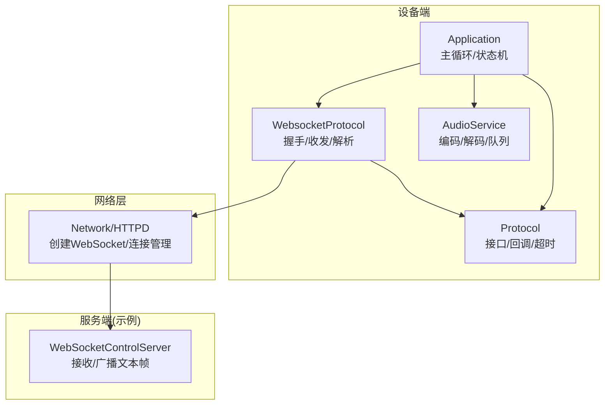
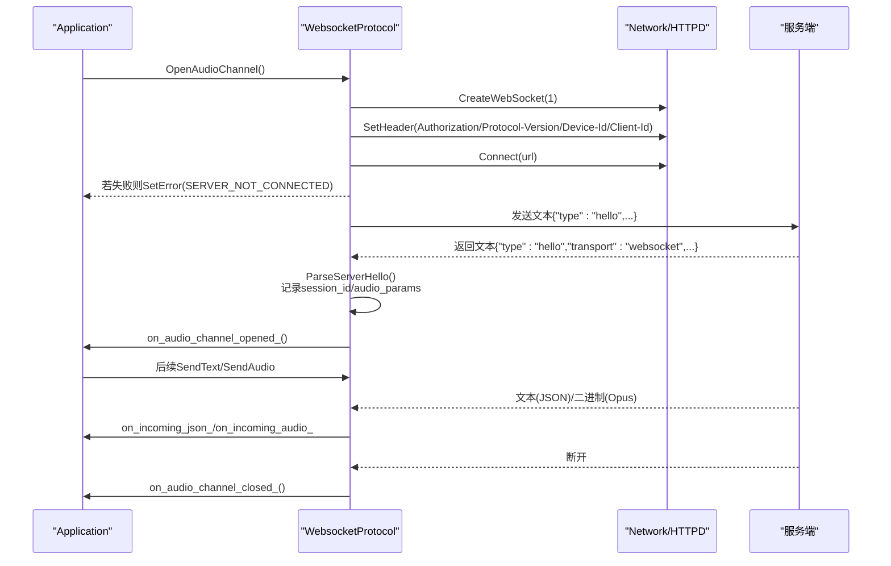
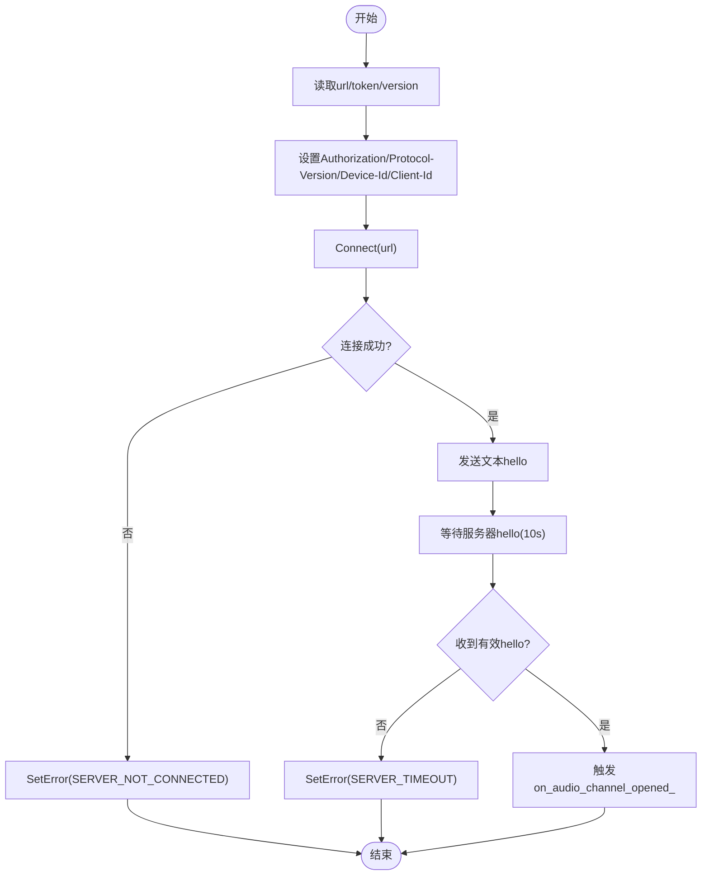
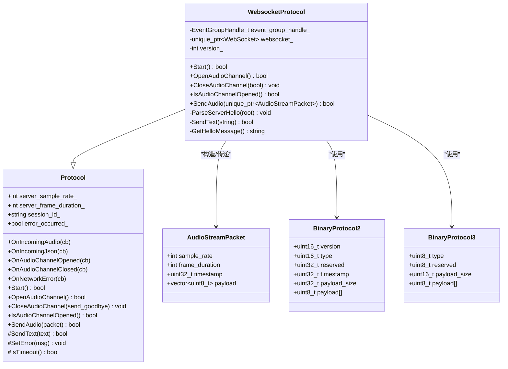
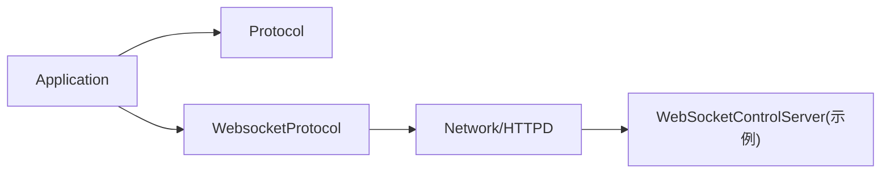
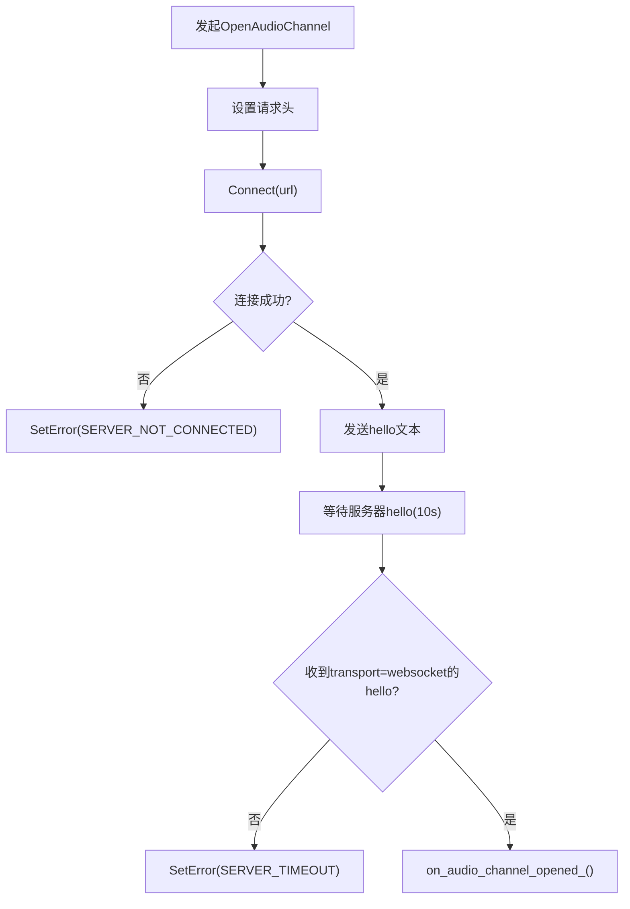

# WebSocket协议问题

<cite>
**本文引用的文件**   
- [main/protocols/websocket_protocol.h](file://main/protocols/websocket_protocol.h)
- [main/protocols/websocket_protocol.cc](file://main/protocols/websocket_protocol.cc)
- [main/protocols/protocol.h](file://main/protocols/protocol.h)
- [main/application.cc](file://main/application.cc)
- [docs/websocket.md](file://docs/websocket.md)
- [docs/websocket_zh.md](file://docs/websocket_zh.md)
- [main/boards/electron-bot/websocket_control_server.h](file://main/boards/electron-bot/websocket_control_server.h)
- [main/boards/electron-bot/websocket_control_server.cc](file://main/boards/electron-bot/websocket_control_server.cc)
</cite>

## 目录
1. [引言](#引言)
2. [项目结构](#项目结构)
3. [核心组件](#核心组件)
4. [架构总览](#架构总览)
5. [详细组件分析](#详细组件分析)
6. [依赖关系分析](#依赖关系分析)
7. [性能与稳定性考量](#性能与稳定性考量)
8. [故障排查指南](#故障排查指南)
9. [结论](#结论)
10. [附录：调试工具与实践建议](#附录调试工具与实践建议)

## 引言
本文件面向在嵌入式设备端集成或对接该项目的开发者，聚焦于WebSocket连接建立、握手失败、消息收发异常等问题的系统化排查。文档基于代码实现梳理了认证令牌、协议版本、请求头配置等关键点的诊断方法，并解释了心跳检测、断线重连策略、消息队列管理等机制的实现现状与改进建议。同时提供不同服务器兼容性与安全配置的注意事项，以及实用的调试手段（连接测试、抓包、性能分析）。

## 项目结构
与WebSocket相关的关键位置如下：
- 协议抽象与实现：Protocol接口定义与WebsocketProtocol实现
- 应用层编排：Application负责状态机、事件分发、音频服务与协议的协作
- 协议文档：websocket.md / websocket_zh.md 描述握手、JSON消息、二进制帧格式
- 示例服务端：electron-bot中的本地WebSocket控制服务器（用于演示/调试）

图示来源
- [main/application.cc:473-610](file://main/application.cc#L473-L610)
- [main/protocols/websocket_protocol.h:13-32](file://main/protocols/websocket_protocol.h#L13-L32)
- [main/protocols/websocket_protocol.cc:83-201](file://main/protocols/websocket_protocol.cc#L83-L201)
- [main/boards/electron-bot/websocket_control_server.h:9-31](file://main/boards/electron-bot/websocket_control_server.h#L9-L31)
- [main/boards/electron-bot/websocket_control_server.cc:81-110](file://main/boards/electron-bot/websocket_control_server.cc#L81-L110)

章节来源
- [main/application.cc:473-610](file://main/application.cc#L473-L610)
- [main/protocols/websocket_protocol.h:13-32](file://main/protocols/websocket_protocol.h#L13-L32)
- [main/protocols/websocket_protocol.cc:83-201](file://main/protocols/websocket_protocol.cc#L83-L201)
- [docs/websocket.md:1-128](file://docs/websocket.md#L1-L128)
- [docs/websocket_zh.md:1-78](file://docs/websocket_zh.md#L1-L78)

## 核心组件
- Protocol接口
  - 定义音频通道生命周期、文本/二进制发送、回调注册、错误与超时处理等能力。
  - 包含公共成员：server_sample_rate_、server_frame_duration_、session_id_、last_incoming_time_、error_occurred_等。
- WebsocketProtocol实现
  - OpenAudioChannel：读取URL/Token/Version，设置请求头，建立连接，发送hello，等待服务器hello，触发“通道打开”回调。
  - SendText/SendAudio：文本走WS文本帧；音频按版本封装为v1/v2/v3二进制帧。
  - OnData：区分binary/text，解析JSON的type字段，处理hello并设置事件组，其他JSON交由上层on_incoming_json_处理。
  - OnDisconnected：通知上层关闭通道。
- Application
  - 初始化协议实例（根据OTA配置选择MQTT或WebSocket），注册各类回调（连接、断开、错误、音频、JSON）。
  - 主循环中处理网络事件、音频发送队列、唤醒词、VAD变化等。
  - 当网络断开时主动关闭当前会话；收到TTS start/stop、STT、LLM、MCP、System、Alert等消息进行UI/状态切换。

章节来源
- [main/protocols/protocol.h:44-95](file://main/protocols/protocol.h#L44-L95)
- [main/protocols/websocket_protocol.h:13-32](file://main/protocols/websocket_protocol.h#L13-L32)
- [main/protocols/websocket_protocol.cc:83-201](file://main/protocols/websocket_protocol.cc#L83-L201)
- [main/application.cc:473-610](file://main/application.cc#L473-L610)

## 架构总览
WebSocket握手与数据流时序如下：

图示来源
- [main/protocols/websocket_protocol.cc:83-201](file://main/protocols/websocket_protocol.cc#L83-L201)
- [main/application.cc:498-519](file://main/application.cc#L498-L519)

章节来源
- [main/protocols/websocket_protocol.cc:83-201](file://main/protocols/websocket_protocol.cc#L83-L201)
- [main/application.cc:498-519](file://main/application.cc#L498-L519)

## 详细组件分析

### 握手与认证流程
- 请求头
  - Authorization：支持Bearer token，若未包含空格会自动补全前缀。
  - Protocol-Version：与hello中的version一致。
  - Device-Id：设备MAC地址。
  - Client-Id：软件UUID。
- hello协商
  - 客户端发送hello，携带features、transport、audio_params。
  - 服务端需返回transport=websocket的hello，可下发session_id与audio_params。
  - 客户端等待10秒，超时则报错SERVER_TIMEOUT。

图示来源
- [main/protocols/websocket_protocol.cc:83-201](file://main/protocols/websocket_protocol.cc#L83-L201)
- [docs/websocket.md:83-128](file://docs/websocket.md#L83-L128)

章节来源
- [main/protocols/websocket_protocol.cc:83-201](file://main/protocols/websocket_protocol.cc#L83-L201)
- [docs/websocket.md:83-128](file://docs/websocket.md#L83-L128)

### 文本与二进制消息处理
- 文本JSON
  - 解析type字段，hello由内部ParseServerHello处理，其余交给on_incoming_json_。
  - 缺失type字段会记录日志并忽略。
- 二进制音频
  - v1：直接Opus帧。
  - v2：BinaryProtocol2（含timestamp、payload_size等）。
  - v3：BinaryProtocol3（轻量头部）。
  - 接收侧按版本解包后统一包装为AudioStreamPacket，交由上层解码播放。

图示来源
- [main/protocols/protocol.h:10-31](file://main/protocols/protocol.h#L10-L31)
- [main/protocols/protocol.h:44-95](file://main/protocols/protocol.h#L44-L95)
- [main/protocols/websocket_protocol.h:13-32](file://main/protocols/websocket_protocol.h#L13-L32)
- [main/protocols/websocket_protocol.cc:28-72](file://main/protocols/websocket_protocol.cc#L28-L72)

章节来源
- [main/protocols/protocol.h:10-31](file://main/protocols/protocol.h#L10-L31)
- [main/protocols/protocol.h:44-95](file://main/protocols/protocol.h#L44-L95)
- [main/protocols/websocket_protocol.h:13-32](file://main/protocols/websocket_protocol.h#L13-L32)
- [main/protocols/websocket_protocol.cc:28-72](file://main/protocols/websocket_protocol.cc#L28-L72)

### 错误处理与超时
- 连接失败：Connect失败时设置错误码并返回。
- 握手超时：等待服务器hello超过10秒，设置错误码并返回。
- 文本发送失败：记录错误并设置通用服务器错误。
- 断线：OnDisconnected回调触发，通知上层关闭通道。
- JSON缺失type：记录日志并忽略。

章节来源
- [main/protocols/websocket_protocol.cc:175-201](file://main/protocols/websocket_protocol.cc#L175-L201)
- [main/protocols/websocket_protocol.cc:60-72](file://main/protocols/websocket_protocol.cc#L60-L72)
- [main/protocols/websocket_protocol.cc:168-173](file://main/protocols/websocket_protocol.cc#L168-L173)
- [docs/websocket.md:402-440](file://docs/websocket.md#L402-L440)

### 心跳、断线重连与消息队列
- 心跳机制
  - 代码中未发现显式的心跳发送逻辑。
  - 通过last_incoming_time_与IsTimeout()结合上层判断是否超时（具体IsTimeout实现未在片段中展示，但存在该能力）。
- 断线重连
  - 当前实现未内置自动重连；断开后仅回调on_audio_channel_closed_，由上层决定行为。
  - Application在网络断开时会主动关闭当前会话，避免资源泄漏。
- 消息队列
  - 音频发送采用队列模型：AudioService维护发送队列，主循环在有可用空间时批量弹出并调用protocol_->SendAudio。
  - 文本消息无专用队列，直接通过底层WS发送。

章节来源
- [main/application.cc:220-226](file://main/application.cc#L220-L226)
- [main/application.cc:286-297](file://main/application.cc#L286-L297)
- [main/protocols/protocol.h:86-95](file://main/protocols/protocol.h#L86-L95)

### 兼容性要点与安全配置
- 兼容性
  - 二进制协议版本：v1/v2/v3，需在设置中指定并与服务端一致。
  - hello必须包含transport=websocket，否则会被拒绝。
  - audio_params协商：sample_rate/frame_duration可能影响播放质量与延迟。
- 安全
  - 建议使用HTTPS/WSS（取决于部署环境），并在服务端校验Authorization Bearer token。
  - 限制最大并发连接数、启用TLS、白名单IP等。
  - 对非法JSON或缺失type的消息应被服务端拒绝。

章节来源
- [docs/websocket.md:96-128](file://docs/websocket.md#L96-L128)
- [docs/websocket.md:83-93](file://docs/websocket.md#L83-L93)
- [docs/websocket.md:414-440](file://docs/websocket.md#L414-L440)

## 依赖关系分析
- Application依赖Protocol接口，运行时动态选择WebsocketProtocol或MqttProtocol。
- WebsocketProtocol依赖底层WebSocket对象（由Board::GetNetwork().CreateWebSocket创建）。
- Electron-bot示例服务端提供本地WebSocket控制能力，便于联调。

图示来源
- [main/application.cc:473-487](file://main/application.cc#L473-L487)
- [main/protocols/websocket_protocol.cc:94-99](file://main/protocols/websocket_protocol.cc#L94-L99)
- [main/boards/electron-bot/websocket_control_server.cc:81-110](file://main/boards/electron-bot/websocket_control_server.cc#L81-L110)

章节来源
- [main/application.cc:473-487](file://main/application.cc#L473-L487)
- [main/protocols/websocket_protocol.cc:94-99](file://main/protocols/websocket_protocol.cc#L94-L99)
- [main/boards/electron-bot/websocket_control_server.cc:81-110](file://main/boards/electron-bot/websocket_control_server.cc#L81-L110)

## 性能与稳定性考量
- 音频路径
  - 上行：编码器输出进入发送队列，主循环按需推送至WS，减少阻塞。
  - 下行：二进制Opus帧到达后入解码队列，避免阻塞网络线程。
- 版本选择
  - v2带时间戳，适合服务端AEC场景；v3更轻量；v1最简。
- 资源与功耗
  - 连接建立与活跃期间提升性能模式，空闲时降低功耗。
- 超时与健壮性
  - 握手超时保护；文本发送失败快速上报错误；断线及时清理状态。

[本节为通用指导，不直接分析具体文件]

## 故障排查指南

### 常见错误与定位
- 握手失败（无法连接）
  - 现象：日志出现连接失败错误码，界面提示无法连接。
  - 检查项：URL是否正确、网络可达、防火墙/代理放行、证书与域名。
  - 参考：OpenAudioChannel连接失败分支。
- 握手超时（未收到服务器hello）
  - 现象：等待10秒后报超时错误。
  - 检查项：服务端是否返回transport=websocket的hello；是否存在鉴权拦截导致握手被拒。
  - 参考：等待服务器hello事件超时分支。
- 认证令牌无效
  - 现象：握手阶段被拒绝或会话立即断开。
  - 检查项：Authorization头是否为Bearer token；token是否过期；服务端校验逻辑。
  - 参考：设置Authorization头逻辑。
- 协议版本不兼容
  - 现象：二进制帧解析错误或音频无声。
  - 检查项：settings.version与服务端一致；hello.version与Protocol-Version一致。
  - 参考：SendAudio按版本打包、OnData按版本解包。
- 协议头配置错误
  - 现象：服务端无法识别设备或拒绝握手。
  - 检查项：Protocol-Version、Device-Id、Client-Id是否设置；token前缀是否自动补齐。
  - 参考：SetHeader调用处。
- 文本消息缺失type
  - 现象：设备端记录缺失type日志并忽略。
  - 检查项：服务端JSON是否包含type字段。
  - 参考：JSON解析分支。
- 断线重连
  - 现象：连接意外断开后无自动恢复。
  - 检查项：当前未内置自动重连；可在上层监听on_audio_channel_closed_后触发重试。
  - 参考：OnDisconnected回调。

章节来源
- [main/protocols/websocket_protocol.cc:175-201](file://main/protocols/websocket_protocol.cc#L175-L201)
- [main/protocols/websocket_protocol.cc:101-110](file://main/protocols/websocket_protocol.cc#L101-L110)
- [main/protocols/websocket_protocol.cc:28-58](file://main/protocols/websocket_protocol.cc#L28-L58)
- [main/protocols/websocket_protocol.cc:148-166](file://main/protocols/websocket_protocol.cc#L148-L166)
- [main/protocols/websocket_protocol.cc:168-173](file://main/protocols/websocket_protocol.cc#L168-L173)

### 典型流程图（握手失败）

图示来源
- [main/protocols/websocket_protocol.cc:83-201](file://main/protocols/websocket_protocol.cc#L83-L201)

## 结论
本项目WebSocket实现以简洁稳健为目标：明确的握手流程、清晰的文本/二进制分流、完善的错误上报与状态回调。对于生产环境，建议在上层补充心跳保活与断线重连策略，完善鉴权与TLS配置，并通过抓包与日志联合定位问题。

[本节为总结，不直接分析具体文件]

## 附录：调试工具与实践建议
- 连接测试
  - 使用浏览器或命令行工具（如wscat）直连服务端，验证握手与hello交互是否符合预期。
  - 在Electron-Bot板子上可使用内置的WebSocketControlServer作为简易服务端进行联调。
- 消息抓包
  - 使用Wireshark抓取TCP+WebSocket帧，过滤端口与协议，查看文本与二进制载荷。
  - 关注握手阶段请求头（Authorization、Protocol-Version、Device-Id、Client-Id）与hello内容。
- 性能分析
  - 观察音频发送队列占用与CPU占用，调整OPUS帧时长与采样率。
  - 对比v2/v3版本的开销差异，评估是否需要引入时间戳。
- 兼容性验证
  - 在不同服务器（Nginx/Traefik/自研）上验证握手与长连接稳定性。
  - 确认TLS证书链、SNI、反向代理对WebSocket升级的支持。

章节来源
- [main/boards/electron-bot/websocket_control_server.h:9-31](file://main/boards/electron-bot/websocket_control_server.h#L9-L31)
- [main/boards/electron-bot/websocket_control_server.cc:81-110](file://main/boards/electron-bot/websocket_control_server.cc#L81-L110)
- [docs/websocket.md:1-128](file://docs/websocket.md#L1-L128)