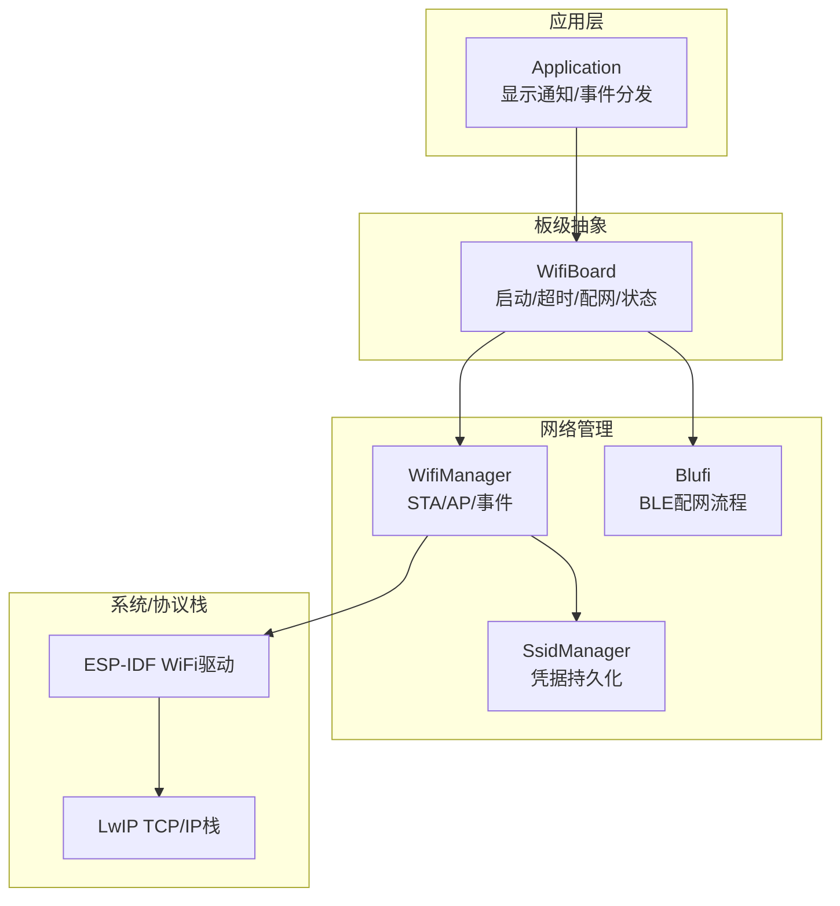
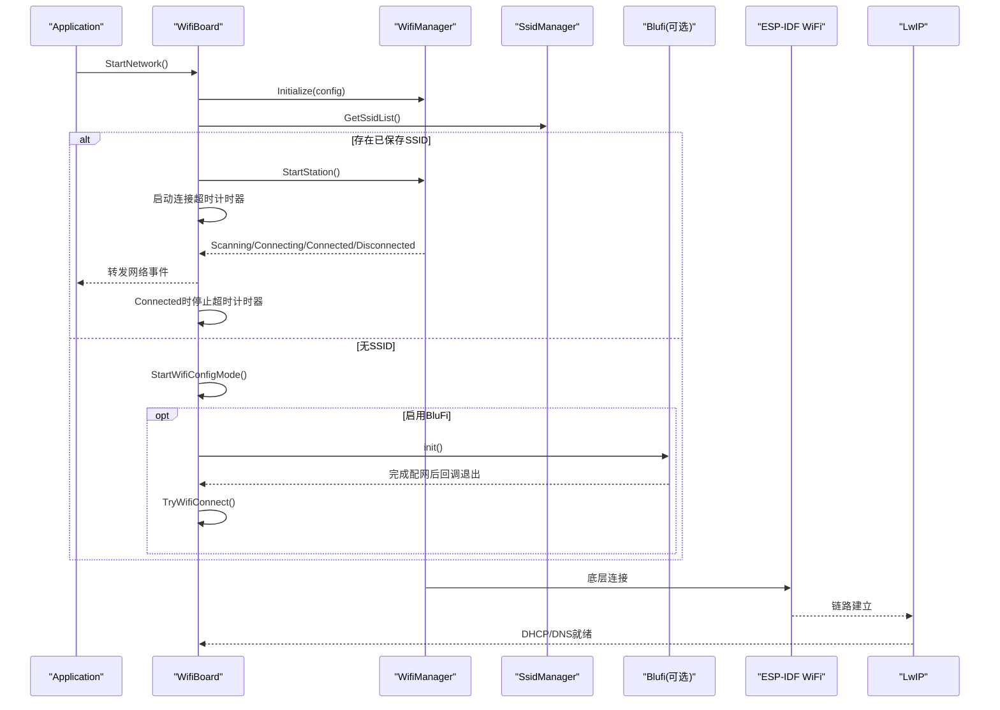
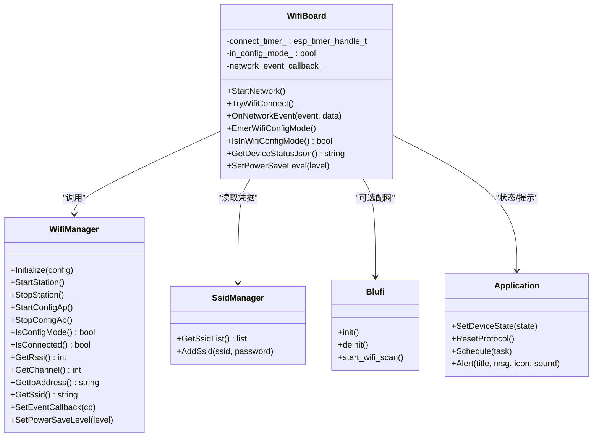
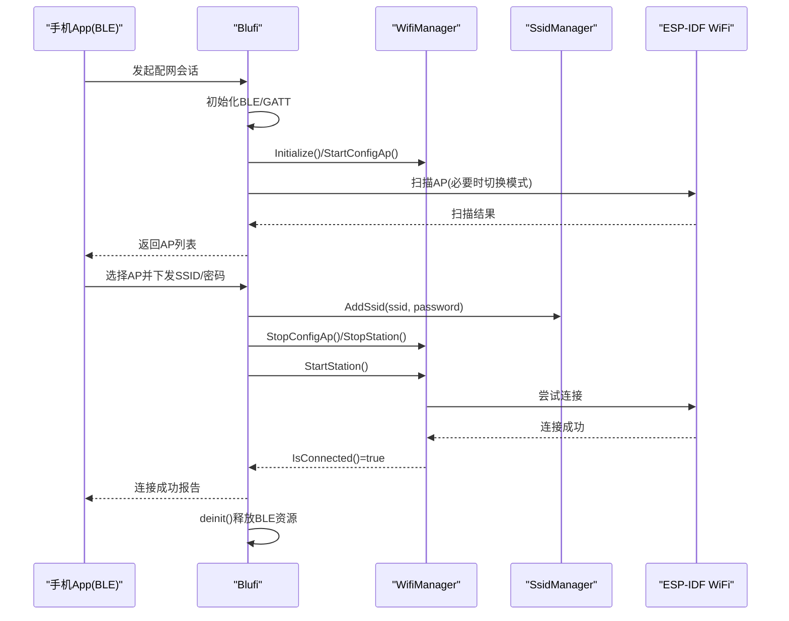
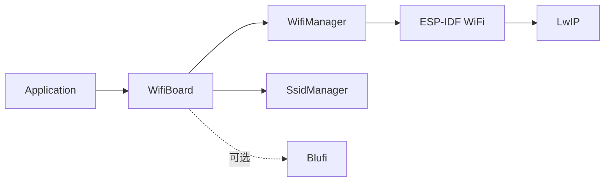
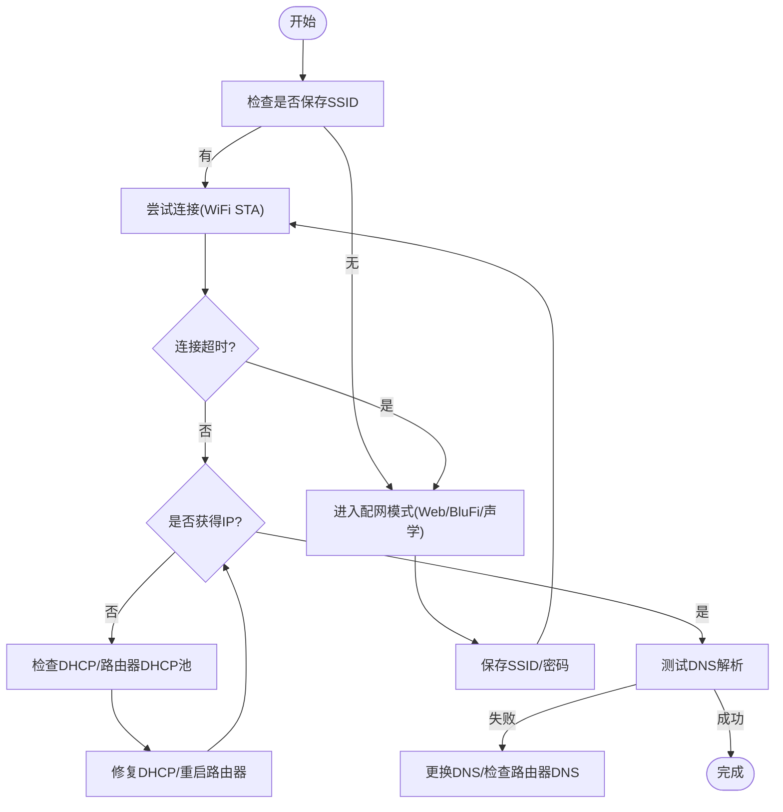

# WiFi连接问题

<cite>
**本文引用的文件**   
- [wifi_board.cc](file://main/boards/common/wifi_board.cc)
- [wifi_board.h](file://main/boards/common/wifi_board.h)
- [blufi.cpp](file://main/boards/common/blufi.cpp)
- [application.cc](file://main/application.cc)
- [idf_component.yml](file://main/idf_component.yml)
- [sdkconfig.defaults.esp32s3](file://sdkconfig.defaults.esp32s3)
- [blufi.md](file://docs/blufi.md)
- [blufi_zh.md](file://docs/blufi_zh.md)
</cite>

## 目录
1. [简介](#简介)
2. [项目结构](#项目结构)
3. [核心组件](#核心组件)
4. [架构总览](#架构总览)
5. [详细组件分析](#详细组件分析)
6. [依赖分析](#依赖分析)
7. [性能与稳定性考量](#性能与稳定性考量)
8. [故障排查指南](#故障排查指南)
9. [结论](#结论)
10. [附录](#附录)

## 简介
本文件面向在ESP32平台上使用小智固件的工程师与用户，聚焦WiFi连接问题的系统化排查与解决。内容覆盖：无法连接热点、认证失败、IP获取失败、DNS解析异常、信号弱与信道干扰、路由器配置不兼容、断线重连机制原理与配置、调试工具与日志分析方法，以及WPA2/WPA3安全协议相关问题与解决方案。文档基于仓库中实际实现进行说明，并提供可追溯的代码级来源与图示。

## 项目结构
本项目采用“板级抽象 + 网络管理”的分层设计。WiFi相关能力集中在通用板级实现与外部组件：
- 通用WiFi板级封装：负责初始化、事件转发、配网模式切换、状态上报等
- 蓝牙配网（BluFi）：通过BLE下发SSID/密码并驱动WiFi连接
- 应用层：对网络事件进行UI提示与状态同步
- 组件依赖：esp-wifi-connect用于凭据存储与连接管理；LwIP提供TCP/IP栈

图表来源
- [wifi_board.cc:52-104](file://main/boards/common/wifi_board.cc#L52-L104)
- [blufi.cpp:662-779](file://main/boards/common/blufi.cpp#L662-L779)
- [idf_component.yml:22](file://main/idf_component.yml#L22)

章节来源
- [wifi_board.cc:52-104](file://main/boards/common/wifi_board.cc#L52-L104)
- [blufi.cpp:662-779](file://main/boards/common/blufi.cpp#L662-L779)
- [idf_component.yml:22](file://main/idf_component.yml#L22)

## 核心组件
- WifiBoard：封装WiFi生命周期、连接超时、配网模式切换、网络事件转发、设备状态JSON输出（含RSSI、信道、IP、MAC等）。
- Blufi：BLE配网实现，负责扫描AP、接收凭据、写入SsidManager、驱动连接与结果回传。
- Application：处理网络事件，展示连接/断开提示，触发主事件标志。
- SsidManager：由esp-wifi-connect组件提供，负责凭据持久化与自动连接。
- LwIP：TCP/IP协议栈，负责DHCP、DNS、Socket等上层网络功能。

章节来源
- [wifi_board.h:9-67](file://main/boards/common/wifi_board.h#L9-L67)
- [wifi_board.cc:52-104](file://main/boards/common/wifi_board.cc#L52-L104)
- [blufi.cpp:662-779](file://main/boards/common/blufi.cpp#L662-L779)
- [application.cc:114-143](file://main/application.cc#L114-L143)
- [idf_component.yml:22](file://main/idf_component.yml#L22)

## 架构总览
下图展示了从开机到成功联网的关键流程，包括超时保护与配网入口。

图表来源
- [wifi_board.cc:52-104](file://main/boards/common/wifi_board.cc#L52-L104)
- [blufi.cpp:662-779](file://main/boards/common/blufi.cpp#L662-L779)

## 详细组件分析

### 组件A：WifiBoard（连接与配网编排）
- 职责
  - 初始化WifiManager并注册事件回调
  - 根据SsidManager是否有凭据决定直连或进入配网
  - 连接超时保护：超时则停止STA并进入配网
  - 统一对外暴露网络事件（扫描/连接/连接成功/断开/配网进入/退出）
  - 提供设备状态JSON（包含SSID、RSSI、信道、IP、MAC等）
  - 支持功率等级设置（低功耗/均衡/高性能）
- 关键行为
  - 连接超时：默认60秒，超时后停止STA并进入配网
  - 配网模式：支持热点Web配网、BluFi、声学配网（按编译选项）
  - 图标与信号强度：根据RSSI返回不同图标与信号等级
  - 事件透传：将底层WiFi事件转换为上层统一事件

图表来源
- [wifi_board.h:9-67](file://main/boards/common/wifi_board.h#L9-L67)
- [wifi_board.cc:52-104](file://main/boards/common/wifi_board.cc#L52-L104)
- [blufi.cpp:662-779](file://main/boards/common/blufi.cpp#L662-L779)
- [application.cc:114-143](file://main/application.cc#L114-L143)

章节来源
- [wifi_board.cc:52-104](file://main/boards/common/wifi_board.cc#L52-L104)
- [wifi_board.cc:106-157](file://main/boards/common/wifi_board.cc#L106-L157)
- [wifi_board.cc:159-197](file://main/boards/common/wifi_board.cc#L159-L197)
- [wifi_board.cc:199-242](file://main/boards/common/wifi_board.cc#L199-L242)
- [wifi_board.cc:249-282](file://main/boards/common/wifi_board.cc#L249-L282)
- [wifi_board.cc:284-299](file://main/boards/common/wifi_board.cc#L284-L299)
- [wifi_board.cc:301-357](file://main/boards/common/wifi_board.cc#L301-L357)

### 组件B：BluFi（BLE配网）
- 职责
  - BLE初始化与GATT服务注册
  - 扫描周边AP并发送列表给手机App
  - 接收SSID/密码，写入SsidManager并驱动STA连接
  - 连接成功后上报额外信息（如BSSID），并在完成后释放资源
- 关键点
  - 若当前为AP模式，会临时切换到STA以执行扫描
  - 连接等待循环与超时控制
  - 与WifiManager协同：初始化、停止/启动STA、查询连接状态

图表来源
- [blufi.cpp:662-779](file://main/boards/common/blufi.cpp#L662-L779)
- [blufi.cpp:536-602](file://main/boards/common/blufi.cpp#L536-L602)
- [blufi.cpp:523-534](file://main/boards/common/blufi.cpp#L523-L534)

章节来源
- [blufi.cpp:662-779](file://main/boards/common/blufi.cpp#L662-L779)
- [blufi.cpp:536-602](file://main/boards/common/blufi.cpp#L536-L602)
- [blufi.cpp:523-534](file://main/boards/common/blufi.cpp#L523-L534)

### 组件C：Application（网络事件与UI联动）
- 职责
  - 订阅网络事件，显示连接/断开提示
  - 设置主事件标志位，供其他模块等待网络就绪
- 注意
  - 配网模式进入/退出由WifiBoard内部处理，此处仅做简单分支

章节来源
- [application.cc:114-143](file://main/application.cc#L114-L143)

## 依赖分析
- 组件耦合
  - WifiBoard强依赖WifiManager与SsidManager，弱依赖Blufi（编译开关）
  - Blufi依赖WifiManager与底层WiFi驱动，间接依赖LwIP
  - Application仅依赖事件接口，低耦合
- 外部依赖
  - esp-wifi-connect：提供SsidManager与凭据持久化
  - LwIP：DHCP/DNS/TCP/UDP
- 可能的环依赖
  - 通过事件回调与任务创建解耦，避免直接循环依赖

图表来源
- [idf_component.yml:22](file://main/idf_component.yml#L22)
- [wifi_board.cc:52-104](file://main/boards/common/wifi_board.cc#L52-L104)
- [blufi.cpp:662-779](file://main/boards/common/blufi.cpp#L662-L779)

章节来源
- [idf_component.yml:22](file://main/idf_component.yml#L22)

## 性能与稳定性考量
- 连接超时保护：默认60秒超时，超时即进入配网，避免长时间阻塞
- 功耗策略：支持低功耗/均衡/高性能三种WiFi省电级别，适配电池设备
- 内存与缓存：S3平台默认开启SPIRAM与部分LwIP缓冲优化参数，有助于高吞吐场景
- 事件驱动：通过事件回调与定时器解耦，减少阻塞等待

章节来源
- [wifi_board.cc:26-27](file://main/boards/common/wifi_board.cc#L26-L27)
- [wifi_board.cc:284-299](file://main/boards/common/wifi_board.cc#L284-L299)
- [sdkconfig.defaults.esp32s3:15-19](file://sdkconfig.defaults.esp32s3#L15-L19)

## 故障排查指南

### 常见问题与定位要点
- 无法连接到WiFi热点
  - 检查是否已有保存的SSID：若无，将进入配网模式
  - 关注连接超时：超过60秒未连接成功会自动进入配网
  - 查看事件日志：Scanning/Connecting/Connected/Disconnected
  - 参考路径：[wifi_board.cc:52-104](file://main/boards/common/wifi_board.cc#L52-L104)、[wifi_board.cc:106-157](file://main/boards/common/wifi_board.cc#L106-L157)
- 认证失败（密码错误/加密方式不匹配）
  - 确认热点加密类型（WPA2/WPA3/混合）与设备支持情况
  - 若启用BluFi，确保下发的SSID/密码正确且未被截断
  - 参考路径：[blufi.cpp:721-779](file://main/boards/common/blufi.cpp#L721-L779)
- IP地址获取失败（DHCP）
  - 现象：连接成功但无IP，上层网络不可用
  - 排查：观察LwIP是否完成DHCP；检查路由器DHCP池是否耗尽
  - 参考路径：[idf_component.yml:22](file://main/idf_component.yml#L22)
- DNS解析错误
  - 现象：能访问IP但域名无法解析
  - 排查：确认路由器DNS设置；尝试更换公共DNS；抓包验证DNS请求
  - 参考路径：[idf_component.yml:22](file://main/idf_component.yml#L22)
- 信号强度不足
  - 指标：RSSI阈值用于图标与信号等级判断（强/中/弱）
  - 建议：靠近路由器、避开遮挡与金属物体、调整天线方向
  - 参考路径：[wifi_board.cc:249-266](file://main/boards/common/wifi_board.cc#L249-L266)、[wifi_board.cc:339-342](file://main/boards/common/wifi_board.cc#L339-L342)
- 信道干扰
  - 现象：频繁断线、丢包率高
  - 建议：切换2.4GHz非重叠信道（1/6/11）或改用5GHz；关闭邻居同频热点
  - 参考路径：[wifi_board.cc:274-277](file://main/boards/common/wifi_board.cc#L274-L277)
- 路由器配置不兼容
  - 现象：连接慢、握手失败、频繁掉线
  - 建议：关闭特殊功能（如快速漫游/私有云/访客隔离）；关闭WPS；固定信道与带宽
  - 参考路径：[blufi.cpp:536-602](file://main/boards/common/blufi.cpp#L536-L602)

### 断线重连机制与配置
- 机制概述
  - 连接阶段：启动一次性定时器，超时则停止STA并进入配网
  - 事件驱动：收到Connected停止超时；Disconnected记录日志并可由上层触发重连
  - 配网退出：自动再次尝试连接
- 配置项
  - 连接超时时间：默认60秒
  - 功率等级：低功耗/均衡/高性能
- 参考路径
  - [wifi_board.cc:26-27](file://main/boards/common/wifi_board.cc#L26-L27)
  - [wifi_board.cc:95-104](file://main/boards/common/wifi_board.cc#L95-L104)
  - [wifi_board.cc:106-157](file://main/boards/common/wifi_board.cc#L106-L157)
  - [wifi_board.cc:284-299](file://main/boards/common/wifi_board.cc#L284-L299)

### 调试工具与方法
- 信号强度检测
  - 通过GetRssi获取RSSI，结合GetBoardJson/GetDeviceStatusJson输出rssi与signal等级
  - 参考路径：[wifi_board.cc:274-277](file://main/boards/common/wifi_board.cc#L274-L277)、[wifi_board.cc:339-342](file://main/boards/common/wifi_board.cc#L339-L342)
- 网络状态监控
  - 订阅网络事件：Scanning/Connecting/Connected/Disconnected
  - 参考路径：[wifi_board.cc:62-83](file://main/boards/common/wifi_board.cc#L62-L83)、[application.cc:114-143](file://main/application.cc#L114-L143)
- 连接日志分析
  - 关注关键日志：连接开始、扫描、连接中、连接成功、断开、超时
  - 参考路径：[wifi_board.cc:95-157](file://main/boards/common/wifi_board.cc#L95-L157)
- BluFi配网调试
  - 查看BLE初始化、扫描、连接结果上报
  - 参考路径：[blufi.cpp:662-779](file://main/boards/common/blufi.cpp#L662-L779)

### WPA2/WPA3安全协议问题与方案
- 现象
  - 某些路由器仅支持WPA3-SAE导致旧设备无法连接
  - 混合模式（WPA2/WPA3）下偶发握手失败
- 方案
  - 在路由器端启用WPA2-PSK或WPA2/WPA3混合模式
  - 在固件侧根据目标环境调整SDK配置（例如禁用WPA3-SAE）
  - 参考路径
    - [blufi.md](file://docs/blufi.md)
    - [blufi_zh.md](file://docs/blufi_zh.md)
    - [sdkconfig.defaults.esp32s3](file://sdkconfig.defaults.esp32s3)

### 诊断流程图（通用）

## 结论
通过统一的WifiBoard编排、事件驱动与超时保护，系统在“无凭据→配网→连接→稳定运行”的路径上具备较好的鲁棒性。针对常见连接问题，应优先从凭据与加密方式、信号与信道、DHCP/DNS三个维度入手，并结合日志与状态JSON进行定位。对于WPA3兼容性，建议在路由器端保持向后兼容或在固件侧按需调整SDK配置。

## 附录
- 相关文档
  - BluFi配网说明（英文/中文）
    - [blufi.md](file://docs/blufi.md)
    - [blufi_zh.md](file://docs/blufi_zh.md)
- 关键代码片段路径（便于对照）
  - 连接与超时：[wifi_board.cc:26-27](file://main/boards/common/wifi_board.cc#L26-L27)、[wifi_board.cc:95-104](file://main/boards/common/wifi_board.cc#L95-L104)
  - 事件转发与超时回调：[wifi_board.cc:62-83](file://main/boards/common/wifi_board.cc#L62-L83)、[wifi_board.cc:151-157](file://main/boards/common/wifi_board.cc#L151-L157)
  - 配网入口与模式选择：[wifi_board.cc:159-197](file://main/boards/common/wifi_board.cc#L159-L197)
  - 状态JSON与信号等级：[wifi_board.cc:249-282](file://main/boards/common/wifi_board.cc#L249-L282)、[wifi_board.cc:339-342](file://main/boards/common/wifi_board.cc#L339-L342)
  - BluFi连接流程：[blufi.cpp:721-779](file://main/boards/common/blufi.cpp#L721-L779)
  - 组件依赖（esp-wifi-connect）：[idf_component.yml:22](file://main/idf_component.yml#L22)