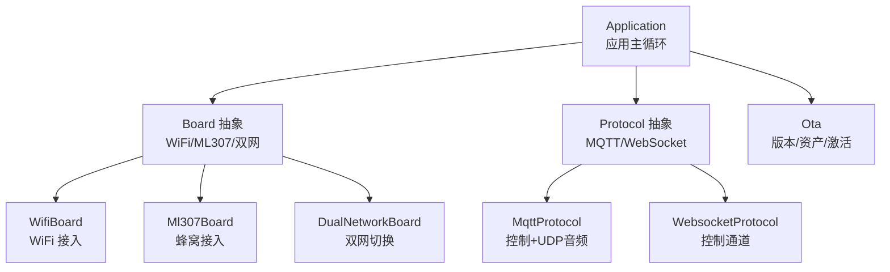
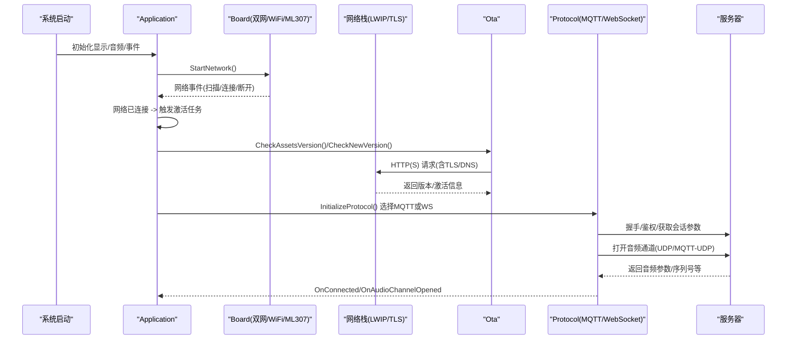
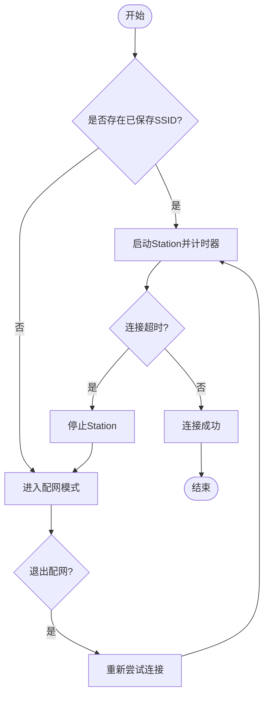
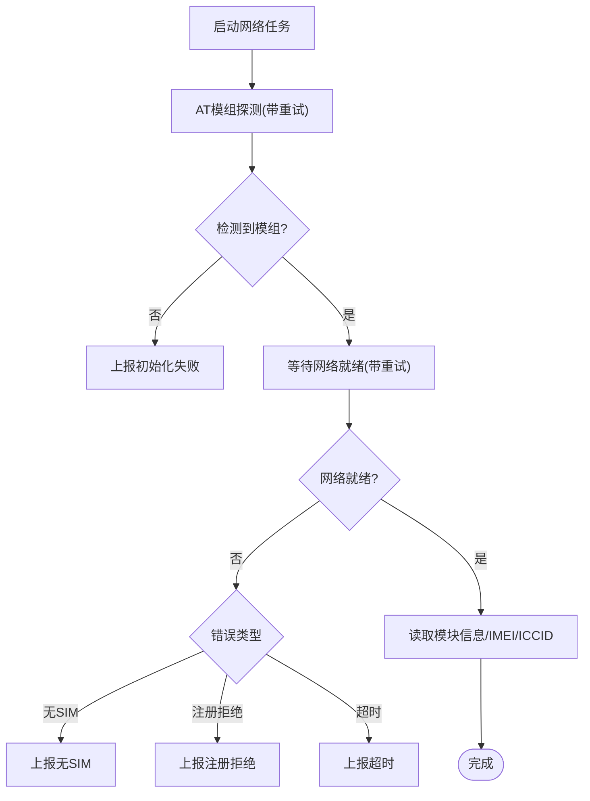
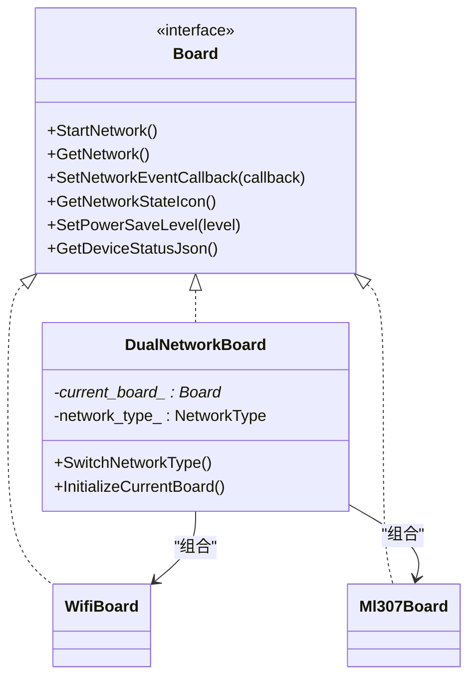
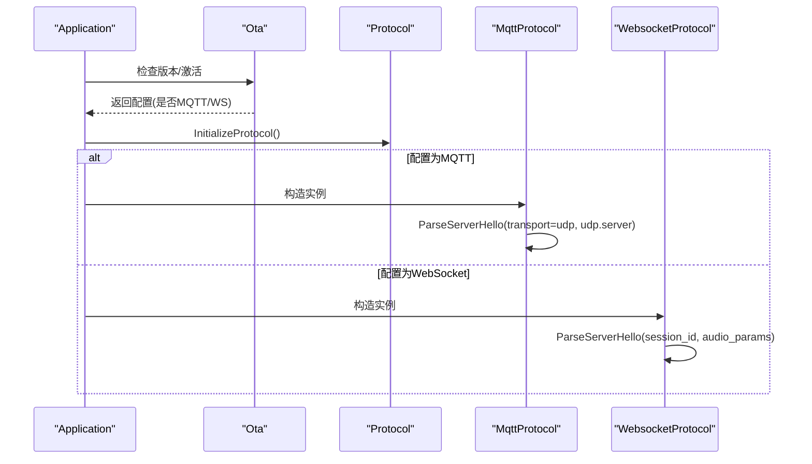
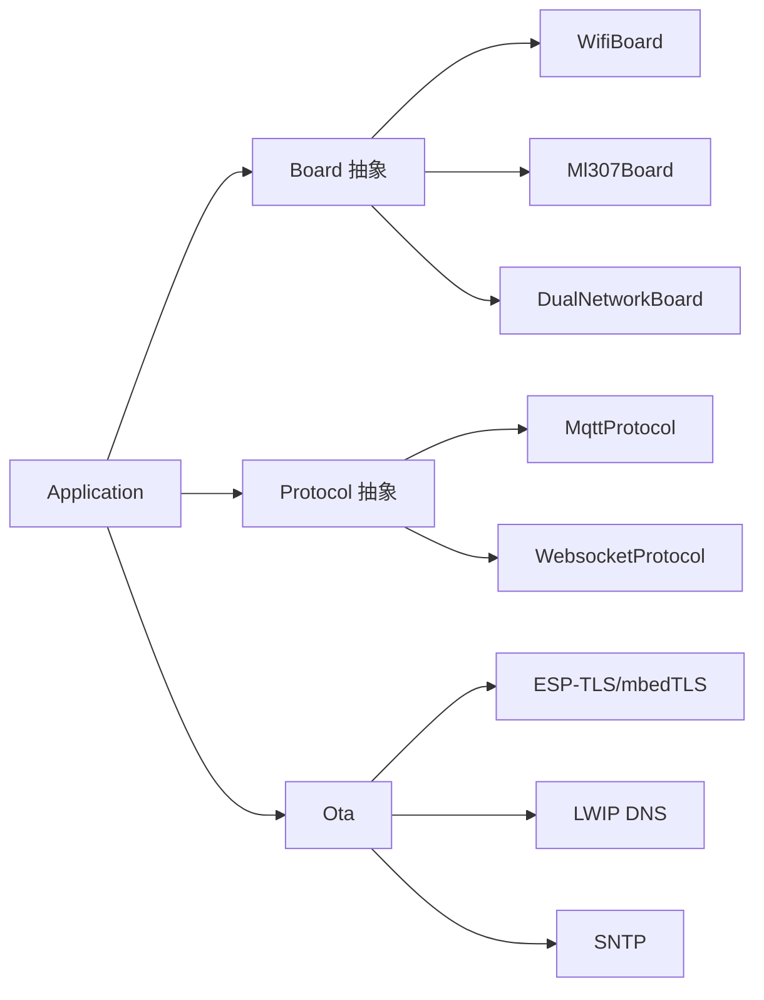

# 网络环境问题

<cite>
**本文引用的文件**
- [main/boards/common/wifi_board.cc](file://main/boards/common/wifi_board.cc)
- [main/boards/common/wifi_board.h](file://main/boards/common/wifi_board.h)
- [main/boards/common/ml307_board.cc](file://main/boards/common/ml307_board.cc)
- [main/boards/common/ml307_board.h](file://main/boards/common/ml307_board.h)
- [main/boards/common/dual_network_board.cc](file://main/boards/common/dual_network_board.cc)
- [main/boards/common/dual_network_board.h](file://main/boards/common/dual_network_board.h)
- [main/application.cc](file://main/application.cc)
- [main/application.h](file://main/application.h)
- [main/protocols/mqtt_protocol.cc](file://main/protocols/mqtt_protocol.cc)
- [main/protocols/websocket_protocol.cc](file://main/protocols/websocket_protocol.cc)
- [main/ota.cc](file://main/ota.cc)
- [docs/mqtt-udp.md](file://docs/mqtt-udp.md)
- [docs/mqtt-udp_zh.md](file://docs/mqtt-udp_zh.md)
- [main/boards/waveshare/esp32-s3-touch-lcd-4.3c/sdkconfig.4_3c](file://main/boards/waveshare/esp32-s3-touch-lcd-4.3c/sdkconfig.4_3c)
</cite>

## 目录
1. [简介](#简介)
2. [项目结构](#项目结构)
3. [核心组件](#核心组件)
4. [架构总览](#架构总览)
5. [详细组件分析](#详细组件分析)
6. [依赖关系分析](#依赖关系分析)
7. [性能与网络质量](#性能与网络质量)
8. [故障排查指南](#故障排查指南)
9. [结论](#结论)
10. [附录：配置示例与最佳实践](#附录配置示例与最佳实践)

## 简介
本文件面向在复杂企业网络环境中部署设备的工程师，聚焦于网络环境问题的系统化排查与解决。内容覆盖防火墙策略、代理设置、DNS解析、NTP时间同步、SSL证书校验失败、端口封锁、网络延迟与丢包诊断，以及设备侧的网络检测与自动适配机制。文档结合代码实现，给出可操作的定位步骤与优化建议，帮助快速恢复稳定连接并提升语音交互体验。

## 项目结构
本项目在网络层采用“板卡抽象 + 协议选择”的架构：
- 板卡抽象层：统一封装 WiFi 与蜂窝（ML307）两种接入方式，并提供双网切换能力。
- 协议层：根据 OTA 下发的配置动态选择 MQTT 或 WebSocket 作为控制通道；音频数据走 UDP（MQTT-UDP）。
- 应用层：负责激活流程、版本检查、资源下载、协议初始化与事件分发。

图示来源
- [main/application.cc:101-163](file://main/application.cc#L101-L163)
- [main/boards/common/wifi_board.cc:52-87](file://main/boards/common/wifi_board.cc#L52-L87)
- [main/boards/common/ml307_board.cc:134-141](file://main/boards/common/ml307_board.cc#L134-L141)
- [main/boards/common/dual_network_board.cc:35-43](file://main/boards/common/dual_network_board.cc#L35-L43)
- [main/application.cc:473-487](file://main/application.cc#L473-L487)

章节来源
- [main/application.cc:101-163](file://main/application.cc#L101-L163)
- [main/boards/common/wifi_board.cc:52-87](file://main/boards/common/wifi_board.cc#L52-L87)
- [main/boards/common/ml307_board.cc:134-141](file://main/boards/common/ml307_board.cc#L134-L141)
- [main/boards/common/dual_network_board.cc:35-43](file://main/boards/common/dual_network_board.cc#L35-L43)
- [main/application.cc:473-487](file://main/application.cc#L473-L487)

## 核心组件
- 板卡抽象与网络接入
  - WifiBoard：管理 WiFi 扫描、连接、超时回退到配网模式，提供信号强度与状态图标。
  - Ml307Board：通过 AT 命令驱动蜂窝模块，完成模组检测、网络注册与状态上报。
  - DualNetworkBoard：在 WiFi 与 ML307 之间按持久化配置进行切换，对外暴露统一接口。
- 协议选择与媒体传输
  - Application 根据 OTA 配置选择 MQTT 或 WebSocket 协议。
  - MQTT 协议支持 UDP 音频通道，具备低延迟特性；WebSocket 用于纯控制场景。
- OTA 与激活
  - 启动后执行资产与固件版本检查、激活码/挑战流程，完成后进入空闲态。

章节来源
- [main/boards/common/wifi_board.h:9-67](file://main/boards/common/wifi_board.h#L9-L67)
- [main/boards/common/ml307_board.h:9-36](file://main/boards/common/ml307_board.h#L9-L36)
- [main/boards/common/dual_network_board.h:15-58](file://main/boards/common/dual_network_board.h#L15-L58)
- [main/application.cc:473-487](file://main/application.cc#L473-L487)
- [main/protocols/mqtt_protocol.cc:322-353](file://main/protocols/mqtt_protocol.cc#L322-L353)
- [main/protocols/websocket_protocol.cc:231-254](file://main/protocols/websocket_protocol.cc#L231-L254)
- [main/ota.cc:86-125](file://main/ota.cc#L86-L125)

## 架构总览
下图展示从设备启动到建立语音通道的关键路径，包括网络接入、协议选择、激活与音频通道打开。

图示来源
- [main/application.cc:101-163](file://main/application.cc#L101-L163)
- [main/application.cc:323-338](file://main/application.cc#L323-338)
- [main/ota.cc:86-125](file://main/ota.cc#L86-L125)
- [main/application.cc:473-487](file://main/application.cc#L473-L487)
- [main/protocols/mqtt_protocol.cc:322-353](file://main/protocols/mqtt_protocol.cc#L322-L353)

## 详细组件分析

### 组件A：WiFi 接入与配网回退
- 功能要点
  - 启动时尝试连接已知 SSID，若超时则进入配网模式（热点/Blufi/声学配网可选）。
  - 将底层 WiFi 事件转换为统一的 NetworkEvent，供上层 UI 与状态机使用。
  - 提供 GetDeviceStatusJson 输出信号强度等级（强/中/弱）与芯片温度。
- 关键流程
  - TryWifiConnect：有 SSID 则发起连接并设超时；无 SSID 直接进入配网。
  - OnWifiConnectTimeout：停止 Station，进入配网模式。
  - EnterWifiConfigMode：安全地中断当前工作流，切换到配网。
- 排障要点
  - 确认是否频繁超时进入配网模式（企业网络可能阻断 STA 连接或 DHCP）。
  - 检查 RSSI 阈值与信号等级映射是否符合现场环境。
  - 若启用 Blufi/声学配网，需确保对应资源释放与任务创建顺序正确。

图示来源
- [main/boards/common/wifi_board.cc:89-104](file://main/boards/common/wifi_board.cc#L89-L104)
- [main/boards/common/wifi_board.cc:151-157](file://main/boards/common/wifi_board.cc#L151-L157)
- [main/boards/common/wifi_board.cc:199-238](file://main/boards/common/wifi_board.cc#L199-L238)
- [main/boards/common/wifi_board.cc:339-357](file://main/boards/common/wifi_board.cc#L339-L357)

章节来源
- [main/boards/common/wifi_board.cc:52-87](file://main/boards/common/wifi_board.cc#L52-L87)
- [main/boards/common/wifi_board.cc:89-104](file://main/boards/common/wifi_board.cc#L89-L104)
- [main/boards/common/wifi_board.cc:151-157](file://main/boards/common/wifi_board.cc#L151-L157)
- [main/boards/common/wifi_board.cc:199-238](file://main/boards/common/wifi_board.cc#L199-L238)
- [main/boards/common/wifi_board.cc:339-357](file://main/boards/common/wifi_board.cc#L339-L357)

### 组件B：蜂窝接入（ML307）与注册重试
- 功能要点
  - 通过 UART 探测 AT 模组，等待网络就绪，上报 SIM/注册/超时等错误事件。
  - 提供 CSQ 信号等级与运营商信息，生成设备状态 JSON。
- 关键流程
  - NetworkTask：重复探测模组，等待网络就绪，记录 IMEI/ICCID 等信息。
  - OnNetworkEvent：将底层事件转发给上层，便于 UI 提示与告警。
- 排障要点
  - 无 SIM/注册被拒/初始化失败/超时等错误均有明确事件，便于定位。
  - 信号等级基于 CSQ 分段，注意不同运营商/基站差异。

图示来源
- [main/boards/common/ml307_board.cc:67-132](file://main/boards/common/ml307_board.cc#L67-L132)
- [main/boards/common/ml307_board.cc:147-166](file://main/boards/common/ml307_board.cc#L147-L166)
- [main/boards/common/ml307_board.cc:247-270](file://main/boards/common/ml307_board.cc#L247-L270)

章节来源
- [main/boards/common/ml307_board.cc:67-132](file://main/boards/common/ml307_board.cc#L67-L132)
- [main/boards/common/ml307_board.cc:147-166](file://main/boards/common/ml307_board.cc#L147-L166)
- [main/boards/common/ml307_board.cc:247-270](file://main/boards/common/ml307_board.cc#L247-L270)

### 组件C：双网切换与统一入口
- 功能要点
  - 从 Settings 加载默认网络类型，仅初始化当前网络对应的板卡实例。
  - 提供 SwitchNetworkType 持久化配置并重启以生效。
- 排障要点
  - 切换后需重启才能完全重建网络栈与协议上下文。
  - 观察切换通知与日志，确认目标网络初始化是否正常。

图示来源
- [main/boards/common/dual_network_board.h:15-58](file://main/boards/common/dual_network_board.h#L15-L58)
- [main/boards/common/dual_network_board.cc:35-43](file://main/boards/common/dual_network_board.cc#L35-L43)
- [main/boards/common/dual_network_board.cc:45-57](file://main/boards/common/dual_network_board.cc#L45-L57)

章节来源
- [main/boards/common/dual_network_board.h:15-58](file://main/boards/common/dual_network_board.h#L15-L58)
- [main/boards/common/dual_network_board.cc:35-43](file://main/boards/common/dual_network_board.cc#L35-L43)
- [main/boards/common/dual_network_board.cc:45-57](file://main/boards/common/dual_network_board.cc#L45-L57)

### 组件D：协议选择与音频通道
- 功能要点
  - Application 根据 OTA 配置选择 MQTT 或 WebSocket。
  - MQTT 协议支持 UDP 音频通道，包含会话 ID、音频参数与 UDP 服务器地址。
  - WebSocket 协议同样解析会话与音频参数。
- 排障要点
  - 若服务器未下发 UDP 配置，MQTT 将无法建立音频通道。
  - 关注 OnNetworkError 回调，统一处理网络异常并提示用户。

图示来源
- [main/application.cc:473-487](file://main/application.cc#L473-L487)
- [main/protocols/mqtt_protocol.cc:322-353](file://main/protocols/mqtt_protocol.cc#L322-L353)
- [main/protocols/websocket_protocol.cc:231-254](file://main/protocols/websocket_protocol.cc#L231-L254)

章节来源
- [main/application.cc:473-487](file://main/application.cc#L473-L487)
- [main/protocols/mqtt_protocol.cc:322-353](file://main/protocols/mqtt_protocol.cc#L322-L353)
- [main/protocols/websocket_protocol.cc:231-254](file://main/protocols/websocket_protocol.cc#L231-L254)

## 依赖关系分析
- 组件耦合
  - Application 依赖 Board 抽象与 Protocol 抽象，解耦具体网络与协议实现。
  - DualNetworkBoard 组合 WifiBoard/Ml307Board，屏蔽差异。
- 外部依赖
  - TLS/加密：ESP-TLS 与 mbedTLS 相关选项影响 HTTPS 与 MQTT over TLS 行为。
  - DNS/SNTP：LWIP DNS 与 SNTP 配置影响域名解析与时钟同步。
- 潜在环路与风险
  - 双网切换后需重启以重建协议上下文，避免半连接状态。
  - 配网模式下应释放 Blufi 等资源，防止占用。

图示来源
- [main/application.cc:473-487](file://main/application.cc#L473-L487)
- [main/boards/common/dual_network_board.cc:35-43](file://main/boards/common/dual_network_board.cc#L35-L43)
- [main/boards/waveshare/esp32-s3-touch-lcd-4.3c/sdkconfig.4_3c:1001-1012](file://main/boards/waveshare/esp32-s3-touch-lcd-4.3c/sdkconfig.4_3c#L1001-L1012)
- [main/boards/waveshare/esp32-s3-touch-lcd-4.3c/sdkconfig.4_3c:2014-2021](file://main/boards/waveshare/esp32-s3-touch-lcd-4.3c/sdkconfig.4_3c#L2014-L2021)
- [main/boards/waveshare/esp32-s3-touch-lcd-4.3c/sdkconfig.4_3c:2024-2029](file://main/boards/waveshare/esp32-s3-touch-lcd-4.3c/sdkconfig.4_3c#L2024-L2029)

章节来源
- [main/application.cc:473-487](file://main/application.cc#L473-L487)
- [main/boards/common/dual_network_board.cc:35-43](file://main/boards/common/dual_network_board.cc#L35-L43)
- [main/boards/waveshare/esp32-s3-touch-lcd-4.3c/sdkconfig.4_3c:1001-1012](file://main/boards/waveshare/esp32-s3-touch-lcd-4.3c/sdkconfig.4_3c#L1001-L1012)
- [main/boards/waveshare/esp32-s3-touch-lcd-4.3c/sdkconfig.4_3c:2014-2021](file://main/boards/waveshare/esp32-s3-touch-lcd-4.3c/sdkconfig.4_3c#L2014-L2021)
- [main/boards/waveshare/esp32-s3-touch-lcd-4.3c/sdkconfig.4_3c:2024-2029](file://main/boards/waveshare/esp32-s3-touch-lcd-4.3c/sdkconfig.4_3c#L2024-L2029)

## 性能与网络质量
- 延迟优化
  - 连接前切换到高性能模式以降低延迟。
  - MQTT-UDP 设计将控制与数据分离，降低语音端到端延迟。
- 带宽与丢包
  - 音频使用 Opus 编码，兼顾压缩率与低延迟。
  - UDP 不保证可靠传输，但适合实时语音；需在应用层容忍小范围乱序与丢包。
- 指标采集
  - WiFi：RSSI 与信号等级。
  - 蜂窝：CSQ 与运营商信息。
  - 设备状态 JSON 可用于远程监控与告警。

章节来源
- [main/application.cc:718-722](file://main/application.cc#L718-L722)
- [docs/mqtt-udp.md:15](file://docs/mqtt-udp.md#L15)
- [docs/mqtt-udp.md:392](file://docs/mqtt-udp.md#L392)
- [docs/mqtt-udp.md:406](file://docs/mqtt-udp.md#L406)
- [main/boards/common/wifi_board.cc:339-357](file://main/boards/common/wifi_board.cc#L339-L357)
- [main/boards/common/ml307_board.cc:247-270](file://main/boards/common/ml307_board.cc#L247-L270)

## 故障排查指南

### 防火墙与企业网络限制
- 现象
  - 无法连接 AP、DHCP 超时、HTTP(S)/MQTT 握手失败、UDP 音频不通。
- 排查步骤
  - 确认出站规则放行：HTTPS(443)、HTTP(80)、MQTT(1883/8883)、UDP 音频端口。
  - 企业网关/ACL 是否拦截长连接或特定域名。
  - 若使用代理，需确保设备侧能直连或通过透明代理可达。
- 参考
  - 文档对防火墙规则的建议与端口说明。

章节来源
- [docs/mqtt-udp.md:380](file://docs/mqtt-udp.md#L380)
- [docs/mqtt-udp.md:322](file://docs/mqtt-udp.md#L322)

### SSL 证书验证失败
- 现象
  - HTTPS 握手失败、OTA 版本检查失败、激活失败。
- 排查步骤
  - 检查根证书链是否完整、中间证书是否正确安装。
  - 确认设备侧 TLS 配置未禁用必要套件或算法。
  - 核对服务器证书域名与 SAN 列表。
- 参考
  - ESP-TLS 与 mbedTLS 相关编译选项。

章节来源
- [main/boards/waveshare/esp32-s3-touch-lcd-4.3c/sdkconfig.4_3c:1001-1012](file://main/boards/waveshare/esp32-s3-touch-lcd-4.3c/sdkconfig.4_3c#L1001-L1012)

### DNS 解析问题
- 现象
  - 域名无法解析导致连接失败。
- 排查步骤
  - 检查 DHCP 下发的 DNS 是否可用，必要时配置备用 DNS。
  - 调整 LWIP DNS 最大服务器数量与主机 IP 数。
- 参考
  - LWIP DNS 配置项。

章节来源
- [main/boards/waveshare/esp32-s3-touch-lcd-4.3c/sdkconfig.4_3c:2024-2029](file://main/boards/waveshare/esp32-s3-touch-lcd-4.3c/sdkconfig.4_3c#L2024-L2029)

### NTP 时间同步
- 现象
  - 证书校验失败（时间偏差）、日志时间错乱。
- 排查步骤
  - 启用 SNTP，设置合理更新周期与启动延迟。
  - 确认 NTP 服务器可达且时钟漂移可控。
- 参考
  - LWIP SNTP 配置项。

章节来源
- [main/boards/waveshare/esp32-s3-touch-lcd-4.3c/sdkconfig.4_3c:2014-2021](file://main/boards/waveshare/esp32-s3-touch-lcd-4.3c/sdkconfig.4_3c#L2014-L2021)

### 代理设置
- 现象
  - 企业网络强制走代理，直接连接失败。
- 排查步骤
  - 评估是否可通过透明代理或网关 NAT 绕过。
  - 若必须显式代理，需评估设备侧代理支持与路由策略。
- 备注
  - 当前仓库未见显式代理配置入口，优先采用网络层打通方案。

### 端口封锁与 UDP 音频
- 现象
  - 控制通道正常，但无法收到/发送音频。
- 排查步骤
  - 确认 UDP 端口在防火墙/NAT 上放行。
  - 检查服务器 Hello 消息中的 UDP 地址与端口。
- 参考
  - MQTT-UDP 协议说明与端口要求。

章节来源
- [docs/mqtt-udp.md:322](file://docs/mqtt-udp.md#L322)
- [main/protocols/mqtt_protocol.cc:322-353](file://main/protocols/mqtt_protocol.cc#L322-L353)

### 网络质量诊断
- 指标
  - WiFi：RSSI、信道、IP、MAC。
  - 蜂窝：CSQ、运营商、IMEI/ICCID。
- 方法
  - 通过 GetDeviceStatusJson 定期上报，结合服务端统计丢包与抖动。
  - 观察 OnNetworkError 回调与日志，区分瞬时抖动与持续故障。

章节来源
- [main/boards/common/wifi_board.cc:339-357](file://main/boards/common/wifi_board.cc#L339-L357)
- [main/boards/common/ml307_board.cc:247-270](file://main/boards/common/ml307_board.cc#L247-L270)
- [main/application.cc:493-496](file://main/application.cc#L493-L496)

## 结论
通过板卡抽象与协议选择的解耦设计，设备可在复杂企业网络中灵活适配多种接入方式。结合明确的网络事件、状态上报与 OTA 激活流程，能够快速定位防火墙、DNS、NTP、SSL 与端口策略等问题。配合 UDP 音频的低延迟设计与合理的性能模式切换，可在保障用户体验的同时提升稳定性。

## 附录：配置示例与最佳实践

### 企业网络放行清单（建议）
- 控制通道
  - HTTPS(443)、HTTP(80)
  - MQTT(1883/8883)
- 媒体通道
  - UDP 音频端口（依据服务器配置）
- 其他
  - NTP(123/UDP)
  - DNS(53/UDP+TCP)

章节来源
- [docs/mqtt-udp.md:322](file://docs/mqtt-udp.md#L322)
- [docs/mqtt-udp.md:380](file://docs/mqtt-udp.md#L380)

### 双网切换与回退策略
- 默认优先使用蜂窝，WiFi 不可用时自动回退。
- 切换后重启以重建协议上下文，避免半连接。
- 通过 GetDeviceStatusJson 监控信号质量，指导用户移动位置或更换网络。

章节来源
- [main/boards/common/dual_network_board.cc:45-57](file://main/boards/common/dual_network_board.cc#L45-L57)
- [main/boards/common/wifi_board.cc:339-357](file://main/boards/common/wifi_board.cc#L339-L357)
- [main/boards/common/ml307_board.cc:247-270](file://main/boards/common/ml307_board.cc#L247-L270)

### TLS/证书与 DNS/SNTP 配置要点
- 启用 ESP-TLS 与 mbedTLS，保持默认安全套件。
- 配置合适的 DNS 服务器数量与 SNTP 更新周期。
- 确保证书链完整、域名匹配，避免时间偏差导致的校验失败。

章节来源
- [main/boards/waveshare/esp32-s3-touch-lcd-4.3c/sdkconfig.4_3c:1001-1012](file://main/boards/waveshare/esp32-s3-touch-lcd-4.3c/sdkconfig.4_3c#L1001-L1012)
- [main/boards/waveshare/esp32-s3-touch-lcd-4.3c/sdkconfig.4_3c:2024-2029](file://main/boards/waveshare/esp32-s3-touch-lcd-4.3c/sdkconfig.4_3c#L2024-L2029)
- [main/boards/waveshare/esp32-s3-touch-lcd-4.3c/sdkconfig.4_3c:2014-2021](file://main/boards/waveshare/esp32-s3-touch-lcd-4.3c/sdkconfig.4_3c#L2014-L2021)