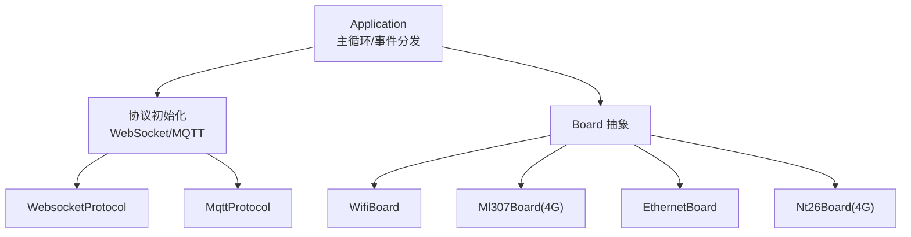
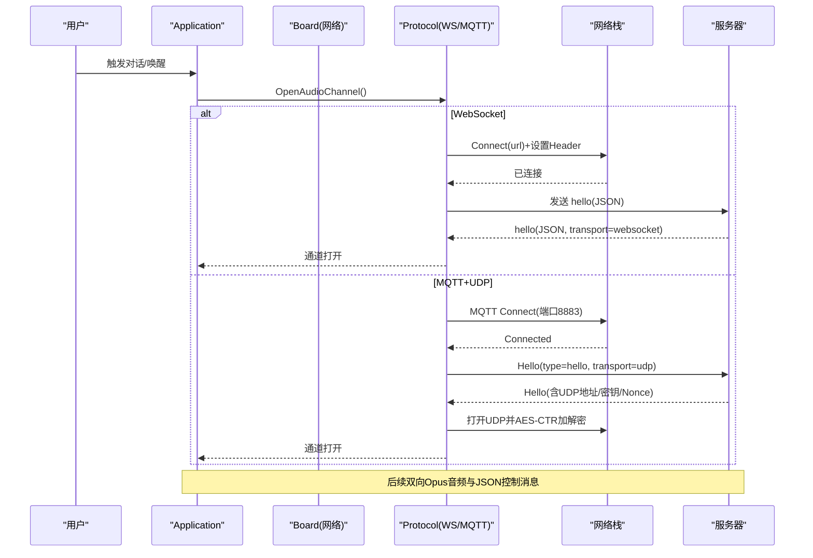
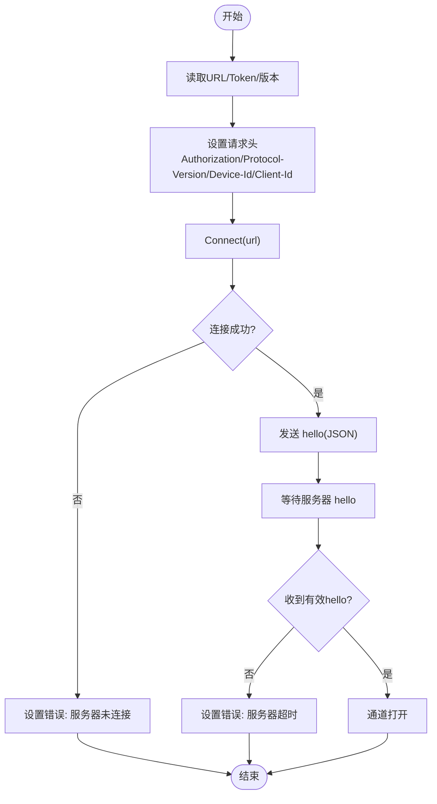
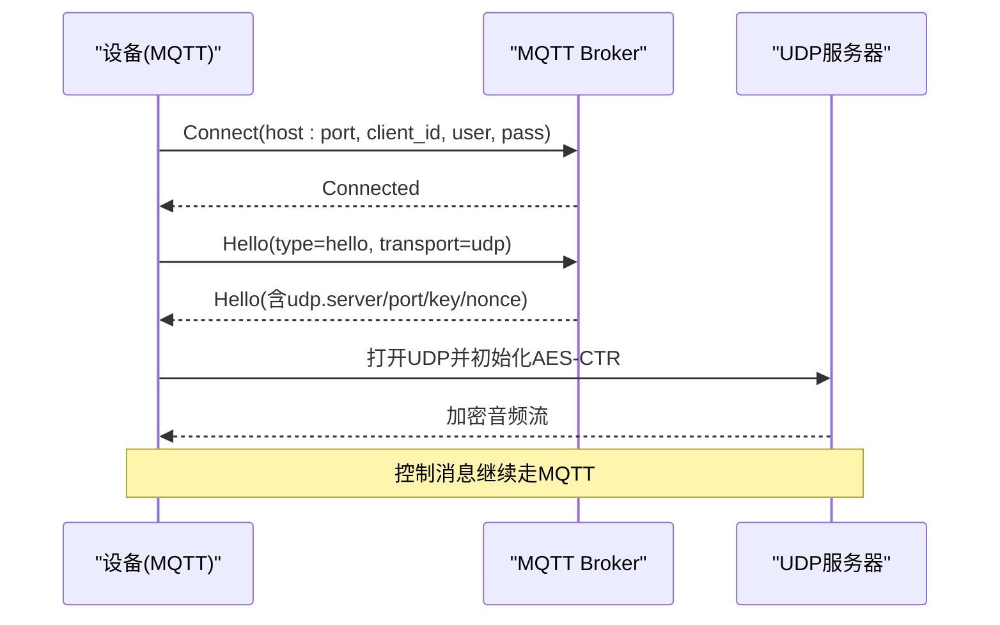
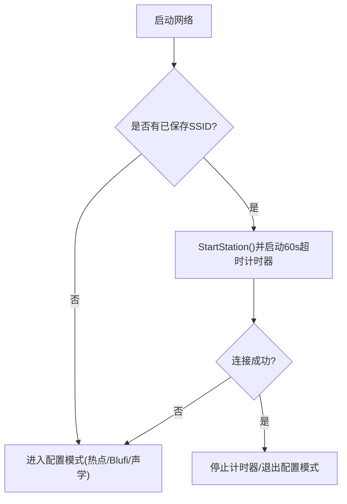
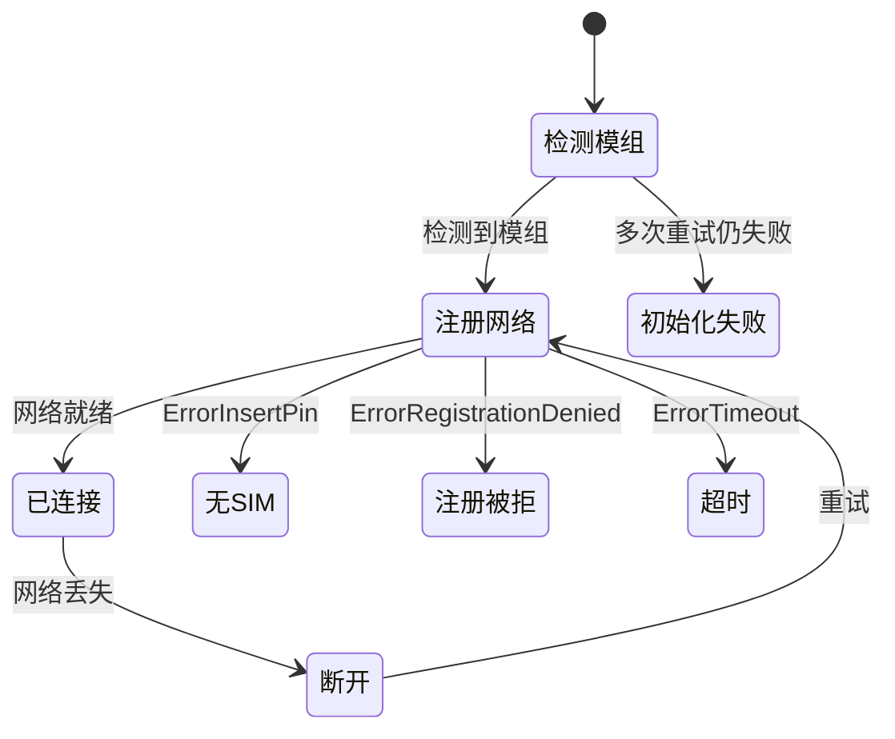
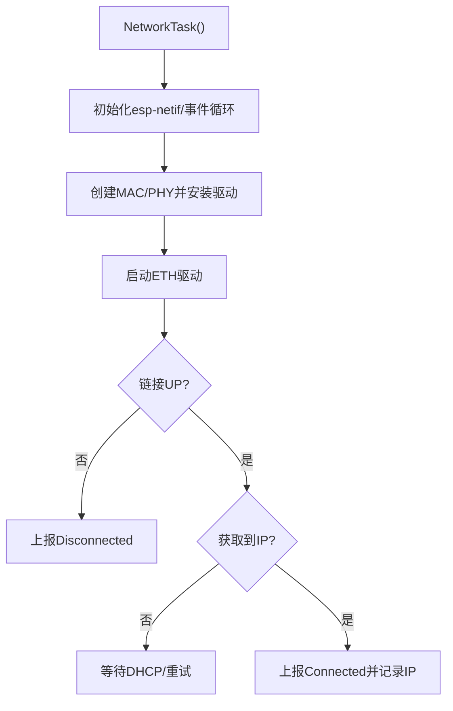
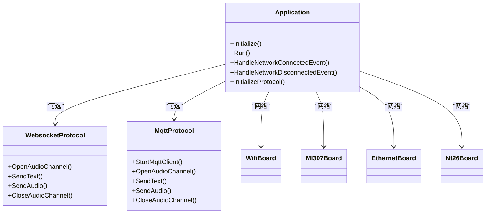

# 网络连接问题

<cite>
**本文引用的文件**   
- [README.md](file://README.md)
- [application.cc](file://main/application.cc)
- [application.h](file://main/application.h)
- [websocket_protocol.cc](file://main/protocols/websocket_protocol.cc)
- [mqtt_protocol.cc](file://main/protocols/mqtt_protocol.cc)
- [mqtt_protocol.h](file://main/protocols/mqtt_protocol.h)
- [wifi_board.cc](file://main/boards/common/wifi_board.cc)
- [ml307_board.cc](file://main/boards/common/ml307_board.cc)
- [ethernet_board.cc](file://main/boards/common/ethernet_board.cc)
- [nt26_board.cc](file://main/boards/common/nt26_board.cc)
- [websocket.md](file://docs/websocket.md)
- [mqtt-udp.md](file://docs/mqtt-udp.md)
</cite>

## 目录
1. [引言](#引言)
2. [项目结构](#项目结构)
3. [核心组件](#核心组件)
4. [架构总览](#架构总览)
5. [详细组件分析](#详细组件分析)
6. [依赖关系分析](#依赖关系分析)
7. [性能与稳定性考量](#性能与稳定性考量)
8. [故障排查指南](#故障排查指南)
9. [结论](#结论)
10. [附录](#附录)

## 引言
本文件面向设备侧网络与协议连接问题的系统化排查，覆盖 WiFi、4G（ML307）、以太网等网络接口，以及 WebSocket 与 MQTT+UDP 两种通信路径。重点包括：认证错误、服务器不可达、证书/TLS、超时与断线重连、信号质量差、防火墙/代理/DNS 等环境因素，并提供抓包与调试工具使用建议。文档中的实现细节均来源于代码仓库与配套协议文档。

## 项目结构
本项目在应用层通过 Board 抽象统一接入不同网络（WiFi/4G/以太网），并通过 Protocol 抽象选择 WebSocket 或 MQTT+UDP 进行会话控制与音频流传输。关键位置如下：
- 应用主循环与事件分发：application.cc/h
- 协议实现：websocket_protocol.cc、mqtt_protocol.cc/h
- 网络板级适配：wifi_board.cc、ml307_board.cc、ethernet_board.cc、nt26_board.cc
- 协议说明文档：websocket.md、mqtt-udp.md

图表来源
- [application.cc:473-610](file://main/application.cc#L473-L610)
- [websocket_protocol.cc:1-255](file://main/protocols/websocket_protocol.cc#L1-L255)
- [mqtt_protocol.cc:1-353](file://main/protocols/mqtt_protocol.cc#L1-L353)
- [wifi_board.cc:1-358](file://main/boards/common/wifi_board.cc#L1-L358)
- [ml307_board.cc:1-271](file://main/boards/common/ml307_board.cc#L1-L271)
- [ethernet_board.cc:1-303](file://main/boards/common/ethernet_board.cc#L1-L303)
- [nt26_board.cc:40-112](file://main/boards/common/nt26_board.cc#L40-L112)

章节来源
- [README.md:1-173](file://README.md#L1-L173)
- [application.cc:1-800](file://main/application.cc#L1-L800)
- [application.h:1-194](file://main/application.h#L1-L194)

## 核心组件
- Application：负责设备状态机、网络事件回调、协议生命周期管理、音频通道开关、TTS/STT/MCP 消息处理。
- WebsocketProtocol：基于 WebSocket 的文本 JSON + 二进制 Opus 音频通道；支持 v1/v2/v3 二进制帧格式；握手 hello 流程与超时处理。
- MqttProtocol：MQTT 控制面 + UDP 实时音频面；支持 AES-CTR 加密、序列号防重放、自动重连。
- WifiBoard：WiFi 扫描/连接/配置模式（热点/Blufi/声学）；RSSI 信号强度图标与状态上报。
- Ml307Board/Nt26Board：4G 模组检测、注册、CSQ 信号质量、错误事件（无卡/拒绝/超时）。
- EthernetBoard：ESP32 EMAC/PHY 驱动安装、IP 获取、链路上下事件。

章节来源
- [application.cc:473-610](file://main/application.cc#L473-L610)
- [websocket_protocol.cc:83-201](file://main/protocols/websocket_protocol.cc#L83-L201)
- [mqtt_protocol.cc:55-152](file://main/protocols/mqtt_protocol.cc#L55-L152)
- [mqtt_protocol.cc:166-213](file://main/protocols/mqtt_protocol.cc#L166-L213)
- [mqtt_protocol.h:48-65](file://main/protocols/mqtt_protocol.h#L48-L65)
- [wifi_board.cc:52-157](file://main/boards/common/wifi_board.cc#L52-L157)
- [ml307_board.cc:67-132](file://main/boards/common/ml307_board.cc#L67-L132)
- [ethernet_board.cc:65-151](file://main/boards/common/ethernet_board.cc#L65-L151)

## 架构总览
下图展示从“用户交互”到“网络/协议”的端到端流程，涵盖握手、音频通道建立与控制面/数据面分离。

图表来源
- [websocket_protocol.cc:83-201](file://main/protocols/websocket_protocol.cc#L83-L201)
- [mqtt_protocol.cc:55-152](file://main/protocols/mqtt_protocol.cc#L55-L152)
- [mqtt-udp.md:23-58](file://docs/mqtt-udp.md#L23-L58)

## 详细组件分析

### WebSocket 连接与诊断
- 连接建立：读取 URL、Token、版本；设置 Authorization/Protocol-Version/Device-Id/Client-Id 头；Connect 成功后发送 hello(JSON)，等待服务器 hello 响应，超时则报错。
- 常见失败点：
  - 认证失败：缺少或无效 Bearer Token，服务端拒绝握手。
  - 服务器不可达：DNS 解析失败、TLS 握手失败、端口不通。
  - 握手超时：未收到服务器 hello。
- 诊断要点：
  - 检查 URL、端口、是否启用 TLS。
  - 确认 Authorization 头格式为 "Bearer <token>"。
  - 观察 OnDisconnected 回调与错误码。

图表来源
- [websocket_protocol.cc:83-201](file://main/protocols/websocket_protocol.cc#L83-L201)
- [websocket.md:83-93](file://docs/websocket.md#L83-L93)

章节来源
- [websocket_protocol.cc:83-201](file://main/protocols/websocket_protocol.cc#L83-L201)
- [websocket.md:1-531](file://docs/websocket.md#L1-L531)

### MQTT + UDP 混合协议与诊断
- 控制面（MQTT）：连接 broker（默认端口 8883），订阅/发布主题；断开后定时重连。
- 数据面（UDP）：从 hello 响应中获取 UDP server/port/key/nonce，初始化 AES-CTR，按序列号与时间戳构造计数器，对 Opus 音频进行加解密。
- 常见失败点：
  - 认证失败：用户名/密码错误或权限不足。
  - 证书/TLS：端口 8883 需 TLS，证书链不完整或不信任。
  - UDP 不通：防火墙/NAT 阻断，端口未放行。
  - 解密失败/序列异常：密钥不匹配、时钟/序列不一致。
- 诊断要点：
  - 校验 endpoint 格式 host:port，确认 keepalive 与 publish_topic。
  - 核对 UDP 地址/端口/密钥/Nonce 是否与服务器一致。
  - 关注 OnDisconnected 与重连定时器行为。

图表来源
- [mqtt_protocol.cc:55-152](file://main/protocols/mqtt_protocol.cc#L55-L152)
- [mqtt_protocol.cc:166-213](file://main/protocols/mqtt_protocol.cc#L166-L213)
- [mqtt-udp.md:23-58](file://docs/mqtt-udp.md#L23-L58)

章节来源
- [mqtt_protocol.cc:55-152](file://main/protocols/mqtt_protocol.cc#L55-L152)
- [mqtt_protocol.cc:166-213](file://main/protocols/mqtt_protocol.cc#L166-L213)
- [mqtt_protocol.h:48-65](file://main/protocols/mqtt_protocol.h#L48-L65)
- [mqtt-udp.md:1-410](file://docs/mqtt-udp.md#L1-L410)

### WiFi 网络问题与定位
- 连接流程：尝试已有 SSID 连接，若超时进入配置模式（热点/Blufi/声学）；提供 RSSI 信号强度图标与状态 JSON。
- 常见问题：
  - 无法扫描/连接：SSID 列表为空、密码错误、AP 隐藏、信道干扰。
  - 连接超时：默认 60 秒，超时后进入配置模式。
  - 弱信号：根据 RSSI 阈值显示强/中/弱。
- 诊断要点：
  - 查看 GetBoardJson 返回的 ssid/rssi/channel/ip。
  - 观察 Scanning/Connecting/Connected/Disconnected 事件。
  - 必要时进入配置模式重新配网。

图表来源
- [wifi_board.cc:89-157](file://main/boards/common/wifi_board.cc#L89-L157)
- [wifi_board.cc:249-282](file://main/boards/common/wifi_board.cc#L249-L282)

章节来源
- [wifi_board.cc:52-157](file://main/boards/common/wifi_board.cc#L52-L157)
- [wifi_board.cc:249-282](file://main/boards/common/wifi_board.cc#L249-L282)

### 4G 网络（ML307/Nt26）问题与定位
- 初始化流程：检测模组 -> 注册网络 -> 上报 CSQ 信号强度 -> 错误事件（无SIM/注册拒绝/初始化失败/超时）。
- 常见问题：
  - 无 SIM/欠费/鉴权失败：ModemErrorNoSim/RegDenied。
  - 信号差：CSQ 低导致丢包/延迟高。
  - 注册超时：长时间未获得 IP 或附着失败。
- 诊断要点：
  - 查看 GetBoardJson 返回 carrier/csq/imei/iccid/cereg。
  - 监听 ModemDetecting/Connecting/Connected/Disconnected 及各类错误事件。

图表来源
- [ml307_board.cc:67-132](file://main/boards/common/ml307_board.cc#L67-L132)
- [ml307_board.cc:168-179](file://main/boards/common/ml307_board.cc#L168-L179)
- [nt26_board.cc:67-112](file://main/boards/common/nt26_board.cc#L67-L112)

章节来源
- [ml307_board.cc:67-132](file://main/boards/common/ml307_board.cc#L67-L132)
- [ml307_board.cc:168-179](file://main/boards/common/ml307_board.cc#L168-L179)
- [nt26_board.cc:67-112](file://main/boards/common/nt26_board.cc#L67-L112)

### 以太网问题与定位
- 初始化流程：esp-netif/事件循环 -> MAC/PHY 创建与安装 -> 启动驱动 -> 获取 IP -> 上报 Connected/Disconnected。
- 常见问题：
  - PHY 初始化失败、MAC 创建失败、驱动安装失败。
  - 网线未插/协商失败、DHCP 未分配 IP。
- 诊断要点：
  - 关注 ETH_EVENT_CONNECTED/DISCONNECTED 与 GotIpEventHandler。
  - 检查 GetDeviceStatusJson 中 network.state/ip。

图表来源
- [ethernet_board.cc:65-151](file://main/boards/common/ethernet_board.cc#L65-L151)
- [ethernet_board.cc:184-196](file://main/boards/common/ethernet_board.cc#L184-L196)

章节来源
- [ethernet_board.cc:65-151](file://main/boards/common/ethernet_board.cc#L65-L151)
- [ethernet_board.cc:184-196](file://main/boards/common/ethernet_board.cc#L184-L196)

## 依赖关系分析
- Application 依赖 Board 抽象以获取具体网络实现，并在激活阶段选择 WebSocket 或 MQTT 协议实例。
- 协议层依赖底层网络对象（WebSocket/MQTT/UDP）完成握手与数据传输。
- 各 Board 实现向上暴露统一的 NetworkInterface 接口，向下封装具体驱动与事件。

图表来源
- [application.cc:473-610](file://main/application.cc#L473-L610)
- [websocket_protocol.cc:1-255](file://main/protocols/websocket_protocol.cc#L1-L255)
- [mqtt_protocol.cc:1-353](file://main/protocols/mqtt_protocol.cc#L1-L353)
- [wifi_board.cc:1-358](file://main/boards/common/wifi_board.cc#L1-L358)
- [ml307_board.cc:1-271](file://main/boards/common/ml307_board.cc#L1-L271)
- [ethernet_board.cc:1-303](file://main/boards/common/ethernet_board.cc#L1-L303)
- [nt26_board.cc:40-112](file://main/boards/common/nt26_board.cc#L40-L112)

章节来源
- [application.cc:1-800](file://main/application.cc#L1-L800)
- [application.h:1-194](file://main/application.h#L1-L194)

## 性能与稳定性考量
- 心跳与重连：MQTT 支持 keepalive 与断开后定时重连；WebSocket 依赖上层状态与超时判定。
- 音频通道：MQTT+UDP 采用 AES-CTR 加密与序列号防重放，保证实时性与安全性；WebSocket 二进制帧更简单但受限于 TCP 拥塞控制。
- 电源策略：连接时提升性能，空闲降低功耗，减少抖动。
- 超时机制：基础协议层维护最近接收时间，超过阈值认为通道不可用。

章节来源
- [mqtt_protocol.cc:55-152](file://main/protocols/mqtt_protocol.cc#L55-L152)
- [mqtt-udp.md:297-316](file://docs/mqtt-udp.md#L297-L316)
- [application.cc:504-519](file://main/application.cc#L504-L519)

## 故障排查指南

### 通用步骤
- 确认网络类型与状态：
  - WiFi：查看 GetBoardJson 的 ssid/rssi/channel/ip，观察 Scanning/Connecting/Connected/Disconnected 事件。
  - 4G：查看 GetBoardJson 的 carrier/csq/imei/iccid/cereg，监听 Modem* 事件。
  - 以太网：检查 ETH_EVENT_* 与 GotIp 事件，GetDeviceStatusJson 的 network.state/ip。
- 确认协议配置：
  - WebSocket：url/token/version 是否正确，Authorization 头是否为 "Bearer <token>"。
  - MQTT：endpoint/host:port、client_id、username/password、keepalive、publish_topic。
- 观察日志与错误：
  - 协议层 SetError 与 OnNetworkError 回调会触发 UI 提示与事件。
  - 注意 OnDisconnected 回调与重连定时器。

章节来源
- [application.cc:493-506](file://main/application.cc#L493-L506)
- [websocket_protocol.cc:175-194](file://main/protocols/websocket_protocol.cc#L175-L194)
- [mqtt_protocol.cc:85-98](file://main/protocols/mqtt_protocol.cc#L85-L98)

### WebSocket 常见问题
- 认证错误：
  - 现象：握手被拒绝或立即断开。
  - 排查：确认 token 非空且格式正确；检查服务端鉴权逻辑。
- 服务器不可达：
  - 现象：Connect 失败或 DNS 解析失败。
  - 排查：确认 URL 域名可解析、端口可达、TLS 证书链完整。
- 握手超时：
  - 现象：未收到服务器 hello。
  - 排查：检查服务端 hello 响应字段 transport 是否为 websocket，是否包含必要 audio_params。

章节来源
- [websocket.md:83-93](file://docs/websocket.md#L83-L93)
- [websocket.md:402-418](file://docs/websocket.md#L402-L418)
- [websocket_protocol.cc:175-194](file://main/protocols/websocket_protocol.cc#L175-L194)

### MQTT + UDP 常见问题
- 认证错误：
  - 现象：MQTT Connect 失败或被拒绝。
  - 排查：确认 username/password 与 broker 权限。
- 证书/TLS 问题：
  - 现象：端口 8883 连接失败。
  - 排查：确认设备侧 TLS 配置与根证书可信。
- UDP 不通：
  - 现象：MQTT 正常但无法收发音频。
  - 排查：确认 UDP server/port 可达，防火墙放行，NAT 映射正确。
- 解密失败/序列异常：
  - 现象：音频乱码或频繁丢弃。
  - 排查：核对 key/nonce 一致性，检查 timestamp/sequence 单调性与时钟同步。

章节来源
- [mqtt-udp.md:319-336](file://docs/mqtt-udp.md#L319-L336)
- [mqtt_protocol.cc:166-213](file://main/protocols/mqtt_protocol.cc#L166-L213)

### 网络环境问题
- 防火墙/代理：
  - 确保 WebSocket 443/8443 与 MQTT 8883 端口开放；企业代理需允许升级至 WebSocket。
- DNS 解析：
  - 优先使用 IP 直连验证连通性；检查本地 DNS 缓存与上游解析。
- 路由/NAT：
  - 4G/外网场景下确认 NAT 表项与运营商限制；必要时使用公网 IP 或隧道方案。

[本节为通用指导，无需源码引用]

### 抓包与调试工具
- 抓包工具：Wireshark/tcpdump，过滤端口与协议（ws/wss/mqtt/udp）。
- 日志采集：开启 ESP_LOG 输出，结合串口/网络日志收集。
- 辅助脚本：项目 scripts 目录下提供若干工具（如 p3_tools、audio_debug_server.py），可用于音频回放与调试。

章节来源
- [README.md:122-128](file://README.md#L122-L128)

## 结论
通过对 WiFi/4G/以太网三种网络与 WebSocket/MQTT+UDP 两种协议的深入分析，可以系统性地定位连接失败、认证错误、证书/TLS、超时与重连、信号质量差等问题。结合设备状态事件、协议握手流程与抓包手段，能够快速缩小问题范围并给出针对性修复建议。

## 附录
- 协议参考：
  - WebSocket 协议文档：websocket.md
  - MQTT+UDP 混合协议文档：mqtt-udp.md
- 相关实现：
  - 应用主循环与事件：application.cc/h
  - 协议实现：websocket_protocol.cc、mqtt_protocol.cc/h
  - 网络适配：wifi_board.cc、ml307_board.cc、ethernet_board.cc、nt26_board.cc