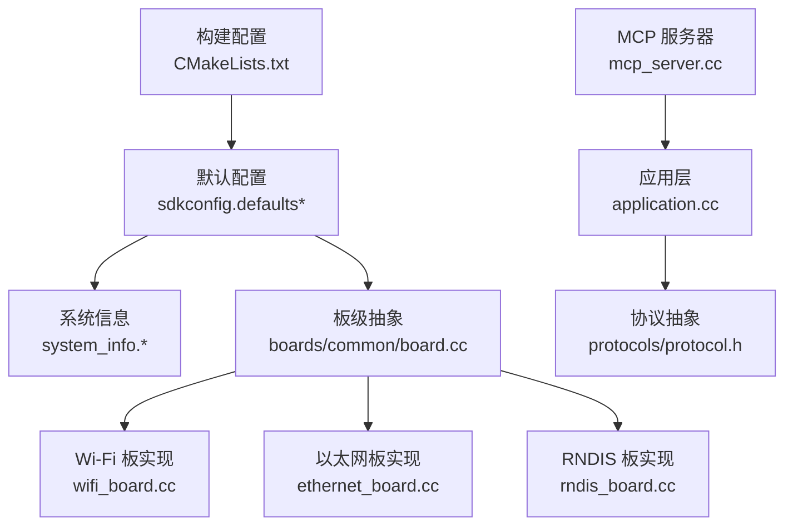
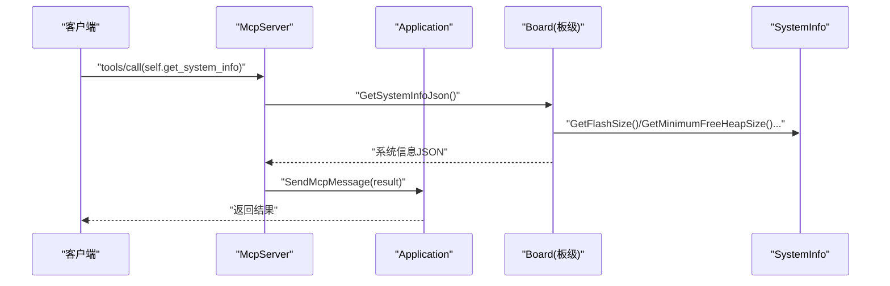
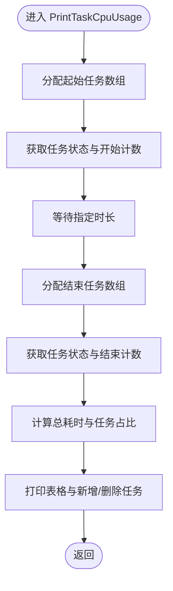
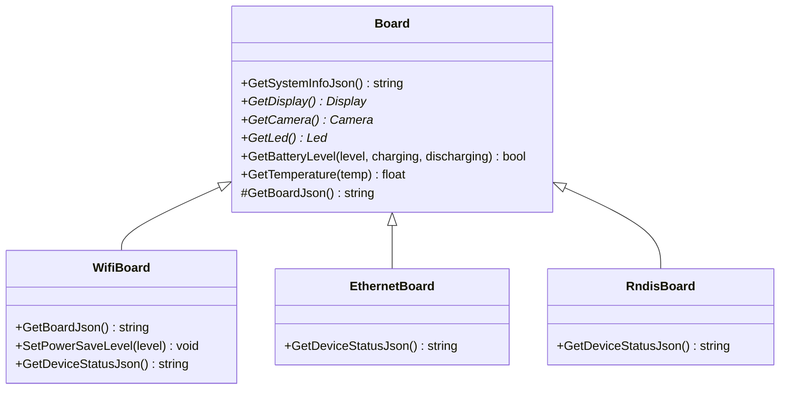
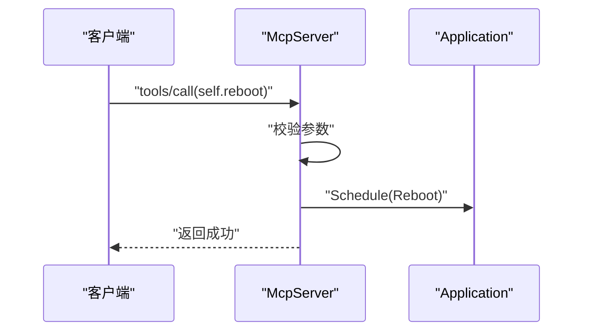
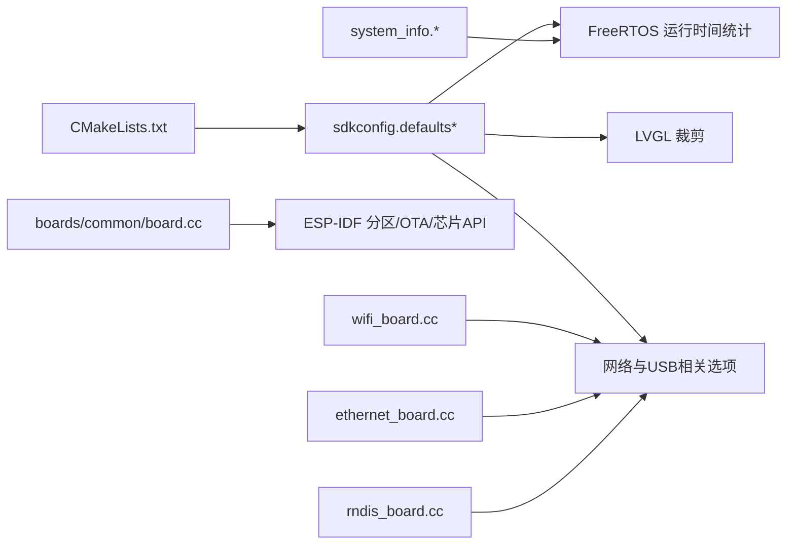

# 调试工具和技巧

<cite>
**本文引用的文件**   
- [README.md](file://README.md)
- [CMakeLists.txt](file://CMakeLists.txt)
- [sdkconfig.defaults](file://sdkconfig.defaults)
- [sdkconfig.defaults.esp32s3](file://sdkconfig.defaults.esp32s3)
- [sdkconfig.defaults.esp32c3](file://sdkconfig.defaults.esp32c3)
- [sdkconfig.defaults.esp32p4](file://sdkconfig.defaults.esp32p4)
- [main/system_info.h](file://main/system_info.h)
- [main/system_info.cc](file://main/system_info.cc)
- [main/boards/common/board.cc](file://main/boards/common/board.cc)
- [main/boards/common/wifi_board.cc](file://main/boards/common/wifi_board.cc)
- [main/boards/common/rndis_board.cc](file://main/boards/common/rndis_board.cc)
- [main/boards/common/ethernet_board.cc](file://main/boards/common/ethernet_board.cc)
- [main/mcp_server.cc](file://main/mcp_server.cc)
- [main/application.cc](file://main/application.cc)
- [main/protocols/protocol.h](file://main/protocols/protocol.h)
</cite>

## 目录
1. [简介](#简介)
2. [项目结构](#项目结构)
3. [核心组件](#核心组件)
4. [架构总览](#架构总览)
5. [详细组件分析](#详细组件分析)
6. [依赖分析](#依赖分析)
7. [性能考虑](#性能考虑)
8. [故障排查指南](#故障排查指南)
9. [结论](#结论)
10. [附录](#附录)

## 简介
本指南面向使用 ESP-IDF 框架的开发者，围绕本项目在调试与诊断方面的能力进行系统化说明。内容覆盖：
- 串口调试、JTAG 调试、逻辑分析仪等硬件调试手段在本项目中的落地方式
- 软件调试技巧（断点、变量监视、堆栈跟踪）
- 日志系统配置与使用（级别、过滤、远程收集）
- 性能分析（内存、CPU、功耗）
- 常用调试脚本与自动化测试工具

本项目基于 ESP-IDF 构建，提供丰富的运行时信息输出、MCP 工具接口以及多网络形态（Wi-Fi、以太网、RNDIS）的系统状态上报能力，便于在不同硬件平台上快速定位问题。

## 项目结构
从调试视角看，关键位置包括：
- 构建与默认配置：根级 CMake 与 sdkconfig.defaults 系列文件，控制编译优化、分区表、FreeRTOS 运行时间统计、LVGL 裁剪等
- 系统信息与诊断：system_info 模块提供任务 CPU 占用、任务列表、堆统计、PM 锁打印等
- 设备状态与网络：board 抽象与各板级实现（Wi-Fi、以太网、RNDIS）提供系统信息 JSON、温度、网络状态等
- MCP 工具：mcp_server 暴露“获取系统信息”“重启”“升级固件”等工具方法，供上层调用
- 应用层协议回调：application 与 protocol 抽象负责消息分发与显示更新

图表来源
- [CMakeLists.txt:1-13](file://CMakeLists.txt#L1-L13)
- [sdkconfig.defaults:1-79](file://sdkconfig.defaults#L1-L79)
- [main/system_info.h:1-23](file://main/system_info.h#L1-L23)
- [main/system_info.cc:59-158](file://main/system_info.cc#L59-L158)
- [main/boards/common/board.cc:70-178](file://main/boards/common/board.cc#L70-L178)
- [main/boards/common/wifi_board.cc:271-309](file://main/boards/common/wifi_board.cc#L271-L309)
- [main/boards/common/ethernet_board.cc:287-302](file://main/boards/common/ethernet_board.cc#L287-L302)
- [main/boards/common/rndis_board.cc:231-247](file://main/boards/common/rndis_board.cc#L231-L247)
- [main/mcp_server.cc:130-149](file://main/mcp_server.cc#L130-L149)
- [main/application.cc:549-630](file://main/application.cc#L549-L630)
- [main/protocols/protocol.h:52-80](file://main/protocols/protocol.h#L52-L80)

章节来源
- [CMakeLists.txt:1-13](file://CMakeLists.txt#L1-L13)
- [sdkconfig.defaults:1-79](file://sdkconfig.defaults#L1-L79)
- [sdkconfig.defaults.esp32s3:1-32](file://sdkconfig.defaults.esp32s3#L1-L32)
- [sdkconfig.defaults.esp32c3:1-15](file://sdkconfig.defaults.esp32c3#L1-L15)
- [sdkconfig.defaults.esp32p4:1-32](file://sdkconfig.defaults.esp32p4#L1-L32)

## 核心组件
- 系统信息模块（SystemInfo）
  - 提供任务 CPU 占用统计、任务列表、堆空间统计、PM 锁打印等诊断能力
  - 通过 FreeRTOS 运行时间统计与堆管理 API 采集数据并格式化输出
- 板级抽象与具体实现（Board + Wi-Fi/Ethernet/RNDIS）
  - 统一输出系统信息 JSON，包含芯片信息、分区表、OTA 分区、显示参数、板级扩展字段（如温度、网络状态）
  - 不同网络形态下，GetDeviceStatusJson 会附加对应网络与温度信息
- MCP 工具服务（McpServer）
  - 提供“self.get_system_info”“self.reboot”“self.upgrade_firmware”等工具方法
  - 通过 Application 发送结果或错误响应
- 应用层与协议（Application + Protocol）
  - 接收并分发 JSON 消息，触发 UI 更新、系统命令执行等

章节来源
- [main/system_info.h:1-23](file://main/system_info.h#L1-L23)
- [main/system_info.cc:59-158](file://main/system_info.cc#L59-L158)
- [main/boards/common/board.cc:70-178](file://main/boards/common/board.cc#L70-L178)
- [main/boards/common/wifi_board.cc:271-309](file://main/boards/common/wifi_board.cc#L271-L309)
- [main/boards/common/ethernet_board.cc:287-302](file://main/boards/common/ethernet_board.cc#L287-L302)
- [main/boards/common/rndis_board.cc:231-247](file://main/boards/common/rndis_board.cc#L231-L247)
- [main/mcp_server.cc:130-149](file://main/mcp_server.cc#L130-L149)
- [main/application.cc:549-630](file://main/application.cc#L549-L630)
- [main/protocols/protocol.h:52-80](file://main/protocols/protocol.h#L52-L80)

## 架构总览
下图展示了从 MCP 工具到系统信息的调用链，以及各板级实现如何补充设备状态。

图表来源
- [main/mcp_server.cc:130-149](file://main/mcp_server.cc#L130-L149)
- [main/boards/common/board.cc:70-178](file://main/boards/common/board.cc#L70-L178)
- [main/system_info.h:1-23](file://main/system_info.h#L1-L23)
- [main/system_info.cc:59-158](file://main/system_info.cc#L59-L158)
- [main/application.cc:549-630](file://main/application.cc#L549-L630)

## 详细组件分析

### 系统信息模块（SystemInfo）
- 功能要点
  - 任务 CPU 占用：两次采样 FreeRTOS 任务状态，计算每个任务的运行时间与占比
  - 任务列表：vTaskList 输出任务名、状态、优先级、剩余栈等
  - 堆统计：内部 SRAM 的当前空闲与历史最小空闲
  - PM 锁：打印电源管理锁使用情况
- 复杂度与影响
  - PrintTaskCpuUsage 需要分配临时数组并进行 O(n^2) 匹配，建议在低负载时调用
  - 频繁调用可能带来额外 CPU 与内存开销，建议按需触发

图表来源
- [main/system_info.cc:59-158](file://main/system_info.cc#L59-L158)

章节来源
- [main/system_info.h:1-23](file://main/system_info.h#L1-L23)
- [main/system_info.cc:59-158](file://main/system_info.cc#L59-L158)

### 板级系统与网络状态（Board + Wi-Fi/Ethernet/RNDIS）
- 系统信息 JSON
  - 包含语言、闪存大小、最小空闲堆、MAC、UUID、芯片型号、芯片信息、应用描述、分区表、OTA 分区、显示参数、板级扩展
- 网络与温度
  - Wi-Fi 板：在 GetBoardJson 中附加 SSID、RSSI、信道、IP、MAC 等
  - Ethernet/RNDIS 板：在 GetDeviceStatusJson 中附加网络对象与芯片温度（若支持）

图表来源
- [main/boards/common/board.cc:70-178](file://main/boards/common/board.cc#L70-L178)
- [main/boards/common/wifi_board.cc:271-309](file://main/boards/common/wifi_board.cc#L271-L309)
- [main/boards/common/ethernet_board.cc:287-302](file://main/boards/common/ethernet_board.cc#L287-L302)
- [main/boards/common/rndis_board.cc:231-247](file://main/boards/common/rndis_board.cc#L231-L247)

章节来源
- [main/boards/common/board.cc:70-178](file://main/boards/common/board.cc#L70-L178)
- [main/boards/common/wifi_board.cc:271-309](file://main/boards/common/wifi_board.cc#L271-L309)
- [main/boards/common/ethernet_board.cc:287-302](file://main/boards/common/ethernet_board.cc#L287-L302)
- [main/boards/common/rndis_board.cc:231-247](file://main/boards/common/rndis_board.cc#L231-L247)

### MCP 工具与服务交互
- 工具清单
  - self.get_system_info：返回系统信息 JSON
  - self.reboot：请求重启
  - self.upgrade_firmware：从指定 URL 下载并安装固件后重启
- 交互流程
  - 客户端调用 tools/call，服务端校验参数后执行工具，并通过 Application 发送结果或错误

图表来源
- [main/mcp_server.cc:130-149](file://main/mcp_server.cc#L130-L149)
- [main/application.cc:549-630](file://main/application.cc#L549-L630)

章节来源
- [main/mcp_server.cc:130-149](file://main/mcp_server.cc#L130-L149)
- [main/application.cc:549-630](file://main/application.cc#L549-L630)
- [main/protocols/protocol.h:52-80](file://main/protocols/protocol.h#L52-L80)

## 依赖分析
- 构建与配置依赖
  - CMake 设置最小构建与项目版本
  - sdkconfig.defaults 启用 FreeRTOS 运行时间统计、关闭部分 LVGL 部件以节省资源
  - 平台特定配置（esp32s3/esp32c3/esp32p4）调整 SPIRAM、缓存、USB、视频管线等
- 运行时依赖
  - SystemInfo 依赖 FreeRTOS 任务状态与堆管理 API
  - Board 抽象依赖 esp_chip_info、esp_partition_*、esp_ota_* 等 ESP-IDF API
  - Wi-Fi/Ethernet/RNDIS 板实现依赖各自网络栈与传感器/温度读取能力

图表来源
- [CMakeLists.txt:1-13](file://CMakeLists.txt#L1-L13)
- [sdkconfig.defaults:1-79](file://sdkconfig.defaults#L1-L79)
- [sdkconfig.defaults.esp32s3:1-32](file://sdkconfig.defaults.esp32s3#L1-L32)
- [sdkconfig.defaults.esp32c3:1-15](file://sdkconfig.defaults.esp32c3#L1-L15)
- [sdkconfig.defaults.esp32p4:1-32](file://sdkconfig.defaults.esp32p4#L1-L32)
- [main/system_info.cc:59-158](file://main/system_info.cc#L59-L158)
- [main/boards/common/board.cc:70-178](file://main/boards/common/board.cc#L70-L178)
- [main/boards/common/wifi_board.cc:271-309](file://main/boards/common/wifi_board.cc#L271-L309)
- [main/boards/common/ethernet_board.cc:287-302](file://main/boards/common/ethernet_board.cc#L287-L302)
- [main/boards/common/rndis_board.cc:231-247](file://main/boards/common/rndis_board.cc#L231-L247)

章节来源
- [CMakeLists.txt:1-13](file://CMakeLists.txt#L1-L13)
- [sdkconfig.defaults:1-79](file://sdkconfig.defaults#L1-L79)
- [sdkconfig.defaults.esp32s3:1-32](file://sdkconfig.defaults.esp32s3#L1-L32)
- [sdkconfig.defaults.esp32c3:1-15](file://sdkconfig.defaults.esp32c3#L1-L15)
- [sdkconfig.defaults.esp32p4:1-32](file://sdkconfig.defaults.esp32p4#L1-L32)

## 性能考虑
- 任务 CPU 占用分析
  - 使用 SystemInfo::PrintTaskCpuUsage 进行周期性采样，关注高占用任务与任务创建/销毁异常
- 堆内存监控
  - 使用 SystemInfo::PrintHeapStats 观察内部 SRAM 的空闲与历史最小值，结合 Board::GetSystemInfoJson 中的 minimum_free_heap_size 字段进行长期追踪
- 功耗与电源管理
  - 使用 SystemInfo::PrintPmLocks 检查 PM 锁是否被长时间持有导致无法降频
  - Wi-Fi 板可通过 SetPowerSaveLevel 调整省电策略，平衡吞吐与功耗
- 构建优化
  - sdkconfig.defaults 已禁用部分 LVGL 部件以减少 Flash/内存占用；平台特定配置可进一步调优 SPIRAM、缓存与 USB 传输大小

章节来源
- [main/system_info.cc:150-158](file://main/system_info.cc#L150-L158)
- [main/boards/common/wifi_board.cc:284-299](file://main/boards/common/wifi_board.cc#L284-L299)
- [sdkconfig.defaults:43-79](file://sdkconfig.defaults#L43-L79)
- [sdkconfig.defaults.esp32s3:1-32](file://sdkconfig.defaults.esp32s3#L1-L32)
- [sdkconfig.defaults.esp32p4:1-32](file://sdkconfig.defaults.esp32p4#L1-L32)

## 故障排查指南
- 常见问题定位思路
  - 无输出或输出不全：确认串口驱动与波特率；检查 bootloader 与 app 分区是否正确；查看最小构建是否裁剪了必要组件
  - 任务卡死或看门狗复位：使用 SystemInfo::PrintTaskList 与 PrintTaskCpuUsage 定位热点任务；检查是否有阻塞操作未释放锁
  - 内存泄漏或堆耗尽：对比 PrintHeapStats 与 GetSystemInfoJson 中的 minimum_free_heap_size；关注大对象分配路径
  - 网络不稳定：通过 Wi-Fi/Ethernet/RNDIS 板的 GetDeviceStatusJson 获取 RSSI、信道、IP、温度等信息辅助判断
- 远程日志与状态收集
  - 通过 MCP 工具 self.get_system_info 获取结构化系统信息，便于远程汇总与分析
  - 应用层对 JSON 消息的处理位于 application.cc，可按需增加自定义告警或日志转发逻辑

章节来源
- [main/system_info.cc:144-158](file://main/system_info.cc#L144-L158)
- [main/boards/common/board.cc:70-178](file://main/boards/common/board.cc#L70-L178)
- [main/boards/common/wifi_board.cc:271-309](file://main/boards/common/wifi_board.cc#L271-L309)
- [main/boards/common/ethernet_board.cc:287-302](file://main/boards/common/ethernet_board.cc#L287-L302)
- [main/boards/common/rndis_board.cc:231-247](file://main/boards/common/rndis_board.cc#L231-L247)
- [main/mcp_server.cc:130-149](file://main/mcp_server.cc#L130-L149)
- [main/application.cc:549-630](file://main/application.cc#L549-L630)

## 结论
本项目在 ESP-IDF 基础上提供了完善的运行时诊断能力：通过 SystemInfo 模块可进行 CPU、内存与 PM 锁分析；通过 Board 抽象与多网络实现可获得设备状态与温度；借助 MCP 工具可将系统信息、重启与 OTA 等操作标准化。配合合理的构建与默认配置，可在多种硬件平台上高效完成调试与性能优化。

## 附录
- 参考文档与协议
  - README 提供项目概览、开发环境与协议文档链接，可作为调试环境搭建与通信协议理解的入口
- 构建与配置要点
  - 根级 CMake 与 sdkconfig.defaults 系列文件是调试与性能优化的基础，建议根据目标平台与需求微调

章节来源
- [README.md:1-173](file://README.md#L1-L173)
- [CMakeLists.txt:1-13](file://CMakeLists.txt#L1-L13)
- [sdkconfig.defaults:1-79](file://sdkconfig.defaults#L1-L79)