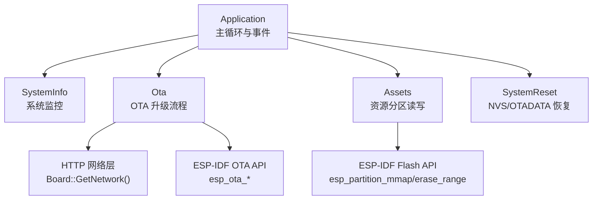
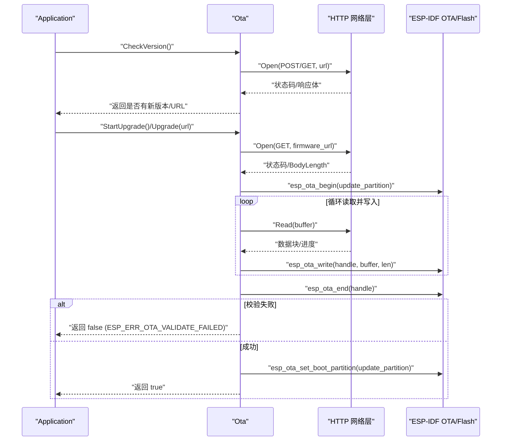
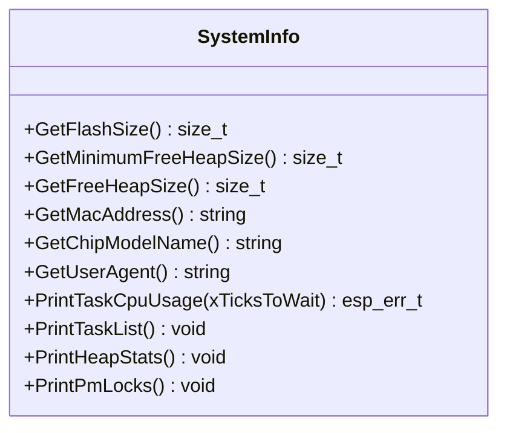
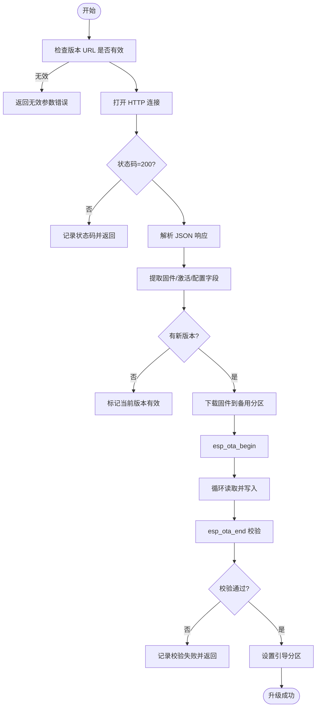
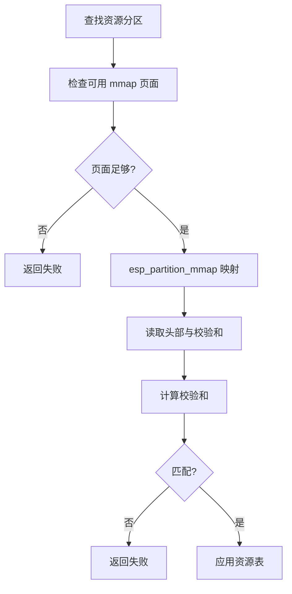
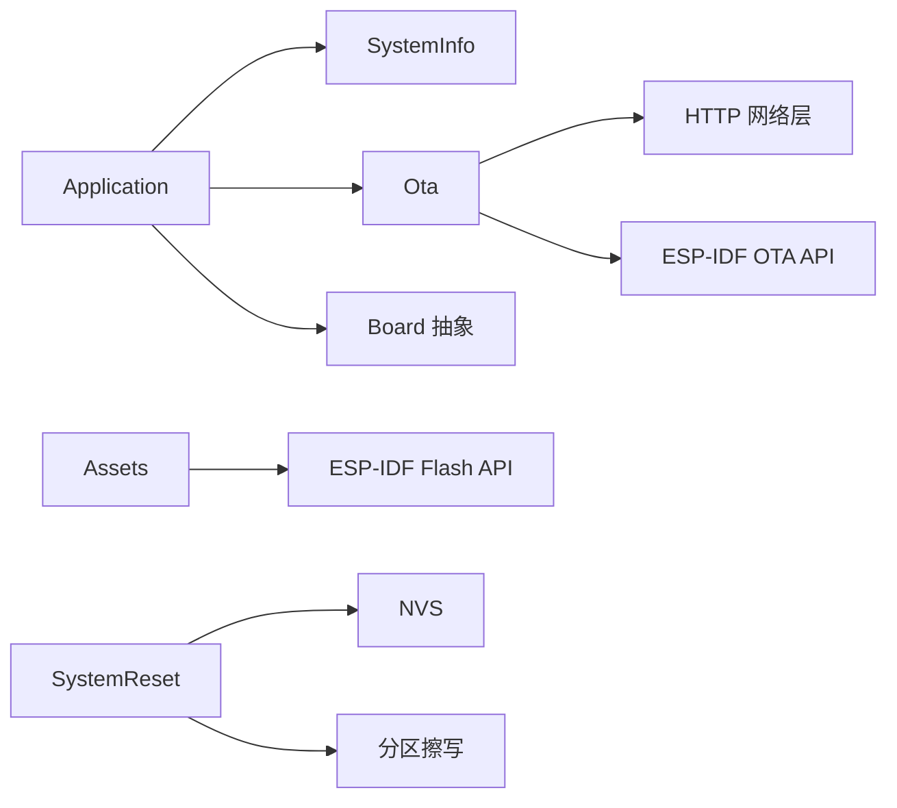

# 内存和资源异常处理

<cite>
**本文引用的文件**   
- [main/system_info.h](file://main/system_info.h)
- [main/system_info.cc](file://main/system_info.cc)
- [main/ota.h](file://main/ota.h)
- [main/ota.cc](file://main/ota.cc)
- [main/application.cc](file://main/application.cc)
- [main/application.h](file://main/application.h)
- [main/assets.cc](file://main/assets.cc)
- [main/boards/common/system_reset.cc](file://main/boards/common/system_reset.cc)
</cite>

## 目录
1. [简介](#简介)
2. [项目结构](#项目结构)
3. [核心组件](#核心组件)
4. [架构总览](#架构总览)
5. [详细组件分析](#详细组件分析)
6. [依赖关系分析](#依赖关系分析)
7. [性能与资源优化建议](#性能与资源优化建议)
8. [故障排查指南](#故障排查指南)
9. [结论](#结论)

## 简介
本文件聚焦 ESP32 系统在内存与资源管理方面的异常处理，覆盖以下主题：
- 内存泄漏检测与堆栈溢出防护思路
- Flash 存储异常（分区映射、擦写失败、校验错误）的处理策略
- SystemInfo 类提供的系统监控能力（内存使用统计、任务 CPU 占用、任务列表等）
- OTA 升级过程中的异常处理（下载失败、校验失败、回滚机制）
- 资源泄漏的预防与检测方法
- 性能优化的最佳实践

## 项目结构
围绕内存与资源异常处理的关键代码集中在以下模块：
- 系统信息监控：SystemInfo 类提供内存、任务、PM 锁等调试接口
- OTA 升级：Ota 类负责版本检查、固件下载、写入、校验与激活流程
- 应用主循环：Application 在启动与运行期调用 SystemInfo 进行周期性诊断
- 资源与分区：Assets 与系统复位逻辑涉及 Flash 分区映射、擦除与校验
- 设备复位：SystemReset 支持 NVS 与 OTA 数据区恢复

图表来源
- [main/application.cc:165-259](file://main/application.cc#L165-L259)
- [main/system_info.cc:18-158](file://main/system_info.cc#L18-L158)
- [main/ota.cc:77-493](file://main/ota.cc#L77-L493)
- [main/assets.cc:130-185](file://main/assets.cc#L130-L185)
- [main/boards/common/system_reset.cc:39-72](file://main/boards/common/system_reset.cc#L39-L72)

章节来源
- [main/application.cc:165-259](file://main/application.cc#L165-L259)
- [main/system_info.h:9-21](file://main/system_info.h#L9-L21)
- [main/system_info.cc:18-158](file://main/system_info.cc#L18-L158)
- [main/ota.h:10-56](file://main/ota.h#L10-L56)
- [main/ota.cc:77-493](file://main/ota.cc#L77-L493)
- [main/assets.cc:130-185](file://main/assets.cc#L130-L185)
- [main/boards/common/system_reset.cc:39-72](file://main/boards/common/system_reset.cc#L39-L72)

## 核心组件
- SystemInfo：提供 Flash 容量、空闲堆大小、最小空闲堆、MAC、芯片型号、用户代理、任务 CPU 占用、任务列表、内部 SRAM 堆统计、PM 锁打印等。
- Ota：负责版本检查、激活、固件下载与写入、校验、设置引导分区、标记当前版本有效等。
- Application：主循环中定时打印堆统计，协调 OTA 与协议初始化，触发升级与激活流程。
- Assets：资源分区的 mmap 映射、校验和计算、按扇区擦写与写入。
- SystemReset：按键触发 NVS 擦除与 OTADATA 恢复，并重启。

章节来源
- [main/system_info.h:9-21](file://main/system_info.h#L9-L21)
- [main/system_info.cc:18-158](file://main/system_info.cc#L18-L158)
- [main/ota.h:10-56](file://main/ota.h#L10-L56)
- [main/ota.cc:77-493](file://main/ota.cc#L77-L493)
- [main/application.cc:248-259](file://main/application.cc#L248-L259)
- [main/assets.cc:130-185](file://main/assets.cc#L130-L185)
- [main/boards/common/system_reset.cc:39-72](file://main/boards/common/system_reset.cc#L39-L72)

## 架构总览
下图展示 OTA 升级过程中关键异常点与处理路径，包括 HTTP 连接、状态码、内容长度、镜像头解析、开始写入、分段写入、结束校验、设置引导分区与回滚保护。

图表来源
- [main/ota.cc:77-120](file://main/ota.cc#L77-L120)
- [main/ota.cc:267-387](file://main/ota.cc#L267-L387)
- [main/application.cc:398-471](file://main/application.cc#L398-L471)

章节来源
- [main/ota.cc:77-120](file://main/ota.cc#L77-L120)
- [main/ota.cc:267-387](file://main/ota.cc#L267-L387)
- [main/application.cc:398-471](file://main/application.cc#L398-L471)

## 详细组件分析

### SystemInfo 系统监控
- 功能要点
  - 获取 Flash 容量、空闲堆大小、最小空闲堆大小
  - 获取 MAC、芯片型号、User-Agent
  - 打印任务 CPU 占用（基于 FreeRTOS 运行时统计）、任务列表
  - 打印内部 SRAM 堆统计与 PM 锁信息
- 典型用法
  - 应用主循环每 10 秒打印一次堆统计，便于观察内存趋势
  - 在激活完成后打印堆统计，辅助定位资源占用峰值
- 异常与边界
  - 任务 CPU 占用计算需要分配数组，若分配失败返回无内存错误
  - 运行时计数器差值为 0 时返回无效状态错误
  - PM 锁打印用于诊断功耗模式锁定问题

图表来源
- [main/system_info.h:9-21](file://main/system_info.h#L9-L21)
- [main/system_info.cc:18-158](file://main/system_info.cc#L18-L158)

章节来源
- [main/system_info.h:9-21](file://main/system_info.h#L9-L21)
- [main/system_info.cc:18-158](file://main/system_info.cc#L18-L158)
- [main/application.cc:248-259](file://main/application.cc#L248-L259)
- [main/application.cc:299-321](file://main/application.cc#L299-L321)

### OTA 升级异常处理
- 版本检查
  - 从配置或默认 URL 获取检查地址，构造请求头（包含 User-Agent、Device-Id、Serial-Number 等）
  - 解析 JSON 响应，提取固件版本、URL、激活参数、MQTT/WebSocket 配置、服务器时间等
  - 比较版本号，必要时强制安装
- 固件下载与写入
  - 打开 HTTP 连接，校验状态码与 BodyLength
  - 预读镜像头以尽早触发 esp_ota_begin
  - 按页缓冲读取并写入，每秒计算进度与速度回调
  - 结束写入后执行校验；若校验失败则记录错误并中止
  - 设置新的引导分区，完成升级
- 激活流程
  - 根据挑战值与序列号生成 HMAC 载荷，提交激活
  - 处理超时与失败状态
- 回滚与有效性标记
  - 非工厂分区运行且处于“待验证”状态时，可标记当前版本为有效，取消回滚

图表来源
- [main/ota.cc:77-120](file://main/ota.cc#L77-L120)
- [main/ota.cc:267-387](file://main/ota.cc#L267-L387)
- [main/ota.cc:247-265](file://main/ota.cc#L247-L265)

章节来源
- [main/ota.h:10-56](file://main/ota.h#L10-L56)
- [main/ota.cc:77-120](file://main/ota.cc#L77-L120)
- [main/ota.cc:267-387](file://main/ota.cc#L267-L387)
- [main/ota.cc:247-265](file://main/ota.cc#L247-L265)
- [main/application.cc:398-471](file://main/application.cc#L398-L471)

### Flash 存储异常与资源分区
- 资源分区映射与校验
  - 查询可用 mmap 页面数，判断是否满足资源分区大小需求
  - 对分区进行 mmap，读取头部元数据并计算校验和，匹配失败则拒绝加载
- 动态更新资源
  - 按扇区擦除与写入，确保写入范围不越界
  - 使用内部 SRAM 缓冲区，避免大对象长期驻留
- 常见异常
  - mmap 失败、校验和不匹配、分区大小不足、扇区擦写失败、写入越界

图表来源
- [main/assets.cc:130-185](file://main/assets.cc#L130-L185)
- [main/assets.cc:514-540](file://main/assets.cc#L514-L540)

章节来源
- [main/assets.cc:130-185](file://main/assets.cc#L130-L185)
- [main/assets.cc:514-540](file://main/assets.cc#L514-L540)

### 系统复位与恢复
- 按键触发
  - 长按特定引脚触发恢复出厂或仅擦除 NVS
- 恢复流程
  - 擦除 NVS 并重新初始化
  - 擦除 OTA 数据分区（otadata），随后延时重启
- 适用场景
  - 升级失败导致无法进入新固件、配置损坏、激活卡住

章节来源
- [main/boards/common/system_reset.cc:39-72](file://main/boards/common/system_reset.cc#L39-L72)

## 依赖关系分析
- Application 依赖 SystemInfo 进行周期性诊断，依赖 Ota 进行版本检查与升级，依赖 Board 获取网络与显示能力
- Ota 依赖 Board 的网络抽象与 SystemInfo 的用户代理信息，底层依赖 ESP-IDF 的 OTA 与分区 API
- Assets 依赖 ESP-IDF 的 Flash 分区与 mmap 能力
- SystemReset 依赖 NVS 与分区擦写 API

图表来源
- [main/application.cc:165-259](file://main/application.cc#L165-L259)
- [main/ota.cc:77-120](file://main/ota.cc#L77-L120)
- [main/assets.cc:130-185](file://main/assets.cc#L130-L185)
- [main/boards/common/system_reset.cc:39-72](file://main/boards/common/system_reset.cc#L39-L72)

章节来源
- [main/application.cc:165-259](file://main/application.cc#L165-L259)
- [main/ota.cc:77-120](file://main/ota.cc#L77-L120)
- [main/assets.cc:130-185](file://main/assets.cc#L130-L185)
- [main/boards/common/system_reset.cc:39-72](file://main/boards/common/system_reset.cc#L39-L72)

## 性能与资源优化建议
- 内存使用监控
  - 定期调用 SystemInfo::PrintHeapStats 输出空闲与最小空闲堆，结合日志平台建立基线与告警阈值
  - 关注 PrintTaskCpuUsage 的任务占比，识别热点任务与潜在阻塞点
- 任务与中断
  - 避免在高频路径中进行大对象分配；优先使用固定大小缓冲与对象池
  - 将耗时操作放入低优先级任务或定时器回调，减少主循环阻塞
- Flash 操作
  - 合并小写入，按扇区对齐擦写，避免频繁擦写造成寿命损耗
  - 在写入前严格校验目标偏移与长度，防止越界
- OTA 稳定性
  - 下载阶段增加重试与断点续传（如需）
  - 校验失败自动回滚至上一版本，确保设备可恢复
- 电源与休眠
  - 合理切换低功耗模式，减少空闲时的功耗与发热
  - 在进入深睡前释放长生命周期资源，避免唤醒后状态不一致

[本节为通用指导，不直接分析具体文件]

## 故障排查指南
- 内存泄漏与堆耗尽
  - 现象：空闲堆持续下降，最小空闲堆接近零，出现分配失败
  - 方法：启用周期性堆统计，对比升级前后差异；使用 PrintTaskCpuUsage 定位高占用任务；检查临时对象是否在作用域结束时释放
  - 参考实现位置
    - [main/system_info.cc:150-154](file://main/system_info.cc#L150-L154)
    - [main/system_info.cc:59-142](file://main/system_info.cc#L59-L142)
    - [main/application.cc:248-259](file://main/application.cc#L248-L259)
- 任务堆栈溢出
  - 现象：看门狗复位或崩溃，任务名出现在异常回溯
  - 方法：增大任务栈空间；拆分复杂函数；减少递归与局部大对象；使用静态或外部缓冲
  - 说明：本项目未直接配置看门狗，需结合 IDF 配置与崩溃日志定位
- Flash 分区异常
  - 现象：资源分区映射失败、校验和不匹配、写入越界
  - 方法：检查可用 mmap 页面数与分区大小；确认头部元数据完整性；按扇区对齐擦写；记录失败偏移与错误码
  - 参考实现位置
    - [main/assets.cc:130-185](file://main/assets.cc#L130-L185)
    - [main/assets.cc:514-540](file://main/assets.cc#L514-L540)
- OTA 升级失败
  - 现象：HTTP 连接失败、状态码非 200、BodyLength 为 0、镜像校验失败、设置引导分区失败
  - 方法：检查网络与 URL；记录状态码与错误码；在失败路径中保留旧版本；必要时触发系统复位
  - 参考实现位置
    - [main/ota.cc:77-120](file://main/ota.cc#L77-L120)
    - [main/ota.cc:267-387](file://main/ota.cc#L267-L387)
    - [main/ota.cc:247-265](file://main/ota.cc#L247-L265)
- 激活与回滚
  - 现象：激活超时、挑战值无效、版本仍处于“待验证”
  - 方法：检查序列号与 HMAC 计算；等待服务器响应；在非工厂分区且状态为“待验证”时主动标记有效
  - 参考实现位置
    - [main/ota.cc:458-493](file://main/ota.cc#L458-L493)
    - [main/ota.cc:247-265](file://main/ota.cc#L247-L265)
- 系统恢复
  - 现象：配置损坏、升级后无法启动
  - 方法：触发按键恢复，擦除 NVS 与 OTADATA，然后重启
  - 参考实现位置
    - [main/boards/common/system_reset.cc:39-72](file://main/boards/common/system_reset.cc#L39-L72)

章节来源
- [main/system_info.cc:59-158](file://main/system_info.cc#L59-L158)
- [main/application.cc:248-259](file://main/application.cc#L248-L259)
- [main/assets.cc:130-185](file://main/assets.cc#L130-L185)
- [main/assets.cc:514-540](file://main/assets.cc#L514-L540)
- [main/ota.cc:77-120](file://main/ota.cc#L77-L120)
- [main/ota.cc:267-387](file://main/ota.cc#L267-L387)
- [main/ota.cc:247-265](file://main/ota.cc#L247-L265)
- [main/ota.cc:458-493](file://main/ota.cc#L458-L493)
- [main/boards/common/system_reset.cc:39-72](file://main/boards/common/system_reset.cc#L39-L72)

## 结论
- SystemInfo 提供了实用的系统监控能力，结合周期性日志可有效发现内存泄漏与任务瓶颈
- OTA 流程具备完善的异常分支与校验机制，配合回滚与有效性标记保障升级可靠性
- Flash 资源分区采用 mmap 与校验和双重保障，写入过程按扇区对齐，降低出错概率
- 通过合理的资源分配策略、任务设计与电源管理，可显著提升系统的稳定性与性能

[本节为总结性内容，不直接分析具体文件]