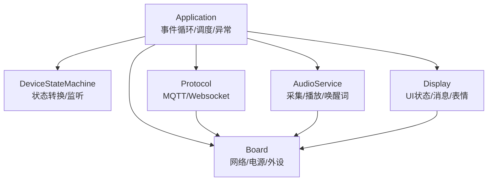
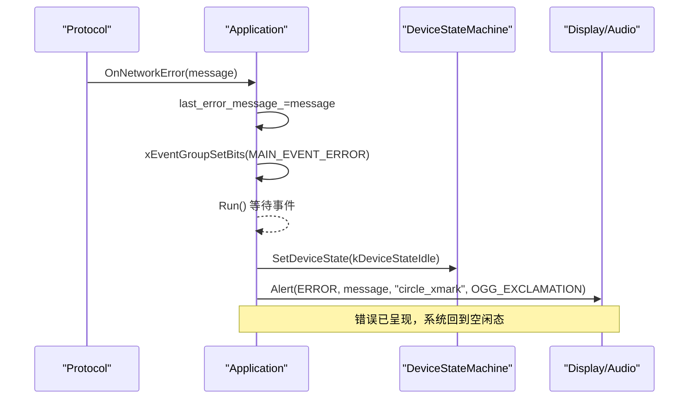
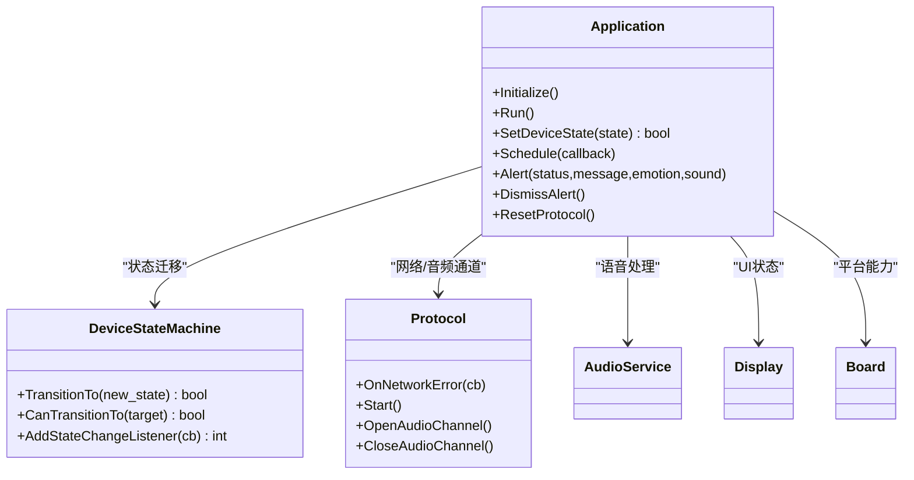
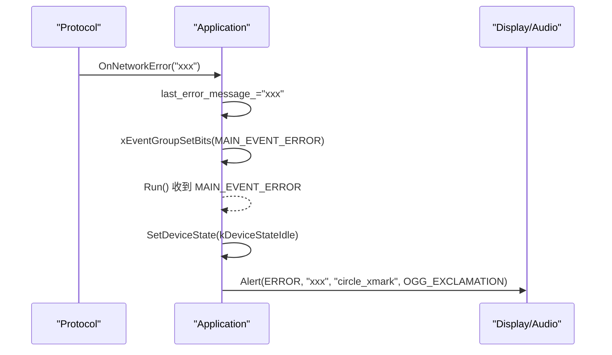
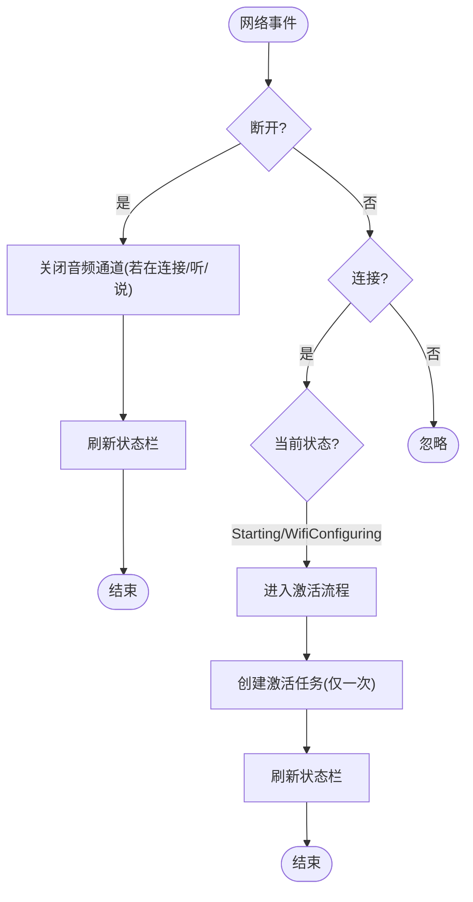

# 应用程序异常处理

<cite>
**本文引用的文件列表**   
- [application.h](file://main/application.h)
- [application.cc](file://main/application.cc)
- [device_state_machine.h](file://main/device_state_machine.h)
- [device_state_machine.cc](file://main/device_state_machine.cc)
</cite>

## 目录
1. [简介](#简介)
2. [项目结构](#项目结构)
3. [核心组件](#核心组件)
4. [架构总览](#架构总览)
5. [详细组件分析](#详细组件分析)
6. [依赖关系分析](#依赖关系分析)
7. [性能与可靠性考量](#性能与可靠性考量)
8. [故障排查指南](#故障排查指南)
9. [结论](#结论)
10. [附录：关键流程时序图](#附录关键流程时序图)

## 简介
本文件聚焦于应用层异常处理机制，围绕 Application 类的事件循环、状态机转换失败策略、任务调度异常以及网络异常恢复进行深入解析。重点说明 MAIN_EVENT_ERROR 事件的处理流程、Alert 与 DismissAlert 的使用场景，并解释设备状态机在激活失败、网络断开重连等异常情况下的行为与恢复路径。文末提供“代码示例路径”以便快速定位实现位置。

## 项目结构
本项目采用分层与模块化组织方式：
- 应用层（Application）：统一事件循环、跨线程任务调度、UI/音频/协议协调、异常上报与提示。
- 状态机（DeviceStateMachine）：严格的状态转换规则与监听回调。
- 协议层（Protocol/MQTT/Websocket）：负责连接、音视频通道、消息分发与错误上报。
- 硬件抽象（Board/Display/AudioService）：平台相关能力封装。

图表来源
- [application.h:43-176](file://main/application.h#L43-L176)
- [device_state_machine.h:17-81](file://main/device_state_machine.h#L17-L81)

章节来源
- [application.h:1-194](file://main/application.h#L1-L194)
- [application.cc:1-1132](file://main/application.cc#L1-L1132)
- [device_state_machine.h:1-84](file://main/device_state_machine.h#L1-L84)
- [device_state_machine.cc:1-162](file://main/device_state_machine.cc#L1-L162)

## 核心组件
- Application
  - 主事件循环 Run()：集中处理网络、状态变更、用户交互、定时器等事件。
  - 任务调度 Schedule()：从任意线程安全地将回调投递到主任务执行。
  - 异常提示 Alert()/DismissAlert()：设置 UI 状态、表情、聊天消息与提示音；在空闲时恢复待机。
  - 协议初始化 InitializeProtocol()：注册 OnNetworkError 回调，将网络错误以 MAIN_EVENT_ERROR 形式上报。
  - 状态管理 SetDeviceState()：委托 DeviceStateMachine 进行受控转换。
- DeviceStateMachine
  - TransitionTo()/IsValidTransition()：定义合法状态迁移表，非法迁移返回 false 并记录日志。
  - AddStateChangeListener()：状态变化时通知监听者（如 Application::HandleStateChangedEvent）。

章节来源
- [application.h:43-176](file://main/application.h#L43-L176)
- [application.cc:165-259](file://main/application.cc#L165-L259)
- [application.cc:473-610](file://main/application.cc#L473-L610)
- [device_state_machine.h:17-81](file://main/device_state_machine.h#L17-L81)
- [device_state_machine.cc:34-131](file://main/device_state_machine.cc#L34-L131)

## 架构总览
下图展示应用层异常处理的关键路径：协议层发生网络错误 -> 设置 last_error_message_ 并触发 MAIN_EVENT_ERROR -> 主循环收到后回退到空闲态并弹出错误提示 -> 后续根据具体错误类型进行恢复或重试。

图表来源
- [application.cc:493-496](file://main/application.cc#L493-L496)
- [application.cc:186-190](file://main/application.cc#L186-L190)
- [application.cc:642-651](file://main/application.cc#L642-L651)

## 详细组件分析

### 事件循环中的错误处理（MAIN_EVENT_ERROR）
- 触发点
  - 协议层通过 OnNetworkError 回调上报错误信息，内部保存 last_error_message_ 并设置 MAIN_EVENT_ERROR 事件位。
- 主循环处理
  - 收到 MAIN_EVENT_ERROR 后，立即尝试将设备状态置为空闲态（kDeviceStateIdle），随后调用 Alert 显示错误信息与提示音。
- 设计要点
  - 使用事件组解耦异步错误上报与主循环处理，避免阻塞协议线程。
  - 先复位状态再提示，确保 UI 与业务逻辑一致。

章节来源
- [application.cc:493-496](file://main/application.cc#L493-L496)
- [application.cc:186-190](file://main/application.cc#L186-L190)

### 状态转换失败的处理策略
- 合法性校验
  - DeviceStateMachine::IsValidTransition 定义了所有允许的状态迁移路径。非法迁移会记录警告日志并返回 false。
- 上层容错
  - Application::SetDeviceState 直接返回 TransitionTo 的结果，调用方可据此判断是否成功。
  - 多处关键路径在切换状态前检查当前状态，或在失败后回退到空闲态，保证系统一致性。
- 典型场景
  - 激活失败：CheckNewVersion 中多次重试仍失败时，可回退到空闲态继续运行。
  - 升级失败：UpgradeFirmware 失败后重启音频服务并提示错误，保持可用。

章节来源
- [device_state_machine.cc:34-102](file://main/device_state_machine.cc#L34-L102)
- [application.cc:57-59](file://main/application.cc#L57-L59)
- [application.cc:398-471](file://main/application.cc#L398-L471)
- [application.cc:972-1022](file://main/application.cc#L972-L1022)

### 任务调度异常（Schedule）
- 作用
  - 从任意线程安全地将回调加入队列，并在主循环的 MAIN_EVENT_SCHEDULE 分支批量执行。
- 异常防护
  - 使用互斥锁保护任务队列，避免并发写入导致崩溃。
  - 主循环一次性移动任务队列并顺序执行，减少锁竞争。
- 常见用法
  - UI 更新、协议资源释放、AEC 模式切换后的音频通道关闭等。

章节来源
- [application.cc:934-940](file://main/application.cc#L934-L940)
- [application.cc:239-246](file://main/application.cc#L239-L246)

### Alert 与 DismissAlert 的使用场景
- Alert
  - 用于向用户呈现错误、加载、升级、激活等信息，同时设置状态、表情、聊天消息与可选提示音。
  - 典型触发点：网络模块错误（SIM/注册/初始化）、资产下载失败、版本检查失败、OTA 升级开始/失败、激活码播报等。
- DismissAlert
  - 当设备处于空闲态且需要恢复默认待机界面时调用，清除错误提示并重置表情与聊天消息。
  - 典型触发点：协议连接成功后清理之前的告警。

章节来源
- [application.cc:143-151](file://main/application.cc#L143-L151)
- [application.cc:384-389](file://main/application.cc#L384-L389)
- [application.cc:419-421](file://main/application.cc#L419-L421)
- [application.cc:489-491](file://main/application.cc#L489-L491)
- [application.cc:642-660](file://main/application.cc#L642-L660)
- [application.cc:985-1011](file://main/application.cc#L985-L1011)

### 设备状态机在异常情况下的行为与恢复
- 激活失败
  - CheckNewVersion 在多次重试失败后退出检查流程，不中断整体运行；若存在激活码/挑战，会在后续流程中继续引导用户完成激活。
- 网络断开重连
  - HandleNetworkDisconnectedEvent 检测到断网时，若处于连接/听/说状态，则主动关闭音频通道，避免资源泄漏；UI 刷新状态栏。
  - 网络重新连接后，HandleNetworkConnectedEvent 在启动或配网阶段自动进入激活流程，必要时创建后台激活任务。
- 升级失败
  - UpgradeFirmware 失败后重启音频服务、恢复省电级别、提示错误并保持运行；成功则重启设备。

章节来源
- [application.cc:286-297](file://main/application.cc#L286-L297)
- [application.cc:261-284](file://main/application.cc#L261-L284)
- [application.cc:398-471](file://main/application.cc#L398-L471)
- [application.cc:972-1022](file://main/application.cc#L972-L1022)

### 代码示例路径（如何正确处理和捕获应用层异常）
- 在协议层上报网络错误并触发 MAIN_EVENT_ERROR
  - [application.cc:493-496](file://main/application.cc#L493-L496)
- 在主循环中处理 MAIN_EVENT_ERROR，回退到空闲态并弹窗
  - [application.cc:186-190](file://main/application.cc#L186-L190)
- 使用 Alert 展示错误信息（含提示音）
  - [application.cc:642-651](file://main/application.cc#L642-L651)
- 在空闲态下使用 DismissAlert 恢复待机界面
  - [application.cc:653-660](file://main/application.cc#L653-L660)
- 网络断开时的恢复：关闭音频通道并刷新 UI
  - [application.cc:286-297](file://main/application.cc#L286-L297)
- 网络重连后的恢复：进入激活流程
  - [application.cc:261-284](file://main/application.cc#L261-L284)
- 状态转换失败的防御性编程（返回 false 并记录日志）
  - [device_state_machine.cc:117-121](file://main/device_state_machine.cc#L117-L121)
- 任务调度的安全写法（跨线程提交回调）
  - [application.cc:934-940](file://main/application.cc#L934-L940)

## 依赖关系分析
- Application 依赖
  - DeviceStateMachine：受控状态迁移与监听。
  - Protocol：网络与音视频通道、JSON 消息分发、错误回调。
  - AudioService：语音采集/播放、唤醒词检测、VAD。
  - Board/Display：平台能力与 UI 呈现。
- 耦合与内聚
  - Application 作为编排中心，职责清晰；状态机独立定义迁移规则，便于扩展与维护。
  - 通过事件组与 Schedule 降低线程间耦合，提高鲁棒性。

图表来源
- [application.h:43-176](file://main/application.h#L43-L176)
- [device_state_machine.h:17-81](file://main/device_state_machine.h#L17-L81)

章节来源
- [application.h:1-194](file://main/application.h#L1-L194)
- [device_state_machine.h:1-84](file://main/device_state_machine.h#L1-L84)

## 性能与可靠性考量
- 事件驱动与优先级
  - 主循环高优先级运行，及时响应错误与网络事件，避免长时间阻塞。
- 资源管理
  - 网络断开时主动关闭音频通道，防止资源泄漏；升级失败后重启音频服务，保障可用性。
- 幂等与防抖
  - 激活任务仅创建一次，重复触发会记录警告并跳过，避免重复激活。
- 重试与退避
  - 版本检查失败采用指数退避重试，限制最大次数，避免雪崩。

[本节为通用指导，无需特定文件引用]

## 故障排查指南
- 常见问题定位
  - 网络错误弹窗：检查 OnNetworkError 回调与 last_error_message_ 赋值是否正确。
    - [application.cc:493-496](file://main/application.cc#L493-L496)
  - 状态卡在非空闲态：查看状态迁移是否被拒绝，确认 IsValidTransition 规则。
    - [device_state_machine.cc:34-102](file://main/device_state_machine.cc#L34-L102)
  - 升级失败：关注 UpgradeFirmware 返回值与后续恢复逻辑。
    - [application.cc:972-1022](file://main/application.cc#L972-L1022)
  - 网络断开未关闭通道：检查 HandleNetworkDisconnectedEvent 分支。
    - [application.cc:286-297](file://main/application.cc#L286-L297)
- 建议的调试手段
  - 启用 ESP_LOG 输出，观察状态迁移与错误提示。
  - 在 Schedule 回调中打印关键变量，验证跨线程数据一致性。

章节来源
- [application.cc:186-190](file://main/application.cc#L186-L190)
- [device_state_machine.cc:117-121](file://main/device_state_machine.cc#L117-L121)
- [application.cc:972-1022](file://main/application.cc#L972-L1022)
- [application.cc:286-297](file://main/application.cc#L286-L297)

## 结论
Application 层通过事件组与任务调度实现了松耦合的异常处理框架：协议错误以 MAIN_EVENT_ERROR 形式上报，主循环统一回退到空闲态并提示用户；状态机严格约束迁移路径，配合上层容错逻辑确保系统在激活失败、网络异常、升级失败等场景下具备良好恢复能力。Alert/DismissAlert 提供了统一的 UI/音频反馈入口，使异常可见、可控、可恢复。

[本节为总结性内容，无需特定文件引用]

## 附录：关键流程时序图

### 网络错误到错误提示的完整链路

图表来源
- [application.cc:493-496](file://main/application.cc#L493-L496)
- [application.cc:186-190](file://main/application.cc#L186-L190)
- [application.cc:642-651](file://main/application.cc#L642-L651)

### 网络断开与重连的恢复流程

图表来源
- [application.cc:286-297](file://main/application.cc#L286-L297)
- [application.cc:261-284](file://main/application.cc#L261-L284)