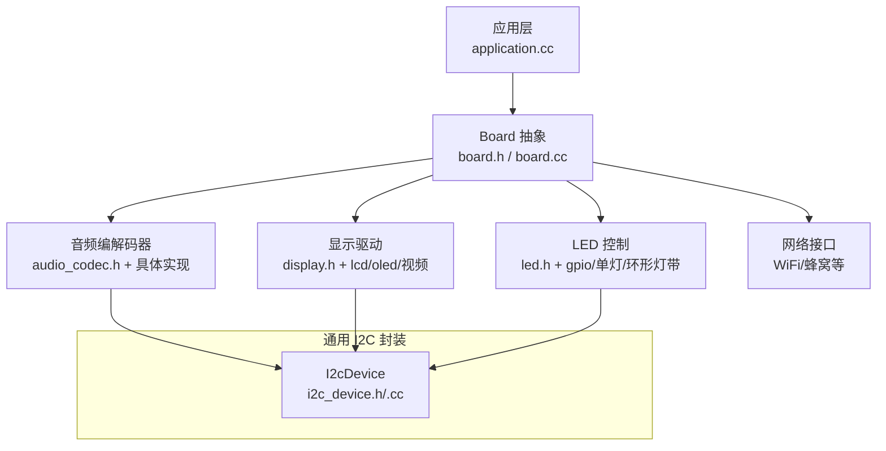
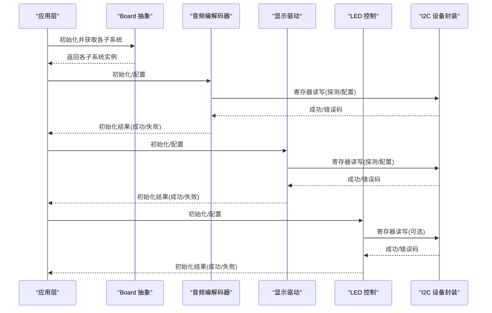
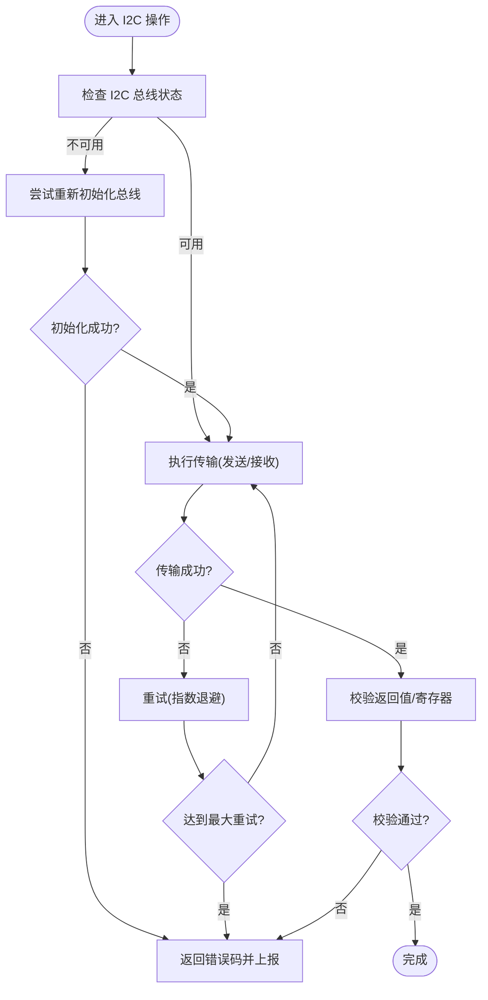
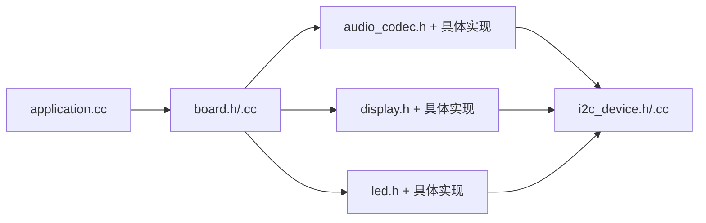

# 硬件驱动异常处理

<cite>
**本文引用的文件**   
- [board.h](file://main/boards/common/board.h)
- [board.cc](file://main/boards/common/board.cc)
- [i2c_device.h](file://main/boards/common/i2c_device.h)
- [i2c_device.cc](file://main/boards/common/i2c_device.cc)
- [audio_codec.h](file://main/audio/audio_codec.h)
- [es8311_audio_codec.h](file://main/audio/codecs/es8311_audio_codec.h)
- [es8374_audio_codec.h](file://main/audio/codecs/es8374_audio_codec.h)
- [es8388_audio_codec.h](file://main/audio/codecs/es8388_audio_codec.h)
- [es8389_audio_codec.h](file://main/audio/codecs/es8389_audio_codec.h)
- [no_audio_codec.h](file://main/audio/codecs/no_audio_codec.h)
- [led.h](file://main/led/led.h)
- [gpio_led.h](file://main/led/gpio_led.h)
- [single_led.h](file://main/led/single_led.h)
- [circular_strip.h](file://main/led/circular_strip.h)
- [display.h](file://main/display/display.h)
- [lcd_display.h](file://main/display/lcd_display.h)
- [oled_display.h](file://main/display/oled_display.h)
- [esp_video.h](file://main/boards/common/esp_video.h)
- [application.cc](file://main/application.cc)
- [assets.cc](file://main/assets.cc)
</cite>

## 目录
1. [简介](#简介)
2. [项目结构](#项目结构)
3. [核心组件](#核心组件)
4. [架构总览](#架构总览)
5. [详细组件分析](#详细组件分析)
6. [依赖关系分析](#依赖关系分析)
7. [性能与稳定性考虑](#性能与稳定性考虑)
8. [故障诊断与测试方法](#故障诊断与测试方法)
9. [结论](#结论)
10. [附录：平台兼容性与差异](#附录平台兼容性与差异)

## 简介
本文件聚焦于硬件驱动层的异常处理，围绕 Board 抽象层及其周边子系统（I2C、显示、LED、音频编解码器）展开。内容涵盖初始化阶段常见错误（如 I2C 设备检测失败、SPI 通信错误、GPIO 配置异常）、具体驱动的异常处理机制、资源竞争与死锁的检测与恢复策略，以及面向多平台的兼容性建议与诊断工具使用方法。目标是帮助开发者在复杂硬件平台上构建健壮、可观测、可恢复的驱动层。

## 项目结构
本项目采用“Board 抽象 + 外设驱动”的分层组织方式：
- Board 抽象层提供统一的硬件能力接口（音频、显示、网络、LED 等），并负责系统信息收集与上报。
- 各外设驱动以独立模块实现，遵循统一接口，便于替换与扩展。
- 应用层通过 Board 抽象访问硬件，屏蔽底层差异。

图表来源
- [board.h:49-85](file://main/boards/common/board.h#L49-L85)
- [board.cc:70-178](file://main/boards/common/board.cc#L70-L178)
- [i2c_device.h:6-16](file://main/boards/common/i2c_device.h#L6-L16)
- [i2c_device.cc:8-35](file://main/boards/common/i2c_device.cc#L8-L35)

章节来源
- [board.h:49-85](file://main/boards/common/board.h#L49-L85)
- [board.cc:70-178](file://main/boards/common/board.cc#L70-L178)

## 核心组件
- Board 抽象层
  - 提供 GetAudioCodec、GetDisplay、GetLed、GetNetwork 等统一接口，默认返回空实现或无功能占位对象，便于在无对应硬件时降级运行。
  - 提供系统信息 JSON 输出，包含芯片、分区、OTA、显示等元数据，用于诊断与遥测。
- I2C 设备封装
  - 基于 ESP-IDF I2C Master API，提供寄存器读写封装，内部使用宏进行错误检查。
- 音频编解码器
  - 通过 audio_codec.h 定义统一接口，具体实现包括 ES8311/ES8374/ES8388/ES8389 及无音频占位实现。
- 显示驱动
  - display.h 定义统一接口，具体实现包括 LCD/OLED 及视频输出封装。
- LED 控制
  - led.h 定义统一接口，具体实现包括 GPIO 直驱、单灯、环形灯带等。

章节来源
- [board.h:49-85](file://main/boards/common/board.h#L49-L85)
- [i2c_device.h:6-16](file://main/boards/common/i2c_device.h#L6-L16)
- [i2c_device.cc:8-35](file://main/boards/common/i2c_device.cc#L8-L35)
- [audio_codec.h](file://main/audio/audio_codec.h)
- [es8311_audio_codec.h](file://main/audio/codecs/es8311_audio_codec.h)
- [es8374_audio_codec.h](file://main/audio/codecs/es8374_audio_codec.h)
- [es8388_audio_codec.h](file://main/audio/codecs/es8388_audio_codec.h)
- [es8389_audio_codec.h](file://main/audio/codecs/es8389_audio_codec.h)
- [no_audio_codec.h](file://main/audio/codecs/no_audio_codec.h)
- [display.h](file://main/display/display.h)
- [lcd_display.h](file://main/display/lcd_display.h)
- [oled_display.h](file://main/display/oled_display.h)
- [esp_video.h](file://main/boards/common/esp_video.h)
- [led.h](file://main/led/led.h)
- [gpio_led.h](file://main/led/gpio_led.h)
- [single_led.h](file://main/led/single_led.h)
- [circular_strip.h](file://main/led/circular_strip.h)

## 架构总览
下图展示了从应用层到硬件驱动的调用路径，以及关键异常点的位置。

图表来源
- [board.h:49-85](file://main/boards/common/board.h#L49-L85)
- [i2c_device.cc:8-35](file://main/boards/common/i2c_device.cc#L8-L35)
- [audio_codec.h](file://main/audio/audio_codec.h)
- [display.h](file://main/display/display.h)
- [led.h](file://main/led/led.h)

## 详细组件分析

### I2C 设备封装异常处理
- 初始化阶段
  - 设备注册失败：通过错误检查宏捕获，若失败将触发断言或上层回退逻辑。
  - 总线速度/地址配置不当：需在 Board 配置中正确设置，否则后续读写均会失败。
- 读写阶段
  - 写寄存器失败：传输超时或 NACK，应记录日志并向上层返回错误码。
  - 读寄存器失败：读取为空或校验失败，需重试或标记设备不可用。
- 建议
  - 为所有 I2C 操作增加超时与重试策略。
  - 对关键寄存器进行版本/ID 校验，避免误配。
  - 将错误码映射为可读的诊断信息，便于定位。

图表来源
- [i2c_device.h:6-16](file://main/boards/common/i2c_device.h#L6-L16)
- [i2c_device.cc:8-35](file://main/boards/common/i2c_device.cc#L8-L35)

章节来源
- [i2c_device.h:6-16](file://main/boards/common/i2c_device.h#L6-L16)
- [i2c_device.cc:8-35](file://main/boards/common/i2c_device.cc#L8-L35)

### 显示驱动异常处理
- 初始化流程
  - 面板驱动加载失败：返回空指针或占位显示对象，应用层应降级显示或提示用户。
  - SPI/I2C 通信错误：记录错误码并重试；多次失败后标记显示不可用。
- 运行时异常
  - 帧缓冲分配失败：降低分辨率或关闭特效，确保基本 UI 可用。
  - 背光/电源控制失败：保持最低亮度，避免完全黑屏。
- 建议
  - 在 Board 抽象层提供 GetDisplay 的默认占位实现，保证无屏时仍可运行。
  - 对显示初始化过程增加分步日志，便于定位具体失败环节。

章节来源
- [board.cc:56-68](file://main/boards/common/board.cc#L56-L68)
- [display.h](file://main/display/display.h)
- [lcd_display.h](file://main/display/lcd_display.h)
- [oled_display.h](file://main/display/oled_display.h)
- [esp_video.h](file://main/boards/common/esp_video.h)

### LED 控制异常处理
- 初始化流程
  - GPIO 配置失败：记录错误并切换到无功能 LED 占位实现。
  - 灯带控制器初始化失败：降级为单灯模式或关闭指示。
- 运行时异常
  - 更新失败（DMA/中断问题）：重试一次，仍失败则跳过本次更新并记录。
- 建议
  - 为 LED 控制增加心跳闪烁，便于判断是否卡死。
  - 对高负载动画进行节流，避免阻塞主循环。

章节来源
- [board.cc:65-68](file://main/boards/common/board.cc#L65-L68)
- [led.h](file://main/led/led.h)
- [gpio_led.h](file://main/led/gpio_led.h)
- [single_led.h](file://main/led/single_led.h)
- [circular_strip.h](file://main/led/circular_strip.h)

### 音频编解码器异常处理
- 初始化流程
  - I2C 探测失败：返回错误码，应用层可选择禁用音频或切换至占位实现。
  - 寄存器配置失败：重试若干次，仍失败则记录并上报。
- 运行时异常
  - 音频通道未启用：根据空闲超时自动关闭/开启，避免功耗浪费。
  - 采样率不匹配：应用层发出警告并尝试重采样或协商参数。
- 建议
  - 在 Board 抽象层提供 GetAudioCodec 的具体实现，支持热插拔与动态切换。
  - 对音频链路增加健康检查（如环回测试），定期验证通路正常。

章节来源
- [audio_codec.h](file://main/audio/audio_codec.h)
- [es8311_audio_codec.h](file://main/audio/codecs/es8311_audio_codec.h)
- [es8374_audio_codec.h](file://main/audio/codecs/es8374_audio_codec.h)
- [es8388_audio_codec.h](file://main/audio/codecs/es8388_audio_codec.h)
- [es8389_audio_codec.h](file://main/audio/codecs/es8389_audio_codec.h)
- [no_audio_codec.h](file://main/audio/codecs/no_audio_codec.h)
- [application.cc:506-507](file://main/application.cc#L506-L507)

### Board 抽象层与系统信息
- 系统信息 JSON
  - 包含语言、Flash、最小堆、MAC、UUID、芯片信息、分区表、OTA、显示信息等，便于远程诊断。
- 默认占位实现
  - 无显示/摄像头/电池温度时返回默认值，保证上层逻辑不因硬件缺失而崩溃。
- 建议
  - 在异常路径中将错误原因写入系统信息 JSON，便于集中采集与分析。

章节来源
- [board.cc:70-178](file://main/boards/common/board.cc#L70-L178)
- [board.h:49-85](file://main/boards/common/board.h#L49-L85)

## 依赖关系分析
- Board 抽象层依赖各子系统接口，但不直接耦合具体实现，利于替换与测试。
- I2C 设备封装被音频、显示、LED 等多处复用，形成共享基础设施。
- 应用层通过 Board 抽象访问硬件，异常由具体驱动层处理并向上层反馈。

图表来源
- [board.h:49-85](file://main/boards/common/board.h#L49-L85)
- [board.cc:70-178](file://main/boards/common/board.cc#L70-L178)
- [i2c_device.h:6-16](file://main/boards/common/i2c_device.h#L6-L16)
- [i2c_device.cc:8-35](file://main/boards/common/i2c_device.cc#L8-L35)
- [audio_codec.h](file://main/audio/audio_codec.h)
- [display.h](file://main/display/display.h)
- [led.h](file://main/led/led.h)

章节来源
- [board.h:49-85](file://main/boards/common/board.h#L49-L85)
- [board.cc:70-178](file://main/boards/common/board.cc#L70-L178)
- [i2c_device.h:6-16](file://main/boards/common/i2c_device.h#L6-L16)
- [i2c_device.cc:8-35](file://main/boards/common/i2c_device.cc#L8-L35)

## 性能与稳定性考虑
- 超时与重试
  - 对所有 I2C/SPI/GPIO 操作设置合理超时，配合指数退避重试，避免瞬时干扰导致永久失败。
- 资源占用
  - 音频通道空闲自动关闭，减少功耗与总线占用。
  - 显示刷新与 LED 动画采用队列/任务调度，避免阻塞主循环。
- 内存管理
  - 大缓冲区分配失败时降级分辨率或关闭特效，保障核心功能可用。
- 日志与遥测
  - 关键路径增加结构化日志，结合系统信息 JSON 上报，便于远程定位问题。

[本节为通用指导，无需特定文件引用]

## 故障诊断与测试方法
- 启动阶段自检
  - I2C 扫描：枚举总线上的设备地址，确认关键器件在线。
  - 寄存器 ID 校验：读取设备 ID 寄存器，验证型号与版本。
  - 显示自检：绘制基础图形/字符，确认面板与背光工作。
  - LED 心跳：周期性闪烁，确认控制链路正常。
- 运行时监控
  - 错误码统计：累计各类错误次数，超过阈值触发告警或复位。
  - 系统信息 JSON：定时输出，包含硬件与软件版本、分区、堆栈等信息。
- 压力与回归测试
  - 长时间运行：模拟高频 I2C 访问与显示刷新，观察稳定性。
  - 异常注入：断开 I2C 线、短路总线、模拟超时，验证恢复逻辑。
  - 资源耗尽：限制堆大小，验证降级策略有效。

章节来源
- [board.cc:70-178](file://main/boards/common/board.cc#L70-L178)
- [application.cc:1007](file://main/application.cc#L1007)
- [assets.cc:78-230](file://main/assets.cc#L78-L230)

## 结论
通过在 Board 抽象层统一暴露硬件能力并提供默认占位实现，结合 I2C 设备封装的错误检查与重试策略，本项目能够在多种硬件平台上实现一致的异常处理体验。针对显示、LED、音频等子系统，建议在初始化与运行时分别实施健壮的容错与降级策略，并通过系统信息 JSON 与结构化日志提升可观测性。对于资源竞争与死锁风险，应采用超时、互斥与优先级设计，辅以压力测试与异常注入验证。

[本节为总结性内容，无需特定文件引用]

## 附录：平台兼容性与差异
- ESP32/ESP32-S3/ESP32-C3/C6/P4 等平台的 I2C/SPI/GPIO 特性存在差异，需在 Board 配置中明确引脚与时钟参数。
- 不同音频编解码器的寄存器定义与初始化序列不同，应在各自实现中封装差异，对外暴露统一接口。
- 显示面板驱动多样，建议在 Board 层按面板类型选择合适驱动，并在初始化失败时回退到占位显示。
- 资源受限平台（小 Flash/PSRAM）需关注内存分配与分区布局，必要时裁剪功能或降低分辨率。

[本节为通用指导，无需特定文件引用]