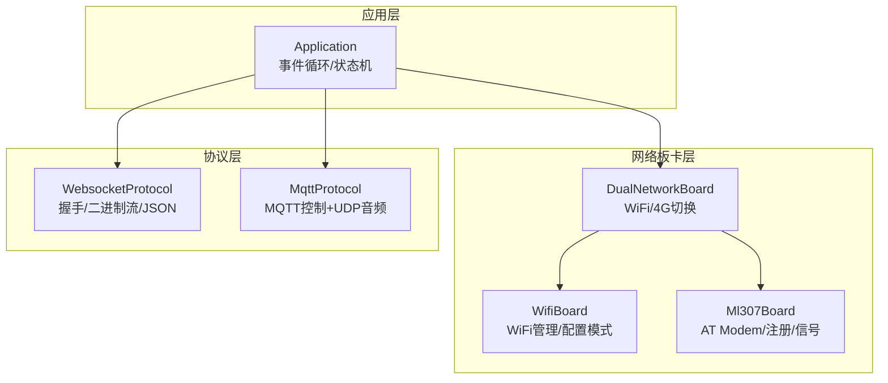
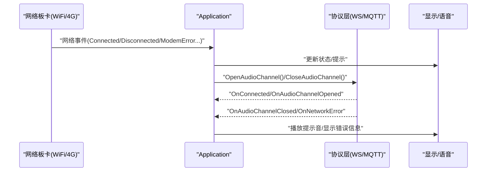
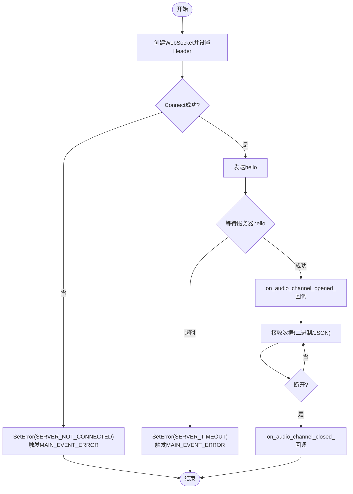
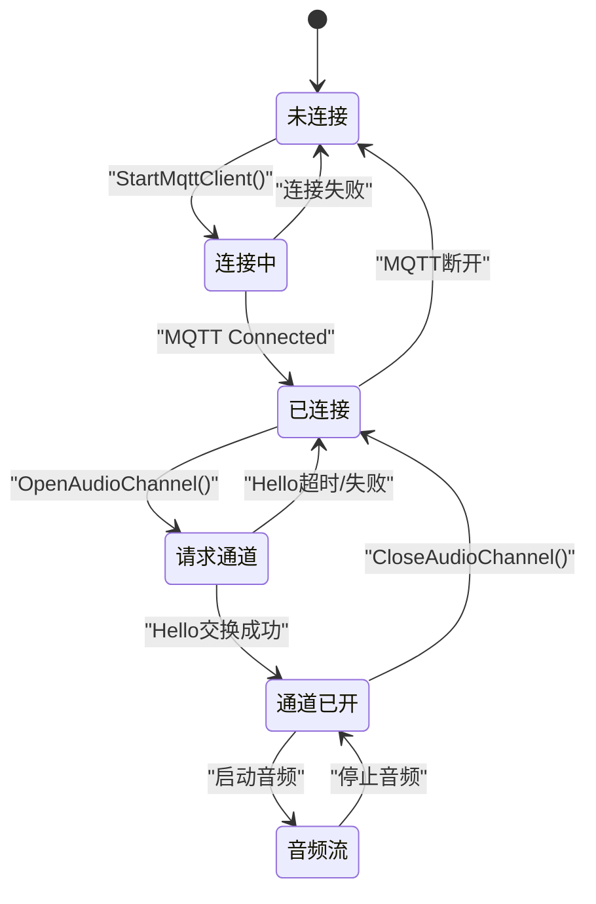
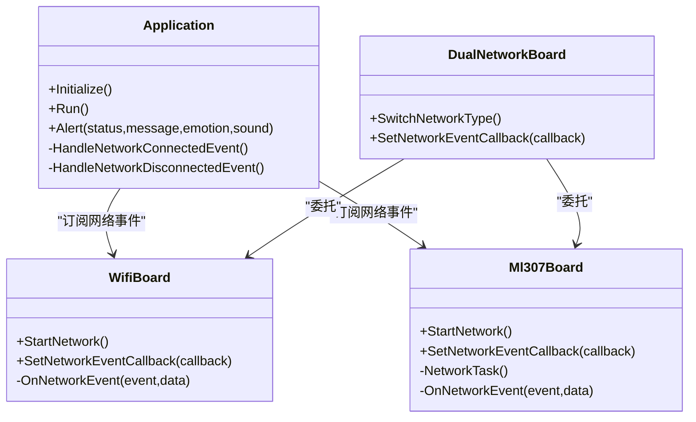
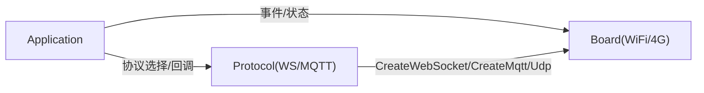

# 网络通信异常处理

<cite>
**本文引用的文件**   
- [application.h](file://main/application.h)
- [application.cc](file://main/application.cc)
- [mqtt_protocol.h](file://main/protocols/mqtt_protocol.h)
- [mqtt_protocol.cc](file://main/protocols/mqtt_protocol.cc)
- [websocket_protocol.h](file://main/protocols/websocket_protocol.h)
- [websocket_protocol.cc](file://main/protocols/websocket_protocol.cc)
- [wifi_board.h](file://main/boards/common/wifi_board.h)
- [wifi_board.cc](file://main/boards/common/wifi_board.cc)
- [ml307_board.h](file://main/boards/common/ml307_board.h)
- [ml307_board.cc](file://main/boards/common/ml307_board.cc)
- [dual_network_board.h](file://main/boards/common/dual_network_board.h)
- [dual_network_board.cc](file://main/boards/common/dual_network_board.cc)
- [nt26_board.cc](file://main/boards/common/nt26_board.cc)
- [websocket_zh.md](file://docs/websocket_zh.md)
- [mqtt-udp.md](file://docs/mqtt-udp.md)
</cite>

## 目录
1. [简介](#简介)
2. [项目结构](#项目结构)
3. [核心组件](#核心组件)
4. [架构总览](#架构总览)
5. [详细组件分析](#详细组件分析)
6. [依赖关系分析](#依赖关系分析)
7. [性能与稳定性考量](#性能与稳定性考量)
8. [故障排查指南](#故障排查指南)
9. [结论](#结论)
10. [附录](#附录)

## 简介
本文件聚焦于设备在网络通信中的异常处理机制，覆盖以下关键主题：
- WebSocket 与 MQTT（含 UDP 音频通道）的异常处理流程
- 连接失败、断线重连、消息传输错误等场景的处理策略
- 网络事件回调中的异常处理，如 NetworkEvent::Disconnected、NetworkEvent::ModemErrorNoSIM 等
- 协议层错误码映射与用户友好的错误提示机制
- 网络诊断工具的使用方法与常见问题排查步骤
- WiFi 与 4G（ML307）网络环境下的差异与适配

## 项目结构
本项目将网络能力抽象为 Board 层（WiFi/4G/双网），协议层实现为 Protocol（WebSocket/MQTT），应用层 Application 负责状态机、事件分发与 UI 反馈。

**图示来源**
- [application.h:1-194](file://main/application.h#L1-L194)
- [application.cc:1-800](file://main/application.cc#L1-L800)
- [wifi_board.h:1-70](file://main/boards/common/wifi_board.h#L1-L70)
- [ml307_board.h:1-39](file://main/boards/common/ml307_board.h#L1-L39)
- [dual_network_board.h:1-60](file://main/boards/common/dual_network_board.h#L1-L60)
- [websocket_protocol.h:1-35](file://main/protocols/websocket_protocol.h#L1-L35)
- [mqtt_protocol.h:1-66](file://main/protocols/mqtt_protocol.h#L1-L66)

**章节来源**
- [application.h:1-194](file://main/application.h#L1-L194)
- [application.cc:1-800](file://main/application.cc#L1-L800)
- [wifi_board.h:1-70](file://main/boards/common/wifi_board.h#L1-L70)
- [ml307_board.h:1-39](file://main/boards/common/ml307_board.h#L1-L39)
- [dual_network_board.h:1-60](file://main/boards/common/dual_network_board.h#L1-L60)
- [websocket_protocol.h:1-35](file://main/protocols/websocket_protocol.h#L1-L35)
- [mqtt_protocol.h:1-66](file://main/protocols/mqtt_protocol.h#L1-L66)

## 核心组件
- 应用层 Application
  - 统一网络事件回调，驱动 UI 提示与主事件循环
  - 根据 OTA 配置选择 WebSocket 或 MQTT 协议
  - 监听协议层 OnNetworkError 并转换为全局错误事件
- 网络板卡层
  - WifiBoard：WiFi 扫描/连接/断开/配置模式，超时进入配网
  - Ml307Board：AT 模组检测、网络注册、CSQ 信号强度上报
  - DualNetworkBoard：在 WiFi 与 4G 间切换，持久化当前网络类型
- 协议层
  - WebsocketProtocol：建立连接、发送 Hello、解析服务器 Hello、二进制/文本收发、断线回调
  - MqttProtocol：MQTT 连接/心跳/重连、Hello/Goodbye 交换、UDP 音频通道加密与收发

**章节来源**
- [application.cc:1-800](file://main/application.cc#L1-L800)
- [websocket_protocol.cc:1-255](file://main/protocols/websocket_protocol.cc#L1-L255)
- [mqtt_protocol.cc:1-232](file://main/protocols/mqtt_protocol.cc#L1-L232)
- [wifi_board.cc:1-358](file://main/boards/common/wifi_board.cc#L1-L358)
- [ml307_board.cc:1-271](file://main/boards/common/ml307_board.cc#L1-L271)
- [dual_network_board.cc:1-99](file://main/boards/common/dual_network_board.cc#L1-L99)

## 架构总览
下图展示从网络事件到协议层、再到应用层的完整链路，以及典型异常路径。

**图示来源**
- [application.cc:1-800](file://main/application.cc#L1-L800)
- [websocket_protocol.cc:1-255](file://main/protocols/websocket_protocol.cc#L1-L255)
- [mqtt_protocol.cc:1-232](file://main/protocols/mqtt_protocol.cc#L1-L232)
- [wifi_board.cc:1-358](file://main/boards/common/wifi_board.cc#L1-L358)
- [ml307_board.cc:1-271](file://main/boards/common/ml307_board.cc#L1-L271)

## 详细组件分析

### WebSocket 异常处理
- 连接阶段
  - 创建 WebSocket 实例并设置请求头（Token、协议版本、设备标识）
  - Connect(url) 失败时记录错误码并触发 SetError，应用层收到 MAIN_EVENT_ERROR 后弹出“无法连接到服务”类提示
  - 等待服务器 Hello 超时则触发 SetError，提示“服务器超时”
- 运行阶段
  - 数据回调中区分二进制与 JSON；二进制按版本解析后投递给上层音频解码队列
  - 文本消息包含 hello/tts/stt/system/alert 等类型，由 Application 解析并驱动状态机与 UI
- 断开阶段
  - OnDisconnected 回调触发 on_audio_channel_closed_，应用层清理状态并回到空闲
- 文档参考
  - 连接失败与服务器断开行为见文档说明

**图示来源**
- [websocket_protocol.cc:1-255](file://main/protocols/websocket_protocol.cc#L1-L255)
- [application.cc:1-800](file://main/application.cc#L1-L800)
- [websocket_zh.md:369-380](file://docs/websocket_zh.md#L369-L380)

**章节来源**
- [websocket_protocol.cc:1-255](file://main/protocols/websocket_protocol.cc#L1-L255)
- [application.cc:1-800](file://main/application.cc#L1-L800)
- [websocket_zh.md:369-380](file://docs/websocket_zh.md#L369-L380)

### MQTT（含 UDP 音频通道）异常处理
- 连接阶段
  - 读取存储中的 endpoint/client_id/username/password/keepalive/publish_topic
  - Connect(broker, port, ...) 失败时记录错误码并 SetError(SERVER_NOT_CONNECTED)
- 运行阶段
  - 订阅/发布控制消息，解析 hello/goodbye 与通用 JSON
  - UDP 音频通道通过 AES 加密发送，关闭通道时可选择发送 goodbye
- 断开与重连
  - OnDisconnected 回调触发定时重连任务（间隔固定毫秒数）
  - 定时器仅在空闲态触发重连，避免占用资源
- 文档参考
  - 状态机与错误处理说明见文档

**图示来源**
- [mqtt-udp.md:243-308](file://docs/mqtt-udp.md#L243-L308)
- [mqtt_protocol.cc:1-232](file://main/protocols/mqtt_protocol.cc#L1-L232)

**章节来源**
- [mqtt_protocol.cc:1-232](file://main/protocols/mqtt_protocol.cc#L1-L232)
- [mqtt-udp.md:243-308](file://docs/mqtt-udp.md#L243-L308)

### 网络事件回调与错误映射
- WiFi 网络事件
  - Scanning/Connecting/Connected/Disconnected/WifiConfigModeEnter/Exit
  - 连接超时自动进入配网模式，支持热点/Blufi/声学等多种配网方式
- 4G（ML307）网络事件
  - ModemDetecting/Connecting/Connected/Disconnected
  - 错误事件：ModemErrorNoSim、ModemErrorRegDenied、ModemErrorInitFailed、ModemErrorTimeout
  - NT26 系列也映射 UartEthModem 的错误至统一事件
- 应用层处理
  - 将网络事件转为 UI 提示与主事件（MAIN_EVENT_NETWORK_*）
  - 对 ModemError* 进行 Alert 提示，包括音效与图标

**图示来源**
- [application.cc:1-800](file://main/application.cc#L1-L800)
- [wifi_board.cc:1-358](file://main/boards/common/wifi_board.cc#L1-L358)
- [ml307_board.cc:1-271](file://main/boards/common/ml307_board.cc#L1-L271)
- [dual_network_board.cc:1-99](file://main/boards/common/dual_network_board.cc#L1-L99)
- [nt26_board.cc:85-112](file://main/boards/common/nt26_board.cc#L85-L112)

**章节来源**
- [application.cc:1-800](file://main/application.cc#L1-L800)
- [wifi_board.cc:1-358](file://main/boards/common/wifi_board.cc#L1-L358)
- [ml307_board.cc:1-271](file://main/boards/common/ml307_board.cc#L1-L271)
- [dual_network_board.cc:1-99](file://main/boards/common/dual_network_board.cc#L1-L99)
- [nt26_board.cc:85-112](file://main/boards/common/nt26_board.cc#L85-L112)

### 不同网络环境的异常处理差异
- WiFi
  - 连接失败/超时：进入配网模式，提供多种配网入口
  - 断开：通知应用层关闭音频通道，刷新状态栏
- 4G（ML307）
  - 无 SIM/注册被拒/初始化失败/超时：分别触发对应错误事件，应用层给出明确提示与音效
  - 信号质量 CSQ 分级用于 UI 图标与状态描述
- 双网切换
  - 通过 Settings 持久化网络类型，重启后生效；切换过程会提示目标网络类型

**章节来源**
- [wifi_board.cc:1-358](file://main/boards/common/wifi_board.cc#L1-L358)
- [ml307_board.cc:1-271](file://main/boards/common/ml307_board.cc#L1-L271)
- [dual_network_board.cc:1-99](file://main/boards/common/dual_network_board.cc#L1-L99)

## 依赖关系分析
- Application 依赖 Board 提供的网络事件与网络接口
- Board 封装底层 WiFi/4G 细节，向上暴露统一事件与状态
- Protocol 依赖 Board 的网络接口创建 WebSocket/MQTT/UDP 对象
- 错误传播路径：底层错误 -> Board 事件 -> Application 事件 -> UI 提示

**图示来源**
- [application.cc:1-800](file://main/application.cc#L1-L800)
- [websocket_protocol.cc:1-255](file://main/protocols/websocket_protocol.cc#L1-L255)
- [mqtt_protocol.cc:1-232](file://main/protocols/mqtt_protocol.cc#L1-L232)

**章节来源**
- [application.cc:1-800](file://main/application.cc#L1-L800)
- [websocket_protocol.cc:1-255](file://main/protocols/websocket_protocol.cc#L1-L255)
- [mqtt_protocol.cc:1-232](file://main/protocols/mqtt_protocol.cc#L1-L232)

## 性能与稳定性考量
- 重连策略
  - MQTT 使用定时器延迟重连，避免频繁重试造成拥塞
  - WebSocket 无内置自动重连，需在上层结合网络事件与状态机触发重连
- 资源释放
  - 协议析构时确保定时器停止、事件组销毁、UDP/MQTT 对象释放
- 功耗管理
  - 打开音频通道提升性能模式，关闭通道恢复低功耗
- 超时与心跳
  - MQTT keepalive 与 Hello 超时保护，防止僵尸连接

[本节为通用指导，不直接分析具体文件]

## 故障排查指南
- 快速定位
  - 查看应用层日志与 UI 提示：是否出现“无法连接到服务/服务器超时/模块未检测到/SIM卡缺失/注册被拒绝”等
  - 检查网络事件：Scanning/Connecting/Connected/Disconnected 序列是否符合预期
- 常见问题
  - WiFi 无法连接
    - 确认 SSID 列表是否存在，若为空直接进入配网模式
    - 连接超时自动进入配网，检查路由器密码/频段/认证方式
  - 4G 无信号/注册失败
    - 检查 SIM 卡安装与运营商套餐状态
    - 关注 CSQ 值变化，弱信号下建议靠近基站或更换天线位置
  - 音频通道不稳定
    - 观察 MQTT/UDP 是否频繁断开重连
    - 检查服务端 Hello/Goodbye 交互是否正常
- 诊断工具与输出
  - 设备状态 JSON：包含网络类型、SSID/运营商、信号强度、芯片温度等
  - 系统信息：堆栈/内存统计周期性打印，便于评估资源压力
  - 双网切换：通过命令切换网络类型并重启，验证不同网络下的表现

**章节来源**
- [application.cc:1-800](file://main/application.cc#L1-L800)
- [wifi_board.cc:1-358](file://main/boards/common/wifi_board.cc#L1-L358)
- [ml307_board.cc:1-271](file://main/boards/common/ml307_board.cc#L1-L271)
- [dual_network_board.cc:1-99](file://main/boards/common/dual_network_board.cc#L1-L99)

## 结论
本项目通过统一的 Board 抽象与 Protocol 实现，构建了稳健的网络通信与异常处理体系。WiFi 侧重配网与连接体验，4G 强调模组检测与注册失败的明确提示；WebSocket 与 MQTT 分别在实时性与可靠性上各有优势。结合事件驱动的 UI 反馈与可观测的状态输出，能够快速定位并解决常见网络问题。

[本节为总结性内容，不直接分析具体文件]

## 附录
- 术语
  - Hello/Goodbye：会话建立与终止的控制消息
  - Keepalive：长连接保活机制
  - CSQ：蜂窝网络信号质量指标
- 相关文档
  - WebSocket 错误处理说明
  - MQTT-UDP 状态管理与错误处理

**章节来源**
- [websocket_zh.md:369-380](file://docs/websocket_zh.md#L369-L380)
- [mqtt-udp.md:243-308](file://docs/mqtt-udp.md#L243-L308)