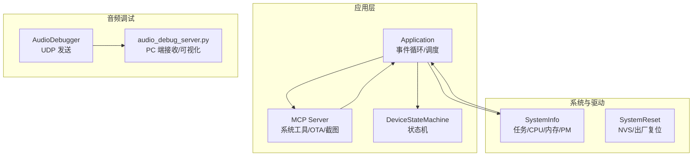
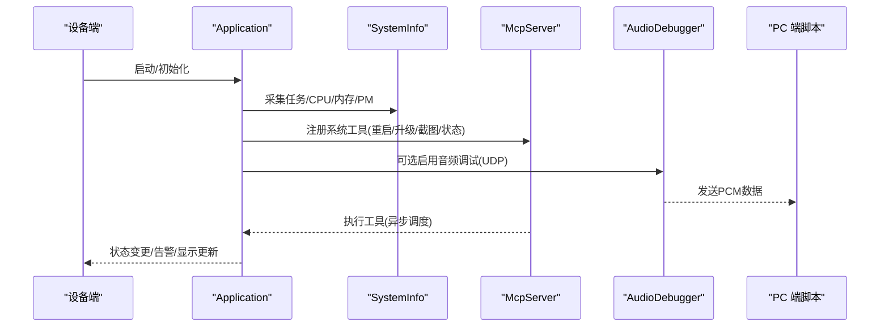
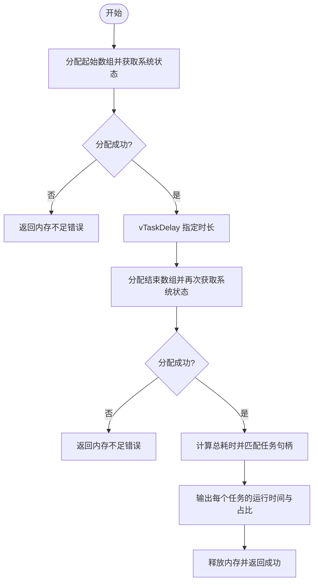
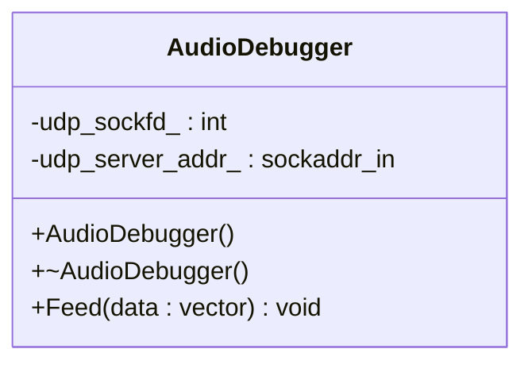
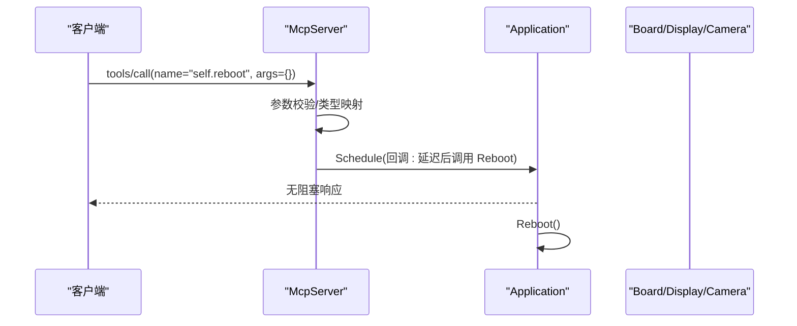
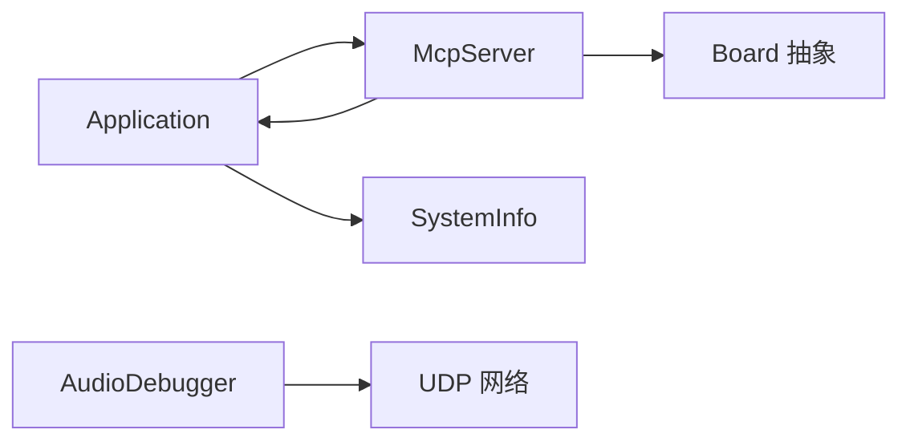

# 调试和故障排除

<cite>
**本文引用的文件**   
- [main/system_info.h](file://main/system_info.h)
- [main/system_info.cc](file://main/system_info.cc)
- [main/audio/processors/audio_debugger.h](file://main/audio/processors/audio_debugger.h)
- [main/audio/processors/audio_debugger.cc](file://main/audio/processors/audio_debugger.cc)
- [scripts/audio_debug_server.py](file://scripts/audio_debug_server.py)
- [main/mcp_server.h](file://main/mcp_server.h)
- [main/mcp_server.cc](file://main/mcp_server.cc)
- [main/application.h](file://main/application.h)
- [main/application.cc](file://main/application.cc)
- [main/device_state_machine.h](file://main/device_state_machine.h)
- [main/boards/common/system_reset.cc](file://main/boards/common/system_reset.cc)
- [README.md](file://README.md)
</cite>

## 目录
1. [简介](#简介)
2. [项目结构](#项目结构)
3. [核心组件](#核心组件)
4. [架构总览](#架构总览)
5. [详细组件分析](#详细组件分析)
6. [依赖关系分析](#依赖关系分析)
7. [性能与资源分析](#性能与资源分析)
8. [常见问题诊断流程](#常见问题诊断流程)
9. [日志级别与关键信息解读](#日志级别与关键信息解读)
10. [远程调试与生产环境定位技巧](#远程调试与生产环境定位技巧)
11. [结论](#结论)
12. [附录](#附录)

## 简介
本指南面向使用 ESP-IDF 框架的开发者，聚焦于本项目内置的调试与排障能力，包括：
- GDB 本地调试（ESP-IDF 标准工具链）
- 系统信息与运行态采集（任务、CPU、堆栈、PM 锁等）
- 音频调试服务器（UDP 实时音频流导出）
- MCP 协议侧的系统工具（重启、固件升级、屏幕快照、设备状态查询等）
- 常见运行时问题的诊断流程与解决方案
- 日志级别配置与关键日志解读
- 远程调试与生产环境定位技巧

## 项目结构
与调试相关的核心代码主要分布在以下位置：
- 系统信息采集与统计：main/system_info.{h,cc}
- 音频调试通道：main/audio/processors/audio_debugger.{h,cc} + scripts/audio_debug_server.py
- 系统工具与运维入口：main/mcp_server.{h,cc}
- 应用主循环与事件调度：main/application.{h,cc}
- 设备状态机：main/device_state_machine.h
- 硬件复位与恢复：main/boards/common/system_reset.cc

图表来源
- [main/application.h:1-194](file://main/application.h#L1-L194)
- [main/mcp_server.h:1-345](file://main/mcp_server.h#L1-L345)
- [main/system_info.h:1-24](file://main/system_info.h#L1-L24)
- [main/audio/processors/audio_debugger.h:1-22](file://main/audio/processors/audio_debugger.h#L1-L22)
- [scripts/audio_debug_server.py](file://scripts/audio_debug_server.py)

章节来源
- [README.md:1-173](file://README.md#L1-L173)

## 核心组件
- SystemInfo：提供 Flash 大小、最小空闲堆、当前空闲堆、MAC、芯片型号、User-Agent、任务 CPU 占用采样、任务列表、PM 锁打印等能力。
- AudioDebugger：在启用配置后，通过 UDP 将 PCM 数据发送到配置的 PC 地址，配合脚本进行离线回放与分析。
- McpServer：暴露“用户专用”系统工具，如获取系统信息、重启、固件升级、屏幕截图与预览等，便于远程运维。
- Application：主事件循环与线程安全调度，集中处理网络、状态切换、唤醒词、错误告警等。
- DeviceStateMachine：严格的状态转换控制，便于定位状态异常。
- SystemReset：支持按键触发 NVS 擦除与恢复出厂设置，用于快速恢复。

章节来源
- [main/system_info.h:1-24](file://main/system_info.h#L1-L24)
- [main/system_info.cc:1-159](file://main/system_info.cc#L1-L159)
- [main/audio/processors/audio_debugger.h:1-22](file://main/audio/processors/audio_debugger.h#L1-L22)
- [main/audio/processors/audio_debugger.cc:1-68](file://main/audio/processors/audio_debugger.cc#L1-L68)
- [main/mcp_server.h:1-345](file://main/mcp_server.h#L1-L345)
- [main/mcp_server.cc:1-561](file://main/mcp_server.cc#L1-L561)
- [main/application.h:1-194](file://main/application.h#L1-L194)
- [main/device_state_machine.h:1-49](file://main/device_state_machine.h#L1-L49)
- [main/boards/common/system_reset.cc:1-45](file://main/boards/common/system_reset.cc#L1-L45)

## 架构总览
下图展示了调试相关的关键交互路径：
- 系统信息收集由 SystemInfo 提供，供上层（如 MCP 工具）调用或主动打印。
- 音频调试通过 AudioDebugger 将 PCM 数据经 UDP 发送至 PC 端脚本。
- MCP 工具为运维人员提供远程操作入口（重启、升级、截图、设备状态）。
- Application 作为统一调度中心，保证跨线程调用的安全性。

图表来源
- [main/system_info.cc:59-158](file://main/system_info.cc#L59-L158)
- [main/mcp_server.cc:128-298](file://main/mcp_server.cc#L128-L298)
- [main/audio/processors/audio_debugger.cc:16-66](file://main/audio/processors/audio_debugger.cc#L16-L66)
- [main/application.h:43-176](file://main/application.h#L43-L176)

## 详细组件分析

### SystemInfo：系统信息与性能统计
- 功能要点
  - 获取 Flash 容量、最小空闲堆、当前空闲堆
  - 获取 MAC、芯片型号、User-Agent
  - 任务 CPU 占用采样（双时点对比计算百分比）
  - 任务列表打印、内部 SRAM 堆统计、PM 锁打印
- 复杂度与注意事项
  - 任务 CPU 占用需要两次 uxTaskGetSystemState 并 vTaskDelay 等待，时间窗口越大越稳定，但会引入额外开销
  - 打印 PM 锁需确保 PM 统计已启用
- 典型用法
  - 在问题复现前后调用 PrintTaskCpuUsage 观察热点任务
  - 使用 PrintHeapStats 检查内存压力趋势
  - 使用 PrintPmLocks 排查功耗/频率锁定导致的卡顿

图表来源
- [main/system_info.cc:59-142](file://main/system_info.cc#L59-L142)

章节来源
- [main/system_info.h:1-24](file://main/system_info.h#L1-L24)
- [main/system_info.cc:1-159](file://main/system_info.cc#L1-L159)

### AudioDebugger：音频调试服务器
- 功能要点
  - 构造时解析配置项中的服务器地址（IP:PORT），创建 UDP socket
  - Feed 接口将 int16_t PCM 数据块通过 sendto 发送到目标地址
  - 析构时关闭 socket
- 配置开关
  - 通过编译选项启用（条件编译宏控制）
  - 服务器地址来自配置项
- 配套脚本
  - scripts/audio_debug_server.py 用于在 PC 端接收并可视化/保存音频数据

图表来源
- [main/audio/processors/audio_debugger.h:1-22](file://main/audio/processors/audio_debugger.h#L1-L22)
- [main/audio/processors/audio_debugger.cc:1-68](file://main/audio/processors/audio_debugger.cc#L1-L68)

章节来源
- [main/audio/processors/audio_debugger.h:1-22](file://main/audio/processors/audio_debugger.h#L1-L22)
- [main/audio/processors/audio_debugger.cc:1-68](file://main/audio/processors/audio_debugger.cc#L1-L68)
- [scripts/audio_debug_server.py](file://scripts/audio_debug_server.py)

### McpServer：系统工具与远程运维
- 常用“用户专用”工具
  - self.get_system_info：返回系统信息 JSON
  - self.reboot：请求重启（在主线程安全调度）
  - self.upgrade_firmware：从 URL 下载并安装固件（成功后重启）
  - self.screen.snapshot / self.screen.preview_image：屏幕截图上传与图片预览（需 LVGL 支持）
  - self.assets.set_download_url：设置资源包下载地址
- 消息处理
  - 基于 JSON-RPC 2.0，校验版本、方法、参数、id
  - tools/list 分页返回工具清单（考虑 payload 大小限制）
  - tools/call 参数校验与类型映射，异常捕获并返回错误
- 与 Application 集成
  - 通过 Application::Schedule 在主线程执行耗时/副作用操作，避免跨线程风险

图表来源
- [main/mcp_server.cc:321-450](file://main/mcp_server.cc#L321-L450)
- [main/mcp_server.cc:508-560](file://main/mcp_server.cc#L508-L560)
- [main/application.h:107-124](file://main/application.h#L107-L124)

章节来源
- [main/mcp_server.h:1-345](file://main/mcp_server.h#L1-L345)
- [main/mcp_server.cc:1-561](file://main/mcp_server.cc#L1-L561)
- [main/application.h:1-194](file://main/application.h#L1-L194)

### Application：主事件循环与调度
- 职责
  - 初始化显示、音频、网络回调等
  - 运行主事件循环，处理网络、状态变化、用户交互等
  - 提供线程安全的 Schedule 机制，将回调投递到主任务执行
  - 管理 OTA 升级、激活码展示、错误告警等
- 与调试的关系
  - 所有可能影响 UI/协议的长耗时操作应通过 Schedule 提交，避免阻塞主循环
  - 错误路径包含重试与提示逻辑，便于定位网络/云端问题

章节来源
- [main/application.h:1-194](file://main/application.h#L1-L194)
- [main/application.cc:388-424](file://main/application.cc#L388-L424)

### DeviceStateMachine：状态机
- 职责
  - 维护当前设备状态，提供严格的状态转换规则
  - 提供 CanTransitionTo 判断与 TransitionTo 执行
  - 支持状态变更回调，便于各模块监听与联动
- 调试价值
  - 当出现“状态卡死/无法进入预期状态”时，结合日志与回调可快速定位非法转换

章节来源
- [main/device_state_machine.h:1-49](file://main/device_state_machine.h#L1-L49)

### SystemReset：硬件复位与恢复
- 功能
  - 检测特定 GPIO 电平，触发 NVS 擦除与恢复出厂设置
- 适用场景
  - 设备配置损坏、Wi-Fi 凭证异常、NVS 分区损坏等导致无法启动或反复重启

章节来源
- [main/boards/common/system_reset.cc:1-45](file://main/boards/common/system_reset.cc#L1-L45)

## 依赖关系分析
- SystemInfo 被 MCP 工具与上层诊断逻辑使用
- AudioDebugger 独立于业务链路，仅依赖 UDP 套接字与配置项
- McpServer 依赖 Application 的调度与 Board 提供的硬件抽象（显示、相机、背光等）
- Application 聚合多模块，承担事件分发与生命周期管理

图表来源
- [main/application.h:1-194](file://main/application.h#L1-L194)
- [main/mcp_server.cc:1-127](file://main/mcp_server.cc#L1-L127)
- [main/system_info.cc:1-58](file://main/system_info.cc#L1-L58)
- [main/audio/processors/audio_debugger.cc:1-43](file://main/audio/processors/audio_debugger.cc#L1-L43)

## 性能与资源分析
- 任务 CPU 占用
  - 使用 SystemInfo::PrintTaskCpuUsage 在固定时间窗口内采样，识别热点任务
  - 建议多次采样取平均，避免瞬时抖动误导
- 内存使用
  - 使用 SystemInfo::PrintHeapStats 关注最小空闲堆，评估峰值压力
  - 若频繁出现低内存告警，优先排查大对象分配与缓存策略
- 功耗与频率
  - 使用 SystemInfo::PrintPmLocks 查看 PM 锁持有情况，确认是否存在长时间高频锁定导致发热/耗电异常

章节来源
- [main/system_info.cc:144-158](file://main/system_info.cc#L144-L158)

## 常见问题诊断流程

### 启动失败
- 现象
  - 上电后无法进入正常状态，或反复重启
- 排查步骤
  - 检查串口日志中是否有致命错误（如 Flash/MAC/分区读取失败）
  - 使用 SystemReset 触发 NVS 擦除与恢复出厂设置，排除配置损坏
  - 使用 SystemInfo::PrintTaskList 确认是否仍有任务存活
- 参考实现
  - 系统复位与 NVS 擦除逻辑

章节来源
- [main/boards/common/system_reset.cc:26-45](file://main/boards/common/system_reset.cc#L26-L45)
- [main/system_info.cc:144-148](file://main/system_info.cc#L144-L148)

### 运行崩溃
- 现象
  - 运行一段时间后崩溃或看门狗复位
- 排查步骤
  - 抓取崩溃前的最后日志，关注 ESP_LOGE/ESP_LOGW 输出
  - 使用 SystemInfo::PrintHeapStats 观察内存是否耗尽
  - 使用 SystemInfo::PrintTaskCpuUsage 定位长期高占用的任务
  - 若涉及网络/协议，检查 Application 的错误处理与重试逻辑
- 参考实现
  - 应用错误告警与重试

章节来源
- [main/application.cc:398-424](file://main/application.cc#L398-L424)
- [main/system_info.cc:150-154](file://main/system_info.cc#L150-L154)

### 性能问题（卡顿/掉帧/高功耗）
- 现象
  - 界面卡顿、音频断断续续、功耗偏高
- 排查步骤
  - 使用 SystemInfo::PrintTaskCpuUsage 识别热点任务
  - 使用 SystemInfo::PrintPmLocks 检查 PM 锁是否长时间持有
  - 使用 SystemInfo::PrintHeapStats 评估内存压力对 GC/分配的影响
  - 若为音频问题，开启 AudioDebugger 并在 PC 端回放分析
- 参考实现
  - 音频调试通道与 PC 端脚本

章节来源
- [main/system_info.cc:59-142](file://main/system_info.cc#L59-L142)
- [main/system_info.cc:156-158](file://main/system_info.cc#L156-L158)
- [main/audio/processors/audio_debugger.cc:54-66](file://main/audio/processors/audio_debugger.cc#L54-L66)
- [scripts/audio_debug_server.py](file://scripts/audio_debug_server.py)

### 网络/协议问题
- 现象
  - 连接不上、握手失败、工具调用报错
- 排查步骤
  - 检查 MCP 工具调用返回的错误信息（tools/call 的 error 字段）
  - 使用 SystemInfo::GetUserAgent 确认设备标识与版本
  - 使用 SystemInfo::GetMacAddress 核对网络身份
- 参考实现
  - MCP 消息解析与错误回复

章节来源
- [main/mcp_server.cc:350-450](file://main/mcp_server.cc#L350-L450)
- [main/system_info.cc:49-57](file://main/system_info.cc#L49-L57)
- [main/system_info.cc:35-47](file://main/system_info.cc#L35-L47)

## 日志级别与关键信息解读
- 日志级别
  - ESP_LOGI：重要信息（如任务列表、添加工具、截图上传结果）
  - ESP_LOGW：警告（如无效配置、重试提示）
  - ESP_LOGE：错误（如解析失败、未知工具、参数缺失）
- 关键信息
  - 任务列表与 CPU 占用：用于定位热点任务与潜在阻塞
  - 堆统计：用于评估内存压力与泄漏风险
  - PM 锁：用于排查功耗/频率相关问题
  - MCP 错误：用于定位工具调用失败原因（参数缺失、未知工具、网络异常等）

章节来源
- [main/system_info.cc:144-158](file://main/system_info.cc#L144-L158)
- [main/mcp_server.cc:321-450](file://main/mcp_server.cc#L321-L450)

## 远程调试与生产环境定位技巧
- 远程系统工具（MCP）
  - self.get_system_info：快速获取设备状态与环境信息
  - self.reboot：远程重启设备（建议在非高峰时段）
  - self.upgrade_firmware：远程升级固件（注意回滚策略）
  - self.screen.snapshot：截取屏幕并上传至指定 URL，便于远程视觉确认
  - self.screen.preview_image：远程下发图片预览，验证显示链路
- 音频调试
  - 在生产环境谨慎启用 AudioDebugger（UDP 外发），仅在受控网络下使用
  - 使用 scripts/audio_debug_server.py 在 PC 端录制与分析音频流
- 其他
  - 结合 SystemInfo::GetUserAgent 与版本号，快速定位问题固件版本
  - 使用 SystemInfo::GetMacAddress 在多设备环境中区分目标设备

章节来源
- [main/mcp_server.cc:128-298](file://main/mcp_server.cc#L128-L298)
- [main/system_info.cc:49-57](file://main/system_info.cc#L49-L57)
- [main/system_info.cc:35-47](file://main/system_info.cc#L35-L47)
- [scripts/audio_debug_server.py](file://scripts/audio_debug_server.py)

## 结论
本项目提供了完善的调试与排障基础设施：
- 系统信息收集与性能统计帮助快速定位热点与瓶颈
- 音频调试通道便于离线分析与质量评估
- MCP 系统工具为远程运维提供强大能力
- 状态机与错误处理机制有助于规范行为与快速定位异常
建议在日常开发与发布前，结合上述工具建立标准化的诊断流程与基线指标。

## 附录

### GDB 调试（ESP-IDF 标准流程）
- 准备
  - 安装 ESP-IDF 插件并确保 SDK 版本满足要求
  - 在 IDE 中配置 ESP-IDF 调试器（JTAG/USB-UART）
- 基本步骤
  - 编译带调试符号的固件
  - 连接设备并烧录
  - 启动 GDB 会话，设置断点到关键函数（如 Application::Run、McpServer::ParseMessage、SystemInfo::PrintTaskCpuUsage）
  - 单步执行、查看寄存器/内存、打印变量与堆栈
- 建议
  - 针对崩溃问题，优先抓取崩溃时的堆栈与最近日志
  - 针对性能问题，结合 SystemInfo 的输出与 GDB 的线程视图交叉验证

章节来源
- [README.md:115-128](file://README.md#L115-L128)