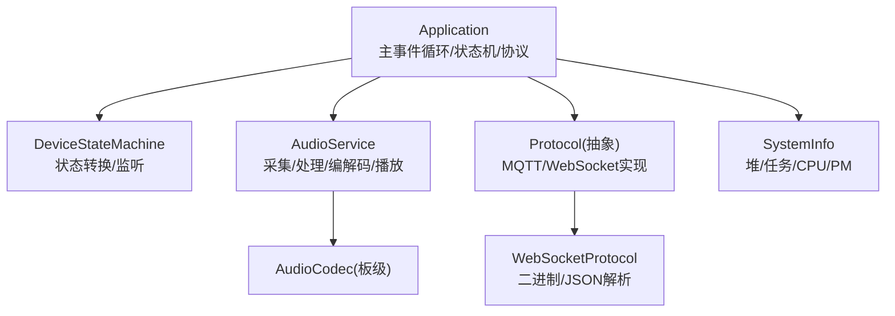
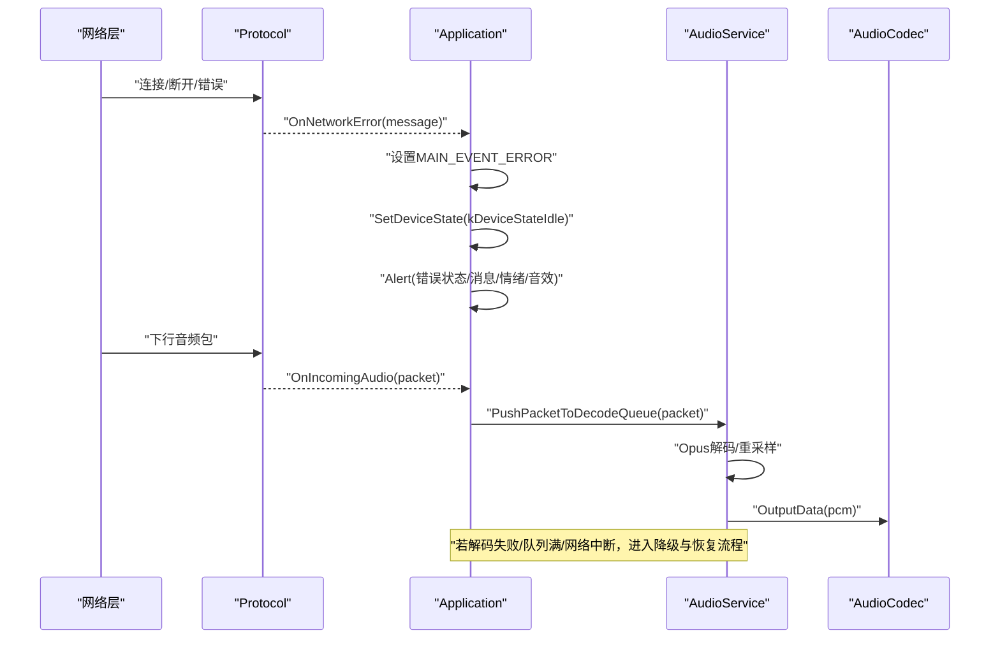
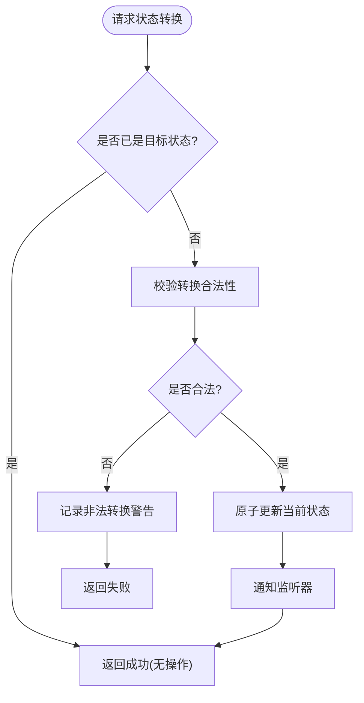
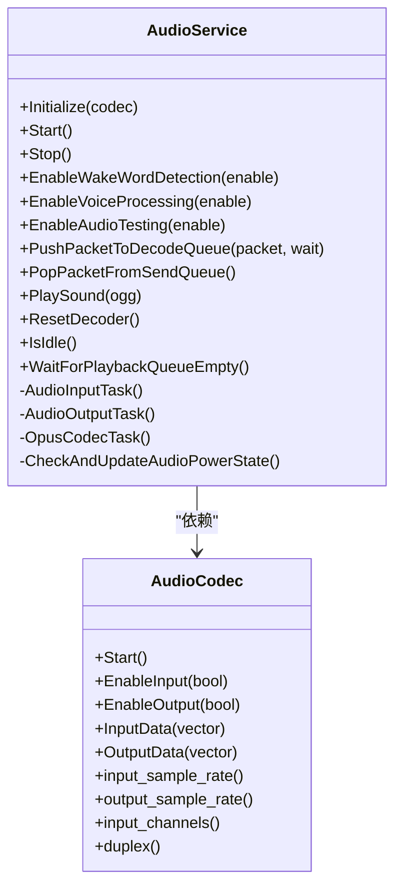
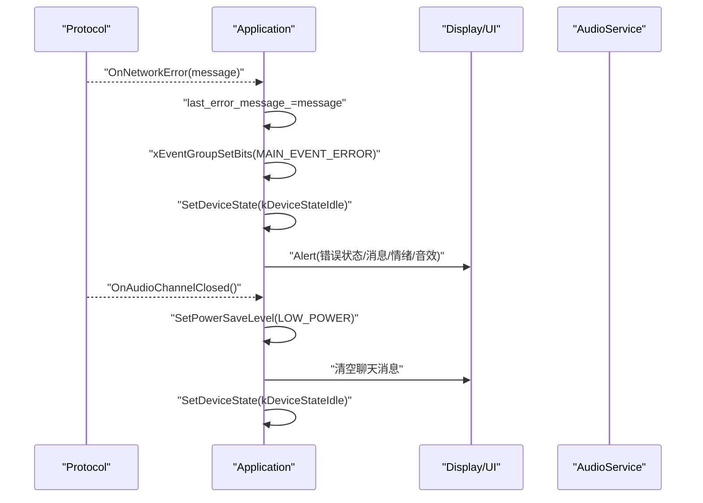
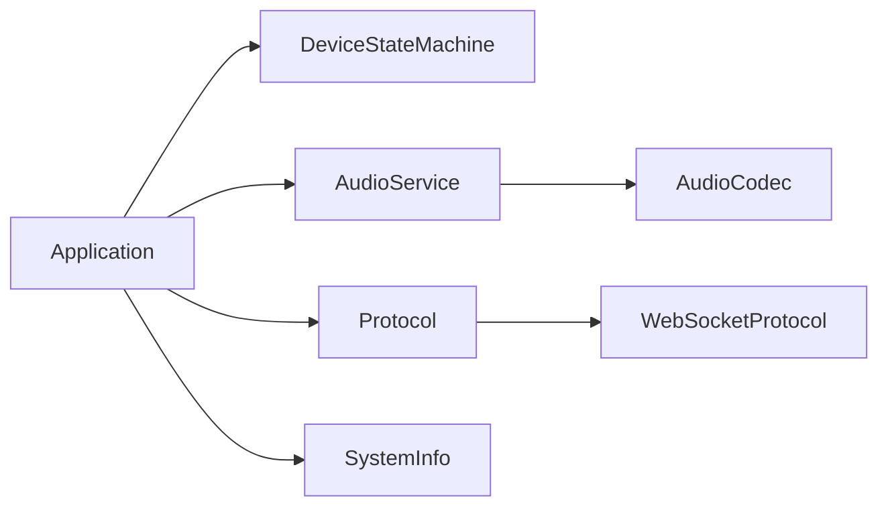

# 运行时异常处理

<cite>
**本文引用的文件**   
- [application.h](file://main/application.h)
- [application.cc](file://main/application.cc)
- [device_state_machine.h](file://main/device_state_machine.h)
- [device_state_machine.cc](file://main/device_state_machine.cc)
- [device_state.h](file://main/device_state.h)
- [audio_service.h](file://main/audio/audio_service.h)
- [audio_service.cc](file://main/audio/audio_service.cc)
- [system_info.h](file://main/system_info.h)
- [system_info.cc](file://main/system_info.cc)
- [protocol.h](file://main/protocols/protocol.h)
- [websocket_protocol.cc](file://main/protocols/websocket_protocol.cc)
</cite>

## 目录
1. [引言](#引言)
2. [项目结构](#项目结构)
3. [核心组件](#核心组件)
4. [架构总览](#架构总览)
5. [详细组件分析](#详细组件分析)
6. [依赖关系分析](#依赖关系分析)
7. [性能与稳定性考量](#性能与稳定性考量)
8. [故障排查指南](#故障排查指南)
9. [结论](#结论)
10. [附录：日志级别与调试输出](#附录日志级别与调试输出)

## 引言
本文件聚焦于设备在运行时的异常处理与恢复策略，覆盖以下关键领域：
- 设备状态机异常：非法状态转换、任务卡死、内存不足等问题的诊断与恢复。
- 音频服务异常：采集失败、编解码错误、网络中断、队列溢出等场景的应对方案。
- 系统信息收集与分析：堆栈、任务CPU占用、功耗锁等信息的采集方法。
- 日志级别配置与调试技巧：如何定位问题并提升可观测性。

## 项目结构
本项目采用分层与模块化组织方式：
- 应用层（Application）：主事件循环、状态机调度、协议生命周期管理、UI提示与告警。
- 设备状态机（DeviceStateMachine）：严格的状态转换规则与监听机制。
- 音频服务（AudioService）：采集、VAD/唤醒词、编码/解码、播放、AEC、电源管理等。
- 协议层（Protocol/MQTT/WebSocket）：上行音频发送、下行音频接收、JSON控制消息、网络错误回调。
- 系统信息（SystemInfo）：堆内存、任务列表、CPU使用率、PM锁等诊断能力。

图表来源
- [application.h:43-176](file://main/application.h#L43-L176)
- [device_state_machine.h:17-81](file://main/device_state_machine.h#L17-L81)
- [audio_service.h:105-193](file://main/audio/audio_service.h#L105-L193)
- [protocol.h:79-98](file://main/protocols/protocol.h#L79-L98)
- [websocket_protocol.cc:115-137](file://main/protocols/websocket_protocol.cc#L115-L137)
- [system_info.h:9-21](file://main/system_info.h#L9-L21)

章节来源
- [application.h:43-176](file://main/application.h#L43-L176)
- [device_state_machine.h:17-81](file://main/device_state_machine.h#L17-L81)
- [audio_service.h:105-193](file://main/audio/audio_service.h#L105-L193)
- [protocol.h:79-98](file://main/protocols/protocol.h#L79-L98)
- [system_info.h:9-21](file://main/system_info.h#L9-L21)

## 核心组件
- Application
  - 负责初始化显示、音频、网络回调；维护主事件循环；统一分发事件；对外提供状态切换、对话开关、升级、重启等接口。
  - 通过事件组协调各子系统，集中处理错误、网络、激活、状态变更等事件。
- DeviceStateMachine
  - 定义合法状态转换表，提供原子化状态更新与监听器通知，防止非法转换导致的不一致。
- AudioService
  - 多任务流水线：输入任务、输出任务、Opus编解码任务；内部队列缓冲；支持唤醒词、语音处理、AEC、音频测试模式。
  - 对编解码失败、队列满、采样率变化、I/O超时等进行容错处理。
- Protocol（抽象）
  - 定义网络错误回调、音频通道打开/关闭、下行音频与JSON消息回调；具体由MQTT或WebSocket实现。
- SystemInfo
  - 提供堆内存、任务列表、CPU占用、PM锁等诊断工具，便于定位资源瓶颈与死锁。

章节来源
- [application.h:43-176](file://main/application.h#L43-L176)
- [application.cc:165-259](file://main/application.cc#L165-L259)
- [device_state_machine.h:17-81](file://main/device_state_machine.h#L17-L81)
- [device_state_machine.cc:34-102](file://main/device_state_machine.cc#L34-L102)
- [audio_service.h:105-193](file://main/audio/audio_service.h#L105-L193)
- [audio_service.cc:125-167](file://main/audio/audio_service.cc#L125-L167)
- [protocol.h:79-98](file://main/protocols/protocol.h#L79-L98)
- [system_info.h:9-21](file://main/system_info.h#L9-L21)

## 架构总览
下图展示从网络到音频的关键路径与异常点：

图表来源
- [application.cc:493-520](file://main/application.cc#L493-L520)
- [audio_service.cc:327-446](file://main/audio/audio_service.cc#L327-L446)
- [websocket_protocol.cc:115-137](file://main/protocols/websocket_protocol.cc#L115-L137)

## 详细组件分析

### 设备状态机异常处理
- 非法状态转换
  - 当调用TransitionTo目标状态不合法时，记录警告日志并拒绝转换，避免进入不一致状态。
  - 建议：所有跨模块的状态变更均通过SetDeviceState进行，禁止直接修改内部状态。
- 致命错误态
  - 存在kDeviceStateFatalError状态，且不允许从此状态迁移出，用于标记不可恢复错误。
  - 建议：在检测到严重错误（如多次重试失败、关键资源不可用）时转入该态，并通过UI/声音提示用户。
- 状态变更监听
  - 通过AddStateChangeListener订阅状态变化，主循环中根据事件触发UI刷新、音频通道管理、电源策略调整等。

图表来源
- [device_state_machine.cc:108-131](file://main/device_state_machine.cc#L108-L131)
- [device_state_machine.cc:34-102](file://main/device_state_machine.cc#L34-L102)

章节来源
- [device_state_machine.h:17-81](file://main/device_state_machine.h#L17-L81)
- [device_state_machine.cc:34-102](file://main/device_state_machine.cc#L34-L102)
- [device_state_machine.cc:108-131](file://main/device_state_machine.cc#L108-L131)
- [device_state.h:4-16](file://main/device_state.h#L4-L16)

### 音频服务异常处理
- 采集失败与I/O超时
  - 输入任务在读取失败时不会退出，而是短暂延时后继续尝试，保证鲁棒性。
  - 长时间无输入/输出会触发电源管理，自动关闭I/O以节能。
- 编解码错误
  - 解码失败记录错误码并跳过当前帧；编码器失败记录错误码并丢弃当前帧，避免阻塞流水线。
- 队列溢出保护
  - 解码/发送/播放/测试队列均有上限，超过阈值时等待或丢弃，防止内存暴涨。
- 采样率动态变化
  - 根据服务器参数动态重建解码器与重采样器，确保输出与硬件匹配。
- 唤醒词与语音处理切换
  - 切换模式前重置输入重采样器缓存，避免缓冲区溢出或数据错位。

图表来源
- [audio_service.h:105-193](file://main/audio/audio_service.h#L105-L193)
- [audio_service.cc:184-228](file://main/audio/audio_service.cc#L184-L228)
- [audio_service.cc:230-288](file://main/audio/audio_service.cc#L230-L288)
- [audio_service.cc:290-325](file://main/audio/audio_service.cc#L290-L325)
- [audio_service.cc:327-446](file://main/audio/audio_service.cc#L327-L446)
- [audio_service.cc:448-482](file://main/audio/audio_service.cc#L448-L482)
- [audio_service.cc:682-698](file://main/audio/audio_service.cc#L682-L698)

章节来源
- [audio_service.h:105-193](file://main/audio/audio_service.h#L105-L193)
- [audio_service.cc:125-167](file://main/audio/audio_service.cc#L125-L167)
- [audio_service.cc:184-228](file://main/audio/audio_service.cc#L184-L228)
- [audio_service.cc:230-288](file://main/audio/audio_service.cc#L230-L288)
- [audio_service.cc:290-325](file://main/audio/audio_service.cc#L290-L325)
- [audio_service.cc:327-446](file://main/audio/audio_service.cc#L327-L446)
- [audio_service.cc:448-482](file://main/audio/audio_service.cc#L448-L482)
- [audio_service.cc:682-698](file://main/audio/audio_service.cc#L682-L698)

### 网络与协议异常处理
- 网络错误回调
  - 协议层通过on_network_error_上报错误文本，Application将其转为MAIN_EVENT_ERROR事件，回退到空闲态并弹出告警。
- 音频通道关闭
  - 网络断开或远端关闭通道时，清理会话、降低功耗等级、重置UI与状态。
- 下行音频处理
  - 仅在speaking状态下入队解码，避免无关状态下的资源浪费。
- WebSocket二进制流
  - 解析不同版本二进制协议，构造AudioStreamPacket并回调给上层。

图表来源
- [application.cc:493-520](file://main/application.cc#L493-L520)
- [application.cc:286-297](file://main/application.cc#L286-L297)
- [websocket_protocol.cc:115-137](file://main/protocols/websocket_protocol.cc#L115-L137)

章节来源
- [application.cc:493-520](file://main/application.cc#L493-L520)
- [application.cc:286-297](file://main/application.cc#L286-L297)
- [protocol.h:79-98](file://main/protocols/protocol.h#L79-L98)
- [websocket_protocol.cc:115-137](file://main/protocols/websocket_protocol.cc#L115-L137)

### 任务卡死与看门狗/超时防护
- 输入/输出/编解码任务均以while(true)循环+条件变量/事件组驱动，具备自恢复能力。
- 长时间无活动将关闭I/O以降低功耗，避免“假死”导致的资源占用。
- 建议在关键路径增加超时检测与心跳机制（例如网络收发超时），并在超时时主动关闭通道并回退状态。

章节来源
- [audio_service.cc:230-288](file://main/audio/audio_service.cc#L230-L288)
- [audio_service.cc:290-325](file://main/audio/audio_service.cc#L290-L325)
- [audio_service.cc:327-446](file://main/audio/audio_service.cc#L327-L446)
- [audio_service.cc:682-698](file://main/audio/audio_service.cc#L682-L698)

### 内存溢出与资源泄漏防护
- 队列容量限制：解码/发送/播放/测试队列均设上限，超限则等待或丢弃，避免内存膨胀。
- 动态重建解码器：采样率变化时先释放旧实例再创建新实例，避免重复分配。
- 定期打印堆统计：主循环每10秒打印一次最小/当前空闲SRAM，辅助发现泄漏趋势。

章节来源
- [audio_service.h:39-46](file://main/audio/audio_service.h#L39-L46)
- [audio_service.cc:506-518](file://main/audio/audio_service.cc#L506-L518)
- [audio_service.cc:448-482](file://main/audio/audio_service.cc#L448-L482)
- [application.cc:248-258](file://main/application.cc#L248-L258)
- [system_info.cc:150-154](file://main/system_info.cc#L150-L154)

## 依赖关系分析
- Application依赖DeviceStateMachine进行状态管理，依赖AudioService进行音视频处理，依赖Protocol进行网络通信。
- AudioService依赖底层AudioCodec与ESP-IDF编解码库，同时可选依赖语音处理与唤醒词模块。
- SystemInfo为通用诊断工具，被Application周期性调用。

图表来源
- [application.h:43-176](file://main/application.h#L43-L176)
- [audio_service.h:105-193](file://main/audio/audio_service.h#L105-L193)
- [protocol.h:79-98](file://main/protocols/protocol.h#L79-L98)
- [websocket_protocol.cc:115-137](file://main/protocols/websocket_protocol.cc#L115-L137)
- [system_info.h:9-21](file://main/system_info.h#L9-L21)

章节来源
- [application.h:43-176](file://main/application.h#L43-L176)
- [audio_service.h:105-193](file://main/audio/audio_service.h#L105-L193)
- [protocol.h:79-98](file://main/protocols/protocol.h#L79-L98)
- [websocket_protocol.cc:115-137](file://main/protocols/websocket_protocol.cc#L115-L137)
- [system_info.h:9-21](file://main/system_info.h#L9-L21)

## 性能与稳定性考量
- 任务优先级与核心绑定
  - 主任务优先级较高，音频输入任务在高负载下优先保障采集实时性。
- 队列深度与背压
  - 合理设置队列上限，结合条件变量实现背压，避免突发流量导致OOM。
- 采样率匹配与重采样
  - 服务端与设备端采样率不一致时进行重采样，但可能引入失真，应尽量避免频繁切换。
- 电源管理
  - 长时间无I/O自动关闭编解码与I/O，降低功耗；通话期间切换到高性能模式。

章节来源
- [application.cc:165-183](file://main/application.cc#L165-L183)
- [audio_service.cc:125-167](file://main/audio/audio_service.cc#L125-L167)
- [audio_service.cc:682-698](file://main/audio/audio_service.cc#L682-L698)
- [application.cc:504-519](file://main/application.cc#L504-L519)

## 故障排查指南
- 常见异常与定位
  - 网络错误：查看协议层的网络错误回调与Application的错误事件处理，确认是否回退到空闲态并弹出告警。
  - 音频采集失败：检查输入任务是否持续运行、ReadAudioData返回值、重采样器是否初始化成功。
  - 编解码错误：关注Opus编解码任务的错误日志，确认帧大小与采样率配置是否正确。
  - 队列溢出：观察队列长度与丢弃日志，必要时增大队列上限或优化上游生产速率。
  - 任务卡死：使用SystemInfo打印任务列表与CPU占用，识别高占用或停滞任务。
- 恢复策略
  - 网络中断：关闭音频通道、降低功耗、回退空闲态，待网络恢复后重新激活。
  - 编解码异常：重置解码器、清空相关队列，必要时重建重采样器。
  - 资源不足：减少并发任务、缩短队列、降低采样率或帧长，必要时重启设备。

章节来源
- [application.cc:493-520](file://main/application.cc#L493-L520)
- [audio_service.cc:327-446](file://main/audio/audio_service.cc#L327-L446)
- [audio_service.cc:668-680](file://main/audio/audio_service.cc#L668-L680)
- [system_info.cc:144-154](file://main/system_info.cc#L144-L154)

## 结论
通过严格的状态机约束、健壮的音频流水线设计、完善的网络错误回调与系统诊断工具，系统在多种异常场景下具备较好的自愈能力。建议在生产环境中开启更详细的日志与监控指标，并结合定期巡检与压力测试，持续提升稳定性与用户体验。

## 附录：日志级别与调试输出
- 日志级别
  - ESP_LOGE：关键错误（如编解码失败、资源不可用）。
  - ESP_LOGW：警告（如非法状态转换、未知消息类型、重试提示）。
  - ESP_LOGI：重要信息（如网络状态、TTS/STT文本、激活进度）。
  - ESP_LOGD：调试信息（如启用/禁用功能开关）。
- 调试输出技巧
  - 周期性打印堆统计与任务列表，观察内存与CPU趋势。
  - 在关键路径添加时间戳与上下文信息，便于关联分析。
  - 利用UI告警与音效提示，快速感知异常状态。

章节来源
- [application.cc:248-258](file://main/application.cc#L248-L258)
- [system_info.cc:144-154](file://main/system_info.cc#L144-L154)
- [application.cc:642-660](file://main/application.cc#L642-L660)