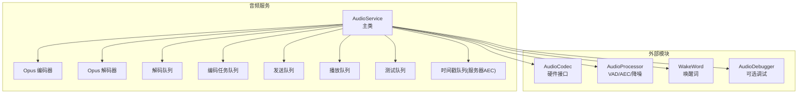
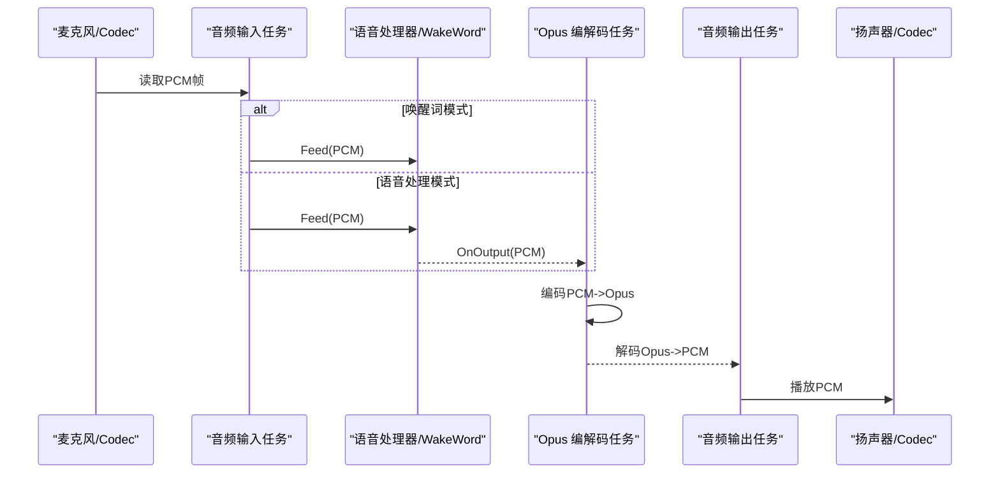
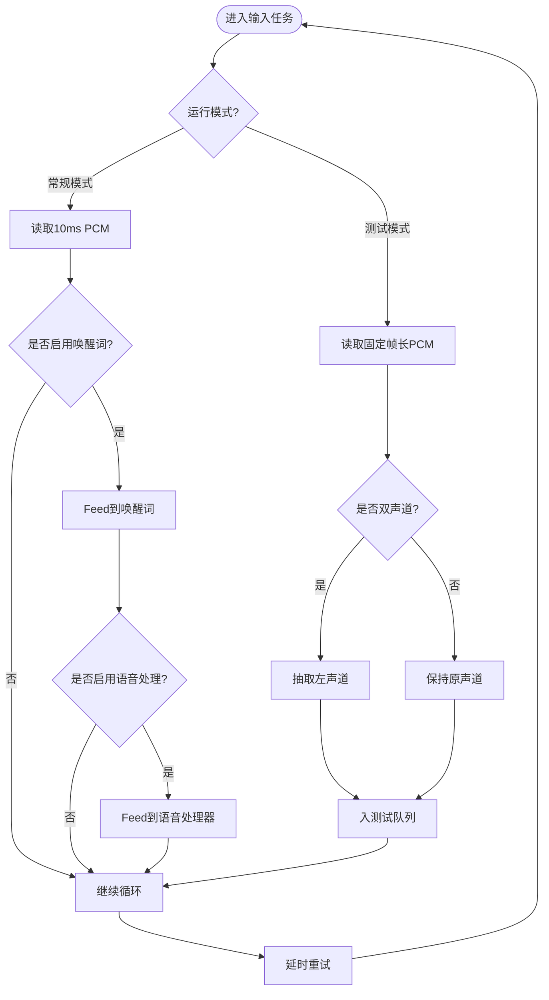
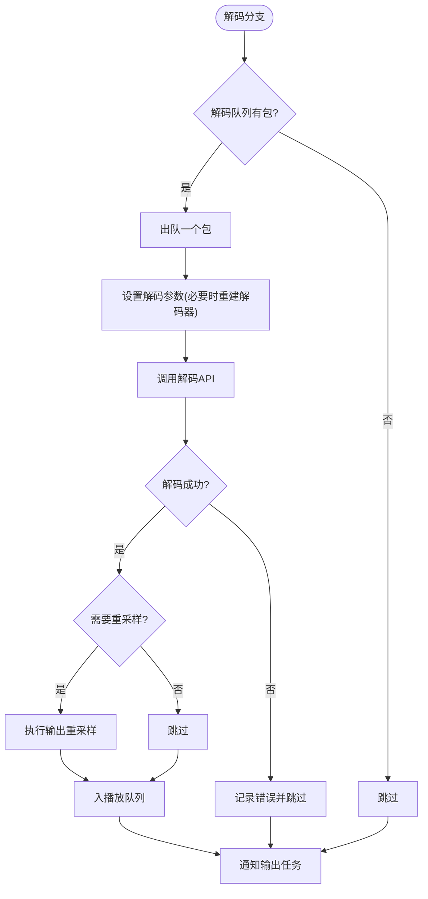
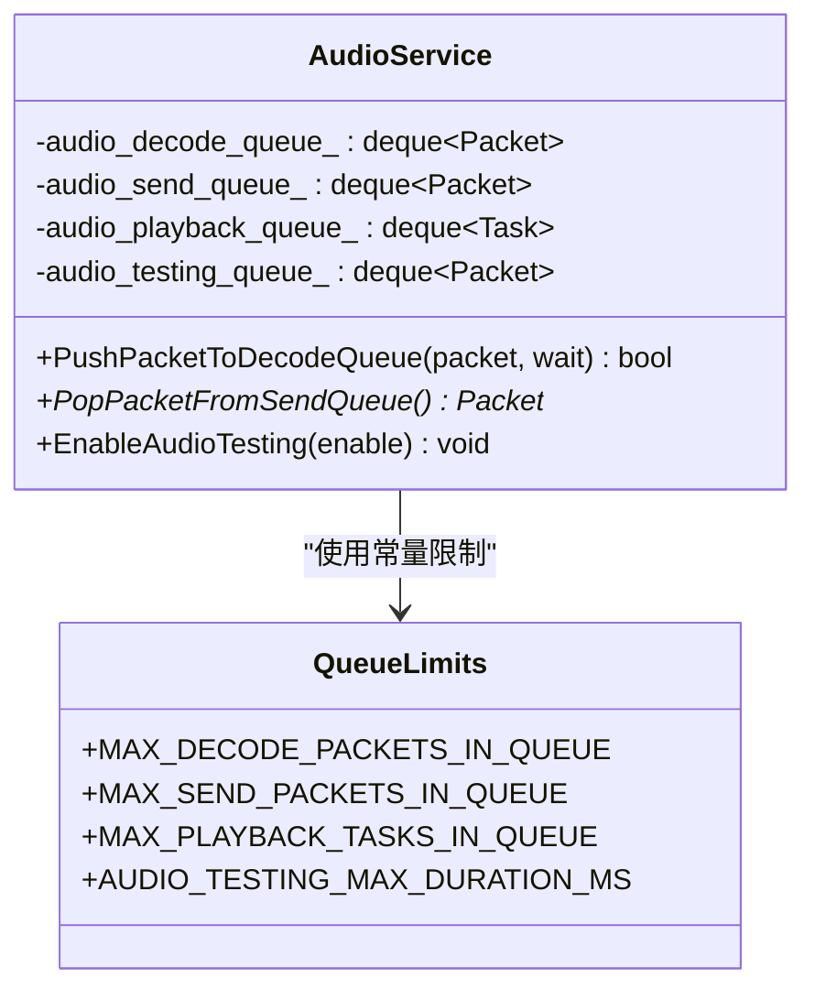
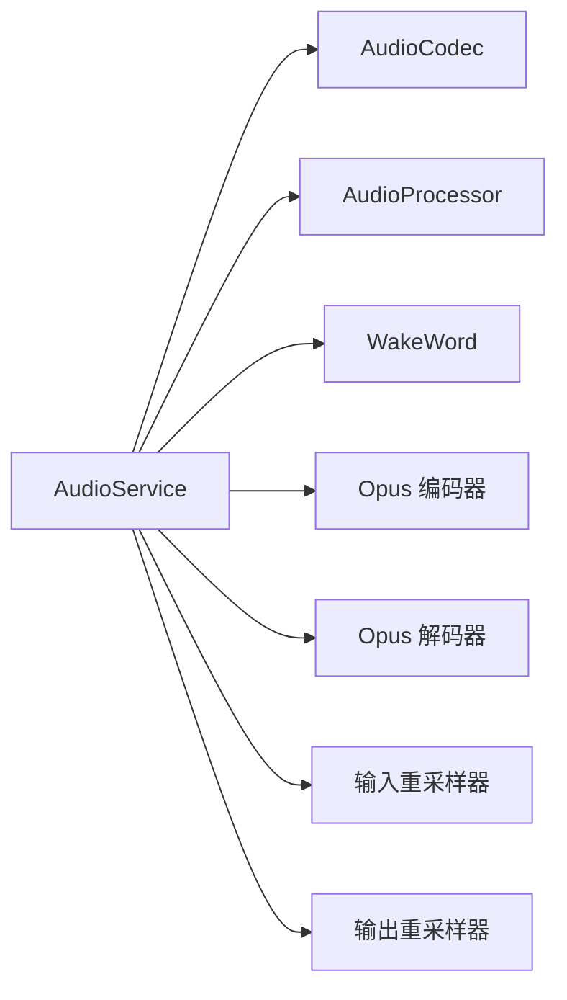

# 音频服务异常处理

<cite>
**本文引用的文件**   
- [audio_service.h](file://main\audio\audio_service.h)
- [audio_service.cc](file://main\audio\audio_service.cc)
- [audio_codec.h](file://main\audio\audio_codec.h)
- [audio_processor.h](file://main\audio\audio_processor.h)
</cite>

## 目录
1. [引言](#引言)
2. [项目结构](#项目结构)
3. [核心组件](#核心组件)
4. [架构总览](#架构总览)
5. [详细组件分析](#详细组件分析)
6. [依赖分析](#依赖分析)
7. [性能考虑](#性能考虑)
8. [故障排查指南](#故障排查指南)
9. [结论](#结论)
10. [附录](#附录)

## 引言
本文件聚焦于 AudioService 的异常处理机制，覆盖以下关键场景：
- 音频采集失败、编解码错误、缓冲区溢出等问题的检测与恢复
- 音频队列管理中的异常处理（发送队列满、接收队列异常）
- 音频回调函数中的错误处理策略（VAD 检测异常、唤醒词识别失败）
- 音频服务重启与资源清理的最佳实践
- 调试方法与日志分析技巧

目标是帮助开发者快速定位问题、提升系统鲁棒性并优化用户体验。

## 项目结构
AudioService 位于 main/audio 目录下，围绕“采集-处理-编码-发送/播放”的数据流构建，采用多任务与条件变量进行解耦，并通过事件组协调不同工作模式（语音处理、唤醒词、音频测试）。

图表来源
- [audio_service.h:28-46](file://main\audio\audio_service.h#L28-L46)
- [audio_service.cc:125-167](file://main\audio\audio_service.cc#L125-L167)

章节来源
- [audio_service.h:28-46](file://main\audio\audio_service.h#L28-L46)
- [audio_service.cc:125-167](file://main\audio\audio_service.cc#L125-L167)

## 核心组件
- AudioService：编排输入/输出任务、Opus 编解码、队列调度、事件组控制、电源管理与状态机。
- AudioCodec：I2S 驱动封装，提供输入/输出数据读写与开关能力。
- AudioProcessor：语音处理管线（如 AFE），对外暴露 VAD 状态变化回调与输出回调。
- WakeWord：唤醒词检测与编码，支持多种实现（ESP-Wake-Word、AFE 自定义模型）。

章节来源
- [audio_service.h:105-195](file://main\audio\audio_service.h#L105-L195)
- [audio_codec.h:17-59](file://main\audio\audio_codec.h#L17-L59)
- [audio_processor.h:11-24](file://main\audio\audio_processor.h#L11-L24)

## 架构总览
AudioService 内部包含三个主要任务：
- 音频输入任务：从 Codec 读取 PCM，喂给唤醒词或语音处理器；在测试模式下将数据入队用于回放。
- Opus 编解码任务：从编码任务队列取 PCM 编码为 Opus 包，放入发送队列或测试队列；从解码队列取 Opus 包解码为 PCM，放入播放队列。
- 音频输出任务：从播放队列取出 PCM 写入 Codec 扬声器。

图表来源
- [audio_service.cc:230-288](file://main\audio\audio_service.cc#L230-L288)
- [audio_service.cc:327-446](file://main\audio\audio_service.cc#L327-L446)
- [audio_service.cc:290-325](file://main\audio\audio_service.cc#L290-L325)

## 详细组件分析

### 音频采集与输入任务异常处理
- 采集失败处理
  - 当 InputData 返回失败时，输入任务不退出，仅延时重试，保证服务稳定性。
  - 若输入未启用，自动开启输入通道，避免上层忘记启用导致的静默失败。
- 采样率不一致时的重采样
  - 使用输入重采样器将非 16kHz 的输入转换为 16kHz，防止后续编码器帧尺寸不匹配导致编码失败。
- 双声道转单声道
  - 在测试模式下，若输入为立体声，会抽取左声道作为单声道数据，避免格式不匹配。
- 超时与休眠恢复
  - 通过定时器周期性检查输入/输出空闲时长，超过阈值后关闭对应通道以省电；再次使用时再自动开启。

图表来源
- [audio_service.cc:230-288](file://main\audio\audio_service.cc#L230-L288)
- [audio_service.cc:184-228](file://main\audio\audio_service.cc#L184-L228)

章节来源
- [audio_service.cc:184-228](file://main\audio\audio_service.cc#L184-L228)
- [audio_service.cc:230-288](file://main\audio\audio_service.cc#L230-L288)

### 编解码任务异常处理
- 解码错误
  - 当解码返回错误码时，记录错误日志并跳过该包，同时通知条件变量以避免死锁。
  - 动态切换解码参数（采样率/帧长）时，先关闭旧解码器，再重新打开，确保一致性。
- 编码错误
  - 当编码器返回错误或帧尺寸不匹配时，记录错误日志并丢弃该任务，避免污染发送队列。
- 队列保护
  - 解码与编码均受最大队列长度限制，防止内存暴涨与延迟抖动。
- 重采样
  - 当解码采样率与设备输出不一致时，使用输出重采样器进行转换，避免播放失真。

图表来源
- [audio_service.cc:327-446](file://main\audio\audio_service.cc#L327-L446)
- [audio_service.cc:448-482](file://main\audio\audio_service.cc#L448-L482)

章节来源
- [audio_service.cc:327-446](file://main\audio\audio_service.cc#L327-L446)
- [audio_service.cc:448-482](file://main\audio\audio_service.cc#L448-L482)

### 音频队列管理与异常处理
- 发送队列满
  - 编码任务仅在发送队列未满时入队，避免阻塞上游；上层可通过回调感知可发送时机。
- 接收队列异常
  - 推送解码包时，若队列已满且 wait=false，直接返回失败；wait=true 则等待空间释放。
- 播放队列保护
  - 解码任务仅在播放队列未满时入队，防止播放卡顿与内存占用过高。
- 测试队列溢出
  - 测试模式下，当测试队列达到上限时，自动停止测试并清理，避免无限增长。

图表来源
- [audio_service.h:39-46](file://main\audio\audio_service.h#L39-L46)
- [audio_service.cc:506-529](file://main\audio\audio_service.cc#L506-L529)
- [audio_service.cc:606-617](file://main\audio\audio_service.cc#L606-L617)

章节来源
- [audio_service.h:39-46](file://main\audio\audio_service.h#L39-L46)
- [audio_service.cc:506-529](file://main\audio\audio_service.cc#L506-L529)
- [audio_service.cc:606-617](file://main\audio\audio_service.cc#L606-L617)

### 回调函数中的错误处理策略
- VAD 状态变化回调
  - 语音处理器通过回调上报说话状态，AudioService 更新内部标志并转发给上层，便于 UI 或状态机响应。
- 唤醒词检测回调
  - 唤醒词模块检测到关键词后触发回调，AudioService 将其转发给上层应用，由上层决定后续流程（如开始对话）。
- 发送队列可用回调
  - 编码完成后，若目标为发送队列，则触发回调通知上层尽快消费，降低网络侧丢包风险。

章节来源
- [audio_service.cc:101-110](file://main\audio\audio_service.cc#L101-L110)
- [audio_service.cc:720-726](file://main\audio\audio_service.cc#L720-L726)
- [audio_service.cc:421-432](file://main\audio\audio_service.cc#L421-L432)

### 服务重启与资源清理最佳实践
- 停止服务
  - 停止定时器、置位事件组、清空所有队列并广播条件变量，确保各任务能安全退出。
- 重置解码器
  - 重置解码器状态、清空相关队列与时间戳队列，避免跨会话状态污染。
- 资源释放
  - 析构中关闭编码器、解码器与重采样器句柄，删除事件组，避免资源泄漏。
- 模式切换注意事项
  - 在启用/禁用唤醒词或语音处理前，重置输入重采样器，避免缓存数据导致缓冲区溢出或错位。

章节来源
- [audio_service.cc:169-182](file://main\audio\audio_service.cc#L169-L182)
- [audio_service.cc:668-680](file://main\audio\audio_service.cc#L668-L680)
- [audio_service.cc:44-60](file://main\audio\audio_service.cc#L44-L60)
- [audio_service.cc:549-577](file://main\audio\audio_service.cc#L549-L577)
- [audio_service.cc:579-604](file://main\audio\audio_service.cc#L579-L604)

## 依赖分析
- AudioService 依赖 AudioCodec 完成 I2S 数据读写，依赖 AudioProcessor 完成 VAD/AEC/降噪，依赖 WakeWord 完成唤醒词检测。
- 编解码与重采样依赖 ESP-IDF 提供的 Opus 与速率转换库。
- 事件组与条件变量用于任务间同步，定时器用于功耗管理。

图表来源
- [audio_service.h:137-159](file://main\audio\audio_service.h#L137-L159)
- [audio_service.cc:62-123](file://main\audio\audio_service.cc#L62-L123)

章节来源
- [audio_service.h:137-159](file://main\audio\audio_service.h#L137-L159)
- [audio_service.cc:62-123](file://main\audio\audio_service.cc#L62-L123)

## 性能考虑
- 合理设置队列长度与帧时长，平衡延迟与内存占用。
- 在双工模式下谨慎关闭输出时钟，避免某些板卡 RX 停滞。
- 动态重采样会增加 CPU 开销，尽量使设备输出采样率与服务器一致以减少转换。
- 使用条件变量而非忙轮询，降低 CPU 占用。

[本节为通用指导，无需源码引用]

## 故障排查指南
- 常见问题定位
  - 解码失败：关注解码错误日志与动态参数切换路径，确认帧长与采样率是否与服务器一致。
  - 编码失败：检查输入帧尺寸是否为编码器期望值，确认重采样器已正确初始化。
  - 队列溢出：观察发送/解码/播放队列长度，调整 MAX_* 常量或优化上层消费速度。
  - 唤醒词无响应：检查唤醒词初始化与启动流程，确认输入重采样器已复位。
  - 静音或无声：检查输出通道是否被定时关闭，确认播放队列是否有数据。
- 日志关键字
  - “Failed to create audio decoder/encoder”、“Failed to decode audio”、“Failed to encode audio”、“Timestamp queue is full”、“Audio testing queue is full”、“Audio input/output task stopped”。
- 调试建议
  - 启用音频调试模块，抓取原始 PCM 数据进行离线分析。
  - 在关键路径增加计数统计（输入/解码/编码/播放次数），辅助判断瓶颈。
  - 使用事件组状态查询方法，验证当前工作模式是否正确。

章节来源
- [audio_service.cc:62-123](file://main\audio\audio_service.cc#L62-L123)
- [audio_service.cc:327-446](file://main\audio\audio_service.cc#L327-L446)
- [audio_service.cc:484-504](file://main\audio\audio_service.cc#L484-L504)
- [audio_service.cc:606-617](file://main\audio\audio_service.cc#L606-L617)
- [audio_service.cc:230-288](file://main\audio\audio_service.cc#L230-L288)
- [audio_service.cc:682-698](file://main\audio\audio_service.cc#L682-L698)

## 结论
AudioService 通过清晰的任务划分、严格的队列边界与完善的错误日志，实现了稳健的音频链路。针对采集失败、编解码错误与队列溢出等问题，提供了明确的检测与恢复策略。结合回调机制与电源管理，既保证了实时性，又兼顾了功耗。建议在集成过程中重点关注队列容量、采样率一致性与模式切换时的重采样器复位，以获得更稳定的体验。

[本节为总结，无需源码引用]

## 附录
- 关键常量与事件
  - 帧时长、队列上限、事件标志定义见头文件常量区。
- 接口参考
  - 输入/输出、队列操作、模式控制、回调设置等接口声明见头文件。

章节来源
- [audio_service.h:39-54](file://main\audio\audio_service.h#L39-L54)
- [audio_service.h:105-136](file://main\audio\audio_service.h#L105-L136)