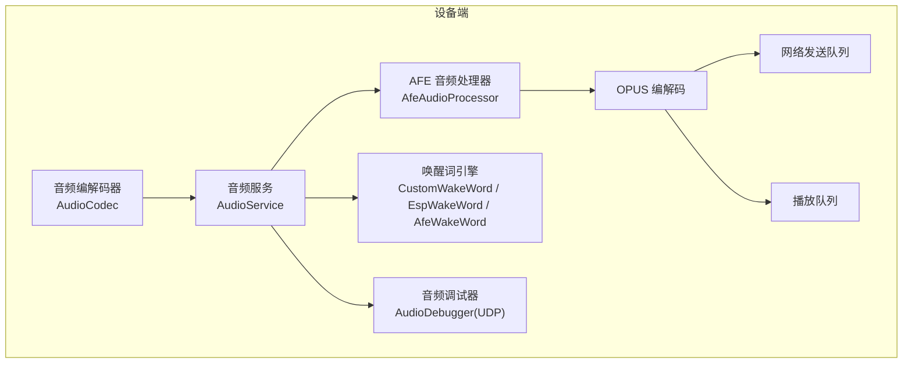
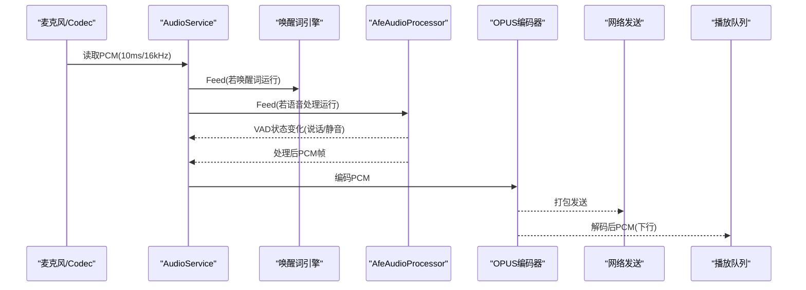
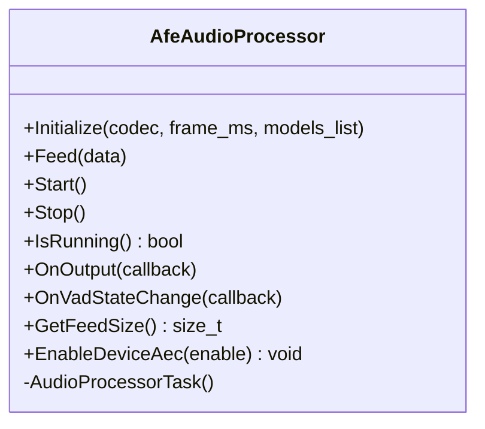
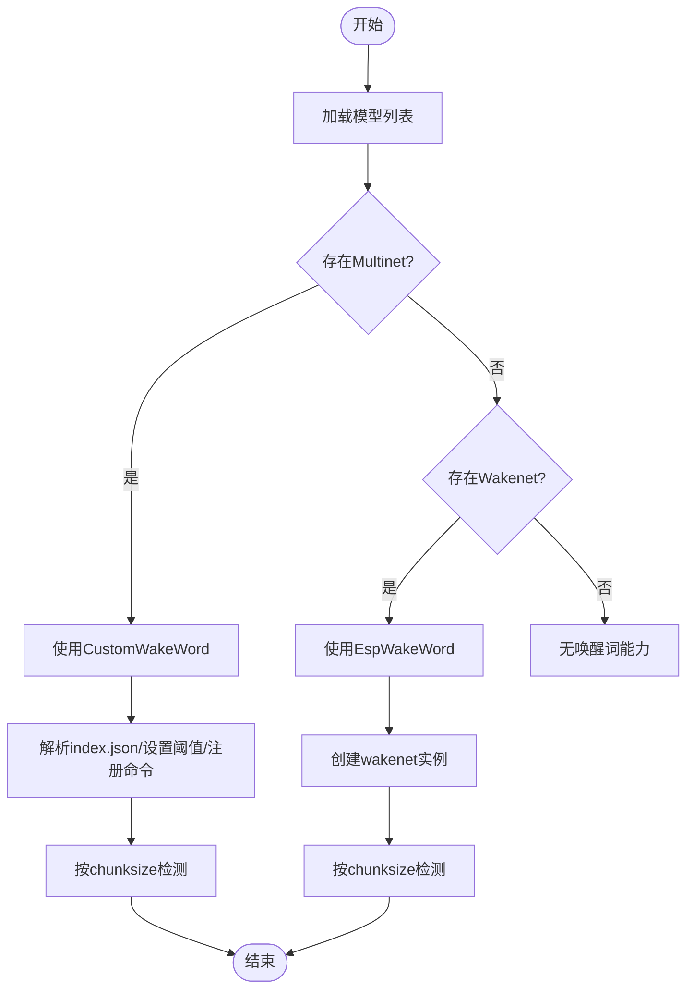
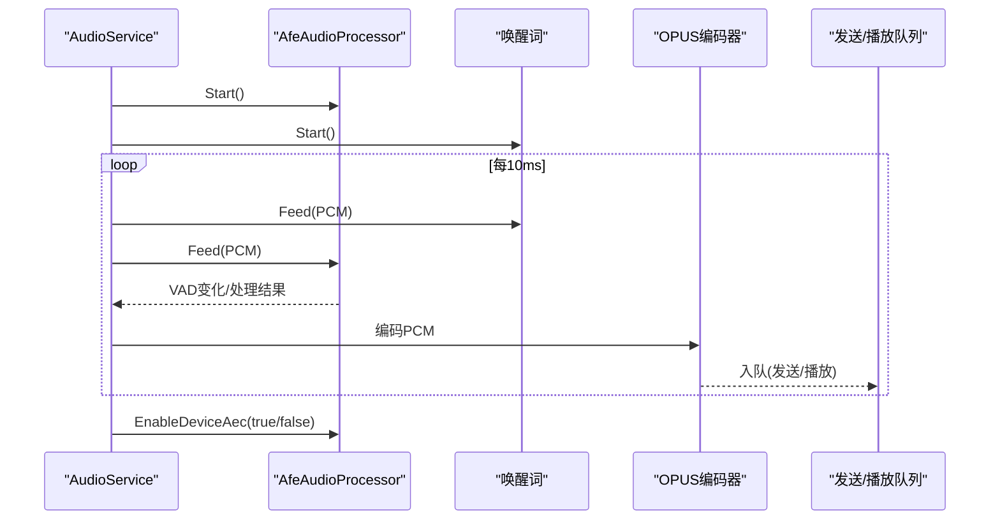
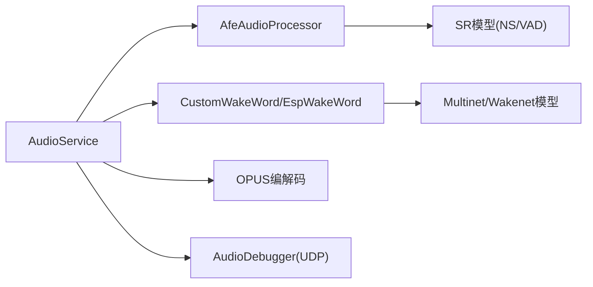

# 音频处理问题排查指南

<cite>
**本文引用的文件**   
- [README.md](file://README.md)
- [audio_service.cc](file://main\audio\audio_service.cc)
- [audio_service.h](file://main\audio\audio_service.h)
- [afe_audio_processor.cc](file://main\audio\processors\afe_audio_processor.cc)
- [afe_audio_processor.h](file://main\audio\processors\afe_audio_processor.h)
- [custom_wake_word.cc](file://main\audio\wake_words\custom_wake_word.cc)
- [esp_wake_word.cc](file://main\audio\wake_words\esp_wake_word.cc)
- [audio_debugger.cc](file://main\audio\processors\audio_debugger.cc)
- [audio_debug_server.py](file://scripts\audio_debug_server.py)
</cite>

## 目录
1. [简介](#简介)
2. [项目结构](#项目结构)
3. [核心组件](#核心组件)
4. [架构总览](#架构总览)
5. [详细组件分析](#详细组件分析)
6. [依赖关系分析](#依赖关系分析)
7. [性能与资源考量](#性能与资源考量)
8. [常见问题与排障](#常见问题与排障)
9. [结论](#结论)
10. [附录：参数与指标速查](#附录参数与指标速查)

## 简介
本指南聚焦于设备端音频链路中的关键问题定位与优化，覆盖回声消除（AEC）效果不佳、降噪算法失效、唤醒词识别失败等典型场景。文档从 AFE 音频处理器配置、VAD 阈值设置、唤醒词模型适配入手，给出可操作的调优步骤、训练与部署建议，并配套音频质量评估指标与调试工具使用技巧，帮助开发者快速定位并解决问题。

## 项目结构
本项目在 ESP32 平台实现“采集→预处理（AEC/NS/VAD）→编码（OPUS）→网络发送/本地播放”的完整音频链路，并提供多种唤醒词方案（Wakenet/Multinet/AfeWakeWord）。音频调试模块支持将原始 PCM 通过 UDP 发送到 PC 进行录制与分析。

图表来源
- [audio_service.cc:125-167](file://main\audio\audio_service.cc#L125-L167)
- [afe_audio_processor.cc:13-75](file://main\audio\processors\afe_audio_processor.cc#L13-L75)
- [audio_debugger.cc:16-42](file://main\audio\processors\audio_debugger.cc#L16-L42)

章节来源
- [README.md:1-173](file://README.md#L1-L173)
- [audio_service.cc:125-167](file://main\audio\audio_service.cc#L125-L167)

## 核心组件
- 音频服务 AudioService：负责输入/输出任务调度、OPUS 编解码、重采样、队列管理、事件控制、唤醒词与语音处理器的生命周期管理。
- AFE 音频处理器 AfeAudioProcessor：封装 esp-audio-fx 的 AEC/NS/VAD 管线，提供 VAD 状态回调与设备侧 AEC 开关。
- 唤醒词引擎：
  - CustomWakeWord：基于 Multinet 的命令词识别，支持自定义命令与阈值。
  - EspWakeWord：基于 Wakenet 的通用唤醒词检测。
  - AfeWakeWord：S3/P4 平台下基于 AFE 的唤醒流程（由 AudioService 根据模型列表选择）。
- 音频调试器 AudioDebugger：将原始 PCM 经 UDP 发送至 PC，配合 Python 脚本保存为 WAV 用于离线分析。

章节来源
- [audio_service.cc:62-123](file://main\audio\audio_service.cc#L62-L123)
- [afe_audio_processor.cc:13-75](file://main\audio\processors\afe_audio_processor.cc#L13-L75)
- [custom_wake_word.cc:85-129](file://main\audio\wake_words\custom_wake_word.cc#L85-L129)
- [esp_wake_word.cc:17-45](file://main\audio\wake_words\esp_wake_word.cc#L17-L45)
- [audio_debugger.cc:16-42](file://main\audio\processors\audio_debugger.cc#L16-L42)

## 架构总览
下图展示一次完整的语音交互数据流：采集→可选降采样→唤醒词/语音处理并行→VAD 状态上报→OPUS 编码→发送/播放；同时支持设备侧 AEC 动态切换。

图表来源
- [audio_service.cc:230-288](file://main\audio\audio_service.cc#L230-L288)
- [audio_service.cc:327-446](file://main\audio\audio_service.cc#L327-L446)
- [afe_audio_processor.cc:135-187](file://main\audio\processors\afe_audio_processor.cc#L135-L187)

## 详细组件分析

### AFE 音频处理器（AEC/NS/VAD）
- 初始化要点
  - 输入通道格式由 codec 决定，自动构建 M/R 组合字符串。
  - 默认启用高性能 AEC 模式与 VAD 模式，可根据是否加载 NS/VAD 模型动态开启。
  - 内存分配优先 PSRAM，降低内部 RAM 压力。
  - 通过编译选项 CONFIG_USE_DEVICE_AEC 控制设备侧 AEC 与软件 VAD 的互斥启用。
- 运行时
  - 后台任务循环 fetch_with_delay，产出处理后的 PCM 帧，并按 frame_samples_ 对齐输出。
  - 暴露 VAD 状态变化回调，供上层做静音/说话段切分或 UI 反馈。
- 设备侧 AEC 开关
  - EnableDeviceAec(enable)：enable=true 时禁用 VAD 并启用设备 AEC；false 则相反。

图表来源
- [afe_audio_processor.h:17-46](file://main\audio\processors\afe_audio_processor.h#L17-L46)
- [afe_audio_processor.cc:13-75](file://main\audio\processors\afe_audio_processor.cc#L13-L75)
- [afe_audio_processor.cc:189-201](file://main\audio\processors\afe_audio_processor.cc#L189-L201)

章节来源
- [afe_audio_processor.cc:13-75](file://main\audio\processors\afe_audio_processor.cc#L13-L75)
- [afe_audio_processor.cc:135-187](file://main\audio\processors\afe_audio_processor.cc#L135-L187)
- [afe_audio_processor.cc:189-201](file://main\audio\processors\afe_audio_processor.cc#L189-L201)

### 唤醒词引擎（Multinet/Wakenet/AfeWakeWord）
- CustomWakeWord（Multinet）
  - 从 index.json 解析语言、时长、阈值与命令集；支持按语言过滤 multinet 模型。
  - Feed 中按 chunksize 推进检测，检测到命令后触发回调并可停止检测。
  - 支持将唤醒片段编码为 OPUS 以便上传。
- EspWakeWord（Wakenet）
  - 加载 wakenet 模型，按固定 chunksize 检测，返回命中词名。
- 选择策略
  - AudioService::SetModelsList 根据可用模型类型选择具体实现（ESP32S3/P4 优先 Multinet/AfeWakeWord，其他平台用 Wakenet）。

图表来源
- [audio_service.cc:700-726](file://main\audio\audio_service.cc#L700-L726)
- [custom_wake_word.cc:85-129](file://main\audio\wake_words\custom_wake_word.cc#L85-L129)
- [esp_wake_word.cc:17-45](file://main\audio\wake_words\esp_wake_word.cc#L17-L45)

章节来源
- [custom_wake_word.cc:85-129](file://main\audio\wake_words\custom_wake_word.cc#L85-L129)
- [esp_wake_word.cc:17-45](file://main\audio\wake_words\esp_wake_word.cc#L17-L45)
- [audio_service.cc:700-726](file://main\audio\audio_service.cc#L700-L726)

### 音频服务与流水线（AudioService）
- 输入路径
  - 定时读取 PCM，必要时重采样至 16kHz，双声道时取左声道单声道化。
  - 同时喂给唤醒词与语音处理器（两者可独立启停）。
- 输出路径
  - OPUS 解码后按硬件输出采样率重采样，进入播放队列。
- 事件与状态
  - 通过事件组控制唤醒词、语音处理、音频测试三种模式的并发。
  - VAD 状态变化回调更新 voice_detected_ 并通知上层。
- 设备侧 AEC
  - 通过 EnableDeviceAec 动态切换 AEC/VAD 工作模式。

图表来源
- [audio_service.cc:230-288](file://main\audio\audio_service.cc#L230-L288)
- [audio_service.cc:327-446](file://main\audio\audio_service.cc#L327-L446)
- [audio_service.cc:619-627](file://main\audio\audio_service.cc#L619-L627)

章节来源
- [audio_service.cc:230-288](file://main\audio\audio_service.cc#L230-L288)
- [audio_service.cc:327-446](file://main\audio\audio_service.cc#L327-L446)
- [audio_service.cc:619-627](file://main\audio\audio_service.cc#L619-L627)

### 音频调试器（UDP 导出）
- 设备端通过 AudioDebugger 将原始 PCM 以 UDP 包发送到配置的 IP:PORT。
- PC 端脚本 audio_debug_server.py 接收并保存为 WAV，便于离线分析。

图表来源
- [audio_debugger.cc:16-42](file://main\audio\processors\audio_debugger.cc#L16-L42)
- [audio_debug_server.py:11-43](file://scripts\audio_debug_server.py#L11-L43)

章节来源
- [audio_debugger.cc:16-42](file://main\audio\processors\audio_debugger.cc#L16-L42)
- [audio_debug_server.py:11-43](file://scripts\audio_debug_server.py#L11-L43)

## 依赖关系分析
- AudioService 依赖 AudioCodec、AfeAudioProcessor/NoAudioProcessor、唤醒词实现、OPUS 编解码与重采样库。
- AfeAudioProcessor 依赖 esp-audio-fx 接口与 SR 模型列表（NS/VAD）。
- 唤醒词实现依赖 esp-mn/esp-wn 接口与对应模型。
- 调试器依赖 UDP 套接字与配置项。

图表来源
- [audio_service.cc:95-123](file://main\audio\audio_service.cc#L95-L123)
- [afe_audio_processor.cc:30-57](file://main\audio\processors\afe_audio_processor.cc#L30-L57)
- [custom_wake_word.cc:85-129](file://main\audio\wake_words\custom_wake_word.cc#L85-L129)
- [esp_wake_word.cc:17-45](file://main\audio\wake_words\esp_wake_word.cc#L17-L45)

章节来源
- [audio_service.cc:95-123](file://main\audio\audio_service.cc#L95-L123)
- [afe_audio_processor.cc:30-57](file://main\audio\processors\afe_audio_processor.cc#L30-L57)
- [custom_wake_word.cc:85-129](file://main\audio\wake_words\custom_wake_word.cc#L85-L129)
- [esp_wake_word.cc:17-45](file://main\audio\wake_words\esp_wake_word.cc#L17-L45)

## 性能与资源考量
- 内存与缓存
  - AFE 使用 PSRAM 分配以降低内部 RAM 占用；输入/输出缓冲预分配减少抖动。
- 任务与优先级
  - 输入任务绑定到特定核，提高实时性；OPUS 编解码任务拥有较大栈空间。
- 重采样
  - 当 codec 采样率非 16kHz 时启用输入重采样；下行解码后按需重采样至硬件输出采样率。
- 功耗管理
  - 空闲超时关闭输入/输出，避免长时间占用音频外设。

章节来源
- [afe_audio_processor.cc:56-57](file://main\audio\processors\afe_audio_processor.cc#L56-L57)
- [audio_service.cc:125-167](file://main\audio\audio_service.cc#L125-L167)
- [audio_service.cc:448-482](file://main\audio\audio_service.cc#L448-L482)
- [audio_service.cc:682-698](file://main\audio\audio_service.cc#L682-L698)

## 常见问题与排障

### 一、回声消除（AEC）效果不佳
可能原因
- 未启用设备侧 AEC 或 AEC 与 VAD 冲突。
- 参考通道缺失或布局不当（单麦+扬声器近距离导致强回声）。
- 环境噪声过大或远端音量过高。
- 模型/固件版本不匹配导致 AEC 参数不理想。

定位步骤
- 确认当前模式：查看日志中“设备 AEC 已启用/禁用”提示，或通过接口切换验证。
- 对比 AEC 开/关前后听感差异，记录远端音量与环境噪声等级。
- 使用音频调试器导出原始 PCM，观察是否有明显回波成分。

调优建议
- 在支持的设备上启用设备侧 AEC，并在需要时动态切换：
  - 调用 AudioService::EnableDeviceAec(true) 启用设备 AEC，此时会禁用 VAD。
  - 通话结束后恢复 VAD：EnableDeviceAec(false)。
- 调整远端播放音量与设备摆放位置，减小声学耦合。
- 若必须保留 VAD，可在软件 AEC 模式下尝试提升 AEC 模式或更换更合适的模型集合。

章节来源
- [audio_service.cc:619-627](file://main\audio\audio_service.cc#L619-L627)
- [afe_audio_processor.cc:189-201](file://main\audio\processors\afe_audio_processor.cc#L189-L201)
- [audio_debugger.cc:16-42](file://main\audio\processors\audio_debugger.cc#L16-L42)

### 二、降噪算法失效
可能原因
- 未加载 NS 模型或模型路径不正确。
- 输入通道/采样率不匹配导致预处理异常。
- AGC 开启造成增益波动掩盖降噪效果。

定位步骤
- 检查初始化日志中 NS 模型是否成功加载及 afe_ns_mode 设置。
- 确认 input_format 是否正确包含主麦与参考通道（若有）。
- 临时关闭 AGC 观察降噪效果变化。

调优建议
- 确保模型集合中包含 NS 模型，且路径正确。
- 保持输入采样率为 16kHz，必要时启用输入重采样。
- 在安静环境下评估降噪效果，逐步引入背景噪声进行鲁棒性测试。

章节来源
- [afe_audio_processor.cc:37-57](file://main\audio\processors\afe_audio_processor.cc#L37-L57)
- [audio_service.cc:86-93](file://main\audio\audio_service.cc#L86-L93)

### 三、VAD 语音活动检测阈值设置不当
可能原因
- VAD 过于敏感导致误触发，或过于迟钝导致漏检。
- vad_min_noise_ms 与 vad_mode 不匹配实际场景。

定位步骤
- 观察 VAD 状态变化回调频率与持续时间是否符合预期。
- 在不同噪声环境下测试，统计误报/漏报比例。

调优建议
- 适当增大 vad_min_noise_ms 以减少短时噪声导致的误判。
- 切换 vad_mode 以平衡灵敏度与稳定性。
- 结合 AEC 与 NS 共同作用后再评估 VAD 表现。

章节来源
- [afe_audio_processor.cc:40-46](file://main\audio\processors\afe_audio_processor.cc#L40-L46)
- [audio_service.cc:105-110](file://main\audio\audio_service.cc#L105-L110)

### 四、唤醒词识别失败
可能原因
- 未加载正确的唤醒模型（Multinet/Wakenet）。
- 阈值过高或过低。
- 输入声道数与模型期望不一致（双声道需取左声道）。
- 命令词未在 index.json 中正确注册。

定位步骤
- 查看初始化日志，确认选择的唤醒词实现与模型名称。
- 检查 index.json 中的 language/duration/threshold/commands 字段。
- 在安静/嘈杂环境中分别测试，记录命中率。

调优建议
- 调整 threshold_ 以平衡召回与误触。
- 确保 commands_ 列表与 index.json 一致，action 为 wake 时才会触发后续流程。
- 双声道输入时确认已抽取左声道数据。

章节来源
- [custom_wake_word.cc:85-129](file://main\audio\wake_words\custom_wake_word.cc#L85-L129)
- [custom_wake_word.cc:146-200](file://main\audio\wake_words\custom_wake_word.cc#L146-L200)
- [esp_wake_word.cc:17-45](file://main\audio\wake_words\esp_wake_word.cc#L17-L45)
- [audio_service.cc:700-726](file://main\audio\audio_service.cc#L700-L726)

### 五、音频质量评估与调试工具
- 指标建议
  - 主观：清晰度、自然度、回声残留、削波失真。
  - 客观：SNR、STOI、PESQ（需离线工具），丢包率、端到端延迟。
- 工具链
  - 设备端：启用 AudioDebugger，配置 UDP 目标地址。
  - PC 端：运行 audio_debug_server.py 接收并保存 WAV，使用频谱分析或评测工具进行分析。

章节来源
- [audio_debugger.cc:16-42](file://main\audio\processors\audio_debugger.cc#L16-L42)
- [audio_debug_server.py:11-43](file://scripts\audio_debug_server.py#L11-L43)

## 结论
通过合理配置 AFE（AEC/NS/VAD）、精确设置 VAD 阈值、选择合适的唤醒词模型与阈值，并结合音频调试器进行端到端验证，可以显著提升设备端语音交互体验。建议在真实场景中开展多环境测试，持续迭代参数与模型，以获得稳定可靠的性能。

## 附录：参数与指标速查
- AFE 相关
  - aec_mode：AEC 模式（如高性能 VoIP 模式）
  - ns_init/ns_model_name/afe_ns_mode：降噪模型与模式
  - vad_mode/vad_min_noise_ms/vad_model_name：VAD 模式与最小噪声时长
  - agc_init：自动增益控制开关
  - memory_alloc_mode：PSRAM 优先分配
- 唤醒词相关
  - index.json：language/duration/threshold/commands
  - Multinet：set_det_threshold、commands_add/update
  - Wakenet：create 与 detect 接口
- 音频服务相关
  - 输入重采样：codec 采样率与 16kHz 转换
  - 输出重采样：解码采样率与硬件输出采样率转换
  - 事件组：唤醒词/语音处理/音频测试模式控制
  - 设备侧 AEC：EnableDeviceAec(true/false)

章节来源
- [afe_audio_processor.cc:40-65](file://main\audio\processors\afe_audio_processor.cc#L40-L65)
- [custom_wake_word.cc:85-129](file://main\audio\wake_words\custom_wake_word.cc#L85-L129)
- [audio_service.cc:86-93](file://main\audio\audio_service.cc#L86-L93)
- [audio_service.cc:448-482](file://main\audio\audio_service.cc#L448-L482)
- [audio_service.cc:619-627](file://main\audio\audio_service.cc#L619-L627)