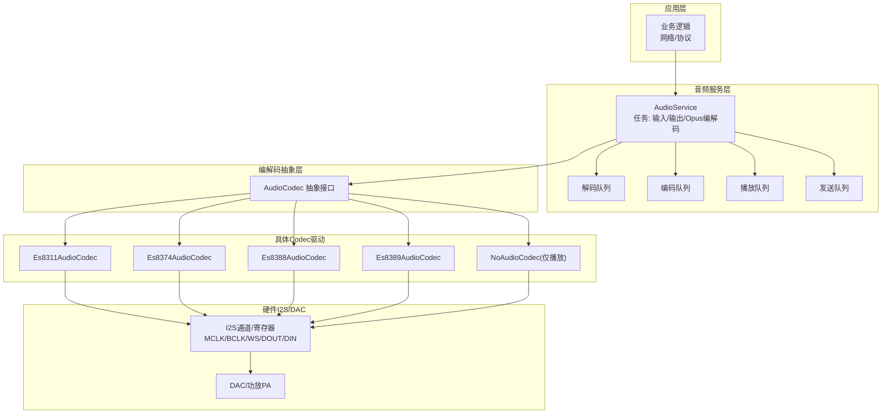
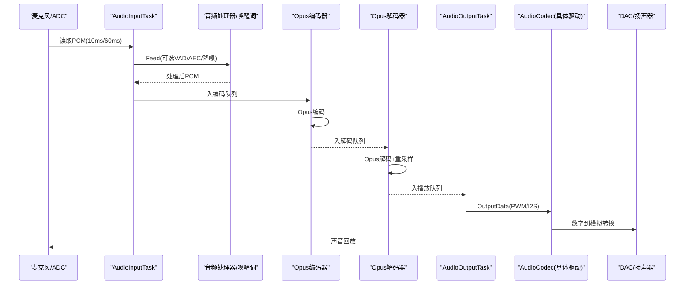
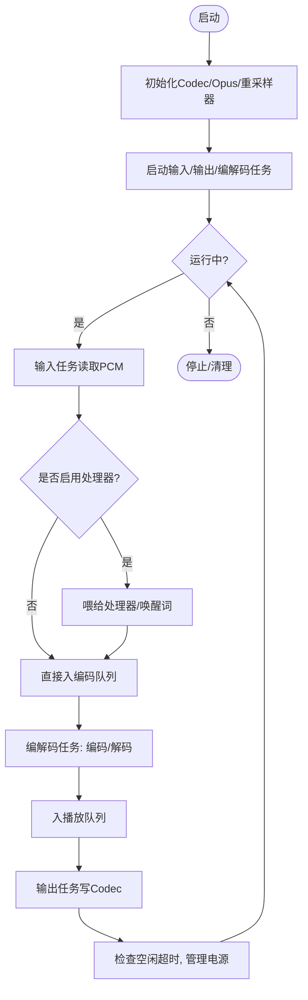
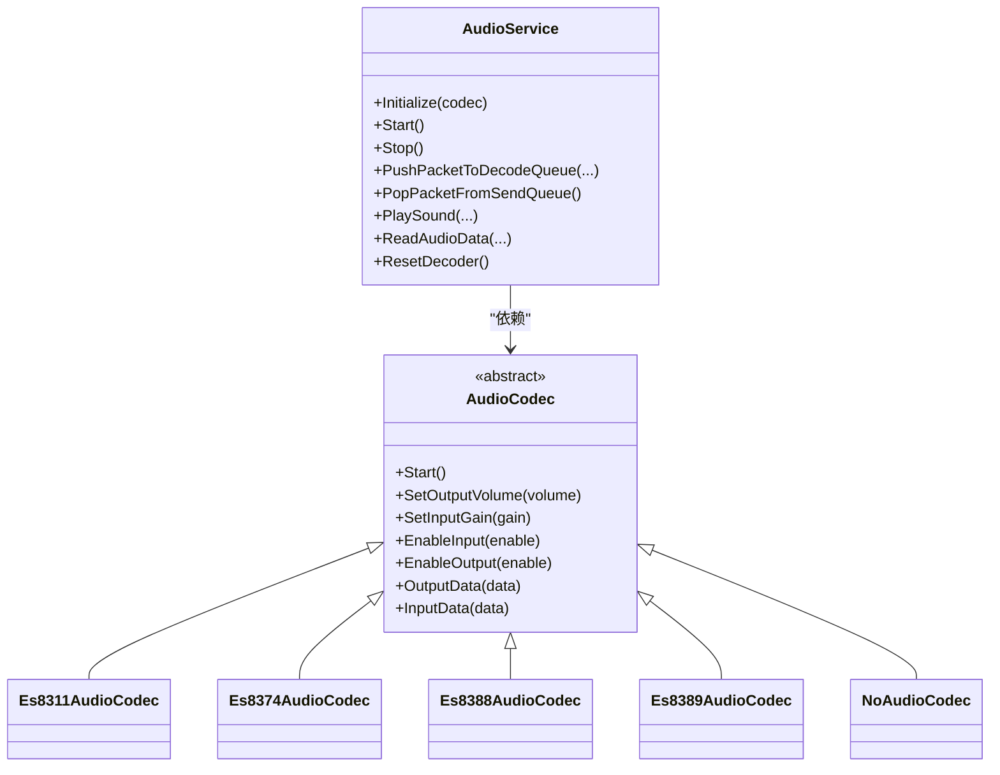

# 音频播放问题

<cite>
**本文引用的文件**   
- [audio_service.h](file://main\audio\audio_service.h)
- [audio_service.cc](file://main\audio\audio_service.cc)
- [audio_codec.h](file://main\audio\audio_codec.h)
- [audio_codec.cc](file://main\audio\audio_codec.cc)
- [es8311_audio_codec.h](file://main\audio\codecs\es8311_audio_codec.h)
- [es8311_audio_codec.cc](file://main\audio\codecs\es8311_audio_codec.cc)
- [es8374_audio_codec.h](file://main\audio\codecs\es8374_audio_codec.h)
- [es8374_audio_codec.cc](file://main\audio\codecs\es8374_audio_codec.cc)
- [es8388_audio_codec.h](file://main\audio\codecs\es8388_audio_codec.h)
- [es8388_audio_codec.cc](file://main\audio\codecs\es8388_audio_codec.cc)
- [es8389_audio_codec.h](file://main\audio\codecs\es8389_audio_codec.h)
- [es8389_audio_codec.cc](file://main\audio\codecs\es8389_audio_codec.cc)
- [no_audio_codec.cc](file://main\audio\codecs\no_audio_codec.cc)
- [README.md](file://main\audio\README.md)
</cite>

## 目录
1. [简介](#简介)
2. [项目结构](#项目结构)
3. [核心组件](#核心组件)
4. [架构总览](#架构总览)
5. [详细组件分析](#详细组件分析)
6. [依赖关系分析](#依赖关系分析)
7. [性能与稳定性优化](#性能与稳定性优化)
8. [常见问题与诊断步骤](#常见问题与诊断步骤)
9. [结论](#结论)
10. [附录：编解码器配置要点](#附录编解码器配置要点)

## 简介
本文件面向在 ESP32 系列平台上进行语音交互或媒体播放的开发者，聚焦“声音失真、播放卡顿、音量异常、杂音干扰”等典型音频播放问题。文档从系统架构出发，结合代码级实现，给出可操作的诊断流程与优化建议，覆盖 I2S/DAC 输出配置、缓冲区管理、编解码参数、功耗策略与硬件驱动关键点。

## 项目结构
本项目将音频子系统划分为“音频服务层 + 编解码抽象层 + 具体 Codec 驱动”，并通过队列与任务解耦输入/编码/网络发送与解码/播放路径，便于定位问题与调优。

图表来源
- [audio_service.h:28-46](file://main\audio\audio_service.h#L28-L46)
- [audio_service.cc:125-167](file://main\audio\audio_service.cc#L125-L167)
- [audio_codec.h:17-59](file://main\audio\audio_codec.h#L17-L59)
- [es8311_audio_codec.cc:100-156](file://main\audio\codecs\es8311_audio_codec.cc#L100-L156)
- [es8374_audio_codec.cc:76-132](file://main\audio\codecs\es8374_audio_codec.cc#L76-L132)
- [es8388_audio_codec.cc:85-137](file://main\audio\codecs\es8388_audio_codec.cc#L85-L137)
- [es8389_audio_codec.cc:84-138](file://main\audio\codecs\es8389_audio_codec.cc#L84-L138)
- [no_audio_codec.cc:80-120](file://main\audio\codecs\no_audio_codec.cc#L80-L120)

章节来源
- [audio_service.h:28-46](file://main\audio\audio_service.h#L28-L46)
- [audio_service.cc:125-167](file://main\audio\audio_service.cc#L125-L167)
- [audio_codec.h:17-59](file://main\audio\audio_codec.h#L17-L59)

## 核心组件
- AudioService：协调输入采集、唤醒词检测、语音处理、Opus 编解码、队列调度与播放输出；维护输入/输出采样率、帧长、重采样器与定时器电源管理。
- AudioCodec 抽象：统一封装 I2S 读写、音量/增益控制、输入输出使能；具体驱动通过 i2s_channel_* 与 esp_codec_dev_* API 完成数据通路。
- 具体 Codec 驱动：Es8311/Es8374/Es8388/Es8389 等芯片驱动，负责 I2S 标准模式/TDM/PDM 配置、设备打开/关闭、PA 控制、模拟输出增益设置等。

章节来源
- [audio_service.h:105-195](file://main\audio\audio_service.h#L105-L195)
- [audio_codec.h:17-59](file://main\audio\audio_codec.h#L17-L59)
- [es8311_audio_codec.h:13-40](file://main\audio\codecs\es8311_audio_codec.h#L13-L40)
- [es8374_audio_codec.h:13-39](file://main\audio\codecs\es8374_audio_codec.h#L13-L39)
- [es8388_audio_codec.h:12-38](file://main\audio\codecs\es8388_audio_codec.h#L12-L38)
- [es8389_audio_codec.h:12-38](file://main\audio\codecs\es8389_audio_codec.h#L12-L38)

## 架构总览
下图展示关键任务与数据流：输入任务读取 PCM，经可选处理器后入编码队列；Opus 编解码任务负责编解码并填充发送/播放队列；输出任务从播放队列取 PCM 写入 Codec。

图表来源
- [audio_service.cc:230-288](file://main\audio\audio_service.cc#L230-L288)
- [audio_service.cc:327-446](file://main\audio\audio_service.cc#L327-L446)
- [audio_service.cc:290-325](file://main\audio\audio_service.cc#L290-L325)
- [audio_service.cc:448-482](file://main\audio\audio_service.cc#L448-L482)

## 详细组件分析

### 音频服务（AudioService）
- 任务划分
  - 输入任务：周期性读取 PCM，支持双工/单工、左声道抽取、10ms/60ms 两种帧长喂给唤醒词或语音处理器。
  - 编解码任务：按队列容量限制执行解码与编码，动态切换解码采样率与帧长，必要时启用输出重采样。
  - 输出任务：从播放队列取 PCM 写入 Codec，更新最后活动时间以配合电源管理。
- 队列与背压
  - 解码队列、发送队列、播放队列、编码队列均有上限，避免内存暴涨与卡顿。
- 重采样
  - 输入侧：当 Codec 输入采样率非 16kHz 时，使用输入重采样器对齐至 16kHz。
  - 输出侧：当解码采样率与 Codec 输出不一致时，重建输出重采样器。
- 电源管理
  - 无活动超时自动关闭 ADC/DAC，降低功耗；下次有数据时再自动开启。

图表来源
- [audio_service.cc:125-167](file://main\audio\audio_service.cc#L125-L167)
- [audio_service.cc:230-288](file://main\audio\audio_service.cc#L230-L288)
- [audio_service.cc:327-446](file://main\audio\audio_service.cc#L327-L446)
- [audio_service.cc:682-698](file://main\audio\audio_service.cc#L682-L698)

章节来源
- [audio_service.h:28-76](file://main\audio\audio_service.h#L28-L76)
- [audio_service.cc:62-123](file://main\audio\audio_service.cc#L62-L123)
- [audio_service.cc:230-288](file://main\audio\audio_service.cc#L230-L288)
- [audio_service.cc:327-446](file://main\audio\audio_service.cc#L327-L446)
- [audio_service.cc:448-482](file://main\audio\audio_service.cc#L448-L482)
- [audio_service.cc:682-698](file://main\audio\audio_service.cc#L682-L698)

### 编解码抽象层（AudioCodec）
- 职责：统一对外提供输入/输出数据接口、音量/增益设置、输入输出使能、Start 生命周期钩子。
- 默认行为：Start 时从持久化存储加载输出音量；SetOutputVolume/SetInputGain 会记录日志并落盘。

章节来源
- [audio_codec.h:17-59](file://main\audio\audio_codec.h#L17-L59)
- [audio_codec.cc:29-67](file://main\audio\audio_codec.cc#L29-L67)

### Es8311/Es8374/Es8388/Es8389 驱动要点
- I2S 标准模式
  - 均创建 TX/RX 通道，配置 MCLK/BCLK/WS/DOUT/DIN，位宽通常为 16bit，立体声或单声道根据硬件而定。
- 设备打开/关闭
  - 多数驱动采用“按需打开/关闭”策略，EnableInput/EnableOutput 内部调用 esp_codec_dev_open/close，减少功耗。
- PA 控制
  - 若存在外部功放引脚，会在输出使能时拉高/拉低对应 GPIO，部分驱动支持反相控制。
- 模拟输出增益
  - 个别驱动（如 Es8388）在输出使能时会设置寄存器以调整模拟输出电平，避免过小导致听感微弱。
- 参考输入（AEC）
  - 某些驱动支持参考输入通道，用于回声消除场景，需正确配置通道掩码与增益。

章节来源
- [es8311_audio_codec.cc:100-156](file://main\audio\codecs\es8311_audio_codec.cc#L100-L156)
- [es8311_audio_codec.cc:158-202](file://main\audio\codecs\es8311_audio_codec.cc#L158-L202)
- [es8374_audio_codec.cc:76-132](file://main\audio\codecs\es8374_audio_codec.cc#L76-L132)
- [es8374_audio_codec.cc:134-200](file://main\audio\codecs\es8374_audio_codec.cc#L134-L200)
- [es8388_audio_codec.cc:85-137](file://main\audio\codecs\es8388_audio_codec.cc#L85-L137)
- [es8388_audio_codec.cc:139-221](file://main\audio\codecs\es8388_audio_codec.cc#L139-L221)
- [es8389_audio_codec.cc:84-138](file://main\audio\codecs\es8389_audio_codec.cc#L84-L138)
- [es8389_audio_codec.cc:140-206](file://main\audio\codecs\es8389_audio_codec.cc#L140-L206)

### NoAudioCodec（仅播放）
- 仅创建 TX 通道，输出位宽为 32bit，内部对音量做平方律缩放并限幅，再通过 I2S 写出。
- 适用于无需录音、仅需播放的场景，简化链路。

章节来源
- [no_audio_codec.cc:80-120](file://main\audio\codecs\no_audio_codec.cc#L80-L120)
- [no_audio_codec.cc:221-258](file://main\audio\codecs\no_audio_codec.cc#L221-L258)

## 依赖关系分析
- 模块耦合
  - AudioService 依赖 AudioCodec 抽象，不关心具体芯片细节；具体驱动通过 i2s_channel_* 与 esp_codec_dev_* 与硬件交互。
- 外部库
  - 使用 ESP-IDF I2S 驱动与 esp-opus/esp-audio-codec-dev 库完成编解码与设备控制。
- 可能的循环依赖
  - 当前分层清晰，未见循环依赖；AudioService 通过回调通知上层事件（如发送队列可用、唤醒词检测）。

图表来源
- [audio_service.h:105-195](file://main\audio\audio_service.h#L105-L195)
- [audio_codec.h:17-59](file://main\audio\audio_codec.h#L17-L59)
- [es8311_audio_codec.h:13-40](file://main\audio\codecs\es8311_audio_codec.h#L13-L40)
- [es8374_audio_codec.h:13-39](file://main\audio\codecs\es8374_audio_codec.h#L13-L39)
- [es8388_audio_codec.h:12-38](file://main\audio\codecs\es8388_audio_codec.h#L12-L38)
- [es8389_audio_codec.h:12-38](file://main\audio\codecs\es8389_audio_codec.h#L12-L38)

章节来源
- [audio_service.h:105-195](file://main\audio\audio_service.h#L105-L195)
- [audio_codec.h:17-59](file://main\audio\audio_codec.h#L17-L59)

## 性能与稳定性优化
- 队列与背压
  - 合理设置解码/发送/播放队列上限，避免突发流量导致抖动；当前已内置上限并在等待条件中保护。
- 帧长与比特率
  - 默认 60ms 帧长兼顾延迟与开销；在网络不稳定时可考虑增大帧长提升鲁棒性。
- 重采样
  - 仅在必要时重建重采样器，避免频繁切换造成瞬态噪声；输入/输出两端分别独立管理。
- 电源管理
  - 空闲超时自动关闭 ADC/DAC，降低功耗；注意双工模式下保持 TX 时钟以避免 RX 卡死。
- DMA 描述符与帧数
  - 各驱动使用固定 DMA_DESC_NUM 与 DMA_FRAME_NUM，可在资源允许下适当增大以降低丢包风险。

章节来源
- [audio_service.h:39-46](file://main\audio\audio_service.h#L39-L46)
- [audio_service.cc:327-446](file://main\audio\audio_service.cc#L327-L446)
- [audio_service.cc:682-698](file://main\audio\audio_service.cc#L682-L698)
- [audio_codec.h:14-16](file://main\audio\audio_codec.h#L14-L16)
- [README.md:86-88](file://main\audio\README.md#L86-L88)

## 常见问题与诊断步骤

### 症状一：声音失真（破音/削波/毛刺）
可能原因
- DAC 输出增益过高或音量过大导致削波。
- I2S 位宽/格式与硬件不匹配（例如 16bit 误配为 32bit）。
- 输出重采样器未正确重建或状态残留。
- 功放（PA）控制时序不当或极性错误。

诊断步骤
- 检查并降低系统音量，观察是否改善。
- 核对 I2S 配置：位宽、声道掩码、左对齐/大端/LSB 顺序是否与硬件一致。
- 确认输出重采样器是否在采样率变化时重建。
- 验证 PA 引脚电平与反相配置是否符合板级设计。

章节来源
- [audio_codec.cc:40-46](file://main\audio\audio_codec.cc#L40-L46)
- [es8311_audio_codec.cc:114-150](file://main\audio\codecs\es8311_audio_codec.cc#L114-L150)
- [es8388_audio_codec.cc:189-194](file://main\audio\codecs\es8388_audio_codec.cc#L189-L194)
- [audio_service.cc:448-482](file://main\audio\audio_service.cc#L448-L482)

### 症状二：播放卡顿/断续
可能原因
- 解码/播放队列满导致阻塞。
- 网络丢包或解码失败导致帧缺失。
- 输出任务被抢占或优先级过低。
- DMA 缓冲不足或 I2S 传输错误。

诊断步骤
- 观察日志中的解码/播放计数与队列长度，判断是否频繁满队。
- 检查解码返回码与恢复策略，必要时重置解码器。
- 提高输出任务优先级或增加堆栈大小。
- 增大 DMA 描述符/帧数，确保 I2S 传输稳定。

章节来源
- [audio_service.cc:327-446](file://main\audio\audio_service.cc#L327-L446)
- [audio_service.cc:290-325](file://main\audio\audio_service.cc#L290-L325)
- [audio_codec.h:14-16](file://main\audio\audio_codec.h#L14-L16)

### 症状三：音量异常（过小/无声）
可能原因
- 系统音量保存值过小或被重置。
- 模拟输出增益寄存器未设置或设置过低。
- PA 未开启或极性错误。
- 输出通道未使能。

诊断步骤
- 检查持久化音量值，必要时重置为默认。
- 查看具体驱动在 EnableOutput 时的模拟增益与 PA 控制逻辑。
- 确认输出使能标志与设备打开状态。

章节来源
- [audio_codec.cc:29-38](file://main\audio\audio_codec.cc#L29-L38)
- [es8388_audio_codec.cc:189-194](file://main\audio\codecs\es8388_audio_codec.cc#L189-L194)
- [es8374_audio_codec.cc:176-184](file://main\audio\codecs\es8374_audio_codec.cc#L176-L184)
- [es8389_audio_codec.cc:181-190](file://main\audio\codecs\es8389_audio_codec.cc#L181-L190)

### 症状四：杂音/底噪/电流声
可能原因
- 输入增益过高导致放大噪声。
- I2S 时钟/相位配置不正确。
- 参考输入（AEC）通道未正确配置。
- 电源不稳或地线干扰。

诊断步骤
- 降低输入增益，观察底噪是否下降。
- 核对 MCLK/BCLK/WS 频率与分频，确保符合器件手册。
- 若启用 AEC，确认参考输入通道掩码与增益设置。
- 检查供电与接地布局，必要时增加滤波电容。

章节来源
- [es8311_audio_codec.cc:88-90](file://main\audio\codecs\es8311_audio_codec.cc#L88-L90)
- [es8374_audio_codec.cc:145-156](file://main\audio\codecs\es8374_audio_codec.cc#L145-L156)
- [es8388_audio_codec.cc:157-166](file://main\audio\codecs\es8388_audio_codec.cc#L157-L166)

### 通用排查清单
- 检查 I2S 输出配置：位宽、声道掩码、左对齐/大端/LSB、MCLK 倍频。
- 验证音频格式兼容性：输入/输出采样率、帧长、通道数与重采样器状态。
- 测试扬声器硬件功能：短接/替换扬声器、测量 PA 引脚电平、确认极性。
- 监控队列与任务状态：解码/播放队列长度、任务优先级与堆栈占用。
- 关注电源管理：空闲超时关闭/开启逻辑，双工模式下 TX 时钟保持。

章节来源
- [audio_service.cc:682-698](file://main\audio\audio_service.cc#L682-L698)
- [audio_service.cc:448-482](file://main\audio\audio_service.cc#L448-L482)
- [es8311_audio_codec.cc:114-150](file://main\audio\codecs\es8311_audio_codec.cc#L114-L150)
- [es8374_audio_codec.cc:90-132](file://main\audio\codecs\es8374_audio_codec.cc#L90-L132)
- [es8388_audio_codec.cc:99-137](file://main\audio\codecs\es8388_audio_codec.cc#L99-L137)
- [es8389_audio_codec.cc:98-138](file://main\audio\codecs\es8389_audio_codec.cc#L98-L138)

## 结论
通过对 AudioService 的任务与队列机制、AudioCodec 抽象与各具体驱动的实现分析，可以系统性地定位并解决声音失真、卡顿、音量异常与杂音等问题。关键在于：
- 严格对齐 I2S 与 Codec 的配置（位宽、声道、对齐方式、时钟）。
- 合理设置队列上限与任务优先级，保障实时性与稳定性。
- 谨慎管理重采样器与电源策略，避免状态残留与功耗陷阱。
- 针对具体硬件（PA、模拟增益、参考输入）进行针对性校准。

## 附录：编解码器配置要点
- Opus 编码
  - 采样率 16kHz、单声道、16bit，帧长 60ms，自适应码率与 VBR 开启，DTX 开启以降低静默带宽。
- Opus 解码
  - 根据网络传入的采样率与帧长动态重建解码器；若与 Codec 输出不一致则重建输出重采样器。
- I2S 标准模式
  - 常见配置：16bit、立体声或单声道、左对齐、MCLK=256×Fs；不同平台对 HW_VERSION_2 的 ext_clk_freq_hz 有特殊要求。
- 模拟输出增益
  - 某些驱动需在输出使能时设置寄存器以获得合适的模拟电平，避免过弱或失真。
- 参考输入（AEC）
  - 需要启用参考通道并正确设置通道掩码与增益，确保回声消除链路完整。

章节来源
- [audio_service.h:55-76](file://main\audio\audio_service.h#L55-L76)
- [audio_service.cc:62-123](file://main\audio\audio_service.cc#L62-L123)
- [audio_service.cc:448-482](file://main\audio\audio_service.cc#L448-L482)
- [es8311_audio_codec.cc:114-150](file://main\audio\codecs\es8311_audio_codec.cc#L114-L150)
- [es8374_audio_codec.cc:90-132](file://main\audio\codecs\es8374_audio_codec.cc#L90-L132)
- [es8388_audio_codec.cc:189-194](file://main\audio\codecs\es8388_audio_codec.cc#L189-L194)
- [es8389_audio_codec.cc:98-138](file://main\audio\codecs\es8389_audio_codec.cc#L98-L138)