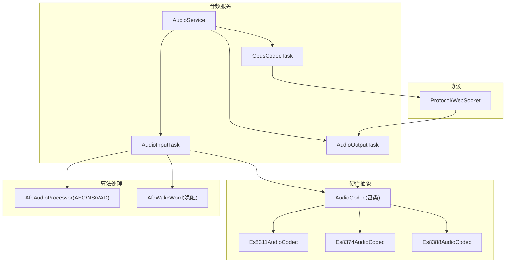
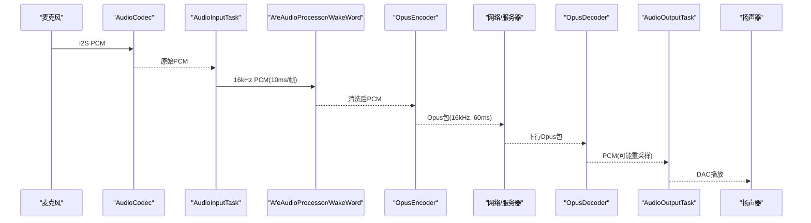
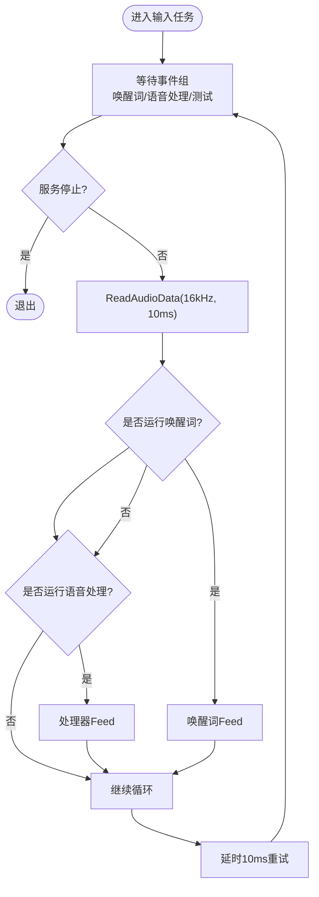
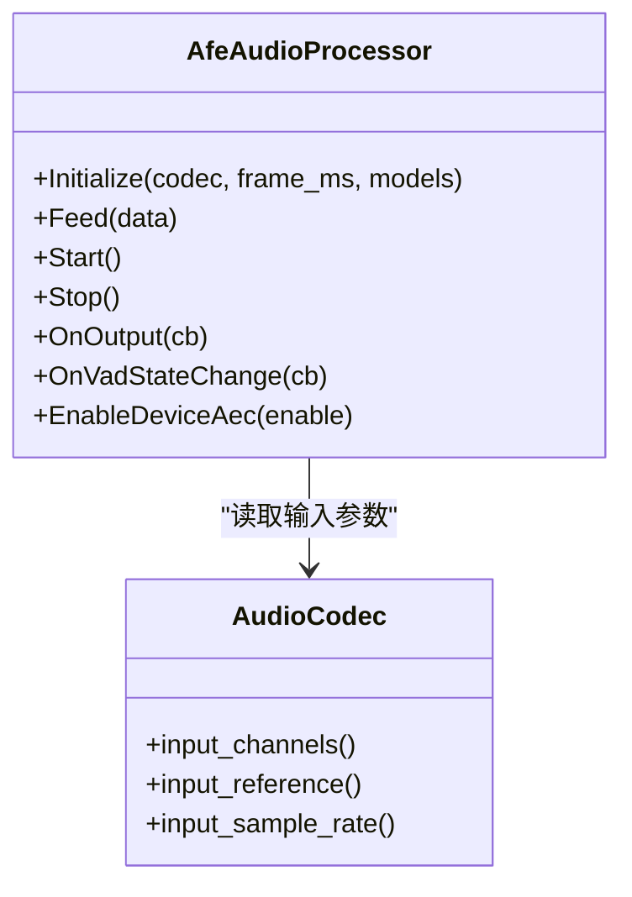
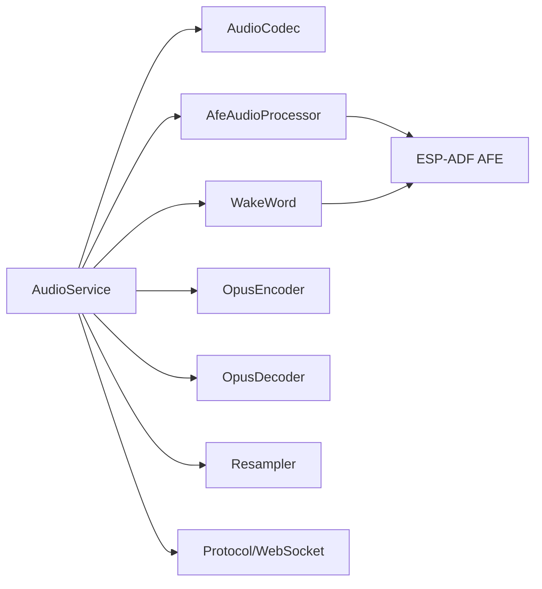

# 音频相关问题

<cite>
**本文引用的文件**   
- [main\audio\README.md](file://main/audio/README.md)
- [main\audio\audio_service.h](file://main/audio/audio_service.h)
- [main\audio\audio_service.cc](file://main/audio/audio_service.cc)
- [main\audio\audio_codec.h](file://main/audio/audio_codec.h)
- [main\audio\audio_codec.cc](file://main/audio/audio_codec.cc)
- [main\audio\processors\afe_audio_processor.h](file://main/audio/processors/afe_audio_processor.h)
- [main\audio\processors\afe_audio_processor.cc](file://main/audio/processors/afe_audio_processor.cc)
- [main\audio\wake_words\afe_wake_word.h](file://main/audio/wake_words/afe_wake_word.h)
- [main\audio\wake_words\afe_wake_word.cc](file://main/audio/wake_words/afe_wake_word.cc)
- [main\audio\codecs\es8311_audio_codec.h](file://main/audio/codecs/es8311_audio_codec.h)
- [main\audio\codecs\es8311_audio_codec.cc](file://main/audio/codecs/es8311_audio_codec.cc)
- [main\audio\codecs\es8374_audio_codec.h](file://main/audio/codecs/es8374_audio_codec.h)
- [main\audio\codecs\es8374_audio_codec.cc](file://main/audio/codecs/es8374_audio_codec.cc)
- [main\audio\codecs\es8388_audio_codec.h](file://main/audio/codecs/es8388_audio_codec.h)
- [main\audio\codecs\es8388_audio_codec.cc](file://main/audio/codecs/es8388_audio_codec.cc)
- [main\protocols\protocol.h](file://main/protocols/protocol.h)
- [main\protocols\websocket_protocol.cc](file://main/protocols/websocket_protocol.cc)
- [main\application.cc](file://main/application.cc)
- [main\Kconfig.projbuild](file://main/Kconfig.projbuild)
</cite>

## 目录
1. [简介](#简介)
2. [项目结构](#项目结构)
3. [核心组件](#核心组件)
4. [架构总览](#架构总览)
5. [详细组件分析](#详细组件分析)
6. [依赖关系分析](#依赖关系分析)
7. [性能与功耗特性](#性能与功耗特性)
8. [常见问题排查指南](#常见问题排查指南)
9. [结论](#结论)
10. [附录：调试工具与质量评估](#附录调试工具与质量评估)

## 简介
本文件面向在设备上实现语音交互的工程师与维护人员，聚焦于音频采集、处理、编解码与播放全链路的问题诊断与优化。内容覆盖麦克风无声、声音失真、回声严重、唤醒词识别失败等典型问题；给出采样率、位深、通道数等编解码参数配置要点；解释设备侧AEC（回声消除）、降噪、VAD的配置与调优；并提供音频调试工具使用与质量评估方法。

## 项目结构
本项目音频子系统位于 main/audio 下，采用分层与模块化设计：
- 硬件抽象层：AudioCodec 及其具体实现（如 ES8311/ES8374/ES8388）
- 服务编排层：AudioService 统一调度输入/输出任务、Opus编解码、队列与事件
- 算法处理层：AfeAudioProcessor（基于ESP-ADF AFE，支持AEC/NS/VAD）
- 唤醒词模块：AfeWakeWord/CustomWakeWord/EspWakeWord
- 协议与网络：Protocol/WebSocket 负责与服务器协商音频参数并传输
- 应用控制：Application 协调状态机、AEC模式切换、唤醒流程

图示来源
- [main\audio\audio_service.h:1-195](file://main/audio/audio_service.h#L1-L195)
- [main\audio\audio_service.cc:125-167](file://main/audio/audio_service.cc#L125-L167)
- [main\audio\audio_codec.h:1-62](file://main/audio/audio_codec.h#L1-L62)
- [main\audio\codecs\es8311_audio_codec.h:1-42](file://main/audio/codecs/es8311_audio_codec.h#L1-L42)
- [main\audio\codecs\es8374_audio_codec.h:1-41](file://main/audio/codecs/es8374_audio_codec.h#L1-L41)
- [main\audio\codecs\es8388_audio_codec.h:1-41](file://main/audio/codecs/es8388_audio_codec.h#L1-L41)
- [main\audio\processors\afe_audio_processor.h:1-48](file://main/audio/processors/afe_audio_processor.h#L1-L48)
- [main\audio\wake_words\afe_wake_word.h:1-63](file://main/audio/wake_words/afe_wake_word.h#L1-L63)
- [main\protocols\protocol.h:1-55](file://main/protocols/protocol.h#L1-L55)

章节来源
- [main\audio\README.md:1-88](file://main/audio/README.md#L1-L88)
- [main\audio\audio_service.h:1-195](file://main/audio/audio_service.h#L1-L195)
- [main\audio\audio_service.cc:125-167](file://main/audio/audio_service.cc#L125-L167)

## 核心组件
- AudioService：音频服务中枢，管理任务、队列、事件、电源管理与回调。提供启动/停止、开关唤醒词检测、开关语音处理、设备AEC开关、推入/弹出编解码队列等接口。
- AudioCodec：I2S与Codec芯片的抽象，封装输入/输出使能、音量/增益设置、读写数据。
- AfeAudioProcessor：基于ESP-ADF AFE的前端处理，支持AEC、降噪、VAD，按帧喂入并输出干净语音。
- WakeWord：唤醒词检测，支持多种后端（AFE/自定义/ESP），可缓存并编码唤醒片段。
- Opus编解码：编码器固定16kHz单声道，帧长可配（默认60ms）；解码器根据服务端协商动态重建。
- 协议层：与服务器协商音频参数（格式、采样率、通道、帧时长），并携带时间戳用于服务器侧AEC。

章节来源
- [main\audio\audio_service.h:1-195](file://main/audio/audio_service.h#L1-L195)
- [main\audio\audio_service.cc:62-123](file://main/audio/audio_service.cc#L62-L123)
- [main\audio\audio_codec.h:1-62](file://main/audio/audio_codec.h#L1-L62)
- [main\audio\processors\afe_audio_processor.h:1-48](file://main/audio/processors/afe_audio_processor.h#L1-L48)
- [main\audio\wake_words\afe_wake_word.h:1-63](file://main/audio/wake_words/afe_wake_word.h#L1-L63)
- [main\protocols\protocol.h:1-55](file://main/protocols/protocol.h#L1-L55)

## 架构总览
音频系统采用三任务并行流水线：
- 输入任务：从Codec读取PCM，按需分发给唤醒词或前端处理器，必要时进行重采样至16kHz
- 编解码任务：将处理后的PCM编码为Opus，或将收到的Opus解码为PCM并按需重采样到DAC速率
- 输出任务：将PCM写入Codec驱动扬声器

图示来源
- [main\audio\audio_service.cc:230-288](file://main/audio/audio_service.cc#L230-L288)
- [main\audio\audio_service.cc:327-446](file://main/audio/audio_service.cc#L327-L446)
- [main\audio\audio_service.cc:290-325](file://main/audio/audio_service.cc#L290-L325)
- [main\protocols\websocket_protocol.cc:203-226](file://main/protocols/websocket_protocol.cc#L203-L226)

## 详细组件分析

### 音频服务（AudioService）
职责与关键点
- 初始化Opus编解码器、输入/输出重采样器，创建定时器用于电源管理
- 启动三个任务：输入、输出、编解码；通过条件变量与互斥量保护队列
- 支持设备AEC开关、唤醒词检测开关、语音处理开关、音频测试模式
- 维护发送队列的时间戳以支持服务器侧AEC

关键流程
- 输入任务：周期性读取PCM，若双声道则取左声道，喂给唤醒词或处理器
- 编解码任务：优先解码下行音频，再编码上行音频；当解码采样率与DAC不一致时启用输出重采样
- 输出任务：从播放队列取PCM写入Codec，记录最后输出时间用于省电策略

图示来源
- [main\audio\audio_service.cc:230-288](file://main/audio/audio_service.cc#L230-L288)

章节来源
- [main\audio\audio_service.h:1-195](file://main/audio/audio_service.h#L1-L195)
- [main\audio\audio_service.cc:62-123](file://main/audio/audio_service.cc#L62-L123)
- [main\audio\audio_service.cc:125-167](file://main/audio/audio_service.cc#L125-L167)
- [main\audio\audio_service.cc:230-288](file://main/audio/audio_service.cc#L230-L288)
- [main\audio\audio_service.cc:290-325](file://main/audio/audio_service.cc#L290-L325)
- [main\audio\audio_service.cc:327-446](file://main/audio/audio_service.cc#L327-L446)
- [main\audio\audio_service.cc:448-482](file://main/audio/audio_service.cc#L448-L482)
- [main\audio\audio_service.cc:682-698](file://main/audio/audio_service.cc#L682-L698)

### 音频编解码与重采样
- 编码器：固定16kHz、单声道、16bit，帧长默认60ms，开启VBR与DTX
- 解码器：根据服务端协商的动态采样率与帧长重建，若与DAC不同则启用输出重采样
- 输入重采样：当Codec输入采样率非16kHz时，自动重采样至16kHz供处理与唤醒

章节来源
- [main\audio\audio_service.h:39-76](file://main/audio/audio_service.h#L39-L76)
- [main\audio\audio_service.cc:62-123](file://main/audio/audio_service.cc#L62-L123)
- [main\audio\audio_service.cc:448-482](file://main/audio/audio_service.cc#L448-L482)
- [main\protocols\websocket_protocol.cc:203-226](file://main/protocols/websocket_protocol.cc#L203-L226)

### 前端处理（AfeAudioProcessor）
功能
- 基于ESP-ADF AFE，支持AEC、降噪（NS）、VAD
- 按AFE要求的feed/fetch块大小缓冲与推送
- 支持设备侧AEC开关（关闭VAD，启用AEC）

配置要点
- 输入格式由Codec通道数与参考通道决定（M/R组合）
- 内存分配优先PSRAM，高性能模式
- 可通过编译选项启用设备侧AEC

图示来源
- [main\audio\processors\afe_audio_processor.h:1-48](file://main/audio/processors/afe_audio_processor.h#L1-L48)
- [main\audio\processors\afe_audio_processor.cc:13-75](file://main/audio/processors/afe_audio_processor.cc#L13-L75)
- [main\audio\processors\afe_audio_processor.cc:189-201](file://main/audio/processors/afe_audio_processor.cc#L189-L201)

章节来源
- [main\audio\processors\afe_audio_processor.cc:13-75](file://main/audio/processors/afe_audio_processor.cc#L13-L75)
- [main\audio\processors\afe_audio_processor.cc:135-187](file://main/audio/processors/afe_audio_processor.cc#L135-L187)
- [main\audio\processors\afe_audio_processor.cc:189-201](file://main/audio/processors/afe_audio_processor.cc#L189-L201)
- [main\Kconfig.projbuild:917-936](file://main/Kconfig.projbuild#L917-L936)

### 唤醒词（AfeWakeWord）
功能
- 加载Wakenet模型，解析支持的唤醒词列表
- 持续feed音频，检测到唤醒后回调上层，并可编码最近约2秒PCM为Opus上传
- 独立任务执行检测，避免阻塞主流程

章节来源
- [main\audio\wake_words\afe_wake_word.h:1-63](file://main/audio/wake_words/afe_wake_word.h#L1-L63)
- [main\audio\wake_words\afe_wake_word.cc:38-90](file://main/audio/wake_words/afe_wake_word.cc#L38-L90)
- [main\audio\wake_words\afe_wake_word.cc:135-161](file://main/audio/wake_words/afe_wake_word.cc#L135-L161)
- [main\audio\wake_words\afe_wake_word.cc:172-253](file://main/audio/wake_words/afe_wake_word.cc#L172-L253)

### 硬件抽象（AudioCodec及具体实现）
- Es8311/Es8374/Es8388均实现双工I2S与Codec控制，支持输入增益、输出音量、PA控制
- Es8388支持参考输入通道（input_reference=true），用于设备侧AEC
- 各实现中I2S时钟、位宽、槽位、DMA描述符与帧数均有明确配置

章节来源
- [main\audio\audio_codec.h:1-62](file://main/audio/audio_codec.h#L1-L62)
- [main\audio\audio_codec.cc:29-68](file://main/audio/audio_codec.cc#L29-L68)
- [main\audio\codecs\es8311_audio_codec.cc:7-59](file://main/audio/codecs/es8311_audio_codec.cc#L7-L59)
- [main\audio\codecs\es8374_audio_codec.cc:7-62](file://main/audio/codecs/es8374_audio_codec.cc#L7-L62)
- [main\audio\codecs\es8388_audio_codec.cc:7-71](file://main/audio/codecs/es8388_audio_codec.cc#L7-L71)

### 协议与服务器协商
- Hello消息声明音频参数：格式opus、采样率16kHz、通道1、帧时长60ms
- 可选上报设备能力（如服务器侧AEC）
- 二进制协议携带毫秒级时间戳，用于服务器侧AEC对齐

章节来源
- [main\protocols\websocket_protocol.cc:203-226](file://main/protocols/websocket_protocol.cc#L203-L226)
- [main\protocols\protocol.h:17-24](file://main/protocols/protocol.h#L17-L24)

## 依赖关系分析
- AudioService 依赖 AudioCodec、AfeAudioProcessor、WakeWord、Opus编解码库、重采样库
- AfeAudioProcessor 依赖 ESP-ADF AFE 与模型列表
- WakeWord 依赖 AFE 与 Wakenet 模型
- 协议层依赖 JSON 与网络栈，向服务器上报音频参数与时间戳

图示来源
- [main\audio\audio_service.h:1-195](file://main/audio/audio_service.h#L1-L195)
- [main\audio\processors\afe_audio_processor.h:1-48](file://main/audio/processors/afe_audio_processor.h#L1-L48)
- [main\audio\wake_words\afe_wake_word.h:1-63](file://main/audio/wake_words/afe_wake_word.h#L1-L63)
- [main\protocols\protocol.h:1-55](file://main/protocols/protocol.h#L1-L55)

章节来源
- [main\audio\audio_service.h:1-195](file://main/audio/audio_service.h#L1-L195)
- [main\audio\processors\afe_audio_processor.h:1-48](file://main/audio/processors/afe_audio_processor.h#L1-L48)
- [main\audio\wake_words\afe_wake_word.h:1-63](file://main/audio/wake_words/afe_wake_word.h#L1-L63)
- [main\protocols\protocol.h:1-55](file://main/protocols/protocol.h#L1-L55)

## 性能与功耗特性
- 任务优先级与核心绑定：输入任务在高优先级核心运行，编解码任务低优先级，降低抖动
- 队列长度限制：防止内存暴涨与延迟累积
- 电源管理：无活动超过阈值自动关闭ADC/DAC，减少功耗；双工模式下保持TX时钟避免RX卡死
- 重采样复杂度：速度优先模式，平衡CPU占用与音质

章节来源
- [main\audio\audio_service.cc:125-167](file://main/audio/audio_service.cc#L125-L167)
- [main\audio\audio_service.cc:682-698](file://main/audio/audio_service.cc#L682-L698)
- [main\audio\audio_service.cc:5-14](file://main/audio/audio_service.cc#L5-L14)

## 常见问题排查指南

### 麦克风无声
可能原因
- 输入未使能或Codec未打开
- 输入采样率与请求不匹配且重采样器未正确初始化
- 双声道输入未转换为单声道导致后续处理异常
- 输入增益过低或硬件PA未开启

排查步骤
- 确认输入使能与设备状态：检查 EnableInput(true) 调用路径与 UpdateDeviceState 逻辑
- 核对采样率：若 codec input_sample_rate != 16kHz，确保已创建输入重采样器
- 双声道处理：在输入任务中对双声道取左声道
- 检查输入增益与PA引脚电平

章节来源
- [main\audio\audio_service.cc:184-228](file://main/audio/audio_service.cc#L184-L228)
- [main\audio\audio_service.cc:252-266](file://main/audio/audio_service.cc#L252-L266)
- [main\audio\codecs\es8311_audio_codec.cc:70-98](file://main/audio/codecs/es8311_audio_codec.cc#L70-L98)
- [main\audio\codecs\es8374_audio_codec.cc:139-158](file://main/audio/codecs/es8374_audio_codec.cc#L139-L158)
- [main\audio\codecs\es8388_audio_codec.cc:144-171](file://main/audio/codecs/es8388_audio_codec.cc#L144-L171)

### 声音失真或爆音
可能原因
- 输出音量过高或DAC增益不当
- 输出重采样参数错误导致丢帧或插值异常
- 输出任务阻塞或队列溢出

排查步骤
- 调整输出音量与硬件寄存器（如ES8388模拟输出寄存器）
- 校验解码采样率与DAC一致，必要时启用输出重采样
- 监控播放队列长度与解码错误日志

章节来源
- [main\audio\audio_service.cc:327-446](file://main/audio/audio_service.cc#L327-L446)
- [main\audio\codecs\es8388_audio_codec.cc:173-206](file://main/audio/codecs/es8388_audio_codec.cc#L173-L206)

### 回声严重
可能原因
- 未启用设备侧AEC或未提供干净的参考路径
- 物理声学隔离不足（麦克风和扬声器距离过近）
- 服务器侧AEC未启用或时间戳未对齐

排查步骤
- 启用设备侧AEC：通过 Application 设置 AEC 模式为“设备侧”，并确保 Es8388 的 input_reference=true
- 检查 AFE 配置：aec_init=true，aec_mode=VOIP_HIGH_PERF
- 若使用服务器侧AEC，确认Hello消息中features.aec=true，且二进制协议携带timestamp

章节来源
- [main\application.cc:1090-1115](file://main/application.cc#L1090-L1115)
- [main\audio\processors\afe_audio_processor.cc:59-65](file://main/audio/processors/afe_audio_processor.cc#L59-L65)
- [main\audio\codecs\es8388_audio_codec.cc:7-18](file://main/audio/codecs/es8388_audio_codec.cc#L7-L18)
- [main\protocols\websocket_protocol.cc:203-226](file://main/protocols/websocket_protocol.cc#L203-L226)
- [main\protocols\protocol.h:17-24](file://main/protocols/protocol.h#L17-L24)

### 唤醒词识别失败
可能原因
- 唤醒模型未正确加载或模型列表为空
- 输入格式与参考通道不匹配
- 唤醒词任务被提前停止或缓冲区未刷新
- 输入采样率/帧大小与AFE要求不一致

排查步骤
- 检查模型初始化与模型名过滤（ESP_WN_PREFIX/ESP_MN_PREFIX）
- 确认输入格式字符串（M/R）与Codec通道一致
- 在唤醒检测任务中查看 feed/fetch 尺寸日志
- 切换模式时重置输入重采样器，避免缓存污染

章节来源
- [main\audio\wake_words\afe_wake_word.cc:38-90](file://main/audio/wake_words/afe_wake_word.cc#L38-L90)
- [main\audio\wake_words\afe_wake_word.cc:135-161](file://main/audio/wake_words/afe_wake_word.cc#L135-L161)
- [main\audio\audio_service.cc:549-577](file://main/audio/audio_service.cc#L549-L577)
- [main\audio\audio_service.cc:579-604](file://main/audio/audio_service.cc#L579-L604)

### 编解码器配置错误（采样率、位深、通道数）
- 上行固定：16kHz、单声道、16bit、60ms帧
- 下行协商：由服务器Hello返回的sample_rate与frame_duration决定
- 重采样：输入/输出与目标不一致时自动启用

排查步骤
- 核对WebSocket Hello中的audio_params字段
- 观察SetDecodeSampleRate日志与重采样器创建结果
- 检查编码器帧大小与缓冲区大小是否匹配

章节来源
- [main\protocols\websocket_protocol.cc:203-226](file://main/protocols/websocket_protocol.cc#L203-L226)
- [main\audio\audio_service.cc:448-482](file://main/audio/audio_service.cc#L448-L482)
- [main\audio\audio_service.h:39-76](file://main/audio/audio_service.h#L39-L76)

### AEC与降噪配置优化
- 设备侧AEC：需要干净的参考路径（Es8388 input_reference=true）与良好声学隔离
- 降噪：启用NSNET模型，选择高性能模式
- VAD：合理设置最小噪声时长，避免误触发

章节来源
- [main\audio\processors\afe_audio_processor.cc:37-57](file://main/audio/processors/afe_audio_processor.cc#L37-L57)
- [main\Kconfig.projbuild:917-936](file://main/Kconfig.projbuild#L917-L936)

## 结论
本音频子系统通过清晰的分层与多任务流水线，实现了稳定的采集、处理、编解码与播放。针对常见音频问题，建议从硬件抽象层参数、前端处理配置、协议协商与时间戳传递三方面逐项排查。结合调试工具与质量评估方法，可有效定位并优化用户体验。

## 附录：调试工具与质量评估

### 音频调试工具
- 内置UDP音频调试：可将原始PCM通过UDP发送到指定服务器地址与端口，便于离线分析
- 使用方法：在配置中启用音频调试，设置服务器地址为“IP:PORT”

章节来源
- [main\audio\processors\audio_debugger.h:1-22](file://main/audio/processors\audio_debugger.h#L1-L22)
- [main\audio\processors\audio_debugger.cc:1-68](file://main/audio/processors\audio_debugger.cc#L1-L68)
- [main\audio\audio_service.cc:219-226](file://main/audio/audio_service.cc#L219-L226)

### 质量评估方法
- 主观听感：关注清晰度、底噪、回声、断续与爆音
- 客观指标：
  - 信噪比（SNR）：对比安静环境与说话环境波形能量
  - 总谐波失真（THD）：播放标准正弦信号测量
  - 延迟：从输入到输出的端到端延迟，关注队列与重采样引入的额外延迟
- 工具建议：使用上位机录制UDP流，进行频谱分析与VAD统计

[本节为通用指导，无需源码引用]