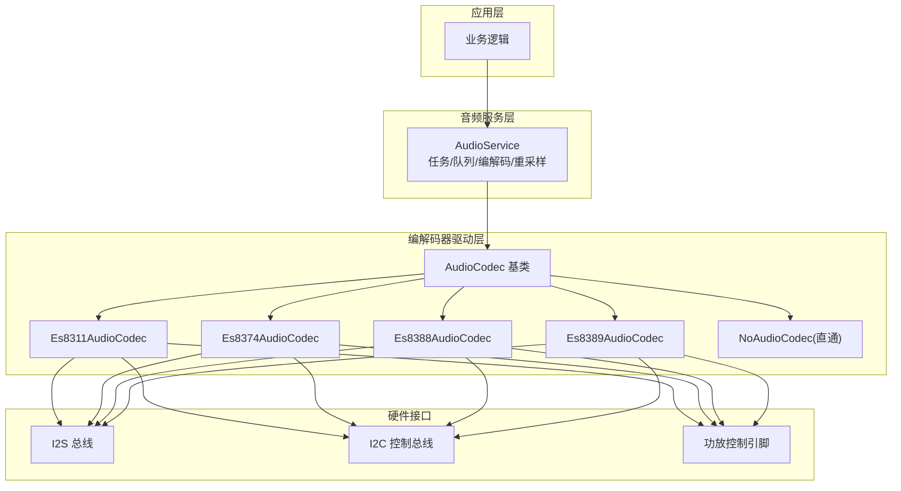
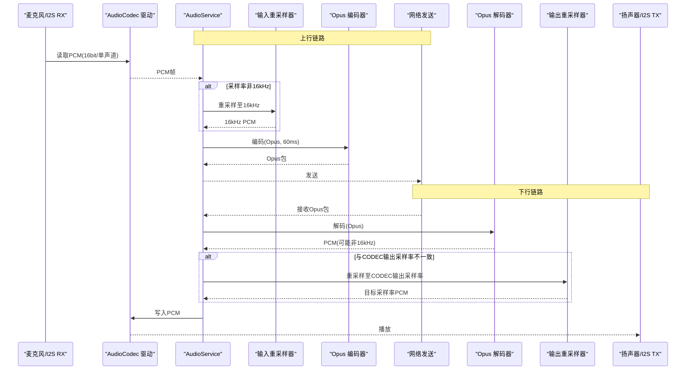
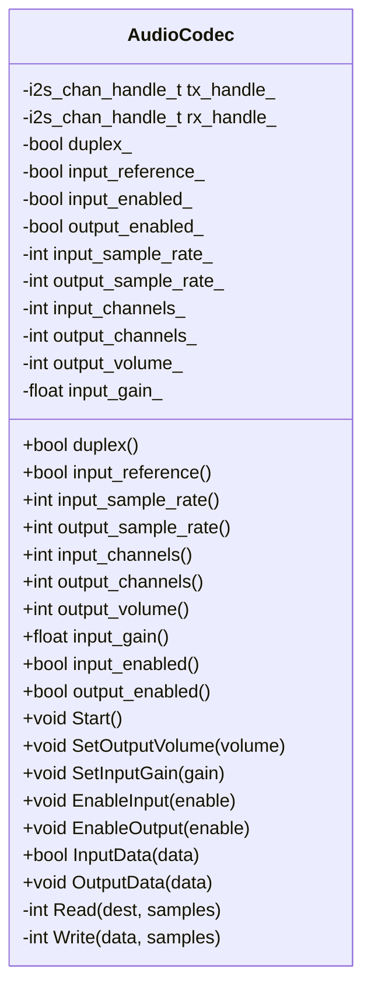
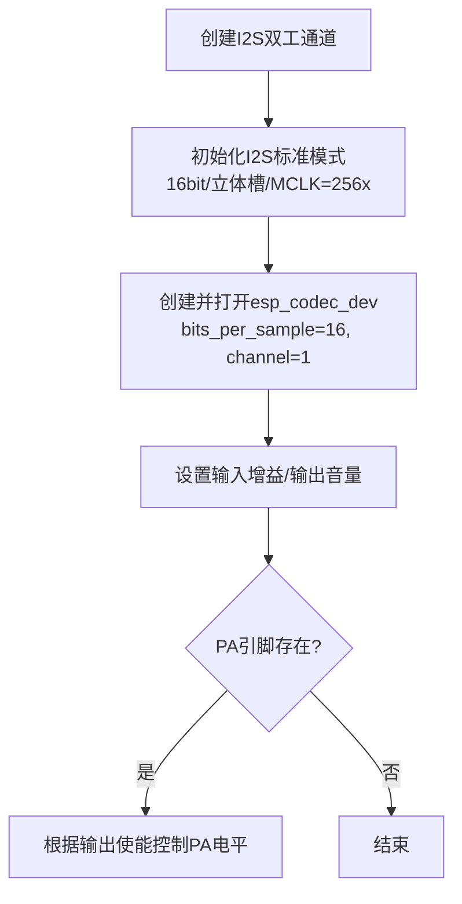
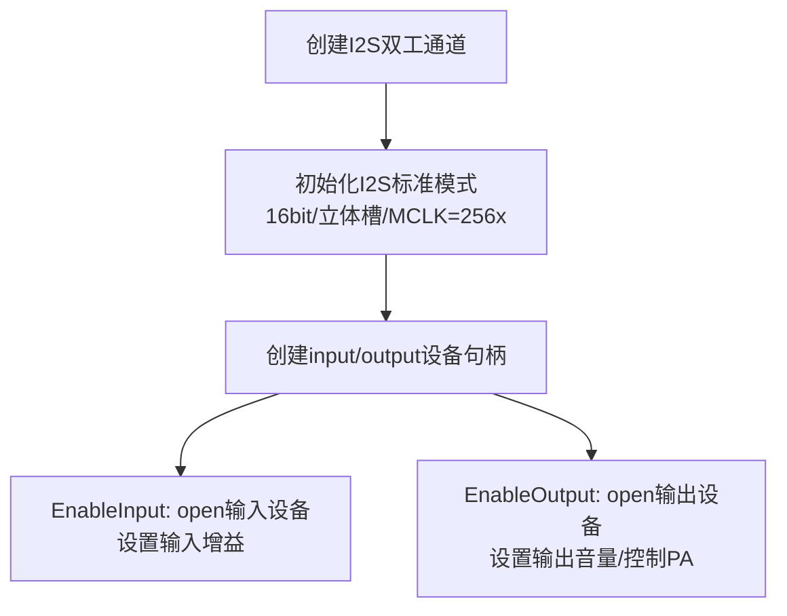
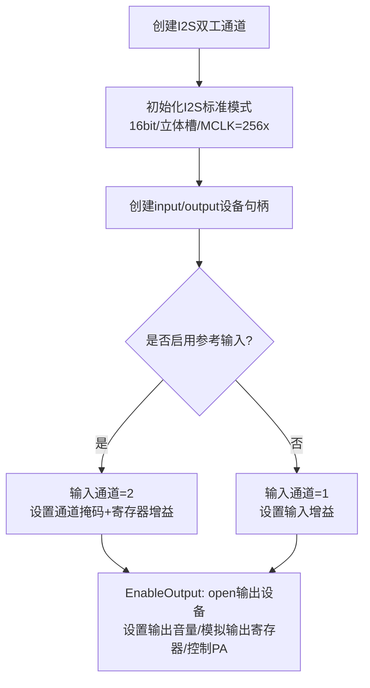
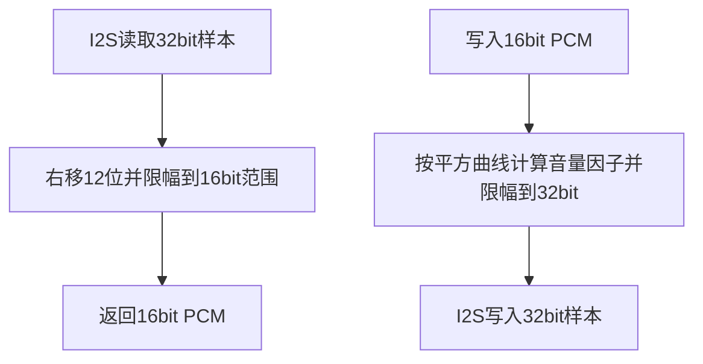
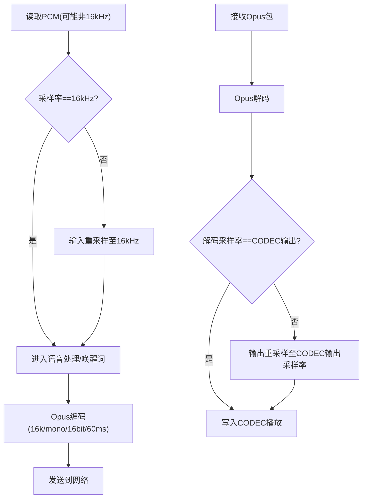
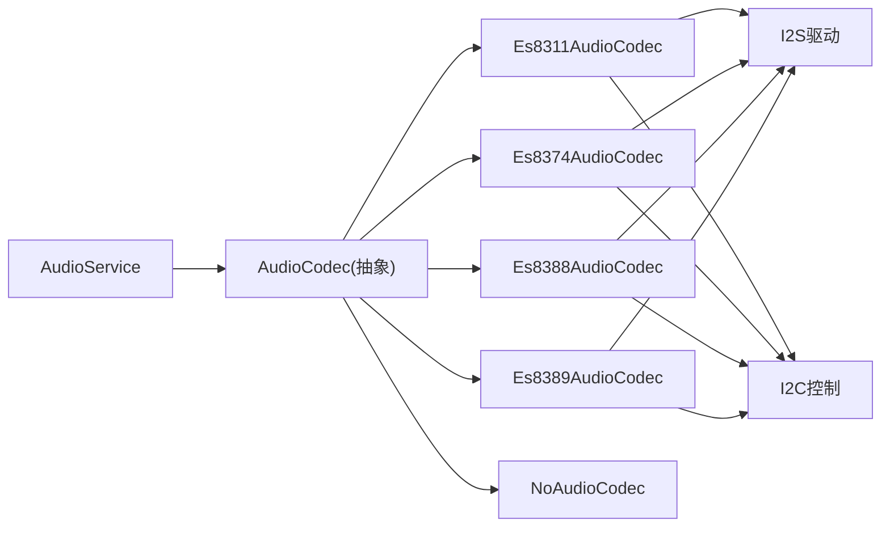

# 音频编解码器配置

<cite>
**本文引用的文件**   
- [audio_codec.h](file://main/audio/audio_codec.h)
- [audio_codec.cc](file://main/audio/audio_codec.cc)
- [es8311_audio_codec.h](file://main/audio/codecs/es8311_audio_codec.h)
- [es8311_audio_codec.cc](file://main/audio/codecs/es8311_audio_codec.cc)
- [es8374_audio_codec.h](file://main/audio/codecs/es8374_audio_codec.h)
- [es8374_audio_codec.cc](file://main/audio/codecs/es8374_audio_codec.cc)
- [es8388_audio_codec.h](file://main/audio/codecs/es8388_audio_codec.h)
- [es8388_audio_codec.cc](file://main/audio/codecs/es8388_audio_codec.cc)
- [es8389_audio_codec.h](file://main/audio/codecs/es8389_audio_codec.h)
- [es8389_audio_codec.cc](file://main/audio/codecs/es8389_audio_codec.cc)
- [no_audio_codec.cc](file://main/audio/codecs/no_audio_codec.cc)
- [audio_service.h](file://main/audio/audio_service.h)
- [audio_service.cc](file://main/audio/audio_service.cc)
</cite>

## 目录
1. [简介](#简介)
2. [项目结构](#项目结构)
3. [核心组件](#核心组件)
4. [架构总览](#架构总览)
5. [详细组件分析](#详细组件分析)
6. [依赖关系分析](#依赖关系分析)
7. [性能与功耗考量](#性能与功耗考量)
8. [故障排查指南](#故障排查指南)
9. [结论](#结论)
10. [附录：配置模板与最佳实践](#附录配置模板与最佳实践)

## 简介
本指南面向需要在 ESP32 平台上配置音频编解码器的工程师，围绕采样率、位深、通道数、I2S 标准格式等关键参数进行系统化说明；并提供不同硬件平台的编解码器选择建议与可复用的配置模板。同时覆盖音频格式转换（重采样）、动态音量控制、输入增益调节、参数持久化存储与运行时修改方法，帮助快速落地高质量语音交互体验。

## 项目结构
本项目将音频能力抽象为“编解码器驱动 + 音频服务”两层：
- 编解码器驱动层：封装具体芯片（如 ES8311/ES8374/ES8388/ES8389）的 I2S 与寄存器配置、PA 控制、输入输出开关、音量与增益设置。
- 音频服务层：负责采集/播放任务调度、Opus 编解码、重采样、队列缓冲、唤醒词与语音处理集成、电源管理。

图表来源
- [audio_service.h:105-195](file://main/audio/audio_service.h#L105-L195)
- [audio_service.cc:62-167](file://main/audio/audio_service.cc#L62-L167)
- [audio_codec.h:17-62](file://main/audio/audio_codec.h#L17-L62)
- [es8311_audio_codec.cc:100-156](file://main/audio/codecs/es8311_audio_codec.cc#L100-L156)
- [es8374_audio_codec.cc:76-132](file://main/audio/codecs/es8374_audio_codec.cc#L76-L132)
- [es8388_audio_codec.cc:85-137](file://main/audio/codecs/es8388_audio_codec.cc#L85-L137)
- [es8389_audio_codec.cc:84-138](file://main/audio/codecs/es8389_audio_codec.cc#L84-L138)

章节来源
- [audio_service.h:105-195](file://main/audio/audio_service.h#L105-L195)
- [audio_service.cc:62-167](file://main/audio/audio_service.cc#L62-L167)
- [audio_codec.h:17-62](file://main/audio/audio_codec.h#L17-L62)

## 核心组件
- AudioCodec 基类
  - 提供统一的输入/输出数据接口、音量与增益设置、输入输出使能、启动时从持久化存储恢复音量等能力。
  - 关键属性：双工标志、参考输入标志、输入/输出采样率、输入/输出通道数、输出音量、输入增益、输入/输出使能状态。
- 具体编解码器实现
  - Es8311/Es8374/Es8388/Es8389：均基于 esp_codec_dev 框架，通过 I2S 传输 PCM，通过 I2C 配置寄存器，支持 PA 控制与独立输入/输出设备句柄或统一设备句柄。
  - NoAudioCodec：用于无外部 CODEC 场景，直接走 I2S DMA，并在软件中做音量缩放与位宽转换。
- AudioService
  - 管理采集/播放/编解码任务，完成 Opus 编解码、重采样、队列缓冲、唤醒词与语音处理集成、电源管理。

章节来源
- [audio_codec.h:17-62](file://main/audio/audio_codec.h#L17-L62)
- [audio_codec.cc:29-67](file://main/audio/audio_codec.cc#L29-L67)
- [es8311_audio_codec.cc:7-59](file://main/audio/codecs/es8311_audio_codec.cc#L7-L59)
- [es8374_audio_codec.cc:7-62](file://main/audio/codecs/es8374_audio_codec.cc#L7-L62)
- [es8388_audio_codec.cc:7-71](file://main/audio/codecs/es8388_audio_codec.cc#L7-L71)
- [es8389_audio_codec.cc:7-70](file://main/audio/codecs/es8389_audio_codec.cc#L7-L70)
- [no_audio_codec.cc:221-258](file://main/audio/codecs/no_audio_codec.cc#L221-L258)
- [audio_service.h:105-195](file://main/audio/audio_service.h#L105-L195)
- [audio_service.cc:62-167](file://main/audio/audio_service.cc#L62-L167)

## 架构总览
下图展示从麦克风到网络发送、以及从网络接收到扬声器播放的完整链路，包括重采样与 Opus 编解码。

图表来源
- [audio_service.cc:184-228](file://main/audio/audio_service.cc#L184-L228)
- [audio_service.cc:327-446](file://main/audio/audio_service.cc#L327-L446)
- [audio_service.cc:448-482](file://main/audio/audio_service.cc#L448-L482)
- [audio_service.cc:290-325](file://main/audio/audio_service.cc#L290-L325)

## 详细组件分析

### 编解码器基类与通用能力
- 统一接口
  - 输入/输出数据：InputData/OutputData
  - 音量与增益：SetOutputVolume/SetInputGain
  - 输入/输出使能：EnableInput/EnableOutput
  - 启动初始化：Start（从持久化存储加载输出音量）
- 关键参数
  - 输入/输出采样率、通道数、是否双工、是否参考输入、输出音量、输入增益、输入/输出使能状态。

图表来源
- [audio_codec.h:17-62](file://main/audio/audio_codec.h#L17-L62)
- [audio_codec.cc:29-67](file://main/audio/audio_codec.cc#L29-L67)

章节来源
- [audio_codec.h:17-62](file://main/audio/audio_codec.h#L17-L62)
- [audio_codec.cc:29-67](file://main/audio/audio_codec.cc#L29-L67)

### ES8311 编解码器
- 特性
  - 使用统一设备句柄，支持双工；I2S 标准模式，16bit，立体槽（左右声道），MCLK 256x。
  - 支持 PA 控制与反转极性；输入增益与输出音量通过 esp_codec_dev 设置。
- 关键配置点
  - I2S 时钟与槽位配置、PA 引脚控制、输入参考通道（默认关闭）。

图表来源
- [es8311_audio_codec.cc:100-156](file://main/audio/codecs/es8311_audio_codec.cc#L100-L156)
- [es8311_audio_codec.cc:70-98](file://main/audio/codecs/es8311_audio_codec.cc#L70-L98)
- [es8311_audio_codec.cc:158-188](file://main/audio/codecs/es8311_audio_codec.cc#L158-L188)

章节来源
- [es8311_audio_codec.h:13-40](file://main/audio/codecs/es8311_audio_codec.h#L13-L40)
- [es8311_audio_codec.cc:7-59](file://main/audio/codecs/es8311_audio_codec.cc#L7-L59)
- [es8311_audio_codec.cc:100-156](file://main/audio/codecs/es8311_audio_codec.cc#L100-L156)
- [es8311_audio_codec.cc:158-188](file://main/audio/codecs/es8311_audio_codec.cc#L158-L188)

### ES8374 编解码器
- 特性
  - 分别创建输入/输出设备句柄；I2S 标准模式，16bit，立体槽，MCLK 256x。
  - 支持 PA 控制；输入增益与输出音量通过各自设备句柄设置。
- 关键配置点
  - 输入/输出独立 open/close；PA 电平随输出使能切换。

图表来源
- [es8374_audio_codec.cc:76-132](file://main/audio/codecs/es8374_audio_codec.cc#L76-L132)
- [es8374_audio_codec.cc:139-186](file://main/audio/codecs/es8374_audio_codec.cc#L139-L186)

章节来源
- [es8374_audio_codec.h:13-39](file://main/audio/codecs/es8374_audio_codec.h#L13-L39)
- [es8374_audio_codec.cc:7-62](file://main/audio/codecs/es8374_audio_codec.cc#L7-L62)
- [es8374_audio_codec.cc:139-186](file://main/audio/codecs/es8374_audio_codec.cc#L139-L186)

### ES8388 编解码器
- 特性
  - 支持参考输入（回声消除）：当启用参考输入时，输入通道数为 2，并通过寄存器配置特定增益。
  - I2S 标准模式，16bit，立体槽，MCLK 256x；支持 PA 控制。
- 关键配置点
  - 输入通道掩码根据是否参考输入动态设置；模拟输出音量寄存器预置为 0dB。

图表来源
- [es8388_audio_codec.cc:85-137](file://main/audio/codecs/es8388_audio_codec.cc#L85-L137)
- [es8388_audio_codec.cc:144-206](file://main/audio/codecs/es8388_audio_codec.cc#L144-L206)

章节来源
- [es8388_audio_codec.h:12-38](file://main/audio/codecs/es8388_audio_codec.h#L12-L38)
- [es8388_audio_codec.cc:7-71](file://main/audio/codecs/es8388_audio_codec.cc#L7-L71)
- [es8388_audio_codec.cc:144-206](file://main/audio/codecs/es8388_audio_codec.cc#L144-L206)

### ES8389 编解码器
- 特性
  - 与 ES8374 类似，分别创建输入/输出设备句柄；I2S 标准模式，16bit，立体槽，MCLK 256x。
  - 支持 PA 控制；输入增益与输出音量通过各自设备句柄设置。
- 关键配置点
  - 输入/输出独立 open/close；PA 电平随输出使能切换。

图表来源
- [es8389_audio_codec.cc:84-138](file://main/audio/codecs/es8389_audio_codec.cc#L84-L138)
- [es8389_audio_codec.cc:145-192](file://main/audio/codecs/es8389_audio_codec.cc#L145-L192)

章节来源
- [es8389_audio_codec.h:12-38](file://main/audio/codecs/es8389_audio_codec.h#L12-L38)
- [es8389_audio_codec.cc:7-70](file://main/audio/codecs/es8389_audio_codec.cc#L7-L70)
- [es8389_audio_codec.cc:145-192](file://main/audio/codecs/es8389_audio_codec.cc#L145-L192)

### NoAudioCodec（直通）
- 特性
  - 不依赖外部 CODEC，直接走 I2S DMA；在软件中进行音量缩放与位宽转换（32bit→16bit）。
- 适用场景
  - 仅使用板载 ADC/DAC 或通过 I2S 直连外设的场景。

图表来源
- [no_audio_codec.cc:221-258](file://main/audio/codecs/no_audio_codec.cc#L221-L258)

章节来源
- [no_audio_codec.cc:221-258](file://main/audio/codecs/no_audio_codec.cc#L221-L258)

### 音频服务与重采样/编解码
- 输入路径
  - 若 CODEC 输入采样率非 16kHz，则通过输入重采样器转换为 16kHz，再送入语音处理/唤醒词模块。
- 输出路径
  - Opus 解码后，若解码采样率与 CODEC 输出采样率不一致，则通过输出重采样器转换为目标采样率。
- 编解码参数
  - 上行编码：16kHz、单声道、16bit、60ms 帧长、自动码率、VBR、DTX 开启。
  - 下行解码：根据网络包动态重建解码器，帧长与采样率一致。

图表来源
- [audio_service.cc:184-228](file://main/audio/audio_service.cc#L184-L228)
- [audio_service.cc:327-446](file://main/audio/audio_service.cc#L327-L446)
- [audio_service.cc:448-482](file://main/audio/audio_service.cc#L448-L482)
- [audio_service.h:65-76](file://main/audio/audio_service.h#L65-L76)

章节来源
- [audio_service.cc:184-228](file://main/audio/audio_service.cc#L184-L228)
- [audio_service.cc:327-446](file://main/audio/audio_service.cc#L327-L446)
- [audio_service.cc:448-482](file://main/audio/audio_service.cc#L448-L482)
- [audio_service.h:65-76](file://main/audio/audio_service.h#L65-L76)

## 依赖关系分析
- 组件耦合
  - AudioService 依赖 AudioCodec 抽象，对具体芯片实现透明。
  - 各 CODEC 实现依赖 esp_codec_dev 与 I2S 驱动，通过 I2C 配置寄存器。
- 外部依赖
  - ESP-IDF I2S、ESP-Audio 编解码库（Opus）、重采样库（AE Rate Convert）。
- 潜在循环依赖
  - 无直接循环依赖；AudioService 与 AudioCodec 通过虚函数解耦。

图表来源
- [audio_service.h:105-195](file://main/audio/audio_service.h#L105-L195)
- [audio_codec.h:17-62](file://main/audio/audio_codec.h#L17-L62)
- [es8311_audio_codec.cc:100-156](file://main/audio/codecs/es8311_audio_codec.cc#L100-L156)
- [es8374_audio_codec.cc:76-132](file://main/audio/codecs/es8374_audio_codec.cc#L76-L132)
- [es8388_audio_codec.cc:85-137](file://main/audio/codecs/es8388_audio_codec.cc#L85-L137)
- [es8389_audio_codec.cc:84-138](file://main/audio/codecs/es8389_audio_codec.cc#L84-L138)

章节来源
- [audio_service.h:105-195](file://main/audio/audio_service.h#L105-L195)
- [audio_codec.h:17-62](file://main/audio/audio_codec.h#L17-L62)

## 性能与功耗考量
- 采样率与位深
  - 全链路以 16kHz/16bit 为主流配置，兼顾语音质量与资源占用；如需更高音质，可在输出端按需重采样至 44.1kHz/24bit（需评估 CPU 与内存开销）。
- 通道数
  - 上行通常使用单声道；ES8388 支持参考输入双通道用于 AEC，但编码仍为单声道。
- 重采样
  - 输入/输出重采样仅在采样率不一致时启用，避免不必要的 CPU 消耗。
- 编解码
  - Opus 采用 VBR 与 DTX，降低带宽与功耗；60ms 帧长在延迟与压缩效率间取得平衡。
- 电源管理
  - 长时间无输入/输出会自动关闭对应通道，降低功耗；双工模式下保持 TX 时钟以避免某些板卡 RX 停滞。

章节来源
- [audio_service.cc:682-698](file://main/audio/audio_service.cc#L682-L698)
- [audio_service.cc:184-228](file://main/audio/audio_service.cc#L184-L228)
- [audio_service.cc:327-446](file://main/audio/audio_service.cc#L327-L446)
- [audio_service.cc:448-482](file://main/audio/audio_service.cc#L448-L482)

## 故障排查指南
- 无声或爆音
  - 检查 I2S 配置（位宽、槽模式、MCLK 倍数）是否与 CODEC 匹配。
  - 确认输出音量与输入增益设置合理；必要时调整模拟输出寄存器（如 ES8388）。
- 采样率不一致导致卡顿
  - 确认输入/输出重采样器已正确创建；观察日志中的重采样提示。
- 唤醒词/语音处理异常
  - 切换模式前后重置输入重采样器，避免缓存污染。
- 功耗过高
  - 检查是否在空闲时及时关闭输入/输出通道；确认双工模式下 TX 时钟保持策略。

章节来源
- [audio_service.cc:579-604](file://main/audio/audio_service.cc#L579-L604)
- [audio_service.cc:682-698](file://main/audio/audio_service.cc#L682-L698)
- [es8388_audio_codec.cc:173-206](file://main/audio/codecs/es8388_audio_codec.cc#L173-L206)

## 结论
通过统一的 AudioCodec 抽象与 AudioService 编排，本项目在不同硬件平台实现了灵活的音频链路配置。结合重采样与 Opus 编解码，能够在保证语音质量的同时优化带宽与功耗。针对具体芯片（ES8311/ES8374/ES8388/ES8389）的差异，提供了清晰的配置要点与最佳实践，便于快速适配与调优。

## 附录：配置模板与最佳实践

### 关键参数定义
- 采样率
  - 常用：16kHz（推荐，语音识别/通话主流）
  - 可选：8kHz（窄带语音，节省带宽）、44.1kHz（高保真回放）
- 位深
  - 16bit（推荐，兼容性好）
  - 24bit（高保真，需评估资源）
- 通道数
  - 单声道（上行/下行主流）
  - 双声道（参考输入/AEC 场景）
- I2S 标准格式
  - 位宽：16bit
  - 槽模式：立体槽（左右声道）
  - MCLK：256x
  - WS/BCLK 极性：默认非反转
  - 对齐方式：左对齐（部分平台需要）

章节来源
- [es8311_audio_codec.cc:114-156](file://main/audio/codecs/es8311_audio_codec.cc#L114-L156)
- [es8374_audio_codec.cc:90-132](file://main/audio/codecs/es8374_audio_codec.cc#L90-L132)
- [es8388_audio_codec.cc:99-137](file://main/audio/codecs/es8388_audio_codec.cc#L99-L137)
- [es8389_audio_codec.cc:98-138](file://main/audio/codecs/es8389_audio_codec.cc#L98-L138)

### 不同平台编解码器选择建议
- 入门/低成本方案
  - ES8311：功能完备、成本低，适合大多数语音交互场景。
- 高性能/多通道需求
  - ES8388：支持参考输入（AEC），适合强混响环境。
- 灵活扩展
  - ES8374/ES8389：输入/输出独立设备句柄，便于精细控制。
- 无外部 CODEC
  - NoAudioCodec：适用于板载 ADC/DAC 或直连 I2S 外设。

章节来源
- [es8311_audio_codec.cc:7-59](file://main/audio/codecs/es8311_audio_codec.cc#L7-L59)
- [es8388_audio_codec.cc:7-71](file://main/audio/codecs/es8388_audio_codec.cc#L7-L71)
- [es8374_audio_codec.cc:7-62](file://main/audio/codecs/es8374_audio_codec.cc#L7-L62)
- [es8389_audio_codec.cc:7-70](file://main/audio/codecs/es8389_audio_codec.cc#L7-L70)
- [no_audio_codec.cc:221-258](file://main/audio/codecs/no_audio_codec.cc#L221-L258)

### 配置模板（示例字段）
- 基础音频参数
  - 输入采样率：16000
  - 输出采样率：16000（或 44100）
  - 位深：16
  - 通道数：1（或 2，参考输入）
  - I2S 模式：标准模式、立体槽、MCLK=256x
- 高级选项
  - 动态音量：0–100（持久化存储）
  - 输入增益：浮点值（单位 dB，依芯片而定）
  - 参考输入：启用/禁用（影响输入通道数与寄存器配置）
  - 重采样：输入/输出按需启用
  - 编解码：Opus，16kHz/单声道/16bit/60ms/VBR/DTX

章节来源
- [audio_codec.h:50-55](file://main/audio/audio_codec.h#L50-L55)
- [audio_codec.cc:29-67](file://main/audio/audio_codec.cc#L29-L67)
- [audio_service.h:65-76](file://main/audio/audio_service.h#L65-L76)
- [es8388_audio_codec.cc:144-171](file://main/audio/codecs/es8388_audio_codec.cc#L144-L171)

### 参数持久化与运行时修改
- 持久化存储
  - 输出音量在启动时从持久化存储加载；修改后自动保存。
- 运行时修改
  - 调用 SetOutputVolume/SetInputGain 实时生效；上层 UI 可通过按键/旋钮触发。
- 注意事项
  - 切换模式（唤醒词/语音处理）前后重置输入重采样器，避免缓存污染。

章节来源
- [audio_codec.cc:29-46](file://main/audio/audio_codec.cc#L29-L46)
- [audio_service.cc:579-604](file://main/audio/audio_service.cc#L579-L604)