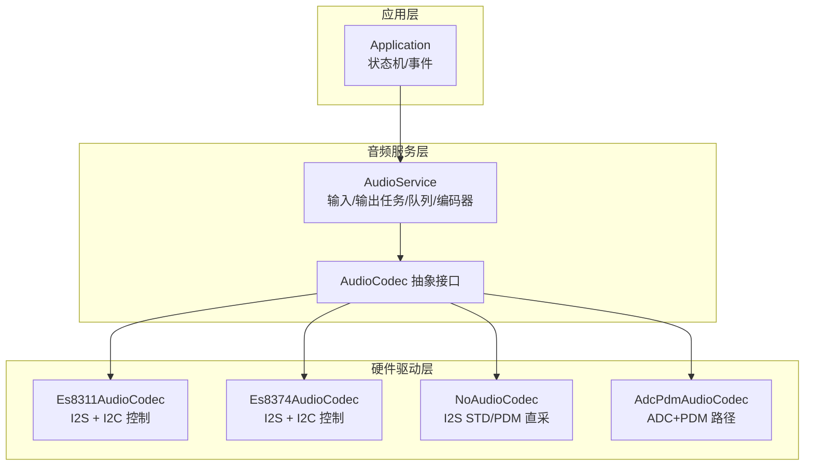
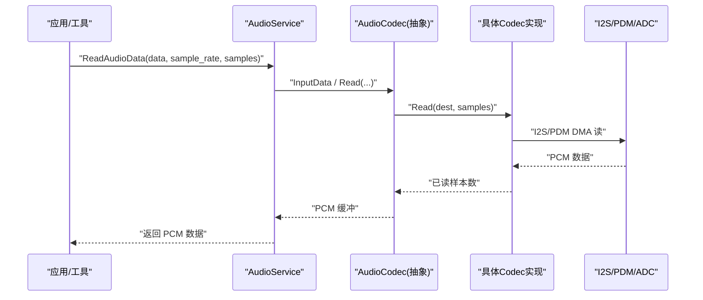
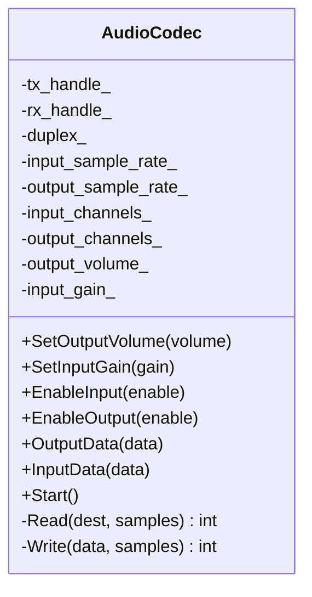
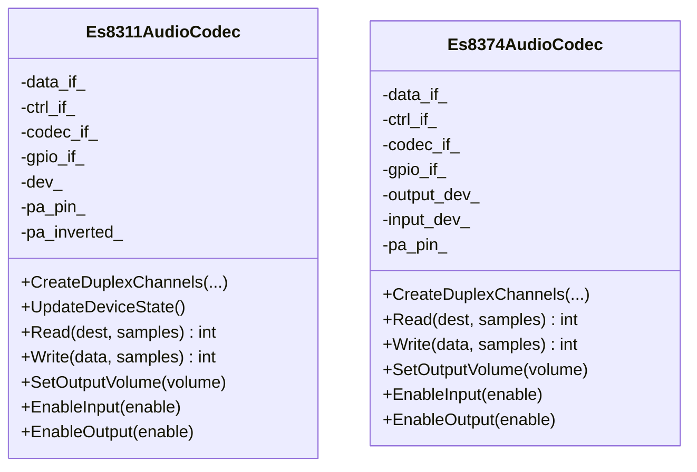
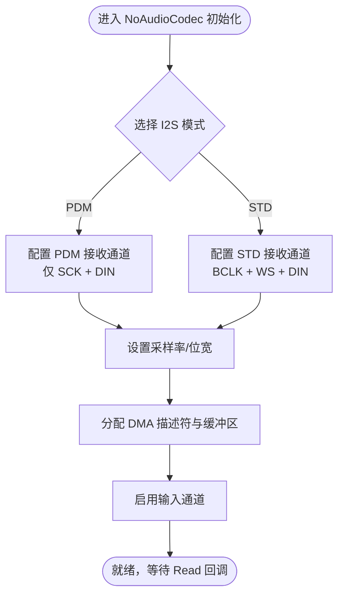
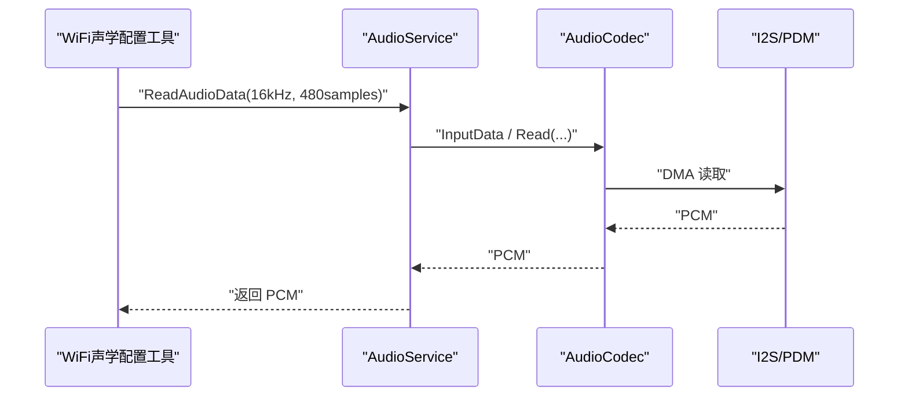
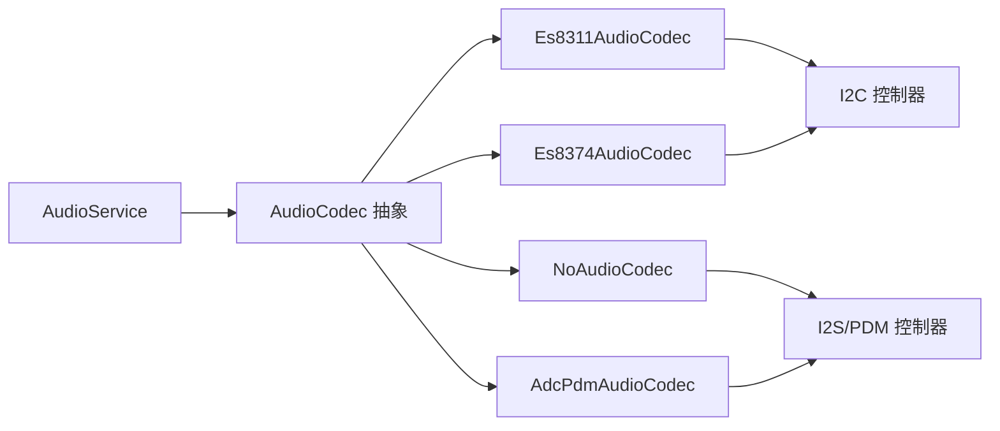

# 音频采集问题

<cite>
**本文引用的文件**   
- [audio_codec.h](file://main/audio/audio_codec.h)
- [audio_service.h](file://main/audio/audio_service.h)
- [es8311_audio_codec.h](file://main/audio/codecs/es8311_audio_codec.h)
- [es8374_audio_codec.h](file://main/audio/codecs/es8374_audio_codec.h)
- [no_audio_codec.h](file://main/audio/codecs/no_audio_codec.h)
- [no_audio_codec.cc](file://main/audio/codecs/no_audio_codec.cc)
- [adc_pdm_audio_codec.h](file://main/boards/esp-hi/adc_pdm_audio_codec.h)
- [afsk_demod.cc](file://main/boards/common/afsk_demod.cc)
- [Kconfig.projbuild](file://main/Kconfig.projbuild)
</cite>

## 目录
1. [简介](#简介)
2. [项目结构](#项目结构)
3. [核心组件](#核心组件)
4. [架构总览](#架构总览)
5. [详细组件分析](#详细组件分析)
6. [依赖关系分析](#依赖关系分析)
7. [性能与稳定性考量](#性能与稳定性考量)
8. [故障排查指南](#故障排查指南)
9. [结论](#结论)
10. [附录](#附录)

## 简介
本文件面向在 ESP32 平台上进行音频采集的工程师，聚焦“麦克风无声、录音音量过小、音频数据丢失”等典型问题的定位与修复。文档从系统架构出发，结合 I2S 接口配置、ADC/PDM 采样率设置、I2C 设备通信、编解码器差异与最佳实践，给出可操作的诊断步骤与优化建议。

## 项目结构
本项目将音频采集链路抽象为三层：
- 硬件驱动层：各板级或 Codec 驱动（如 ES8311/ES8374、PDM/ADC 直采）负责 I2S/I2C 初始化、时钟与通道配置、DMA 读写。
- 音频服务层：统一封装输入/输出任务、队列、重采样、编码（Opus）、唤醒词与 VAD 处理。
- 应用层：根据状态机控制采集开关、测试模式、AEC 策略等。

图表来源
- [audio_service.h:105-195](file://main/audio/audio_service.h#L105-L195)
- [audio_codec.h:17-59](file://main/audio/audio_codec.h#L17-L59)
- [es8311_audio_codec.h:13-40](file://main/audio/codecs/es8311_audio_codec.h#L13-L40)
- [es8374_audio_codec.h:13-39](file://main/audio/codecs/es8374_audio_codec.h#L13-L39)
- [no_audio_codec.h:10-41](file://main/audio/codecs/no_audio_codec.h#L10-L41)
- [adc_pdm_audio_codec.h:10-35](file://main/boards/esp-hi/adc_pdm_audio_codec.h#L10-L35)

章节来源
- [audio_service.h:105-195](file://main/audio/audio_service.h#L105-L195)
- [audio_codec.h:17-59](file://main/audio/audio_codec.h#L17-L59)

## 核心组件
- AudioCodec 抽象接口：定义统一的输入/输出、增益、使能、启动等能力，内部维护 I2S 句柄、采样率、声道数、音量与增益等关键参数。
- AudioService：管理输入/输出任务、队列、重采样与 Opus 编解码；提供 ReadAudioData 供上层读取 PCM 数据；支持唤醒词与 AEC 开关。
- 具体 Codec 实现：
  - ES8311/ES8374：通过 I2C 配置寄存器，使用 esp_codec_dev 框架创建双工通道，I2S 作为数据总线。
  - NoAudioCodec：直接走 I2S STD 或 PDM 模式，适用于内置 ADC/PDM 麦克风的板卡。
  - AdcPdmAudioCodec：针对特定板卡的 ADC+PDM 组合路径，包含定时器与 PA 控制。

章节来源
- [audio_codec.h:17-59](file://main/audio/audio_codec.h#L17-L59)
- [audio_service.h:105-195](file://main/audio/audio_service.h#L105-L195)
- [es8311_audio_codec.h:13-40](file://main/audio/codecs/es8311_audio_codec.h#L13-L40)
- [es8374_audio_codec.h:13-39](file://main/audio/codecs/es8374_audio_codec.h#L13-L39)
- [no_audio_codec.h:10-41](file://main/audio/codecs/no_audio_codec.h#L10-L41)
- [adc_pdm_audio_codec.h:10-35](file://main/boards/esp-hi/adc_pdm_audio_codec.h#L10-L35)

## 架构总览
下图展示一次典型的“读取麦克风 PCM”调用链：应用侧通过 AudioService::ReadAudioData 拉取数据，底层由具体 Codec 的 Read 完成 I2S/PDM 读取，再经服务层重采样与可选编码后返回。

图表来源
- [audio_service.h:130-134](file://main/audio/audio_service.h#L130-L134)
- [audio_codec.h:27-29](file://main/audio/audio_codec.h#L27-L29)
- [no_audio_codec.cc:284-289](file://main/audio/codecs/no_audio_codec.cc#L284-L289)

## 详细组件分析

### 组件一：AudioCodec 抽象与 I2S 配置要点
- 职责：屏蔽不同硬件差异，向上暴露统一的 EnableInput/EnableOutput/SetInputGain/Start 等接口；内部持有 tx/rx I2S 句柄与采样率、声道数、音量、增益等状态。
- 关键点：
  - 输入/输出采样率与声道数需与上层一致，否则会出现重采样开销或数据错位。
  - 双工模式下需确保 TX/RX 时钟同步与 DMA 描述符数量足够，避免丢帧。
  - 输入增益 SetInputGain 用于软件放大，但受限于前端硬件增益与噪声底噪。

图表来源
- [audio_codec.h:17-59](file://main/audio/audio_codec.h#L17-L59)

章节来源
- [audio_codec.h:17-59](file://main/audio/audio_codec.h#L17-L59)

### 组件二：ES8311/ES8374 编解码器（I2S + I2C）
- 职责：通过 I2C 写入寄存器配置 ADC/DAC、MCLK/BCLK/WS/DIN/DOUT 引脚与时钟分频，使用 esp_codec_dev 创建输入/输出设备并挂载到 I2S。
- 常见问题：
  - I2C 地址错误、上拉电阻缺失、I2C 速率过高导致写失败，表现为无声或间歇性断音。
  - MCLK/BCLK/WS 引脚映射错误或频率不匹配，导致采样率异常或杂音。
  - 未正确启用 MIC 输入通道或 PGA 增益过低，导致音量过小。

图表来源
- [es8311_audio_codec.h:13-40](file://main/audio/codecs/es8311_audio_codec.h#L13-L40)
- [es8374_audio_codec.h:13-39](file://main/audio/codecs/es8374_audio_codec.h#L13-L39)

章节来源
- [es8311_audio_codec.h:13-40](file://main/audio/codecs/es8311_audio_codec.h#L13-L40)
- [es8374_audio_codec.h:13-39](file://main/audio/codecs/es8374_audio_codec.h#L13-L39)

### 组件三：NoAudioCodec（I2S STD/PDM 直采）
- 职责：在不使用外部 Codec 的情况下，直接使用 SoC 的 I2S STD 或 PDM 接口读取内置 PDM 麦克风或外接数字麦克风。
- 关键点：
  - PDM 模式仅需 SCK 与 DIN，无需 WS；STD 模式需要 BCLK、WS、DIN。
  - 槽位掩码（左/右/双）需与硬件连接一致，否则出现单声道或左右反相。
  - 采样率与位宽需与上游一致，避免重采样引入延迟或失真。

图表来源
- [no_audio_codec.h:28-39](file://main/audio/codecs/no_audio_codec.h#L28-L39)
- [no_audio_codec.cc:284-289](file://main/audio/codecs/no_audio_codec.cc#L284-L289)

章节来源
- [no_audio_codec.h:28-39](file://main/audio/codecs/no_audio_codec.h#L28-L39)
- [no_audio_codec.cc:284-289](file://main/audio/codecs/no_audio_codec.cc#L284-L289)

### 组件四：AdcPdmAudioCodec（ADC+PDM 组合路径）
- 职责：适配特定板卡的 ADC 与 PDM 组合路径，包含 PA 控制与定时器机制，保证输出稳定。
- 关注点：
  - ADC 通道号与 PDM 输出极性需与原理图一致。
  - 定时器超时阈值影响播放连续性，过短可能导致卡顿。

章节来源
- [adc_pdm_audio_codec.h:10-35](file://main/boards/esp-hi/adc_pdm_audio_codec.h#L10-L35)

### 组件五：AudioService 与上层读取流程
- 职责：组织输入任务、队列、重采样与 Opus 编码；对外提供 ReadAudioData 以固定采样率和帧长拉取 PCM。
- 关键点：
  - 输入任务周期性从 Codec 读取 PCM，必要时做重采样至目标采样率。
  - 当上层请求采样率与当前不一致时，会触发重采样，增加 CPU 负载。
  - 支持唤醒词检测与 VAD 事件回调，便于上层联动。

图表来源
- [afsk_demod.cc:37-42](file://main/boards/common/afsk_demod.cc#L37-L42)
- [audio_service.h:130-134](file://main/audio/audio_service.h#L130-L134)

章节来源
- [afsk_demod.cc:37-42](file://main/boards/common/afsk_demod.cc#L37-L42)
- [audio_service.h:130-134](file://main/audio/audio_service.h#L130-L134)

## 依赖关系分析
- 模块耦合：
  - AudioService 依赖 AudioCodec 抽象，解耦了具体硬件实现。
  - 具体 Codec 依赖 esp_codec_dev 与 I2C/I2S 驱动。
- 外部依赖：
  - I2C 用于 Codec 寄存器配置。
  - I2S/PDM 用于 PCM 数据传输。
  - FreeRTOS 任务与队列用于异步采集与编码。

图表来源
- [audio_service.h:105-195](file://main/audio/audio_service.h#L105-L195)
- [audio_codec.h:17-59](file://main/audio/audio_codec.h#L17-L59)
- [es8311_audio_codec.h:13-40](file://main/audio/codecs/es8311_audio_codec.h#L13-L40)
- [es8374_audio_codec.h:13-39](file://main/audio/codecs/es8374_audio_codec.h#L13-L39)
- [no_audio_codec.h:10-41](file://main/audio/codecs/no_audio_codec.h#L10-L41)
- [adc_pdm_audio_codec.h:10-35](file://main/boards/esp-hi/adc_pdm_audio_codec.h#L10-L35)

章节来源
- [audio_service.h:105-195](file://main/audio/audio_service.h#L105-L195)
- [audio_codec.h:17-59](file://main/audio/audio_codec.h#L17-L59)

## 性能与稳定性考量
- 采样率一致性：尽量保持 Codec 输入采样率与上层期望一致，减少重采样带来的 CPU 占用与延迟抖动。
- DMA 描述符与帧大小：适当增大 DMA 描述符数量与每帧样本数可降低中断频率，提升吞吐，但会增加端到端延迟。
- 队列深度：发送/解码队列长度需兼顾实时性与内存占用，过大可能引起突发延迟。
- 功耗与性能模式：连接音频通道前切换到高性能模式可减少卡顿。

章节来源
- [audio_service.h:39-76](file://main/audio/audio_service.h#L39-L76)
- [application.cc:713-730](file://main/application.cc#L713-L730)

## 故障排查指南

### 现象一：麦克风无声
- 可能原因
  - I2C 通信失败：Codec 未初始化成功，寄存器未生效。
  - I2S 引脚/时钟配置错误：BCLK/WS/MCLK 未对齐或频率不正确。
  - 输入通道未启用或 PGA 增益过低。
  - PDM 模式误配为 STD 或反之。
- 诊断步骤
  - 检查 I2C 设备通信：确认 I2C 地址、上拉电阻、速率与引脚；尝试读取 Codec 版本寄存器验证连通性。
  - 验证 I2S 配置：核对 MCLK/BCLK/WS/DIN 引脚映射与采样率；在双工模式下确认 TX/RX 同步。
  - 启用输入通道并适度提高输入增益，观察是否有数据。
  - 若使用 PDM，确认仅配置 SCK 与 DIN，且无 WS。
- 参考位置
  - [es8311_audio_codec.h:13-40](file://main/audio/codecs/es8311_audio_codec.h#L13-L40)
  - [es8374_audio_codec.h:13-39](file://main/audio/codecs/es8374_audio_codec.h#L13-L39)
  - [no_audio_codec.h:28-39](file://main/audio/codecs/no_audio_codec.h#L28-L39)
  - [no_audio_codec.cc:284-289](file://main/audio/codecs/no_audio_codec.cc#L284-L289)

### 现象二：录音音量过小
- 可能原因
  - 前端硬件增益不足（PGA/AGC）。
  - 软件输入增益未开启或过小。
  - 输入通道选择错误（例如选择了线路输入而非麦克风）。
- 诊断步骤
  - 逐步提高 SetInputGain，观察波形幅度变化。
  - 检查 Codec 的 MIC 输入路径与 PGA 设置。
  - 对比不同环境声源，排除物理遮挡或距离过远。
- 参考位置
  - [audio_codec.h:22-24](file://main/audio/audio_codec.h#L22-L24)
  - [es8311_audio_codec.h:37-39](file://main/audio/codecs/es8311_audio_codec.h#L37-L39)
  - [es8374_audio_codec.h:36-38](file://main/audio/codecs/es8374_audio_codec.h#L36-L38)

### 现象三：音频数据丢失/卡顿
- 可能原因
  - DMA 描述符不足或帧大小不合适，导致溢出。
  - 上层采样率与底层不一致，频繁重采样引发 CPU 峰值。
  - 任务优先级或调度不当，输入任务被抢占。
- 诊断步骤
  - 增大 DMA 描述符数量与每帧样本数，降低中断频率。
  - 统一采样率，避免运行时重采样。
  - 在打开音频通道前切换到高性能模式，减少系统抖动。
- 参考位置
  - [audio_codec.h:14-16](file://main/audio/audio_codec.h#L14-L16)
  - [audio_service.h:39-76](file://main/audio/audio_service.h#L39-L76)
  - [application.cc:713-730](file://main/application.cc#L713-L730)

### 通用检查清单
- I2C 设备通信
  - 确认地址、上拉、速率与引脚；读取设备 ID 验证连通性。
- I2S 配置参数
  - 校验 MCLK/BCLK/WS/DIN 引脚与采样率；PDM 模式仅用 SCK+DIN。
- 输入通道与增益
  - 启用 MIC 输入，合理设置 PGA 与软件增益。
- 采样率与帧长
  - 保持上下层一致，避免重采样；合理设置 OPUS 帧时长与队列长度。
- 调试与观测
  - 使用 AudioDebugger 或 UDP 导出 PCM 波形辅助定位。
  - 在 WiFi 声学配置模式下，通过 ReadAudioData 拉取固定帧长数据进行离线分析。

章节来源
- [Kconfig.projbuild:945-979](file://main/Kconfig.projbuild#L945-L979)
- [afsk_demod.cc:37-42](file://main/boards/common/afsk_demod.cc#L37-L42)
- [audio_service.h:130-134](file://main/audio/audio_service.h#L130-L134)

## 结论
音频采集问题通常源于“配置—通信—数据流”三个层面的偏差。优先验证 I2C 通信与 I2S/PDM 配置，其次校准输入通道与增益，最后优化采样率一致性与 DMA/队列参数。结合 AudioService 的统一接口与调试工具，可快速定位并修复大多数采集异常。

## 附录
- 不同编解码器的采集配置差异与最佳实践
  - ES8311/ES8374：通过 I2C 配置 ADC 路径与 PGA，注意 MCLK/BCLK/WS 同步；双工模式下确保 TX/RX 时钟一致。
  - NoAudioCodec（PDM/STD）：PDM 只需 SCK+DIN，STD 需 BCLK+WS+DIN；槽位掩码与硬件一致。
  - AdcPdmAudioCodec：遵循板卡原理图的 ADC 通道与 PDM 极性，合理设置定时器超时。
- 常用参数建议
  - 采样率：16kHz（语音场景），位宽 16bit，单声道。
  - OPUS 帧时长：60ms 平衡带宽与延迟；VBR 开启，DTX 开启以降低静默带宽。
  - DMA 描述符：6~8；每帧样本：240（对应 15ms@16kHz），可根据延迟需求调整。

章节来源
- [audio_service.h:65-76](file://main/audio/audio_service.h#L65-L76)
- [audio_codec.h:14-16](file://main/audio/audio_codec.h#L14-L16)
- [no_audio_codec.h:28-39](file://main/audio/codecs/no_audio_codec.h#L28-L39)
- [adc_pdm_audio_codec.h:16-22](file://main/boards/esp-hi/adc_pdm_audio_codec.h#L16-L22)