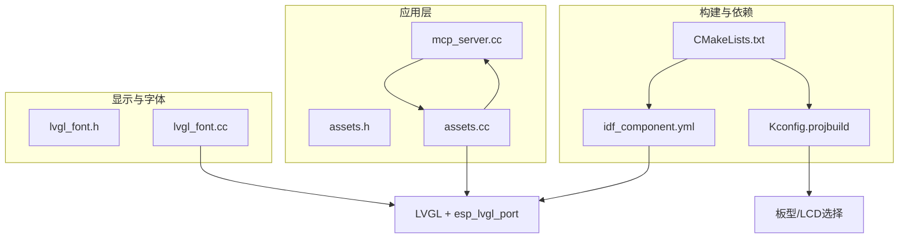
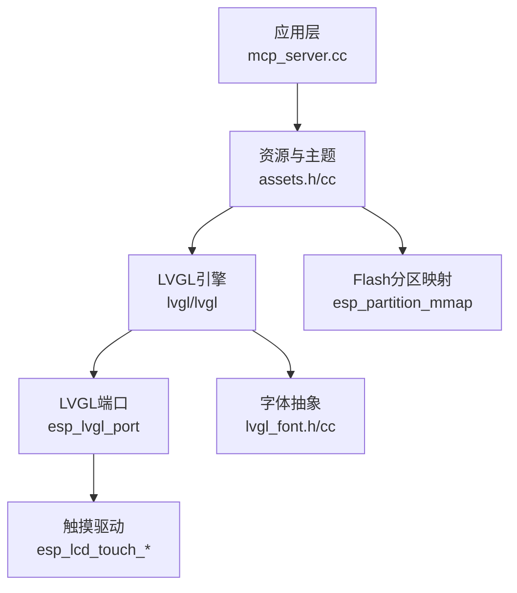
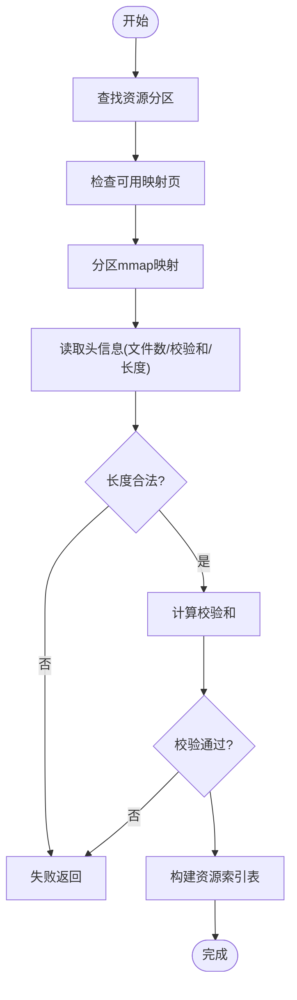
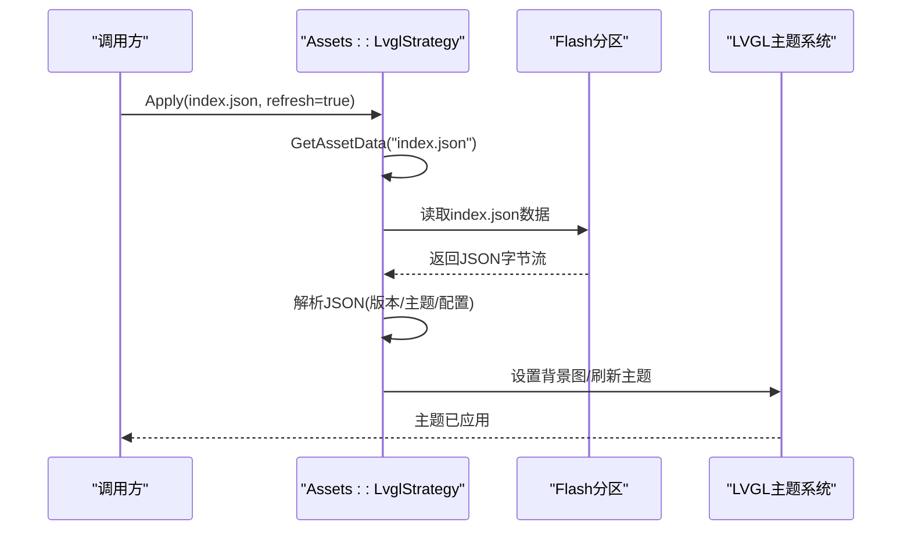
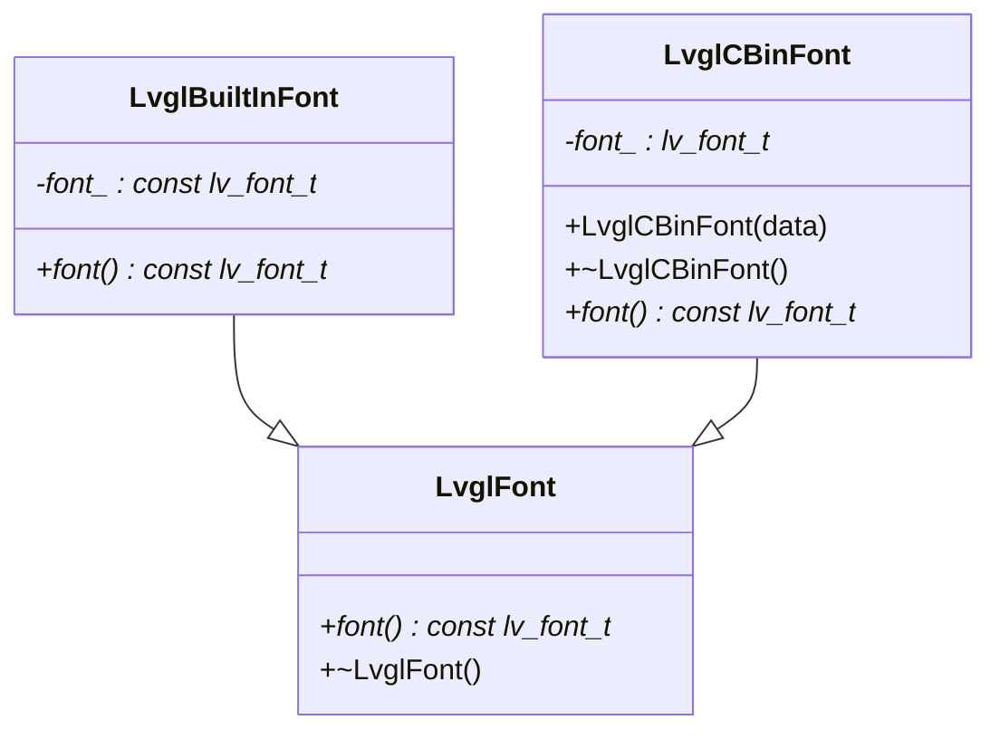
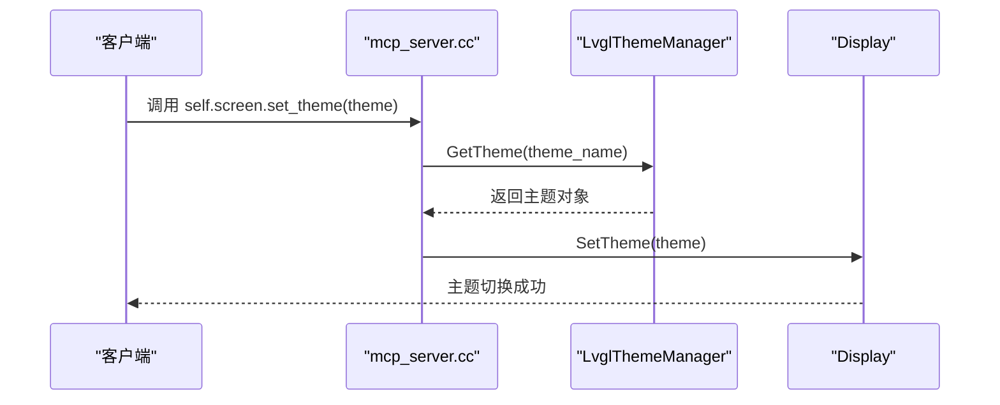
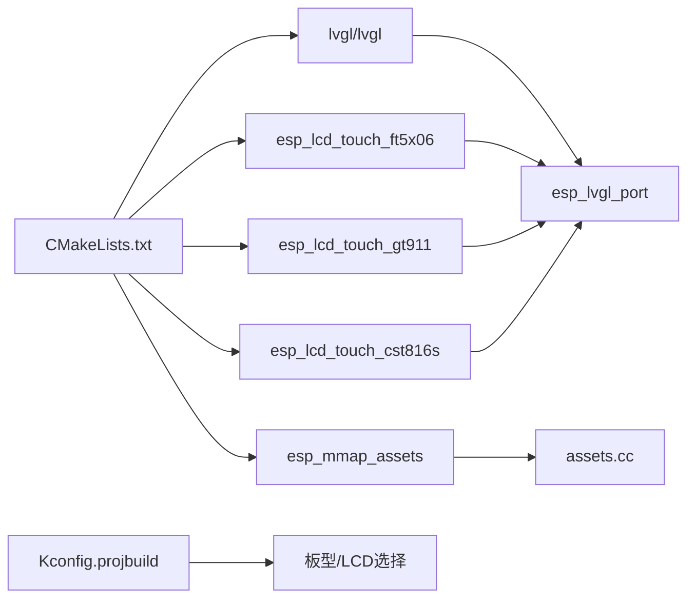

# LVGL图形库集成

<cite>
**本文引用的文件**   
- [main/CMakeLists.txt](file://main/CMakeLists.txt)
- [main/idf_component.yml](file://main/idf_component.yml)
- [main/Kconfig.projbuild](file://main/Kconfig.projbuild)
- [main/assets.h](file://main/assets.h)
- [main/assets.cc](file://main/assets.cc)
- [main/mcp_server.cc](file://main/mcp_server.cc)
- [main/display/lvgl_display/lvgl_font.h](file://main/display/lvgl_display/lvgl_font.h)
- [main/display/lvgl_display/lvgl_font.cc](file://main/display/lvgl_display/lvgl_font.cc)
</cite>

## 目录
1. [简介](#简介)
2. [项目结构](#项目结构)
3. [核心组件](#核心组件)
4. [架构总览](#架构总览)
5. [详细组件分析](#详细组件分析)
6. [依赖关系分析](#依赖关系分析)
7. [性能考虑](#性能考虑)
8. [故障排查指南](#故障排查指南)
9. [结论](#结论)
10. [附录](#附录)

## 简介
本技术文档面向在ESP32平台上集成LVGL图形库的开发者，围绕以下目标展开：
- 配置与初始化流程：包括内存管理、显示驱动适配、触摸输入处理。
- LVGL对象模型、事件系统、动画机制在本工程中的使用方式与扩展点。
- 字体渲染优化、图片资源管理、内存使用策略。
- UI组件定制与扩展：自定义控件开发、样式主题系统。
- 性能调优技巧与调试方法，提供完整的集成解决方案。

## 项目结构
本项目采用分层与模块化组织方式：
- 顶层构建与依赖：通过CMake与idf_component.yml声明LVGL及其端口、触摸驱动等组件依赖。
- 板级抽象与Kconfig：通过Kconfig定义多种LCD/触摸面板选项，便于按板型选择驱动。
- 资源与主题：Assets模块负责将打包的资源（如index.json、背景图、字体）映射到内存并应用到LVGL主题。
- 显示与字体：display/lvgl_display下封装了LVGL字体加载与管理逻辑。
- 运行时控制：MCP服务暴露工具接口，支持动态切换屏幕主题等。

图表来源
- [main/CMakeLists.txt:1047-1071](file://main/CMakeLists.txt#L1047-L1071)
- [main/idf_component.yml:59-64](file://main/idf_component.yml#L59-L64)
- [main/Kconfig.projbuild:739-783](file://main/Kconfig.projbuild#L739-L783)

章节来源
- [main/CMakeLists.txt:1047-1071](file://main/CMakeLists.txt#L1047-L1071)
- [main/idf_component.yml:59-64](file://main/idf_component.yml#L59-L64)
- [main/Kconfig.projbuild:739-783](file://main/Kconfig.projbuild#L739-L783)

## 核心组件
- LVGL与端口依赖
  - 通过idf_component.yml引入lvgl/lvgl与esp_lvgl_port，用于在ESP-IDF上运行LVGL并提供显示/触摸端口能力。
  - 同时引入多种触摸驱动（如ft5x06、gt911、cst816s等），便于不同触控IC适配。
- 资源与主题系统
  - assets.h/cc实现资源分区映射、索引解析、主题应用与刷新，支持根据index.json动态设置背景图、隐藏副标题等。
- 字体子系统
  - lvgl_font.h/cc定义了统一字体抽象LvglFont，内置字体与二进制字体两种实现，便于按需加载与释放。
- 运行时主题控制
  - mcp_server.cc暴露“self.screen.set_theme”工具，允许外部调用切换亮/暗主题。

章节来源
- [main/idf_component.yml:54-64](file://main/idf_component.yml#L54-L64)
- [main/assets.h:49-78](file://main/assets.h#L49-L78)
- [main/assets.cc:130-229](file://main/assets.cc#L130-L229)
- [main/assets.cc:214-358](file://main/assets.cc#L214-L358)
- [main/display/lvgl_display/lvgl_font.h:6-31](file://main/display/lvgl_display/lvgl_font.h#L6-L31)
- [main/display/lvgl_display/lvgl_font.cc:5-13](file://main/display/lvgl_display/lvgl_font.cc#L5-L13)
- [main/mcp_server.cc:80-98](file://main/mcp_server.cc#L80-L98)

## 架构总览
下图展示了LVGL在工程中的关键集成点：组件依赖、资源映射、主题应用与运行时控制。

图表来源
- [main/idf_component.yml:59-64](file://main/idf_component.yml#L59-L64)
- [main/assets.cc:130-229](file://main/assets.cc#L130-L229)
- [main/mcp_server.cc:80-98](file://main/mcp_server.cc#L80-L98)
- [main/display/lvgl_display/lvgl_font.h:6-31](file://main/display/lvgl_display/lvgl_font.h#L6-L31)

## 详细组件分析

### 资源与主题系统（Assets）
- 功能要点
  - 分区映射：查找并映射资源分区，校验头部长度与校验和，建立资源名到偏移/大小的索引表。
  - 数据访问：通过GetAssetData获取指定资源的指针与大小，并进行魔数校验。
  - 主题应用：解析index.json，加载背景图等资源，必要时刷新当前显示的主题；支持读取hide_subtitle配置以调整UI布局。
- 关键流程
  - InitializePartition：检查可用映射页、执行mmap、计算并比对校验和、构建资源索引。
  - Apply：读取index.json，解析版本与主题相关字段，更新背景图与显示配置。
  - UnApplyPartition：释放映射句柄与索引表。

图表来源
- [main/assets.cc:130-185](file://main/assets.cc#L130-L185)

图表来源
- [main/assets.cc:214-358](file://main/assets.cc#L214-L358)

章节来源
- [main/assets.h:49-78](file://main/assets.h#L49-L78)
- [main/assets.cc:130-229](file://main/assets.cc#L130-L229)
- [main/assets.cc:214-358](file://main/assets.cc#L214-L358)

### 字体子系统（LvglFont）
- 设计要点
  - 抽象基类：统一font()接口，屏蔽具体字体来源差异。
  - 内置字体：直接持有lv_font_t指针，适用于静态或编译期字体。
  - 二进制字体：基于cbin_font_create/delete生命周期管理，适合从资源中加载的字体。
- 使用建议
  - 优先使用二进制字体以减少RAM占用，按需创建与销毁。
  - 结合Assets策略加载字体资源，避免重复加载。

图表来源
- [main/display/lvgl_display/lvgl_font.h:6-31](file://main/display/lvgl_display/lvgl_font.h#L6-L31)
- [main/display/lvgl_display/lvgl_font.cc:5-13](file://main/display/lvgl_display/lvgl_font.cc#L5-L13)

章节来源
- [main/display/lvgl_display/lvgl_font.h:6-31](file://main/display/lvgl_display/lvgl_font.h#L6-L31)
- [main/display/lvgl_display/lvgl_font.cc:5-13](file://main/display/lvgl_display/lvgl_font.cc#L5-L13)

### 运行时主题控制（MCP工具）
- 功能要点
  - 暴露“self.screen.set_theme”工具，接受theme参数（light/dark）。
  - 通过LvglThemeManager获取对应主题，并调用Display的SetTheme进行切换。
- 适用场景
  - 远程或脚本化控制界面主题，配合Assets主题资源实现动态换肤。

图表来源
- [main/mcp_server.cc:80-98](file://main/mcp_server.cc#L80-L98)

章节来源
- [main/mcp_server.cc:80-98](file://main/mcp_server.cc#L80-L98)

## 依赖关系分析
- 组件依赖
  - LVGL与端口：lvgl/lvgl与esp_lvgl_port为图形渲染与I/O桥接的核心。
  - 触摸驱动：多个esp_lcd_touch_*组件覆盖常见触控IC，便于按板型启用。
  - 资源映射：esp_mmap_assets用于高效访问Flash中的资源包。
- 构建与配置
  - CMake注册主程序源文件与包含路径，条件编译特定芯片平台相关代码。
  - Kconfig提供大量LCD类型与板型选择，影响最终链接的驱动与引脚配置。

图表来源
- [main/idf_component.yml:54-64](file://main/idf_component.yml#L54-L64)
- [main/CMakeLists.txt:1047-1071](file://main/CMakeLists.txt#L1047-L1071)
- [main/Kconfig.projbuild:739-783](file://main/Kconfig.projbuild#L739-L783)

章节来源
- [main/idf_component.yml:54-64](file://main/idf_component.yml#L54-L64)
- [main/CMakeLists.txt:1047-1071](file://main/CMakeLists.txt#L1047-L1071)
- [main/Kconfig.projbuild:739-783](file://main/Kconfig.projbuild#L739-L783)

## 性能考虑
- 内存与映射
  - 使用分区映射（mmap）直接访问Flash资源，减少RAM拷贝与峰值占用。
  - 初始化前检查可用映射页数量，确保资源分区可被安全映射。
- 资源体积与加载
  - 优先使用压缩或二进制格式资源（如cbin字体），按需加载与释放。
  - 合理拆分资源包，避免单次加载过大导致卡顿。
- 显示与刷新
  - 利用LVGL双缓冲与脏矩形刷新，降低总线带宽压力。
  - 针对大尺寸屏，适当降低刷新频率或在低负载时提升帧率。
- 触摸与事件
  - 选择合适的触摸驱动与采样率，平衡响应性与功耗。
  - 合并多次触摸事件，减少LVGL事件队列压力。

[本节为通用指导，不直接分析具体文件]

## 故障排查指南
- 资源分区映射失败
  - 现象：初始化阶段报错或无法找到index.json。
  - 排查：确认分区大小与可用映射页是否足够；检查分区校验和与长度字段；验证资源包生成是否正确。
  - 参考路径：InitializePartition、GetAssetData、Apply。
- 主题未生效
  - 现象：切换主题后界面无变化。
  - 排查：确认index.json中包含对应主题资源；检查refresh_display_theme参数；验证Display的SetTheme调用链。
  - 参考路径：Apply、mcp_server.cc主题工具。
- 字体显示异常
  - 现象：字符缺失或乱码。
  - 排查：确认字体资源已正确加载；检查cbin字体生命周期；避免重复创建与提前释放。
  - 参考路径：LvglCBinFont构造/析构。

章节来源
- [main/assets.cc:130-229](file://main/assets.cc#L130-L229)
- [main/assets.cc:214-358](file://main/assets.cc#L214-L358)
- [main/mcp_server.cc:80-98](file://main/mcp_server.cc#L80-L98)
- [main/display/lvgl_display/lvgl_font.cc:5-13](file://main/display/lvgl_display/lvgl_font.cc#L5-L13)

## 结论
通过在ESP32平台上集成LVGL与esp_lvgl_port，并结合资源映射与主题系统，本项目实现了高效的图形渲染与灵活的UI主题切换。借助Kconfig与idf_component.yml的灵活配置，开发者可按板型快速适配LCD与触摸驱动。在资源与字体管理方面，采用分区映射与二进制字体显著降低了RAM占用并提升了启动速度。运行时通过MCP工具暴露主题切换接口，增强了系统的可维护性与可扩展性。

[本节为总结性内容，不直接分析具体文件]

## 附录
- 常用配置项
  - LCD类型与分辨率：通过Kconfig选择具体驱动与尺寸。
  - 触摸驱动：根据触控IC选择对应组件。
  - 资源包：确保index.json与资源文件一致，校验和正确。
- 扩展建议
  - 自定义控件：基于LVGL对象模型继承扩展，复用现有样式与事件框架。
  - 主题系统：在Assets中增加更多主题资源，并通过MCP工具暴露切换接口。
  - 性能监控：统计LVGL帧率、内存占用与触摸延迟，持续优化。

[本节为补充说明，不直接分析具体文件]