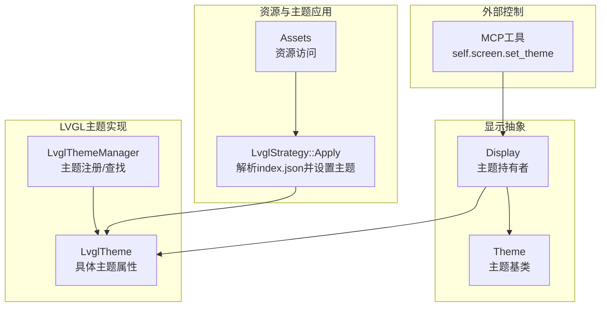
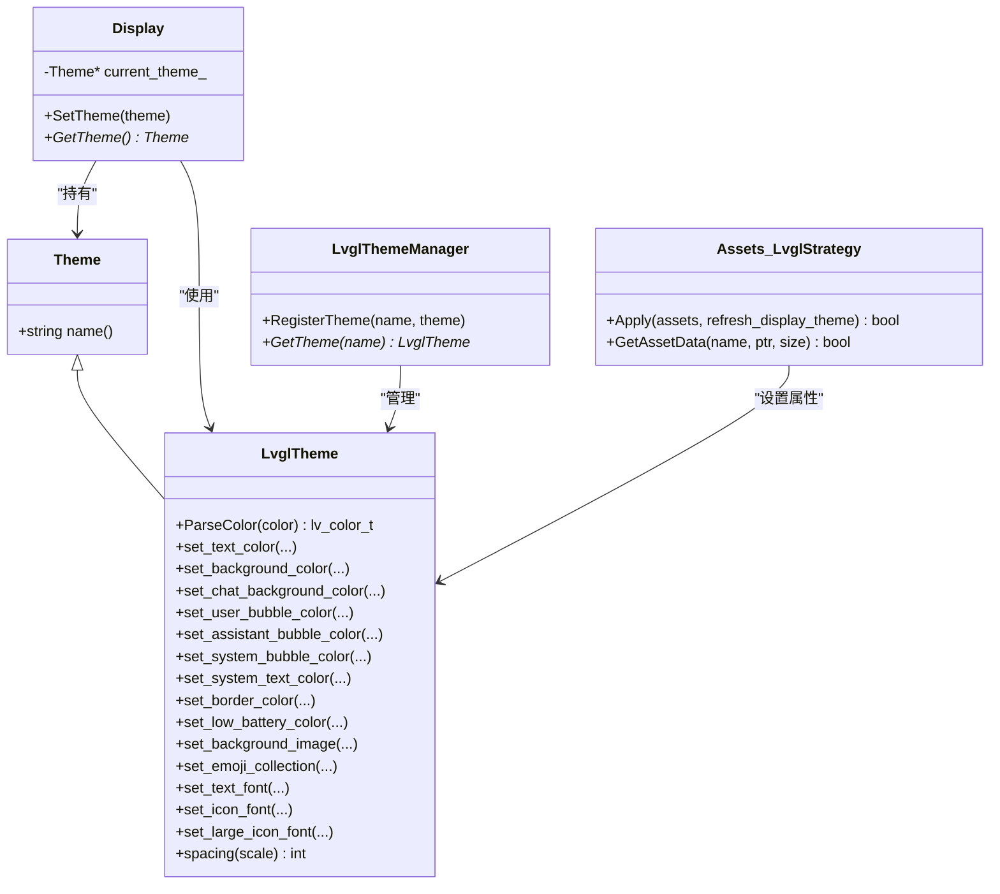
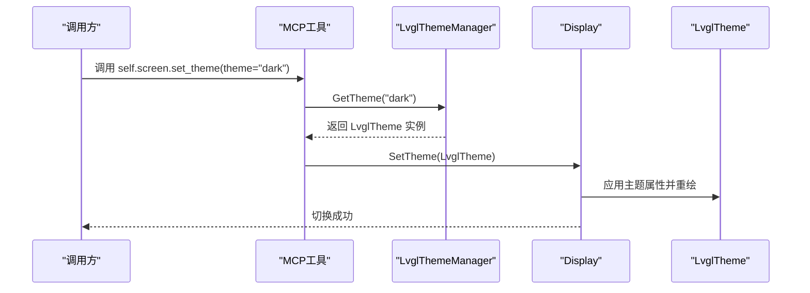
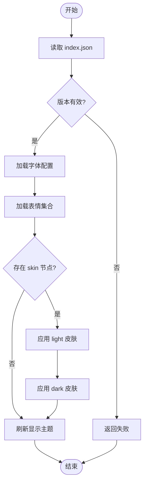
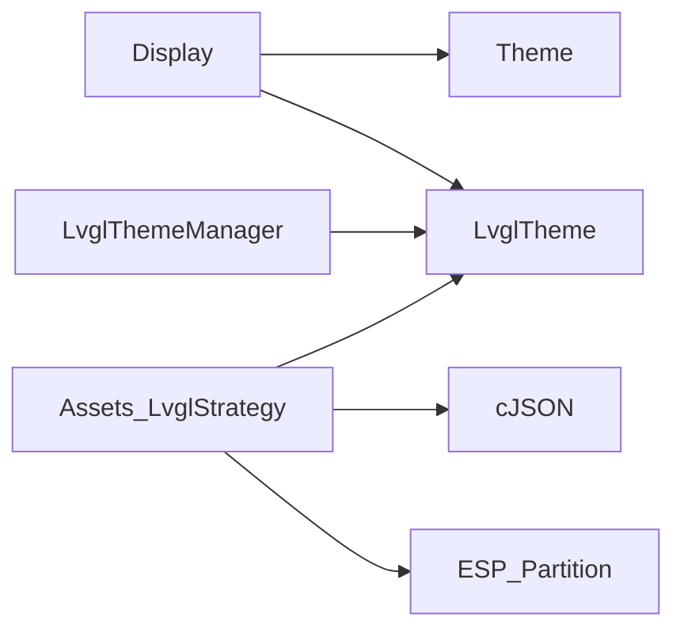

# UI主题系统

<cite>
**本文引用的文件**   
- [lvgl_theme.h](file://main/display/lvgl_display/lvgl_theme.h)
- [lvgl_theme.cc](file://main/display/lvgl_display/lvgl_theme.cc)
- [display.h](file://main/display/display.h)
- [assets.h](file://main/assets.h)
- [assets.cc](file://main/assets.cc)
- [mcp_server.cc](file://main/mcp_server.cc)
</cite>

## 目录
1. [简介](#简介)
2. [项目结构](#项目结构)
3. [核心组件](#核心组件)
4. [架构总览](#架构总览)
5. [详细组件分析](#详细组件分析)
6. [依赖分析](#依赖分析)
7. [性能考虑](#性能考虑)
8. [故障排查指南](#故障排查指南)
9. [结论](#结论)
10. [附录](#附录)

## 简介
本技术文档围绕UI主题系统展开，重点阐述Theme类的设计模式与主题管理机制，包括主题切换、样式继承、动态更新；详细说明颜色方案、字体配置、布局参数的主题化实现；覆盖预置主题（深色/浅色）设计与扩展方法；提供自定义主题的创建指南（主题文件结构、样式定义语法、资源管理策略），并给出兼容性处理与版本迁移建议，帮助开发者构建完整的主题定制解决方案。

## 项目结构
与UI主题系统直接相关的代码主要分布在以下模块：
- 显示抽象层：定义通用主题接口与显示基类
- LVGL主题实现：基于LVGL的颜色解析、主题对象与管理器
- 资源加载与主题应用：从分区映射的index.json中解析主题皮肤、字体、表情等，并应用到当前主题
- 外部控制入口：通过MCP工具在运行时切换主题

图表来源
- [display.h:18-61](file://main/display/display.h#L18-L61)
- [lvgl_theme.h:14-95](file://main/display/lvgl_display/lvgl_theme.h#L14-L95)
- [assets.h:48-78](file://main/assets.h#L48-L78)
- [assets.cc:214-358](file://main/assets.cc#L214-L358)
- [mcp_server.cc:80-98](file://main/mcp_server.cc#L80-L98)

章节来源
- [display.h:18-61](file://main/display/display.h#L18-L61)
- [lvgl_theme.h:14-95](file://main/display/lvgl_display/lvgl_theme.h#L14-L95)
- [assets.h:48-78](file://main/assets.h#L48-L78)
- [assets.cc:214-358](file://main/assets.cc#L214-L358)
- [mcp_server.cc:80-98](file://main/mcp_server.cc#L80-L98)

## 核心组件
- Theme基类：为所有主题提供统一名称标识与生命周期管理，作为显示对象的当前主题持有者。
- LvglTheme：具体主题实现，封装颜色、背景图、字体、表情集合、间距等可主题化的属性，并提供颜色字符串解析。
- LvglThemeManager：单例管理器，负责主题注册与按名称检索，支撑“light/dark”等命名主题。
- Display：显示抽象，持有当前主题指针，提供SetTheme/GetTheme接口，刷新时可将新主题应用到界面。
- Assets/LvglStrategy：从分区映射的index.json读取主题皮肤、字体、表情等资源，并调用主题setter完成动态更新。
- MCP工具：暴露运行时API以切换主题，便于调试或远程配置。

章节来源
- [display.h:18-61](file://main/display/display.h#L18-L61)
- [lvgl_theme.h:14-95](file://main/display/lvgl_display/lvgl_theme.h#L14-L95)
- [lvgl_theme.cc:1-31](file://main/display/lvgl_display/lvgl_theme.cc#L1-L31)
- [assets.h:48-78](file://main/assets.h#L48-L78)
- [assets.cc:214-358](file://main/assets.cc#L214-L358)
- [mcp_server.cc:80-98](file://main/mcp_server.cc#L80-L98)

## 架构总览
主题系统采用“抽象+具体实现+管理器+资源装配”的分层设计：
- 抽象层：Theme/Display定义最小契约，屏蔽底层渲染差异。
- 实现层：LvglTheme承载LVGL相关属性，LvglThemeManager维护主题字典。
- 资源层：Assets.LvglStrategy解析index.json，将skin、fonts、emoji_collection等装配到主题。
- 控制层：MCP工具通过主题名触发切换，Display.SetTheme完成重绘。

图表来源
- [display.h:18-61](file://main/display/display.h#L18-L61)
- [lvgl_theme.h:14-95](file://main/display/lvgl_display/lvgl_theme.h#L14-L95)
- [assets.h:57-69](file://main/assets.h#L57-L69)
- [assets.cc:214-358](file://main/assets.cc#L214-L358)

## 详细组件分析

### 主题模型与属性（LvglTheme）
- 颜色体系：背景、文本、聊天背景、用户/助手/系统气泡、边框、低电量提示等，均以LVGL颜色类型存储，支持十六进制字符串解析。
- 背景图像：支持二进制图片资源引用，由资源层加载后注入主题。
- 字体配置：文本字体、图标字体、大图标字体，分别对应不同层级与场景。
- 表情集合：支持自定义表情包，同时应用于浅色/深色主题。
- 布局参数：统一的间距缩放因子，供控件布局计算。

章节来源
- [lvgl_theme.h:14-76](file://main/display/lvgl_display/lvgl_theme.h#L14-L76)
- [lvgl_theme.cc:6-15](file://main/display/lvgl_display/lvgl_theme.cc#L6-L15)

### 主题管理与切换（LvglThemeManager + Display）
- 注册与查找：通过管理器集中注册主题实例，并按名称检索。
- 切换流程：外部请求获取主题实例后，交由Display.SetTheme应用，随后触发界面刷新。
- 默认主题：管理器内部预留初始化默认主题的能力，便于内置light/dark主题。

图表来源
- [mcp_server.cc:80-98](file://main/mcp_server.cc#L80-L98)
- [lvgl_theme.h:79-95](file://main/display/lvgl_display/lvgl_theme.h#L79-L95)
- [display.h:39-41](file://main/display/display.h#L39-L41)

章节来源
- [lvgl_theme.h:79-95](file://main/display/lvgl_display/lvgl_theme.h#L79-L95)
- [lvgl_theme.cc:20-30](file://main/display/lvgl_display/lvgl_theme.cc#L20-L30)
- [display.h:39-41](file://main/display/display.h#L39-L41)
- [mcp_server.cc:80-98](file://main/mcp_server.cc#L80-L98)

### 资源装配与动态更新（Assets.LvglStrategy）
- 索引解析：从分区映射读取index.json，校验版本与完整性。
- 字体加载：根据配置加载文本/图标字体，并注入主题。
- 表情集合：解析emoji_collection数组，加载对应图片资源并绑定至主题。
- 皮肤配置：解析skin.light/skin.dark，设置文本色、背景色、背景图等。
- 动态刷新：若启用refresh_display_theme，则重新应用当前主题，确保界面即时生效。

图表来源
- [assets.cc:214-358](file://main/assets.cc#L214-L358)
- [assets.h:57-69](file://main/assets.h#L57-L69)

章节来源
- [assets.cc:214-358](file://main/assets.cc#L214-L358)
- [assets.h:57-69](file://main/assets.h#L57-L69)

### 颜色解析与样式继承
- 颜色解析：支持十六进制格式（如#RRGGBB），转换为LVGL颜色类型；非法格式回退为黑色。
- 样式继承：通过skin.light/skin.dark分别覆盖基础属性，未显式设置的属性保持默认值，形成“基础主题+皮肤覆盖”的继承关系。

章节来源
- [lvgl_theme.cc:6-15](file://main/display/lvgl_display/lvgl_theme.cc#L6-L15)
- [assets.cc:289-333](file://main/assets.cc#L289-L333)

### 字体与布局参数
- 字体：文本字体、图标字体、大图标字体分别用于消息正文、状态图标、大型图标展示。
- 布局：统一的间距缩放因子，便于在不同屏幕密度下保持一致的视觉节奏。

章节来源
- [lvgl_theme.h:32-35](file://main/display/lvgl_display/lvgl_theme.h#L32-L35)
- [assets.cc:256-260](file://main/assets.cc#L256-L260)

### 预置主题与扩展方法
- 预置主题：管理器预留初始化默认主题能力，通常包含light/dark两套。
- 扩展方式：
  - 新增主题：构造LvglTheme实例，设置所需属性，并通过管理器注册。
  - 皮肤覆盖：在index.json中为light/dark分别定义skin，按需覆盖颜色与背景图。
  - 运行时切换：通过MCP工具按名称切换主题，无需重启。

章节来源
- [lvgl_theme.h:79-95](file://main/display/lvgl_display/lvgl_theme.h#L79-L95)
- [mcp_server.cc:80-98](file://main/mcp_server.cc#L80-L98)

## 依赖分析
- 组件耦合：
  - Display仅依赖Theme抽象，避免与具体渲染库强耦合。
  - LvglThemeManager与LvglTheme为紧耦合，但职责单一，易于替换。
  - Assets.LvglStrategy对主题属性setter有直接依赖，属于装配层，变更影响面可控。
- 外部依赖：
  - LVGL：颜色类型、绘图与字体接口。
  - cJSON：解析index.json。
  - ESP分区映射：零拷贝读取资源。

图表来源
- [display.h:18-61](file://main/display/display.h#L18-L61)
- [lvgl_theme.h:14-95](file://main/display/lvgl_display/lvgl_theme.h#L14-L95)
- [assets.h:57-69](file://main/assets.h#L57-L69)
- [assets.cc:214-358](file://main/assets.cc#L214-L358)

章节来源
- [display.h:18-61](file://main/display/display.h#L18-L61)
- [lvgl_theme.h:14-95](file://main/display/lvgl_display/lvgl_theme.h#L14-L95)
- [assets.h:57-69](file://main/assets.h#L57-L69)
- [assets.cc:214-358](file://main/assets.cc#L214-L358)

## 性能考虑
- 零拷贝资源访问：通过分区映射直接读取index.json与资源数据，减少内存占用与拷贝开销。
- 增量更新：仅在需要时刷新显示主题，避免不必要的重绘。
- 颜色解析缓存：可在高频路径中对常用颜色进行缓存，降低重复解析成本。
- 字体与图片复用：同一字体/图片被多个主题共享时，应确保只加载一次并在主题间复用。

[本节为通用性能建议，不直接分析具体文件]

## 故障排查指南
- 主题切换无效
  - 检查MCP工具传入的主题名是否正确，确认管理器已注册该主题。
  - 确认Display.GetTheme返回非空，且SetTheme调用成功。
- 皮肤未生效
  - 验证index.json中skin.light/skin.dark字段是否存在且键名正确。
  - 检查背景图片路径是否能在资源系统中找到。
- 颜色异常
  - 确认颜色字符串格式为十六进制，否则可能回退为默认色。
- 字体/表情缺失
  - 核对index.json中的字体与表情集合配置，确保对应文件存在于资源分区。

章节来源
- [mcp_server.cc:80-98](file://main/mcp_server.cc#L80-L98)
- [assets.cc:289-358](file://main/assets.cc#L289-L358)
- [lvgl_theme.cc:6-15](file://main/display/lvgl_display/lvgl_theme.cc#L6-L15)

## 结论
本UI主题系统通过清晰的抽象与分层设计，实现了跨渲染层的主题管理能力。LvglTheme聚焦于LVGL相关属性，Assets.LvglStrategy负责资源装配，Display统一管理当前主题，MCP提供运行时切换入口。配合skin.light/skin.dark的皮肤覆盖机制，开发者可以便捷地实现深浅色主题与个性化定制。建议在后续迭代中引入更多主题属性（如阴影、圆角、动效）与更完善的版本兼容策略，以提升系统的可扩展性与可维护性。

[本节为总结性内容，不直接分析具体文件]

## 附录

### 自定义主题创建指南
- 主题文件结构（index.json关键节点）
  - version：资源包版本号，用于兼容性校验。
  - fonts：文本与图标字体配置，指定字体文件名。
  - emoji_collection：自定义表情列表，包含name与file字段。
  - skin：包含light与dark两个子对象，分别定义文本色、背景色、背景图等。
- 样式定义语法
  - 颜色：十六进制字符串（如#RRGGBB）。
  - 图片：资源文件名，需存在于资源分区并可被GetAssetData访问。
  - 字体：字体文件名，需在构建期打包进资源分区。
- 资源管理策略
  - 使用分区映射零拷贝读取，避免频繁分配与拷贝。
  - 对大体积资源（字体、图片）进行压缩与按需加载。
  - 建立资源清单与校验机制，防止损坏或缺失导致主题失效。

章节来源
- [assets.cc:214-358](file://main/assets.cc#L214-L358)
- [assets.h:57-69](file://main/assets.h#L57-L69)

### 主题兼容性处理与版本迁移
- 版本检查：在Apply阶段解析version字段，确保资源包与固件版本兼容。
- 降级策略：当缺少某项配置（如skin.dark）时，沿用已有主题属性，保证可用性。
- 渐进增强：新增主题属性时，旧版资源包仍可工作，新属性在新版资源包中逐步启用。
- 迁移建议：
  - 保留向后兼容的默认值。
  - 在升级脚本中自动补齐缺失字段。
  - 记录破坏性变更，提供迁移说明与工具。

章节来源
- [assets.cc:228-256](file://main/assets.cc#L228-L256)
- [assets.cc:289-358](file://main/assets.cc#L289-L358)