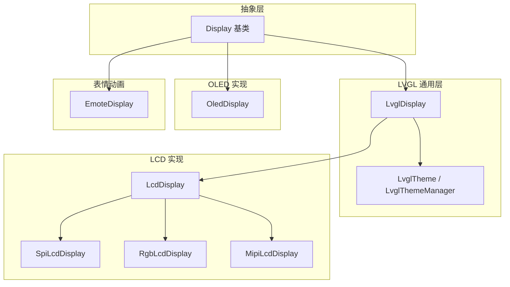
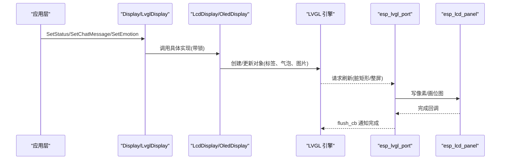
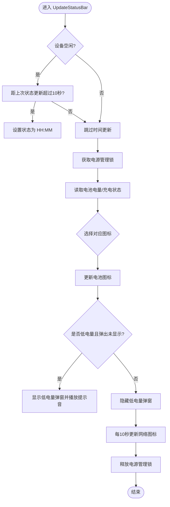
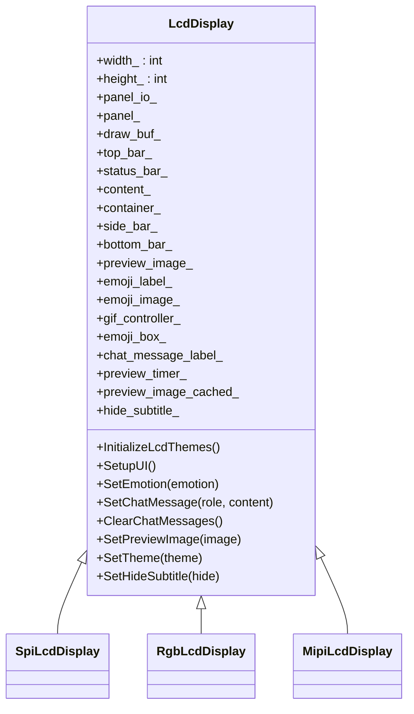
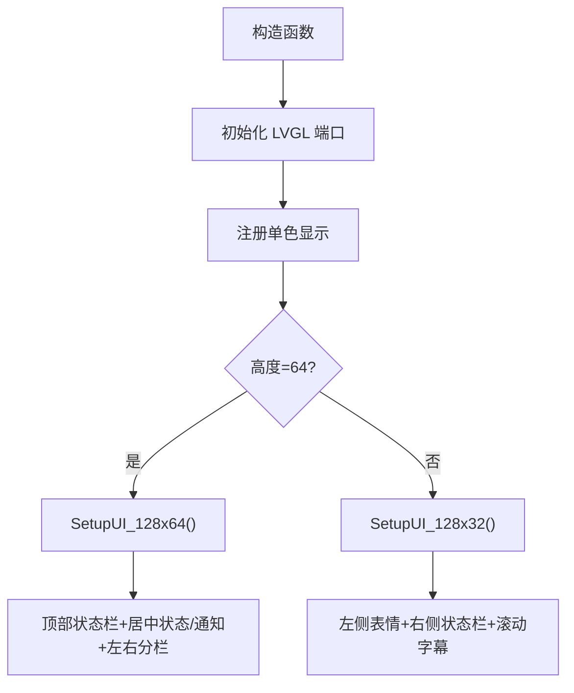
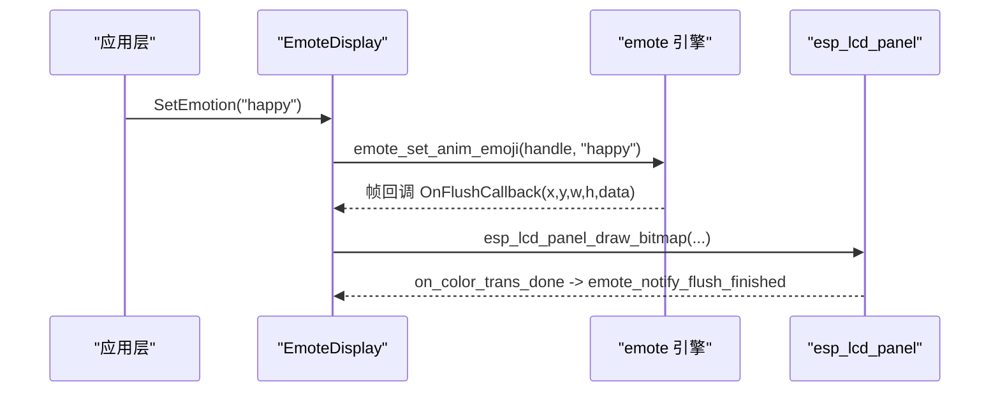
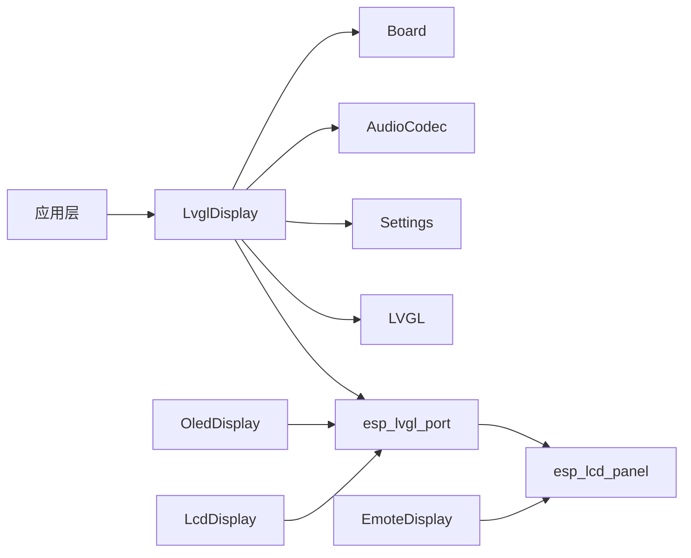
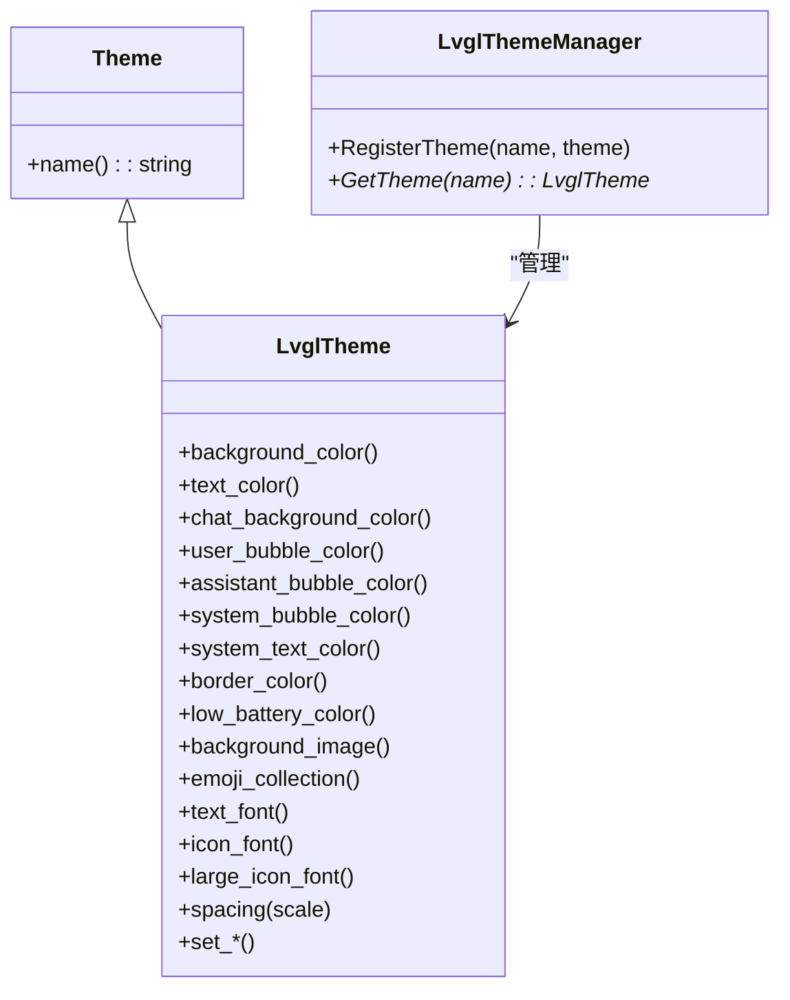

# 显示系统

<cite>
**本文引用的文件**   
- [display.h](file://main/display/display.h)
- [display.cc](file://main/display/display.cc)
- [lvgl_display.h](file://main/display/lvgl_display/lvgl_display.h)
- [lvgl_display.cc](file://main/display/lvgl_display/lvgl_display.cc)
- [lcd_display.h](file://main/display/lcd_display.h)
- [lcd_display.cc](file://main/display/lcd_display.cc)
- [oled_display.h](file://main/display/oled_display.h)
- [oled_display.cc](file://main/display/oled_display.cc)
- [emote_display.h](file://main/display/emote_display.h)
- [emote_display.cc](file://main/display/emote_display.cc)
- [lvgl_theme.h](file://main/display/lvgl_display/lvgl_theme.h)
- [lvgl_theme.cc](file://main/display/lvgl_display/lvgl_theme.cc)
</cite>

## 目录
1. [简介](#简介)
2. [项目结构](#项目结构)
3. [核心组件](#核心组件)
4. [架构总览](#架构总览)
5. [详细组件分析](#详细组件分析)
6. [依赖关系分析](#依赖关系分析)
7. [性能与内存优化](#性能与内存优化)
8. [主题与样式管理](#主题与样式管理)
9. [多分辨率适配策略](#多分辨率适配策略)
10. [表情与动画系统](#表情与动画系统)
11. [触摸与输入处理](#触摸与输入处理)
12. [调试与排障指南](#调试与排障指南)
13. [扩展接口与自定义显示效果](#扩展接口与自定义显示效果)
14. [结论](#结论)

## 简介
本文件面向开发者，系统化阐述本项目中基于 LVGL 的图形显示子系统。内容覆盖：
- LVGL 集成方案与 UI 渲染架构
- OLED 与 LCD 驱动适配（屏幕初始化、像素绘制、刷新机制）
- 表情显示系统与动画流程
- 字体渲染、图片显示与 GIF 支持
- 多分辨率适配策略与内存优化
- UI 主题定制与样式管理
- 显示性能优化技巧与调试方法
- 为自定义显示效果提供的扩展接口

## 项目结构
显示子系统位于 main/display 目录，采用分层设计：
- 抽象层：Display 基类定义统一 API（状态、通知、表情、聊天消息、主题等）
- LVGL 通用层：LvglDisplay 提供跨屏的通用能力（通知计时器、电量/网络图标更新、截图转 JPEG 等）
- 具体实现：
  - LcdDisplay/SpiLcdDisplay/RgbLcdDisplay/MipiLcdDisplay：彩色 LCD 系列，使用 esp_lcd + lvgl_port_add_disp_* 注册不同总线
  - OledDisplay：单色 OLED，配置 monochrome 模式
  - EmoteDisplay：专用表情动画显示，直接通过回调将帧写入面板
- 主题系统：LvglTheme/LvglThemeManager 统一管理颜色、字体、背景图与表情集合

图表来源
- [display.h:28-61](file://main/display/display.h#L28-L61)
- [lvgl_display.h:15-50](file://main/display/lvgl_display/lvgl_display.h#L15-L50)
- [lcd_display.h:17-83](file://main/display/lcd_display.h#L17-L83)
- [oled_display.h:10-39](file://main/display/oled_display.h#L10-L39)
- [emote_display.h:12-40](file://main/display/emote_display.h#L12-L40)
- [lvgl_theme.h:14-94](file://main/display/lvgl_display/lvgl_theme.h#L14-L94)

章节来源
- [display.h:28-61](file://main/display/display.h#L28-L61)
- [lvgl_display.h:15-50](file://main/display/lvgl_display/lvgl_display.h#L15-L50)
- [lcd_display.h:17-83](file://main/display/lcd_display.h#L17-L83)
- [oled_display.h:10-39](file://main/display/oled_display.h#L10-L39)
- [emote_display.h:12-40](file://main/display/emote_display.h#L12-L40)
- [lvgl_theme.h:14-94](file://main/display/lvgl_display/lvgl_theme.h#L14-L94)

## 核心组件
- Display 抽象基类
  - 统一接口：SetStatus、ShowNotification、SetEmotion、SetChatMessage、ClearChatMessages、SetTheme、UpdateStatusBar、SetPowerSaveMode
  - 线程安全：DisplayLockGuard 封装 Lock/Unlock 生命周期
- LvglDisplay 通用实现
  - 通知定时器：定时隐藏通知并恢复状态文本
  - 状态栏更新：静音图标、时间、电池图标、低电量弹窗、网络图标
  - 截图转 JPEG：启用 LV_USE_SNAPSHOT 时可用
- LcdDisplay 及子类
  - 初始化 LVGL 与端口，注册不同总线（SPI/RGB/MIPI）
  - 构建 UI 容器、顶部状态栏、聊天区域、表情区、预览图等
  - 支持 GIF 控制器与图片缓存
- OledDisplay
  - 单色模式配置，针对 128x64 与 128x32 布局分别构建 UI
  - 滚动字幕与表情图标
- EmoteDisplay
  - 独立动画引擎，回调将帧写入面板，支持事件消息与动画对话插入
- 主题系统
  - LvglTheme 管理颜色、字体、背景图、表情集合
  - LvglThemeManager 注册与获取主题

章节来源
- [display.h:28-61](file://main/display/display.h#L28-L61)
- [display.cc:17-61](file://main/display/display.cc#L17-L61)
- [lvgl_display.h:15-50](file://main/display/lvgl_display/lvgl_display.h#L15-L50)
- [lvgl_display.cc:18-275](file://main/display/lvgl_display/lvgl_display.cc#L18-L275)
- [lcd_display.h:17-83](file://main/display/lcd_display.h#L17-L83)
- [lcd_display.cc:25-284](file://main/display/lcd_display.cc#L25-L284)
- [oled_display.h:10-39](file://main/display/oled_display.h#L10-L39)
- [oled_display.cc:20-144](file://main/display/oled_display.cc#L20-L144)
- [emote_display.h:12-40](file://main/display/emote_display.h#L12-L40)
- [emote_display.cc:74-127](file://main/display/emote_display.cc#L74-L127)
- [lvgl_theme.h:14-94](file://main/display/lvgl_display/lvgl_theme.h#L14-L94)
- [lvgl_theme.cc:1-31](file://main/display/lvgl_display/lvgl_theme.cc#L1-L31)

## 架构总览
下图展示从应用调用到面板绘制的完整链路，包括 LVGL 对象树、缓冲区与底层面板驱动。

图表来源
- [lvgl_display.cc:72-111](file://main/display/lvgl_display/lvgl_display.cc#L72-L111)
- [lcd_display.cc:133-172](file://main/display/lcd_display.cc#L133-L172)
- [oled_display.cc:45-77](file://main/display/oled_display.cc#L45-L77)
- [emote_display.cc:62-68](file://main/display/emote_display.cc#L62-L68)

## 详细组件分析

### LVGL 通用层（LvglDisplay）
- 功能要点
  - 通知定时器：在指定时长后自动隐藏通知并恢复状态文本
  - 状态栏更新：静音图标、时间、电池图标、低电量弹窗、网络图标
  - 截图转 JPEG：在启用快照功能时，抓取当前屏幕并编码为 JPEG
- 关键路径
  - ShowNotification：设置通知文本、切换可见性、启动一次性定时器
  - UpdateStatusBar：周期性更新时间、电池和网络图标；低电量触发提示音
  - SnapshotToJpeg：取屏、字节序交换、流式编码输出

图表来源
- [lvgl_display.cc:113-219](file://main/display/lvgl_display/lvgl_display.cc#L113-L219)

章节来源
- [lvgl_display.cc:18-275](file://main/display/lvgl_display/lvgl_display.cc#L18-L275)

### LCD 显示（LcdDisplay 及其子类）
- 初始化流程
  - 构造阶段：记录宽高、初始化主题、加载持久化主题、创建预览定时器
  - SpiLcdDisplay：清屏、开启显示、初始化 LVGL 与端口、添加 SPI 显示、可选偏移
  - RgbLcdDisplay：双缓冲、DMA、全屏刷新、RGB 专用配置
  - MipiLcdDisplay：DSI 专用配置、软件旋转开关
- UI 构建（以微信风格为例）
  - 顶层容器、顶部状态栏（网络/静音/电池）、居中状态/通知条、可滚动聊天区
  - 消息气泡：用户（右对齐绿色）、助手（左对齐浅色）、系统（居中灰色）
  - 表情区：启动时显示 AI Logo，收到消息后隐藏
  - 图片预览：自适应缩放、自动滚动到底部
- 资源与性能
  - PSRAM 图像缓存：根据容量动态分配
  - 最大消息数限制：超出则删除最旧消息并滚动至最新

图表来源
- [lcd_display.h:17-83](file://main/display/lcd_display.h#L17-L83)
- [lcd_display.cc:65-284](file://main/display/lcd_display.cc#L65-L284)

章节来源
- [lcd_display.h:17-83](file://main/display/lcd_display.h#L17-L83)
- [lcd_display.cc:25-284](file://main/display/lcd_display.cc#L25-L284)
- [lcd_display.cc:354-498](file://main/display/lcd_display.cc#L354-L498)
- [lcd_display.cc:504-698](file://main/display/lcd_display.cc#L504-L698)
- [lcd_display.cc:700-782](file://main/display/lcd_display.cc#L700-L782)

### OLED 显示（OledDisplay）
- 初始化
  - 单色模式配置，注册显示，支持镜像翻转
- UI 布局
  - 128x64：顶部状态栏 + 居中状态/通知 + 左右分栏（左侧表情、右侧滚动字幕）
  - 128x32：左侧表情 + 右侧状态栏与滚动字幕
- 交互
  - SetChatMessage：替换换行符为空格，控制右侧内容显隐
  - SetEmotion：通过 Awesome 字体映射表情

图表来源
- [oled_display.cc:20-81](file://main/display/oled_display.cc#L20-L81)
- [oled_display.cc:168-298](file://main/display/oled_display.cc#L168-L298)
- [oled_display.cc:300-385](file://main/display/oled_display.cc#L300-L385)

章节来源
- [oled_display.h:10-39](file://main/display/oled_display.h#L10-L39)
- [oled_display.cc:20-144](file://main/display/oled_display.cc#L20-L144)
- [oled_display.cc:168-385](file://main/display/oled_display.cc#L168-L385)

### 表情与动画（EmoteDisplay）
- 初始化
  - 创建 emote_handle，配置分辨率、FPS、缓冲区大小、任务优先级与栈
  - 注册 flush 回调，将帧数据写入面板
- 事件与消息
  - SetEmotion：设置动画表情
  - SetChatMessage：区分系统消息与语音消息，映射到不同事件类型
  - SetStatus：监听/待机/说话/错误等状态映射
  - InsertAnimDialog/StopAnimDialog：插入或停止动画对话
  - RefreshAll：强制刷新所有

图表来源
- [emote_display.cc:74-127](file://main/display/emote_display.cc#L74-L127)
- [emote_display.cc:137-176](file://main/display/emote_display.cc#L137-L176)
- [emote_display.cc:62-68](file://main/display/emote_display.cc#L62-L68)

章节来源
- [emote_display.h:12-40](file://main/display/emote_display.h#L12-L40)
- [emote_display.cc:74-127](file://main/display/emote_display.cc#L74-L127)
- [emote_display.cc:137-250](file://main/display/emote_display.cc#L137-L250)

## 依赖关系分析
- 组件耦合
  - LvglDisplay 依赖 Board/AudioCodec/Application/Settings 进行状态栏信息聚合
  - LcdDisplay/OledDisplay 依赖 esp_lvgl_port 与 esp_lcd 驱动
  - EmoteDisplay 直接操作面板，绕过 LVGL 对象树
- 外部依赖
  - LVGL 引擎、esp_lvgl_port、esp_lcd、FreeRTOS、ESP-IDF 定时器与 PM 锁
- 潜在循环依赖
  - 无直接循环；通过抽象基类与接口解耦

图表来源
- [lvgl_display.cc:113-219](file://main/display/lvgl_display/lvgl_display.cc#L113-L219)
- [lcd_display.cc:133-172](file://main/display/lcd_display.cc#L133-L172)
- [oled_display.cc:45-77](file://main/display/oled_display.cc#L45-L77)
- [emote_display.cc:62-68](file://main/display/emote_display.cc#L62-L68)

章节来源
- [lvgl_display.cc:113-219](file://main/display/lvgl_display/lvgl_display.cc#L113-L219)
- [lcd_display.cc:133-172](file://main/display/lcd_display.cc#L133-L172)
- [oled_display.cc:45-77](file://main/display/oled_display.cc#L45-L77)
- [emote_display.cc:62-68](file://main/display/emote_display.cc#L62-L68)

## 性能与内存优化
- 缓冲区与刷新
  - SPI：单缓冲，buffer_size = width*20，适合低速总线
  - RGB：双缓冲、DMA、全屏刷新、避免撕裂
  - MIPI：DSI 专用，支持软件旋转
  - OLED：monochrome 全分辨率缓冲，适合小屏
- 图像缓存
  - 根据 PSRAM 容量动态调整 LVGL 图像缓存大小（如 512KB/2MB）
- 消息数量限制
  - 聊天区最多保留固定条数，超出删除最旧消息，减少对象数量
- 电源管理
  - 使用 PM 锁在更新状态栏期间提升频率，完成后释放
- 截图压缩
  - 启用快照功能后，按流式方式编码 JPEG，避免大内存预分配

章节来源
- [lcd_display.cc:116-172](file://main/display/lcd_display.cc#L116-L172)
- [lcd_display.cc:176-233](file://main/display/lcd_display.cc#L176-L233)
- [lcd_display.cc:235-284](file://main/display/lcd_display.cc#L235-L284)
- [oled_display.cc:49-77](file://main/display/oled_display.cc#L49-L77)
- [lvgl_display.cc:152-219](file://main/display/lvgl_display/lvgl_display.cc#L152-L219)
- [lvgl_display.cc:234-275](file://main/display/lvgl_display/lvgl_display.cc#L234-L275)

## 主题与样式管理
- 主题模型
  - LvglTheme：背景/文字/聊天背景/气泡/边框/低电量颜色、字体、背景图、表情集合、间距缩放
  - LvglThemeManager：注册与获取主题，支持持久化保存主题名
- 默认主题
  - LcdDisplay 内置 light/dark 主题，包含字体与颜色配置
  - OledDisplay 仅 dark 主题，适配单色屏
- 切换与持久化
  - Display::SetTheme 保存主题名到 Settings
  - 各实现从 Settings 加载主题并应用到屏幕根对象

图表来源
- [lvgl_theme.h:14-94](file://main/display/lvgl_display/lvgl_theme.h#L14-L94)
- [lvgl_theme.cc:1-31](file://main/display/lvgl_display/lvgl_theme.cc#L1-L31)
- [display.cc:52-56](file://main/display/display.cc#L52-L56)
- [lcd_display.cc:25-63](file://main/display/lcd_display.cc#L25-L63)
- [oled_display.cc:26-37](file://main/display/oled_display.cc#L26-L37)

章节来源
- [lvgl_theme.h:14-94](file://main/display/lvgl_display/lvgl_theme.h#L14-L94)
- [lvgl_theme.cc:1-31](file://main/display/lvgl_display/lvgl_theme.cc#L1-L31)
- [display.cc:52-56](file://main/display/display.cc#L52-L56)
- [lcd_display.cc:25-63](file://main/display/lcd_display.cc#L25-L63)
- [oled_display.cc:26-37](file://main/display/oled_display.cc#L26-L37)

## 多分辨率适配策略
- 屏幕尺寸
  - 通过构造函数传入 width/height，并在 lvgl_port_display_cfg 中设置 hres/vres
  - 支持 offset_x/offset_y 修正面板坐标偏移
- 方向与镜像
  - rotation.swap_xy/mirror_x/mirror_y 与底层面板一致
- 布局适配
  - LcdDisplay：聊天气泡宽度按屏幕百分比计算，自动换行与滚动
  - OledDisplay：针对不同高度提供两套布局函数
- 字体与图标
  - 通过主题注入 text/icon/large_icon 字体，确保在不同分辨率下可读性

章节来源
- [lcd_display.cc:137-172](file://main/display/lcd_display.cc#L137-L172)
- [lcd_display.cc:176-233](file://main/display/lcd_display.cc#L176-L233)
- [lcd_display.cc:235-284](file://main/display/lcd_display.cc#L235-L284)
- [oled_display.cc:168-298](file://main/display/oled_display.cc#L168-L298)
- [oled_display.cc:300-385](file://main/display/oled_display.cc#L300-L385)

## 表情与动画系统
- 表情显示
  - LcdDisplay/OledDisplay：通过 Awesome 字体图标表达情绪
  - EmoteDisplay：专用动画引擎，支持多帧动画与事件消息
- 动画流程
  - 设置表情/事件消息 → 引擎生成帧 → flush_cb 回调写面板 → 通知完成
- 动画对话
  - InsertAnimDialog/StopAnimDialog 支持插播与终止

章节来源
- [lcd_display.cc:489-498](file://main/display/lcd_display.cc#L489-L498)
- [oled_display.cc:387-398](file://main/display/oled_display.cc#L387-L398)
- [emote_display.cc:137-176](file://main/display/emote_display.cc#L137-L176)
- [emote_display.cc:224-250](file://main/display/emote_display.cc#L224-L250)

## 触摸与输入处理
- 当前显示模块未直接实现触摸逻辑
- 触摸通常由板级代码或 LVGL 输入端口负责，不在本显示子系统中
- 如需接入触摸，建议在板级初始化中注册 LVGL 输入设备，并通过 Display 抽象层间接影响 UI 行为

[本节为概念性说明，不直接分析具体文件]

## 调试与排障指南
- 常见问题
  - 在 SetupUI 之前调用 SetStatus/SetChatMessage/ShowNotification：会打印警告并丢弃消息
  - 对象为空指针：若 SetupUI 已调用但对应控件未创建，会打印失败日志
- 定位建议
  - 检查 lvgl_port_add_disp_* 返回值是否为空
  - 确认 panel 初始化与 disp_on_off 调用顺序
  - 观察 flush_cb 回调是否被触发
- 工具与日志
  - ESP_LOGE/W/I/D 用于关键路径日志
  - 使用 SnapshotToJpeg 导出当前屏幕便于离线分析

章节来源
- [lvgl_display.cc:72-111](file://main/display/lvgl_display/lvgl_display.cc#L72-L111)
- [lcd_display.cc:354-362](file://main/display/lcd_display.cc#L354-L362)
- [lcd_display.cc:504-514](file://main/display/lcd_display.cc#L504-L514)
- [lvgl_display.cc:234-275](file://main/display/lvgl_display/lvgl_display.cc#L234-L275)

## 扩展接口与自定义显示效果
- 新增显示类型
  - 继承 Display 或 LvglDisplay，实现 Lock/Unlock 与必要 UI 构建
  - 参考 LcdDisplay/OledDisplay 的初始化与 lvgl_port_add_disp_* 用法
- 自定义主题
  - 创建 LvglTheme，注册到 LvglThemeManager，并通过 Display::SetTheme 切换
- 自定义消息样式
  - 在 SetChatMessage 中扩展角色类型与气泡样式
- 自定义图片/GIF
  - 复用 LcdDisplay 的图片预览与 GIF 控制器思路，注意内存与缩放策略
- 自定义动画
  - 参考 EmoteDisplay 的 flush_cb 与事件消息机制，对接自有动画引擎

章节来源
- [display.h:28-61](file://main/display/display.h#L28-L61)
- [lvgl_display.h:15-50](file://main/display/lvgl_display/lvgl_display.h#L15-L50)
- [lcd_display.h:17-83](file://main/display/lcd_display.h#L17-L83)
- [oled_display.h:10-39](file://main/display/oled_display.h#L10-L39)
- [emote_display.h:12-40](file://main/display/emote_display.h#L12-L40)
- [lvgl_theme.h:14-94](file://main/display/lvgl_display/lvgl_theme.h#L14-L94)

## 结论
本显示系统以 Display 抽象为核心，结合 LvglDisplay 的通用能力与多种具体实现（LCD/OLED/Emote），形成高内聚、低耦合的架构。通过主题系统、多分辨率适配与完善的性能优化手段，能够在不同硬件平台上稳定高效地呈现丰富的 UI 与动画效果。开发者可基于现有扩展点快速定制显示效果与交互体验。