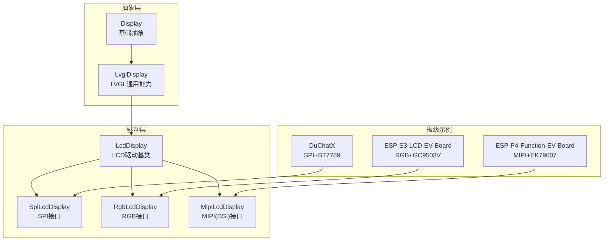
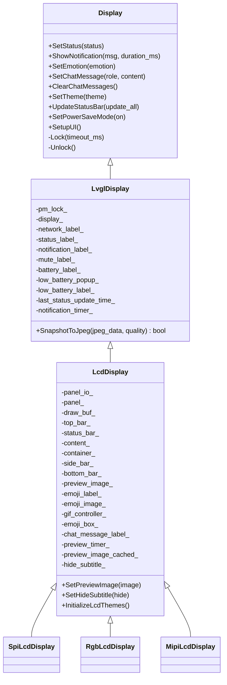
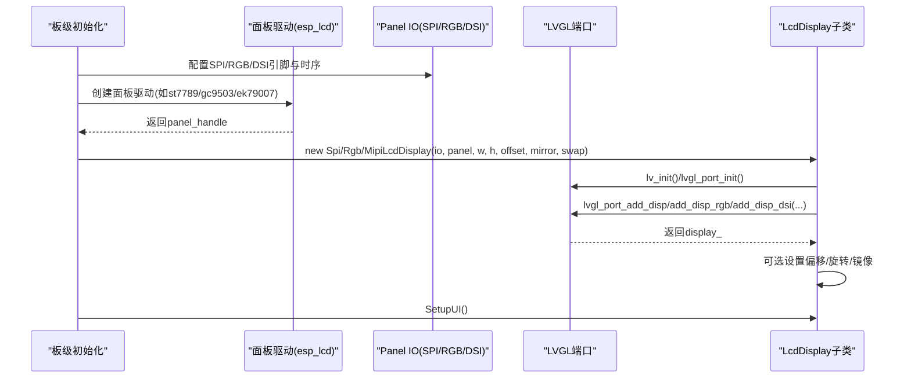
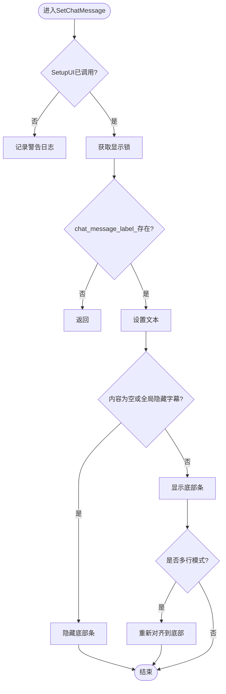
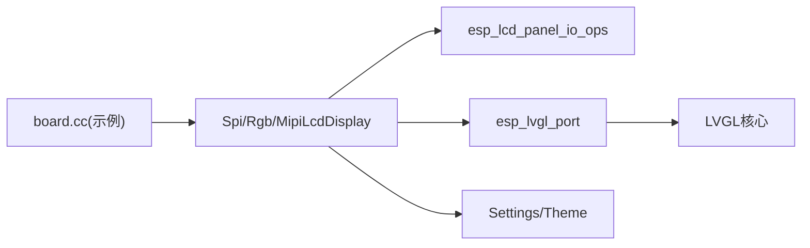

# LCD显示驱动

<cite>
**本文引用的文件**   
- [lcd_display.h](file://main/display/lcd_display.h)
- [lcd_display.cc](file://main/display/lcd_display.cc)
- [display.h](file://main/display/display.h)
- [display.cc](file://main/display/display.cc)
- [lvgl_display.h](file://main/display/lvgl_display/lvgl_display.h)
- [lvgl_display.cc](file://main/display/lvgl_display/lvgl_display.cc)
- [esp-s3-lcd-ev-board.cc](file://main/boards/esp-s3-lcd-ev-board/esp-s3-lcd-ev-board.cc)
- [esp-p4-function-ev-board.cc](file://main/boards/esp-p4-function-ev-board/esp-p4-function-ev-board.cc)
- [du-chatx-wifi.cc](file://main/boards/du-chatx/du-chatx-wifi.cc)
</cite>

## 目录
1. [简介](#简介)
2. [项目结构](#项目结构)
3. [核心组件](#核心组件)
4. [架构总览](#架构总览)
5. [详细组件分析](#详细组件分析)
6. [依赖关系分析](#依赖关系分析)
7. [性能与刷新优化](#性能与刷新优化)
8. [故障诊断与排错](#故障诊断与排错)
9. [结论](#结论)
10. [附录：自定义LCD驱动实现指南](#附录自定义lcd驱动实现指南)

## 简介
本技术文档围绕ESP-IDF工程中的LCD显示驱动体系，系统性解析LcdDisplay基类的设计与SPI、RGB、MIPI三种接口类型的差异；深入说明屏幕初始化流程、缓冲区管理策略、刷新机制优化；并给出不同分辨率与色彩深度的适配方法（偏移校正、镜像翻转、坐标变换）；最后提供创建自定义LCD驱动的完整步骤、常见问题诊断与解决方案。

## 项目结构
本项目将显示抽象层与具体驱动解耦：
- 抽象层：Display/LvglDisplay定义通用UI能力（状态栏、通知、主题、截图等）。
- 驱动层：LcdDisplay及其子类SpiLcdDisplay/RgbLcdDisplay/MipiLcdDisplay封装底层面板IO与LVGL端口配置。
- 板级集成：各Board在初始化时完成硬件引脚与时序配置，实例化具体LcdDisplay子类。

图表来源
- [display.h:1-88](file://main/display/display.h#L1-L88)
- [lvgl_display.h:1-54](file://main/display/lvgl_display/lvgl_display.h#L1-L54)
- [lcd_display.h:1-86](file://main/display/lcd_display.h#L1-L86)
- [esp-s3-lcd-ev-board.cc:120-127](file://main/boards/esp-s3-lcd-ev-board/esp-s3-lcd-ev-board.cc#L120-L127)
- [esp-p4-function-ev-board.cc:62-76](file://main/boards/esp-p4-function-ev-board/esp-p4-function-ev-board.cc#L62-L76)
- [du-chatx-wifi.cc:74-101](file://main/boards/du-chatx/du-chatx-wifi.cc#L74-L101)

章节来源
- [display.h:1-88](file://main/display/display.h#L1-L88)
- [display.cc:1-61](file://main/display/display.cc#L1-L61)
- [lvgl_display.h:1-54](file://main/display/lvgl_display/lvgl_display.h#L1-L54)
- [lvgl_display.cc:1-275](file://main/display/lvgl_display/lvgl_display.cc#L1-L275)
- [lcd_display.h:1-86](file://main/display/lcd_display.h#L1-L86)
- [lcd_display.cc:1-1311](file://main/display/lcd_display.cc#L1-L1311)

## 核心组件
- Display：最顶层抽象，定义状态、通知、表情、聊天消息、主题、电源管理等接口。
- LvglDisplay：基于LVGL的通用实现，负责通知定时器、电量/网络图标更新、截图转JPEG等。
- LcdDisplay：LCD驱动基类，封装LVGL显示对象、预览图/GIF控制器、UI布局与主题切换。
- SpiLcdDisplay/RgbLcdDisplay/MipiLcdDisplay：分别对应SPI、RGB、MIPI三种接口的LVGL端口注册与刷新策略。

章节来源
- [display.h:1-88](file://main/display/display.h#L1-L88)
- [lvgl_display.h:1-54](file://main/display/lvgl_display/lvgl_display.h#L1-L54)
- [lvgl_display.cc:1-275](file://main/display/lvgl_display/lvgl_display.cc#L1-L275)
- [lcd_display.h:1-86](file://main/display/lcd_display.h#L1-L86)
- [lcd_display.cc:1-1311](file://main/display/lcd_display.cc#L1-L1311)

## 架构总览
整体采用“抽象-实现-板级”三层分离：
- 抽象层统一对外API，屏蔽底层差异。
- 驱动层按接口类型选择不同LVGL端口添加方式与刷新策略。
- 板级负责硬件初始化（SPI/RGB/DSI）、面板驱动、时序参数、GPIO映射，再构造具体LcdDisplay子类。

图表来源
- [display.h:1-88](file://main/display/display.h#L1-L88)
- [lvgl_display.h:1-54](file://main/display/lvgl_display/lvgl_display.h#L1-L54)
- [lcd_display.h:1-86](file://main/display/lcd_display.h#L1-L86)

## 详细组件分析

### LcdDisplay基类设计
- 职责
  - 维护底层面板句柄与LVGL显示对象。
  - 初始化主题、构建UI容器（顶部状态栏、中部内容区、底部消息条、居中表情/图片）。
  - 处理预览图展示与定时隐藏、GIF动画控制。
  - 提供锁机制以安全访问LVGL对象。
- 关键成员与方法
  - 构造函数中加载主题、创建预览定时器。
  - InitializeLcdThemes注册light/dark主题。
  - SetPreviewImage/SetChatMessage/ClearChatMessages/SetEmotion/SetTheme/SetHideSubtitle等。
  - Lock/Unlock通过lvgl_port_lock/unlock保证线程安全。

章节来源
- [lcd_display.cc:25-90](file://main/display/lcd_display.cc#L25-L90)
- [lcd_display.cc:286-351](file://main/display/lcd_display.cc#L286-L351)
- [lcd_display.cc:804-1072](file://main/display/lcd_display.cc#L804-L1072)
- [lcd_display.cc:1074-1311](file://main/display/lcd_display.cc#L1074-L1311)

### SPI接口实现（SpiLcdDisplay）
- 初始化要点
  - 先清屏为白色，开启显示（若支持disp_on_off）。
  - 初始化LVGL库与端口，设置任务优先级/亲和性。
  - 使用lvgl_port_add_disp注册显示，颜色格式RGB565，启用DMA缓冲，字节交换。
  - 可选旋转与镜像：swap_xy/mirror_x/mirror_y。
  - 可选偏移：offset_x/offset_y。
- 缓冲区与刷新
  - buffer_size=width*20，非双缓冲，full_refresh=0，direct_mode=0。
  - 适合中小尺寸SPI屏，内存占用较低。

章节来源
- [lcd_display.cc:92-172](file://main/display/lcd_display.cc#L92-L172)

### RGB接口实现（RgbLcdDisplay）
- 初始化要点
  - 清屏与打开显示后，初始化LVGL与端口。
  - 使用lvgl_port_add_disp_rgb注册RGB显示，启用双缓冲与全屏刷新模式，direct_mode=1。
  - 可配置避免撕裂与BB模式。
- 缓冲区与刷新
  - buffer_size=width*20，double_buffer=true，full_refresh=1，direct_mode=1。
  - 适合高速并行RGB屏，吞吐高，但内存占用较大。

章节来源
- [lcd_display.cc:176-233](file://main/display/lcd_display.cc#L176-L233)

### MIPI接口实现（MipiLcdDisplay）
- 初始化要点
  - 初始化LVGL与端口后，使用lvgl_port_add_disp_dsi注册DSI显示。
  - 可配置avoid_tearing标志。
- 缓冲区与刷新
  - buffer_size=width*50，非双缓冲，sw_rotate=true，buff_dma=true。
  - 适合高分辨率MIPI屏，带宽高，需合理配置缓冲区大小。

章节来源
- [lcd_display.cc:235-284](file://main/display/lcd_display.cc#L235-L284)

### 屏幕初始化流程（序列图）
以下序列图展示了从板级到驱动层的典型初始化调用链。

图表来源
- [du-chatx-wifi.cc:74-101](file://main/boards/du-chatx/du-chatx-wifi.cc#L74-L101)
- [esp-s3-lcd-ev-board.cc:33-127](file://main/boards/esp-s3-lcd-ev-board/esp-s3-lcd-ev-board.cc#L33-L127)
- [esp-p4-function-ev-board.cc:62-76](file://main/boards/esp-p4-function-ev-board/esp-p4-function-ev-board.cc#L62-L76)
- [lcd_display.cc:92-172](file://main/display/lcd_display.cc#L92-L172)
- [lcd_display.cc:176-233](file://main/display/lcd_display.cc#L176-L233)
- [lcd_display.cc:235-284](file://main/display/lcd_display.cc#L235-L284)

### UI与消息流（流程图）
以非微信样式为例，消息更新与底部条可见性控制如下：

图表来源
- [lcd_display.cc:1033-1072](file://main/display/lcd_display.cc#L1033-L1072)

## 依赖关系分析
- 外部依赖
  - ESP-IDF esp_lcd_panel_io/ops用于面板IO与操作。
  - ESP-LVGL-Port用于LVGL与底层驱动桥接。
  - PSRAM缓存用于图像解码与渲染加速（条件编译）。
- 内部依赖
  - Display/LvglDisplay提供通用UI能力。
  - 板级代码负责硬件初始化与实例化具体LcdDisplay子类。

图表来源
- [du-chatx-wifi.cc:74-101](file://main/boards/du-chatx/du-chatx-wifi.cc#L74-L101)
- [esp-s3-lcd-ev-board.cc:33-127](file://main/boards/esp-s3-lcd-ev-board/esp-s3-lcd-ev-board.cc#L33-L127)
- [esp-p4-function-ev-board.cc:62-76](file://main/boards/esp-p4-function-ev-board/esp-p4-function-ev-board.cc#L62-L76)
- [lcd_display.cc:1-1311](file://main/display/lcd_display.cc#L1-L1311)

章节来源
- [display.h:1-88](file://main/display/display.h#L1-L88)
- [lvgl_display.cc:1-275](file://main/display/lvgl_display/lvgl_display.cc#L1-L275)
- [lcd_display.cc:1-1311](file://main/display/lcd_display.cc#L1-L1311)

## 性能与刷新优化
- 缓冲区策略
  - SPI：单缓冲，buffer_size=width*20，适合低内存场景。
  - RGB：双缓冲，full_refresh=1，direct_mode=1，吞吐高但内存占用大。
  - MIPI：单缓冲，buffer_size=width*50，sw_rotate=true，适合高分屏。
- DMA与字节序
  - SPI启用buff_dma与swap_bytes=1；RGB禁用swap_bytes=0；MIPI启用buff_dma。
- 图像缓存
  - 当PSRAM>=8MB时分配2MB缓存，>=2MB时分配512KB缓存，提升PNG等图像解码性能。
- 刷新模式
  - RGB直接模式与全屏刷新减少CPU参与；SPI/MIPI按需刷新。
- 建议
  - 根据屏幕尺寸与内存选择合适接口与缓冲策略。
  - 高分屏优先RGB/MIPI，并确保DMA与帧缓冲位于PSRAM以降低主存压力。
  - 合理使用避免撕裂标志（RGB可用avoid_tearing）。

章节来源
- [lcd_display.cc:116-172](file://main/display/lcd_display.cc#L116-L172)
- [lcd_display.cc:176-233](file://main/display/lcd_display.cc#L176-L233)
- [lcd_display.cc:235-284](file://main/display/lcd_display.cc#L235-L284)

## 故障诊断与排错
- 常见现象与定位
  - 黑屏/花屏：检查面板复位与初始化顺序、时钟源与数据位宽、像素格式与字节序。
  - 方向错误：确认swap_xy/mirror_x/mirror_y是否与esp_lcd一致。
  - 偏移异常：确保offset_x/offset_y正确设置。
  - 刷新卡顿：评估buffer_size与双缓冲策略，必要时增大或切换到RGB/MIPI。
  - 内存不足：降低分辨率或颜色深度，启用PSRAM缓存，减小buffer_size。
- 调试手段
  - 查看日志输出（初始化阶段与错误码）。
  - 使用SnapshotToJpeg截取当前画面进行离线分析。
  - 逐步注释初始化步骤，定位失败点。

章节来源
- [lvgl_display.cc:234-275](file://main/display/lvgl_display/lvgl_display.cc#L234-L275)
- [lcd_display.cc:92-172](file://main/display/lcd_display.cc#L92-L172)
- [lcd_display.cc:176-233](file://main/display/lcd_display.cc#L176-L233)
- [lcd_display.cc:235-284](file://main/display/lcd_display.cc#L235-L284)

## 结论
本驱动体系通过清晰的抽象分层与接口差异化实现，覆盖了SPI/RGB/MIPI三类主流LCD接口，提供了完善的UI能力与主题系统。通过合理的缓冲区与刷新策略配置，可在不同分辨率与色彩深度下取得良好性能。板级代码仅需关注硬件初始化与参数传递，即可快速接入新屏幕。

## 附录：自定义LCD驱动实现指南

### 步骤一：硬件初始化（以SPI为例）
- 初始化SPI总线与面板IO（CS/DC/PCLK等）。
- 创建面板驱动（如ST7789），执行reset/init/invert/swap/mirror等操作。
- 参考路径：[du-chatx-wifi.cc:63-101](file://main/boards/du-chatx/du-chatx-wifi.cc#L63-L101)

章节来源
- [du-chatx-wifi.cc:63-101](file://main/boards/du-chatx/du-chatx-wifi.cc#L63-L101)

### 步骤二：实例化LcdDisplay子类
- 根据接口类型选择SpiLcdDisplay/RgbLcdDisplay/MipiLcdDisplay。
- 传入宽度、高度、偏移、镜像、坐标交换等参数。
- 参考路径：
  - SPI：[du-chatx-wifi.cc:100-101](file://main/boards/du-chatx/du-chatx-wifi.cc#L100-L101)
  - RGB：[esp-s3-lcd-ev-board.cc:124-127](file://main/boards/esp-s3-lcd-ev-board/esp-s3-lcd-ev-board.cc#L124-L127)
  - MIPI：[esp-p4-function-ev-board.cc:75](file://main/boards/esp-p4-function-ev-board/esp-p4-function-ev-board.cc#L75)

章节来源
- [du-chatx-wifi.cc:100-101](file://main/boards/du-chatx/du-chatx-wifi.cc#L100-L101)
- [esp-s3-lcd-ev-board.cc:124-127](file://main/boards/esp-s3-lcd-ev-board/esp-s3-lcd-ev-board.cc#L124-L127)
- [esp-p4-function-ev-board.cc:75](file://main/boards/esp-p4-function-ev-board/esp-p4-function-ev-board.cc#L75)

### 步骤三：配置偏移、镜像与坐标变换
- 在驱动构造中设置offset_x/offset_y、mirror_x/mirror_y、swap_xy。
- 这些参数应与esp_lcd侧保持一致，确保逻辑坐标与物理坐标匹配。
- 参考路径：
  - SPI：[du-chatx-wifi.cc:98-101](file://main/boards/du-chatx/du-chatx-wifi.cc#L98-L101)
  - RGB：[esp-s3-lcd-ev-board.cc:124-127](file://main/boards/esp-s3-lcd-ev-board/esp-s3-lcd-ev-board.cc#L124-L127)
  - MIPI：[esp-p4-function-ev-board.cc:75](file://main/boards/esp-p4-function-ev-board/esp-p4-function-ev-board.cc#L75)

章节来源
- [du-chatx-wifi.cc:98-101](file://main/boards/du-chatx/du-chatx-wifi.cc#L98-L101)
- [esp-s3-lcd-ev-board.cc:124-127](file://main/boards/esp-s3-lcd-ev-board/esp-s3-lcd-ev-board.cc#L124-L127)
- [esp-p4-function-ev-board.cc:75](file://main/boards/esp-p4-function-ev-board/esp-p4-function-ev-board.cc#L75)

### 步骤四：分辨率与色彩深度适配
- 分辨率：在构造时传入width/height，并在LVGL端口配置中保持一致。
- 色彩深度：SPI/MIPI默认RGB565；RGB屏可能使用16/18bpp，需在面板驱动中配置bits_per_pixel。
- 参考路径：
  - SPI/MIPI：[lcd_display.cc:137-172](file://main/display/lcd_display.cc#L137-L172)、[lcd_display.cc:248-284](file://main/display/lcd_display.cc#L248-L284)
  - RGB 18bpp面板：[esp-s3-lcd-ev-board.cc:112-120](file://main/boards/esp-s3-lcd-ev-board/esp-s3-lcd-ev-board.cc#L112-L120)

章节来源
- [lcd_display.cc:137-172](file://main/display/lcd_display.cc#L137-L172)
- [lcd_display.cc:248-284](file://main/display/lcd_display.cc#L248-L284)
- [esp-s3-lcd-ev-board.cc:112-120](file://main/boards/esp-s3-lcd-ev-board/esp-s3-lcd-ev-board.cc#L112-L120)

### 步骤五：性能调优技巧
- 选择合适的buffer_size与双缓冲策略（SPI单缓冲，RGB双缓冲）。
- 启用DMA与PSRAM缓存，降低主存压力。
- 对高分屏优先使用RGB/MIPI，并调整avoid_tearing与direct_mode。
- 参考路径：
  - SPI：[lcd_display.cc:116-172](file://main/display/lcd_display.cc#L116-L172)
  - RGB：[lcd_display.cc:176-233](file://main/display/lcd_display.cc#L176-L233)
  - MIPI：[lcd_display.cc:235-284](file://main/display/lcd_display.cc#L235-L284)

章节来源
- [lcd_display.cc:116-172](file://main/display/lcd_display.cc#L116-L172)
- [lcd_display.cc:176-233](file://main/display/lcd_display.cc#L176-L233)
- [lcd_display.cc:235-284](file://main/display/lcd_display.cc#L235-L284)