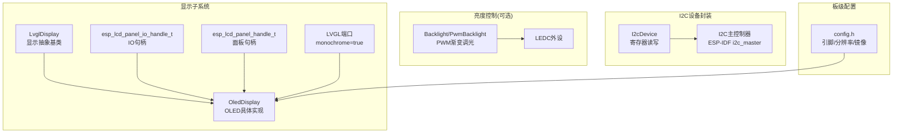
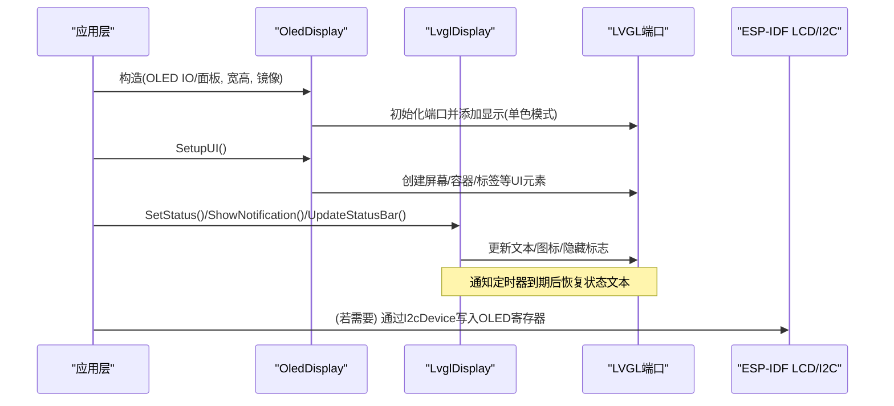
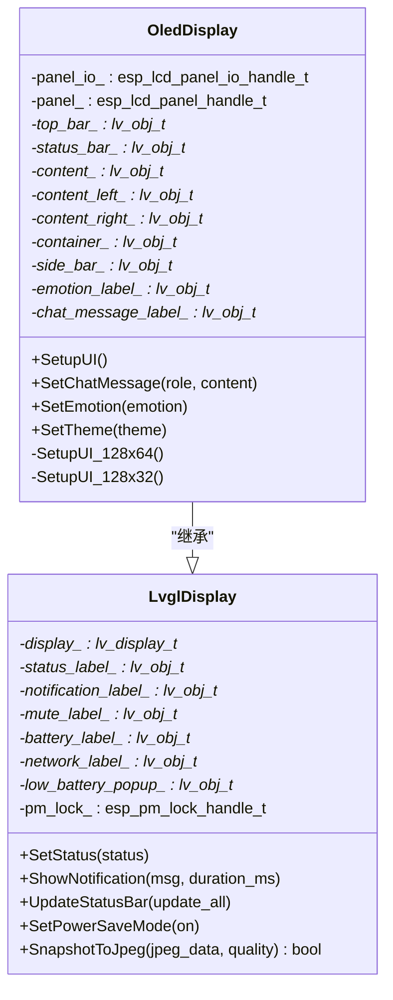
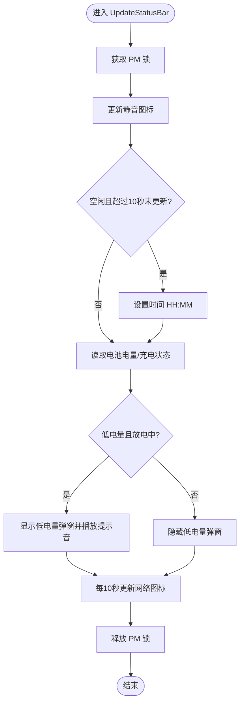
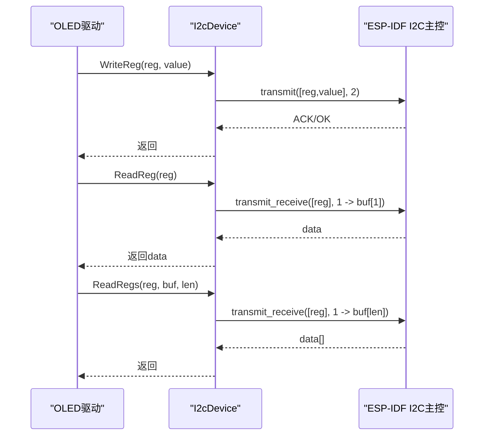
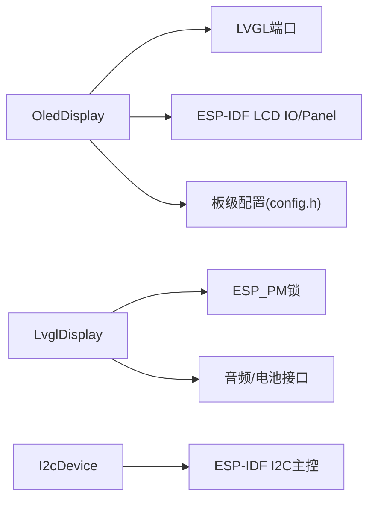

# OLED显示驱动

<cite>
**本文引用的文件**   
- [oled_display.h](file://main/display/oled_display.h)
- [oled_display.cc](file://main/display/oled_display.cc)
- [lvgl_display.h](file://main/display/lvgl_display/lvgl_display.h)
- [lvgl_display.cc](file://main/display/lvgl_display/lvgl_display.cc)
- [i2c_device.h](file://main/boards/common/i2c_device.h)
- [i2c_device.cc](file://main/boards/common/i2c_device.cc)
- [backlight.h](file://main/boards/common/backlight.h)
- [backlight.cc](file://main/boards/common/backlight.cc)
- [config.h](file://main/boards/xingzhi-cube-0.96oled-wifi/config.h)
</cite>

## 目录
1. [简介](#简介)
2. [项目结构](#项目结构)
3. [核心组件](#核心组件)
4. [架构总览](#架构总览)
5. [详细组件分析](#详细组件分析)
6. [依赖关系分析](#依赖关系分析)
7. [性能与功耗优化](#性能与功耗优化)
8. [配置指南](#配置指南)
9. [故障排除](#故障排除)
10. [结论](#结论)

## 简介
本技术文档面向在嵌入式系统中使用OLED显示器（尤其是单色OLED）的工程师，结合仓库中的实际实现，系统阐述：
- OLED的特殊性质与驱动要求（I2C/SPI通信、内存映射、刷新策略）
- 单色与彩色OLED的差异处理（颜色转换、对比度、功耗）
- OLED特有的显示优化（局部刷新、休眠模式、亮度控制）
- 驱动配置与常见问题排查（闪烁、残影、响应延迟）

本项目采用ESP-IDF与LVGL构建显示栈，通过抽象层将底层面板初始化与上层UI渲染解耦。针对单色OLED，驱动以“单色模式”注册到LVGL，并通过镜像参数适配不同面板方向；同时提供状态栏、通知、电量与网络图标等通用UI能力。

## 项目结构
与OLED显示相关的代码主要分布在以下位置：
- 显示抽象与LVGL集成：display/lvgl_display/*
- OLED具体实现：display/oled_display.*
- I2C设备封装（用于I2C型OLED）：boards/common/i2c_device.*
- 背光/亮度控制（适用于带背光的LCD或AMOLED）：boards/common/backlight.*
- 板级配置示例（如0.96寸I2C OLED引脚与分辨率）：boards/xingzhi-cube-0.96oled-wifi/config.h

图示来源
- [oled_display.h:10-39](file://main/display/oled_display.h#L10-L39)
- [oled_display.cc:48-77](file://main/display/oled_display.cc#L48-L77)
- [lvgl_display.h:15-50](file://main/display/lvgl_display/lvgl_display.h#L15-L50)
- [i2c_device.h:6-16](file://main/boards/common/i2c_device.h#L6-L16)
- [backlight.h:10-36](file://main/boards/common/backlight.h#L10-L36)
- [config.h:20-25](file://main/boards/xingzhi-cube-0.96oled-wifi/config.h#L20-L25)

章节来源
- [oled_display.h:10-39](file://main/display/oled_display.h#L10-L39)
- [oled_display.cc:48-77](file://main/display/oled_display.cc#L48-L77)
- [lvgl_display.h:15-50](file://main/display/lvgl_display/lvgl_display.h#L15-L50)
- [i2c_device.h:6-16](file://main/boards/common/i2c_device.h#L6-L16)
- [backlight.h:10-36](file://main/boards/common/backlight.h#L10-L36)
- [config.h:20-25](file://main/boards/xingzhi-cube-0.96oled-wifi/config.h#L20-L25)

## 核心组件
- OledDisplay：继承自LvglDisplay，负责为OLED创建LVGL显示对象、设置单色模式、镜像参数，并搭建128x64与128x32两套UI布局。
- LvglDisplay：提供通用的状态更新、通知、截图、省电模式切换等能力，内部持有LVGL显示句柄与若干UI控件指针。
- I2cDevice：对ESP-IDF I2C主控进行封装，提供寄存器写、读与批量读接口，便于I2C型OLED初始化与命令下发。
- Backlight/PwmBacklight：基于LEDC的PWM调光与平滑过渡，适用于带背光的LCD/AMOLED；对于无背光的纯单色OLED通常不需要此模块。

章节来源
- [oled_display.h:10-39](file://main/display/oled_display.h#L10-L39)
- [oled_display.cc:20-81](file://main/display/oled_display.cc#L20-L81)
- [lvgl_display.h:15-50](file://main/display/lvgl_display/lvgl_display.h#L15-L50)
- [i2c_device.h:6-16](file://main/boards/common/i2c_device.h#L6-L16)
- [backlight.h:10-36](file://main/boards/common/backlight.h#L10-L36)

## 架构总览
下图展示了从应用层到LVGL再到ESP-IDF LCD子系统的调用链，以及I2C设备封装的使用方式。

图示来源
- [oled_display.cc:20-81](file://main/display/oled_display.cc#L20-L81)
- [oled_display.cc:83-96](file://main/display/oled_display.cc#L83-L96)
- [lvgl_display.cc:72-111](file://main/display/lvgl_display/lvgl_display.cc#L72-L111)
- [i2c_device.cc:22-35](file://main/boards/common/i2c_device.cc#L22-L35)

## 详细组件分析

### OledDisplay：OLED显示适配与UI布局
- 构造函数中完成LVGL端口初始化、添加显示对象，关键配置包括：
  - 单色模式：启用monochrome，使LVGL按位图方式管理像素
  - 镜像参数：mirror_x/mirror_y由板级配置传入，适配不同面板方向
  - 缓冲区大小：width*height，适合小屏单色显示
- SetupUI根据高度选择128x64或128x32布局，分别构建顶部状态栏、内容区、表情图标与滚动消息等控件。
- 提供SetChatMessage/SetEmotion/SetTheme等方法，配合LvglDisplay的通用能力完成状态与通知展示。

图示来源
- [lvgl_display.h:15-50](file://main/display/lvgl_display/lvgl_display.h#L15-L50)
- [oled_display.h:10-39](file://main/display/oled_display.h#L10-L39)

章节来源
- [oled_display.cc:20-81](file://main/display/oled_display.cc#L20-L81)
- [oled_display.cc:83-96](file://main/display/oled_display.cc#L83-L96)
- [oled_display.cc:168-298](file://main/display/oled_display.cc#L168-L298)
- [oled_display.cc:300-385](file://main/display/oled_display.cc#L300-L385)
- [oled_display.cc:387-408](file://main/display/oled_display.cc#L387-L408)

### LvglDisplay：通用显示能力
- 状态与通知：支持设置状态文本与定时通知，通知结束后自动恢复状态文本。
- 状态栏更新：周期性更新时间、电池图标、静音图标与网络图标，低电量时弹出提示并播放提示音。
- 截图功能：在启用LV_USE_SNAPSHOT时，可将当前屏幕快照转换为JPEG数据（RGB565字节序交换）。
- 电源管理：创建PM锁，在更新状态栏期间提升APB频率，避免显示卡顿。

图示来源
- [lvgl_display.cc:113-219](file://main/display/lvgl_display/lvgl_display.cc#L113-L219)

章节来源
- [lvgl_display.cc:72-111](file://main/display/lvgl_display/lvgl_display.cc#L72-L111)
- [lvgl_display.cc:113-219](file://main/display/lvgl_display/lvgl_display.cc#L113-L219)
- [lvgl_display.cc:234-274](file://main/display/lvgl_display/lvgl_display.cc#L234-L274)

### I2cDevice：I2C设备寄存器访问封装
- 提供WriteReg/ReadReg/ReadRegs三个方法，内部使用ESP-IDF的i2c_master_transmit/transmit_receive完成单次或批量传输。
- 适用于I2C接口的OLED（如SSD1306），可在面板初始化阶段写入控制寄存器（如对比度、扫描方向、休眠等）。

图示来源
- [i2c_device.cc:22-35](file://main/boards/common/i2c_device.cc#L22-L35)

章节来源
- [i2c_device.h:6-16](file://main/boards/common/i2c_device.h#L6-L16)
- [i2c_device.cc:8-20](file://main/boards/common/i2c_device.cc#L8-L20)
- [i2c_device.cc:22-35](file://main/boards/common/i2c_device.cc#L22-L35)

### 背光与亮度控制（适用于带背光的LCD/AMOLED）
- Backlight抽象类维护目标亮度、当前亮度与步进，通过定时器周期回调平滑过渡。
- PwmBacklight基于LEDC输出PWM，频率较高以避免电感啸叫。
- 注意：纯单色OLED通常无独立背光，亮度调节一般通过面板内部命令（如对比度）实现，而非外部PWM。

章节来源
- [backlight.h:10-36](file://main/boards/common/backlight.h#L10-L36)
- [backlight.cc:10-89](file://main/boards/common/backlight.cc#L10-L89)

## 依赖关系分析
- OledDisplay依赖LVGL端口与ESP-IDF LCD IO/面板句柄，并在构造时以单色模式注册显示。
- LvglDisplay依赖系统时钟、PM锁、音频与电池接口，用于状态栏与通知逻辑。
- I2cDevice依赖ESP-IDF I2C主控，为I2C型OLED提供寄存器访问能力。
- 板级配置（如引脚、分辨率、镜像）通过config.h注入到OledDisplay构造参数。

图示来源
- [oled_display.cc:48-77](file://main/display/oled_display.cc#L48-L77)
- [lvgl_display.cc:34-41](file://main/display/lvgl_display/lvgl_display.cc#L34-L41)
- [i2c_device.cc:8-20](file://main/boards/common/i2c_device.cc#L8-L20)
- [config.h:20-25](file://main/boards/xingzhi-cube-0.96oled-wifi/config.h#L20-L25)

章节来源
- [oled_display.cc:48-77](file://main/display/oled_display.cc#L48-L77)
- [lvgl_display.cc:34-41](file://main/display/lvgl_display/lvgl_display.cc#L34-L41)
- [i2c_device.cc:8-20](file://main/boards/common/i2c_device.cc#L8-L20)
- [config.h:20-25](file://main/boards/xingzhi-cube-0.96oled-wifi/config.h#L20-L25)

## 性能与功耗优化
- 单色模式与缓冲策略
  - 单色模式下，LVGL按位图管理像素，显存占用与带宽显著降低，适合小屏OLED。
  - 关闭双缓冲，减少内存占用与拷贝开销。
- 局部刷新
  - LVGL默认仅重绘脏区域；对于静态背景较多的界面，可进一步减少刷新面积，降低总线负载与功耗。
- 休眠与唤醒
  - 对于I2C型OLED，可通过I2cDevice在空闲时发送休眠命令，在需要显示时再唤醒，以降低待机功耗。
- 亮度/对比度
  - 对于带背光的LCD/AMOLED，使用PwmBacklight进行平滑调光；对于纯单色OLED，建议通过面板命令调整对比度，避免频繁全刷。
- 电源管理
  - 在状态栏更新期间使用PM锁提升APB频率，确保UI更新及时；其余时间可降低频率以节能。

章节来源
- [oled_display.cc:48-77](file://main/display/oled_display.cc#L48-L77)
- [lvgl_display.cc:113-219](file://main/display/lvgl_display/lvgl_display.cc#L113-L219)
- [backlight.cc:84-89](file://main/boards/common/backlight.cc#L84-L89)

## 配置指南
- 板级引脚与分辨率
  - 在config.h中定义SCL/SDA引脚、宽度、高度及镜像参数，供OledDisplay构造时使用。
- 单色模式与镜像
  - 在LVGL显示配置中开启monochrome，并根据面板方向设置mirror_x/mirror_y。
- 通知与状态栏
  - 使用LvglDisplay提供的SetStatus/ShowNotification/UpdateStatusBar即可快速接入状态与通知。
- 截图导出（可选）
  - 若需导出屏幕快照，需在LVGL配置中启用LV_USE_SNAPSHOT，并使用SnapshotToJpeg接口。

章节来源
- [config.h:20-25](file://main/boards/xingzhi-cube-0.96oled-wifi/config.h#L20-L25)
- [oled_display.cc:48-77](file://main/display/oled_display.cc#L48-L77)
- [lvgl_display.cc:72-111](file://main/display/lvgl_display/lvgl_display.cc#L72-L111)
- [lvgl_display.cc:234-274](file://main/display/lvgl_display/lvgl_display.cc#L234-L274)

## 故障排除
- 闪烁
  - 可能原因：频繁全刷、过高的刷新率或中断冲突。
  - 解决建议：启用局部刷新、减少不必要的UI更新、避免在高频中断中执行显示操作。
- 残影
  - 可能原因：长时间静态画面导致OLED像素老化不均。
  - 解决建议：定期全屏刷新一次、避免长时间固定高亮区域、合理设置对比度。
- 响应延迟
  - 可能原因：LVGL任务优先级过低、I2C总线拥塞、PM锁竞争。
  - 解决建议：适当提高LVGL任务优先级、合并I2C写操作、仅在必要时提升APB频率。
- 无法初始化或黑屏
  - 可能原因：I2C地址错误、引脚配置不正确、未正确设置镜像。
  - 解决建议：检查config.h引脚与镜像参数、确认I2C设备地址与上拉电阻、验证面板初始化序列。

章节来源
- [i2c_device.cc:22-35](file://main/boards/common/i2c_device.cc#L22-L35)
- [oled_display.cc:48-77](file://main/display/oled_display.cc#L48-L77)
- [lvgl_display.cc:113-219](file://main/display/lvgl_display/lvgl_display.cc#L113-L219)

## 结论
本项目通过OledDisplay与LvglDisplay的分层设计，将OLED驱动的硬件细节与UI渲染有效解耦。针对单色OLED，采用单色模式与合适的镜像参数，既保证了显示效果又降低了资源消耗。结合I2cDevice封装与必要的电源管理，可实现低功耗、稳定的显示体验。对于带背光的LCD/AMOLED，可使用PwmBacklight进行平滑调光。通过合理的刷新策略与配置，可有效缓解闪烁、残影与延迟等问题。