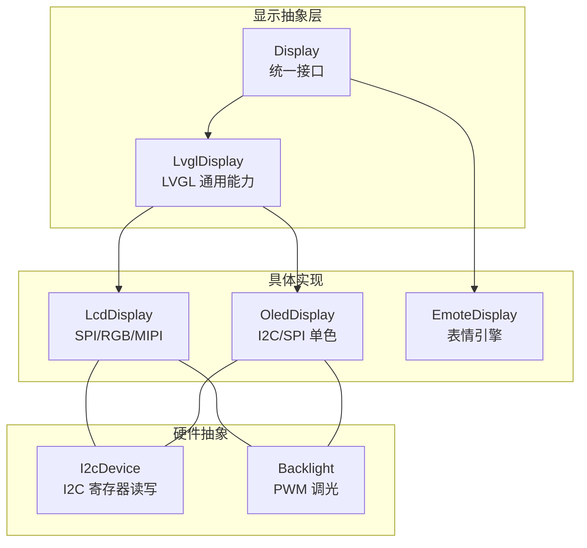
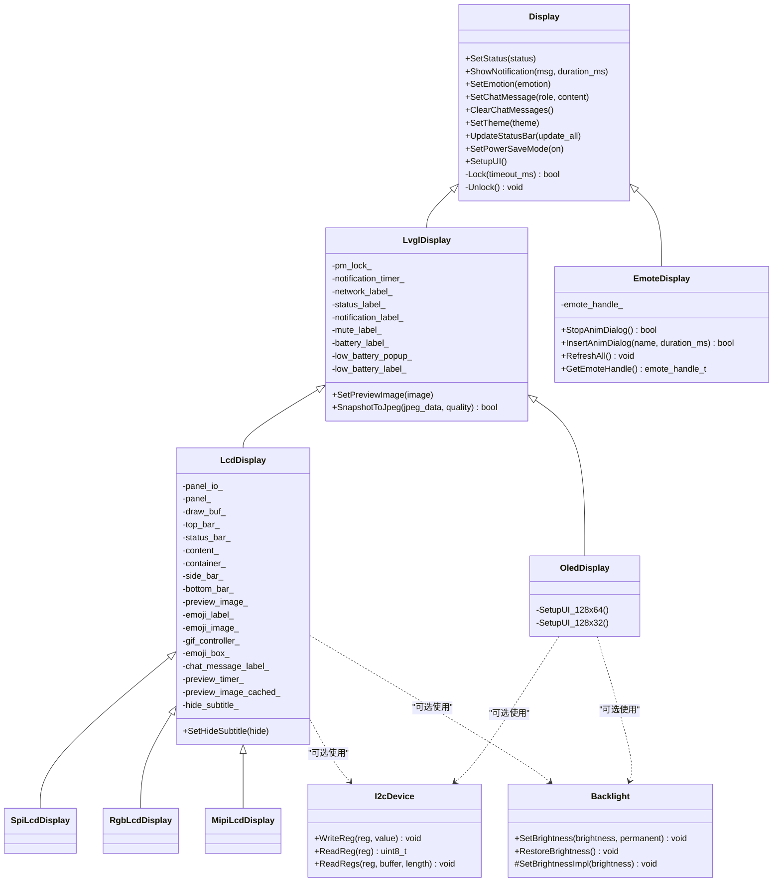
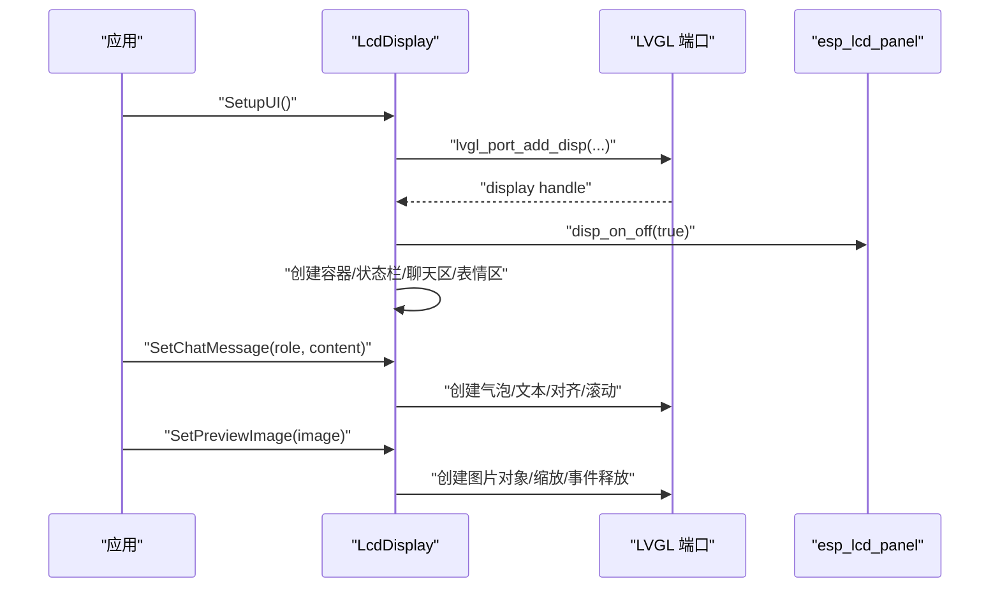
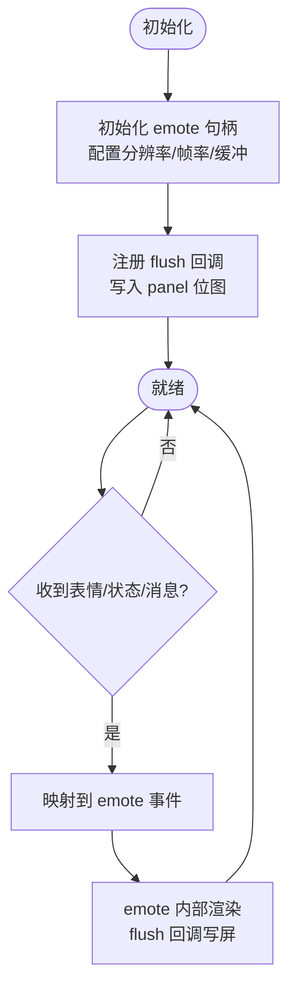
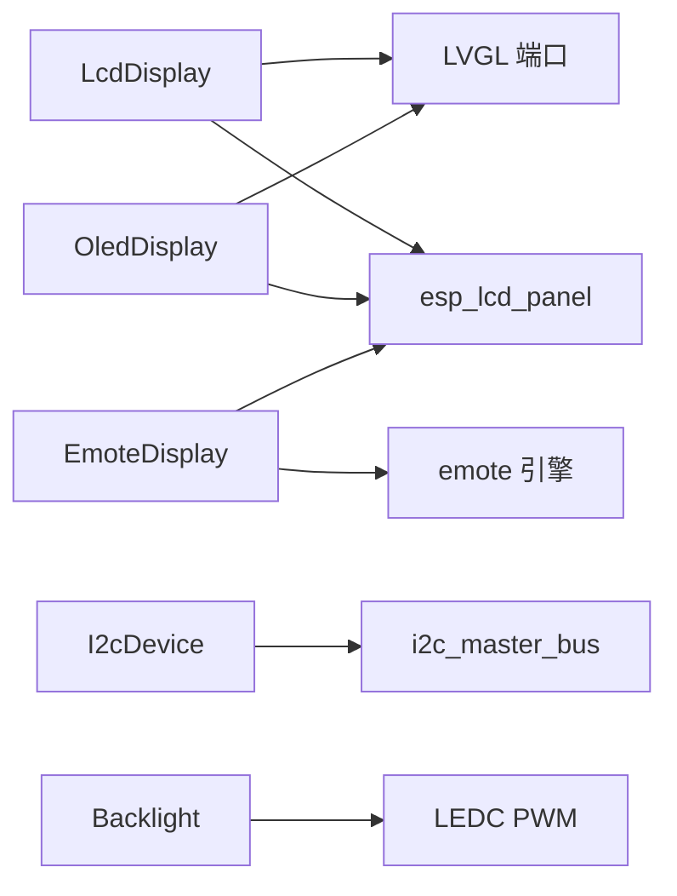
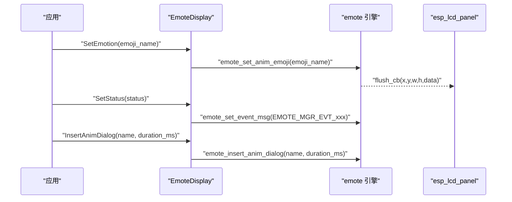

# 显示设备驱动

<cite>
**本文引用的文件**   
- [display.h](file://main/display/display.h)
- [lvgl_display.h](file://main/display/lvgl_display/lvgl_display.h)
- [lvgl_display.cc](file://main/display/lvgl_display/lvgl_display.cc)
- [lcd_display.h](file://main/display/lcd_display.h)
- [lcd_display.cc](file://main/display/lcd_display.cc)
- [oled_display.h](file://main/display/oled_display.h)
- [oled_display.cc](file://main/display/oled_display.cc)
- [emote_display.h](file://main/display/emote_display.h)
- [emote_display.cc](file://main/display/emote_display.cc)
- [i2c_device.h](file://main/boards/common/i2c_device.h)
- [i2c_device.cc](file://main/boards/common/i2c_device.cc)
- [backlight.h](file://main/boards/common/backlight.h)
- [backlight.cc](file://main/boards/common/backlight.cc)
- [Kconfig.projbuild](file://main/Kconfig.projbuild)
- [CMakeLists.txt](file://main/CMakeLists.txt)
- [assets.h](file://main/assets.h)
- [assets.cc](file://main/assets.cc)
</cite>

## 目录
1. [简介](#简介)
2. [项目结构](#项目结构)
3. [核心组件](#核心组件)
4. [架构总览](#架构总览)
5. [详细组件分析](#详细组件分析)
6. [依赖关系分析](#依赖关系分析)
7. [性能与刷新优化](#性能与刷新优化)
8. [表情显示系统](#表情显示系统)
9. [多分辨率适配策略](#多分辨率适配策略)
10. [新增显示设备驱动指南](#新增显示设备驱动指南)
11. [故障诊断与排错](#故障诊断与排错)
12. [结论](#结论)

## 简介
本技术文档面向显示设备驱动，覆盖 LCD 与 OLED 两类屏幕的驱动架构、SPI/I2C 通信协议、屏幕初始化序列、像素绘制优化；并深入说明不同分辨率屏幕的适配策略（参数配置、缓冲区管理、刷新率控制）、表情显示系统的实现原理（表情切换动画、状态指示逻辑），以及新增显示设备驱动的添加步骤与测试验证方法。最后提供常见显示问题的诊断与解决方案。

## 项目结构
显示子系统位于 main/display 目录，采用分层抽象：
- 顶层抽象 Display/LvglDisplay 定义统一接口与通用能力（通知、状态栏、电源管理等）
- LcdDisplay/OledDisplay 分别实现彩色 LCD 与单色 OLED 的具体 UI 布局与渲染
- EmoteDisplay 为表情驱动，基于 emote 引擎直接写屏
- I2cDevice 提供 I2C 寄存器读写封装，用于背光或面板控制
- Backlight 提供 PWM 调光与平滑过渡
- Kconfig/CMake 负责编译期选择屏幕类型与资源打包

图表来源
- [display.h:28-61](file://main/display/display.h#L28-L61)
- [lvgl_display.h:15-50](file://main/display/lvgl_display/lvgl_display.h#L15-L50)
- [lcd_display.h:17-83](file://main/display/lcd_display.h#L17-L83)
- [oled_display.h:10-39](file://main/display/oled_display.h#L10-L39)
- [emote_display.h:12-40](file://main/display/emote_display.h#L12-L40)
- [i2c_device.h:6-16](file://main/boards/common/i2c_device.h#L6-L16)
- [backlight.h:10-36](file://main/boards/common/backlight.h#L10-L36)

章节来源
- [display.h:28-61](file://main/display/display.h#L28-L61)
- [lvgl_display.h:15-50](file://main/display/lvgl_display/lvgl_display.h#L15-L50)
- [lcd_display.h:17-83](file://main/display/lcd_display.h#L17-L83)
- [oled_display.h:10-39](file://main/display/oled_display.h#L10-L39)
- [emote_display.h:12-40](file://main/display/emote_display.h#L12-L40)
- [i2c_device.h:6-16](file://main/boards/common/i2c_device.h#L6-L16)
- [backlight.h:10-36](file://main/boards/common/backlight.h#L10-L36)

## 核心组件
- Display：定义统一的显示抽象接口（设置状态、通知、表情、聊天消息、主题、锁等）
- LvglDisplay：在 Display 基础上增加 LVGL 相关能力（通知定时器、状态栏更新、截图转 JPEG、省电模式）
- LcdDisplay：基于 LVGL 的彩色 LCD 实现，支持 SPI/RGB/MIPI 三种总线，提供气泡式聊天、图片预览、GIF 播放、主题切换
- OledDisplay：基于 LVGL 的单色 OLED 实现，提供 128x64 与 128x32 两种布局
- EmoteDisplay：表情显示专用驱动，通过 emote 引擎直接调用底层 panel 绘制位图
- I2cDevice：I2C 设备封装，提供寄存器读写
- Backlight：背光控制基类与 PWM 实现，支持平滑渐变

章节来源
- [display.h:28-61](file://main/display/display.h#L28-L61)
- [lvgl_display.h:15-50](file://main/display/lvgl_display/lvgl_display.h#L15-L50)
- [lvgl_display.cc:18-70](file://main/display/lvgl_display/lvgl_display.cc#L18-L70)
- [lcd_display.h:17-83](file://main/display/lcd_display.h#L17-L83)
- [oled_display.h:10-39](file://main/display/oled_display.h#L10-L39)
- [emote_display.h:12-40](file://main/display/emote_display.h#L12-L40)
- [i2c_device.h:6-16](file://main/boards/common/i2c_device.h#L6-L16)
- [backlight.h:10-36](file://main/boards/common/backlight.h#L10-L36)

## 架构总览
显示子系统以 Display 为根，派生出 LvglDisplay 与 EmoteDisplay。LvglDisplay 进一步派生 LcdDisplay 与 OledDisplay，分别承载彩色与单色屏幕的 UI 与渲染。I2cDevice 与 Backlight 作为硬件抽象被上层复用。

图表来源
- [display.h:28-61](file://main/display/display.h#L28-L61)
- [lvgl_display.h:15-50](file://main/display/lvgl_display/lvgl_display.h#L15-L50)
- [lcd_display.h:17-83](file://main/display/lcd_display.h#L17-L83)
- [oled_display.h:10-39](file://main/display/oled_display.h#L10-L39)
- [emote_display.h:12-40](file://main/display/emote_display.h#L12-L40)
- [i2c_device.h:6-16](file://main/boards/common/i2c_device.h#L6-L16)
- [backlight.h:10-36](file://main/boards/common/backlight.h#L10-L36)

## 详细组件分析

### LCD 驱动（Spi/Rgb/Mipi）
- 初始化流程
  - 构造时创建 LVGL 端口与显示对象，按总线类型选择 add_disp/add_disp_rgb/add_disp_dsi
  - 配置缓冲区大小、双缓冲、旋转镜像、字节序、DMA 等标志
  - RGB/MIPI 可启用避免撕裂等特性
- UI 构建
  - 顶部状态栏、居中通知、聊天内容区、底部条、表情图标区域
  - 支持 GIF 控制器与图片预览缓存
- 聊天消息
  - 用户/助手/系统三类气泡，自动滚动与最大消息数限制
  - 系统消息折叠合并，空消息过滤
- 图片预览
  - 自适应缩放，事件回调释放内存，自动滚动到可视区域
- 主题与字体
  - 注册 light/dark 主题，动态切换文本/图标/大图标字体
- 锁机制
  - 通过 lvgl_port_lock/unlock 保证线程安全

图表来源
- [lcd_display.cc:92-172](file://main/display/lcd_display.cc#L92-L172)
- [lcd_display.cc:176-233](file://main/display/lcd_display.cc#L176-L233)
- [lcd_display.cc:235-284](file://main/display/lcd_display.cc#L235-L284)
- [lcd_display.cc:354-498](file://main/display/lcd_display.cc#L354-L498)
- [lcd_display.cc:504-698](file://main/display/lcd_display.cc#L504-L698)
- [lcd_display.cc:700-782](file://main/display/lcd_display.cc#L700-L782)

章节来源
- [lcd_display.h:17-83](file://main/display/lcd_display.h#L17-L83)
- [lcd_display.cc:92-172](file://main/display/lcd_display.cc#L92-L172)
- [lcd_display.cc:176-233](file://main/display/lcd_display.cc#L176-L233)
- [lcd_display.cc:235-284](file://main/display/lcd_display.cc#L235-L284)
- [lcd_display.cc:354-498](file://main/display/lcd_display.cc#L354-L498)
- [lcd_display.cc:504-698](file://main/display/lcd_display.cc#L504-L698)
- [lcd_display.cc:700-782](file://main/display/lcd_display.cc#L700-L782)

### OLED 驱动（单色）
- 初始化
  - 仅 dark 主题，monochrome=true，全分辨率缓冲
- 布局
  - 128x64：顶部图标行+居中状态/通知+左右分栏（表情+消息）
  - 128x32：左侧表情+右侧状态/通知/消息列
- 消息与表情
  - 长文本循环滚动，表情用 FontAwesome 字符映射

章节来源
- [oled_display.h:10-39](file://main/display/oled_display.h#L10-L39)
- [oled_display.cc:20-81](file://main/display/oled_display.cc#L20-L81)
- [oled_display.cc:83-96](file://main/display/oled_display.cc#L83-L96)
- [oled_display.cc:168-298](file://main/display/oled_display.cc#L168-L298)
- [oled_display.cc:300-385](file://main/display/oled_display.cc#L300-L385)
- [oled_display.cc:387-408](file://main/display/oled_display.cc#L387-L408)

### 表情显示驱动（EmoteDisplay）
- 初始化
  - 创建 emote 句柄，配置分辨率、帧率、双缓冲、任务优先级/栈大小
  - 注册 flush 回调将帧数据写入 esp_lcd_panel
- 交互
  - SetEmotion/SetStatus/SetChatMessage 映射到 emote 事件
  - 支持插入/停止动画对话、强制刷新全部
- 资源
  - 通过 Assets::EmoteStrategy 挂载 assets 分区并加载表情资源

图表来源
- [emote_display.cc:74-112](file://main/display/emote_display.cc#L74-L112)
- [emote_display.cc:118-127](file://main/display/emote_display.cc#L118-L127)
- [emote_display.cc:137-176](file://main/display/emote_display.cc#L137-L176)
- [emote_display.cc:224-248](file://main/display/emote_display.cc#L224-L248)
- [assets.cc:361-426](file://main/assets.cc#L361-L426)

章节来源
- [emote_display.h:12-40](file://main/display/emote_display.h#L12-L40)
- [emote_display.cc:74-112](file://main/display/emote_display.cc#L74-L112)
- [emote_display.cc:118-127](file://main/display/emote_display.cc#L118-L127)
- [emote_display.cc:137-176](file://main/display/emote_display.cc#L137-L176)
- [emote_display.cc:224-248](file://main/display/emote_display.cc#L224-L248)
- [assets.cc:361-426](file://main/assets.cc#L361-L426)

### 通用 LVGL 能力（LvglDisplay）
- 通知与状态栏
  - 通知定时器隐藏通知并恢复状态文本
  - 定时更新时间、静音图标、电池电量、网络图标
- 截图转 JPEG
  - 取屏快照、字节序交换、流式编码输出
- 省电模式
  - 清空聊天、切换表情为睡眠/中性

章节来源
- [lvgl_display.h:15-50](file://main/display/lvgl_display/lvgl_display.h#L15-L50)
- [lvgl_display.cc:18-70](file://main/display/lvgl_display/lvgl_display.cc#L18-L70)
- [lvgl_display.cc:72-111](file://main/display/lvgl_display/lvgl_display.cc#L72-L111)
- [lvgl_display.cc:113-219](file://main/display/lvgl_display/lvgl_display.cc#L113-L219)
- [lvgl_display.cc:221-274](file://main/display/lvgl_display/lvgl_display.cc#L221-L274)

### I2C 设备与背光
- I2cDevice
  - 基于 i2c_master_bus_add_device 注册设备，提供寄存器读写
- Backlight/PwmBacklight
  - 支持持久化亮度、平滑过渡（定时器步进）、底层 LEDC PWM 控制

章节来源
- [i2c_device.h:6-16](file://main/boards/common/i2c_device.h#L6-L16)
- [i2c_device.cc:8-35](file://main/boards/common/i2c_device.cc#L8-L35)
- [backlight.h:10-36](file://main/boards/common/backlight.h#L10-L36)
- [backlight.cc:43-89](file://main/boards/common/backlight.cc#L43-L89)

## 依赖关系分析
- 组件耦合
  - LcdDisplay/OledDisplay 强依赖 LVGL 端口与 esp_lcd 面板句柄
  - EmoteDisplay 依赖 emote 引擎与 esp_lcd 面板
  - I2cDevice/Backlight 为可选硬件抽象，被具体板级代码组合使用
- 外部依赖
  - ESP-IDF LVGL 端口、esp_lcd、esp_timer、esp_pm、FreeRTOS
  - 资源系统（Assets）根据是否启用 LVGL 选择策略

图表来源
- [lcd_display.cc:92-172](file://main/display/lcd_display.cc#L92-L172)
- [oled_display.cc:20-81](file://main/display/oled_display.cc#L20-L81)
- [emote_display.cc:74-112](file://main/display/emote_display.cc#L74-L112)
- [i2c_device.cc:8-35](file://main/boards/common/i2c_device.cc#L8-L35)
- [backlight.cc:84-89](file://main/boards/common/backlight.cc#L84-L89)

章节来源
- [lcd_display.cc:92-172](file://main/display/lcd_display.cc#L92-L172)
- [oled_display.cc:20-81](file://main/display/oled_display.cc#L20-L81)
- [emote_display.cc:74-112](file://main/display/emote_display.cc#L74-L112)
- [i2c_device.cc:8-35](file://main/boards/common/i2c_device.cc#L8-L35)
- [backlight.cc:84-89](file://main/boards/common/backlight.cc#L84-L89)

## 性能与刷新优化
- 缓冲区与双缓冲
  - SPI LCD 默认单缓冲，RGB 启用双缓冲与直接模式，MIPI 开启软件旋转
  - 缓冲区大小按宽度倍数配置，平衡内存与刷新吞吐
- DMA 与字节序
  - 启用 buff_dma，部分总线需 swap_bytes=1
- 图像缓存
  - PSRAM 大于阈值时启用 LVGL 图像缓存，降低 PNG 解码开销
- 刷新节流
  - 状态栏每 10 秒更新一次网络图标，低电量弹窗仅在时钟 tick 触发时检查
- 截图压缩
  - 使用回调式 JPEG 编码器，避免一次性分配大块内存

章节来源
- [lcd_display.cc:116-172](file://main/display/lcd_display.cc#L116-L172)
- [lcd_display.cc:176-233](file://main/display/lcd_display.cc#L176-L233)
- [lcd_display.cc:235-284](file://main/display/lcd_display.cc#L235-L284)
- [lvgl_display.cc:113-219](file://main/display/lvgl_display/lvgl_display.cc#L113-L219)
- [lvgl_display.cc:234-274](file://main/display/lvgl_display/lvgl_display.cc#L234-L274)

## 表情显示系统
- 表情切换动画
  - 通过 emote_set_anim_emoji 设置当前表情动画
  - 支持插入/停止动画对话，强制刷新全部
- 状态指示逻辑
  - SetStatus 将“监听/待机/说话/错误”等状态映射为 emote 事件
  - SetChatMessage 区分系统消息与语音消息，系统消息含特定链接时走特殊事件
- 资源加载
  - EmoteStrategy 挂载 assets 分区，mmap 启用后加载表情资源

图表来源
- [emote_display.cc:137-176](file://main/display/emote_display.cc#L137-L176)
- [emote_display.cc:224-248](file://main/display/emote_display.cc#L224-L248)
- [assets.cc:361-426](file://main/assets.cc#L361-L426)

章节来源
- [emote_display.h:12-40](file://main/display/emote_display.h#L12-L40)
- [emote_display.cc:137-176](file://main/display/emote_display.cc#L137-L176)
- [emote_display.cc:224-248](file://main/display/emote_display.cc#L224-L248)
- [assets.cc:361-426](file://main/assets.cc#L361-L426)

## 多分辨率适配策略
- 屏幕参数配置
  - Kconfig 提供多种预设屏幕型号与尺寸选项，便于编译期选择
  - 各板级可通过 pin_config/config.json 指定引脚与面板参数
- 缓冲区管理
  - 单色 OLED 使用整屏缓冲；彩色 LCD 按行块缓冲，RGB/MIPI 可启用双缓冲
- 刷新率控制
  - emote 引擎默认 30fps；LVGL 端口 timer_period_ms 可调
- 偏移与旋转
  - 支持 offset_x/y、mirror_x/y、swap_xy 适配不同模组物理方向

章节来源
- [Kconfig.projbuild:739-783](file://main/Kconfig.projbuild#L739-L783)
- [lcd_display.cc:137-172](file://main/display/lcd_display.cc#L137-L172)
- [oled_display.cc:49-77](file://main/display/oled_display.cc#L49-L77)
- [emote_display.cc:81-103](file://main/display/emote_display.cc#L81-L103)

## 新增显示设备驱动指南
- 硬件接口定义
  - 若使用 I2C 面板或外设，参考 I2cDevice 封装进行地址与速度配置
  - 若需要背光控制，继承 Backlight 并实现 SetBrightnessImpl，或使用 PwmBacklight
- 驱动适配步骤
  - 新建显示类（如 XxxDisplay），继承自 LvglDisplay 或 Display
  - 在构造函数中初始化 esp_lcd_panel_io 与 panel，调用 lvgl_port_add_disp 或对应 API
  - 实现 SetupUI，创建必要的 UI 元素（状态栏、聊天区、表情区等）
  - 覆写 Lock/Unlock 以适配 LVGL 端口锁
  - 如需自定义布局，参考 OledDisplay 的 128x64/128x32 分支
- 测试验证方法
  - 调用 SetStatus/ShowNotification/SetEmotion/SetChatMessage 验证基础功能
  - 使用 SnapshotToJpeg 截取屏幕，确认像素正确性
  - 调整缓冲区大小与双缓冲开关，观察刷新流畅度与内存占用
  - 对 I2C 设备执行 ReadReg/WriteReg 校验寄存器状态
  - 调节 Backlight.SetBrightness 验证渐亮/渐灭效果

章节来源
- [i2c_device.h:6-16](file://main/boards/common/i2c_device.h#L6-L16)
- [i2c_device.cc:8-35](file://main/boards/common/i2c_device.cc#L8-L35)
- [backlight.h:10-36](file://main/boards/common/backlight.h#L10-L36)
- [backlight.cc:43-89](file://main/boards/common/backlight.cc#L43-L89)
- [lvgl_display.cc:234-274](file://main/display/lvgl_display/lvgl_display.cc#L234-L274)
- [oled_display.cc:83-96](file://main/display/oled_display.cc#L83-L96)

## 故障诊断与排错
- 常见问题
  - 未调用 SetupUI 即调用 SetStatus/SetChatMessage/ShowNotification：会丢失消息
  - 屏幕无显示：检查 disp_on_off 返回值与 panel 初始化顺序
  - 颜色异常：确认 color_format、swap_bytes、rotation/mirror 配置
  - 刷新卡顿：增大缓冲区、启用双缓冲、关闭不必要的动画
  - 低电量提示不出现：确认 UpdateStatusBar 周期性触发与电池读取正常
- 定位建议
  - 查看日志中的 “Failed to add display”、“Failed to take snapshot” 等关键信息
  - 使用 SnapshotToJpeg 获取当前帧，对比预期布局
  - 对 I2C 设备读回寄存器，确认面板处于期望状态
  - 调整 backlight 频率与占空比，排除电感啸叫或闪烁

章节来源
- [lvgl_display.cc:72-111](file://main/display/lvgl_display/lvgl_display.cc#L72-L111)
- [lvgl_display.cc:234-274](file://main/display/lvgl_display/lvgl_display.cc#L234-L274)
- [lcd_display.cc:104-111](file://main/display/lcd_display.cc#L104-L111)
- [backlight.cc:84-89](file://main/boards/common/backlight.cc#L84-L89)

## 结论
本项目显示子系统以清晰的抽象层次与可扩展的组件设计，覆盖了从单色 OLED 到彩色 LCD、从 SPI 到 RGB/MIPI 的多场景需求。通过 LVGL 端口与 emote 引擎的双通道渲染路径，既保证了 UI 丰富性，也兼顾了表情动画的性能与功耗。配合完善的资源系统与背光控制，开发者可快速适配新显示设备并稳定集成至产品。