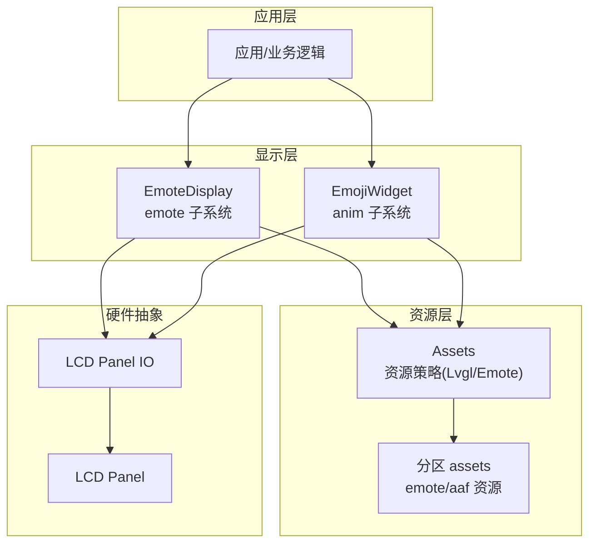
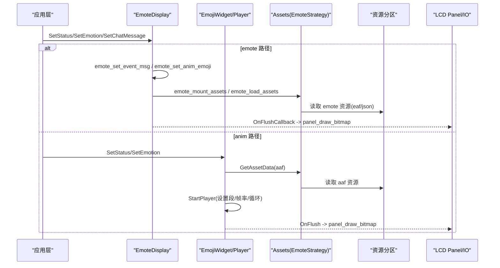
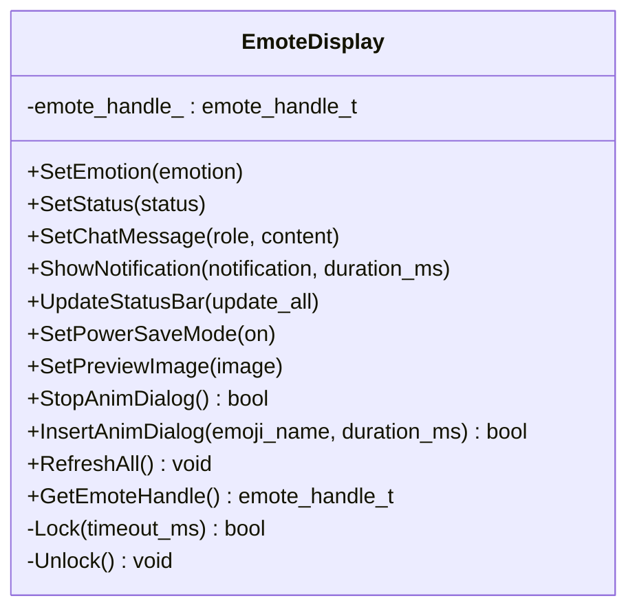
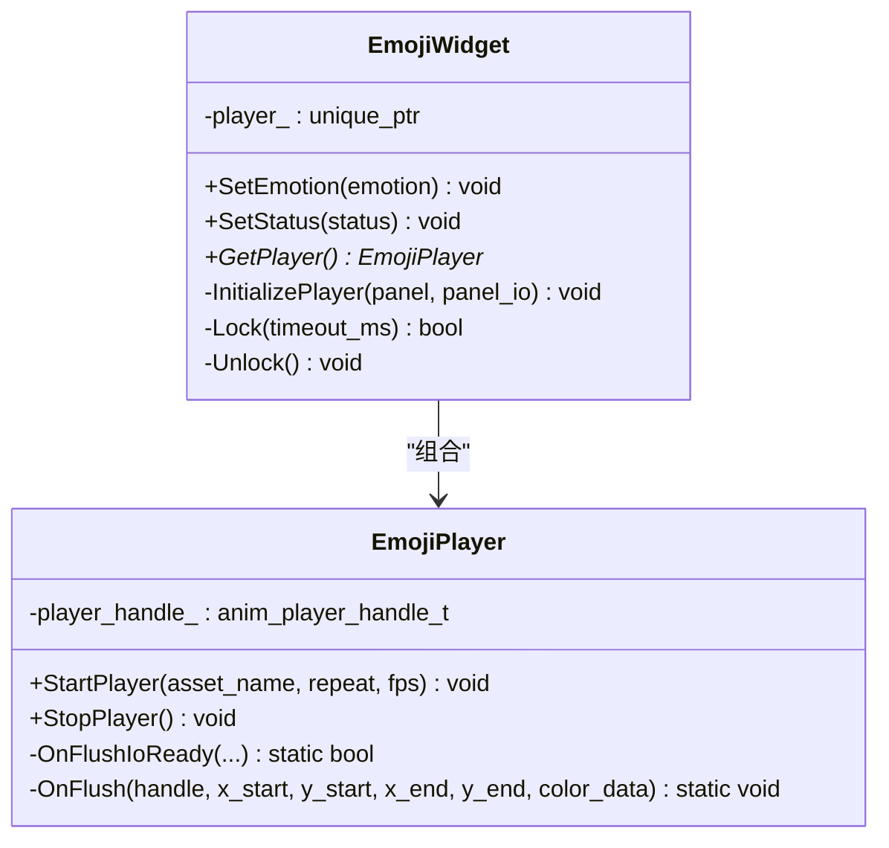
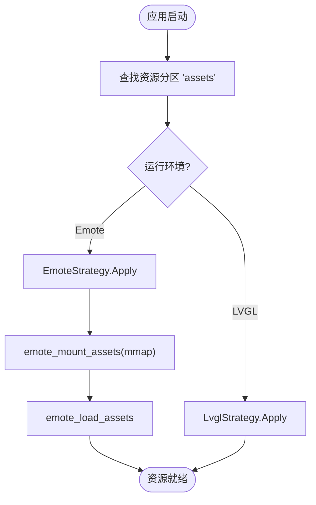
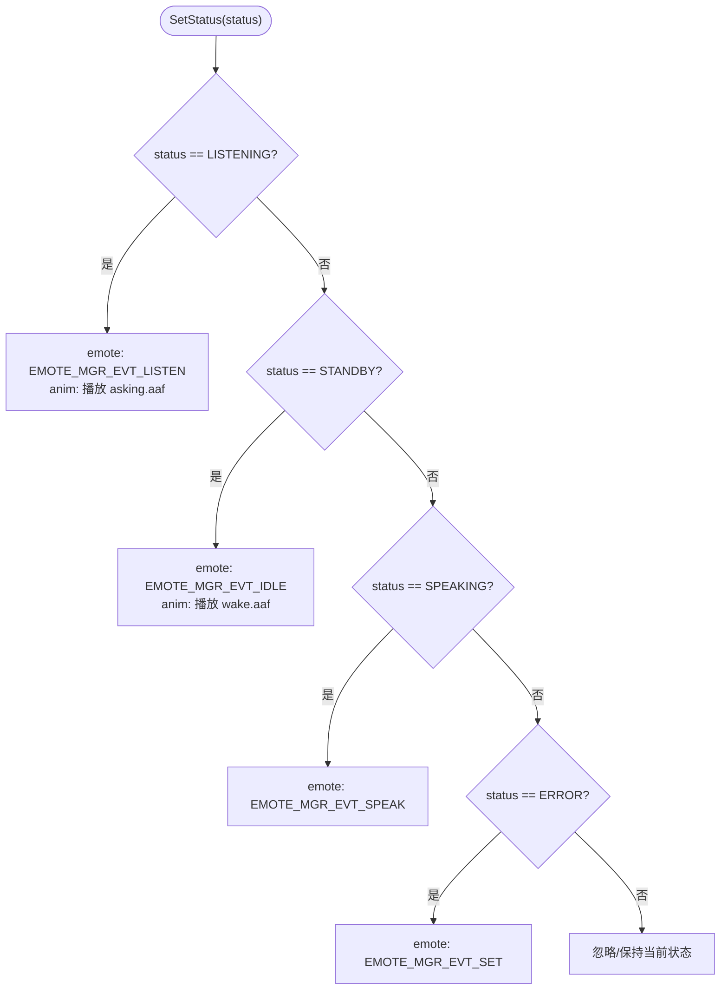
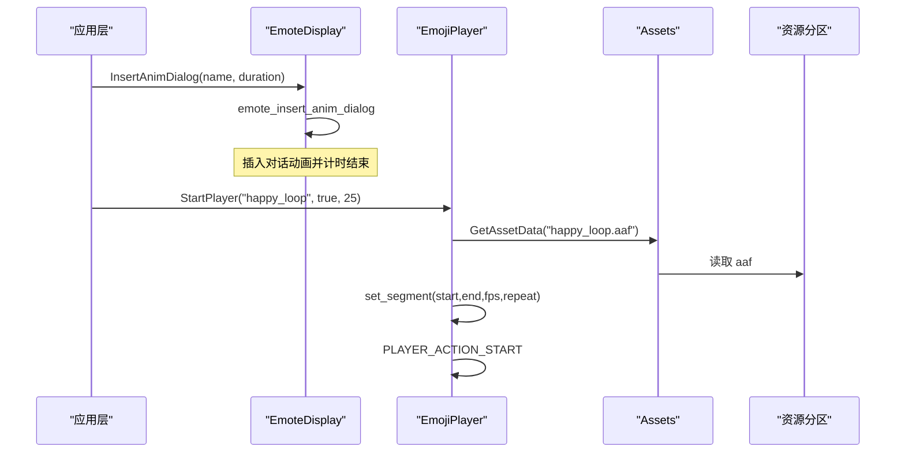
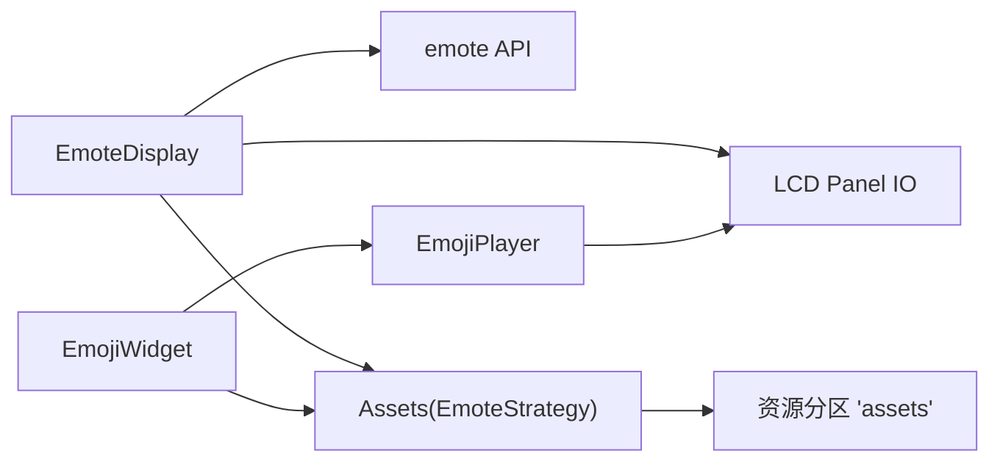

# 表情显示系统

<cite>
**本文引用的文件**   
- [emote_display.h](file://main/display/emote_display.h)
- [emote_display.cc](file://main/display/emote_display.cc)
- [emoji_display.h](file://main/boards/esp-hi/emoji_display.h)
- [emoji_display.cc](file://main/boards/esp-hi/emoji_display.cc)
- [electron_emoji_display.cc](file://main/boards/electron-bot/electron_emoji_display.cc)
- [assets.h](file://main/assets.h)
- [assets.cc](file://main/assets.cc)
- [CMakeLists.txt](file://main/CMakeLists.txt)
- [emote.json](file://main/boards/esp-vocat/assets/360_360/emote.json)
</cite>

## 目录
1. [简介](#简介)
2. [项目结构](#项目结构)
3. [核心组件](#核心组件)
4. [架构总览](#架构总览)
5. [详细组件分析](#详细组件分析)
6. [依赖关系分析](#依赖关系分析)
7. [性能考虑](#性能考虑)
8. [故障排查指南](#故障排查指南)
9. [结论](#结论)
10. [附录](#附录)

## 简介
本技术文档围绕“表情显示系统”展开，覆盖以下关键主题：
- 表情状态管理机制：包括表情切换逻辑、动画过渡效果与状态持久化策略。
- 表情资源组织：文件格式、索引管理、动态加载机制。
- 设备状态关联：连接、音频播放、错误等状态对应的表情展示。
- 定制开发指南：新增表情、实现动画效果、性能优化策略。
- 性能监控与调试：如何观察与定位问题。

该系统在工程中提供两套实现路径：
- emote 子系统（通用）：通过 emote API 驱动表情动画，适配多种硬件平台。
- anim 子系统（特定板级）：基于 esp-hi 的 EmojiPlayer/EmojiWidget，面向 AAF 格式动画。

## 项目结构
与表情显示相关的核心代码分布在如下位置：
- 通用 emote 显示层：main/display/emote_display.{h,cc}
- 板级 anim 显示层：main/boards/esp-hi/emoji_display.{h,cc}
- 板级 UI 集成示例：main/boards/electron-bot/electron_emoji_display.cc
- 资源管理与挂载：main/assets.{h,cc}
- 构建期资源清单与下载：main/CMakeLists.txt
- 表情资源映射配置（eaf）：main/boards/esp-vocat/assets/360_360/emote.json

图表来源
- [emote_display.cc:118-127](file://main/display/emote_display.cc#L118-L127)
- [emoji_display.cc:44-65](file://main/boards/esp-hi/emoji_display.cc#L44-L65)
- [assets.cc:365-387](file://main/assets.cc#L365-L387)

章节来源
- [emote_display.h:1-43](file://main/display/emote_display.h#L1-L43)
- [emote_display.cc:1-250](file://main/display/emote_display.cc#L1-L250)
- [emoji_display.h:1-56](file://main/boards/esp-hi/emoji_display.h#L1-L56)
- [emoji_display.cc:1-179](file://main/boards/esp-hi/emoji_display.cc#L1-L179)
- [assets.h:1-90](file://main/assets.h#L1-L90)
- [assets.cc:1-433](file://main/assets.cc#L1-L433)
- [CMakeLists.txt:1129-1153](file://main/CMakeLists.txt#L1129-L1153)
- [emote.json:1-25](file://main/boards/esp-vocat/assets/360_360/emote.json#L1-L25)

## 核心组件
- EmoteDisplay（emote 子系统）
  - 负责初始化 emote 引擎、注册 LCD 刷新回调、将上层状态/消息转换为 emote 事件或动画。
  - 支持插入/停止对话动画、刷新全量、设置预览图等扩展能力。
- EmojiWidget/EmojiPlayer（anim 子系统）
  - 面向 esp-hi 板级，使用 AAF 动画资源，内部维护播放器句柄与帧缓冲，按 FPS 渲染到 LCD。
  - 提供 SetEmotion/SetStatus 接口，将语义状态映射为具体动画片段。
- Assets（资源策略）
  - 统一资源访问入口，根据运行环境选择 LvglStrategy 或 EmoteStrategy。
  - EmoteStrategy 负责挂载/卸载 emote 资源分区，并通过 emote_get_asset_data_by_name 获取数据。
- 构建期资源清单
  - CMakeLists 中定义 esp-hi 所需的 AAF 资源列表，并在构建时下载/打包。
- 表情映射配置（eaf）
  - emote.json 描述 emote 名称到 eaf 文件的映射，包含循环与帧率参数。

章节来源
- [emote_display.h:12-43](file://main/display/emote_display.h#L12-L43)
- [emote_display.cc:137-250](file://main/display/emote_display.cc#L137-L250)
- [emoji_display.h:18-56](file://main/boards/esp-hi/emoji_display.h#L18-L56)
- [emoji_display.cc:18-179](file://main/boards/esp-hi/emoji_display.cc#L18-L179)
- [assets.h:49-78](file://main/assets.h#L49-L78)
- [assets.cc:365-426](file://main/assets.cc#L365-L426)
- [CMakeLists.txt:1140-1153](file://main/CMakeLists.txt#L1140-L1153)
- [emote.json:1-25](file://main/boards/esp-vocat/assets/360_360/emote.json#L1-L25)

## 架构总览
下图展示了从应用层到硬件层的完整调用链，以及两种实现路径（emote 与 anim）的资源加载方式。

图表来源
- [emote_display.cc:162-176](file://main/display/emote_display.cc#L162-L176)
- [emote_display.cc:137-143](file://main/display/emote_display.cc#L137-L143)
- [assets.cc:365-387](file://main/assets.cc#L365-L387)
- [assets.cc:398-414](file://main/assets.cc#L398-L414)
- [emoji_display.cc:76-98](file://main/boards/esp-hi/emoji_display.cc#L76-L98)
- [emoji_display.cc:38-42](file://main/boards/esp-hi/emoji_display.cc#L38-L42)

## 详细组件分析

### EmoteDisplay（emote 子系统）
职责与流程
- 初始化 emote 引擎并注册 LCD 刷新完成回调，确保帧同步。
- 将上层状态映射为 emote 事件：监听、空闲、说话、错误等。
- 将聊天消息转为系统或说话事件，必要时对换行进行替换处理。
- 支持插入/停止对话动画、刷新全量、设置预览图（当前未实现）。

图表来源
- [emote_display.h:12-43](file://main/display/emote_display.h#L12-L43)

章节来源
- [emote_display.cc:118-127](file://main/display/emote_display.cc#L118-L127)
- [emote_display.cc:137-176](file://main/display/emote_display.cc#L137-L176)
- [emote_display.cc:178-250](file://main/display/emote_display.cc#L178-L250)

### EmojiWidget/EmojiPlayer（anim 子系统）
职责与流程
- 初始化动画播放器，注册 LCD 刷新回调，默认启动连接态动画。
- 将语义状态映射为 AAF 动画片段，支持循环与自定义 FPS。
- 通过 Assets 获取 aaf 资源，设置播放段与帧率后启动。

图表来源
- [emoji_display.h:18-56](file://main/boards/esp-hi/emoji_display.h#L18-L56)
- [emoji_display.cc:44-65](file://main/boards/esp-hi/emoji_display.cc#L44-L65)
- [emoji_display.cc:76-105](file://main/boards/esp-hi/emoji_display.cc#L76-L105)

章节来源
- [emoji_display.cc:18-29](file://main/boards/esp-hi/emoji_display.cc#L18-L29)
- [emoji_display.cc:117-162](file://main/boards/esp-hi/emoji_display.cc#L117-L162)

### 资源组织与动态加载
- 资源策略
  - EmoteStrategy：挂载 emote 资源分区，提供按名称获取资源数据的接口；Apply 阶段触发 emote_load_assets。
  - LvglStrategy：用于 LVGL 场景下的资源映射与校验（非本主题重点）。
- 资源分区
  - 通过分区标签“assets”查找并映射资源，emote 子系统以 mmap 方式高效访问。
- 构建期资源清单
  - esp-hi 的 AAF 资源在 CMakeLists 中声明，构建时自动下载/打包至二进制。
- 表情映射配置（eaf）
  - emote.json 定义 emote 名称到 eaf 文件的映射，含 loop 与 fps 字段，供 emote 子系统解析。

图表来源
- [assets.cc:365-387](file://main/assets.cc#L365-L387)
- [assets.cc:416-426](file://main/assets.cc#L416-L426)
- [CMakeLists.txt:1140-1153](file://main/CMakeLists.txt#L1140-L1153)
- [emote.json:1-25](file://main/boards/esp-vocat/assets/360_360/emote.json#L1-L25)

章节来源
- [assets.h:49-78](file://main/assets.h#L49-L78)
- [assets.cc:365-426](file://main/assets.cc#L365-L426)
- [CMakeLists.txt:1129-1153](file://main/CMakeLists.txt#L1129-L1153)
- [emote.json:1-25](file://main/boards/esp-vocat/assets/360_360/emote.json#L1-L25)

### 设备状态与表情关联
- emote 路径
  - 监听：LISTENING → EMOTE_MGR_EVT_LISTEN
  - 待机：STANDBY → EMOTE_MGR_EVT_IDLE
  - 说话：SPEAKING → EMOTE_MGR_EVT_SPEAK
  - 错误：ERROR → EMOTE_MGR_EVT_SET
  - 聊天消息：system 类型且包含特定域名时作为系统事件，否则作为说话事件。
- anim 路径
  - LISTENING → 播放 asking.aaf
  - STANDBY → 播放 wake.aaf
  - 其他情绪通过 emotion_map 映射到对应 aaf 片段，支持不同 FPS 与循环。

图表来源
- [emote_display.cc:162-176](file://main/display/emote_display.cc#L162-L176)
- [emoji_display.cc:153-162](file://main/boards/esp-hi/emoji_display.cc#L153-L162)

章节来源
- [emote_display.cc:162-176](file://main/display/emote_display.cc#L162-L176)
- [emoji_display.cc:153-162](file://main/boards/esp-hi/emoji_display.cc#L153-L162)

### 表情切换与动画过渡
- emote 路径
  - 通过 emote_set_anim_emoji 直接切换表情动画；emote_insert_anim_dialog 可插入临时对话动画；StopAnimDialog 可中断。
- anim 路径
  - 通过 StartPlayer 设置源数据、片段范围与 FPS，再启动播放；StopPlayer 停止播放。
  - 针对特定片段（如 wake）可调整起始帧以实现更自然的过渡。

图表来源
- [emote_display.cc:233-240](file://main/display/emote_display.cc#L233-L240)
- [emoji_display.cc:76-98](file://main/boards/esp-hi/emoji_display.cc#L76-L98)

章节来源
- [emote_display.cc:224-240](file://main/display/emote_display.cc#L224-L240)
- [emoji_display.cc:76-98](file://main/boards/esp-hi/emoji_display.cc#L76-L98)

### 状态持久化
- 当前实现中未发现显式的表情状态持久化逻辑（无写入 NVS/Flash 的代码）。
- 建议方案（概念性指导）：
  - 在状态变更时记录最近一次表情/状态到 NVS，重启后恢复。
  - 或使用配置文件（如 emote.json）作为静态映射，无需运行时持久化。

[本节为概念性说明，不直接分析具体文件]

## 依赖关系分析
- EmoteDisplay 依赖 emote 引擎与 LCD 面板 IO，通过回调将帧数据绘制到屏幕。
- EmojiWidget/EmojiPlayer 依赖 anim 播放器与 LCD 面板 IO，通过回调绘制位图。
- Assets 提供统一的资源访问接口，并根据运行环境选择策略。
- 构建脚本负责将 esp-hi 所需 AAF 资源纳入构建产物。

图表来源
- [emote_display.cc:118-127](file://main/display/emote_display.cc#L118-L127)
- [emoji_display.cc:44-65](file://main/boards/esp-hi/emoji_display.cc#L44-L65)
- [assets.cc:365-387](file://main/assets.cc#L365-L387)

章节来源
- [emote_display.cc:118-127](file://main/display/emote_display.cc#L118-L127)
- [emoji_display.cc:44-65](file://main/boards/esp-hi/emoji_display.cc#L44-L65)
- [assets.cc:365-387](file://main/assets.cc#L365-L387)

## 性能考虑
- 双缓冲与 DMA
  - emote 初始化配置启用 double_buffer，有助于降低掉帧风险。
- 任务优先级与栈大小
  - emote 任务优先级较高（5），栈空间较大（6KB），适合实时渲染。
  - anim 播放器任务优先级较低（1），栈空间较小（4KB），需避免阻塞。
- 帧率控制
  - 不同表情可设置不同 FPS，例如眨眼类动画使用更低 FPS 以降低负载。
- 资源映射
  - emote 资源采用 mmap 方式，减少内存拷贝开销。
- 刷新回调
  - 通过 LCD 传输完成回调通知播放器/引擎继续下一帧，避免忙等。

章节来源
- [emote_display.cc:81-112](file://main/display/emote_display.cc#L81-L112)
- [emoji_display.cc:48-65](file://main/boards/esp-hi/emoji_display.cc#L48-L65)
- [assets.cc:372-387](file://main/assets.cc#L372-L387)

## 故障排查指南
常见问题与定位方法
- 资源未找到
  - 现象：获取 aaf/emote 资源失败日志。
  - 检查：资源分区是否挂载成功；emote.json 映射是否正确；构建是否包含所需资源。
- 动画不播放
  - 现象：SetEmotion/SetStatus 调用后无变化。
  - 检查：播放器是否已初始化；是否调用了 StartPlayer；FPS/片段范围是否合理。
- 卡顿或掉帧
  - 现象：动画卡顿。
  - 检查：任务优先级与栈大小；LCD 刷新回调是否正常触发；是否频繁切换高 FPS 动画。
- 状态映射异常
  - 现象：状态变化未触发预期表情。
  - 检查：语言常量匹配（如 LISTENING/STANDBY/SPEAKING/ERROR）；emote 事件是否发送。

章节来源
- [emoji_display.cc:84-88](file://main/boards/esp-hi/emoji_display.cc#L84-L88)
- [assets.cc:398-414](file://main/assets.cc#L398-L414)
- [emote_display.cc:162-176](file://main/display/emote_display.cc#L162-L176)

## 结论
本项目提供了两条表情显示路径：
- emote 子系统：通用性强，通过事件与对话动画管理表达设备状态，适合多平台复用。
- anim 子系统：面向 esp-hi 板级，使用 AAF 动画，灵活度高，便于精细控制过渡与帧率。

资源管理采用策略模式，统一对外暴露 GetAssetData 接口，简化上层调用。构建期资源清单与运行时挂载相结合，兼顾开发与部署效率。建议在需要持久化的场景中引入 NVS 存储最近状态，以提升用户体验。

## 附录

### 定制开发指南
- 新增表情（emote 路径）
  - 准备 eaf 资源并放入资源分区。
  - 在 emote.json 中添加 emote 名称到 eaf 的映射，指定 loop 与 fps。
  - 通过 SetEmotion 或 InsertAnimDialog 触发。
- 新增表情（anim 路径）
  - 准备 aaf 资源，并在 CMakeLists 中声明以便构建期下载/打包。
  - 在 emoji_asset_name_map 中添加名称到 aaf 的映射。
  - 在 emotion_map 中将语义表情映射到 aaf 片段与 FPS。
- 动画过渡效果
  - 通过设置片段起止帧与 FPS，实现进入/退出过渡。
  - 对于特殊片段（如 wake）可调整起始帧以获得自然过渡。
- 性能优化策略
  - 合理设置 FPS，避免高频切换。
  - 使用双缓冲与 mmap 资源访问。
  - 控制任务优先级与栈大小，避免阻塞。

章节来源
- [emote.json:1-25](file://main/boards/esp-vocat/assets/360_360/emote.json#L1-L25)
- [CMakeLists.txt:1140-1153](file://main/CMakeLists.txt#L1140-L1153)
- [emoji_display.cc:18-29](file://main/boards/esp-hi/emoji_display.cc#L18-L29)
- [emoji_display.cc:117-151](file://main/boards/esp-hi/emoji_display.cc#L117-L151)
- [emote_display.cc:233-240](file://main/display/emote_display.cc#L233-L240)