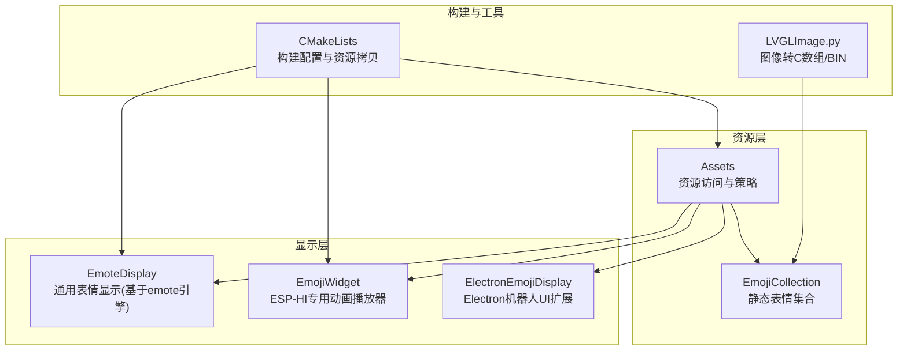
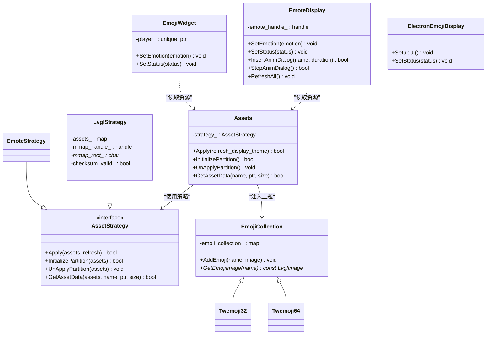
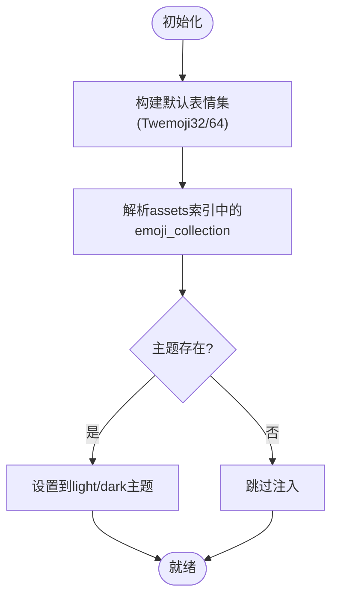
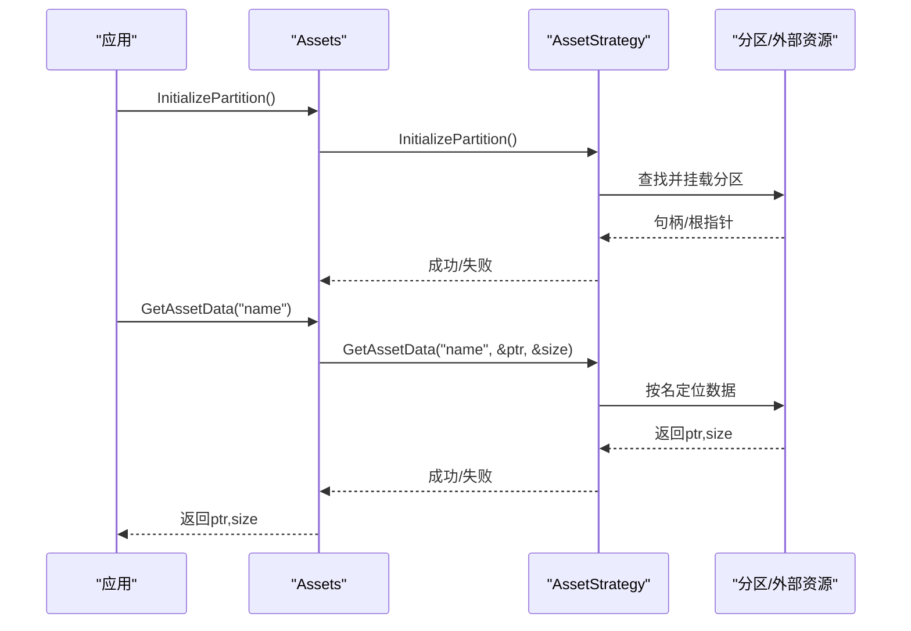
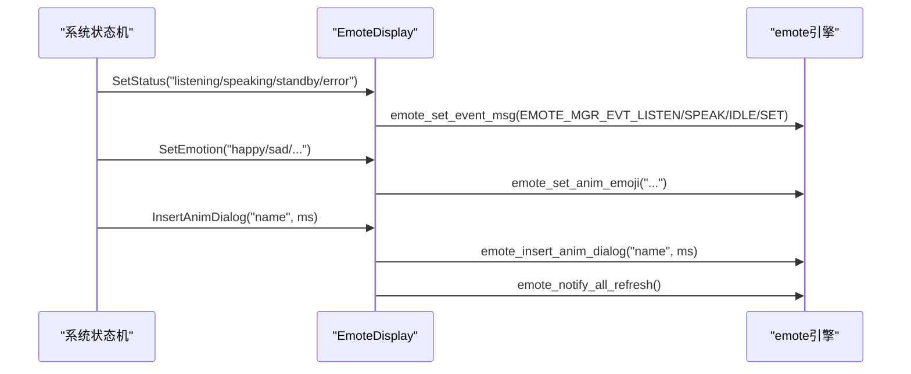
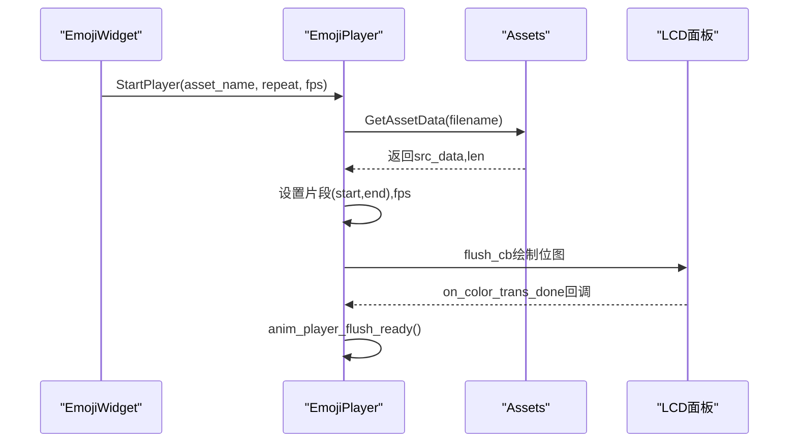
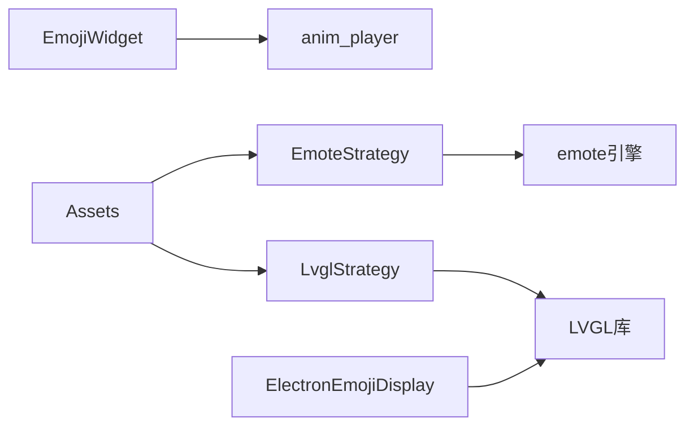

# 表情动画系统

<cite>
**本文引用的文件**   
- [assets.h](file://main/assets.h)
- [assets.cc](file://main/assets.cc)
- [emoji_collection.h](file://main/display/lvgl_display/emoji_collection.h)
- [emoji_collection.cc](file://main/display/lvgl_display/emoji_collection.cc)
- [emote_display.h](file://main/display/emote_display.h)
- [emote_display.cc](file://main/display/emote_display.cc)
- [emoji_display.h](file://main/boards/esp-hi/emoji_display.h)
- [emoji_display.cc](file://main/boards/esp-hi/emoji_display.cc)
- [electron_emoji_display.h](file://main/boards/electron-bot/electron_emoji_display.h)
- [electron_emoji_display.cc](file://main/boards/electron-bot/electron_emoji_display.cc)
- [lvgl_theme.cc](file://main/display/lvgl_display/lvgl_theme.cc)
- [CMakeLists.txt](file://main/CMakeLists.txt)
- [LVGLImage.py](file://scripts/Image_Converter/LVGLImage.py)
</cite>

## 目录
1. [简介](#简介)
2. [项目结构](#项目结构)
3. [核心组件](#核心组件)
4. [架构总览](#架构总览)
5. [详细组件分析](#详细组件分析)
6. [依赖关系分析](#依赖关系分析)
7. [性能与内存优化](#性能与内存优化)
8. [故障排查指南](#故障排查指南)
9. [结论](#结论)
10. [附录：自定义表情工作流](#附录自定义表情工作流)

## 简介
本技术文档围绕“表情动画系统”展开，聚焦以下目标：
- EmojiCollection类设计与表情资源管理机制（数据格式、加载策略、内存优化）
- 表情动画实现原理（帧动画、过渡效果、状态同步）
- 设备状态到表情的映射（连接、音频、错误等）
- 自定义表情添加方法（格式转换、动画序列定义、资源打包工具）
- 性能优化技巧与调试方法，提供完整的系统集成方案

## 项目结构
表情动画系统由三层组成：
- 资源层：Assets负责从分区或外部资源获取图片/动画数据；EmojiCollection维护静态表情集合。
- 显示层：EmoteDisplay/EmojiWidget/ElectronEmojiDisplay将表情渲染到屏幕，驱动底层LCD。
- 构建与工具层：CMake脚本与Python脚本完成表情资源编译、打包与下载。

图表来源
- [assets.h:49-78](file://main/assets.h#L49-L78)
- [assets.cc:262-286](file://main/assets.cc#L262-L286)
- [emote_display.h:12-43](file://main/display/emote_display.h#L12-L43)
- [emoji_display.h:18-56](file://main/boards/esp-hi/emoji_display.h#L18-L56)
- [electron_emoji_display.h:9-20](file://main/boards/electron-bot/electron_emoji_display.h#L9-L20)
- [CMakeLists.txt:1112-1138](file://main/CMakeLists.txt#L1112-L1138)
- [LVGLImage.py:306-386](file://scripts/Image_Converter/LVGLImage.py#L306-L386)

章节来源
- [assets.h:49-78](file://main/assets.h#L49-L78)
- [assets.cc:262-286](file://main/assets.cc#L262-L286)
- [emote_display.h:12-43](file://main/display/emote_display.h#L12-L43)
- [emoji_display.h:18-56](file://main/boards/esp-hi/emoji_display.h#L18-L56)
- [electron_emoji_display.h:9-20](file://main/boards/electron-bot/electron_emoji_display.h#L9-L20)
- [CMakeLists.txt:1112-1138](file://main/CMakeLists.txt#L1112-L1138)
- [LVGLImage.py:306-386](file://scripts/Image_Converter/LVGLImage.py#L306-L386)

## 核心组件
- Assets：统一资源访问抽象，支持两种策略（LvglStrategy/EmoteStrategy），负责分区挂载、校验、按名取数据、主题刷新与下载更新。
- EmojiCollection：静态表情名称到图像对象的映射，内置Twemoji32/Twemoji64两套默认集。
- EmoteDisplay：通用表情显示实现，封装emote引擎初始化、事件消息、动画对话框插入与刷新。
- EmojiWidget（ESP-HI）：基于anim_player的动画播放，将状态/情绪映射为AAS/AAT等动画片段。
- ElectronEmojiDisplay：在LVGL UI基础上扩展状态图标与默认表情。

章节来源
- [assets.h:49-78](file://main/assets.h#L49-L78)
- [assets.cc:262-286](file://main/assets.cc#L262-L286)
- [emoji_collection.h:14-32](file://main/display/lvgl_display/emoji_collection.h#L14-L32)
- [emoji_collection.cc:9-28](file://main/display/lvgl_display/emoji_collection.cc#L9-L28)
- [emote_display.h:12-43](file://main/display/emote_display.h#L12-L43)
- [emote_display.cc:137-176](file://main/display/emote_display.cc#L137-L176)
- [emoji_display.h:18-56](file://main/boards/esp-hi/emoji_display.h#L18-L56)
- [emoji_display.cc:117-162](file://main/boards/esp-hi/emoji_display.cc#L117-L162)
- [electron_emoji_display.cc:16-35](file://main/boards/electron-bot/electron_emoji_display.cc#L16-L35)

## 架构总览
表情系统采用“资源-显示-构建”分层设计，通过策略模式适配不同后端（LVGL静态图 vs emote动画）。

图表来源
- [assets.h:49-78](file://main/assets.h#L49-L78)
- [assets.cc:262-286](file://main/assets.cc#L262-L286)
- [emoji_collection.h:14-32](file://main/display/lvgl_display/emoji_collection.h#L14-L32)
- [emote_display.h:12-43](file://main/display/emote_display.h#L12-L43)
- [emoji_display.h:18-56](file://main/boards/esp-hi/emoji_display.h#L18-L56)
- [electron_emoji_display.h:9-20](file://main/boards/electron-bot/electron_emoji_display.h#L9-L20)

## 详细组件分析

### EmojiCollection 设计与资源管理
- 职责：维护“表情名 -> 图像对象”的映射，提供增删查接口，析构时释放图像指针。
- 默认集合：Twemoji32/Twemoji64分别注册一组常用表情名到LVGL源图像。
- 动态扩展：Assets在解析assets索引时，可创建自定义EmojiCollection并注入主题。

图表来源
- [emoji_collection.cc:9-28](file://main/display/lvgl_display/emoji_collection.cc#L9-L28)
- [emoji_collection.cc:53-75](file://main/display/lvgl_display/emoji_collection.cc#L53-L75)
- [emoji_collection.cc:101-123](file://main/display/lvgl_display/emoji_collection.cc#L101-L123)
- [assets.cc:262-286](file://main/assets.cc#L262-L286)

章节来源
- [emoji_collection.h:14-32](file://main/display/lvgl_display/emoji_collection.h#L14-L32)
- [emoji_collection.cc:9-28](file://main/display/lvgl_display/emoji_collection.cc#L9-L28)
- [emoji_collection.cc:53-75](file://main/display/lvgl_display/emoji_collection.cc#L53-L75)
- [emoji_collection.cc:101-123](file://main/display/lvgl_display/emoji_collection.cc#L101-L123)
- [assets.cc:262-286](file://main/assets.cc#L262-L286)

### 表情资源加载策略（Assets）
- 策略模式：根据是否启用LVGL选择LvglStrategy或EmoteStrategy。
- 分区挂载：查找名为“assets”的分区，计算校验和，按需mmap或直接加载。
- 按名取数：通过GetAssetData返回内存指针与长度，避免重复拷贝。
- 主题刷新：Apply中可选择刷新显示主题。

图表来源
- [assets.h:49-78](file://main/assets.h#L49-L78)
- [assets.cc:365-414](file://main/assets.cc#L365-L414)

章节来源
- [assets.h:49-78](file://main/assets.h#L49-L78)
- [assets.cc:365-414](file://main/assets.cc#L365-L414)

### 表情动画实现（EmoteDisplay）
- 初始化：创建emote引擎实例，配置分辨率、帧率、缓冲区大小、双缓冲、DMA标志等。
- 事件映射：SetStatus/SetEmotion/SetChatMessage将系统状态转换为emote事件消息。
- 动画对话框：支持插入指定时长动画与停止当前动画。
- 刷新：通知全部刷新以应对热插拔或主题切换。

图表来源
- [emote_display.cc:137-176](file://main/display/emote_display.cc#L137-L176)
- [emote_display.cc:224-248](file://main/display/emote_display.cc#L224-L248)
- [emote_display.h:12-43](file://main/display/emote_display.h#L12-L43)

章节来源
- [emote_display.h:12-43](file://main/display/emote_display.h#L12-L43)
- [emote_display.cc:137-176](file://main/display/emote_display.cc#L137-L176)
- [emote_display.cc:224-248](file://main/display/emote_display.cc#L224-L248)

### ESP-HI 表情动画（EmojiWidget/EmojiPlayer）
- 资源映射：将情绪/状态字符串映射到具体动画资产名（如happy_loop.aaf）。
- 播放控制：StartPlayer/StopPlayer，设置片段范围与FPS，循环播放。
- 回调链路：面板IO完成回调触发播放器的flush_ready，确保流畅渲染。

图表来源
- [emoji_display.cc:76-98](file://main/boards/esp-hi/emoji_display.cc#L76-L98)
- [emoji_display.cc:31-42](file://main/boards/esp-hi/emoji_display.cc#L31-L42)
- [emoji_display.h:18-56](file://main/boards/esp-hi/emoji_display.h#L18-L56)

章节来源
- [emoji_display.h:18-56](file://main/boards/esp-hi/emoji_display.h#L18-L56)
- [emoji_display.cc:76-98](file://main/boards/esp-hi/emoji_display.cc#L76-L98)
- [emoji_display.cc:31-42](file://main/boards/esp-hi/emoji_display.cc#L31-L42)

### ElectronEmojiDisplay 状态图标与默认表情
- 继承LVGL LCD显示基类，复用字幕标签等UI对象。
- 根据状态切换图标字体与隐藏/显示网络/电池标签。
- 初始化后设置默认表情为“staticstate”。

章节来源
- [electron_emoji_display.cc:16-35](file://main/boards/electron-bot/electron_emoji_display.cc#L16-L35)
- [electron_emoji_display.cc:38-80](file://main/boards/electron-bot/electron_emoji_display.cc#L38-L80)
- [electron_emoji_display.h:9-20](file://main/boards/electron-bot/electron_emoji_display.h#L9-L20)

## 依赖关系分析
- 组件耦合：
  - Assets与显示层解耦，通过策略与按名取数接口交互。
  - EmojiCollection仅依赖LVGL图像类型，便于替换为其他图像后端。
  - EmoteDisplay/EmojiWidget各自独立实现，面向不同硬件平台。
- 外部依赖：
  - LVGL用于静态表情与UI主题。
  - emote/anim_player用于动画播放。
  - ESP-IDF分区与SPI Flash用于资源存储。

图表来源
- [assets.h:49-78](file://main/assets.h#L49-L78)
- [emote_display.h:12-43](file://main/display/emote_display.h#L12-L43)
- [emoji_display.h:18-56](file://main/boards/esp-hi/emoji_display.h#L18-L56)

章节来源
- [assets.h:49-78](file://main/assets.h#L49-L78)
- [emote_display.h:12-43](file://main/display/emote_display.h#L12-L43)
- [emoji_display.h:18-56](file://main/boards/esp-hi/emoji_display.h#L18-L56)

## 性能与内存优化
- 资源访问
  - 优先使用mmap减少拷贝，仅在必要时复制数据。
  - 按名取数返回指针与长度，避免二次分配。
- 显示缓冲
  - 双缓冲与合理缓冲区像素数量，降低卡顿。
  - DMA关闭时的CPU路径需评估带宽与功耗。
- 动画参数
  - 合理设置FPS与片段起止，避免全量重绘。
  - 对高频切换的状态使用轻量动画或静态帧。
- 主题与集合
  - 预构建Twemoji集合，减少运行时开销。
  - 自定义集合按需注入，避免全局膨胀。

[本节为通用指导，不直接分析具体文件]

## 故障排查指南
- 资源未找到
  - 现象：日志提示未找到字体或表情文件。
  - 排查：确认assets分区已挂载且包含对应条目；检查GetAssetData返回值。
- 分区无效
  - 现象：分区未找到或校验失败。
  - 排查：检查分区标签、校验逻辑与Apply流程。
- 表情未显示
  - 现象：SetEmotion/SetStatus无变化。
  - 排查：确认emote_handle有效；检查事件映射与动画对话框插入。
- 动画卡顿
  - 现象：掉帧或延迟。
  - 排查：调整FPS、缓冲区大小；检查flush回调链路与DMA配置。

章节来源
- [assets.cc:256-261](file://main/assets.cc#L256-L261)
- [assets.cc:365-387](file://main/assets.cc#L365-L387)
- [emote_display.cc:137-176](file://main/display/emote_display.cc#L137-L176)
- [emote_display.cc:224-248](file://main/display/emote_display.cc#L224-L248)

## 结论
表情动画系统通过策略化资源访问与多后端显示实现，兼顾静态表情与动态动画场景。EmojiCollection提供可扩展的静态表情集，EmoteDisplay与EmojiWidget分别覆盖通用与平台特定需求。结合构建脚本与转换工具，开发者可高效集成与定制表情资源。

[本节为总结性内容，不直接分析具体文件]

## 附录：自定义表情工作流

### 静态表情（LVGL）
- 准备PNG源图，使用LVGLImage.py生成C数组或BIN。
- 在assets索引中添加emoji_collection条目（name/file），系统自动注入主题。
- 如需新增Twemoji变体，可在EmojiCollection派生类中注册新映射。

章节来源
- [LVGLImage.py:306-386](file://scripts/Image_Converter/LVGLImage.py#L306-L386)
- [assets.cc:262-286](file://main/assets.cc#L262-L286)
- [emoji_collection.h:14-32](file://main/display/lvgl_display/emoji_collection.h#L14-L32)

### 动画表情（emote/anim_player）
- 准备动画素材（如aaf/aas），通过CMake复制到目标目录或从远程下载。
- 在EmojiWidget中补充情绪/状态到动画资产的映射。
- 使用Assets.GetAssetData加载数据，设置片段与FPS后启动播放。

章节来源
- [CMakeLists.txt:1112-1138](file://main/CMakeLists.txt#L1112-L1138)
- [CMakeLists.txt:1140-1153](file://main/CMakeLists.txt#L1140-L1153)
- [emoji_display.cc:76-98](file://main/boards/esp-hi/emoji_display.cc#L76-L98)

### 设备状态到表情映射参考
- 连接状态：connecting/wake/asking
- 音频状态：listening/speaking
- 错误状态：error（映射到SET事件）
- 空闲状态：standby

章节来源
- [emoji_display.cc:19-29](file://main/boards/esp-hi/emoji_display.cc#L19-L29)
- [emote_display.cc:162-176](file://main/display/emote_display.cc#L162-L176)