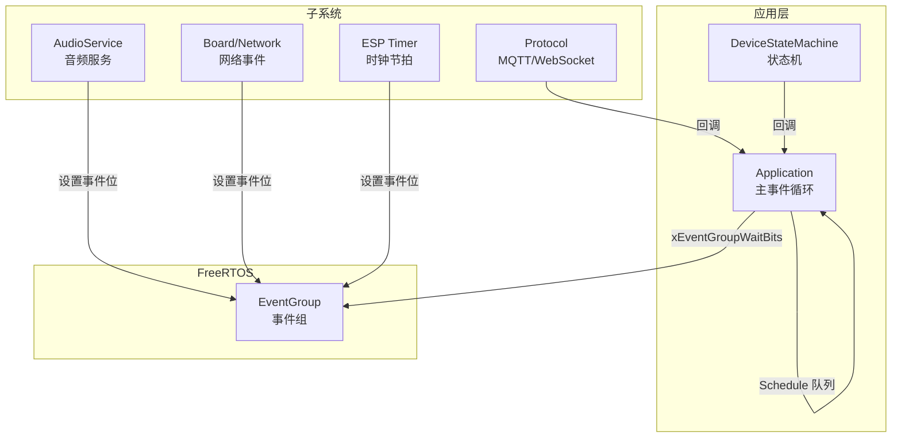
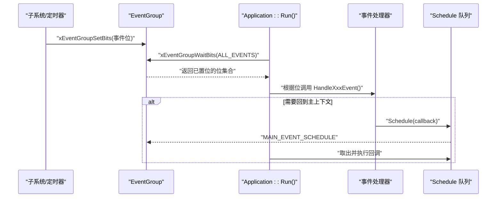
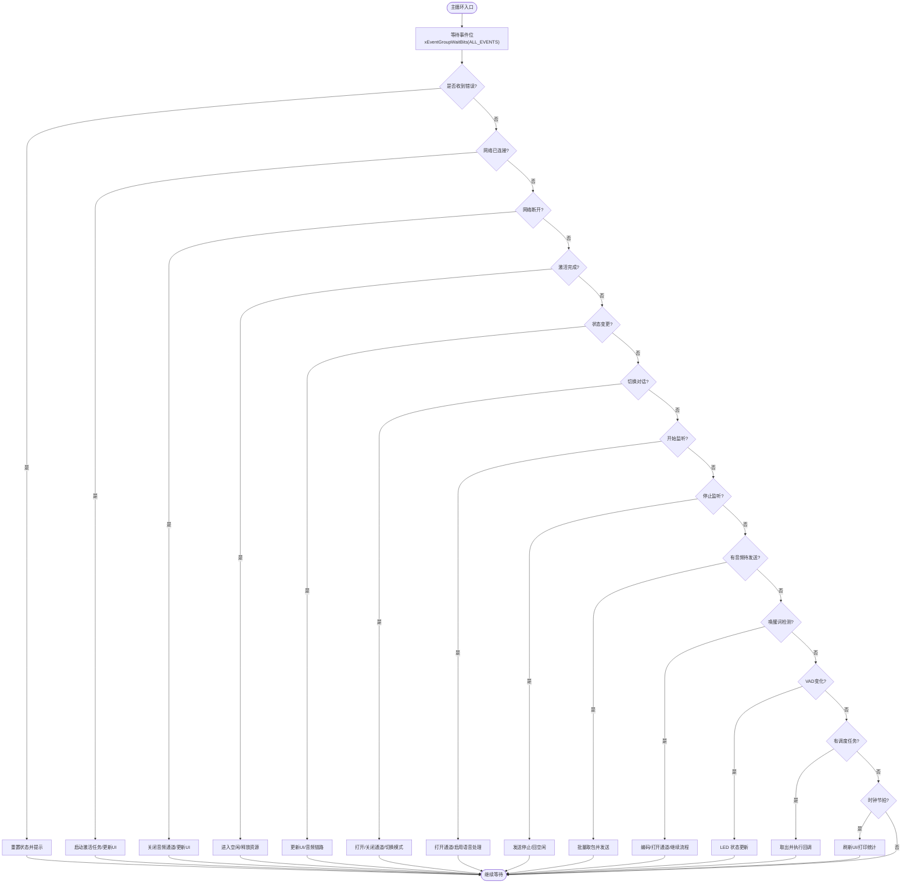
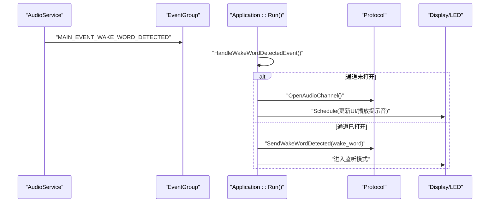

# 事件驱动系统

<cite>
**本文引用的文件**
- [application.h](file://main/application.h)
- [application.cc](file://main/application.cc)
- [device_state_machine.h](file://main/device_state_machine.h)
- [device_state_machine.cc](file://main/device_state_machine.cc)
</cite>

## 目录
1. [简介](#简介)
2. [项目结构](#项目结构)
3. [核心组件](#核心组件)
4. [架构总览](#架构总览)
5. [详细组件分析](#详细组件分析)
6. [依赖关系分析](#依赖关系分析)
7. [性能考量](#性能考量)
8. [故障排查指南](#故障排查指南)
9. [结论](#结论)
10. [附录：最佳实践与示例](#附录最佳实践与示例)

## 简介
本技术文档聚焦于基于 FreeRTOS EventGroup 的事件驱动系统，围绕 Application 主循环、事件位定义、事件创建/等待/处理流程展开，详细说明预定义事件（如 MAIN_EVENT_SCHEDULE、MAIN_EVENT_SEND_AUDIO 等）的用途与触发条件。文档还涵盖事件优先级处理、跨任务通信机制、异步事件处理模式、事件处理器注册机制、事件传播路径，并提供系统设计最佳实践与自定义事件示例。

## 项目结构
本项目采用“单应用中心调度 + 多模块回调”的事件驱动架构。Application 作为唯一的主事件循环持有者，负责统一接收来自各子系统（音频、网络、定时器、状态机等）的事件，并分派到对应处理器。设备状态机通过回调将状态变更转化为事件，从而解耦 UI、音频、协议层之间的耦合。



图表来源
- [application.h:21-34](file://main/application.h#L21-L34)
- [application.cc:23-47](file://main/application.cc#L23-L47)
- [application.cc:165-258](file://main/application.cc#L165-L258)
- [device_state_machine.cc:148-161](file://main/device_state_machine.cc#L148-L161)

章节来源
- [application.h:21-34](file://main/application.h#L21-L34)
- [application.cc:23-47](file://main/application.cc#L23-L47)
- [application.cc:165-258](file://main/application.cc#L165-L258)
- [device_state_machine.cc:148-161](file://main/device_state_machine.cc#L148-L161)

## 核心组件
- 事件组与事件位
  - 事件组在 Application 构造时创建，用于跨任务同步与通知。
  - 事件位集中定义在主头文件中，覆盖调度、音频发送、唤醒词检测、VAD 变化、错误、激活完成、时钟节拍、网络连接/断开、对话切换、开始/停止监听、状态变更等。
- 主事件循环
  - 主任务以高优先级运行，使用 xEventGroupWaitBits 阻塞等待任意事件位被置位，随后按位判断并调用相应处理器。
- 异步调度器
  - 提供 Schedule 接口，允许从任意线程安全地将回调推入主任务队列，并通过 MAIN_EVENT_SCHEDULE 唤醒主循环执行。
- 设备状态机
  - 管理设备状态转换，并在状态变更后通过回调通知 Application，后者将其转换为 MAIN_EVENT_STATE_CHANGED 事件。

章节来源
- [application.h:21-34](file://main/application.h#L21-L34)
- [application.cc:23-47](file://main/application.cc#L23-L47)
- [application.cc:165-258](file://main/application.cc#L165-L258)
- [application.cc:934-940](file://main/application.cc#L934-L940)
- [device_state_machine.cc:148-161](file://main/device_state_machine.cc#L148-L161)

## 架构总览
下图展示了事件从产生到处理的完整路径：子系统或定时器置位事件位，主循环等待并分发；部分操作需要回到主上下文执行，则通过 Schedule 进入主任务队列。



图表来源
- [application.cc:23-47](file://main/application.cc#L23-L47)
- [application.cc:165-258](file://main/application.cc#L165-L258)
- [application.cc:934-940](file://main/application.cc#L934-L940)

## 详细组件分析

### 事件位定义与用途
- MAIN_EVENT_SCHEDULE：用于将回调从任意线程安全地调度到主任务执行。
- MAIN_EVENT_SEND_AUDIO：音频发送队列有数据可发时置位，主循环批量取包并发送。
- MAIN_EVENT_WAKE_WORD_DETECTED：唤醒词检测完成，触发后续对话流程。
- MAIN_EVENT_VAD_CHANGE：语音活动检测变化，用于 LED 等交互反馈。
- MAIN_EVENT_ERROR：协议层发生错误，主循环重置状态并提示用户。
- MAIN_EVENT_ACTIVATION_DONE：激活流程完成，进入空闲态。
- MAIN_EVENT_CLOCK_TICK：周期性时钟节拍，刷新 UI 与调试信息。
- MAIN_EVENT_NETWORK_CONNECTED / MAIN_EVENT_NETWORK_DISCONNECTED：网络状态变化。
- MAIN_EVENT_TOGGLE_CHAT / MAIN_EVENT_START_LISTENING / MAIN_EVENT_STOP_LISTENING：用户交互控制。
- MAIN_EVENT_STATE_CHANGED：设备状态变更，驱动 UI 与音频链路调整。

章节来源
- [application.h:21-34](file://main/application.h#L21-L34)
- [application.cc:165-258](file://main/application.cc#L165-L258)

### 事件创建与等待
- 事件组创建：在 Application 构造函数中创建 EventGroup。
- 事件等待：主循环使用 xEventGroupWaitBits 等待 ALL_EVENTS，参数 pdTRUE 表示清除已处理的位，pdFALSE 表示非累积模式（仅本次返回的位有效）。
- 事件处理：对每个置位的事件进行分支处理，必要时调用 Schedule 将工作迁移至主上下文。

章节来源
- [application.cc:23-47](file://main/application.cc#L23-L47)
- [application.cc:165-258](file://main/application.cc#L165-L258)

### 事件处理器与异步模式
- 网络事件：在网络回调中置位 CONNECTED/DISCONNECTED，主循环据此启动激活任务或关闭音频通道。
- 音频事件：音频服务回调置位 SEND_AUDIO/WAKE_WORD/VAD_CHANGE，主循环分别处理发送、唤醒词与 VAD 联动。
- 定时事件：ESP Timer 周期回调置位 CLOCK_TICK，主循环更新 UI 与打印堆统计。
- 状态机事件：状态机回调置位 STATE_CHANGED，主循环根据新状态初始化/停止音频处理、更新 UI。
- 异步调度：Schedule 将函数对象推入 deque，并置位 MAIN_EVENT_SCHEDULE，主循环批量执行，保证 UI 与协议访问在主上下文中串行化。

章节来源
- [application.cc:77-91](file://main/application.cc#L77-L91)
- [application.cc:102-156](file://main/application.cc#L102-L156)
- [application.cc:36-46](file://main/application.cc#L36-L46)
- [application.cc:934-940](file://main/application.cc#L934-L940)
- [device_state_machine.cc:148-161](file://main/device_state_machine.cc#L148-L161)

### 事件优先级与任务优先级
- 主任务优先级：主循环所在任务优先级设置为较高值，确保事件响应及时。
- 事件处理顺序：主循环内按固定顺序处理事件位，属于“轮询式优先级”。对于更严格的实时性需求，可在不同事件位上拆分多个等待或使用更高优先级的专用任务。
- 临界区保护：Schedule 内部使用互斥锁保护任务队列，避免并发写入。

章节来源
- [application.cc:165-167](file://main/application.cc#L165-L167)
- [application.cc:239-246](file://main/application.cc#L239-L246)
- [application.cc:934-940](file://main/application.cc#L934-L940)

### 事件队列管理与跨任务通信
- 事件队列：通过 EventGroup 实现轻量级跨任务通知，无数据负载，适合纯信号传递。
- 任务队列：Schedule 维护一个 std::deque<std::function<void()>>，支持携带复杂数据的回调，由主循环串行执行，避免竞态。
- 典型用法：网络回调、协议回调、OTA 进度更新等均通过 Schedule 回到主上下文。

章节来源
- [application.cc:934-940](file://main/application.cc#L934-L940)
- [application.cc:373-379](file://main/application.cc#L373-L379)
- [application.cc:521-607](file://main/application.cc#L521-L607)

### 事件处理器注册机制
- 状态机监听器：通过 AddStateChangeListener 注册回调，状态变更时统一触发 MAIN_EVENT_STATE_CHANGED。
- 音频服务回调：Initialize 阶段为 AudioService 设置 on_send_queue_available、on_wake_word_detected、on_vad_change 回调，内部置位对应事件。
- 网络事件回调：Board 的网络事件回调中置位网络相关事件。

章节来源
- [application.cc:77-91](file://main/application.cc#L77-L91)
- [application.cc:102-156](file://main/application.cc#L102-L156)
- [device_state_machine.cc:133-146](file://main/device_state_machine.cc#L133-L146)

### 事件传播路径
- 生产者：AudioService、Board/Network、ESP Timer、Protocol、DeviceStateMachine。
- 传输介质：EventGroup 事件位。
- 消费者：Application::Run 主循环，按位分发到具体处理器。
- 二次调度：处理器如需访问共享资源或更新 UI，使用 Schedule 回到主上下文。

章节来源
- [application.cc:165-258](file://main/application.cc#L165-L258)
- [application.cc:934-940](file://main/application.cc#L934-L940)

### 关键流程图：主事件循环


图表来源
- [application.cc:165-258](file://main/application.cc#L165-L258)

## 依赖关系分析
- Application 依赖 FreeRTOS EventGroup 和 Task API，以及 ESP Timer。
- Application 与 DeviceStateMachine 通过回调解耦，状态变更转化为事件。
- Application 与 AudioService 通过回调与事件位协作，实现音频生产/消费解耦。
- Application 与 Board/Network 通过回调桥接网络事件。
- Application 与 Protocol 通过回调桥接 JSON/音频流事件。

```mermaid
classDiagram
class Application {
+Initialize()
+Run()
+Schedule(callback)
+ToggleChatState()
+StartListening()
+StopListening()
-event_group_ : EventGroupHandle_t
-main_tasks_ : deque<function<void()>>
}
class DeviceStateMachine {
+TransitionTo(state) bool
+AddStateChangeListener(cb) int
-NotifyStateChange(old,new) void
}
class AudioService {
+SetCallbacks(...)
+PopPacketFromSendQueue()
+EnableVoiceProcessing(bool)
+PlaySound(sound)
}
class Board {
+SetNetworkEventCallback(cb)
+GetDisplay()
+GetLed()
}
class Protocol {
+OnConnected(cb)
+OnIncomingJson(cb)
+OpenAudioChannel()
+CloseAudioChannel()
+SendAudio(packet)
}
Application --> DeviceStateMachine : "监听状态变更"
Application --> AudioService : "音频回调/队列"
Application --> Board : "网络/UI/LED"
Application --> Protocol : "JSON/音频流"
```

图表来源
- [application.h:43-176](file://main/application.h#L43-L176)
- [device_state_machine.h:17-49](file://main/device_state_machine.h#L17-L49)
- [device_state_machine.cc:148-161](file://main/device_state_machine.cc#L148-L161)
- [application.cc:77-91](file://main/application.cc#L77-L91)
- [application.cc:102-156](file://main/application.cc#L102-L156)
- [application.cc:489-607](file://main/application.cc#L489-L607)

章节来源
- [application.h:43-176](file://main/application.h#L43-L176)
- [device_state_machine.h:17-49](file://main/device_state_machine.h#L17-L49)
- [device_state_machine.cc:148-161](file://main/device_state_machine.cc#L148-L161)
- [application.cc:77-91](file://main/application.cc#L77-L91)
- [application.cc:102-156](file://main/application.cc#L102-L156)
- [application.cc:489-607](file://main/application.cc#L489-L607)

## 性能考量
- 事件批处理：MAIN_EVENT_SEND_AUDIO 在主循环中批量取包发送，减少频繁 I/O 与上下文切换开销。
- 主循环优先级：主任务优先级设为较高值，降低事件延迟。
- 临界区最小化：Schedule 仅在入队时加锁，出队后在主上下文执行，避免长时间持锁。
- 定时器粒度：CLOCK_TICK 每秒一次，兼顾 UI 刷新与系统统计，避免高频中断影响。
- 幂等与去抖：事件位采用“一次性处理”语义（pdTRUE），避免重复处理。

[本节为通用指导，不直接分析具体文件]

## 故障排查指南
- 事件未触发
  - 检查生产者是否正确调用 xEventGroupSetBits。
  - 确认主循环等待的 ALL_EVENTS 包含目标事件位。
- 主循环卡顿
  - 检查处理器中是否存在阻塞操作；应使用 Schedule 将耗时任务迁移至后台或拆分为多次执行。
- 状态不一致
  - 确认 SetDeviceState 调用路径合法，避免非法状态跳转。
- 音频丢包
  - 关注 MAIN_EVENT_SEND_AUDIO 处理逻辑，确保协议发送成功且队列消费完整。

章节来源
- [application.cc:165-258](file://main/application.cc#L165-L258)
- [application.cc:934-940](file://main/application.cc#L934-L940)
- [device_state_machine.cc:119-131](file://main/device_state_machine.cc#L119-L131)

## 结论
该事件驱动系统以 FreeRTOS EventGroup 为核心，结合 Application 主循环与 Schedule 异步调度，实现了松耦合、可扩展的跨任务通信机制。通过明确的事件位定义与处理器分发，系统具备良好的可维护性与可观测性。建议遵循命名规范、错误处理策略与性能优化建议，以确保系统在复杂场景下的稳定性与实时性。

[本节为总结，不直接分析具体文件]

## 附录：最佳实践与示例

### 事件命名规范
- 前缀一致：使用 MAIN_EVENT_ 前缀标识应用级事件。
- 语义清晰：名称反映业务含义，如 MAIN_EVENT_SEND_AUDIO、MAIN_EVENT_NETWORK_CONNECTED。
- 位宽合理：预留高位以便扩展，避免冲突。

章节来源
- [application.h:21-34](file://main/application.h#L21-L34)

### 错误处理策略
- 错误事件集中处理：MAIN_EVENT_ERROR 统一重置状态并提示用户。
- 失败重试：网络与 OTA 相关逻辑内置重试与退避。
- 资源清理：网络断开时主动关闭音频通道，避免资源泄漏。

章节来源
- [application.cc:187-190](file://main/application.cc#L187-L190)
- [application.cc:286-297](file://main/application.cc#L286-L297)
- [application.cc:398-471](file://main/application.cc#L398-L471)

### 性能优化建议
- 批量处理：音频发送批量取包，减少协议调用次数。
- 低频率心跳：CLOCK_TICK 每秒一次，平衡 UI 与统计。
- 避免长临界区：Schedule 入队即解锁，主循环执行回调。

章节来源
- [application.cc:220-226](file://main/application.cc#L220-L226)
- [application.cc:248-257](file://main/application.cc#L248-L257)
- [application.cc:934-940](file://main/application.cc#L934-L940)

### 自定义事件示例
- 新增事件位
  - 在 application.h 中追加新的 MAIN_EVENT_XXX 位定义。
- 生产者置位
  - 在相应回调或任务中调用 xEventGroupSetBits(event_group_, MAIN_EVENT_XXX)。
- 消费者处理
  - 在 Run 的 ALL_EVENTS 中加入新位，并在主循环分支中添加 HandleXxxEvent 逻辑。
- 异步回调
  - 若需访问共享资源或更新 UI，使用 Schedule 将工作迁移至主上下文。

章节来源
- [application.h:21-34](file://main/application.h#L21-L34)
- [application.cc:165-258](file://main/application.cc#L165-L258)
- [application.cc:934-940](file://main/application.cc#L934-L940)

### 复杂事件流示例：唤醒词到对话


图表来源
- [application.cc:780-858](file://main/application.cc#L780-L858)
- [application.cc:165-258](file://main/application.cc#L165-L258)