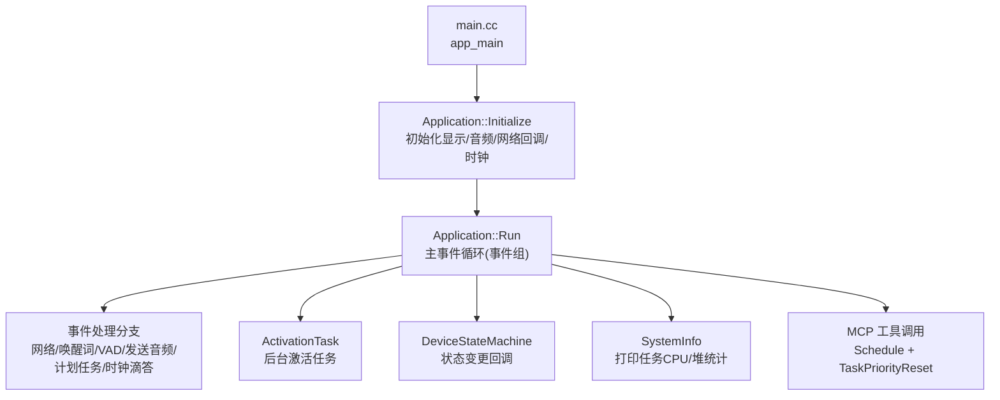
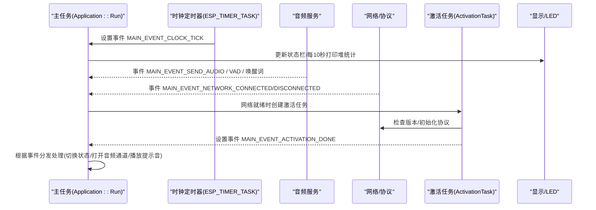
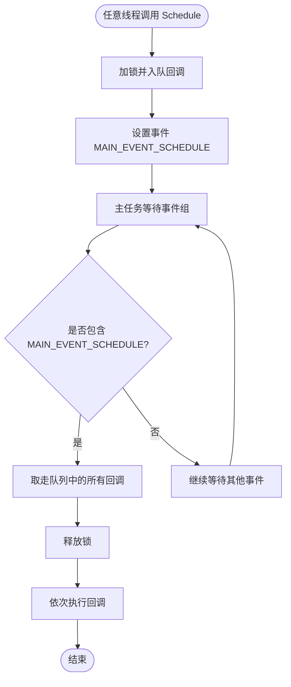
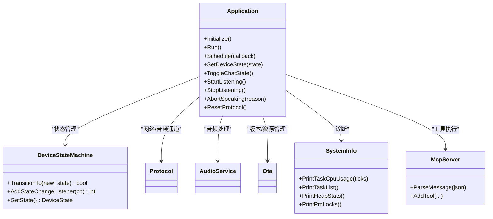

# 任务调度与资源管理

<cite>
**本文引用的文件**   
- [main.cc](file://main/main.cc)
- [application.h](file://main/application.h)
- [application.cc](file://main/application.cc)
- [device_state_machine.h](file://main/device_state_machine.h)
- [device_state_machine.cc](file://main/device_state_machine.cc)
- [system_info.h](file://main/system_info.h)
- [system_info.cc](file://main/system_info.cc)
- [mcp_server.cc](file://main/mcp_server.cc)
</cite>

## 目录
1. [简介](#简介)
2. [项目结构](#项目结构)
3. [核心组件](#核心组件)
4. [架构总览](#架构总览)
5. [详细组件分析](#详细组件分析)
6. [依赖关系分析](#依赖关系分析)
7. [性能考量](#性能考量)
8. [故障排查指南](#故障排查指南)
9. [结论](#结论)
10. [附录](#附录)

## 简介
本文件聚焦于 FreeRTOS 任务模型在应用中的实现，围绕主任务、激活任务、定时器任务的职责划分展开，深入解释优先级管理策略（TaskPriorityReset）、任务间同步机制、资源竞争避免方案。文档还涵盖任务生命周期管理、内存池使用、堆栈大小配置、异步任务调度（Schedule）的实现原理、任务队列管理与执行顺序保证，并提供调试技巧、性能分析方法与常见问题排查指南，以及自定义任务的创建与管理示例路径。

## 项目结构
应用以单入口 main.cc 启动，初始化 NVS 后进入 Application 的 Initialize 与 Run。Application 内部维护事件组、定时器和一个主任务队列，负责跨线程安全地调度 UI/协议/音频等逻辑。设备状态机 DeviceStateMachine 提供严格的状态转换与回调通知。系统信息工具 SystemInfo 提供任务 CPU 占用、任务列表、堆统计等诊断能力。MCP 服务器通过 Schedule 将耗时或 UI 相关操作迁移到主任务执行，并使用 TaskPriorityReset 临时提升当前任务优先级以降低响应延迟。

图表来源
- [main.cc:14-29](file://main/main.cc#L14-L29)
- [application.cc:61-163](file://main/application.cc#L61-L163)
- [application.cc:165-259](file://main/application.cc#L165-L259)
- [application.cc:261-338](file://main/application.cc#L261-L338)
- [device_state_machine.h:17-81](file://main/device_state_machine.h#L17-L81)
- [system_info.h:9-21](file://main/system_info.h#L9-L21)
- [mcp_server.cc:112-112](file://main/mcp_server.cc#L112-L112)

章节来源
- [main.cc:14-29](file://main/main.cc#L14-L29)
- [application.h:43-176](file://main/application.h#L43-L176)
- [application.cc:61-163](file://main/application.cc#L61-L163)
- [application.cc:165-259](file://main/application.cc#L165-L259)
- [device_state_machine.h:17-81](file://main/device_state_machine.h#L17-L81)
- [system_info.h:9-21](file://main/system_info.h#L9-L21)

## 核心组件
- Application：应用核心，持有事件组、定时器、协议对象、音频服务、状态机；提供 Initialize/Run/Schedule 等接口；通过事件组协调多源异步事件；通过 Schedule 将任意线程的回调迁移到主任务执行。
- DeviceStateMachine：严格定义合法状态转移，提供监听器机制，用于驱动 UI、音频处理开关等副作用。
- SystemInfo：封装 FreeRTOS 与 ESP-IDF 的诊断 API，输出任务 CPU 占用、任务列表、堆空闲与最小空闲等。
- McpServer：MCP 工具执行框架，关键路径中通过 TaskPriorityReset 临时提升当前任务优先级，降低交互时延。

章节来源
- [application.h:43-176](file://main/application.h#L43-L176)
- [application.cc:61-163](file://main/application.cc#L61-L163)
- [application.cc:165-259](file://main/application.cc#L165-L259)
- [device_state_machine.h:17-81](file://main/device_state_machine.h#L17-L81)
- [device_state_machine.cc:34-102](file://main/device_state_machine.cc#L34-L102)
- [system_info.h:9-21](file://main/system_info.h#L9-L21)
- [system_info.cc:59-142](file://main/system_info.cc#L59-L142)
- [mcp_server.cc:112-112](file://main/mcp_server.cc#L112-L112)

## 架构总览
下图展示主任务、激活任务、定时器任务之间的交互与数据流。主任务通过事件组聚合来自音频服务、网络层、用户输入、定时器中断的多路事件；激活任务在后台完成 OTA 检查、协议初始化等工作；定时器任务周期性触发时钟事件，驱动 UI 刷新与调试信息输出。

图表来源
- [application.cc:36-47](file://main/application.cc#L36-L47)
- [application.cc:165-259](file://main/application.cc#L165-L259)
- [application.cc:261-338](file://main/application.cc#L261-L338)

## 详细组件分析

### 主任务与事件循环
- 主任务优先级设置为较高值，确保 UI 与协议处理的实时性。
- 事件组集中接收所有异步事件，包括计划任务、音频发送、唤醒词检测、VAD 变化、错误、网络连接/断开、聊天切换、开始/停止监听、激活完成、状态变更、时钟滴答。
- 每个事件分支对应具体处理逻辑：如网络断开关闭音频通道、网络连通触发激活任务、时钟滴答刷新 UI 并周期打印堆统计、计划任务批量执行等。

章节来源
- [application.cc:165-259](file://main/application.cc#L165-L259)
- [application.cc:261-338](file://main/application.cc#L261-L338)
- [application.cc:248-257](file://main/application.cc#L248-L257)

### 激活任务（后台任务）
- 在网络连接成功后由主任务创建，独立运行，负责：
  - 创建 OTA 对象
  - 检查资源包版本并下载/应用
  - 检查固件版本并升级（必要时）
  - 初始化协议（MQTT/WebSocket）
  - 完成后向主任务发送激活完成事件
- 该任务结束后自行删除，避免泄漏。

章节来源
- [application.cc:261-338](file://main/application.cc#L261-L338)

### 定时器任务（时钟滴答）
- 使用 ESP-IDF esp_timer 创建周期定时器，回调中通过事件组向主任务投递 MAIN_EVENT_CLOCK_TICK。
- 主任务收到后刷新 UI 状态栏，并每 10 秒打印堆统计，便于监控内存使用。

章节来源
- [application.cc:36-47](file://main/application.cc#L36-L47)
- [application.cc:248-257](file://main/application.cc#L248-L257)

### 异步任务调度（Schedule）
- 设计目标：从任意线程提交回调，在主任务上下文中按序执行，保证线程安全与 UI/协议一致性。
- 实现要点：
  - 使用互斥锁保护主任务队列（std::deque<std::function<void()>>）。
  - 入队后立即设置 MAIN_EVENT_SCHEDULE 事件。
  - 主任务在事件循环中一次性取出全部待执行任务并依次调用，减少上下文切换开销。
- 适用场景：协议回调、MCP 工具执行、OTA 进度更新、UI 更新等。

图表来源
- [application.cc:934-940](file://main/application.cc#L934-L940)
- [application.cc:239-246](file://main/application.cc#L239-L246)

章节来源
- [application.cc:934-940](file://main/application.cc#L934-L940)
- [application.cc:239-246](file://main/application.cc#L239-L246)

### 优先级管理（TaskPriorityReset）
- 作用：RAII 风格的临时优先级提升，构造时保存当前任务优先级并提升到指定值，析构时恢复原优先级。
- 典型用法：在 MCP 工具执行的关键路径中临时提升优先级，缩短端到端响应时间。
- 注意事项：仅应在短时关键代码段使用，避免长时间高优先级导致低优先级任务饥饿。

章节来源
- [application.h:179-191](file://main/application.h#L179-L191)
- [mcp_server.cc:112-112](file://main/mcp_server.cc#L112-L112)

### 任务间同步与资源竞争避免
- 事件组：作为统一的事件总线，解耦生产者（音频、网络、定时器）与消费者（主任务），避免直接共享指针与复杂锁。
- 互斥量：仅保护主任务队列的入队/出队，临界区极短，降低锁竞争。
- 状态机：DeviceStateMachine 提供原子状态与严格转移规则，配合监听器回调，避免竞态导致的 UI/音频不一致。
- 幂等与重入保护：多处采用“再次检查状态”的模式（例如 ContinueOpenAudioChannel、ContinueWakeWordInvoke），防止在调度期间状态被其他路径修改。

章节来源
- [application.cc:239-246](file://main/application.cc#L239-L246)
- [device_state_machine.h:17-81](file://main/device_state_machine.h#L17-L81)
- [device_state_machine.cc:108-131](file://main/device_state_machine.cc#L108-L131)
- [application.cc:713-730](file://main/application.cc#L713-L730)
- [application.cc:826-858](file://main/application.cc#L826-L858)

### 任务生命周期管理
- 主任务：由 app_main 启动，永不返回，持续处理事件。
- 激活任务：按需创建，完成后自删，句柄置空，避免重复创建。
- 定时器：应用构造时创建，析构时停止并删除。
- 音频子任务：音频服务内部创建多个任务（编码、解码、播放、唤醒词等），由音频服务统一管理生命周期。

章节来源
- [main.cc:14-29](file://main/main.cc#L14-L29)
- [application.cc:261-338](file://main/application.cc#L261-L338)
- [application.cc:49-55](file://main/application.cc#L49-L55)

### 内存池与堆栈配置
- 堆栈分配：
  - 激活任务使用 xTaskCreate 动态分配堆栈（示例中为较大堆栈，适合进行网络与 I/O 操作）。
  - 音频服务内部任务使用 xTaskCreate/xTaskCreatePinnedToCore/xTaskCreateStatic 等多种方式，部分任务使用静态堆栈以规避运行时分配失败风险。
- 堆统计：
  - 主任务每 10 秒打印内部 SRAM 空闲与最小空闲，辅助定位堆碎片与峰值需求。
- 建议：
  - 对长生命周期或高频任务优先使用静态堆栈（xTaskCreateStatic）。
  - 对偶尔运行的任务可使用动态堆栈，但需评估最坏情况下的堆消耗。

章节来源
- [application.cc:272-278](file://main/application.cc#L272-L278)
- [application.cc:248-257](file://main/application.cc#L248-L257)
- [system_info.cc:150-154](file://main/system_info.cc#L150-L154)

### 任务调试技巧
- 任务 CPU 占用：使用 SystemInfo::PrintTaskCpuUsage 获取一段时间内各任务 CPU 占比，识别热点任务。
- 任务列表：使用 SystemInfo::PrintTaskList 查看任务名、状态、剩余堆栈等。
- 堆统计：使用 SystemInfo::PrintHeapStats 观察空闲与最小空闲，结合业务阶段分析峰值。
- 电源锁：使用 SystemInfo::PrintPmLocks 检查 PM 锁占用，排查功耗异常。

章节来源
- [system_info.h:17-20](file://main/system_info.h#L17-L20)
- [system_info.cc:59-142](file://main/system_info.cc#L59-L142)
- [system_info.cc:144-158](file://main/system_info.cc#L144-L158)

### 常见问题排查指南
- 现象：任务无响应或卡顿
  - 检查是否存在长时间持有锁或阻塞调用（如网络 I/O）在主任务队列回调中执行。
  - 确认是否误用高优先级且未及时恢复（TaskPriorityReset 使用范围过大）。
- 现象：堆耗尽或频繁 OOM
  - 关注最小空闲堆是否持续下降，定位大对象分配点。
  - 检查是否有任务未正确删除或存在泄漏。
- 现象：状态不一致
  - 检查是否在非主任务直接修改了 UI/协议状态，应通过 Schedule 迁移到主任务。
  - 确认状态机转移是否符合规则。

章节来源
- [application.cc:934-940](file://main/application.cc#L934-L940)
- [application.cc:165-259](file://main/application.cc#L165-L259)
- [device_state_machine.cc:34-102](file://main/device_state_machine.cc#L34-L102)

## 依赖关系分析
- Application 依赖：
  - Board/Display/AudioService：硬件抽象与外设控制
  - Protocol/MqttProtocol/WebsocketProtocol：网络通信
  - Ota：固件与资源包管理
  - DeviceStateMachine：状态机
  - SystemInfo：诊断
  - McpServer：工具执行
- 主要耦合点：
  - 事件组作为松耦合总线，降低模块间直接依赖。
  - Schedule 将跨线程调用收敛至主任务，简化并发模型。

图表来源
- [application.h:43-176](file://main/application.h#L43-L176)
- [device_state_machine.h:17-81](file://main/device_state_machine.h#L17-L81)
- [system_info.h:9-21](file://main/system_info.h#L9-L21)
- [mcp_server.cc:321-329](file://main/mcp_server.cc#L321-L329)

章节来源
- [application.h:43-176](file://main/application.h#L43-L176)
- [device_state_machine.h:17-81](file://main/device_state_machine.h#L17-L81)
- [system_info.h:9-21](file://main/system_info.h#L9-L21)
- [mcp_server.cc:321-329](file://main/mcp_server.cc#L321-L329)

## 性能考量
- 主任务优先级：适当提高主任务优先级可降低 UI 与协议响应的抖动。
- 事件批处理：Schedule 一次性取出队列中所有任务，减少上下文切换。
- 临时优先级提升：仅在关键路径使用 TaskPriorityReset，避免全局高优先级。
- 定时器频率：时钟滴答间隔与打印频率需权衡，避免过多日志影响性能。
- 音频链路：在连接前切换到高性能模式，降低端到端延迟。

[本节为通用指导，不直接分析具体文件]

## 故障排查指南
- 使用 SystemInfo::PrintTaskCpuUsage 对比不同阶段的 CPU 分布，定位热点。
- 使用 SystemInfo::PrintTaskList 检查任务存活与堆栈剩余。
- 使用 SystemInfo::PrintHeapStats 跟踪堆使用趋势，结合业务阶段判断峰值。
- 若出现死锁或卡死，检查是否存在长临界区或嵌套锁，尽量缩小锁粒度。
- 若出现状态错乱，确认是否通过 Schedule 迁移到主任务，以及状态机转移是否合法。

章节来源
- [system_info.h:17-20](file://main/system_info.h#L17-L20)
- [system_info.cc:59-142](file://main/system_info.cc#L59-L142)
- [system_info.cc:144-158](file://main/system_info.cc#L144-L158)
- [device_state_machine.cc:34-102](file://main/device_state_machine.cc#L34-L102)

## 结论
本项目通过事件组+主任务队列的调度模型，实现了清晰的任务边界与线程安全的跨线程调用；借助 DeviceStateMachine 保障状态一致性与可观测性；利用 TaskPriorityReset 在关键路径优化响应时延；并通过 SystemInfo 提供完善的诊断手段。整体架构简洁、可扩展性强，适合在资源受限的嵌入式平台上稳定运行。

[本节为总结，不直接分析具体文件]

## 附录

### 实际代码示例：如何创建与管理自定义任务
- 参考路径（激活任务）：在应用层通过 xTaskCreate 创建后台任务，并在完成后自删与清理句柄。
  - 参考位置：[application.cc:272-278](file://main/application.cc#L272-L278)
- 参考路径（音频服务内部任务）：音频服务内部使用多种任务创建方式，包括绑定核心与静态堆栈，适用于高频/关键任务。
  - 参考位置：[audio_service.cc:132-164](file://main/audio/audio_service.cc#L132-L164)
- 参考路径（MCP 工具中临时提升优先级）：在工具执行路径中使用 TaskPriorityReset 提升优先级，缩短响应时间。
  - 参考位置：[mcp_server.cc:112-112](file://main/mcp_server.cc#L112-L112)
- 参考路径（主任务队列回调）：通过 Schedule 将回调放入主任务队列，确保在主任务上下文中执行。
  - 参考位置：[application.cc:934-940](file://main/application.cc#L934-L940)

章节来源
- [application.cc:272-278](file://main/application.cc#L272-L278)
- [application.cc:934-940](file://main/application.cc#L934-L940)
- [mcp_server.cc:112-112](file://main/mcp_server.cc#L112-L112)