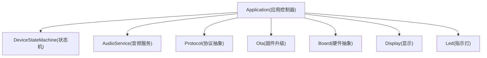
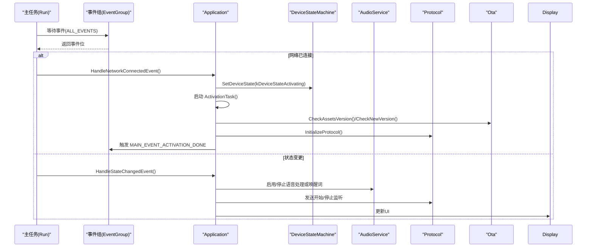
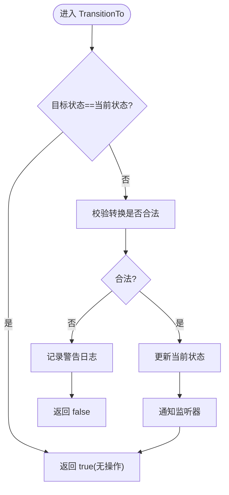
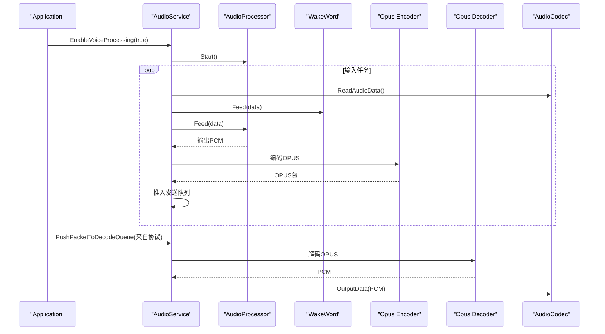
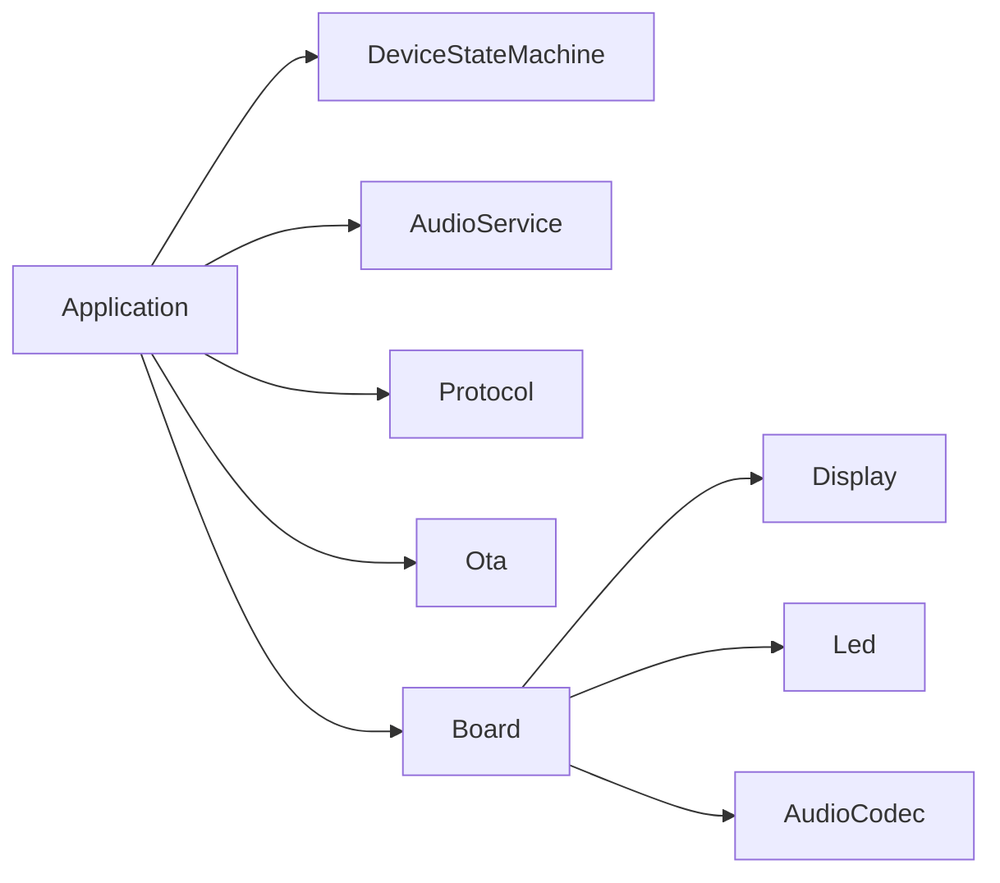

# 应用控制器设计

<cite>
**本文引用的文件**   
- [application.h](file://main/application.h)
- [application.cc](file://main/application.cc)
- [device_state_machine.h](file://main/device_state_machine.h)
- [device_state_machine.cc](file://main/device_state_machine.cc)
- [audio_service.h](file://main/audio/audio_service.h)
- [audio_service.cc](file://main/audio/audio_service.cc)
- [protocol.h](file://main/protocols/protocol.h)
- [ota.h](file://main/ota.h)
- [atk_dnesp32s3_box0.cc](file://main/boards/atk-dnesp32s3-box0/atk_dnesp32s3_box0.cc)
- [atk_dnesp32s3_box3.cc](file://main/boards/atk-dnesp32s3-box3/atk_dnesp32s3_box3.cc)
</cite>

## 目录
1. [简介](#简介)
2. [项目结构](#项目结构)
3. [核心组件](#核心组件)
4. [架构总览](#架构总览)
5. [详细组件分析](#详细组件分析)
6. [依赖关系分析](#依赖关系分析)
7. [性能与内存管理](#性能与内存管理)
8. [故障排查指南](#故障排查指南)
9. [结论](#结论)
10. [附录：接口使用示例](#附录接口使用示例)

## 简介
本文件围绕 Application 类（应用控制器）进行系统化文档化，重点覆盖以下方面：
- 单例模式实现与生命周期
- 初始化流程与主事件循环机制
- 关键事件处理函数职责与调用时机（如 HandleStateChangedEvent、HandleToggleChatEvent 等）
- 任务调度机制（Schedule）与线程安全策略
- 音频服务集成、协议管理与 OTA 升级的协调方式
- 常见操作的使用示例（状态切换、语音控制、系统管理等）

## 项目结构
Application 位于 main 目录，作为整个应用的中央控制器，负责：
- 设备状态机驱动
- 主事件循环与跨线程任务调度
- 音频服务、网络协议、OTA 的协调
- UI 更新与用户交互入口



图表来源
- [application.h:43-176](file://main/application.h#L43-L176)
- [device_state_machine.h:17-81](file://main/device_state_machine.h#L17-L81)
- [audio_service.h:105-195](file://main/audio/audio_service.h#L105-L195)
- [protocol.h:44-95](file://main/protocols/protocol.h#L44-L95)
- [ota.h:10-56](file://main/ota.h#L10-L56)

章节来源
- [application.h:43-176](file://main/application.h#L43-L176)
- [application.cc:61-163](file://main/application.cc#L61-L163)

## 核心组件
- Application：应用控制器，提供单例访问、初始化、运行主循环、事件分发、任务调度、状态切换、音频/协议/OTA 协调。
- DeviceStateMachine：严格的状态转换校验与监听回调。
- AudioService：音频采集、编码、解码、播放、唤醒词检测、VAD、AEC 等能力。
- Protocol：网络协议抽象（MQTT/WebSocket），封装音频通道与 JSON 消息处理。
- Ota：版本检查、激活、固件升级。

章节来源
- [application.h:43-176](file://main/application.h#L43-L176)
- [device_state_machine.h:17-81](file://main/device_state_machine.h#L17-L81)
- [audio_service.h:105-195](file://main/audio/audio_service.h#L105-L195)
- [protocol.h:44-95](file://main/protocols/protocol.h#L44-L95)
- [ota.h:10-56](file://main/ota.h#L10-L56)

## 架构总览
Application 通过 FreeRTOS EventGroup 聚合多源事件，在 Run() 中统一分发；通过 Schedule() 将任意线程的任务投递到主任务执行，保证 UI 与协议操作的线程安全。



图表来源
- [application.cc:165-259](file://main/application.cc#L165-L259)
- [application.cc:261-338](file://main/application.cc#L261-L338)
- [application.cc:473-610](file://main/application.cc#L473-L610)
- [application.cc:860-932](file://main/application.cc#L860-L932)

## 详细组件分析

### Application 类设计与实现
- 单例模式
  - 使用静态局部变量实现线程安全的单例构造与获取。
  - 删除拷贝构造与赋值运算符，避免意外复制。
- 初始化流程 Initialize()
  - 设置初始状态为“启动中”，初始化显示、音频服务、注册音频回调（发送队列可用、唤醒词检测、VAD 变化）。
  - 注册状态机监听，启动时钟定时器用于 UI 刷新与调试信息打印。
  - 注册网络事件回调，异步启动网络连接。
- 主事件循环 Run()
  - 提升主任务优先级，等待事件组中的多种事件。
  - 根据事件位分发到对应处理函数：网络、激活完成、状态变更、聊天开关、开始/停止监听、音频发送、唤醒词、VAD、定时 tick、任务调度等。
- 任务调度 Schedule()
  - 将回调加入主任务队列并触发 MAIN_EVENT_SCHEDULE，确保回调在主任务上下文执行，避免跨线程直接访问共享资源。
- 状态切换 SetDeviceState()
  - 委托给 DeviceStateMachine，内部进行合法性校验与回调通知。
- 事件处理函数
  - HandleStateChangedEvent：根据新状态更新 UI、LED、音频处理与唤醒词开关、发送协议命令等。
  - HandleToggleChatEvent：根据当前状态决定进入连接、停止说话、关闭通道或进入音频测试等。
  - HandleStartListeningEvent / HandleStopListeningEvent：手动模式下的开始/停止监听。
  - HandleWakeWordDetectedEvent：唤醒词触发后的连接、发送唤醒数据、进入监听等。
  - HandleNetworkConnectedEvent / HandleNetworkDisconnectedEvent：网络就绪后启动激活任务；断网时关闭音频通道。
  - HandleActivationDoneEvent：激活完成后恢复空闲、释放 OTA 对象、降低功耗等级、提示成功音。
- 协议与音频协调
  - InitializeProtocol() 选择 MQTT 或 WebSocket，注册音频通道打开/关闭、入站音频、JSON 消息等回调。
  - OnIncomingJson 解析 TTS/STT/LLM/MCP/System/Alert 等消息类型，调度 UI 与状态机。
- OTA 升级 UpgradeFirmware()
  - 关闭音频通道、停止音频服务、进入升级状态、下载并安装固件，成功后重启。
- 其他功能
  - AbortSpeaking：中断服务器端 TTS。
  - WakeWordInvoke：外部唤醒词入口。
  - CanEnterSleepMode：判断是否可进入睡眠。
  - ResetProtocol：从任意线程安全地重置协议资源。
  - SetAecMode：动态切换 AEC 模式并关闭现有音频通道。

```mermaid
classDiagram
class Application {
+GetInstance() Application&
+Initialize() void
+Run() void
+SetDeviceState(state) bool
+Schedule(callback) void
+ToggleChatState() void
+StartListening() void
+StopListening() void
+AbortSpeaking(reason) void
+UpgradeFirmware(url, version) bool
+ResetProtocol() void
+SetAecMode(mode) void
+PlaySound(sound) void
+GetAudioService() AudioService&
-event_group_ : EventGroupHandle_t
-state_machine_ : DeviceStateMachine
-audio_service_ : AudioService
-protocol_ : Protocol*
-ota_ : Ota*
-main_tasks_ : deque<function<void()> >
-mutex_ : mutex
-HandleStateChangedEvent() void
-HandleToggleChatEvent() void
-HandleStartListeningEvent() void
-HandleStopListeningEvent() void
-HandleWakeWordDetectedEvent() void
-HandleNetworkConnectedEvent() void
-HandleNetworkDisconnectedEvent() void
-HandleActivationDoneEvent() void
-ActivationTask() void
-InitializeProtocol() void
-ShowActivationCode(code, message) void
-ContinueOpenAudioChannel(mode) void
-ContinueWakeWordInvoke(wake_word) void
}
Application --> DeviceStateMachine : "驱动状态机"
Application --> AudioService : "音频服务"
Application --> Protocol : "协议抽象"
Application --> Ota : "固件升级"
```

图表来源
- [application.h:43-176](file://main/application.h#L43-L176)
- [application.cc:61-163](file://main/application.cc#L61-L163)
- [application.cc:165-259](file://main/application.cc#L165-L259)
- [application.cc:473-610](file://main/application.cc#L473-L610)
- [application.cc:860-932](file://main/application.cc#L860-L932)
- [application.cc:934-940](file://main/application.cc#L934-L940)
- [application.cc:972-1022](file://main/application.cc#L972-L1022)

章节来源
- [application.h:43-176](file://main/application.h#L43-L176)
- [application.cc:61-163](file://main/application.cc#L61-L163)
- [application.cc:165-259](file://main/application.cc#L165-L259)
- [application.cc:261-338](file://main/application.cc#L261-L338)
- [application.cc:473-610](file://main/application.cc#L473-L610)
- [application.cc:860-932](file://main/application.cc#L860-L932)
- [application.cc:934-940](file://main/application.cc#L934-L940)
- [application.cc:972-1022](file://main/application.cc#L972-L1022)

### 设备状态机 DeviceStateMachine
- 职责
  - 维护当前状态，提供 TransitionTo/CannotTransitionTo 校验。
  - 支持添加/移除状态变更监听器，并在合法转换后同步通知。
- 状态转换规则
  - 定义了各状态间的合法转换路径，例如 Idle -> Connecting/Listening/Speaking/Activating/Upgrading/WifiConfiguring 等。
- 线程安全
  - 使用互斥锁保护监听器列表，原子变量保存当前状态。



图表来源
- [device_state_machine.cc:34-102](file://main/device_state_machine.cc#L34-L102)
- [device_state_machine.cc:108-131](file://main/device_state_machine.cc#L108-L131)
- [device_state_machine.cc:148-161](file://main/device_state_machine.cc#L148-L161)

章节来源
- [device_state_machine.h:17-81](file://main/device_state_machine.h#L17-L81)
- [device_state_machine.cc:34-102](file://main/device_state_machine.cc#L34-L102)
- [device_state_machine.cc:108-131](file://main/device_state_machine.cc#L108-L131)
- [device_state_machine.cc:148-161](file://main/device_state_machine.cc#L148-L161)

### 音频服务 AudioService
- 职责
  - 音频输入/输出任务、Opus 编解码、重采样、唤醒词检测、VAD、AEC、音频测试。
  - 提供队列缓冲与事件通知，保障低延迟与稳定吞吐。
- 关键流程
  - Initialize：启动 Codec、创建 Opus 编解码器、可选输入/输出重采样器、配置处理器与唤醒词。
  - Start：启动输入/输出/编解码任务，周期性电源管理计时器。
  - OpusCodecTask：从解码队列取包解码并放入播放队列；从编码队列取 PCM 编码后放入发送队列。
  - PushPacketToDecodeQueue/PushTaskToEncodeQueue：带容量限制与条件变量的阻塞式入队。
  - PlaySound：解复用内置 OGG 片段并送入解码队列。
- 与 Application 协作
  - Application 在状态变更时启用/禁用语音处理与唤醒词检测，并根据监听模式发送协议命令。
  - 当服务器侧 AEC 开启时，音频任务会记录时间戳供服务端对齐。



图表来源
- [audio_service.cc:125-167](file://main/audio/audio_service.cc#L125-L167)
- [audio_service.cc:230-288](file://main/audio/audio_service.cc#L230-L288)
- [audio_service.cc:327-446](file://main/audio/audio_service.cc#L327-L446)
- [audio_service.cc:506-518](file://main/audio/audio_service.cc#L506-L518)
- [audio_service.cc:633-654](file://main/audio/audio_service.cc#L633-L654)

章节来源
- [audio_service.h:105-195](file://main/audio/audio_service.h#L105-L195)
- [audio_service.cc:125-167](file://main/audio/audio_service.cc#L125-L167)
- [audio_service.cc:230-288](file://main/audio/audio_service.cc#L230-L288)
- [audio_service.cc:327-446](file://main/audio/audio_service.cc#L327-L446)
- [audio_service.cc:506-518](file://main/audio/audio_service.cc#L506-L518)
- [audio_service.cc:633-654](file://main/audio/audio_service.cc#L633-L654)

### 协议管理 Protocol
- 职责
  - 定义统一的协议接口（MQTT/WebSocket 具体实现），提供音频通道管理、文本/二进制消息发送、回调注册。
- 与 Application 协作
  - Application 在激活阶段选择具体协议实现，注册 OnIncomingAudio/OnIncomingJson 等回调，驱动状态机与 UI。
  - 在收到 TTS/STT/LLM/MCP/System/Alert 等消息时，调度 UI 更新与状态切换。

章节来源
- [protocol.h:44-95](file://main/protocols/protocol.h#L44-L95)
- [application.cc:473-610](file://main/application.cc#L473-L610)

### OTA 升级 Ota
- 职责
  - 版本检查、激活流程、固件下载与安装、进度回调、错误重试。
- 与 Application 协作
  - 激活阶段先检查资源版本与固件版本，必要时进入升级状态；升级成功后重启设备。

章节来源
- [ota.h:10-56](file://main/ota.h#L10-L56)
- [application.cc:323-338](file://main/application.cc#L323-L338)
- [application.cc:398-471](file://main/application.cc#L398-L471)
- [application.cc:972-1022](file://main/application.cc#L972-L1022)

## 依赖关系分析
- Application 强耦合于 DeviceStateMachine、AudioService、Protocol、Ota 与 Board/Display/Led 等硬件抽象。
- 事件驱动与任务调度解耦了不同子系统之间的时序依赖，提高可维护性与扩展性。
- 通过回调与事件组，避免了直接的跨线程调用，提升了线程安全性。



图表来源
- [application.h:43-176](file://main/application.h#L43-L176)
- [device_state_machine.h:17-81](file://main/device_state_machine.h#L17-L81)
- [audio_service.h:105-195](file://main/audio/audio_service.h#L105-L195)
- [protocol.h:44-95](file://main/protocols/protocol.h#L44-L95)
- [ota.h:10-56](file://main/ota.h#L10-L56)

章节来源
- [application.h:43-176](file://main/application.h#L43-L176)
- [device_state_machine.h:17-81](file://main/device_state_machine.h#L17-L81)
- [audio_service.h:105-195](file://main/audio/audio_service.h#L105-L195)
- [protocol.h:44-95](file://main/protocols/protocol.h#L44-L95)
- [ota.h:10-56](file://main/ota.h#L10-L56)

## 性能与内存管理
- 任务与队列
  - 音频输入/输出/编解码任务分离，使用条件变量与双端队列控制流量，防止溢出与阻塞。
  - 最大队列长度常量限制内存占用与延迟。
- 重采样与编解码
  - 动态根据服务器采样率重建解码器与输出重采样器，避免失真。
  - 输入重采样仅在需要时启用，减少 CPU 开销。
- 电源管理
  - 周期性计时器检测输入/输出空闲超时，自动关闭 Codec 输入/输出以降低功耗。
  - 连接建立与断开时调整 Board 功耗等级（高性能/低功耗）。
- 内存释放
  - 激活完成后释放 OTA 对象，避免长期占用。
  - 升级失败时重启音频服务，恢复正常运行。

[本节为通用性能讨论，不直接分析具体文件]

## 故障排查指南
- 常见问题定位
  - 网络错误：协议层回调设置 MAIN_EVENT_ERROR，主循环将状态回退至空闲并弹出错误提示。
  - 音频异常：检查编码器/解码器初始化、重采样器配置、队列是否满、播放队列是否为空。
  - 状态非法：查看状态机日志，确认转换是否符合规则。
  - 升级失败：检查 URL 可达性、存储空间、网络稳定性；失败后会重启音频服务继续运行。
- 建议步骤
  - 观察主循环事件位与状态机日志。
  - 使用 SystemInfo::PrintHeapStats 定期打印堆统计，评估内存压力。
  - 在关键路径增加日志，区分网络、音频、协议、UI 各层问题。

章节来源
- [application.cc:187-190](file://main/application.cc#L187-L190)
- [application.cc:286-297](file://main/application.cc#L286-L297)
- [application.cc:398-471](file://main/application.cc#L398-L471)
- [application.cc:972-1022](file://main/application.cc#L972-L1022)

## 结论
Application 作为应用控制器，采用单例与事件驱动架构，结合严格的设备状态机与线程安全的任务调度，实现了音频、协议、OTA 的高效协同。其模块化设计与清晰的职责边界，使得在不同硬件平台上具备良好的可扩展性与可维护性。

[本节为总结性内容，不直接分析具体文件]

## 附录：接口使用示例
以下为常见操作的使用示例（以代码片段路径代替具体代码内容）：

- 获取单例与应用初始化
  - 参考路径：[application.h:45-48](file://main/application.h#L45-L48)、[application.cc:61-163](file://main/application.cc#L61-L163)
- 状态切换（空闲/连接/监听/说话）
  - 参考路径：[application.cc:57-59](file://main/application.cc#L57-59)、[application.cc:860-932](file://main/application.cc#L860-L932)
- 语音控制（开始/停止监听、切换聊天状态）
  - 参考路径：[application.cc:662-778](file://main/application.cc#L662-L778)
- 唤醒词触发
  - 参考路径：[application.cc:780-858](file://main/application.cc#L780-L858)
- 中断说话（打断 TTS）
  - 参考路径：[application.cc:942-948](file://main/application.cc#L942-L948)
- 系统管理（重启、升级固件、重置协议）
  - 参考路径：[application.cc:959-970](file://main/application.cc#L959-970)、[application.cc:972-1022](file://main/application.cc#L972-L1022)、[application.cc:1121-1130](file://main/application.cc#L1121-L1130)
- 板级按键绑定示例（按钮点击触发聊天切换）
  - 参考路径：[atk_dnesp32s3_box0.cc:195-206](file://main/boards/atk-dnesp32s3-box0/atk_dnesp32s3_box0.cc#L195-L206)、[atk_dnesp32s3_box3.cc:314-319](file://main/boards/atk-dnesp32s3-box3/atk_dnesp32s3_box3.cc#L314-L319)

章节来源
- [application.h:45-48](file://main/application.h#L45-L48)
- [application.cc:61-163](file://main/application.cc#L61-L163)
- [application.cc:57-59](file://main/application.cc#L57-59)
- [application.cc:662-778](file://main/application.cc#L662-L778)
- [application.cc:780-858](file://main/application.cc#L780-L858)
- [application.cc:942-948](file://main/application.cc#L942-948)
- [application.cc:959-970](file://main/application.cc#L959-970)
- [application.cc:972-1022](file://main/application.cc#L972-L1022)
- [application.cc:1121-1130](file://main/application.cc#L1121-1130)
- [atk_dnesp32s3_box0.cc:195-206](file://main/boards/atk-dnesp32s3-box0/atk_dnesp32s3_box0.cc#L195-L206)
- [atk_dnesp32s3_box3.cc:314-319](file://main/boards/atk-dnesp32s3-box3/atk_dnesp32s3_box3.cc#L314-L319)