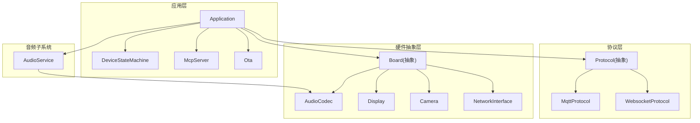
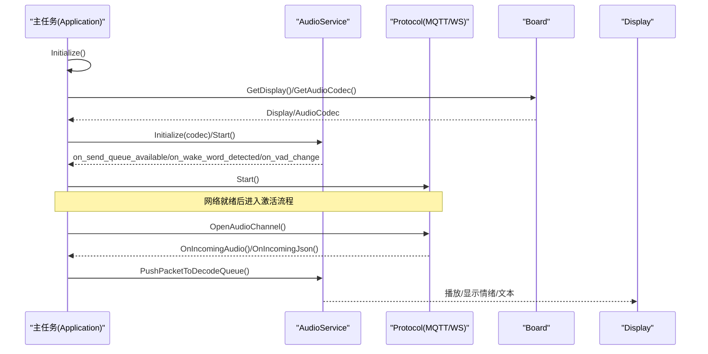
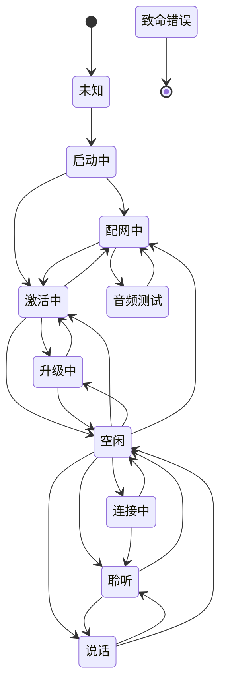
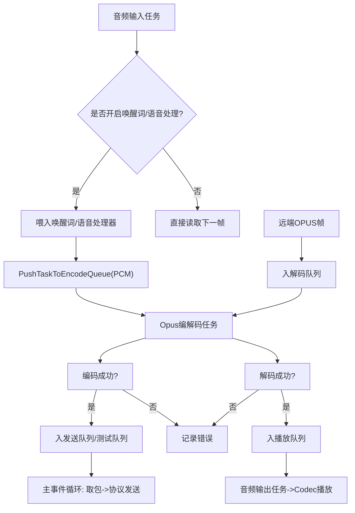
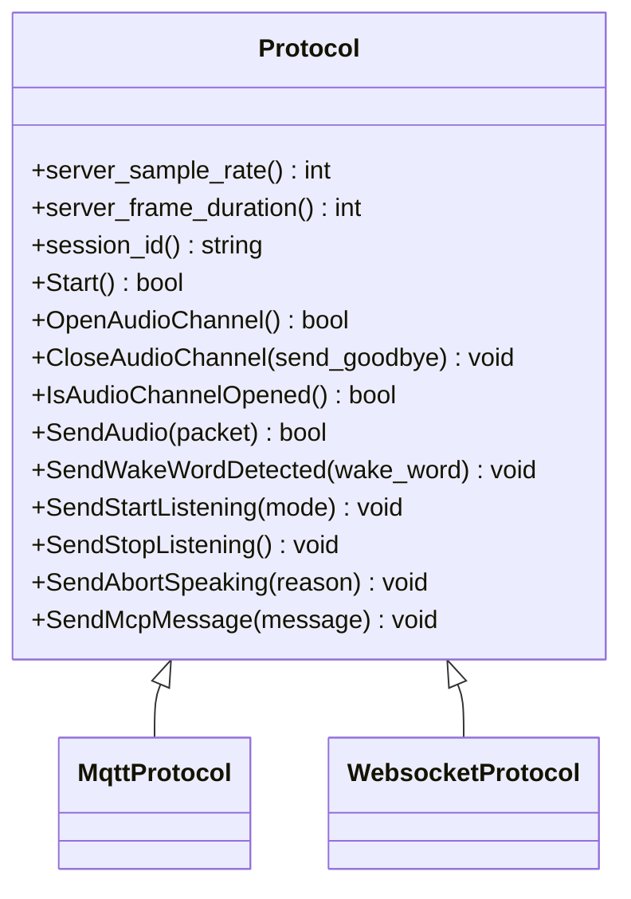
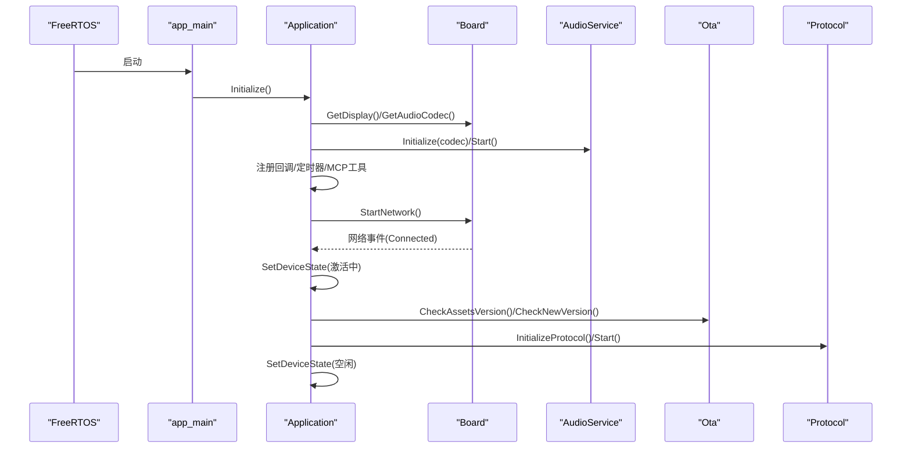
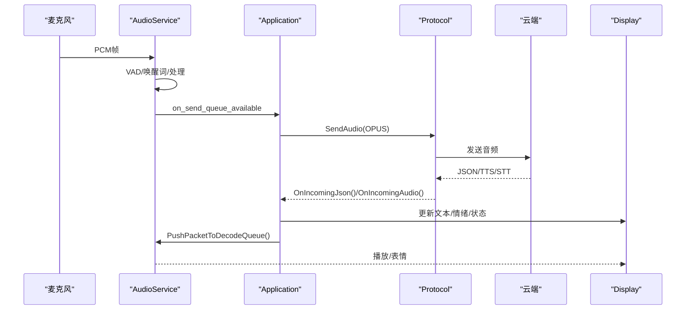
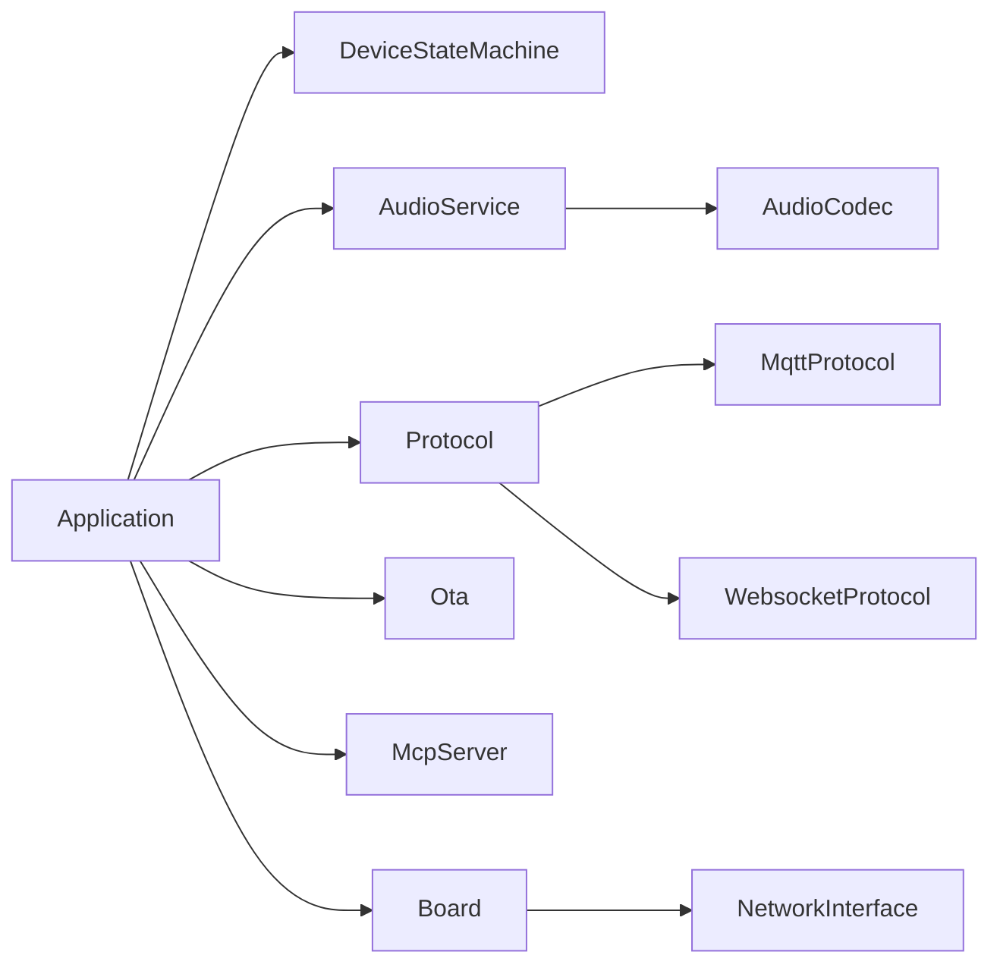

# 核心架构设计

<cite>
**本文引用的文件**   
- [main.cc](file://main/main.cc)
- [application.h](file://main/application.h)
- [application.cc](file://main/application.cc)
- [device_state.h](file://main/device_state.h)
- [device_state_machine.h](file://main/device_state_machine.h)
- [device_state_machine.cc](file://main/device_state_machine.cc)
- [audio_service.h](file://main/audio/audio_service.h)
- [audio_service.cc](file://main/audio/audio_service.cc)
- [protocol.h](file://main/protocols/protocol.h)
- [mqtt_protocol.h](file://main/protocols/mqtt_protocol.h)
- [websocket_protocol.h](file://main/protocols/websocket_protocol.h)
- [board.h](file://main/boards/common/board.h)
- [board.cc](file://main/boards/common/board.cc)
- [ota.h](file://main/ota.h)
- [ota.cc](file://main/ota.cc)
- [mcp_server.h](file://main/mcp_server.h)
- [mcp_server.cc](file://main/mcp_server.cc)
</cite>

## 目录
1. [引言](#引言)
2. [项目结构](#项目结构)
3. [核心组件](#核心组件)
4. [架构总览](#架构总览)
5. [详细组件分析](#详细组件分析)
6. [依赖关系分析](#依赖关系分析)
7. [性能与内存管理](#性能与内存管理)
8. [故障排查指南](#故障排查指南)
9. [结论](#结论)
10. [附录](#附录)

## 引言
本文件面向小智AI聊天机器人（ESP32平台）的核心架构，系统性阐述分层架构、模块通信机制、事件驱动模型、Application类职责、设备状态机、任务调度策略、启动流程与初始化顺序、资源管理机制，以及插件化协议/编解码/板级支持动态加载方式。文档同时提供架构图与数据流图，覆盖从用户语音输入到AI响应输出的完整链路，并给出性能优化与内存管理建议。

## 项目结构
整体采用“应用层-协议层-硬件抽象层”的分层架构：
- 应用层：Application负责系统编排、事件循环、状态机协调、UI与音频服务联动、OTA升级与MCP工具注册等。
- 协议层：Protocol抽象及MQTT/WebSocket实现，负责与云端建立连接、收发JSON控制消息与OPUS音频流。
- 硬件抽象层：Board抽象统一获取AudioCodec、Display、Camera、网络接口等；各具体板级实现位于boards目录下。
- 音频子系统：AudioService封装采集、处理、编码、解码、播放、唤醒词检测、VAD/AEC等。
- OTA/MCP：Ota负责版本检查、激活、固件升级；McpServer提供工具发现与调用能力。

图表来源
- [application.h:43-176](file://main/application.h#L43-L176)
- [device_state_machine.h:17-81](file://main/device_state_machine.h#L17-L81)
- [audio_service.h:105-195](file://main/audio/audio_service.h#L105-L195)
- [protocol.h:44-95](file://main/protocols/protocol.h#L44-L95)
- [mqtt_protocol.h:26-62](file://main/protocols/mqtt_protocol.h#L26-L62)
- [websocket_protocol.h:13-32](file://main/protocols/websocket_protocol.h#L13-L32)
- [board.h:49-85](file://main/boards/common/board.h#L49-L85)

章节来源
- [main.cc:14-29](file://main/main.cc#L14-L29)
- [application.h:43-176](file://main/application.h#L43-L176)
- [board.h:49-85](file://main/boards/common/board.h#L49-L85)

## 核心组件
- Application：单例应用控制器，维护主事件循环、定时器、任务队列、协议实例、状态机、音频服务、OTA对象，协调各模块生命周期与交互。
- DeviceStateMachine：严格定义设备状态与合法迁移规则，提供监听器回调机制。
- AudioService：多任务音频流水线（采集/处理/编码/解码/播放），支持唤醒词、VAD、AEC、采样率转换、电源管理。
- Protocol抽象与实现：统一音频通道与JSON控制面接口；MQTT/WebSocket两种传输。
- Board抽象：统一硬件访问入口，按板级配置返回具体AudioCodec/Display/Camera/NetworkInterface。
- Ota：版本检查、激活、固件下载与升级、服务器时间同步。
- McpServer：工具注册、参数校验、执行与结果回传，支持用户可见/不可见工具分类。

章节来源
- [application.h:43-176](file://main/application.h#L43-L176)
- [device_state_machine.h:17-81](file://main/device_state_machine.h#L17-L81)
- [audio_service.h:105-195](file://main/audio/audio_service.h#L105-L195)
- [protocol.h:44-95](file://main/protocols/protocol.h#L44-L95)
- [mqtt_protocol.h:26-62](file://main/protocols/mqtt_protocol.h#L26-L62)
- [websocket_protocol.h:13-32](file://main/protocols/websocket_protocol.h#L13-L32)
- [board.h:49-85](file://main/boards/common/board.h#L49-L85)
- [ota.h:10-56](file://main/ota.h#L10-L56)
- [mcp_server.h:314-342](file://main/mcp_server.h#L314-L342)

## 架构总览
系统采用事件驱动+分层架构：
- 主线程运行Application::Run，基于FreeRTOS事件组轮询各类事件（网络、状态变更、音频发送、唤醒词、VAD、定时器等）。
- 音频子系统的输入/输出/编解码分别由独立任务完成，通过队列与条件变量解耦。
- 协议层以回调形式将远端音频帧与JSON指令投递至Application，再由Application更新状态机与UI。
- Board抽象屏蔽不同板卡差异，按需启用显示、背光、摄像头、电源管理等。

图表来源
- [application.cc:61-163](file://main/application.cc#L61-L163)
- [application.cc:473-610](file://main/application.cc#L473-L610)
- [audio_service.cc:125-167](file://main/audio/audio_service.cc#L125-L167)
- [protocol.h:58-75](file://main/protocols/protocol.h#L58-L75)

## 详细组件分析

### Application类与事件驱动模型
- 职责
  - 初始化显示、音频服务、网络回调、MCP工具、时钟定时器。
  - 主事件循环分发：错误、网络、激活、状态变更、对话切换、开始/停止监听、音频发送、唤醒词、VAD、定时tick。
  - 异步任务调度：Schedule将回调放入主任务队列，保证UI/状态一致性。
  - 协议生命周期：根据OTA配置选择MQTT或WebSocket，设置音频通道打开/关闭、JSON消息解析、TTS/STT/LLM/MCP/系统命令处理。
  - 状态机协调：在合适时机触发状态迁移，如空闲→连接→聆听→说话→空闲。
- 关键事件
  - MAIN_EVENT_NETWORK_CONNECTED/DISCONNECTED：网络变化时清理会话或启动激活。
  - MAIN_EVENT_STATE_CHANGED：驱动UI与行为更新。
  - MAIN_EVENT_SEND_AUDIO：从音频发送队列取包并通过协议发送。
  - MAIN_EVENT_WAKE_WORD_DETECTED：触发唤醒流程。
  - MAIN_EVENT_VAD_CHANGE：在聆听态下驱动LED等反馈。
  - MAIN_EVENT_CLOCK_TICK：周期性刷新状态栏与堆统计。
- 资源管理
  - 激活完成后释放OTA对象，降低常驻内存占用。
  - 音频通道打开/关闭时调整功耗等级（PERFORMANCE/LOW_POWER）。

章节来源
- [application.h:21-35](file://main/application.h#L21-L35)
- [application.h:58-176](file://main/application.h#L58-L176)
- [application.cc:165-259](file://main/application.cc#L165-L259)
- [application.cc:261-338](file://main/application.cc#L261-L338)
- [application.cc:473-610](file://main/application.cc#L473-L610)

### 设备状态机设计原理
- 状态集合
  - 未知、启动中、配网中、空闲、连接中、聆听、说话、升级中、激活中、音频测试、致命错误。
- 迁移规则
  - 仅允许预定义的合法迁移，非法迁移将被拒绝并记录日志。
  - 提供AddStateChangeListener用于订阅状态变化，便于UI与业务逻辑响应。
- 线程安全
  - 使用原子变量保存当前状态，互斥保护监听器列表，通知时拷贝回调避免持有锁执行。

图表来源
- [device_state_machine.cc:34-102](file://main/device_state_machine.cc#L34-L102)
- [device_state.h:4-16](file://main/device_state.h#L4-L16)

章节来源
- [device_state_machine.h:17-81](file://main/device_state_machine.h#L17-L81)
- [device_state_machine.cc:108-161](file://main/device_state_machine.cc#L108-L161)
- [device_state.h:4-16](file://main/device_state.h#L4-L16)

### 任务调度与音频流水线
- 任务划分
  - 音频输入任务：读取麦克风数据，可选喂给唤醒词与语音处理器，生成编码任务。
  - Opus编解码任务：从编码队列取出PCM进行Opus编码入发送队列；从解码队列取出OPUS解码为PCM入播放队列。
  - 音频输出任务：从播放队列取PCM写入Codec。
- 队列与背压
  - 编码/解码/播放/测试队列均有上限，防止内存暴涨；条件变量协调生产者-消费者。
- 采样率与重采样
  - 输入侧若与16kHz不一致则重采样；输出侧若与Codec目标采样率不一致则重采样。
- 电源管理
  - 无I/O超过阈值自动关闭Codec输入/输出，减少功耗；双工场景保留TX时钟避免RX停滞。
- 唤醒词与VAD
  - 可插拔唤醒词实现（AFE/自定义/ESP），VAD状态变化回调驱动UI/LED。

图表来源
- [audio_service.cc:230-288](file://main/audio/audio_service.cc#L230-L288)
- [audio_service.cc:327-446](file://main/audio/audio_service.cc#L327-L446)
- [audio_service.cc:484-504](file://main/audio/audio_service.cc#L484-L504)
- [audio_service.cc:506-529](file://main/audio/audio_service.cc#L506-L529)
- [audio_service.cc:682-698](file://main/audio/audio_service.cc#L682-L698)

章节来源
- [audio_service.h:105-195](file://main/audio/audio_service.h#L105-L195)
- [audio_service.cc:125-167](file://main/audio/audio_service.cc#L125-L167)
- [audio_service.cc:230-288](file://main/audio/audio_service.cc#L230-L288)
- [audio_service.cc:327-446](file://main/audio/audio_service.cc#L327-L446)
- [audio_service.cc:484-504](file://main/audio/audio_service.cc#L484-L504)
- [audio_service.cc:506-529](file://main/audio/audio_service.cc#L506-L529)
- [audio_service.cc:682-698](file://main/audio/audio_service.cc#L682-L698)

### 协议与编解码器动态加载
- 协议选择
  - 根据OTA返回的配置决定使用MQTT或WebSocket；未指定时默认MQTT。
- 音频通道
  - 打开/关闭通道时回调通知上层调整功耗与UI；服务端采样率与设备不一致时发出警告。
- JSON控制面
  - TTS/STT/LLM/MCP/系统命令等类型分支处理，统一通过Schedule在主线程更新UI与状态。
- 编解码器
  - 使用ESP OPUS库进行编解码；根据服务端帧长与采样率动态重建解码器上下文。

图表来源
- [protocol.h:44-95](file://main/protocols/protocol.h#L44-L95)
- [mqtt_protocol.h:26-62](file://main/protocols/mqtt_protocol.h#L26-L62)
- [websocket_protocol.h:13-32](file://main/protocols/websocket_protocol.h#L13-L32)

章节来源
- [application.cc:473-610](file://main/application.cc#L473-L610)
- [protocol.h:44-95](file://main/protocols/protocol.h#L44-L95)
- [mqtt_protocol.h:26-62](file://main/protocols/mqtt_protocol.h#L26-L62)
- [websocket_protocol.h:13-32](file://main/protocols/websocket_protocol.h#L13-L32)

### 板级支持与插件化
- Board抽象
  - 提供统一的AudioCodec/Display/Camera/NetworkInterface访问点，各板级实现按需返回具体对象。
  - 生成UUID、收集系统信息、电池/温度查询、网络事件回调、功耗等级设置等。
- 插件化体现
  - 协议：运行时根据配置选择MQTT或WebSocket。
  - 编解码：OPUS编码器/解码器在初始化时创建，动态适配采样率与帧长。
  - 板级：通过create_board工厂函数与DECLARE_BOARD宏动态构造具体Board实例。

章节来源
- [board.h:49-93](file://main/boards/common/board.h#L49-L93)
- [board.cc:15-46](file://main/boards/common/board.cc#L15-L46)
- [application.cc:473-487](file://main/application.cc#L473-L487)

### 系统启动流程与初始化顺序
- app_main
  - 初始化NVS（必要时擦除修复），获取Application单例，调用Initialize与Run。
- Application::Initialize
  - 设置状态为“启动中”，初始化Display与AudioService，注册音频回调与状态监听，启动时钟定时器，注册MCP通用工具，设置网络事件回调，异步启动网络。
- 激活流程
  - 网络就绪后进入“激活中”，后台任务依次检查资源版本、新固件版本、初始化协议，完成后回到“空闲”。

图表来源
- [main.cc:14-29](file://main/main.cc#L14-L29)
- [application.cc:61-163](file://main/application.cc#L61-L163)
- [application.cc:323-338](file://main/application.cc#L323-L338)
- [application.cc:398-471](file://main/application.cc#L398-L471)
- [application.cc:473-610](file://main/application.cc#L473-L610)

章节来源
- [main.cc:14-29](file://main/main.cc#L14-L29)
- [application.cc:61-163](file://main/application.cc#L61-L163)
- [application.cc:323-338](file://main/application.cc#L323-L338)
- [application.cc:398-471](file://main/application.cc#L398-L471)
- [application.cc:473-610](file://main/application.cc#L473-L610)

### 从语音输入到AI响应的完整链路
- 上行链路
  - 用户说话→AudioInputTask读取PCM→唤醒词/VAD→Opus编码→发送队列→主事件循环取包→Protocol.SendAudio→云端。
- 下行链路
  - 云端下发JSON/TTS/STT→Protocol回调→Application解析→状态机迁移/显示更新→AudioService解码→播放。
- 唤醒词触发
  - 检测到唤醒词→编码唤醒片段→打开音频通道→继续对话流程。

图表来源
- [audio_service.cc:230-288](file://main/audio/audio_service.cc#L230-L288)
- [application.cc:498-520](file://main/application.cc#L498-L520)
- [application.cc:521-607](file://main/application.cc#L521-L607)
- [application.cc:780-800](file://main/application.cc#L780-L800)

章节来源
- [audio_service.cc:230-288](file://main/audio/audio_service.cc#L230-L288)
- [application.cc:498-520](file://main/application.cc#L498-L520)
- [application.cc:521-607](file://main/application.cc#L521-L607)
- [application.cc:780-800](file://main/application.cc#L780-L800)

### MCP工具与服务扩展
- 工具注册
  - 通用工具优先注册以提升提示缓存命中率；用户专属工具标记audience=user对AI不可见。
- 工具调用
  - 参数校验、异常捕获、主线程执行、结果封装为JSON返回。
- 典型工具
  - 设备状态、音量调节、屏幕亮度/主题、拍照解释、系统信息、重启、固件升级、资产下载URL设置等。

章节来源
- [mcp_server.cc:33-126](file://main/mcp_server.cc#L33-L126)
- [mcp_server.cc:128-298](file://main/mcp_server.cc#L128-L298)
- [mcp_server.cc:350-433](file://main/mcp_server.cc#L350-L433)
- [mcp_server.cc:508-560](file://main/mcp_server.cc#L508-L560)

## 依赖关系分析
- 松耦合
  - Application通过Protocol抽象与具体实现解耦；AudioService通过AudioCodec抽象与具体编解码器解耦；Board抽象屏蔽硬件差异。
- 内聚性
  - 每个模块职责清晰：Application编排、FSM约束状态、AudioService专注音频、Protocol专注传输、Board聚焦硬件。
- 外部依赖
  - FreeRTOS事件组/任务/定时器、ESP OPUS编解码、cJSON解析、HTTP/MQTT/WebSocket网络栈。

图表来源
- [application.h:43-176](file://main/application.h#L43-L176)
- [protocol.h:44-95](file://main/protocols/protocol.h#L44-L95)
- [mqtt_protocol.h:26-62](file://main/protocols/mqtt_protocol.h#L26-L62)
- [websocket_protocol.h:13-32](file://main/protocols/websocket_protocol.h#L13-L32)
- [board.h:49-85](file://main/boards/common/board.h#L49-L85)

章节来源
- [application.h:43-176](file://main/application.h#L43-L176)
- [protocol.h:44-95](file://main/protocols/protocol.h#L44-L95)
- [board.h:49-85](file://main/boards/common/board.h#L49-L85)

## 性能与内存管理
- 任务与队列
  - 音频输入/输出/编解码分任务并行，队列容量限制避免内存膨胀；条件变量高效等待。
- 采样率与重采样
  - 仅在必要时创建重采样器，动态重建解码器上下文以减少CPU抖动。
- 功耗与频率
  - 音频通道打开/关闭切换PERFORMANCE/LOW_POWER；长时间无I/O自动关闭Codec端口。
- 堆与资源
  - 激活完成后释放OTA对象；每10秒打印堆统计以便监控；大对象尽量复用或及时释放。
- 网络与协议
  - 合理设置心跳与重连间隔；JSON解析失败快速失败并上报错误。

[本节为通用指导，不直接分析具体文件]

## 故障排查指南
- 常见问题定位
  - 无法连接网络：检查网络事件回调与状态栏提示；确认MQTT/WebSocket配置是否正确下发。
  - 无声音/无声：查看AudioService是否处于低功耗关闭状态；检查解码队列是否为空；确认播放队列是否被消费。
  - 唤醒词无效：确认唤醒词模型已加载且事件标志位正确；检查输入重采样器是否重置。
  - 升级失败：检查OTA URL可达性与分区表；关注升级进度回调与错误码。
- 日志与调试
  - 利用SystemInfo::PrintHeapStats定期观察堆使用；关注ESP_LOGE/ESP_LOGW输出。
  - 使用MCP工具self.get_device_status/self.get_system_info辅助诊断。

章节来源
- [application.cc:187-190](file://main/application.cc#L187-L190)
- [application.cc:254-257](file://main/application.cc#L254-L257)
- [audio_service.cc:682-698](file://main/audio/audio_service.cc#L682-L698)
- [ota.cc:267-387](file://main/ota.cc#L267-L387)

## 结论
小智AI聊天机器人采用清晰的分层与事件驱动架构，Application作为中枢协调状态机、音频服务、协议与OTA；Board抽象实现板级插件化；Protocol与AudioService的解耦设计提升了可扩展性与稳定性。通过严格的队列与电源管理策略，系统在低资源平台上实现了高可用与良好体验。

[本节为总结，不直接分析具体文件]

## 附录
- 术语
  - AEC：声学回声消除；VAD：语音活动检测；OPUS：音频编解码格式；MCP：模型上下文协议。
- 参考实现路径
  - 主入口：main.cc
  - 应用核心：application.h/cc
  - 状态机：device_state_machine.h/cc
  - 音频服务：audio_service.h/cc
  - 协议抽象与实现：protocol.h, mqtt_protocol.h, websocket_protocol.h
  - 板级抽象：board.h/cc
  - OTA：ota.h/cc
  - MCP：mcp_server.h/cc

[本节为补充说明，不直接分析具体文件]