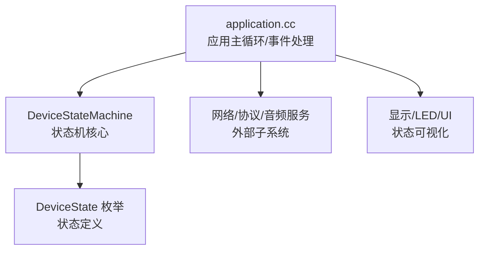
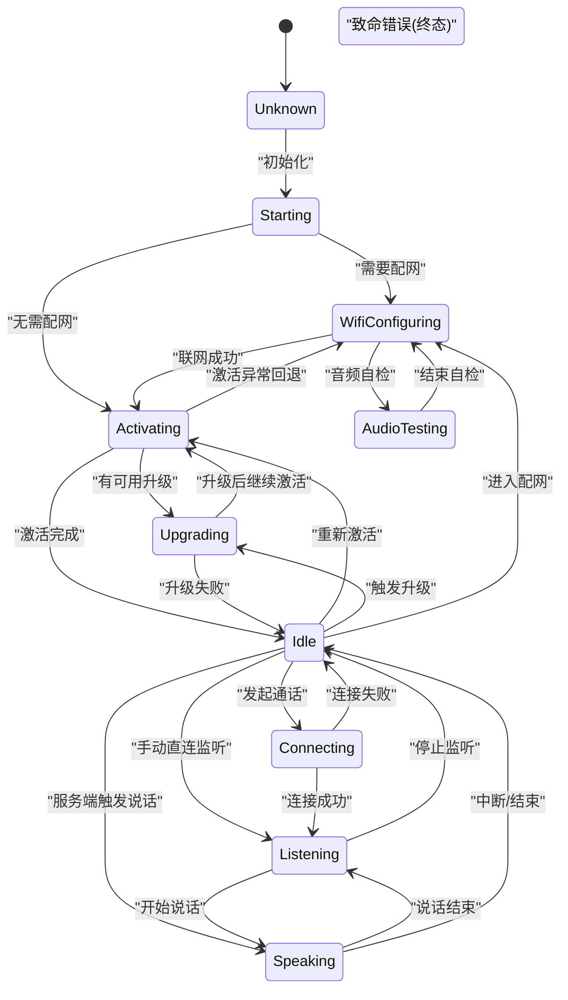
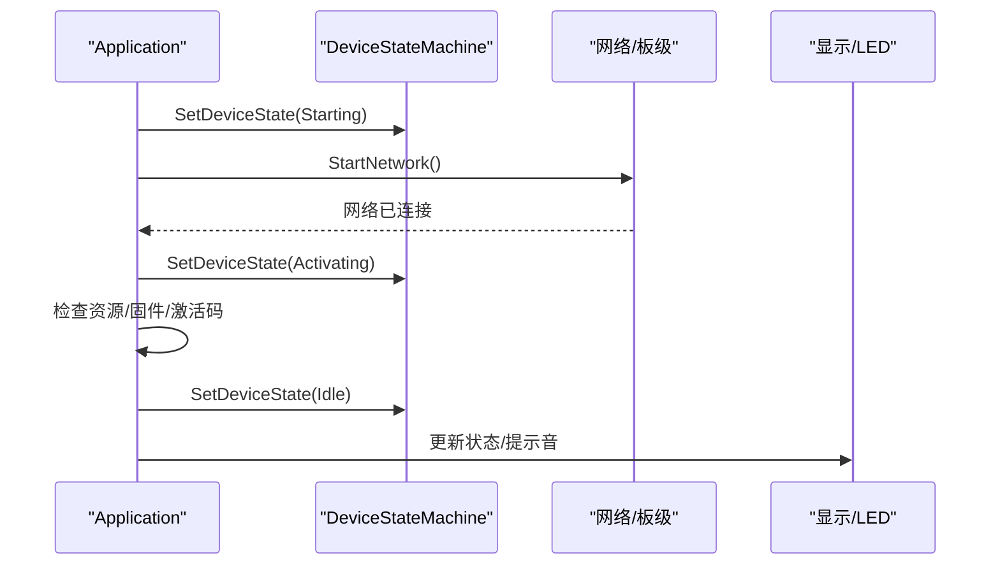
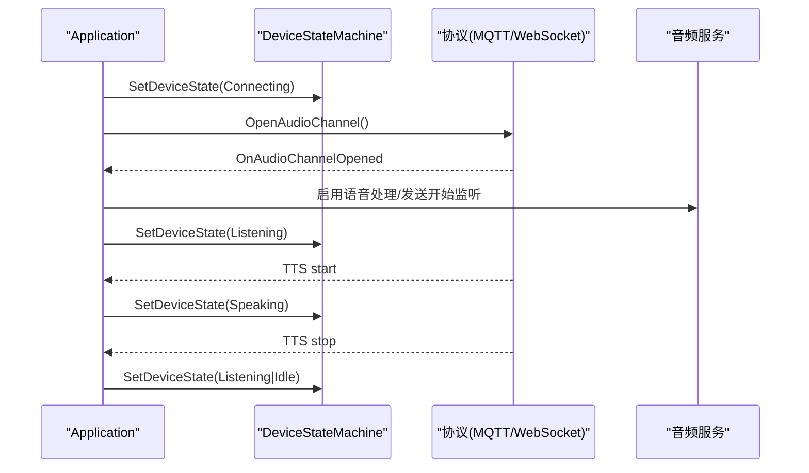
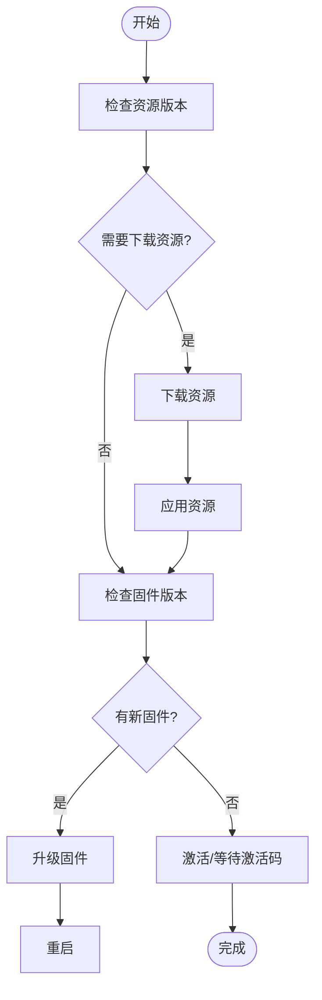
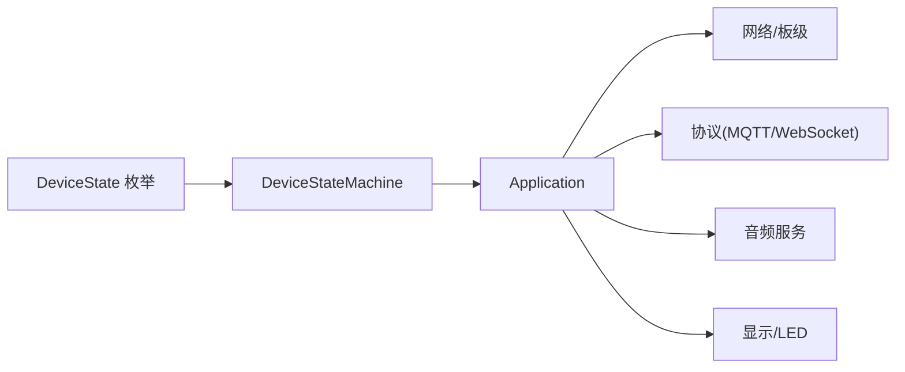

# 设备状态机

<cite>
**本文引用的文件**   
- [device_state.h](file://main/device_state.h)
- [device_state_machine.h](file://main/device_state_machine.h)
- [device_state_machine.cc](file://main/device_state_machine.cc)
- [application.cc](file://main/application.cc)
</cite>

## 目录
1. [简介](#简介)
2. [项目结构](#项目结构)
3. [核心组件](#核心组件)
4. [架构总览](#架构总览)
5. [详细组件分析](#详细组件分析)
6. [依赖关系分析](#依赖关系分析)
7. [性能与并发特性](#性能与并发特性)
8. [故障排查指南](#故障排查指南)
9. [结论](#结论)
10. [附录：使用示例与最佳实践](#附录使用示例与最佳实践)

## 简介
本文件围绕嵌入式系统中的“设备状态机”进行系统化文档化，聚焦有限状态机（FSM）设计模式在设备生命周期、连接与会话管理中的应用。内容涵盖：
- 所有设备状态的定义与含义
- 状态转换条件与规则
- 初始化流程、监听机制与回调注册
- 状态持久化策略、异常恢复与状态校验逻辑
- 状态转换图与关键业务流程时序
- 在不同业务场景下的正确使用方式与查询方法

## 项目结构
与设备状态机直接相关的代码位于 main 目录下，核心由三个文件组成：
- device_state.h：定义设备状态枚举
- device_state_machine.{h,cc}：实现状态机核心逻辑（状态校验、转换、通知）
- application.cc：应用层编排状态机，结合网络、音频、协议等子系统完成具体业务流转



图表来源
- [device_state.h:1-18](file://main/device_state.h#L1-L18)
- [device_state_machine.h:17-81](file://main/device_state_machine.h#L17-L81)
- [device_state_machine.cc:34-102](file://main/device_state_machine.cc#L34-L102)
- [application.cc:57-59](file://main/application.cc#L57-L59)

章节来源
- [device_state.h:1-18](file://main/device_state.h#L1-L18)
- [device_state_machine.h:17-81](file://main/device_state_machine.h#L17-L81)
- [device_state_machine.cc:34-102](file://main/device_state_machine.cc#L34-L102)
- [application.cc:57-59](file://main/application.cc#L57-L59)

## 核心组件
- 状态定义（DeviceState）
  - 包含未知、启动中、配网、空闲、连接中、监听、说话、升级、激活、音频测试、致命错误等状态，覆盖设备从开机到正常对话的完整生命周期。
- 状态机（DeviceStateMachine）
  - 提供当前状态读取、目标状态合法性检查、原子状态切换、变更回调注册与移除、状态名映射等能力。
  - 内部维护一个原子状态变量与观察者列表，保证线程安全与无锁快速路径。
- 应用集成（Application）
  - 将状态机与网络、协议、音频、UI 等模块联动，负责在正确时机发起状态转换，并在状态变更后更新 UI、音频处理与电源策略。

章节来源
- [device_state.h:4-16](file://main/device_state.h#L4-L16)
- [device_state_machine.h:17-81](file://main/device_state_machine.h#L17-L81)
- [device_state_machine.cc:24-32](file://main/device_state_machine.cc#L24-L32)
- [application.cc:88-91](file://main/application.cc#L88-L91)

## 架构总览
下图展示了状态机的类结构与主要职责边界，以及与应用层的交互点。

```mermaid
classDiagram
class DeviceState {
<<enum>>
"kDeviceStateUnknown"
"kDeviceStateStarting"
"kDeviceStateWifiConfiguring"
"kDeviceStateIdle"
"kDeviceStateConnecting"
"kDeviceStateListening"
"kDeviceStateSpeaking"
"kDeviceStateUpgrading"
"kDeviceStateActivating"
"kDeviceStateAudioTesting"
"kDeviceStateFatalError"
}
class DeviceStateMachine {
+GetState() DeviceState
+TransitionTo(new_state) bool
+CanTransitionTo(target) bool
+AddStateChangeListener(callback) int
+RemoveStateChangeListener(id) void
+GetStateName(state) const char*
-IsValidTransition(from,to) bool
-NotifyStateChange(old,new) void
-current_state_ : atomic<DeviceState>
-listeners_ : vector<pair<int, callback>>
-next_listener_id_ : int
-mutex_ : mutex
}
class Application {
+SetDeviceState(state) bool
+HandleStateChangedEvent() void
+Initialize() void
+Run() void
-state_machine_ : DeviceStateMachine
}
Application --> DeviceStateMachine : "调用/监听"
DeviceStateMachine --> DeviceState : "使用"
```

图表来源
- [device_state.h:4-16](file://main/device_state.h#L4-L16)
- [device_state_machine.h:17-81](file://main/device_state_machine.h#L17-L81)
- [application.cc:57-59](file://main/application.cc#L57-L59)

## 详细组件分析

### 状态定义与语义
- kDeviceStateUnknown：初始未知态，仅允许进入 Starting
- kDeviceStateStarting：系统启动阶段，可进入配网或激活
- kDeviceStateWifiConfiguring：配网中，可进入激活或音频测试
- kDeviceStateAudioTesting：音频自检，可回退至配网
- kDeviceStateActivating：激活流程（含 OTA 资源/固件检查），可进入升级、空闲或回退配网
- kDeviceStateUpgrading：升级中，成功则回到激活，失败可回到空闲
- kDeviceStateIdle：空闲待机，可进入连接、监听、说话、激活、升级、配网
- kDeviceStateConnecting：建立会话中，成功进入监听，失败回到空闲
- kDeviceStateListening：正在听，可进入说话或回到空闲
- kDeviceStateSpeaking：正在说，可回到监听或空闲
- kDeviceStateFatalError：致命错误，不可再转换出该状态

章节来源
- [device_state.h:4-16](file://main/device_state.h#L4-L16)
- [device_state_machine.cc:34-102](file://main/device_state_machine.cc#L34-L102)

### 状态转换规则与验证
- 同一状态自转视为合法（幂等）
- 非法转换会记录警告日志并拒绝执行
- 致命错误态为终态，不允许任何出边转换

章节来源
- [device_state_machine.cc:34-102](file://main/device_state_machine.cc#L34-L102)

### 状态转换图


图表来源
- [device_state_machine.cc:34-102](file://main/device_state_machine.cc#L34-L102)

### 初始化与监听机制
- 初始化流程
  - 应用启动时设置状态为“启动中”，随后根据网络就绪情况进入“激活”或“配网”。
  - 注册状态变更监听器，当状态变化时通过事件组通知主循环刷新 UI 与外设。
- 监听与回调
  - 采用观察者模式，支持添加/移除监听器；回调在 TransitionTo 调用上下文中同步执行，避免竞态。
  - 应用侧在 HandleStateChangedEvent 中根据新状态驱动 UI、音频处理开关与电源策略。

章节来源
- [application.cc:61-94](file://main/application.cc#L61-L94)
- [application.cc:860-932](file://main/application.cc#L860-L932)
- [device_state_machine.h:49-59](file://main/device_state_machine.h#L49-L59)
- [device_state_machine.cc:133-161](file://main/device_state_machine.cc#L133-L161)

### 关键业务流程时序

#### 1) 启动与激活流程


图表来源
- [application.cc:61-94](file://main/application.cc#L61-L94)
- [application.cc:261-321](file://main/application.cc#L261-L321)

#### 2) 唤醒词触发与对话流程


图表来源
- [application.cc:780-858](file://main/application.cc#L780-L858)
- [application.cc:860-932](file://main/application.cc#L860-L932)

#### 3) 升级流程


图表来源
- [application.cc:340-471](file://main/application.cc#L340-L471)
- [application.cc:972-1022](file://main/application.cc#L972-L1022)

### 状态持久化与恢复策略
- 状态持久化
  - 当前实现未对状态进行非易失存储；设备重启后状态机默认处于未知态，由应用初始化流程重新编排。
- 异常恢复
  - 致命错误态为终态，需外部干预（如重启）才能恢复。
  - 升级失败会返回空闲态并继续运行；网络断开会关闭音频通道并回到空闲。
- 状态校验
  - 所有转换均经过 IsValidTransition 校验，非法转换会被拒绝并记录日志。

章节来源
- [device_state_machine.cc:34-102](file://main/device_state_machine.cc#L34-L102)
- [application.cc:286-297](file://main/application.cc#L286-L297)
- [application.cc:1006-1022](file://main/application.cc#L1006-L1022)

## 依赖关系分析
- 低耦合高内聚
  - 状态机仅依赖状态枚举与标准库容器/原子类型，不感知上层业务细节。
- 应用层编排
  - Application 作为协调者，依据网络、协议、音频事件驱动状态机，同时订阅状态变更以更新 UI 与外设。
- 可能的扩展点
  - 可在状态变更回调中接入更多子系统（如功耗管理、日志上报、遥测）。



图表来源
- [device_state.h:4-16](file://main/device_state.h#L4-L16)
- [device_state_machine.h:17-81](file://main/device_state_machine.h#L17-L81)
- [application.cc:57-59](file://main/application.cc#L57-L59)

章节来源
- [device_state.h:4-16](file://main/device_state.h#L4-L16)
- [device_state_machine.h:17-81](file://main/device_state_machine.h#L17-L81)
- [application.cc:57-59](file://main/application.cc#L57-L59)

## 性能与并发特性
- 原子状态读写
  - current_state_ 使用原子类型，读操作无锁，写操作在互斥保护下进行，适合高频查询。
- 观察者通知
  - 通知前拷贝回调列表，避免持有锁期间执行用户回调，降低阻塞风险。
- 主循环调度
  - 应用侧通过事件组与任务队列解耦耗时操作，确保状态变更与 UI 更新及时响应。

章节来源
- [device_state_machine.h:66-81](file://main/device_state_machine.h#L66-L81)
- [device_state_machine.cc:148-161](file://main/device_state_machine.cc#L148-L161)
- [application.cc:165-259](file://main/application.cc#L165-L259)

## 故障排查指南
- 常见现象与定位
  - 无法进入期望状态：检查是否满足 IsValidTransition 规则，确认当前状态与目标状态组合是否合法。
  - 状态变更未生效：确认 TransitionTo 返回值，查看日志中的“无效状态转换”告警。
  - 网络断开导致会话中断：确认是否在连接/监听/说话态下收到断网事件，并检查是否关闭了音频通道。
  - 升级失败：查看升级失败后的状态是否回到空闲，必要时重启设备。
- 建议的调试手段
  - 打印 GetStateName 辅助信息，观察状态流转轨迹。
  - 在 AddStateChangeListener 中增加更详细的上下文日志，便于定位触发源。

章节来源
- [device_state_machine.cc:117-131](file://main/device_state_machine.cc#L117-L131)
- [application.cc:286-297](file://main/application.cc#L286-L297)
- [application.cc:1006-1022](file://main/application.cc#L1006-L1022)

## 结论
该设备状态机以简洁清晰的 FSM 模型实现了设备从启动、激活、对话到升级的全生命周期管理。其优势在于：
- 严格的转换规则保障系统一致性
- 原子+互斥的并发模型兼顾性能与安全
- 观察者模式使 UI、音频、网络等多子系统松耦合协作
- 应用层编排清晰，易于扩展新的状态与流程

## 附录：使用示例与最佳实践

### 基本用法
- 获取当前状态
  - 通过 GetState 查询当前状态，用于 UI 显示或决策分支。
- 尝试状态转换
  - 使用 TransitionTo 发起转换，若返回 false 表示非法转换，应记录日志并回退。
- 注册监听器
  - 使用 AddStateChangeListener 注册回调，在回调中更新 UI、外设或触发后续动作；结束时用 RemoveStateChangeListener 清理。

章节来源
- [device_state_machine.h:26-59](file://main/device_state_machine.h#L26-L59)
- [device_state_machine.cc:107-131](file://main/device_state_machine.cc#L107-L131)

### 典型业务场景
- 启动与激活
  - 初始化后设置 Starting，网络就绪后进入 Activating，完成后进入 Idle。
- 唤醒词触发对话
  - 在 Idle 态检测到唤醒词时，先切换到 Connecting，打开音频通道后再进入 Listening/Speaking。
- 手动监听/停止
  - 在 Idle 态可直接进入 Listening；在 Listening 态发送停止命令后回到 Idle。
- 升级流程
  - 在 Activating 或 Idle 态触发升级，进入 Upgrading，成功后重启，失败则回到 Idle。

章节来源
- [application.cc:61-94](file://main/application.cc#L61-L94)
- [application.cc:780-858](file://main/application.cc#L780-L858)
- [application.cc:972-1022](file://main/application.cc#L972-L1022)

### 状态查询与展示
- 在 HandleStateChangedEvent 中统一处理状态变更，更新状态栏、聊天消息、表情与声音提示。
- 空闲态时清除聊天消息并重置表情，确保界面一致。

章节来源
- [application.cc:860-932](file://main/application.cc#L860-L932)