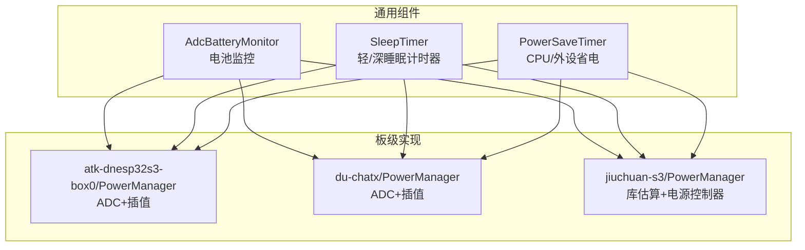
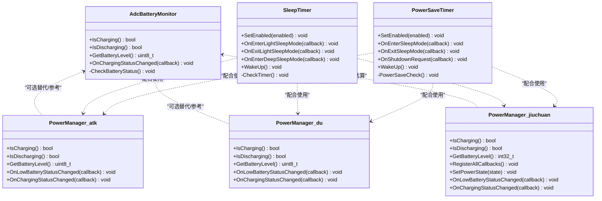
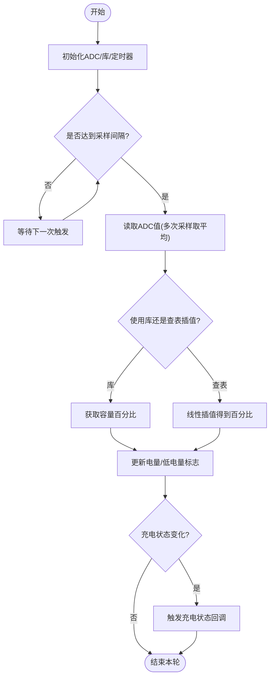
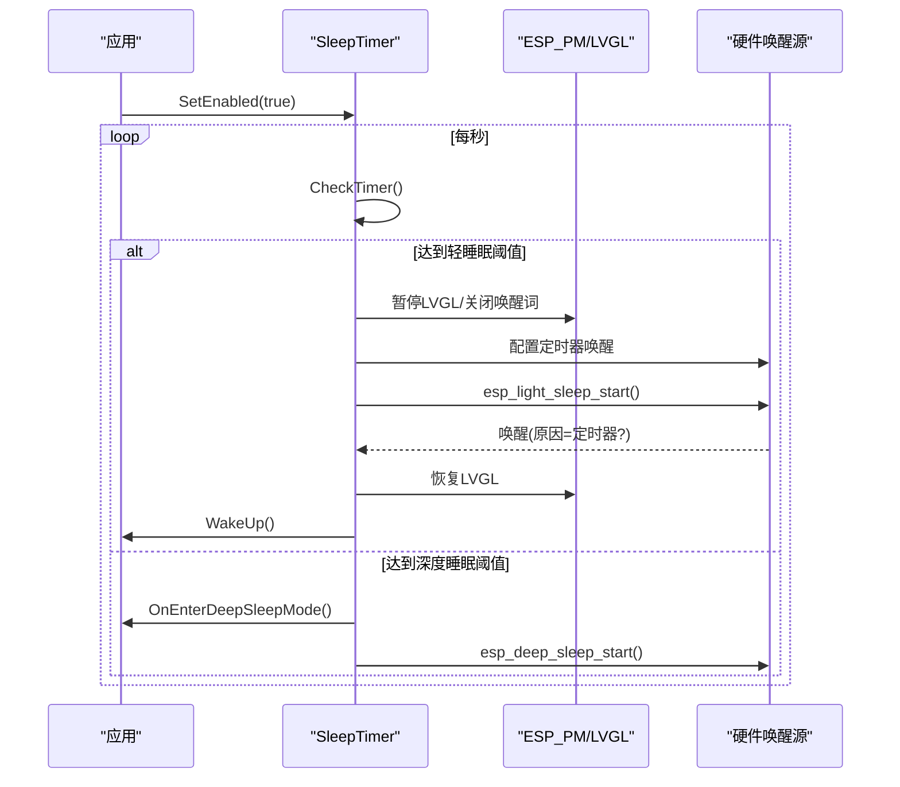
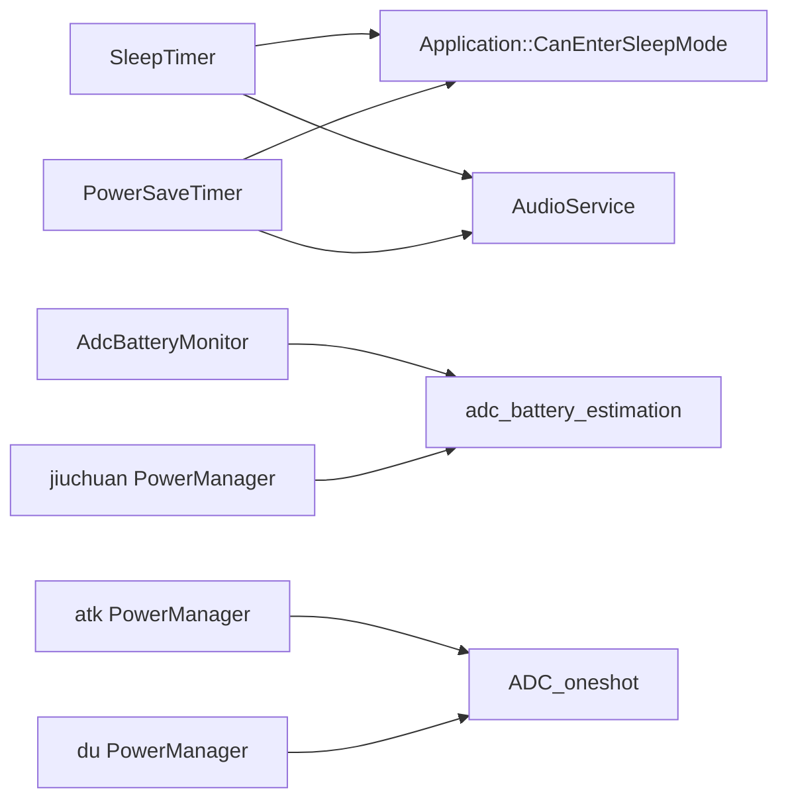

# 电源管理和低功耗

<cite>
**本文引用的文件**   
- [adc_battery_monitor.h](file://main/boards/common/adc_battery_monitor.h)
- [adc_battery_monitor.cc](file://main/boards/common/adc_battery_monitor.cc)
- [sleep_timer.h](file://main/boards/common/sleep_timer.h)
- [sleep_timer.cc](file://main/boards/common/sleep_timer.cc)
- [power_save_timer.h](file://main/boards/common/power_save_timer.h)
- [power_save_timer.cc](file://main/boards/common/power_save_timer.cc)
- [atk-dnesp32s3-box0/power_manager.h](file://main/boards/atk-dnesp32s3-box0/power_manager.h)
- [du-chatx/power_manager.h](file://main/boards/du-chatx/power_manager.h)
- [jiuchuan-s3/power_manager.h](file://main/boards/jiuchuan-s3/power_manager.h)
</cite>

## 目录
1. [简介](#简介)
2. [项目结构](#项目结构)
3. [核心组件](#核心组件)
4. [架构总览](#架构总览)
5. [详细组件分析](#详细组件分析)
6. [依赖关系分析](#依赖关系分析)
7. [性能与功耗特征](#性能与功耗特征)
8. [故障排查指南](#故障排查指南)
9. [结论](#结论)
10. [附录：平台适配与测量工具](#附录平台适配与测量工具)

## 简介
本技术文档围绕设备的电源管理与低功耗策略，系统阐述以下主题：
- 功耗优化策略与休眠模式实现（轻睡眠、深度睡眠）
- 电池监控与电量估算机制（ADC采样、分压、插值、库函数估算）
- 不同工作模式的功耗特征（活跃、空闲、轻睡眠、深度睡眠）
- 唤醒机制（定时器唤醒、外部中断唤醒、触摸唤醒等）
- 功耗分析与测量方法
- 针对不同硬件平台的电源管理适配要点
- 电源状态与系统功能的协调机制

## 项目结构
本项目在 boards/common 下提供通用的电源与休眠能力抽象，并在各板级目录中通过 PowerManager 进行具体实现。关键路径如下：
- 通用组件
  - 电池监控：AdcBatteryMonitor（基于 adc_battery_estimation 库）
  - 休眠计时器：SleepTimer（支持轻/深睡眠）
  - 省电计时器：PowerSaveTimer（CPU频率与外设降频）
- 板级电源管理
  - atk-dnesp32s3-box0：自研 ADC 采样+线性插值
  - du-chatx：自研 ADC 采样+线性插值
  - jiuchuan-s3：使用 adc_battery_estimation 库 + 电源控制器联动关机流程

图表来源
- [adc_battery_monitor.h:1-31](file://main/boards/common/adc_battery_monitor.h#L1-L31)
- [sleep_timer.h:1-33](file://main/boards/common/sleep_timer.h#L1-L33)
- [power_save_timer.h:1-35](file://main/boards/common/power_save_timer.h#L1-L35)
- [atk-dnesp32s3-box0/power_manager.h:1-194](file://main/boards/atk-dnesp32s3-box0/power_manager.h#L1-L194)
- [du-chatx/power_manager.h:1-187](file://main/boards/du-chatx/power_manager.h#L1-L187)
- [jiuchuan-s3/power_manager.h:1-201](file://main/boards/jiuchuan-s3/power_manager.h#L1-L201)

章节来源
- [adc_battery_monitor.h:1-31](file://main/boards/common/adc_battery_monitor.h#L1-L31)
- [sleep_timer.h:1-33](file://main/boards/common/sleep_timer.h#L1-L33)
- [power_save_timer.h:1-35](file://main/boards/common/power_save_timer.h#L1-L35)
- [atk-dnesp32s3-box0/power_manager.h:1-194](file://main/boards/atk-dnesp32s3-box0/power_manager.h#L1-L194)
- [du-chatx/power_manager.h:1-187](file://main/boards/du-chatx/power_manager.h#L1-L187)
- [jiuchuan-s3/power_manager.h:1-201](file://main/boards/jiuchuan-s3/power_manager.h#L1-L201)

## 核心组件
- AdcBatteryMonitor
  - 功能：周期性读取电池电压，计算充电状态与剩余电量；支持回调上报充电状态变化。
  - 关键点：可选硬件充电检测引脚；默认周期为1秒；失败时回退到GPIO或默认值。
- SleepTimer
  - 功能：根据空闲时长进入轻睡眠或深度睡眠；支持进入/退出回调；可配置唤醒源（如定时器）。
  - 关键点：在进入轻睡眠前暂停 LVGL 刷新，唤醒后恢复；可关闭语音唤醒以降低功耗。
- PowerSaveTimer
  - 功能：空闲时降低 CPU 最大频率并启用轻睡眠；支持进入/退出回调与关机请求回调。
  - 关键点：进入省电模式时禁用音频输入与唤醒词检测；退出时恢复。

章节来源
- [adc_battery_monitor.cc:1-116](file://main/boards/common/adc_battery_monitor.cc#L1-L116)
- [sleep_timer.cc:1-134](file://main/boards/common/sleep_timer.cc#L1-L134)
- [power_save_timer.cc:1-133](file://main/boards/common/power_save_timer.cc#L1-L133)

## 架构总览
整体电源管理由“通用组件 + 板级实现”组成：
- 通用层负责跨平台能力：电池监控、定时休眠、CPU/外设省电。
- 板级层负责具体硬件差异：ADC通道、分压电阻、充电检测引脚、电源控制器接口。

图表来源
- [adc_battery_monitor.h:1-31](file://main/boards/common/adc_battery_monitor.h#L1-L31)
- [sleep_timer.h:1-33](file://main/boards/common/sleep_timer.h#L1-L33)
- [power_save_timer.h:1-35](file://main/boards/common/power_save_timer.h#L1-L35)
- [atk-dnesp32s3-box0/power_manager.h:1-194](file://main/boards/atk-dnesp32s3-box0/power_manager.h#L1-L194)
- [du-chatx/power_manager.h:1-187](file://main/boards/du-chatx/power_manager.h#L1-L187)
- [jiuchuan-s3/power_manager.h:1-201](file://main/boards/jiuchuan-s3/power_manager.h#L1-L201)

## 详细组件分析

### 电池监控与电量计算
- 通用方案（AdcBatteryMonitor）
  - 初始化：配置 ADC 单元/通道、衰减、分压电阻；可选接入充电检测 GPIO。
  - 运行：每1秒触发一次检查，调用底层库获取容量百分比；若失败则回退到 GPIO 或默认值。
  - 事件：当充电状态变化时，通过回调通知上层。
- 板级方案（以 atk-dnesp32s3-box0、du-chatx 为例）
  - 初始化：创建一次性 ADC 单元与通道，设置位宽与衰减。
  - 运行：定时器每秒触发；首次快速采集若干样本建立基线；之后按固定间隔采样。
  - 算法：对最近 N 个样本求平均，再查表线性插值得到百分比；低于阈值触发低电量回调。
- 混合方案（jiuchuan-s3）
  - 使用 adc_battery_estimation 库，传入分压电阻与电池点表，直接获取容量。
  - 结合电源控制器，在关机状态下配置 RTC 唤醒源并进入深度睡眠。

图表来源
- [adc_battery_monitor.cc:1-116](file://main/boards/common/adc_battery_monitor.cc#L1-L116)
- [atk-dnesp32s3-box0/power_manager.h:27-125](file://main/boards/atk-dnesp32s3-box0/power_manager.h#L27-L125)
- [du-chatx/power_manager.h:28-111](file://main/boards/du-chatx/power_manager.h#L28-L111)
- [jiuchuan-s3/power_manager.h:67-76](file://main/boards/jiuchuan-s3/power_manager.h#L67-L76)

章节来源
- [adc_battery_monitor.cc:1-116](file://main/boards/common/adc_battery_monitor.cc#L1-L116)
- [atk-dnesp32s3-box0/power_manager.h:27-125](file://main/boards/atk-dnesp32s3-box0/power_manager.h#L27-L125)
- [du-chatx/power_manager.h:28-111](file://main/boards/du-chatx/power_manager.h#L28-L111)
- [jiuchuan-s3/power_manager.h:67-76](file://main/boards/jiuchuan-s3/power_manager.h#L67-L76)

### 休眠与唤醒机制
- SleepTimer
  - 空闲计数：每秒递增，超过阈值进入轻睡眠；超过更深阈值进入深度睡眠。
  - 轻睡眠流程：暂停 LVGL 刷新、配置定时器唤醒源、进入轻睡眠；唤醒后恢复刷新并根据唤醒原因决定是否继续循环。
  - 深度睡眠：直接调用 API 进入，需在上层注册进入回调以保存必要状态。
- PowerSaveTimer
  - 空闲计数：超过阈值进入省电模式，降低 CPU 最大频率并允许轻睡眠；同时关闭音频输入与唤醒词检测。
  - 退出省电：恢复 CPU 频率，重新开启唤醒词检测（若之前处于运行态），触发退出回调。

图表来源
- [sleep_timer.cc:66-123](file://main/boards/common/sleep_timer.cc#L66-L123)
- [sleep_timer.h:1-33](file://main/boards/common/sleep_timer.h#L1-L33)

章节来源
- [sleep_timer.cc:1-134](file://main/boards/common/sleep_timer.cc#L1-L134)
- [sleep_timer.h:1-33](file://main/boards/common/sleep_timer.h#L1-L33)
- [power_save_timer.cc:62-133](file://main/boards/common/power_save_timer.cc#L62-L133)
- [power_save_timer.h:1-35](file://main/boards/common/power_save_timer.h#L1-L35)

### 电源状态与系统功能协调
- 进入省电/轻睡眠前：
  - 停止 LVGL 刷新，避免后台任务耗电。
  - 关闭音频输入与唤醒词检测，减少 MCU 与编解码器功耗。
- 退出省电/轻睡眠后：
  - 恢复 LVGL 刷新与 CPU 频率。
  - 若之前有唤醒词检测，则重新启用。
- 关机流程（jiuchuan-s3）：
  - 通过电源控制器切换到关机状态，配置 RTC 外部唤醒源，拉低电源使能，进入深度睡眠。

章节来源
- [sleep_timer.cc:88-113](file://main/boards/common/sleep_timer.cc#L88-L113)
- [power_save_timer.cc:78-104](file://main/boards/common/power_save_timer.cc#L78-L104)
- [jiuchuan-s3/power_manager.h:160-189](file://main/boards/jiuchuan-s3/power_manager.h#L160-L189)

## 依赖关系分析
- 组件耦合
  - SleepTimer 与 PowerSaveTimer 均依赖 Application 的 CanEnterSleepMode 与 AudioService 的状态控制。
  - 板级 PowerManager 可选择使用通用 AdcBatteryMonitor 或直接实现 ADC 采样与插值。
- 外部依赖
  - ESP-IDF：esp_timer、esp_pm、esp_sleep、driver/gpio、driver/adc_oneshot。
  - 第三方库：adc_battery_estimation（用于更精确的电量估算）。

图表来源
- [sleep_timer.cc:66-123](file://main/boards/common/sleep_timer.cc#L66-L123)
- [power_save_timer.cc:62-133](file://main/boards/common/power_save_timer.cc#L62-L133)
- [adc_battery_monitor.cc:1-116](file://main/boards/common/adc_battery_monitor.cc#L1-L116)
- [atk-dnesp32s3-box0/power_manager.h:128-167](file://main/boards/atk-dnesp32s3-box0/power_manager.h#L128-L167)
- [du-chatx/power_manager.h:114-160](file://main/boards/du-chatx/power_manager.h#L114-L160)
- [jiuchuan-s3/power_manager.h:114-140](file://main/boards/jiuchuan-s3/power_manager.h#L114-L140)

章节来源
- [sleep_timer.cc:1-134](file://main/boards/common/sleep_timer.cc#L1-L134)
- [power_save_timer.cc:1-133](file://main/boards/common/power_save_timer.cc#L1-L133)
- [adc_battery_monitor.cc:1-116](file://main/boards/common/adc_battery_monitor.cc#L1-L116)
- [atk-dnesp32s3-box0/power_manager.h:1-194](file://main/boards/atk-dnesp32s3-box0/power_manager.h#L1-L194)
- [du-chatx/power_manager.h:1-187](file://main/boards/du-chatx/power_manager.h#L1-L187)
- [jiuchuan-s3/power_manager.h:1-201](file://main/boards/jiuchuan-s3/power_manager.h#L1-L201)

## 性能与功耗特征
- 活跃模式
  - CPU 全频运行，音频输入与唤醒词检测开启，屏幕刷新持续。
- 空闲模式
  - 无用户交互且业务空闲，可进入省电模式：降低 CPU 最大频率、允许轻睡眠、关闭音频输入与唤醒词检测。
- 轻睡眠
  - 仅保留必要唤醒源（如定时器），MCU 主核停转，外设按需供电；唤醒开销小，适合短时休眠。
- 深度睡眠
  - 最低功耗，仅 RTC 与少量唤醒源可用；适用于长时间待机或关机场景。

[本节为通用指导，不直接分析具体文件]

## 故障排查指南
- 电池电量不准
  - 检查 ADC 通道、衰减与分压电阻参数是否与硬件一致。
  - 确认采样队列长度与采样间隔是否合理，避免负载波动导致读数抖动。
- 无法进入轻/深睡眠
  - 检查 CanEnterSleepMode 返回条件是否满足。
  - 确认唤醒源已正确配置（定时器/外部中断/RTC IO）。
- 唤醒后异常
  - 检查唤醒原因判断逻辑，确保仅在预期唤醒源触发时继续运行。
  - 确认 LVGL 与音频服务在唤醒后正确恢复。
- 低电量未触发
  - 核对低电量阈值与插值表/库点表是否匹配当前电池特性。

章节来源
- [sleep_timer.cc:102-113](file://main/boards/common/sleep_timer.cc#L102-L113)
- [power_save_timer.cc:78-104](file://main/boards/common/power_save_timer.cc#L78-L104)
- [atk-dnesp32s3-box0/power_manager.h:80-125](file://main/boards/atk-dnesp32s3-box0/power_manager.h#L80-L125)
- [du-chatx/power_manager.h:68-111](file://main/boards/du-chatx/power_manager.h#L68-L111)
- [jiuchuan-s3/power_manager.h:160-189](file://main/boards/jiuchuan-s3/power_manager.h#L160-L189)

## 结论
本项目通过通用组件与板级实现的解耦设计，提供了灵活的电源管理与低功耗策略：
- 电池监控既可采用通用库估算，也可采用板级 ADC 采样与插值。
- 休眠策略覆盖轻睡眠与深度睡眠，并提供进入/退出回调以协调系统资源。
- 省电模式通过降频与关闭非必要模块显著降低功耗。
- 唤醒机制支持定时器与外部中断，便于在不同场景下灵活组合。

[本节为总结性内容，不直接分析具体文件]

## 附录：平台适配与测量工具

### 平台适配要点
- ADC 与分压网络
  - 明确 ADC 单元、通道、位宽与衰减；校准分压电阻比，必要时增加滤波与采样次数。
- 充电检测
  - 优先使用硬件充电检测引脚；若无，则通过软件估算或忽略该信号。
- 唤醒源选择
  - 轻睡眠常用定时器唤醒；深度睡眠建议使用 RTC IO 或按键中断作为唤醒源。
- 电源控制器
  - 对于带 PMIC 或电源开关的板卡，需在关机流程中正确拉低 PWR_EN 并配置唤醒源。

章节来源
- [adc_battery_monitor.cc:18-42](file://main/boards/common/adc_battery_monitor.cc#L18-L42)
- [sleep_timer.cc:95-106](file://main/boards/common/sleep_timer.cc#L95-L106)
- [jiuchuan-s3/power_manager.h:160-189](file://main/boards/jiuchuan-s3/power_manager.h#L160-L189)

### 功耗分析与测量建议
- 电流表/电子负载
  - 串联于电池正极，记录活跃、空闲、轻睡眠、深度睡眠的平均与峰值电流。
- 示波器
  - 监测关键节点（PWR_EN、充电指示、唤醒源引脚）的跳变与时序。
- 日志与统计
  - 利用现有日志输出（如电量、唤醒原因、省电模式切换）辅助定位问题。
- 基准对比
  - 对比不同 CPU 频率、屏幕刷新、音频输入与唤醒词检测开启/关闭时的功耗差异。

[本节为通用指导，不直接分析具体文件]