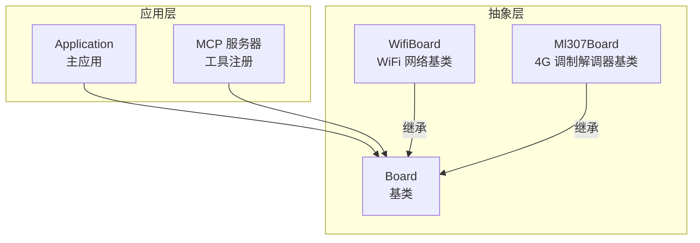
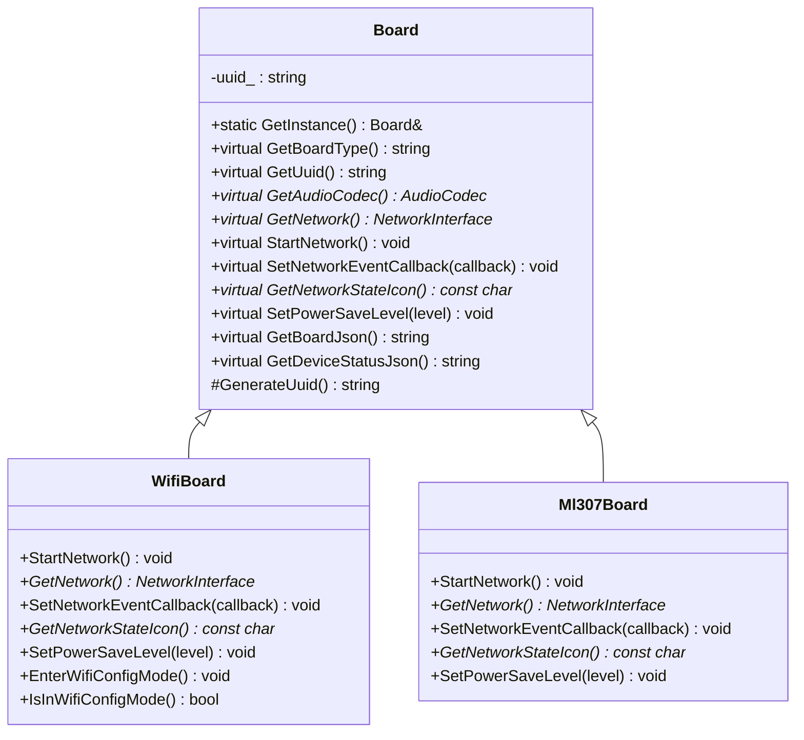
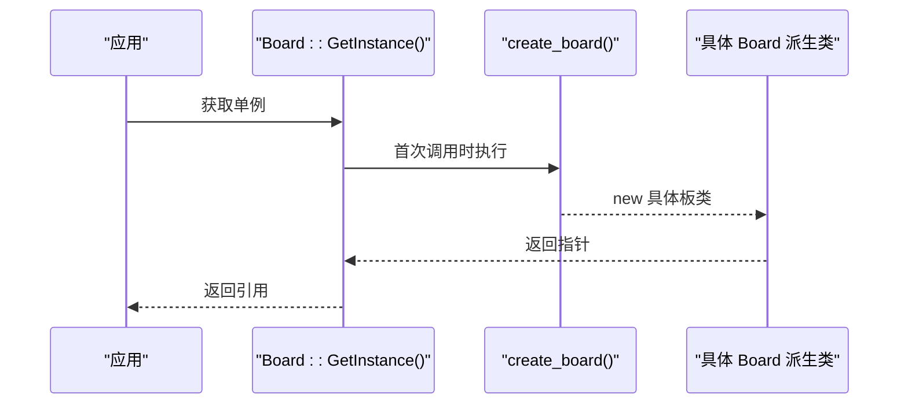
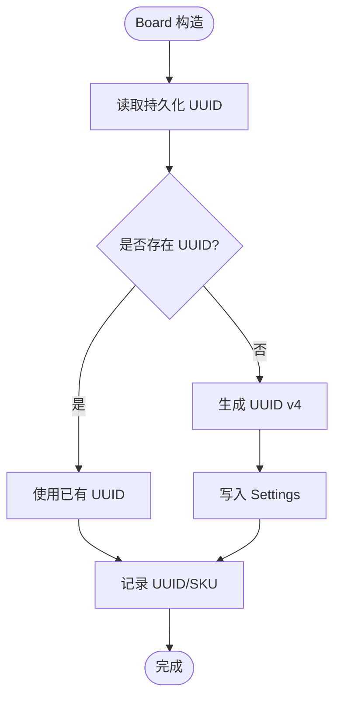
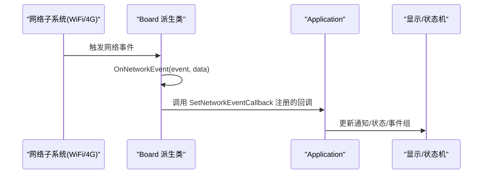
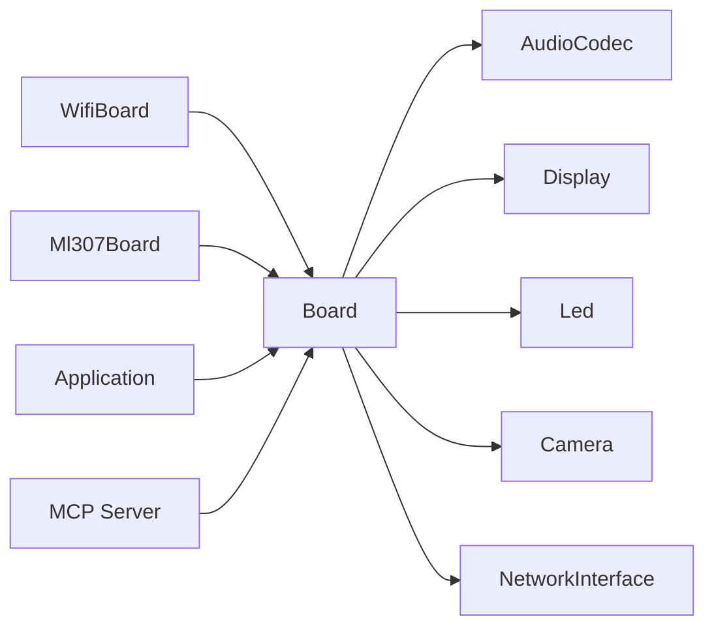

# Board抽象接口设计

<cite>
**本文引用的文件**   
- [board.h](file://main/boards/common/board.h)
- [board.cc](file://main/boards/common/board.cc)
- [wifi_board.h](file://main/boards/common/wifi_board.h)
- [ml307_board.h](file://main/boards/common/ml307_board.h)
- [application.cc](file://main/application.cc)
- [mcp_server.cc](file://main/mcp_server.cc)
- [custom-board.md](file://docs/custom-board.md)
</cite>

## 目录
1. [简介](#简介)
2. [项目结构](#项目结构)
3. [核心组件](#核心组件)
4. [架构总览](#架构总览)
5. [详细组件分析](#详细组件分析)
6. [依赖关系分析](#依赖关系分析)
7. [性能与资源考虑](#性能与资源考虑)
8. [故障排查指南](#故障排查指南)
9. [结论](#结论)
10. [附录：新板接入最佳实践](#附录新板接入最佳实践)

## 简介
本文件围绕 Board 抽象接口进行系统化技术文档化，重点阐述以下方面：
- 设计理念与架构模式：工厂模式、单例模式、虚函数接口原则
- 关键纯虚函数职责：GetBoardType()、GetAudioCodec()、GetNetwork()、StartNetwork() 等
- 设备 UUID 生成机制、电源管理级别枚举、网络事件回调系统
- 接口使用示例与最佳实践
- 如何通过 DECLARE_BOARD 宏实现新板级支持
- 错误处理策略与异常安全考虑

## 项目结构
Board 抽象位于 boards/common 下，提供统一的硬件抽象层；具体网络类型（WiFi、4G）通过子类扩展；应用层通过单例访问 Board，并注册网络事件回调。

图表来源
- [board.h:49-85](file://main/boards/common/board.h#L49-L85)
- [wifi_board.h:9-67](file://main/boards/common/wifi_board.h#L9-L67)
- [ml307_board.h:9-36](file://main/boards/common/ml307_board.h#L9-L36)
- [application.cc:102-143](file://main/application.cc#L102-L143)
- [mcp_server.cc:51-78](file://main/mcp_server.cc#L51-L78)

章节来源
- [board.h:49-85](file://main/boards/common/board.h#L49-L85)
- [wifi_board.h:9-67](file://main/boards/common/wifi_board.h#L9-L67)
- [ml307_board.h:9-36](file://main/boards/common/ml307_board.h#L9-L36)
- [application.cc:102-143](file://main/application.cc#L102-L143)
- [mcp_server.cc:51-78](file://main/mcp_server.cc#L51-L78)

## 核心组件
- Board 基类
  - 提供单例访问 GetInstance()
  - 定义纯虚函数：GetBoardType()、GetAudioCodec()、GetNetwork()、StartNetwork()、GetNetworkStateIcon()、SetPowerSaveLevel()、GetBoardJson()、GetDeviceStatusJson()
  - 默认实现：GetDisplay()、GetCamera()、GetLed()、GetBatteryLevel()、GetTemperature()、GetSystemInfoJson()
  - 设备唯一标识 uuid_ 的持久化与生成
- WifiBoard / Ml307Board
  - 分别封装 WiFi 与 4G 网络的启动流程与事件回调
  - 统一暴露 NetworkInterface* 给上层协议栈
- 网络事件回调系统
  - 通过 SetNetworkEventCallback 注册回调，应用层在 application.cc 中消费事件以更新 UI 和状态机
- MCP 集成
  - 通过 Board::GetInstance().GetAudioCodec()/GetBacklight()/GetDisplay()/GetNetwork() 暴露设备能力到 MCP 工具

章节来源
- [board.h:49-85](file://main/boards/common/board.h#L49-L85)
- [board.cc:15-46](file://main/boards/common/board.cc#L15-L46)
- [board.cc:70-178](file://main/boards/common/board.cc#L70-L178)
- [wifi_board.h:9-67](file://main/boards/common/wifi_board.h#L9-L67)
- [ml307_board.h:9-36](file://main/boards/common/ml307_board.h#L9-L36)
- [application.cc:102-143](file://main/application.cc#L102-L143)
- [mcp_server.cc:51-78](file://main/mcp_server.cc#L51-L78)

## 架构总览
Board 采用“工厂 + 单例”的组合模式：
- 工厂模式：DECLARE_BOARD(ClassName) 将 create_board() 指向具体 Board 派生类的构造，从而在运行时动态创建实例
- 单例模式：Board::GetInstance() 保证全局唯一访问点，内部调用 create_board() 完成首次实例化

图表来源
- [board.h:49-85](file://main/boards/common/board.h#L49-L85)
- [wifi_board.h:9-67](file://main/boards/common/wifi_board.h#L9-L67)
- [ml307_board.h:9-36](file://main/boards/common/ml307_board.h#L9-L36)

章节来源
- [board.h:49-85](file://main/boards/common/board.h#L49-L85)
- [wifi_board.h:9-67](file://main/boards/common/wifi_board.h#L9-L67)
- [ml307_board.h:9-36](file://main/boards/common/ml307_board.h#L9-L36)

## 详细组件分析

### Board 基类设计与虚函数契约
- 设计原则
  - 最小公共接口：仅暴露跨平台/跨网络类型所需的能力
  - 可替换性：通过纯虚函数强制派生类实现差异化行为
  - 可扩展性：新增硬件能力时优先以可选默认实现+覆盖方式演进
- 关键纯虚函数说明
  - GetBoardType(): 返回板级类型字符串，用于构建系统与日志识别
  - GetAudioCodec(): 返回音频编解码器指针，供播放/录音链路使用
  - GetNetwork(): 返回网络接口指针，供协议栈发起 HTTP/WebSocket/MQTT/UDP 等请求
  - StartNetwork(): 异步启动网络连接，并通过 SetNetworkEventCallback 上报连接状态
  - GetNetworkStateIcon(): 返回当前网络状态的图标标识
  - SetPowerSaveLevel(): 设置电源管理级别（低功耗/均衡/高性能）
  - GetBoardJson()/GetDeviceStatusJson(): 序列化板级信息与设备状态，供诊断与远程查询
- 默认实现与可选能力
  - GetDisplay()/GetCamera()/GetLed(): 提供空实现或占位对象，便于无屏/无相机/无 LED 的简化板
  - GetBatteryLevel()/GetTemperature(): 默认返回 false，由具体板实现电量/温度采集
  - GetSystemInfoJson(): 汇总芯片、分区表、应用版本、显示信息、板信息等

章节来源
- [board.h:49-85](file://main/boards/common/board.h#L49-L85)
- [board.cc:56-68](file://main/boards/common/board.cc#L56-L68)
- [board.cc:70-178](file://main/boards/common/board.cc#L70-L178)

### 工厂模式与单例模式
- 工厂模式
  - DECLARE_BOARD(BOARD_CLASS_NAME) 宏生成 create_board()，返回 new BOARD_CLASS_NAME()
  - 各板级源文件通过声明该宏完成自身类型的注册
- 单例模式
  - Board::GetInstance() 使用静态局部指针，确保全局唯一且线程安全的延迟初始化
  - 内部委托 create_board() 完成具体类型的构造

图表来源
- [board.h:62-65](file://main/boards/common/board.h#L62-L65)
- [board.h:87-90](file://main/boards/common/board.h#L87-L90)

章节来源
- [board.h:62-65](file://main/boards/common/board.h#L62-L65)
- [board.h:87-90](file://main/boards/common/board.h#L87-L90)

### 设备 UUID 生成与持久化
- 生成策略
  - 使用 ESP32 硬件随机数填充 16 字节
  - 设置 UUID v4 版本位与变体位
  - 格式化为标准 UUID 字符串
- 持久化
  - 启动时从 Settings 读取 uuid_，若为空则生成并回写
- 用途
  - 作为设备唯一标识，参与系统信息 JSON 输出与 OTA/诊断

图表来源
- [board.cc:15-23](file://main/boards/common/board.cc#L15-L23)
- [board.cc:25-46](file://main/boards/common/board.cc#L25-L46)

章节来源
- [board.cc:15-23](file://main/boards/common/board.cc#L15-L23)
- [board.cc:25-46](file://main/boards/common/board.cc#L25-L46)

### 网络事件回调系统
- 事件类型
  - Scanning/Connecting/Connected/Disconnected/WifiConfigModeEnter/Exit
  - 蜂窝网专用：ModemDetecting/ModemErrorNoSIM/ModemErrorRegDenied/ModemErrorInitFailed/ModemErrorTimeout
- 回调注册
  - Board::SetNetworkEventCallback 允许上层注册回调
  - WifiBoard/Ml307Board 内部触发 OnNetworkEvent 并转发至已注册回调
- 应用层消费
  - Application 在回调中更新显示通知、设置状态栏、触发事件组以驱动状态机

图表来源
- [board.h:20-44](file://main/boards/common/board.h#L20-L44)
- [wifi_board.h:17-22](file://main/boards/common/wifi_board.h#L17-L22)
- [ml307_board.h:19-24](file://main/boards/common/ml307_board.h#L19-L24)
- [application.cc:102-143](file://main/application.cc#L102-L143)

章节来源
- [board.h:20-44](file://main/boards/common/board.h#L20-L44)
- [wifi_board.h:17-22](file://main/boards/common/wifi_board.h#L17-L22)
- [ml307_board.h:19-24](file://main/boards/common/ml307_board.h#L19-L24)
- [application.cc:102-143](file://main/application.cc#L102-L143)

### 电源管理级别枚举
- 级别定义
  - LOW_POWER：最大省电（最低功耗）
  - BALANCED：中等省电（平衡）
  - PERFORMANCE：不省电（最高性能）
- 使用建议
  - 空闲/待机场景切换到低功耗
  - 通话/语音交互切换到高性能
  - 一般交互使用均衡模式

章节来源
- [board.h:35-40](file://main/boards/common/board.h#L35-L40)

### 接口使用示例与最佳实践
- 获取音频编解码器
  - 通过 Board::GetInstance().GetAudioCodec() 获取指针，再调用 SetOutputVolume 等方法
- 获取网络接口
  - 通过 Board::GetInstance().GetNetwork() 获取 NetworkInterface*，用于创建 HTTP/WebSocket/MQTT/UDP 客户端
- 注册网络事件回调
  - 在应用初始化阶段调用 Board::GetInstance().SetNetworkEventCallback(...)，并在回调中更新 UI 与状态机
- 参考路径
  - 音频控制：[mcp_server.cc:55-64](file://main/mcp_server.cc#L55-L64)
  - 网络访问：[mcp_server.cc:242-269](file://main/mcp_server.cc#L242-L269)
  - 网络事件消费：[application.cc:102-143](file://main/application.cc#L102-L143)

章节来源
- [mcp_server.cc:55-64](file://main/mcp_server.cc#L55-L64)
- [mcp_server.cc:242-269](file://main/mcp_server.cc#L242-L269)
- [application.cc:102-143](file://main/application.cc#L102-L143)

### 通过 DECLARE_BOARD 宏实现新板级支持
- 步骤要点
  - 新建板目录与配置文件（config.h/config.json）
  - 实现 Board 派生类，重写必要虚函数（如 GetAudioCodec/GetDisplay/GetBacklight 等）
  - 在文件末尾添加 DECLARE_BOARD(YourBoardClass) 完成工厂注册
  - 在 Kconfig/CMakeLists 中添加选择项，使构建系统能编译对应板
- 参考文档
  - 自定义板指南：[custom-board.md](file://docs/custom-board.md)

章节来源
- [custom-board.md:136-279](file://docs/custom-board.md#L136-L279)
- [board.h:87-90](file://main/boards/common/board.h#L87-L90)

## 依赖关系分析
- 组件耦合
  - Board 依赖底层外设抽象（AudioCodec/Display/Led/Camera）与网络接口（NetworkInterface）
  - WifiBoard/Ml307Board 依赖各自网络栈（WiFi 管理器/AT 调制解调器）
- 外部依赖
  - ESP-IDF 系统库（随机数、分区表、OTA、芯片信息）
  - FreeRTOS 定时器/事件组（用于网络超时与任务调度）
- 潜在循环依赖
  - 应用层通过 Board 单例访问网络与媒体能力，避免直接耦合具体实现

图表来源
- [board.h:49-85](file://main/boards/common/board.h#L49-L85)
- [wifi_board.h:9-67](file://main/boards/common/wifi_board.h#L9-L67)
- [ml307_board.h:9-36](file://main/boards/common/ml307_board.h#L9-L36)
- [application.cc:102-143](file://main/application.cc#L102-L143)
- [mcp_server.cc:51-78](file://main/mcp_server.cc#L51-L78)

章节来源
- [board.h:49-85](file://main/boards/common/board.h#L49-L85)
- [wifi_board.h:9-67](file://main/boards/common/wifi_board.h#L9-L67)
- [ml307_board.h:9-36](file://main/boards/common/ml307_board.h#L9-L36)
- [application.cc:102-143](file://main/application.cc#L102-L143)
- [mcp_server.cc:51-78](file://main/mcp_server.cc#L51-L78)

## 性能与资源考虑
- 单例与延迟初始化
  - 仅在首次访问时构造具体 Board，减少冷启动开销
- 网络事件回调
  - 回调中应避免阻塞操作，尽量轻量更新 UI 与事件标志
- 内存分配
  - 在 MCP 工具中使用网络下载图片时注意堆分配与释放，避免泄漏
- 电源管理
  - 根据场景切换 PowerSaveLevel，降低待机功耗

章节来源
- [mcp_server.cc:242-269](file://main/mcp_server.cc#L242-L269)
- [board.h:35-40](file://main/boards/common/board.h#L35-L40)

## 故障排查指南
- 无法获取音频编解码器
  - 检查板级 GetAudioCodec() 是否返回有效指针
  - 确认 I2C/I2S 引脚配置与地址正确
- 网络事件未触发
  - 确认已调用 SetNetworkEventCallback 并正确注册回调
  - 检查 WifiBoard/Ml307Board 的 OnNetworkEvent 是否被调用
- 设备状态异常
  - 查看 GetSystemInfoJson() 输出，核对 UUID、分区表与应用版本
- 常见问题定位
  - 显示/音频/网络问题可参考自定义板指南中的排错建议

章节来源
- [board.cc:70-178](file://main/boards/common/board.cc#L70-L178)
- [custom-board.md:462-468](file://docs/custom-board.md#L462-L468)

## 结论
Board 抽象接口通过清晰的虚函数契约、工厂+单例的实例化机制以及统一的网络事件回调体系，为多板型、多网络类型提供了高内聚、低耦合的硬件抽象层。遵循本文档的设计原则与实践建议，可快速、稳健地扩展新板支持，并确保系统稳定性与可维护性。

## 附录：新板接入最佳实践
- 从相似板复制起步，逐步点亮显示、音频、网络
- 严格核对 config.h 引脚定义与原理图一致
- 使用 DECLARE_BOARD 宏完成工厂注册，避免重复造轮子
- 在应用层注册网络事件回调，及时更新 UI 与状态机
- 合理设置电源管理级别，兼顾体验与功耗

章节来源
- [custom-board.md:455-461](file://docs/custom-board.md#L455-L461)
- [board.h:87-90](file://main/boards/common/board.h#L87-L90)
- [application.cc:102-143](file://main/application.cc#L102-L143)