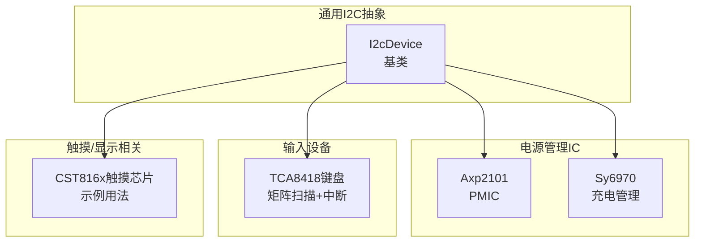
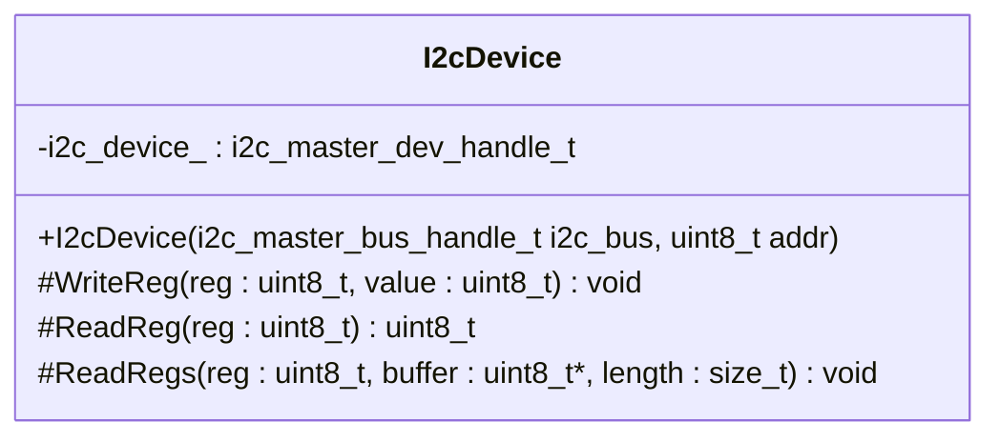
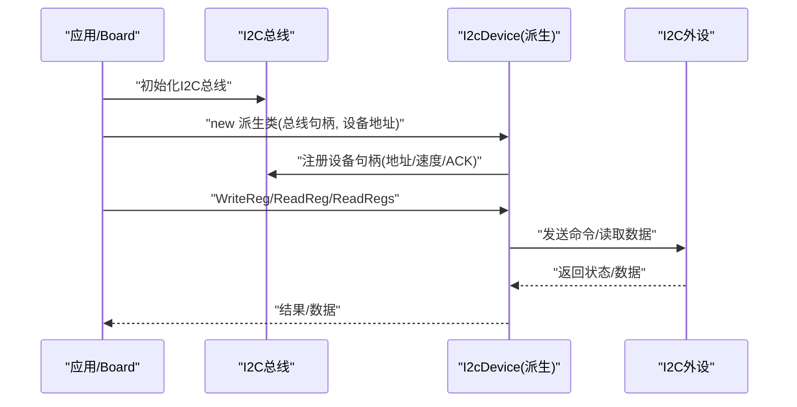
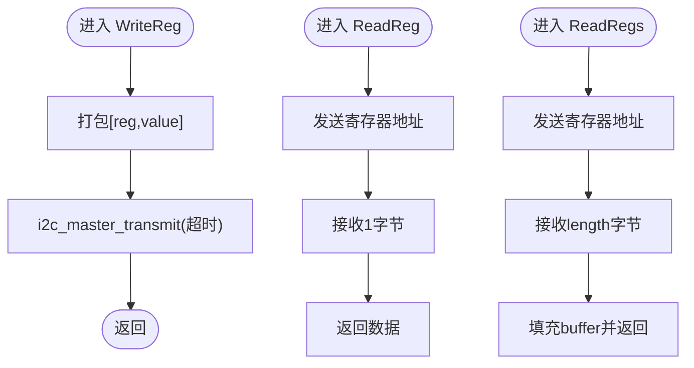
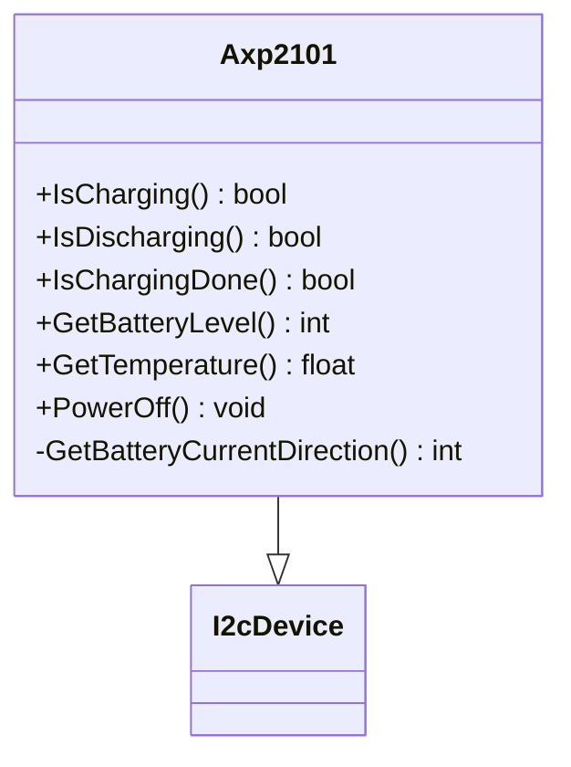
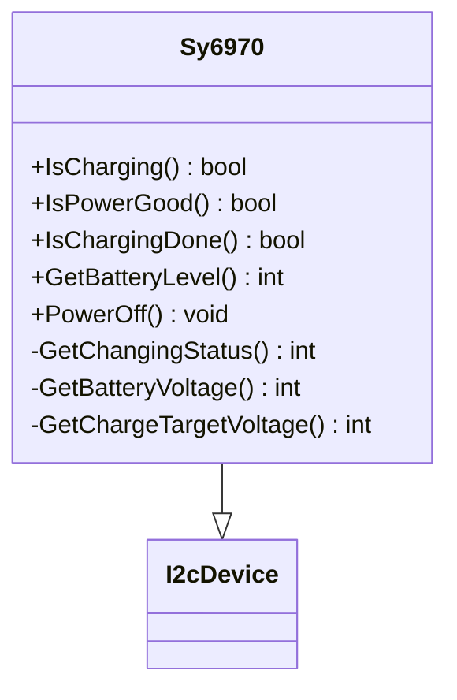
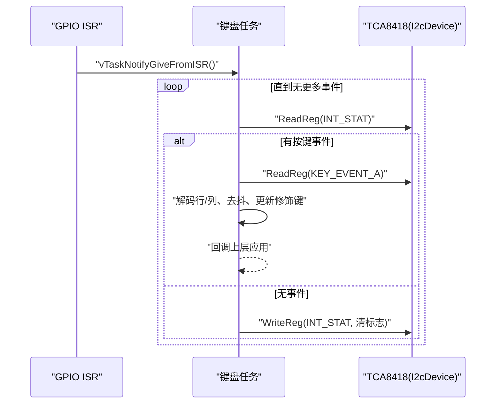
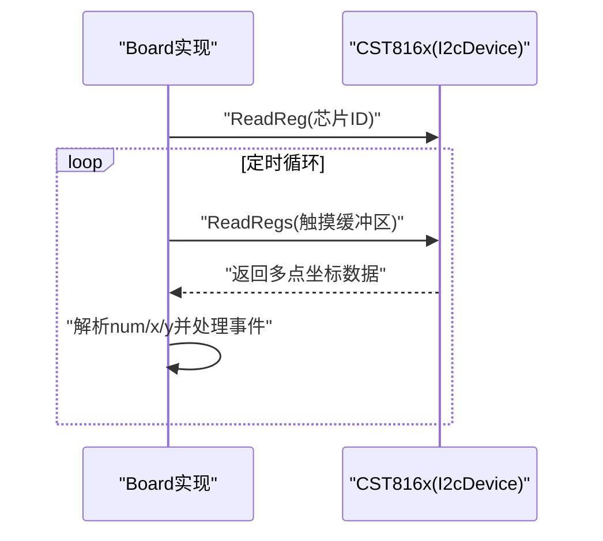
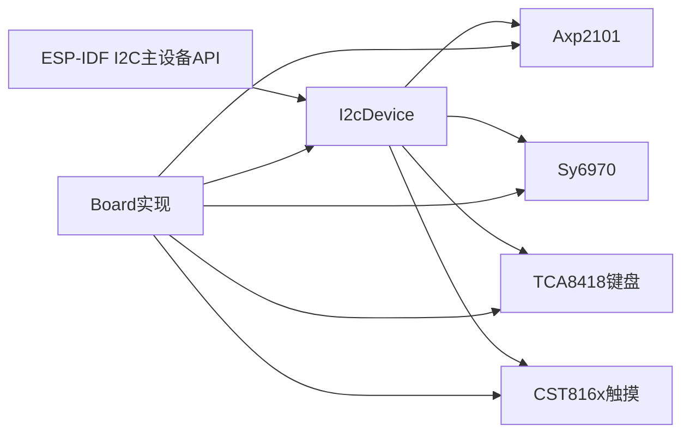

# I2C设备抽象层

<cite>
**本文引用的文件列表**
- [i2c_device.h](file://main/boards/common/i2c_device.h)
- [i2c_device.cc](file://main/boards/common/i2c_device.cc)
- [axp2101.h](file://main/boards/common/axp2101.h)
- [axp2101.cc](file://main/boards/common/axp2101.cc)
- [sy6970.h](file://main/boards/common/sy6970.h)
- [sy6970.cc](file://main/boards/common/sy6970.cc)
- [tca8418_keyboard.h](file://main/boards/m5stack-cardputer-adv/tca8418_keyboard.h)
- [tca8418_keyboard.cc](file://main/boards/m5stack-cardputer-adv/tca8418_keyboard.cc)
- [lilygo-t-cameraplus-s3.cc](file://main/boards/lilygo-t-cameraplus-s3/lilygo-t-cameraplus-s3.cc)
</cite>

## 目录
1. [简介](#简介)
2. [项目结构](#项目结构)
3. [核心组件](#核心组件)
4. [架构总览](#架构总览)
5. [详细组件分析](#详细组件分析)
6. [依赖关系分析](#依赖关系分析)
7. [性能与可靠性](#性能与可靠性)
8. [故障排查指南](#故障排查指南)
9. [结论](#结论)
10. [附录：外设驱动开发示例](#附录外设驱动开发示例)

## 简介
本技术文档围绕I2C设备抽象层展开，聚焦I2cDevice基类的设计模式与统一访问接口，系统阐述寄存器读写、多字节传输、错误处理与重试策略、总线初始化流程、设备地址与时钟配置、生命周期管理、资源分配与释放、并发访问控制等关键主题。同时提供传感器、EEPROM、显示控制器等常见I2C设备的适配方法，并给出调试技巧、信号质量测试与时序分析工具使用建议，帮助读者快速构建稳定可靠的I2C外设驱动。

## 项目结构
I2C抽象层位于通用板级公共模块中，具体实现由I2cDevice基类提供，上层通过继承该基类封装具体外设的寄存器操作与业务逻辑。典型的使用方式是在各Board实现中创建I2C总线、探测设备、实例化具体设备对象并进行交互。

图表来源
- [i2c_device.h:6-16](file://main/boards/common/i2c_device.h#L6-L16)
- [axp2101.h:6-18](file://main/boards/common/axp2101.h#L6-L18)
- [sy6970.h:6-19](file://main/boards/common/sy6970.h#L6-L19)
- [tca8418_keyboard.h:116-153](file://main/boards/m5stack-cardputer-adv/tca8418_keyboard.h#L116-L153)
- [lilygo-t-cameraplus-s3.cc:20-52](file://main/boards/lilygo-t-cameraplus-s3/lilygo-t-cameraplus-s3.cc#L20-L52)

章节来源
- [i2c_device.h:1-19](file://main/boards/common/i2c_device.h#L1-L19)
- [i2c_device.cc:1-35](file://main/boards/common/i2c_device.cc#L1-L35)

## 核心组件
I2cDevice基类提供了统一的I2C设备访问接口，屏蔽底层ESP-IDF I2C主设备API的差异，向上层暴露简洁的寄存器读写能力。其设计要点如下：
- 构造时绑定I2C总线与设备地址，完成设备句柄注册
- 提供单字节写寄存器、单字节读寄存器、连续读寄存器（多字节）三个核心接口
- 所有I2C调用均使用超时参数，并通过错误检查宏进行异常上报

图表来源
- [i2c_device.h:6-16](file://main/boards/common/i2c_device.h#L6-L16)

章节来源
- [i2c_device.h:1-19](file://main/boards/common/i2c_device.h#L1-L19)
- [i2c_device.cc:8-35](file://main/boards/common/i2c_device.cc#L8-L35)

## 架构总览
I2C通信的整体流程包括：
- 总线初始化：配置端口、引脚、时钟源、内部上拉、队列深度等
- 设备发现：可选的设备地址扫描
- 设备实例化：为每个I2C外设创建派生类对象，传入总线句柄与设备地址
- 数据交互：通过基类提供的寄存器读写接口完成配置与数据采集
- 生命周期管理：在析构或退出路径中清理任务、中断与资源

图表来源
- [lilygo-t-cameraplus-s3.cc:94-109](file://main/boards/lilygo-t-cameraplus-s3/lilygo-t-cameraplus-s3.cc#L94-L109)
- [i2c_device.cc:8-20](file://main/boards/common/i2c_device.cc#L8-L20)

## 详细组件分析

### I2cDevice基类实现原理
- 构造函数
  - 设置设备地址位宽、目标地址、SCL频率（默认400kHz）、ACK校验开关
  - 调用总线添加设备接口，生成设备句柄
- 写寄存器
  - 将寄存器地址与数据打包为两字节缓冲，单次发送
- 读寄存器
  - 先发送寄存器地址，再接收一字节数据
- 连续读寄存器
  - 先发送寄存器地址，再按长度接收多字节数据

图表来源
- [i2c_device.cc:22-35](file://main/boards/common/i2c_device.cc#L22-L35)

章节来源
- [i2c_device.cc:8-35](file://main/boards/common/i2c_device.cc#L8-L35)

### 电源管理IC：Axp2101
- 功能概述
  - 电池充放电方向检测、充电完成判断、电量百分比、温度读取、关机控制
- 与I2cDevice的关系
  - 继承自I2cDevice，复用寄存器读写接口
- 典型用法
  - 构造后直接调用查询接口获取状态；关机前写入特定寄存器位

图表来源
- [axp2101.h:6-18](file://main/boards/common/axp2101.h#L6-L18)

章节来源
- [axp2101.h:1-21](file://main/boards/common/axp2101.h#L1-L21)
- [axp2101.cc:9-42](file://main/boards/common/axp2101.cc#L9-L42)

### 充电管理IC：Sy6970
- 功能概述
  - 充电状态、电源良好标志、充电完成、电池电压与目标充电电压读取、电量估算、关机控制
- 与I2cDevice的关系
  - 继承自I2cDevice，基于寄存器值计算电量百分比
- 典型用法
  - 周期轮询充电状态与电池电压，结合目标电压估算剩余电量

图表来源
- [sy6970.h:6-19](file://main/boards/common/sy6970.h#L6-L19)

章节来源
- [sy6970.h:1-21](file://main/boards/common/sy6970.h#L1-L21)
- [sy6970.cc:9-66](file://main/boards/common/sy6970.cc#L9-L66)

### 键盘扩展器：TCA8418
- 功能概述
  - 矩阵键盘扫描、事件队列、中断触发、修饰键状态、HID兼容键码映射、去抖与重复事件抑制
- 与I2cDevice的关系
  - 继承自I2cDevice，使用寄存器配置矩阵、使能中断、读取事件
- 并发与实时性
  - GPIO中断服务程序仅置标志并通知任务，实际事件处理在独立任务中执行，避免阻塞ISR
  - 使用任务通知机制唤醒键盘任务，提高响应效率

图表来源
- [tca8418_keyboard.cc:327-337](file://main/boards/m5stack-cardputer-adv/tca8418_keyboard.cc#L327-L337)
- [tca8418_keyboard.cc:339-418](file://main/boards/m5stack-cardputer-adv/tca8418_keyboard.cc#L339-L418)

章节来源
- [tca8418_keyboard.h:116-153](file://main/boards/m5stack-cardputer-adv/tca8418_keyboard.h#L116-L153)
- [tca8418_keyboard.cc:146-189](file://main/boards/m5stack-cardputer-adv/tca8418_keyboard.cc#L146-L189)
- [tca8418_keyboard.cc:191-221](file://main/boards/m5stack-cardputer-adv/tca8418_keyboard.cc#L191-L221)
- [tca8418_keyboard.cc:327-418](file://main/boards/m5stack-cardputer-adv/tca8418_keyboard.cc#L327-L418)

### 触摸芯片示例：CST816x
- 功能概述
  - 读取芯片ID、批量读取多点触控坐标
- 与I2cDevice的关系
  - 继承自I2cDevice，使用ReadReg/ReadRegs完成初始化与数据读取
- 典型用法
  - 启动后读取芯片ID确认在线，周期性读取触摸缓冲区解析坐标

图表来源
- [lilygo-t-cameraplus-s3.cc:20-52](file://main/boards/lilygo-t-cameraplus-s3/lilygo-t-cameraplus-s3.cc#L20-L52)

章节来源
- [lilygo-t-cameraplus-s3.cc:20-52](file://main/boards/lilygo-t-cameraplus-s3/lilygo-t-cameraplus-s3.cc#L20-L52)

## 依赖关系分析
- I2cDevice依赖ESP-IDF的I2C主设备驱动API，负责设备句柄管理与基础传输
- 派生类（如Axp2101、Sy6970、TCA8418、CST816x）仅关注寄存器定义与业务逻辑
- Board实现负责总线初始化、设备发现与对象生命周期管理

图表来源
- [i2c_device.cc:8-20](file://main/boards/common/i2c_device.cc#L8-L20)
- [lilygo-t-cameraplus-s3.cc:94-109](file://main/boards/lilygo-t-cameraplus-s3/lilygo-t-cameraplus-s3.cc#L94-L109)

章节来源
- [i2c_device.h:1-19](file://main/boards/common/i2c_device.h#L1-L19)
- [i2c_device.cc:1-35](file://main/boards/common/i2c_device.cc#L1-L35)

## 性能与可靠性
- 传输时序与吞吐
  - 默认SCL频率为400kHz，适合大多数低速外设；对高吞吐场景可考虑提升频率并确保布线与上拉电阻匹配
- 超时与错误处理
  - 所有I2C调用均带超时参数，失败时通过错误检查宏上报；建议在应用层增加重试与降级策略
- 并发与同步
  - 对于高频访问的外设，可在应用层引入互斥量保护共享I2C总线访问；TCA8418采用ISR+任务分离，避免阻塞中断上下文
- 内存与资源
  - 派生类应合理管理动态分配的缓冲（如触摸数据缓冲），确保析构时释放，防止泄漏

章节来源
- [i2c_device.cc:22-35](file://main/boards/common/i2c_device.cc#L22-L35)
- [tca8418_keyboard.cc:327-337](file://main/boards/m5stack-cardputer-adv/tca8418_keyboard.cc#L327-L337)
- [lilygo-t-cameraplus-s3.cc:20-52](file://main/boards/lilygo-t-cameraplus-s3/lilygo-t-cameraplus-s3.cc#L20-L52)

## 故障排查指南
- 设备无法被发现
  - 检查I2C总线初始化参数（端口、引脚、内部上拉）
  - 使用设备地址扫描打印输出定位未响应地址
- 读写失败或超时
  - 核对设备地址位宽与ACK校验配置
  - 检查SCL频率与外部上拉电阻是否满足器件手册要求
  - 增加重试次数与退避策略，记录失败日志
- 触摸/键盘事件丢失或抖动
  - 确认中断引脚配置与去抖策略
  - 在任务侧增加事件队列与重复事件过滤
- 功耗与休眠
  - 在休眠前关闭外设电源或进入低功耗模式，唤醒后重新初始化

章节来源
- [lilygo-t-cameraplus-s3.cc:94-130](file://main/boards/lilygo-t-cameraplus-s3/lilygo-t-cameraplus-s3.cc#L94-L130)
- [tca8418_keyboard.cc:158-189](file://main/boards/m5stack-cardputer-adv/tca8418_keyboard.cc#L158-L189)

## 结论
I2cDevice基类以最小化的接口抽象了I2C设备访问细节，配合派生类专注于寄存器与业务逻辑，形成清晰的分层架构。通过合理的总线初始化、设备地址配置、超时与错误处理、以及ISR+任务的并发模型，能够在多种外设（电源管理、输入设备、触摸芯片等）上获得稳定高效的通信体验。建议在实际项目中完善重试策略、并发保护与调试手段，以提升整体鲁棒性与可维护性。

## 附录：外设驱动开发示例

### 传感器驱动（以CST816x为例）
- 初始化
  - 读取芯片ID确认在线
  - 分配必要的读缓冲
- 数据读取
  - 使用ReadRegs批量读取触摸数据，解析点数与坐标
- 生命周期
  - 析构时释放缓冲，避免内存泄漏

章节来源
- [lilygo-t-cameraplus-s3.cc:20-52](file://main/boards/lilygo-t-cameraplus-s3/lilygo-t-cameraplus-s3.cc#L20-L52)

### EEPROM驱动（通用方法）
- 写操作
  - 先写页内地址，再写数据；注意页边界与最大页大小限制
- 读操作
  - 先写目标地址，再连续读取指定长度
- 错误处理
  - 对每次I2C传输进行超时检查与重试；必要时加入写后延时等待内部编程完成

章节来源
- [i2c_device.cc:22-35](file://main/boards/common/i2c_device.cc#L22-L35)

### 显示控制器驱动（通用方法）
- 初始化序列
  - 复位、发送初始化命令与参数（通常通过SPI/I2C组合）
- 帧缓冲更新
  - 分块写入像素数据，注意DMA与队列深度配置
- 电源管理
  - 根据休眠/唤醒状态切换显示控制器电源与背光

章节来源
- [lilygo-t-cameraplus-s3.cc:177-207](file://main/boards/lilygo-t-cameraplus-s3/lilygo-t-cameraplus-s3.cc#L177-L207)

### I2C调试技巧与工具
- 设备地址扫描
  - 遍历0x00~0x7F范围，打印响应情况，识别在线设备
- 信号质量测试
  - 使用示波器测量SCL/SDA波形，检查上升沿时间、过冲与振铃
  - 验证上拉电阻取值与走线长度是否满足400kHz需求
- 时序分析
  - 抓取起始/停止条件、ACK/NACK、数据位对齐，确认协议一致性
- 日志与断点
  - 在关键读写前后打印寄存器地址与返回值，便于定位问题

章节来源
- [lilygo-t-cameraplus-s3.cc:111-130](file://main/boards/lilygo-t-cameraplus-s3/lilygo-t-cameraplus-s3.cc#L111-L130)
- [i2c_device.cc:22-35](file://main/boards/common/i2c_device.cc#L22-L35)