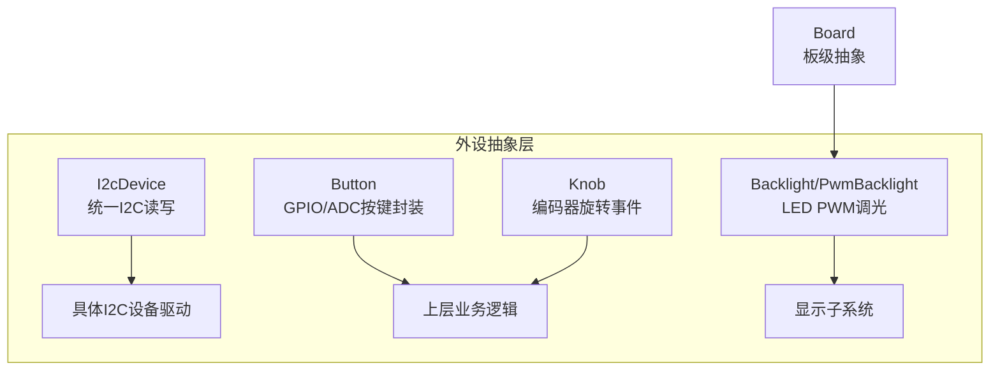
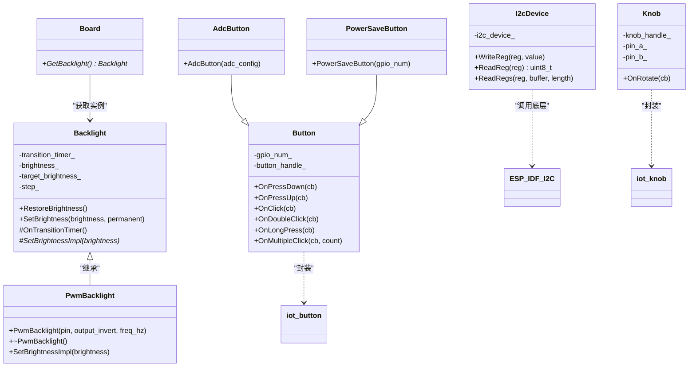
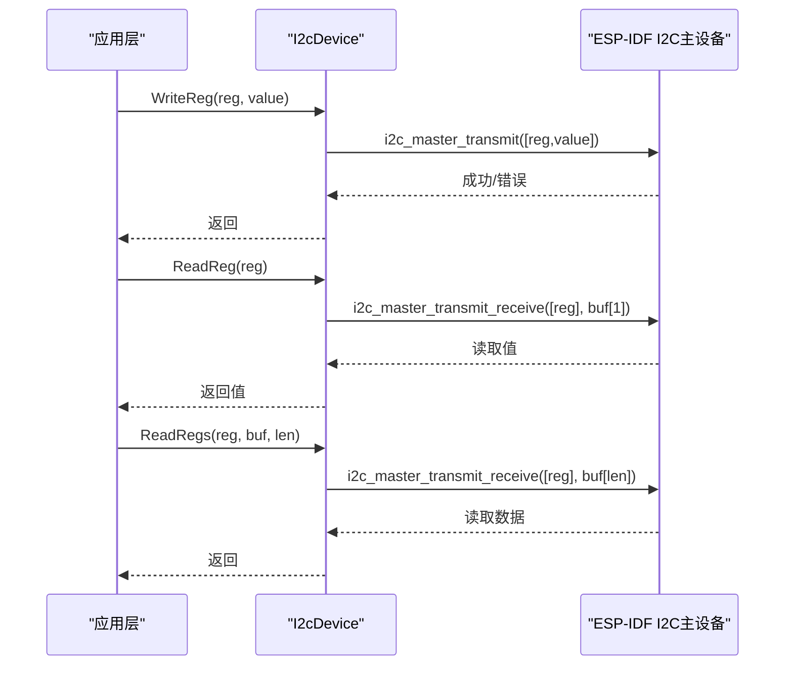
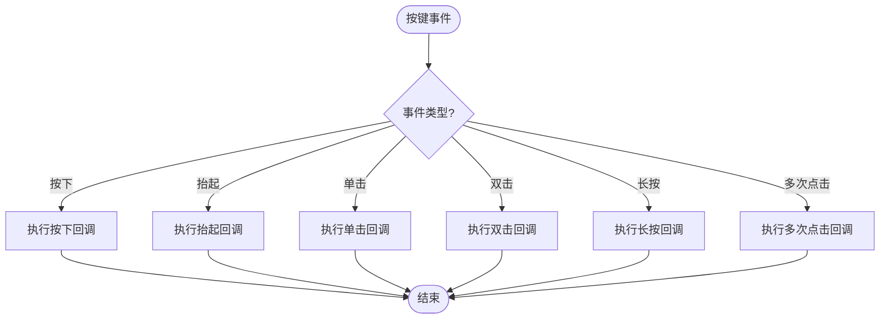
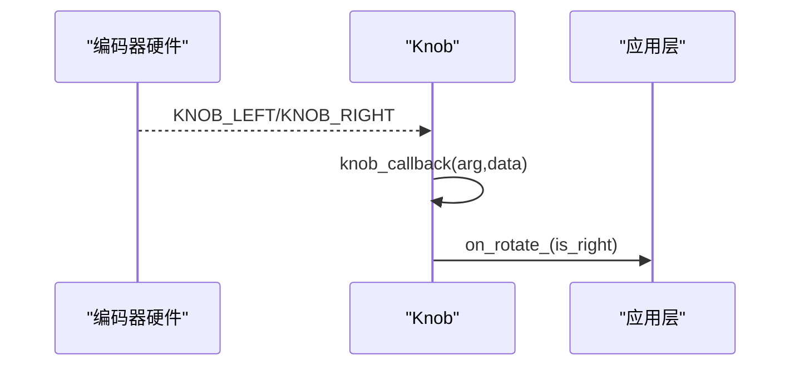
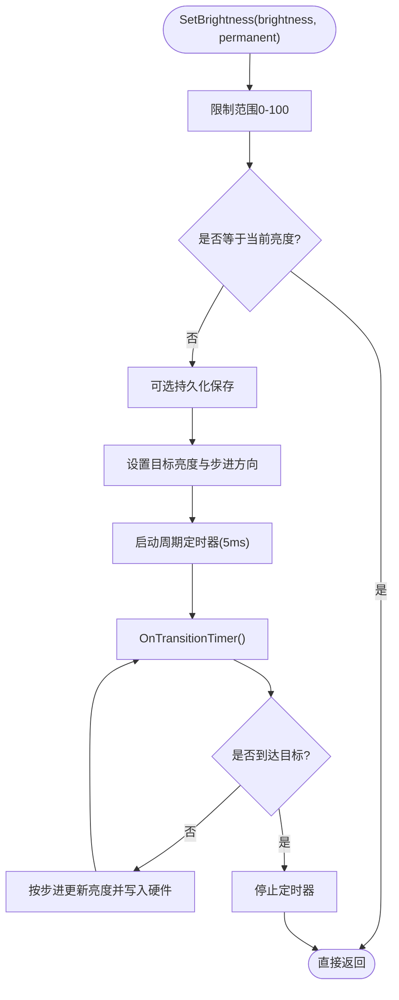
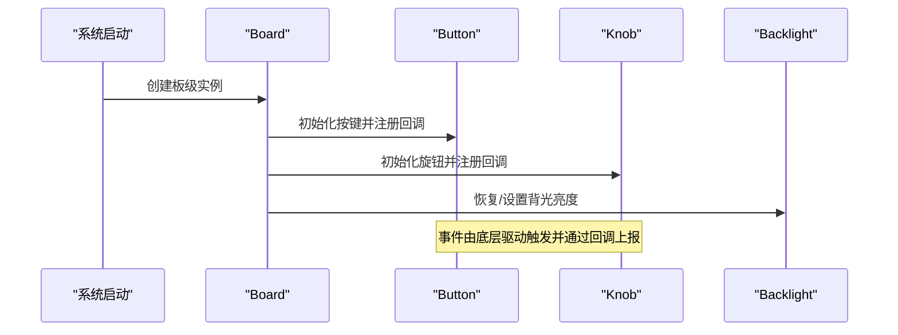
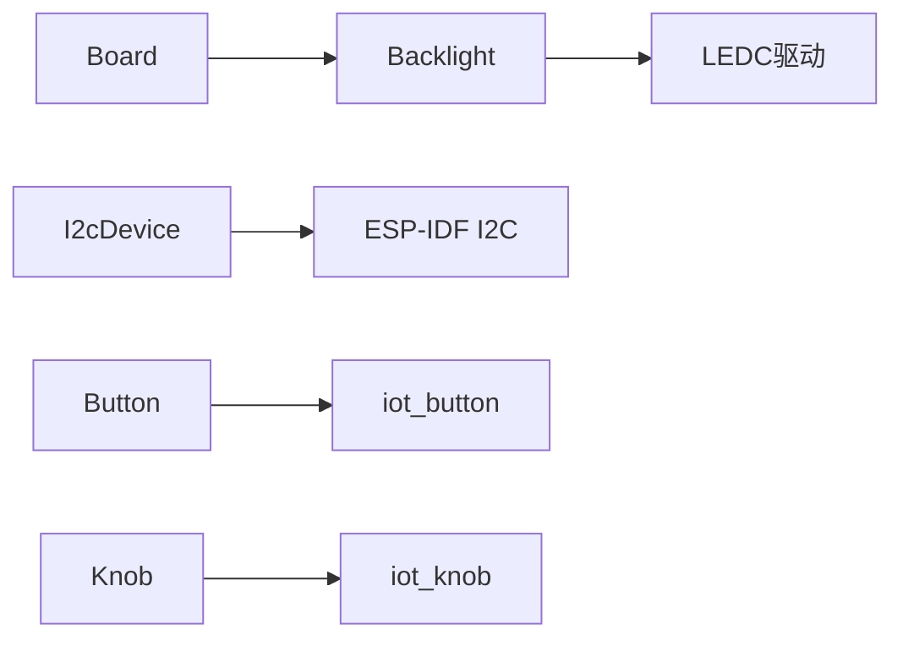

# 外设接口抽象

<cite>
**本文引用的文件**   
- [i2c_device.h](file://main/boards/common/i2c_device.h)
- [i2c_device.cc](file://main/boards/common/i2c_device.cc)
- [button.h](file://main/boards/common/button.h)
- [button.cc](file://main/boards/common/button.cc)
- [knob.h](file://main/boards/common/knob.h)
- [knob.cc](file://main/boards/common/knob.cc)
- [backlight.h](file://main/boards/common/backlight.h)
- [backlight.cc](file://main/boards/common/backlight.cc)
- [board.h](file://main/boards/common/board.h)
</cite>

## 目录
1. [简介](#简介)
2. [项目结构](#项目结构)
3. [核心组件](#核心组件)
4. [架构总览](#架构总览)
5. [详细组件分析](#详细组件分析)
6. [依赖关系分析](#依赖关系分析)
7. [性能考虑](#性能考虑)
8. [故障排查指南](#故障排查指南)
9. [结论](#结论)
10. [附录](#附录)

## 简介
本技术文档聚焦于外设接口抽象层，围绕以下目标展开：
- I2C设备抽象类的设计与统一访问接口
- 按键检测的实现原理与事件驱动机制
- 旋钮控制的编码处理与旋转方向判定
- 背光调节的PWM控制与平滑过渡
- GPIO扩展器使用、中断配置与多设备总线管理
- 外设初始化流程、资源冲突解决策略
- 外设驱动开发示例、引脚复用配置与硬件兼容性处理
- 调试工具与性能优化建议

## 项目结构
外设抽象层位于 common 目录下，提供跨板卡复用的基础能力。关键文件包括：
- I2C设备抽象：i2c_device.{h,cc}
- 按键抽象：button.{h,cc}
- 旋钮抽象：knob.{h,cc}
- 背光抽象与PWM实现：backlight.{h,cc}
- 板级抽象入口（用于获取背光等）：board.h

图表来源
- [i2c_device.h:1-18](file://main/boards/common/i2c_device.h#L1-L18)
- [i2c_device.cc:1-35](file://main/boards/common/i2c_device.cc#L1-L35)
- [button.h:1-50](file://main/boards/common/button.h#L1-L50)
- [button.cc:1-125](file://main/boards/common/button.cc#L1-L125)
- [knob.h:1-25](file://main/boards/common/knob.h#L1-L25)
- [knob.cc:1-52](file://main/boards/common/knob.cc#L1-L52)
- [backlight.h:1-37](file://main/boards/common/backlight.h#L1-L37)
- [backlight.cc:1-122](file://main/boards/common/backlight.cc#L1-L122)
- [board.h:38-77](file://main/boards/common/board.h#L38-L77)

章节来源
- [i2c_device.h:1-18](file://main/boards/common/i2c_device.h#L1-L18)
- [i2c_device.cc:1-35](file://main/boards/common/i2c_device.cc#L1-L35)
- [button.h:1-50](file://main/boards/common/button.h#L1-L50)
- [button.cc:1-125](file://main/boards/common/button.cc#L1-L125)
- [knob.h:1-25](file://main/boards/common/knob.h#L1-L25)
- [knob.cc:1-52](file://main/boards/common/knob.cc#L1-L52)
- [backlight.h:1-37](file://main/boards/common/backlight.h#L1-L37)
- [backlight.cc:1-122](file://main/boards/common/backlight.cc#L1-L122)
- [board.h:38-77](file://main/boards/common/board.h#L38-L77)

## 核心组件
- I2cDevice：对ESP-IDF I2C主设备的封装，提供寄存器写、单字节读、连续读的统一接口，屏蔽底层传输细节。
- Button：基于iot_button库的按键抽象，支持GPIO与ADC两种输入方式，提供按下、抬起、单击、双击、长按、多次点击等回调注册。
- Knob：基于iot_knob库的旋转编码器抽象，将左右旋转事件转换为布尔方向信号并回调给上层。
- Backlight/PwmBacklight：背光亮度抽象与LED PWM实现，支持持久化保存、平滑渐变过渡、频率可调以避免电感啸叫。

章节来源
- [i2c_device.h:1-18](file://main/boards/common/i2c_device.h#L1-L18)
- [i2c_device.cc:1-35](file://main/boards/common/i2c_device.cc#L1-L35)
- [button.h:1-50](file://main/boards/common/button.h#L1-L50)
- [button.cc:1-125](file://main/boards/common/button.cc#L1-L125)
- [knob.h:1-25](file://main/boards/common/knob.h#L1-L25)
- [knob.cc:1-52](file://main/boards/common/knob.cc#L1-L52)
- [backlight.h:1-37](file://main/boards/common/backlight.h#L1-L37)
- [backlight.cc:1-122](file://main/boards/common/backlight.cc#L1-L122)

## 架构总览
外设抽象层通过统一的类接口向上层暴露功能，同时向下对接ESP-IDF驱动与第三方组件（如iot_button、iot_knob、LEDC）。

图表来源
- [board.h:38-77](file://main/boards/common/board.h#L38-L77)
- [backlight.h:1-37](file://main/boards/common/backlight.h#L1-L37)
- [backlight.cc:1-122](file://main/boards/common/backlight.cc#L1-L122)
- [i2c_device.h:1-18](file://main/boards/common/i2c_device.h#L1-L18)
- [i2c_device.cc:1-35](file://main/boards/common/i2c_device.cc#L1-L35)
- [button.h:1-50](file://main/boards/common/button.h#L1-L50)
- [button.cc:1-125](file://main/boards/common/button.cc#L1-L125)
- [knob.h:1-25](file://main/boards/common/knob.h#L1-L25)
- [knob.cc:1-52](file://main/boards/common/knob.cc#L1-L52)

## 详细组件分析

### I2C设备抽象类设计
- 设计要点
  - 构造时绑定I2C总线与设备地址，设置7位地址长度与400kHz速率，创建设备句柄。
  - 提供WriteReg、ReadReg、ReadRegs三个方法，分别对应单字节写、单字节读、连续读。
  - 内部使用ESP-IDF的i2c_master_transmit与i2c_master_transmit_receive完成传输。
- 数据流
  - 上层调用WriteReg/ReadReg/ReadRegs → I2cDevice封装寄存器地址与数据 → 底层I2C主设备传输。
- 错误处理
  - 所有底层调用均通过ESP_ERROR_CHECK进行错误检查，确保异常快速失败。
- 复杂度
  - 单次读写为O(1)，连续读为O(n)。
- 优化建议
  - 批量操作可合并为一次事务以减少总线开销。
  - 根据设备特性调整时钟频率与超时时间。

图表来源
- [i2c_device.cc:8-35](file://main/boards/common/i2c_device.cc#L8-L35)

章节来源
- [i2c_device.h:1-18](file://main/boards/common/i2c_device.h#L1-L18)
- [i2c_device.cc:1-35](file://main/boards/common/i2c_device.cc#L1-L35)

### 按键检测实现原理
- 设计要点
  - 支持GPIO与ADC两种输入源；GPIO模式可配置有效电平、短按/长按阈值、省电模式。
  - 通过iot_button库注册回调，支持按下、抬起、单击、双击、长按、多次点击。
  - 提供PowerSaveButton便捷子类以启用省电模式。
- 事件驱动机制
  - 底层中断或轮询触发事件 → iot_button分发 → Button包装回调到用户函数。
- 资源与生命周期
  - 构造函数中创建按钮句柄，析构时删除句柄，避免资源泄漏。
- 兼容性与引脚复用
  - 若gpio_num为未连接常量则跳过初始化，便于在不同板卡间复用同一代码路径。

图表来源
- [button.cc:44-125](file://main/boards/common/button.cc#L44-L125)

章节来源
- [button.h:1-50](file://main/boards/common/button.h#L1-L50)
- [button.cc:1-125](file://main/boards/common/button.cc#L1-L125)

### 旋钮控制与编码处理
- 设计要点
  - 基于iot_knob库，配置A/B相引脚，注册左旋/右旋回调。
  - 将旋转事件转换为布尔方向（true表示右旋，false表示左旋），通过OnRotate回调通知上层。
- 初始化流程
  - 构造时创建knob句柄并注册回调；失败时记录日志并安全返回。
- 事件处理
  - 静态回调函数接收事件参数，查询当前事件类型并转发至成员回调。

图表来源
- [knob.cc:5-52](file://main/boards/common/knob.cc#L5-L52)

章节来源
- [knob.h:1-25](file://main/boards/common/knob.h#L1-L25)
- [knob.cc:1-52](file://main/boards/common/knob.cc#L1-L52)

### 背光调节与PWM控制
- 设计要点
  - Backlight抽象类维护当前亮度、目标亮度与步进，使用定时器周期性更新以实现平滑过渡。
  - PwmBacklight基于LEDC实现10位分辨率的PWM输出，默认频率较高以避免电感啸叫。
  - 支持从Settings恢复亮度，并可持久化保存新亮度。
- 平滑过渡算法
  - 每5ms触发一次，按步长向目标亮度逼近，达到目标后停止定时器。
- 配置与兼容性
  - 可通过输出反相与频率参数适配不同硬件。
  - 亮度范围限制在0-100，过小值会回退到默认低亮度。

图表来源
- [backlight.cc:32-82](file://main/boards/common/backlight.cc#L32-L82)
- [backlight.cc:84-122](file://main/boards/common/backlight.cc#L84-L122)

章节来源
- [backlight.h:1-37](file://main/boards/common/backlight.h#L1-L37)
- [backlight.cc:1-122](file://main/boards/common/backlight.cc#L1-L122)
- [board.h:38-77](file://main/boards/common/board.h#L38-L77)

### GPIO扩展器使用方法与中断配置
- 使用方法
  - 通过I2cDevice基类访问GPIO扩展器的寄存器，完成引脚方向、上拉/下拉、输出电平配置。
  - 对于需要中断的场景，可在扩展器侧配置中断使能，并将中断引脚接入MCU外部中断，在中断服务中读取状态寄存器。
- 多设备总线管理
  - 多个I2C设备共享同一总线时，需保证地址唯一；I2cDevice在构造阶段完成设备注册，上层无需关心总线仲裁。
- 注意事项
  - 合理设置I2C时钟与超时，避免总线拥塞。
  - 批量读写尽量合并，减少事务次数。

章节来源
- [i2c_device.h:1-18](file://main/boards/common/i2c_device.h#L1-L18)
- [i2c_device.cc:1-35](file://main/boards/common/i2c_device.cc#L1-L35)

### 外设初始化流程与事件驱动机制
- 初始化流程
  - 板级对象创建后，按需初始化各外设：I2C总线与设备、按键、旋钮、背光等。
  - 背光在恢复阶段从设置加载亮度并应用。
- 事件驱动
  - 按键与旋钮通过回调机制将硬件事件转化为上层可处理的函数调用。
  - 背光亮度的变化通过定时器驱动，非阻塞地逐步更新。

图表来源
- [board.h:38-77](file://main/boards/common/board.h#L38-L77)
- [button.cc:18-42](file://main/boards/common/button.cc#L18-L42)
- [knob.cc:5-32](file://main/boards/common/knob.cc#L5-L32)
- [backlight.cc:10-44](file://main/boards/common/backlight.cc#L10-L44)

章节来源
- [board.h:38-77](file://main/boards/common/board.h#L38-L77)
- [button.cc:1-125](file://main/boards/common/button.cc#L1-L125)
- [knob.cc:1-52](file://main/boards/common/knob.cc#L1-L52)
- [backlight.cc:1-122](file://main/boards/common/backlight.cc#L1-L122)

### 资源冲突解决策略
- I2C总线冲突
  - 确保每个I2C设备具有唯一地址；避免在同一时刻对同一设备进行并发访问。
- LEDC通道冲突
  - 背光使用固定通道与定时器，其他模块应避免占用相同通道。
- 中断与定时器
  - 按键与旋钮回调应尽量轻量，避免长时间阻塞；耗时任务应投递到任务队列。
- 电源与功耗
  - 使用PowerSaveButton启用省电模式；合理设置背光频率与占空比以降低功耗。

章节来源
- [i2c_device.cc:8-20](file://main/boards/common/i2c_device.cc#L8-L20)
- [backlight.cc:84-109](file://main/boards/common/backlight.cc#L84-L109)
- [button.cc:21-36](file://main/boards/common/button.cc#L21-L36)

### 外设驱动开发示例与引脚复用配置
- 开发步骤
  - 定义新的I2C设备类，继承I2cDevice，封装设备特定寄存器操作。
  - 在板级初始化中创建设备实例，并在需要时调用其API。
  - 如需新增按键或旋钮，参照Button与Knob的封装方式，选择合适的输入源与回调。
- 引脚复用
  - 针对不同板卡的引脚差异，通过配置文件或宏选择GPIO编号；当引脚未使用时采用未连接常量跳过初始化。
- 硬件兼容性
  - 通过参数化配置（如背光频率、输出反相）适配不同硬件；I2C设备可根据器件手册调整速度与超时。

章节来源
- [i2c_device.h:1-18](file://main/boards/common/i2c_device.h#L1-L18)
- [button.h:1-50](file://main/boards/common/button.h#L1-L50)
- [knob.h:1-25](file://main/boards/common/knob.h#L1-L25)
- [backlight.h:1-37](file://main/boards/common/backlight.h#L1-L37)

### 调试工具与性能优化建议
- 调试建议
  - 利用ESP_ERROR_CHECK快速定位I2C与LEDC初始化错误。
  - 通过日志输出跟踪按键、旋钮事件与背光变化过程。
- 性能优化
  - I2C批量读写合并事务，减少总线往返。
  - 背光过渡定时器周期与步长可按需求调整，平衡流畅度与CPU占用。
  - 回调函数保持轻量，必要时使用任务队列异步处理。

章节来源
- [i2c_device.cc:22-35](file://main/boards/common/i2c_device.cc#L22-L35)
- [backlight.cc:63-82](file://main/boards/common/backlight.cc#L63-L82)
- [button.cc:44-125](file://main/boards/common/button.cc#L44-L125)

## 依赖关系分析
- 组件耦合
  - Board仅依赖Backlight抽象，不感知具体实现，利于替换与扩展。
  - I2cDevice依赖ESP-IDF I2C驱动；Button与Knob依赖iot_button与iot_knob。
- 外部依赖
  - ESP-IDF驱动（I2C、LEDC、esp_timer）
  - 第三方组件（iot_button、iot_knob）
- 潜在循环依赖
  - 当前抽象层无循环依赖；上层业务不应反向依赖具体实现。

图表来源
- [board.h:38-77](file://main/boards/common/board.h#L38-L77)
- [backlight.cc:1-122](file://main/boards/common/backlight.cc#L1-L122)
- [i2c_device.cc:1-35](file://main/boards/common/i2c_device.cc#L1-L35)
- [button.cc:1-125](file://main/boards/common/button.cc#L1-L125)
- [knob.cc:1-52](file://main/boards/common/knob.cc#L1-L52)

章节来源
- [board.h:38-77](file://main/boards/common/board.h#L38-L77)
- [backlight.cc:1-122](file://main/boards/common/backlight.cc#L1-L122)
- [i2c_device.cc:1-35](file://main/boards/common/i2c_device.cc#L1-L35)
- [button.cc:1-125](file://main/boards/common/button.cc#L1-L125)
- [knob.cc:1-52](file://main/boards/common/knob.cc#L1-L52)

## 性能考虑
- I2C总线
  - 合理设置SCL频率与超时；批量操作合并以减少事务次数。
- LEDC与背光
  - 提高PWM频率可降低电感噪声；10位分辨率满足大多数场景。
- 事件处理
  - 回调函数避免阻塞；复杂逻辑放入任务队列。
- 功耗
  - 使用省电模式与合理的背光策略降低能耗。

## 故障排查指南
- I2C通信失败
  - 检查设备地址与总线速度；确认ESP_ERROR_CHECK返回码。
- 按键无响应
  - 确认GPIO配置与有效电平；检查回调是否注册成功。
- 旋钮方向异常
  - 核对A/B相接线顺序；检查回调注册是否成功。
- 背光不亮或闪烁
  - 检查LEDC通道与定时器配置；确认输出反相与频率设置。

章节来源
- [i2c_device.cc:8-35](file://main/boards/common/i2c_device.cc#L8-L35)
- [button.cc:18-42](file://main/boards/common/button.cc#L18-L42)
- [knob.cc:5-32](file://main/boards/common/knob.cc#L5-L32)
- [backlight.cc:84-122](file://main/boards/common/backlight.cc#L84-L122)

## 结论
本抽象层通过统一的类接口屏蔽了底层驱动差异，提供了稳定的I2C访问、按键与旋钮事件处理以及背光PWM控制能力。借助事件驱动与定时器机制，系统在保持低耦合的同时具备良好的可扩展性与可移植性。遵循本文的开发与优化建议，可高效地完成外设驱动开发与硬件适配。

## 附录
- 术语
  - I2C：两线串行总线协议
  - PWM：脉宽调制
  - LEDC：ESP-IDF的低速LED控制器
  - iot_button/iot_knob：乐鑫IoT组件中的按键与旋钮库