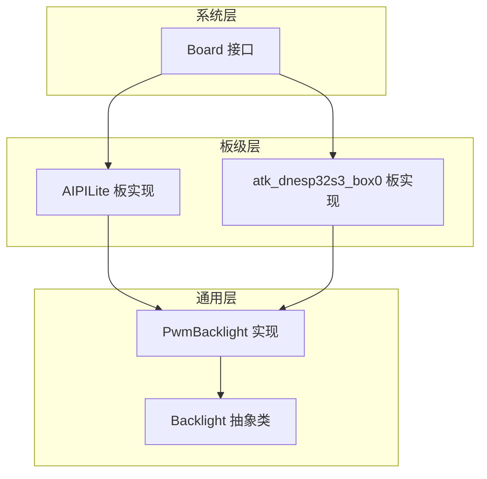
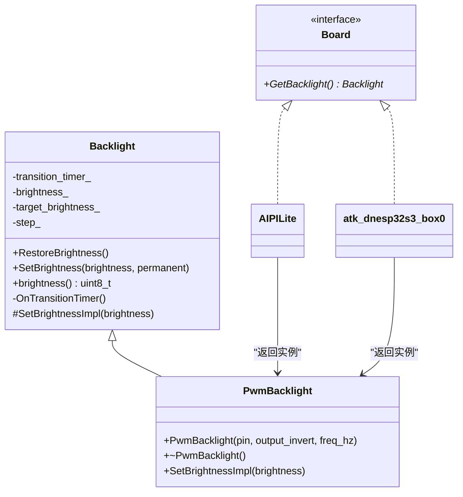
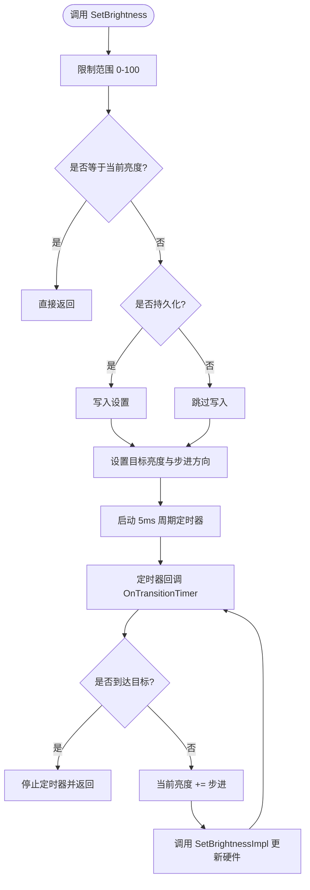
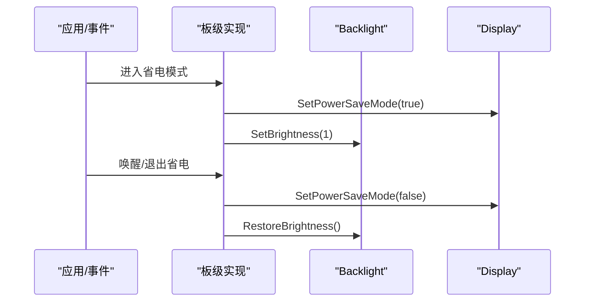
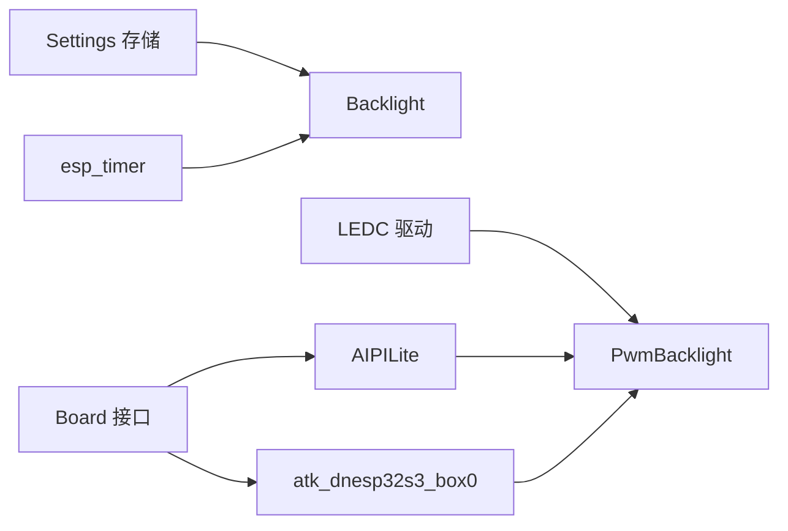

# 显示背光控制

<cite>
**本文引用的文件**   
- [backlight.h](file://main/boards/common/backlight.h)
- [backlight.cc](file://main/boards/common/backlight.cc)
- [board.h](file://main/boards/common/board.h)
- [aipi-lite.cc](file://main/boards/aipi-lite/aipi-lite.cc)
- [atk_dnesp32s3_box0.cc](file://main/boards/atk-dnesp32s3-box0/atk_dnesp32s3_box0.cc)
</cite>

## 目录
1. [简介](#简介)
2. [项目结构](#项目结构)
3. [核心组件](#核心组件)
4. [架构总览](#架构总览)
5. [详细组件分析](#详细组件分析)
6. [依赖关系分析](#依赖关系分析)
7. [性能与功耗考量](#性能与功耗考量)
8. [故障排查指南](#故障排查指南)
9. [结论](#结论)
10. [附录：开发示例与最佳实践](#附录开发示例与最佳实践)

## 简介
本技术文档聚焦于“显示背光控制”子系统，围绕 PWM 调光实现、API 接口（亮度设置、渐变效果、自动调节）、GPIO 与定时器配置、中断处理机制、生命周期管理、电源状态同步与省电模式集成进行系统化说明。同时提供驱动开发示例（不同 LED 类型适配、多区域背光控制、触摸感应背光）以及调试工具、功耗分析与视觉效果优化建议，帮助开发者快速落地并优化产品体验。

## 项目结构
本项目将背光控制抽象为通用类，并通过具体板级实现接入系统。关键位置如下：
- 通用背光抽象与 PWM 实现位于 common 目录
- 各板级通过 Board 接口暴露 Backlight 实例
- 典型板级示例包括 aipi-lite 与 atk-dnesp32s3-box0

图表来源
- [backlight.h:10-36](file://main/boards/common/backlight.h#L10-L36)
- [backlight.cc:84-120](file://main/boards/common/backlight.cc#L84-L120)
- [board.h:62-85](file://main/boards/common/board.h#L62-L85)
- [aipi-lite.cc:216-223](file://main/boards/aipi-lite/aipi-lite.cc#L216-L223)
- [atk_dnesp32s3_box0.cc:363-366](file://main/boards/atk-dnesp32s3-box0/atk_dnesp32s3_box0.cc#L363-L366)

章节来源
- [backlight.h:10-36](file://main/boards/common/backlight.h#L10-L36)
- [backlight.cc:10-82](file://main/boards/common/backlight.cc#L10-L82)
- [board.h:62-85](file://main/boards/common/board.h#L62-L85)
- [aipi-lite.cc:216-223](file://main/boards/aipi-lite/aipi-lite.cc#L216-L223)
- [atk_dnesp32s3_box0.cc:363-366](file://main/boards/atk-dnesp32s3-box0/atk_dnesp32s3_box0.cc#L363-L366)

## 核心组件
- Backlight 抽象类
  - 职责：维护当前亮度、目标亮度、步进方向；提供 SetBrightness、RestoreBrightness 等 API；内部使用 esp_timer 驱动平滑过渡。
  - 关键点：SetBrightness 支持可选持久化；OnTransitionTimer 每 5ms 步进一次，直至达到目标值。
- PwmBacklight 实现
  - 职责：基于 ESP-IDF LEDC 外设输出 PWM，映射 0-100% 到 10bit 占空比（0-1023）。
  - 关键点：默认频率较高以避免电感啸叫；支持输出反相；析构时停止通道。

章节来源
- [backlight.h:10-36](file://main/boards/common/backlight.h#L10-L36)
- [backlight.cc:10-82](file://main/boards/common/backlight.cc#L10-L82)
- [backlight.cc:84-120](file://main/boards/common/backlight.cc#L84-L120)

## 架构总览
背光子系统采用“抽象 + 具体实现 + 板级装配”的分层设计。上层通过 Board::GetBacklight 获取统一接口，屏蔽底层硬件差异。

图表来源
- [backlight.h:10-36](file://main/boards/common/backlight.h#L10-L36)
- [board.h:62-85](file://main/boards/common/board.h#L62-L85)
- [aipi-lite.cc:216-223](file://main/boards/aipi-lite/aipi-lite.cc#L216-L223)
- [atk_dnesp32s3_box0.cc:363-366](file://main/boards/atk-dnesp32s3-box0/atk_dnesp32s3_box0.cc#L363-L366)

## 详细组件分析

### PWM 调光原理与参数
- 占空比计算
  - 分辨率：10bit（0-1023）
  - 映射公式：duty = floor(1023 * brightness / 100)
  - 该映射在 SetBrightnessImpl 中执行，确保线性百分比到硬件占空比的转换
- 频率选择
  - 默认频率较高，避免电感或滤波电路产生可闻噪声
  - 可通过构造参数调整，以适配不同硬件拓扑
- 亮度等级映射
  - 输入范围 0-100%，内部按步长逐步更新，形成平滑渐变
  - 若目标等于当前亮度，直接返回，避免无意义更新

章节来源
- [backlight.cc:115-120](file://main/boards/common/backlight.cc#L115-L120)
- [backlight.cc:84-109](file://main/boards/common/backlight.cc#L84-L109)

### 背光调节 API 与渐变效果
- SetBrightness(brightness, permanent=false)
  - 功能：设置目标亮度；可选择是否持久化保存
  - 行为：若与当前相同则短路返回；否则启动 5ms 周期定时器逐步逼近目标
- RestoreBrightness()
  - 功能：从设置中恢复上次亮度；若读取值过小则回退至安全默认值
- OnTransitionTimer()
  - 功能：每 5ms 将当前亮度向目标步进一步，直到相等后停止定时器

图表来源
- [backlight.cc:46-82](file://main/boards/common/backlight.cc#L46-L82)

章节来源
- [backlight.cc:32-82](file://main/boards/common/backlight.cc#L32-L82)

### GPIO 引脚配置、定时器与中断
- GPIO 配置
  - 由板级定义 DISPLAY_BACKLIGHT_PIN 及可选反相标志，传入 PwmBacklight 构造
- 定时器
  - 使用 esp_timer 创建名为 “backlight_timer” 的周期性任务，间隔 5ms
  - 回调函数内完成亮度步进与硬件更新
- 中断
  - LEDC 通道中断已禁用，所有更新由软件定时器驱动，降低中断开销

章节来源
- [backlight.cc:10-23](file://main/boards/common/backlight.cc#L10-L23)
- [backlight.cc:84-109](file://main/boards/common/backlight.cc#L84-L109)

### 生命周期管理与电源状态同步
- 初始化与恢复
  - 板级构造完成后调用 GetBacklight()->RestoreBrightness() 恢复用户偏好
- 省电模式
  - 进入睡眠：将屏幕置入省电模式并将背光降至极低（如 1%）
  - 退出睡眠：恢复屏幕正常模式并 RestoreBrightness()
- 充电/供电切换
  - 根据供电状态与低电压阈值，必要时关闭显示或触发关机流程

图表来源
- [aipi-lite.cc:47-65](file://main/boards/aipi-lite/aipi-lite.cc#L47-L65)
- [atk_dnesp32s3_box0.cc:133-163](file://main/boards/atk-dnesp32s3-box0/atk_dnesp32s3_box0.cc#L133-L163)

章节来源
- [aipi-lite.cc:47-65](file://main/boards/aipi-lite/aipi-lite.cc#L47-L65)
- [atk_dnesp32s3_box0.cc:133-163](file://main/boards/atk-dnesp32s3-box0/atk_dnesp32s3_box0.cc#L133-L163)

### 自动调节与交互联动
- 长按按键场景
  - 某些板级在特定交互中将背光设为 0 以配合 UI 提示或进入配网
  - 交互结束后恢复亮度
- 监听状态联动
  - 当设备处于监听态且需要唤醒时，恢复背光亮度以提升可读性

章节来源
- [atk_dnesp32s3_box0.cc:227-253](file://main/boards/atk-dnesp32s3-box0/atk_dnesp32s3_box0.cc#L227-L253)

## 依赖关系分析
- 模块耦合
  - Backlight 仅依赖 ESP-IDF 的 ledc 与 esp_timer，保持高内聚
  - 板级通过 Board 接口解耦，便于移植
- 外部依赖
  - Settings 用于持久化亮度值
  - Display 与 PowerSaveTimer 协同完成省电策略

图表来源
- [backlight.cc:1-6](file://main/boards/common/backlight.cc#L1-L6)
- [board.h:62-85](file://main/boards/common/board.h#L62-L85)
- [aipi-lite.cc:216-223](file://main/boards/aipi-lite/aipi-lite.cc#L216-L223)
- [atk_dnesp32s3_box0.cc:363-366](file://main/boards/atk-dnesp32s3-box0/atk_dnesp32s3_box0.cc#L363-L366)

章节来源
- [backlight.cc:1-6](file://main/boards/common/backlight.cc#L1-L6)
- [board.h:62-85](file://main/boards/common/board.h#L62-L85)

## 性能与功耗考量
- 频率与噪声
  - 提高 PWM 频率可降低电感啸叫风险，但会略微增加开关损耗
  - 建议在 20kHz-50kHz 范围内评估听感与效率折衷
- 分辨率与视觉
  - 10bit 分辨率可提供约 1024 级亮度，满足大多数场景
  - 低亮度段可采用非线性映射提升感知均匀性（需扩展实现）
- 更新频率
  - 5ms 步进兼顾流畅与 CPU 占用；如需更平滑可缩短间隔，但需权衡功耗
- 省电策略
  - 进入睡眠前将背光降至极低，退出时恢复；结合 Display 省电模式减少整体功耗

[本节为通用指导，不直接分析具体文件]

## 故障排查指南
- 现象：背光无声响但无亮度变化
  - 检查 GPIO 是否正确配置且未被其他外设复用
  - 确认 LEDC 通道与定时器是否成功初始化
- 现象：低频嗡鸣或啸叫
  - 提高 PWM 频率或调整输出反相逻辑
  - 检查硬件滤波与驱动电路
- 现象：亮度无法持久化
  - 检查 Settings 命名空间与键名是否正确
  - 确认写入权限与存储介质可用
- 现象：进入/退出省电模式后亮度异常
  - 核对 Enter/Exit 回调中对背光的调用顺序与条件判断
  - 确认 RestoreBrightness 的默认值保护逻辑

章节来源
- [backlight.cc:32-44](file://main/boards/common/backlight.cc#L32-L44)
- [backlight.cc:46-68](file://main/boards/common/backlight.cc#L46-L68)
- [aipi-lite.cc:47-65](file://main/boards/aipi-lite/aipi-lite.cc#L47-L65)
- [atk_dnesp32s3_box0.cc:133-163](file://main/boards/atk-dnesp32s3-box0/atk_dnesp32s3_box0.cc#L133-L163)

## 结论
本背光子系统通过抽象与具体实现分离，提供了简洁稳定的 PWM 调光能力，内置平滑渐变与持久化策略，并与板级电源管理深度集成。借助统一的 Board 接口，可在多种硬件平台上快速复用与扩展。

[本节为总结，不直接分析具体文件]

## 附录：开发示例与最佳实践

### 不同 LED 类型适配
- 单色 LED 直驱
  - 直接使用 PwmBacklight 绑定对应 GPIO，注意限流电阻与热设计
- 多路 RGB 背光
  - 为 R/G/B 三路分别创建独立 PwmBacklight 实例，组合出色彩与动态效果
- 恒流驱动 IC
  - 通过 I2C/SPI 控制外部恒流源，扩展 Backlight 抽象以覆盖非 PWM 路径

[本节为概念性指导，不直接分析具体文件]

### 多区域背光控制
- 分区建模
  - 将屏幕划分为多个区域，每个区域维护独立的 Backlight 实例
- 协调算法
  - 根据内容明暗分布计算各区域目标亮度，避免局部过亮导致闪烁
- 资源规划
  - 合理分配 LEDC 通道与定时器，避免资源竞争

[本节为概念性指导，不直接分析具体文件]

### 触摸感应背光
- 触发策略
  - 检测触摸事件后短时提升背光，随后回归设定值
- 防抖与节流
  - 对频繁触摸进行去抖，避免频繁更新造成抖动与功耗上升
- 用户体验
  - 结合渐变效果，使亮度变化自然柔和

[本节为概念性指导，不直接分析具体文件]

### 调试工具与日志
- 启用 ESP_LOG 信息
  - 在关键路径记录亮度设置、恢复与错误告警
- 波形测量
  - 使用示波器观测 PWM 波形，验证频率与占空比是否符合预期
- 功耗采集
  - 串联电流表或使用功耗分析仪，统计不同亮度下的平均电流

章节来源
- [backlight.cc:38-40](file://main/boards/common/backlight.cc#L38-L40)
- [backlight.cc:66-68](file://main/boards/common/backlight.cc#L66-L68)

### 视觉效果优化建议
- 低亮度非线性映射
  - 在低区间采用指数或对数曲线，提升人眼感知均匀性
- 动态自适应
  - 根据环境光传感器数据自动调节基准亮度
- 动画与节奏
  - 调整步进大小与定时器间隔，平衡流畅度与功耗

[本节为概念性指导，不直接分析具体文件]