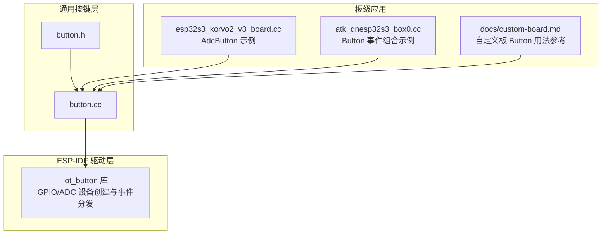
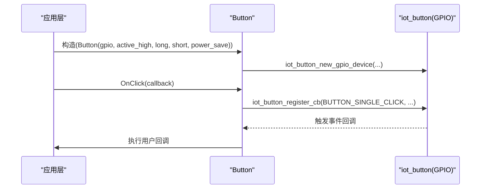
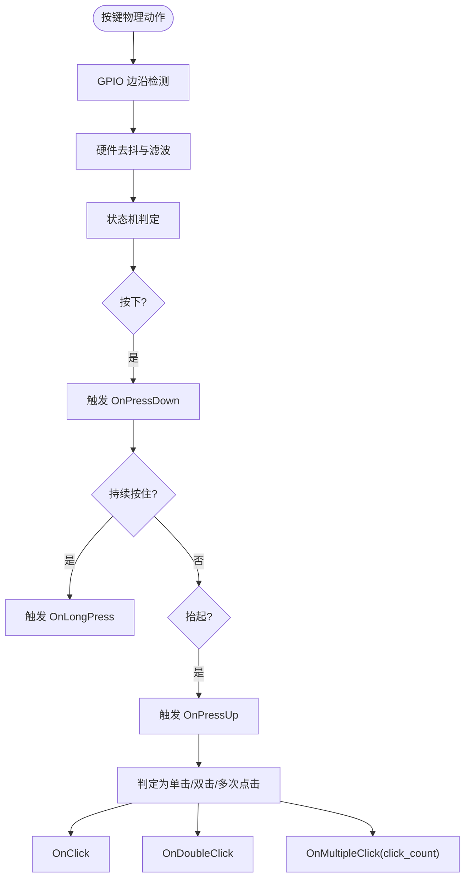
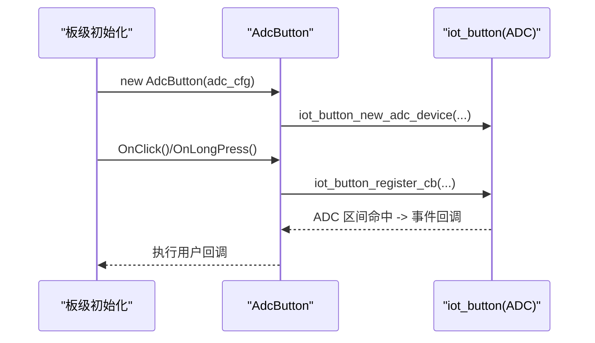
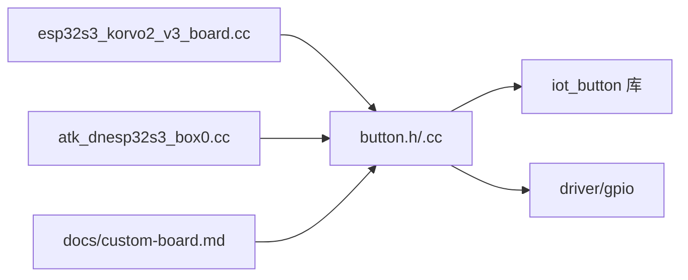

# 按键接口

<cite>
**本文引用的文件列表**
- [button.h](file://main/boards/common/button.h)
- [button.cc](file://main/boards/common/button.cc)
- [esp32s3_korvo2_v3_board.cc](file://main/boards/esp32s3-korvo2-v3/esp32s3_korvo2_v3_board.cc)
- [atk_dnesp32s3_box0.cc](file://main/boards/atk-dnesp32s3-box0/atk_dnesp32s3_box0.cc)
- [custom-board.md](file://docs/custom-board.md)
</cite>

## 目录
1. [简介](#简介)
2. [项目结构](#项目结构)
3. [核心组件](#核心组件)
4. [架构总览](#架构总览)
5. [详细组件分析](#详细组件分析)
6. [依赖关系分析](#依赖关系分析)
7. [性能与功耗考量](#性能与功耗考量)
8. [故障排查指南](#故障排查指南)
9. [结论](#结论)
10. [附录：API 使用示例与最佳实践](#附录api-使用示例与最佳实践)

## 简介
本技术文档聚焦于按键子系统，围绕 Button、AdcButton、PowerSaveButton 三类抽象进行系统化说明。内容涵盖：
- GPIO 中断与底层驱动集成方式
- 硬件去抖与长按检测机制（由底层 iot_button 驱动提供）
- 事件处理流程：按下、抬起、长按、单击、双击、多次点击
- ADC 按键实现原理与配置要点
- 低功耗模式下的按键行为与唤醒策略
- 完整 API 使用示例、回调注册、多按键组合操作
- 驱动开发指南、调试方法与性能优化建议

## 项目结构
按键相关代码位于 boards/common 目录下，对外暴露统一的 C++ 类接口；具体板级应用通过构造 Button/AdcButton/PowerSaveButton 实例并注册回调完成业务逻辑。



图表来源
- [button.h:1-49](file://main/boards/common/button.h#L1-L49)
- [button.cc:1-125](file://main/boards/common/button.cc#L1-L125)
- [esp32s3_korvo2_v3_board.cc:213-246](file://main/boards/esp32s3-korvo2-v3/esp32s3_korvo2_v3_board.cc#L213-L246)
- [atk_dnesp32s3_box0.cc:194-226](file://main/boards/atk-dnesp32s3-box0/atk_dnesp32s3_box0.cc#L194-L226)
- [custom-board.md:195-204](file://docs/custom-board.md#L195-L204)

章节来源
- [button.h:1-49](file://main/boards/common/button.h#L1-L49)
- [button.cc:1-125](file://main/boards/common/button.cc#L1-L125)

## 核心组件
- Button：封装 ESP-IDF iot_button 的 GPIO 按键能力，提供统一的事件回调注册接口。
- AdcButton：基于 ADC 的多键复用方案，内部通过 iot_button 的 ADC 设备创建函数初始化。
- PowerSaveButton：在 Button 基础上启用低功耗模式，适合电池供电场景的电源键等。

章节来源
- [button.h:11-47](file://main/boards/common/button.h#L11-L47)
- [button.cc:8-36](file://main/boards/common/button.cc#L8-L36)

## 架构总览
按键子系统采用“上层抽象 + 底层驱动”的分层设计。上层仅关注事件语义（按下/抬起/长按/单击/双击/多次点击），底层负责中断采集、去抖、计时与事件派发。

```mermaid
classDiagram
class Button {
- gpio_num_ : gpio_num_t
- button_handle_ : void*
- on_press_down_ : function<void()>
- on_press_up_ : function<void()>
- on_long_press_ : function<void()>
- on_click_ : function<void()>
- on_double_click_ : function<void()>
- on_multiple_click_ : function<void()>
+ OnPressDown(callback)
+ OnPressUp(callback)
+ OnLongPress(callback)
+ OnClick(callback)
+ OnDoubleClick(callback)
+ OnMultipleClick(callback, click_count)
}
class AdcButton {
+ AdcButton(adc_config)
}
class PowerSaveButton {
+ PowerSaveButton(gpio_num)
}
AdcButton --|> Button
PowerSaveButton --|> Button
```

图表来源
- [button.h:11-47](file://main/boards/common/button.h#L11-L47)
- [button.cc:8-36](file://main/boards/common/button.cc#L8-L36)

## 详细组件分析

### Button 类实现原理
- 初始化路径
  - 通过构造函数传入 GPIO 引脚号、有效电平、长按/短按时间以及是否启用省电模式，调用底层 iot_button_new_gpio_device 创建 GPIO 按键设备。
  - 若传入无效引脚则直接返回，避免无意义初始化。
- 事件回调注册
  - 各事件方法将用户回调保存至成员函数对象，并通过 iot_button_register_cb 绑定到对应事件类型（如按下、抬起、长按、单击、双击、多次点击）。
  - 底层驱动触发事件时，通过闭包将 Button 指针回传，再调用用户回调。
- 资源释放
  - 析构函数中调用 iot_button_delete 释放底层句柄，防止资源泄漏。



图表来源
- [button.cc:21-42](file://main/boards/common/button.cc#L21-L42)
- [button.cc:83-94](file://main/boards/common/button.cc#L83-L94)

章节来源
- [button.cc:21-42](file://main/boards/common/button.cc#L21-L42)
- [button.cc:44-125](file://main/boards/common/button.cc#L44-L125)

### GPIO 中断配置与硬件去抖
- 中断与采样
  - 底层 iot_button 在 GPIO 设备上监听电平变化，结合内部定时器对边沿进行采样与状态机判断。
- 去抖算法
  - 去抖由底层驱动内部实现，上层无需自行处理。可通过设置 short_press_time 与 long_press_time 影响识别阈值。
- 长按检测
  - 当按住时间超过 long_press_time，底层触发长按事件；该值可在构造时配置或通过板级 button_config_t 指定。

章节来源
- [button.cc:21-36](file://main/boards/common/button.cc#L21-L36)
- [button.cc:70-81](file://main/boards/common/button.cc#L70-L81)

### 事件处理流程
- OnPressDown：捕获按下瞬间，适合启动长任务或进入特定状态。
- OnPressUp：捕获抬起瞬间，适合结束任务或清理状态。
- OnLongPress：长按开始事件，常用于快捷功能或关机流程。
- OnClick：单击事件，最常用交互。
- OnDoubleClick：双击事件，用于复合操作。
- OnMultipleClick：多次点击事件，可指定点击次数以匹配特定手势。



图表来源
- [button.cc:44-125](file://main/boards/common/button.cc#L44-L125)

章节来源
- [button.cc:44-125](file://main/boards/common/button.cc#L44-L125)

### AdcButton 基于 ADC 的按键实现
- 适用场景
  - 多个按键共用一个 ADC 通道，通过不同电阻分压形成不同的电压区间，从而区分按键。
- 初始化流程
  - 构造时传入 button_adc_config_t，包含按键索引、电压范围（min/max）等参数，内部调用 iot_button_new_adc_device 创建 ADC 按键设备。
  - 默认开启长按时间，短按时间置零，表示不依赖短按阈值。
- 典型用法
  - 在板级初始化中为每个按键区域创建 AdcButton 实例，分别注册单击、长按等回调，实现音量加减、静音、播放控制等功能。



图表来源
- [button.cc:8-16](file://main/boards/common/button.cc#L8-L16)
- [esp32s3_korvo2_v3_board.cc:213-246](file://main/boards/esp32s3-korvo2-v3/esp32s3_korvo2_v3_board.cc#L213-L246)

章节来源
- [button.cc:8-16](file://main/boards/common/button.cc#L8-L16)
- [esp32s3_korvo2_v3_board.cc:213-246](file://main/boards/esp32s3-korvo2-v3/esp32s3_korvo2_v3_board.cc#L213-L246)

### PowerSaveButton 低功耗模式工作原理
- 设计目标
  - 针对电池供电设备，使能底层省电模式以降低空闲电流。
- 实现方式
  - 继承自 Button，构造时强制 enable_power_save=true，其他参数保持默认，交由底层驱动管理休眠与唤醒。
- 使用建议
  - 适用于电源键、待机唤醒键等低频交互场景；高频交互建议关闭省电模式以减少唤醒延迟。

章节来源
- [button.h:43-47](file://main/boards/common/button.h#L43-L47)
- [button.cc:21-36](file://main/boards/common/button.cc#L21-L36)

## 依赖关系分析
- 外部依赖
  - ESP-IDF iot_button 库：提供 GPIO/ADC 按键设备创建、事件注册与分发。
  - driver/gpio：GPIO 基础驱动。
- 耦合与内聚
  - Button 类对内聚了所有事件回调的存储与转发，对外仅暴露简洁的 API，降低上层复杂度。
  - AdcButton/PowerSaveButton 通过继承复用 Button 的能力，扩展点清晰。



图表来源
- [button.h:1-9](file://main/boards/common/button.h#L1-L9)
- [button.cc:1-6](file://main/boards/common/button.cc#L1-L6)
- [esp32s3_korvo2_v3_board.cc:213-246](file://main/boards/esp32s3-korvo2-v3/esp32s3_korvo2_v3_board.cc#L213-L246)
- [atk_dnesp32s3_box0.cc:194-226](file://main/boards/atk-dnesp32s3-box0/atk_dnesp32s3_box0.cc#L194-L226)
- [custom-board.md:195-204](file://docs/custom-board.md#L195-L204)

章节来源
- [button.h:1-9](file://main/boards/common/button.h#L1-L9)
- [button.cc:1-6](file://main/boards/common/button.cc#L1-L6)

## 性能与功耗考量
- 去抖与响应
  - 去抖由底层驱动实现，合理设置 short_press_time 与 long_press_time 可平衡误触与响应速度。
- 事件优先级
  - 回调应尽量轻量，避免阻塞；耗时操作应放入后台任务或消息队列。
- 低功耗
  - 使用 PowerSaveButton 可降低空闲电流；但需注意唤醒延迟与频繁唤醒带来的额外开销。
- ADC 按键精度
  - 合理设置 min/max 电压区间，考虑温度漂移与电源噪声，必要时增加软件二次校验。

[本节为通用指导，不涉及具体文件分析]

## 故障排查指南
- 现象：按键无响应
  - 检查 GPIO 引脚是否正确、上拉/下拉配置是否符合电路设计。
  - 确认按钮构造参数（active_high、long_press_time、short_press_time）与实际硬件一致。
- 现象：误触或抖动严重
  - 调整 short_press_time 与 long_press_time；检查硬件去抖电容与走线。
- 现象：ADC 按键识别不稳定
  - 校准 ADC 量程与衰减；增大 min/max 容差；在回调中进行二次电平/电压校验。
- 现象：低功耗模式下唤醒失败
  - 确认 enable_power_save 配置；检查 RTC/IO 唤醒源配置与中断优先级。

章节来源
- [button.cc:21-36](file://main/boards/common/button.cc#L21-L36)
- [button.cc:8-16](file://main/boards/common/button.cc#L8-L16)

## 结论
Button 系列组件通过封装 ESP-IDF iot_button 驱动，提供了统一的按键事件抽象，支持 GPIO 与 ADC 两种输入方式，并内置去抖与长按检测。AdcButton 适用于多键复用场景，PowerSaveButton 面向低功耗需求。上层仅需注册回调即可实现丰富的交互逻辑，具备良好的可扩展性与工程化价值。

[本节为总结性内容，不涉及具体文件分析]

## 附录：API 使用示例与最佳实践

### 基本用法（GPIO 按键）
- 构造与回调注册
  - 在板级初始化中构造 Button 实例，并注册单击、长按等回调。
  - 参考路径：[button.cc:21-36](file://main/boards/common/button.cc#L21-L36)、[button.cc:83-94](file://main/boards/common/button.cc#L83-L94)
- 多按键组合
  - 为不同按键分别构造实例并注册独立回调，实现组合操作。
  - 参考路径：[atk_dnesp32s3_box0.cc:194-226](file://main/boards/atk-dnesp32s3-box0/atk_dnesp32s3_box0.cc#L194-L226)

### ADC 按键用法
- 配置与构造
  - 准备 button_adc_config_t，设置按键索引与电压区间，构造 AdcButton。
  - 参考路径：[button.cc:8-16](file://main/boards/common/button.cc#L8-L16)、[esp32s3_korvo2_v3_board.cc:213-246](file://main/boards/esp32s3-korvo2-v3/esp32s3_korvo2_v3_board.cc#L213-L246)
- 事件处理
  - 为音量键、静音键、播放键分别注册单击与长按回调，实现音量调节与状态切换。
  - 参考路径：[esp32s3_korvo2_v3_board.cc:229-246](file://main/boards/esp32s3-korvo2-v3/esp32s3_korvo2_v3_board.cc#L229-L246)

### 低功耗按键用法
- 使用 PowerSaveButton
  - 构造时自动启用省电模式，适合电源键或待机唤醒键。
  - 参考路径：[button.h:43-47](file://main/boards/common/button.h#L43-L47)

### 自定义板接入参考
- 在自定义板文件中引入 Button 头文件，构造实例并在 InitializeButtons 中注册回调。
- 参考路径：[custom-board.md:195-204](file://docs/custom-board.md#L195-L204)

### 最佳实践
- 回调轻量化：避免在回调中执行阻塞或长时间任务，必要时切换到任务或队列。
- 参数调优：根据实际按键手感与电路特性调整 short_press_time 与 long_press_time。
- 防误触：在关键操作中增加二次确认或状态锁，防止快速连续触发导致的状态不一致。
- 日志与调试：在回调入口添加日志，便于定位问题与统计事件频率。

[本节为使用指南与经验总结，不涉及具体文件分析]