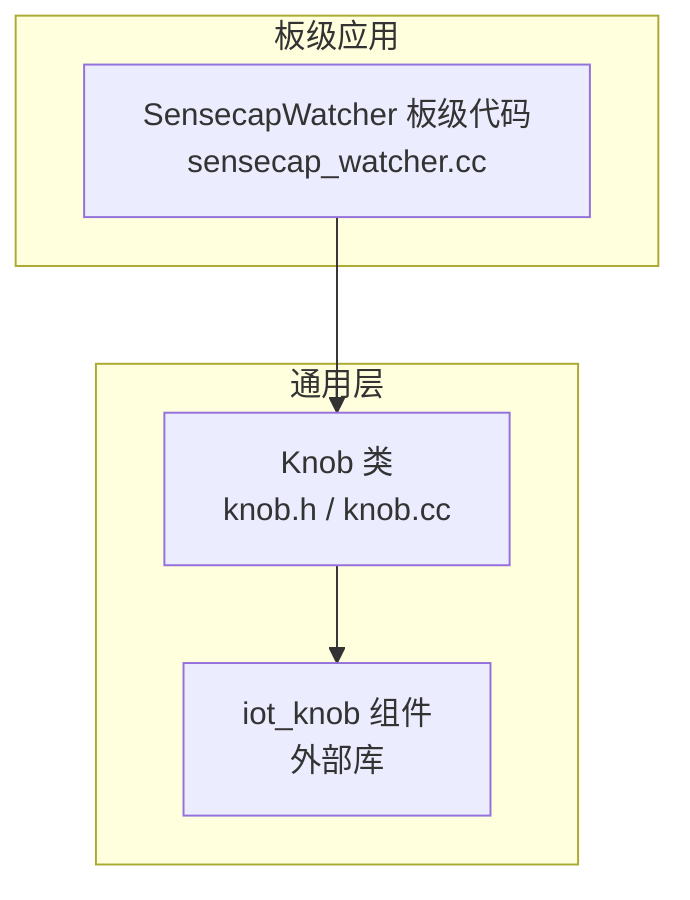
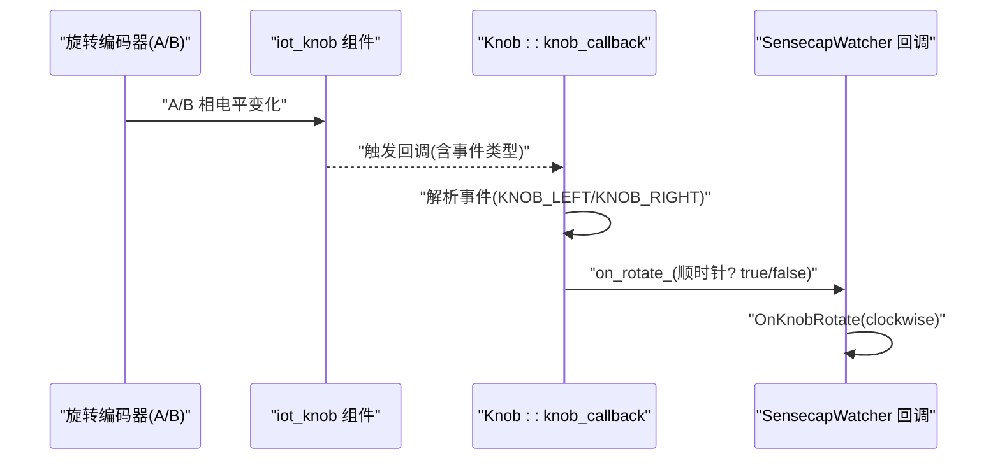
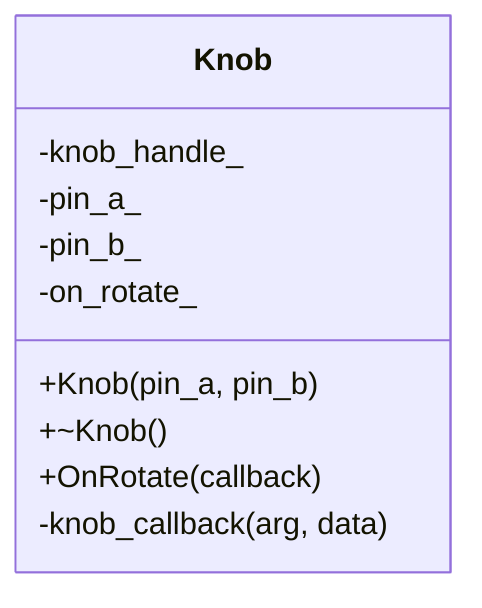
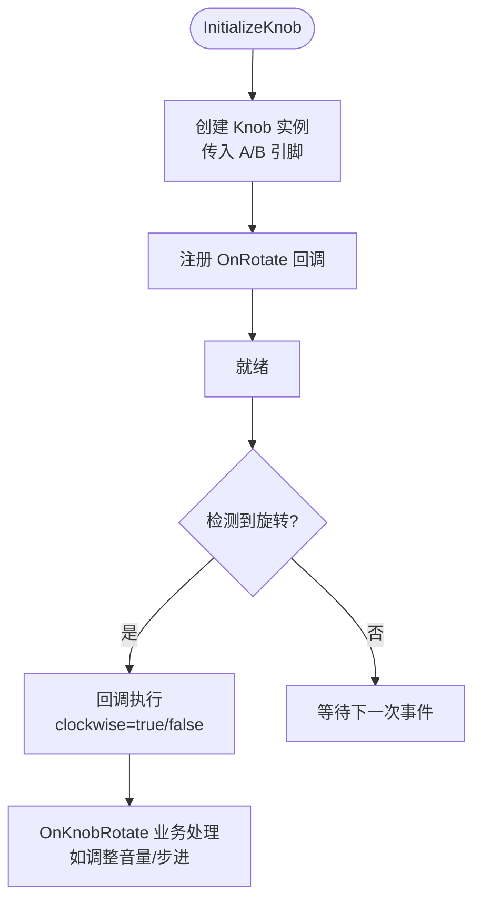
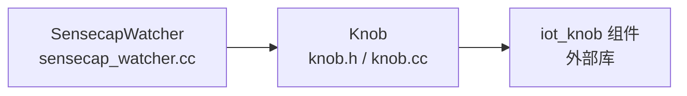

# 旋钮接口

<cite>
**本文引用的文件**
- [knob.h](file://main/boards/common/knob.h)
- [knob.cc](file://main/boards/common/knob.cc)
- [sensecap_watcher.cc](file://main/boards/sensecap-watcher/sensecap_watcher.cc)
</cite>

## 目录
1. [简介](#简介)
2. [项目结构](#项目结构)
3. [核心组件](#核心组件)
4. [架构总览](#架构总览)
5. [详细组件分析](#详细组件分析)
6. [依赖关系分析](#依赖关系分析)
7. [性能与功耗考量](#性能与功耗考量)
8. [故障排查指南](#故障排查指南)
9. [结论](#结论)
10. [附录：API 使用示例与适配要点](#附录api-使用示例与适配要点)

## 简介
本技术文档围绕“旋钮接口”展开，聚焦旋转编码器在系统中的信号处理、事件触发机制、引脚配置与驱动集成方式。该实现基于通用封装类 Knob，内部通过 iot_knob 组件完成 A/B 相编码识别、方向判断与事件回调分发；上层业务（以 sensecap-watcher 板为例）通过 OnRotate 注册回调，将顺时针/逆时针旋转映射为业务逻辑（如音量调节）。

## 项目结构
- 通用旋钮抽象位于 boards/common 下，提供跨板级复用的 Knob 类。
- 具体板级应用（例如 sensecap-watcher）在初始化流程中创建 Knob 实例并注册旋转回调，完成从硬件到业务的桥接。

图表来源
- [knob.h:1-25](file://main/boards/common/knob.h#L1-L25)
- [knob.cc:1-52](file://main/boards/common/knob.cc#L1-L52)
- [sensecap_watcher.cc:239-246](file://main/boards/sensecap-watcher/sensecap_watcher.cc#L239-L246)

章节来源
- [knob.h:1-25](file://main/boards/common/knob.h#L1-L25)
- [knob.cc:1-52](file://main/boards/common/knob.cc#L1-L52)
- [sensecap_watcher.cc:239-246](file://main/boards/sensecap-watcher/sensecap_watcher.cc#L239-L246)

## 核心组件
- Knob 类
  - 职责：封装 iot_knob 的创建、回调注册与事件转发；对外暴露 OnRotate 回调注册接口。
  - 关键成员：
    - 构造参数：A/B 相 GPIO 引脚号
    - 内部句柄：knob_handle_t
    - 回调函数指针：std::function<void(bool)>，bool 表示是否顺时针
  - 生命周期：析构时释放 iot_knob 资源。

- SensecapWatcher 板级集成
  - 在 InitializeKnob 中创建 Knob 实例，绑定 BSP_KNOB_A_PIN 与 BSP_KNOB_B_PIN。
  - 通过 OnRotate 注册回调，记录旋转方向并调用 OnKnobRotate 进行业务处理（如音量调整）。

章节来源
- [knob.h:9-23](file://main/boards/common/knob.h#L9-L23)
- [knob.cc:5-32](file://main/boards/common/knob.cc#L5-L32)
- [knob.cc:41-52](file://main/boards/common/knob.cc#L41-L52)
- [sensecap_watcher.cc:239-246](file://main/boards/sensecap-watcher/sensecap_watcher.cc#L239-L246)

## 架构总览
下图展示了从硬件中断到上层回调的完整链路：底层 iot_knob 捕获 A/B 相跳变，识别方向后触发回调；Knob 将方向信息转换为布尔值传递给上层业务。

图表来源
- [knob.cc:19-29](file://main/boards/common/knob.cc#L19-L29)
- [knob.cc:45-52](file://main/boards/common/knob.cc#L45-L52)
- [sensecap_watcher.cc:241-244](file://main/boards/sensecap-watcher/sensecap_watcher.cc#L241-L244)

## 详细组件分析

### Knob 类设计与实现
- 构造函数
  - 填充 knob_config_t，设置 gpio_encoder_a/b 与默认方向。
  - 调用 iot_knob_create 创建实例，失败则记录错误日志。
  - 分别注册左旋与右旋回调，失败则记录错误日志。
- 析构函数
  - 若存在句柄，调用 iot_knob_delete 释放资源。
- OnRotate
  - 保存用户回调 std::function<void(bool)>。
- 内部回调 knob_callback
  - 通过 iot_knob_get_event 获取事件类型。
  - 将 KNOB_RIGHT 映射为 true（顺时针），否则 false（逆时针）。
  - 调用用户 on_rotate_ 回调。

图表来源
- [knob.h:9-23](file://main/boards/common/knob.h#L9-L23)
- [knob.cc:5-32](file://main/boards/common/knob.cc#L5-L32)
- [knob.cc:34-39](file://main/boards/common/knob.cc#L34-L39)
- [knob.cc:41-52](file://main/boards/common/knob.cc#L41-L52)

章节来源
- [knob.h:1-25](file://main/boards/common/knob.h#L1-L25)
- [knob.cc:1-52](file://main/boards/common/knob.cc#L1-L52)

### 板级集成示例（SensecapWatcher）
- 初始化流程
  - 创建 Knob 实例，传入 BSP_KNOB_A_PIN 与 BSP_KNOB_B_PIN。
  - 注册 OnRotate 回调，打印调试信息并调用 OnKnobRotate。
- 典型用途
  - 结合音量控制：根据 clockwise 调整输出音量，并在显示上反馈当前值。

图表来源
- [sensecap_watcher.cc:239-246](file://main/boards/sensecap-watcher/sensecap_watcher.cc#L239-L246)

章节来源
- [sensecap_watcher.cc:239-246](file://main/boards/sensecap-watcher/sensecap_watcher.cc#L239-L246)

## 依赖关系分析
- Knob 对 iot_knob 的依赖
  - 通过 iot_knob_create 创建实例。
  - 通过 iot_knob_register_cb 注册左右旋回调。
  - 通过 iot_knob_get_event 获取事件类型。
  - 通过 iot_knob_delete 释放资源。
- 上层依赖
  - 板级代码依赖 Knob 提供的 OnRotate 接口，将旋转事件接入业务逻辑。

图表来源
- [knob.cc:12-29](file://main/boards/common/knob.cc#L12-L29)
- [knob.cc:34-39](file://main/boards/common/knob.cc#L34-L39)
- [knob.cc:45-52](file://main/boards/common/knob.cc#L45-L52)
- [sensecap_watcher.cc:239-246](file://main/boards/sensecap-watcher/sensecap_watcher.cc#L239-L246)

章节来源
- [knob.cc:12-29](file://main/boards/common/knob.cc#L12-L29)
- [knob.cc:34-39](file://main/boards/common/knob.cc#L34-L39)
- [knob.cc:45-52](file://main/boards/common/knob.cc#L45-L52)
- [sensecap_watcher.cc:239-246](file://main/boards/sensecap-watcher/sensecap_watcher.cc#L239-L246)

## 性能与功耗考量
- 中断驱动 vs 轮询
  - 当前实现通过 iot_knob 注册回调，属于中断驱动的事件模型，响应及时且 CPU 占用低。
  - 若需轮询模式，可在上层任务中周期性读取状态（需参考 iot_knob 能力扩展或自行实现 A/B 相采样与状态机）。
- 抗抖与去噪
  - 建议在硬件侧增加 RC 滤波或上拉/下拉电阻；软件侧可引入短时消抖窗口（由 iot_knob 或上层策略实现）。
- 功耗优化
  - 仅在需要时启用旋钮中断；空闲时可关闭外设电源或进入低功耗模式（由系统电源管理协调）。
  - 减少回调中的重计算与 IO 操作，必要时合并多次旋转事件再批量更新 UI。

[本节为通用指导，不直接分析具体文件]

## 故障排查指南
- 常见问题定位
  - 初始化失败：检查 iot_knob_create 返回值与日志输出。
  - 回调未触发：确认 iot_knob_register_cb 是否成功注册左右旋回调。
  - 方向误判：核对 A/B 引脚接线顺序与默认方向配置。
- 日志关键字
  - “Failed to create knob instance”
  - “Failed to register left/right callback”
  - “Knob initialized with pins A:... B:...”
- 建议步骤
  - 使用最小化用例验证 Knob 初始化与回调。
  - 逐步接入业务逻辑，隔离问题域。
  - 检查硬件连线与上拉/下拉配置，确保无短路或悬空。

章节来源
- [knob.cc:14-31](file://main/boards/common/knob.cc#L14-L31)

## 结论
Knob 类提供了简洁稳定的旋钮事件抽象，屏蔽了底层 iot_knob 的细节，使上层业务能专注于旋转方向与数值变化的处理。结合板级集成示例，开发者可以快速将旋钮用于音量、步进等场景，并通过合理的抗抖与功耗策略提升用户体验与能效。

[本节为总结性内容，不直接分析具体文件]

## 附录：API 使用示例与适配要点

- API 概览
  - 构造：Knob(gpio_num_t pin_a, gpio_num_t pin_b)
  - 注册回调：void OnRotate(std::function<void(bool)> callback)
  - 销毁：~Knob()

- 使用示例（概念流程）
  - 在板级初始化中创建 Knob 实例，传入 A/B 引脚。
  - 调用 OnRotate 注册回调，根据 bool 参数区分顺时针/逆时针。
  - 在回调中执行业务逻辑（如调整音量、步进计数、边界限制等）。

- 数值范围与边界处理
  - 在业务层维护当前值与上下限，每次旋转后按步进增减并钳制到合法区间。
  - 可选：在接近边界时降低步进或提示用户。

- 平滑滚动效果
  - 在高频旋转时合并事件，采用节流/防抖策略避免 UI 抖动。
  - 可使用定时器累积短时间内的旋转量，再一次性更新显示。

- 引脚配置与中断/轮询
  - 中断模式：当前实现即中断驱动，无需额外配置。
  - 轮询模式：如需轮询，应在上层任务中周期读取状态（需扩展 iot_knob 能力或自行实现 A/B 相采样与状态机）。

- 驱动适配指南
  - 更换引脚：修改板级初始化中传入的 BSP_KNOB_A_PIN 与 BSP_KNOB_B_PIN。
  - 自定义方向：若默认方向相反，可在上层回调中对 bool 取反。
  - 多旋钮支持：为每个旋钮创建独立 Knob 实例并分别注册回调。

- 抗干扰与稳定性
  - 硬件：RC 滤波、合理上拉/下拉、缩短走线。
  - 软件：消抖窗口、事件合并、异常回退（如恢复上次有效值）。

- 功耗优化策略
  - 按需启用中断、空闲降频、批量更新 UI、减少回调内耗时操作。

章节来源
- [knob.h:9-23](file://main/boards/common/knob.h#L9-L23)
- [knob.cc:5-32](file://main/boards/common/knob.cc#L5-L32)
- [knob.cc:41-52](file://main/boards/common/knob.cc#L41-L52)
- [sensecap_watcher.cc:239-246](file://main/boards/sensecap-watcher/sensecap_watcher.cc#L239-L246)