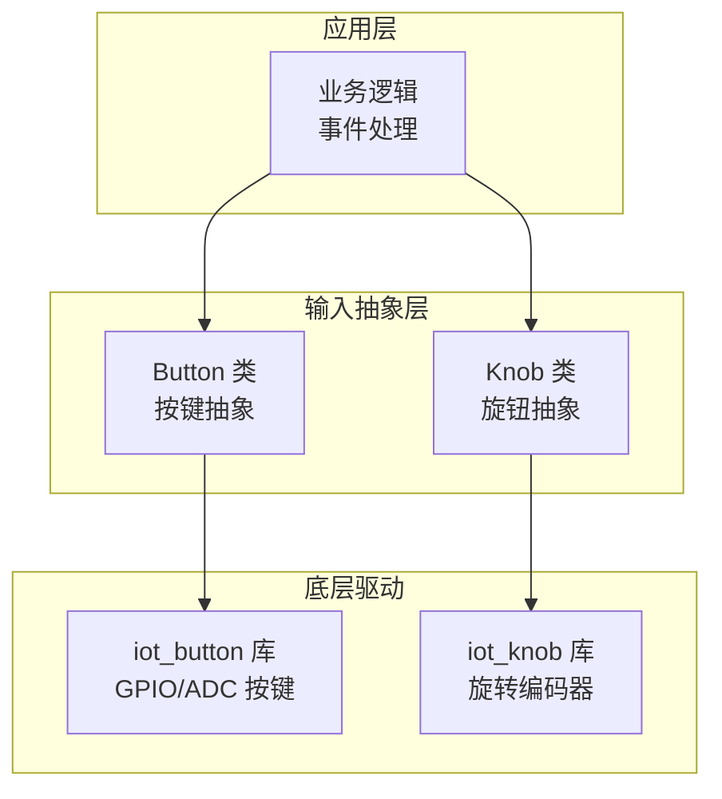
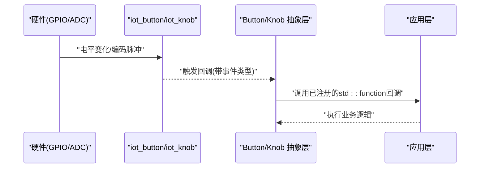
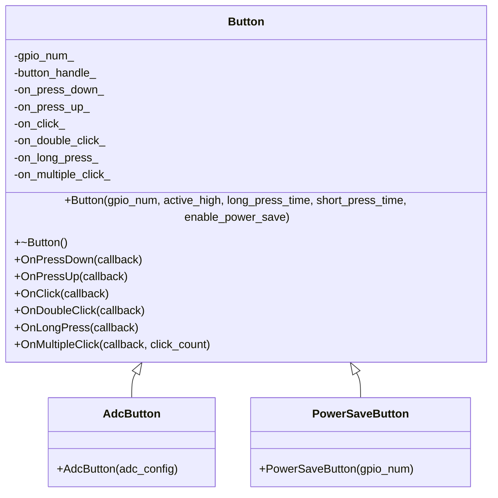
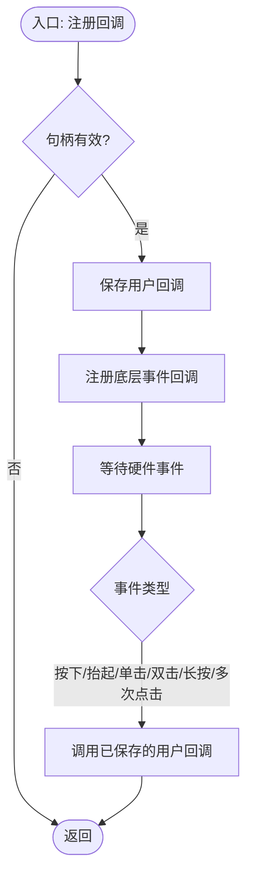
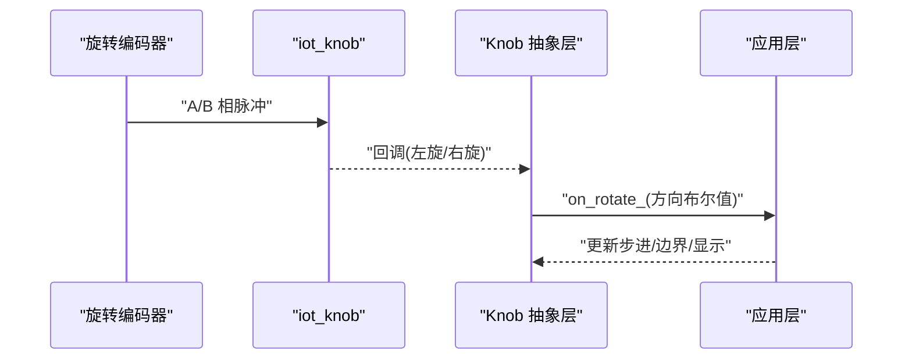
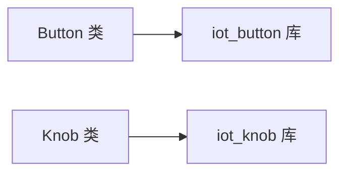

# 输入设备接口

<cite>
**本文引用的文件**   
- [button.h](file://main/boards/common/button.h)
- [button.cc](file://main/boards/common/button.cc)
- [knob.h](file://main/boards/common/knob.h)
- [knob.cc](file://main/boards/common/knob.cc)
</cite>

## 目录
1. [简介](#简介)
2. [项目结构](#项目结构)
3. [核心组件](#核心组件)
4. [架构总览](#架构总览)
5. [详细组件分析](#详细组件分析)
6. [依赖关系分析](#依赖关系分析)
7. [性能与功耗考量](#性能与功耗考量)
8. [调试与排障指南](#调试与排障指南)
9. [结论](#结论)
10. [附录：驱动适配示例](#附录驱动适配示例)

## 简介
本技术文档聚焦于输入设备接口，围绕按键检测、旋钮控制、GPIO中断与轮询模式、低功耗唤醒机制、事件处理流程、回调注册、多键组合操作等主题展开。文档基于仓库中通用板级输入抽象层（Button/Knob）的实现进行解读，并给出面向触摸按键、编码器、摇杆等常见输入设备的适配方法与最佳实践建议。

## 项目结构
输入设备相关代码集中在 boards/common 目录下，提供统一的 Button 与 Knob 抽象类，封装底层 iot_button 与 iot_knob 库的初始化、回调注册与生命周期管理。上层业务通过面向对象接口订阅事件，屏蔽硬件差异与底层细节。

图表来源
- [button.h:1-49](file://main/boards/common/button.h#L1-L49)
- [button.cc:1-125](file://main/boards/common/button.cc#L1-L125)
- [knob.h:1-25](file://main/boards/common/knob.h#L1-L25)
- [knob.cc:1-52](file://main/boards/common/knob.cc#L1-L52)

章节来源
- [button.h:1-49](file://main/boards/common/button.h#L1-L49)
- [button.cc:1-125](file://main/boards/common/button.cc#L1-L125)
- [knob.h:1-25](file://main/boards/common/knob.h#L1-L25)
- [knob.cc:1-52](file://main/boards/common/knob.cc#L1-L52)

## 核心组件
- Button 类：封装 GPIO/ADC 按键的创建、去抖、长按/单击/双击/多次点击识别、回调注册与释放。支持低功耗唤醒开关。
- AdcButton 子类：基于 ADC 的多路按键实现，适用于电阻分压矩阵或单线多键场景。
- PowerSaveButton 子类：便捷构造器，启用低功耗唤醒能力。
- Knob 类：封装旋转编码器 A/B 相引脚配置、方向判断、左右旋转回调。

章节来源
- [button.h:11-47](file://main/boards/common/button.h#L11-L47)
- [button.cc:21-42](file://main/boards/common/button.cc#L21-L42)
- [knob.h:9-23](file://main/boards/common/knob.h#L9-L23)
- [knob.cc:5-32](file://main/boards/common/knob.cc#L5-L32)

## 架构总览
输入事件从硬件到应用的典型路径如下：
- 硬件电平变化触发底层驱动（GPIO 中断或 ADC 采样）。
- iot_button/iot_knob 完成去抖、边沿/状态机识别、长按/双击判定。
- 驱动回调进入 Button/Knob 的静态回调函数，再转发至用户注册的 std::function 回调。
- 应用层在回调中执行具体业务逻辑（如切换模式、调节音量、发送消息等）。

图表来源
- [button.cc:44-125](file://main/boards/common/button.cc#L44-L125)
- [knob.cc:45-52](file://main/boards/common/knob.cc#L45-L52)

## 详细组件分析

### 按键检测（Button）
- 初始化与配置
  - GPIO 按键：通过构造函数传入 GPIO 编号、有效电平、长按/短按时长、是否启用低功耗唤醒。内部使用底层库创建设备句柄。
  - ADC 按键：AdcButton 通过 ADC 配置创建多键设备，默认设置长按时长。
- 去抖与识别
  - 去抖由底层库负责；Button 仅暴露高层 API 用于注册不同事件类型的回调。
- 事件类型
  - 按下/抬起、单击、双击、长按开始、多次点击（可配置次数）。
- 回调注册
  - 每个事件类型对应一个 OnXxx 方法，内部将用户回调保存并通过底层库注册 C 风格回调，再由静态回调转发到对象实例的成员回调。
- 资源释放
  - 析构时删除底层设备句柄，避免泄漏。

图表来源
- [button.h:11-47](file://main/boards/common/button.h#L11-L47)
- [button.cc:8-16](file://main/boards/common/button.cc#L8-L16)
- [button.cc:21-42](file://main/boards/common/button.cc#L21-L42)

章节来源
- [button.h:11-47](file://main/boards/common/button.h#L11-L47)
- [button.cc:8-16](file://main/boards/common/button.cc#L8-L16)
- [button.cc:21-42](file://main/boards/common/button.cc#L21-L42)
- [button.cc:44-125](file://main/boards/common/button.cc#L44-L125)

#### 按键事件处理流程

图表来源
- [button.cc:44-125](file://main/boards/common/button.cc#L44-L125)

### 旋钮控制（Knob）
- 初始化与配置
  - 构造函数接收 A/B 相引脚，创建旋钮句柄，并分别注册左旋/右旋回调。
- 方向判断与步进
  - 通过底层库的事件类型区分左旋/右旋；上层将布尔值传递给用户回调（例如 true 表示顺时针）。
- 资源释放
  - 析构时删除句柄。

图表来源
- [knob.cc:5-32](file://main/boards/common/knob.cc#L5-L32)
- [knob.cc:45-52](file://main/boards/common/knob.cc#L45-L52)

章节来源
- [knob.h:9-23](file://main/boards/common/knob.h#L9-L23)
- [knob.cc:5-32](file://main/boards/common/knob.cc#L5-L32)
- [knob.cc:45-52](file://main/boards/common/knob.cc#L45-L52)

### GPIO 中断、轮询与低功耗唤醒
- 中断与轮询
  - Button 使用底层库的 GPIO 设备创建接口，底层通常基于中断或高效轮询实现；上层无需关心具体方式。
- 低功耗唤醒
  - Button 构造函数支持 enable_power_save 参数，开启后可在系统休眠时被按键唤醒。
- 注意事项
  - 若需精确控制中断优先级或轮询周期，应在底层库配置中进行调整；当前抽象层未暴露这些细粒度选项。

章节来源
- [button.cc:21-36](file://main/boards/common/button.cc#L21-L36)

### 多按键组合与交互策略
- 组合策略建议
  - 使用“长按+单击”、“双击+长按”等复合手势提升功能密度。
  - 对关键操作增加确认步骤（如二次长按或连续两次双击）。
- 事件互斥
  - 在同一时刻只允许一种主模式（如编辑/播放），通过全局状态机约束组合事件的生效范围。
- 防误触
  - 为组合事件设置时间窗口（如双击间隔阈值），并在长按期间屏蔽其他轻触事件。

[本节为概念性说明，不直接分析具体文件]

## 依赖关系分析
- 外部依赖
  - iot_button：提供 GPIO/ADC 按键驱动、去抖、长按/双击/多次点击识别。
  - iot_knob：提供旋转编码器驱动、方向识别。
- 耦合与内聚
  - Button/Knob 作为薄封装，职责清晰，内聚度高；对外暴露稳定接口，降低上层耦合度。
- 潜在循环依赖
  - 当前实现无循环依赖风险。

图表来源
- [button.h:4-9](file://main/boards/common/button.h#L4-L9)
- [knob.h:4-7](file://main/boards/common/knob.h#L4-L7)

章节来源
- [button.h:4-9](file://main/boards/common/button.h#L4-L9)
- [knob.h:4-7](file://main/boards/common/knob.h#L4-L7)

## 性能与功耗考量
- 去抖与响应延迟
  - 去抖由底层库实现，合理设置短按/长按阈值可在响应速度与抗干扰之间取得平衡。
- 回调开销
  - 回调为轻量转发，避免在回调中执行耗时任务；必要时采用队列异步处理。
- 低功耗
  - 启用低功耗唤醒后，系统在空闲时可进入深度睡眠，按键中断唤醒可降低整体功耗。
- 资源管理
  - 确保在不再使用时及时销毁句柄，避免内存与外设占用。

[本节为通用指导，不直接分析具体文件]

## 调试与排障指南
- 日志定位
  - 初始化失败会输出错误日志，便于快速定位引脚配置或句柄创建问题。
- 常见问题
  - 引脚冲突：检查 GPIO 编号是否与屏幕/音频等其他模块冲突。
  - 无效电平：确认 active_high 与实际电路匹配（上拉/下拉）。
  - 未触发回调：确认已正确注册对应事件类型回调且句柄非空。
- 建议工具
  - 使用串口日志观察事件触发顺序与时序。
  - 使用示波器/逻辑分析仪验证按键抖动与编码器波形。

章节来源
- [knob.cc:14-17](file://main/boards/common/knob.cc#L14-L17)
- [knob.cc:19-29](file://main/boards/common/knob.cc#L19-L29)

## 结论
Button 与 Knob 抽象层以简洁稳定的面向对象接口屏蔽了底层驱动差异，提供了完善的按键与旋钮处理能力。结合合理的组合策略与低功耗配置，可满足多数嵌入式人机交互需求。对于更复杂的输入设备（触摸、摇杆），可参考本文档的适配思路进行扩展。

[本节为总结性内容，不直接分析具体文件]

## 附录：驱动适配示例

### 触摸按键适配
- 目标
  - 将电容触摸事件映射为 Button 的单击/长按事件。
- 步骤
  - 在触摸驱动的中断或轮询回调中，解析触摸点坐标与压力。
  - 将单次触摸转换为单击事件，长时间保持转换为长按事件。
  - 复用 Button 的回调注册机制，将触摸事件投递到已有业务逻辑。
- 注意
  - 触摸去抖与灵敏度需在触摸驱动侧调优。
  - 多点触控场景下，需定义明确的焦点区域与事件优先级。

[本节为概念性说明，不直接分析具体文件]

### 编码器（旋转编码器）适配
- 目标
  - 利用 Knob 抽象层实现音量/菜单步进控制。
- 步骤
  - 连接 A/B 相引脚到 Knob 构造函数。
  - 注册 OnRotate 回调，根据方向布尔值递增/递减步进值。
  - 在应用层实现边界处理（最小/最大值限制）与反馈（LED/声音）。
- 注意
  - 步进值可根据场景动态调整（如精细/粗调模式）。
  - 快速旋转时的丢步可通过软件滤波或累积计数补偿。

章节来源
- [knob.h:9-23](file://main/boards/common/knob.h#L9-L23)
- [knob.cc:5-32](file://main/boards/common/knob.cc#L5-L32)
- [knob.cc:45-52](file://main/boards/common/knob.cc#L45-L52)

### 摇杆（双轴电位器/数字按键）适配
- 目标
  - 读取 X/Y 轴模拟量与中心按键状态，映射为方向移动与确认操作。
- 步骤
  - 使用 ADC 通道读取两轴电压，计算归一化坐标。
  - 设定死区阈值，忽略微小漂移。
  - 中心按键复用 Button 的单击/长按语义。
- 注意
  - 采样频率与滤波算法影响响应与稳定性。
  - 与 UI 联动时需考虑刷新率与事件合并。

[本节为概念性说明，不直接分析具体文件]

### 输入事件处理与回调注册最佳实践
- 统一事件总线
  - 在应用层维护事件队列，避免回调中阻塞。
- 组合事件
  - 使用时间窗口与状态机实现“长按+单击”等复合手势。
- 资源清理
  - 在退出或切换界面时注销回调并销毁句柄，防止重复触发。

[本节为概念性说明，不直接分析具体文件]