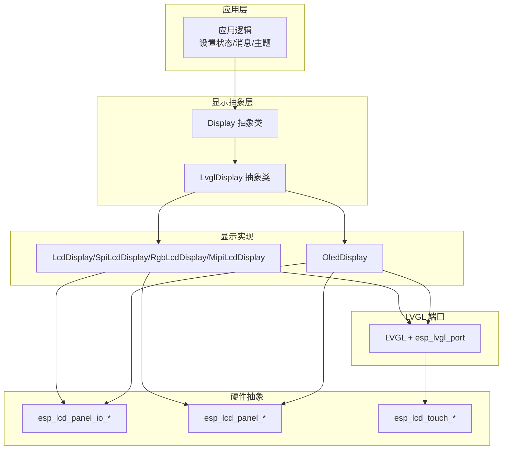
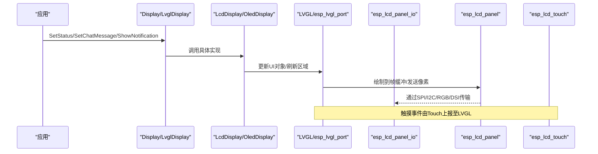
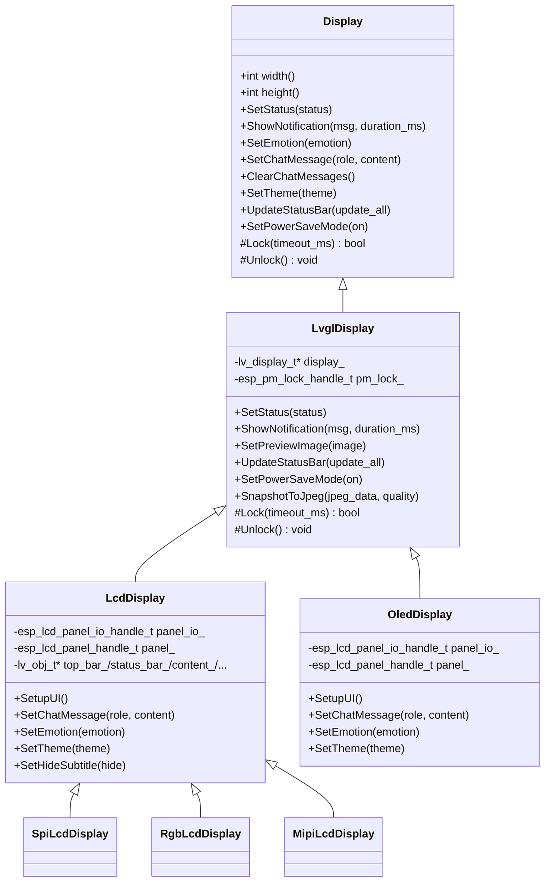
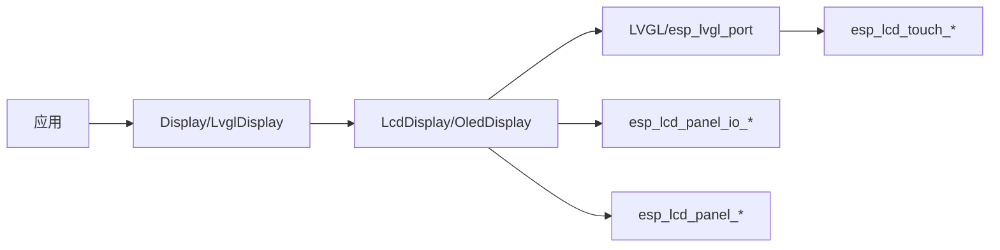

# 显示驱动适配

<cite>
**本文引用的文件列表**
- [display.h](file://main/display/display.h)
- [lvgl_display.h](file://main/display/lvgl_display/lvgl_display.h)
- [lcd_display.h](file://main/display/lcd_display.h)
- [lcd_display.cc](file://main/display/lcd_display.cc)
- [oled_display.h](file://main/display/oled_display.h)
- [oled_display.cc](file://main/display/oled_display.cc)
- [config.h（面包板 ESP32 LCD）](file://main/boards/bread-compact-esp32-lcd/config.h)
- [config.h（面包板 WiFi LCD）](file://main/boards/bread-compact-wifi-lcd/config.h)
- [config.h（ESP32-CGC）](file://main/boards/esp32-cgc/config.h)
- [esp-sensairshuttle.cc](file://main/boards/esp-sensairshuttle/esp-sensairshuttle.cc)
- [atk_dnesp32s3_box2.cc](file://main/boards/atk-dnesp32s3-box2-4g/atk_dnesp32s3_box2.cc)
- [atk_dnesp32s3_box2.cc（WiFi版）](file://main/boards/atk-dnesp32s3-box2-wifi/atk_dnesp32s3_box2.cc)
- [esp_lcd_gc9503.h](file://main/boards/esp-s3-lcd-ev-board/esp_lcd_gc9503.h)
- [esp_lcd_gc9503.h（版本2）](file://main/boards/esp-s3-lcd-ev-board-2/esp_lcd_gc9503.h)
- [genjutech-s3-1.54tft.cc](file://main/boards/genjutech-s3-1.54tft/genjutech-s3-1.54tft.cc)
- [atk_dnesp32s3_box3.cc](file://main/boards/atk-dnesp32s3-box3/atk_dnesp32s3_box3.cc)
- [jiuchuan_dev_board.cc](file://main/boards/jiuchuan-s3/jiuchuan_dev_board.cc)
- [touch.h](file://main/boards/esp-vocat/touch.h)
- [esp-s3-lcd-ev-board-2.cc](file://main/boards/esp-s3-lcd-ev-board-2/esp-s3-lcd-ev-board-2.cc)
- [sdkconfig.defaults](file://sdkconfig.defaults)
</cite>

## 目录
1. [简介](#简介)
2. [项目结构](#项目结构)
3. [核心组件](#核心组件)
4. [架构总览](#架构总览)
5. [详细组件分析](#详细组件分析)
6. [依赖关系分析](#依赖关系分析)
7. [性能与优化](#性能与优化)
8. [故障排查指南](#故障排查指南)
9. [结论](#结论)
10. [附录：常见控制器初始化参考路径](#附录常见控制器初始化参考路径)

## 简介
本指南面向在 ESP-IDF 平台上为小智项目适配 LCD/OLED 显示器的开发者，覆盖以下主题：
- LVGL 图形库集成配置：屏幕分辨率、颜色格式、刷新策略、触摸支持
- 不同显示驱动的适配步骤：SPI/I2C 接口配置、显示控制器初始化、内存缓冲区管理
- 显示性能优化：刷新率调优、内存使用最佳实践
- 复杂 UI 界面实现案例：聊天消息气泡、状态栏、表情图标、图片预览等

## 项目结构
本项目将显示抽象层与具体驱动解耦，采用分层设计：
- 显示抽象层：定义统一的 Display/LvglDisplay 接口，屏蔽底层差异
- 具体显示实现：LCD 与 OLED 两类，分别封装 SPI/RGB/MIPI 或 I2C 面板
- 板级适配：各 Board 中完成总线、GPIO、控制器初始化，并创建对应显示对象
- LVGL 集成：通过 esp_lvgl_port 注册显示与触摸输入

图表来源
- [display.h:28-61](file://main/display/display.h#L28-L61)
- [lvgl_display.h:15-50](file://main/display/lvgl_display/lvgl_display.h#L15-L50)
- [lcd_display.h:17-83](file://main/display/lcd_display.h#L17-L83)
- [oled_display.h:10-39](file://main/display/oled_display.h#L10-L39)

章节来源
- [display.h:28-61](file://main/display/display.h#L28-L61)
- [lvgl_display.h:15-50](file://main/display/lvgl_display/lvgl_display.h#L15-L50)
- [lcd_display.h:17-83](file://main/display/lcd_display.h#L17-L83)
- [oled_display.h:10-39](file://main/display/oled_display.h#L10-L39)

## 核心组件
- Display 抽象类：提供统一的状态、通知、主题、锁机制等接口
- LvglDisplay：基于 LVGL 的通用能力（状态栏、通知、截图等）
- LcdDisplay：彩色 LCD 的通用实现，包含 SPI/RGB/MIPI 子类
- OledDisplay：单色 OLED 的专用实现，针对小屏布局优化

章节来源
- [display.h:28-61](file://main/display/display.h#L28-L61)
- [lvgl_display.h:15-50](file://main/display/lvgl_display/lvgl_display.h#L15-L50)
- [lcd_display.h:17-83](file://main/display/lcd_display.h#L17-L83)
- [oled_display.h:10-39](file://main/display/oled_display.h#L10-L39)

## 架构总览
下图展示了从应用到硬件的调用链与数据流。

图表来源
- [lcd_display.cc:113-172](file://main/display/lcd_display.cc#L113-L172)
- [oled_display.cc:39-81](file://main/display/oled_display.cc#L39-L81)
- [esp-s3-lcd-ev-board-2.cc:176-208](file://main/boards/esp-s3-lcd-ev-board-2/esp-s3-lcd-ev-board-2.cc#L176-L208)

## 详细组件分析

### 显示抽象与 LVGL 基类
- Display：定义宽度/高度、主题、锁、状态/通知/表情/聊天消息等接口
- LvglDisplay：扩展了 LVGL 相关能力，如状态栏图标、通知定时器、省电模式、截图等

图表来源
- [display.h:28-61](file://main/display/display.h#L28-L61)
- [lvgl_display.h:15-50](file://main/display/lvgl_display/lvgl_display.h#L15-L50)
- [lcd_display.h:17-83](file://main/display/lcd_display.h#L17-L83)
- [oled_display.h:10-39](file://main/display/oled_display.h#L10-L39)

章节来源
- [display.h:28-61](file://main/display/display.h#L28-L61)
- [lvgl_display.h:15-50](file://main/display/lvgl_display/lvgl_display.h#L15-L50)
- [lcd_display.h:17-83](file://main/display/lcd_display.h#L17-L83)
- [oled_display.h:10-39](file://main/display/oled_display.h#L10-L39)

### LCD 显示驱动适配要点
- 构造函数与 LVGL 初始化
  - 初始化 LVGL 与 esp_lvgl_port
  - 配置 lvgl_port_display_cfg_t：分辨率、旋转、颜色格式、缓冲区大小、双缓冲、DMA、字节序等
  - RGB/MIPI 场景下额外配置 rgb/dsi 参数
- 缓冲区与刷新策略
  - SPI 通常使用行缓冲（例如 width×N），避免整屏缓冲占用过大
  - RGB 可启用双缓冲与直接模式提升流畅度
  - MIPI 可使用较大行缓冲并结合软件旋转
- 偏移与方向
  - 通过 offset_x/offset_y 与 swap_xy/mirror_x/mirror_y 对齐面板物理坐标
- 主题与 UI
  - 内置 light/dark 主题，字体与图标资源注入
  - 聊天消息气泡、顶部状态栏、底部控制条、表情区、图片预览等

章节来源
- [lcd_display.cc:113-172](file://main/display/lcd_display.cc#L113-L172)
- [lcd_display.cc:176-233](file://main/display/lcd_display.cc#L176-L233)
- [lcd_display.cc:235-284](file://main/display/lcd_display.cc#L235-L284)
- [lcd_display.h:17-83](file://main/display/lcd_display.h#L17-L83)

### OLED 显示驱动适配要点
- 单色显示配置
  - monochrome=true，buffer_size=width×height（整屏缓冲）
  - 仅支持镜像与旋转，不支持交换 XY（根据实现）
- 布局适配
  - 128x64 与 128x32 两套布局，左侧表情+右侧滚动文本
  - 状态栏与通知标签居中显示
- 主题与字体
  - 默认 dark 主题，使用内嵌字体与图标

章节来源
- [oled_display.cc:39-81](file://main/display/oled_display.cc#L39-L81)
- [oled_display.cc:83-96](file://main/display/oled_display.cc#L83-L96)
- [oled_display.cc:168-298](file://main/display/oled_display.cc#L168-L298)
- [oled_display.cc:300-385](file://main/display/oled_display.cc#L300-L385)
- [oled_display.h:10-39](file://main/display/oled_display.h#L10-L39)

### 板级适配：SPI/I2C 接口与控制器初始化
- SPI 面板 IO 与控制器初始化
  - 配置 CS/DC/SPI_MODE/pclk_hz/trans_queue_depth/cmd_bits/param_bits
  - 创建 panel_io 后，实例化具体控制器驱动（如 ST7789/ILI9341/GC9A01/GC9503 等）
  - 执行 reset/init/invert_color/swap_xy/mirror 等命令
- I80 并行总线（RGB）
  - 配置 data_gpio_nums/bus_width/pclk_hz/dc_levels 等
  - 创建 i80_bus 与 panel_io_i80，再创建 panel
- I2C 触摸
  - 配置 I2C 地址、控制相位、dc_bit_offset 等
  - 创建 touch 并通过 lvgl_port_add_touch 接入 LVGL

章节来源
- [esp-sensairshuttle.cc:237-263](file://main/boards/esp-sensairshuttle/esp-sensairshuttle.cc#L237-L263)
- [atk_dnesp32s3_box2.cc:315-350](file://main/boards/atk-dnesp32s3-box2-4g/atk_dnesp32s3_box2.cc#L315-L350)
- [atk_dnesp32s3_box2.cc（WiFi版）:320-358](file://main/boards/atk-dnesp32s3-box2-wifi/atk_dnesp32s3_box2.cc#L320-L358)
- [esp-s3-lcd-ev-board-2.cc:176-208](file://main/boards/esp-s3-lcd-ev-board-2/esp-s3-lcd-ev-board-2.cc#L176-L208)
- [genjutech-s3-1.54tft.cc:159-176](file://main/boards/genjutech-s3-1.54tft/genjutech-s3-1.54tft.cc#L159-L176)
- [atk_dnesp32s3_box3.cc:228-253](file://main/boards/atk-dnesp32s3-box3/atk_dnesp32s3_box3.cc#L228-L253)

### LVGL 集成配置清单
- 屏幕分辨率与方向
  - hres/vres 与 rotation.swap_xy/mirror_x/mirror_y 需与硬件一致
- 颜色格式
  - 彩色 LCD 使用 RGB565；OLED 使用 monochrome
- 触摸支持
  - 通过 esp_lcd_touch_new_* 创建 touch，再用 lvgl_port_add_touch 绑定默认显示
- 任务与优先级
  - lvgl_port_cfg_t.task_priority/task_affinity 可按多核分配

章节来源
- [lcd_display.cc:128-172](file://main/display/lcd_display.cc#L128-L172)
- [oled_display.cc:39-81](file://main/display/oled_display.cc#L39-L81)
- [esp-s3-lcd-ev-board-2.cc:203-208](file://main/boards/esp-s3-lcd-ev-board-2/esp-s3-lcd-ev-board-2.cc#L203-L208)

### 内存缓冲区管理
- 行缓冲 vs 整屏缓冲
  - SPI 建议行缓冲（width×N），降低 SRAM 占用
  - RGB 可开启双缓冲，提高帧率但增加内存
  - OLED 单色常用整屏缓冲
- PSRAM 图像缓存
  - 根据 PSRAM 容量动态调整 LVGL 图像缓存大小
- 摄像头/视频预览
  - 将 RGB565 帧复制到 PSRAM 缓冲，构造 LvglAllocatedImage 传入显示层

章节来源
- [lcd_display.cc:116-126](file://main/display/lcd_display.cc#L116-L126)
- [lcd_display.cc:197-215](file://main/display/lcd_display.cc#L197-L215)
- [oled_display.cc:49-71](file://main/display/oled_display.cc#L49-L71)
- [esp32_camera.cc:90-117](file://main/boards/common/esp32_camera.cc#L90-L117)

### 复杂 UI 界面实现案例
- 聊天消息气泡
  - 用户/助手/系统三类样式，自动换行与最大宽度限制
  - 消息数量上限保护，删除最旧消息保持滚动
- 状态栏与通知
  - 顶部图标（网络/静音/电池）与居中状态/通知文本
- 表情与动画
  - 启动时显示 AI Logo，后续切换表情图标
- 图片预览
  - 自适应缩放，放入气泡容器，自动滚动到底部

章节来源
- [lcd_display.cc:353-498](file://main/display/lcd_display.cc#L353-L498)
- [lcd_display.cc:504-698](file://main/display/lcd_display.cc#L504-L698)
- [lcd_display.cc:700-782](file://main/display/lcd_display.cc#L700-L782)
- [oled_display.cc:168-298](file://main/display/oled_display.cc#L168-L298)
- [oled_display.cc:300-385](file://main/display/oled_display.cc#L300-L385)

## 依赖关系分析
- 显示抽象层依赖 LVGL 与 esp_lvgl_port
- 具体显示实现依赖 esp_lcd_panel_io/panel 系列 API
- 触摸依赖 esp_lcd_touch 与 LVGL 触摸输入
- 板级代码负责总线与 GPIO 初始化，并创建显示对象

图表来源
- [display.h:28-61](file://main/display/display.h#L28-L61)
- [lvgl_display.h:15-50](file://main/display/lvgl_display/lvgl_display.h#L15-L50)
- [lcd_display.h:17-83](file://main/display/lcd_display.h#L17-L83)
- [oled_display.h:10-39](file://main/display/oled_display.h#L10-L39)
- [esp-s3-lcd-ev-board-2.cc:176-208](file://main/boards/esp-s3-lcd-ev-board-2/esp-s3-lcd-ev-board-2.cc#L176-L208)

章节来源
- [display.h:28-61](file://main/display/display.h#L28-L61)
- [lvgl_display.h:15-50](file://main/display/lvgl_display/lvgl_display.h#L15-L50)
- [lcd_display.h:17-83](file://main/display/lcd_display.h#L17-L83)
- [oled_display.h:10-39](file://main/display/oled_display.h#L10-L39)
- [esp-s3-lcd-ev-board-2.cc:176-208](file://main/boards/esp-s3-lcd-ev-board-2/esp-s3-lcd-ev-board-2.cc#L176-L208)

## 性能与优化
- 刷新率与带宽
  - SPI：合理设置 pclk_hz 与 trans_queue_depth，避免队列溢出
  - RGB：启用双缓冲与 direct_mode，减少 CPU 参与
  - MIPI：增大行缓冲，结合 DMA 传输
- 内存占用
  - 优先使用行缓冲，必要时利用 PSRAM
  - 关闭不必要的 LVGL 部件以节省 Flash/内存
- 刷新策略
  - 局部刷新优于全屏刷新
  - 对静态区域减少重绘
- 电源与休眠
  - 进入睡眠时关闭背光与显示输出，退出时恢复

章节来源
- [lcd_display.cc:197-215](file://main/display/lcd_display.cc#L197-L215)
- [sdkconfig.defaults:42-78](file://sdkconfig.defaults#L42-L78)
- [atk_dnesp32s3_box3.cc:107-129](file://main/boards/atk-dnesp32s3-box3/atk_dnesp32s3_box3.cc#L107-L129)

## 故障排查指南
- 无法点亮屏幕
  - 检查复位时序与 DC/CSPIN 配置
  - 确认控制器初始化序列是否完整
- 画面翻转/错位
  - 核对 swap_xy/mirror_x/mirror_y 与 offset_x/offset_y
- 触摸无响应
  - 检查 I2C 地址与控制相位配置
  - 确认 lvgl_port_add_touch 已调用且 disp 指向默认显示
- 卡顿/掉帧
  - 评估缓冲区大小与双缓冲开关
  - 降低刷新频率或减少重绘区域
- 内存不足
  - 减小 buffer_size 或启用 PSRAM 缓存
  - 精简 LVGL 部件与字体

章节来源
- [esp-sensairshuttle.cc:237-263](file://main/boards/esp-sensairshuttle/esp-sensairshuttle.cc#L237-L263)
- [atk_dnesp32s3_box2.cc:315-350](file://main/boards/atk-dnesp32s3-box2-4g/atk_dnesp32s3_box2.cc#L315-L350)
- [esp-s3-lcd-ev-board-2.cc:176-208](file://main/boards/esp-s3-lcd-ev-board-2/esp-s3-lcd-ev-board-2.cc#L176-L208)
- [lcd_display.cc:116-126](file://main/display/lcd_display.cc#L116-L126)

## 结论
通过统一的显示抽象与 LVGL 端口，本项目实现了 LCD/OLED 的多驱动适配。按本文步骤完成接口配置、控制器初始化、缓冲区管理与 UI 构建，即可快速适配新面板。性能方面建议优先使用行缓冲与 DMA，并在 RGB 场景启用双缓冲；同时结合 PSRAM 与 LVGL 图像缓存提升大图渲染体验。

## 附录：常见控制器初始化参考路径
- SPI 控制器（ST7789/ILI9341/GC9A01/GC9503 等）
  - [atk_dnesp32s3_box3.cc:228-253](file://main/boards/atk-dnesp32s3-box3/atk_dnesp32s3_box3.cc#L228-L253)
  - [genjutech-s3-1.54tft.cc:159-176](file://main/boards/genjutech-s3-1.54tft/genjutech-s3-1.54tft.cc#L159-L176)
  - [esp-sensairshuttle.cc:237-263](file://main/boards/esp-sensairshuttle/esp-sensairshuttle.cc#L237-L263)
- RGB I80 并行总线
  - [atk_dnesp32s3_box2.cc:315-350](file://main/boards/atk-dnesp32s3-box2-4g/atk_dnesp32s3_box2.cc#L315-L350)
  - [atk_dnesp32s3_box2.cc（WiFi版）:320-358](file://main/boards/atk-dnesp32s3-box2-wifi/atk_dnesp32s3_box2.cc#L320-L358)
- I2C 触摸
  - [esp-s3-lcd-ev-board-2.cc:176-208](file://main/boards/esp-s3-lcd-ev-board-2/esp-s3-lcd-ev-board-2.cc#L176-L208)
- 屏幕参数宏定义（示例）
  - [config.h（面包板 ESP32 LCD）:213-258](file://main/boards/bread-compact-esp32-lcd/config.h#L213-L258)
  - [config.h（面包板 WiFi LCD）:215-260](file://main/boards/bread-compact-wifi-lcd/config.h#L215-L260)
  - [config.h（ESP32-CGC）:216-262](file://main/boards/esp32-cgc/config.h#L216-L262)
- 自定义 UI 适配（继承 SetupUI）
  - [jiuchuan_dev_board.cc:46-59](file://main/boards/jiuchuan-s3/jiuchuan_dev_board.cc#L46-L59)