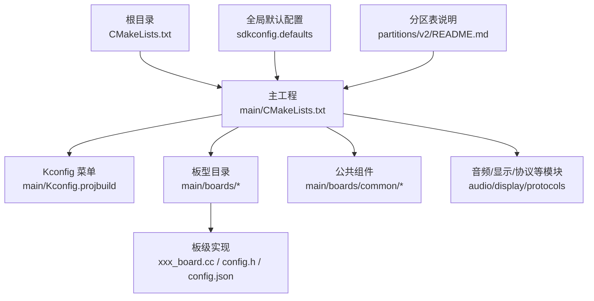
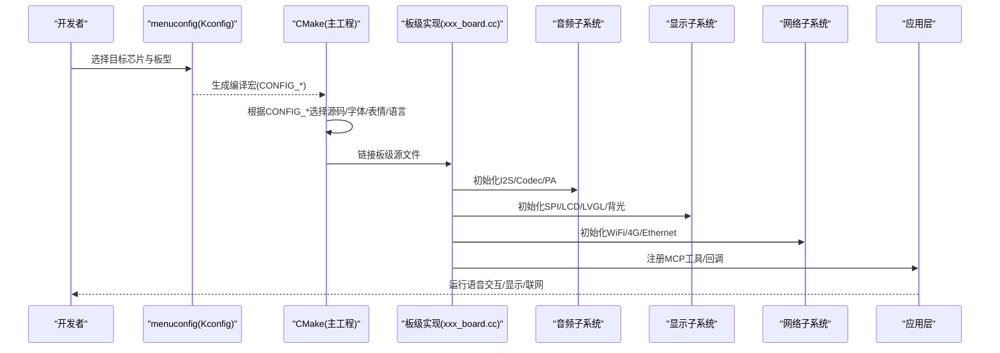
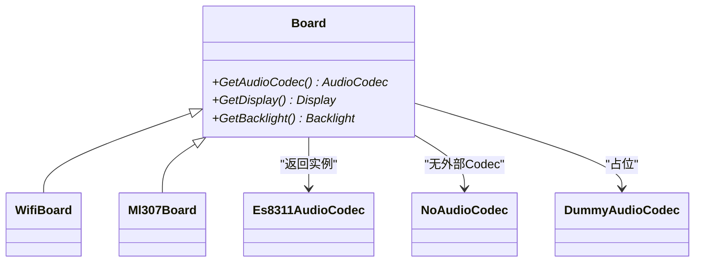
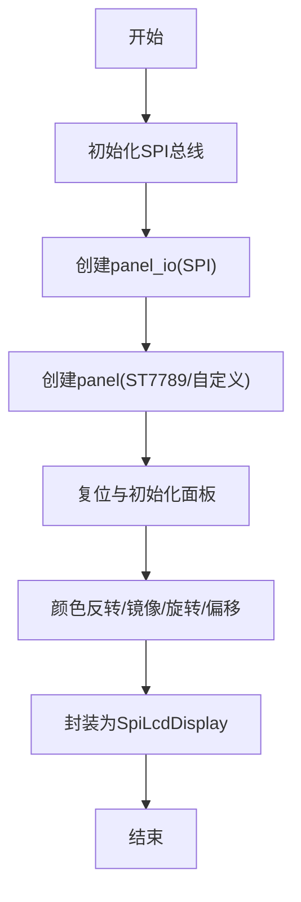
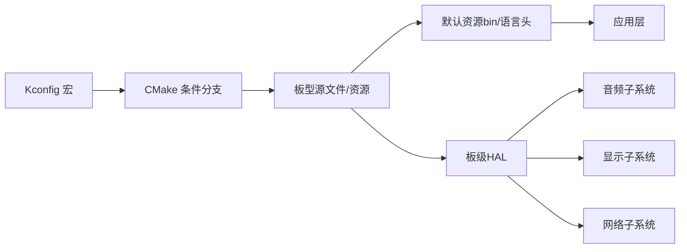

# 板级适配开发指南

<cite>
**本文引用的文件**   
- [README.md](file://README.md)
- [custom-board.md](file://docs/custom-board.md)
- [CMakeLists.txt](file://CMakeLists.txt)
- [main/CMakeLists.txt](file://main/CMakeLists.txt)
- [main/Kconfig.projbuild](file://main/Kconfig.projbuild)
- [sdkconfig.defaults](file://sdkconfig.defaults)
- [partitions/v2/README.md](file://partitions/v2/README.md)
</cite>

## 目录
1. [引言](#引言)
2. [项目结构](#项目结构)
3. [核心组件](#核心组件)
4. [架构总览](#架构总览)
5. [详细组件分析](#详细组件分析)
6. [依赖关系分析](#依赖关系分析)
7. [性能与功耗调优](#性能与功耗调优)
8. [故障排查指南](#故障排查指南)
9. [结论](#结论)
10. [附录：标准化接入流程与验收标准](#附录标准化接入流程与验收标准)

## 引言
本指南面向新硬件厂商与集成工程师，提供从硬件选型到软件适配的完整流程，覆盖配置结构、构建系统、分区表、音频编解码器、显示驱动、网络模块、调试与性能优化，以及标准化接入与验收要求。读者可据此快速完成一款新ESP32系列开发板的板级适配并稳定交付。

## 项目结构
本项目采用“按板型目录 + 公共组件”的组织方式：
- 每个板型位于 main/boards/<vendor>/<board>/ 或 main/boards/<board>/
- 每个板型包含：
  - xxx_board.cc：板级初始化与胶水代码
  - config.h：引脚定义、音频参数、显示参数等
  - config.json：目标芯片、固件名、sdkconfig追加项
  - README.md：板卡说明与注意事项
- 公共能力位于 main/boards/common/（如按钮、背光、电源管理、网络基类、I2C设备封装等）
- 顶层 CMakeLists.txt 引入 ESP-IDF 工程模板；main/CMakeLists.txt 负责根据 Kconfig 选择具体板型源文件、字体与表情集、语言资源、默认资源打包与烧录等
- sdkconfig.defaults 提供全局默认配置（分区表、LVGL、内存与网络优化等）
- partitions/v2 提供 v2 分区表说明与不同 Flash 容量布局

图表来源
- [CMakeLists.txt:1-14](file://CMakeLists.txt#L1-L14)
- [main/CMakeLists.txt:1-120](file://main/CMakeLists.txt#L1-L120)
- [main/Kconfig.projbuild:146-210](file://main/Kconfig.projbuild#L146-L210)
- [sdkconfig.defaults:14-20](file://sdkconfig.defaults#L14-L20)
- [partitions/v2/README.md:1-40](file://partitions/v2/README.md#L1-L40)

章节来源
- [README.md:120-130](file://README.md#L120-L130)
- [custom-board.md:11-20](file://docs/custom-board.md#L11-L20)
- [main/CMakeLists.txt:1-120](file://main/CMakeLists.txt#L1-L120)
- [main/Kconfig.projbuild:146-210](file://main/Kconfig.projbuild#L146-L210)
- [sdkconfig.defaults:14-20](file://sdkconfig.defaults#L14-L20)
- [partitions/v2/README.md:1-40](file://partitions/v2/README.md#L1-L40)

## 核心组件
- 板级抽象层（Board 基类族）
  - WifiBoard / Ml307Board / DualNetworkBoard / RndisBoard 等，屏蔽网络差异，统一对外接口
- 音频子系统
  - 编解码器：Es8311AudioCodec、Es8374AudioCodec、Es8388AudioCodec、Es8389AudioCodec、BoxAudioCodec、NoAudioCodec、DummyAudioCodec
  - 唤醒词与降噪：AFE Wake Word、Custom Wake Word、ESP Wake Word；可选降噪与AEC
- 显示子系统
  - LVGL 显示、LCD/OLED 驱动、表情动画、字体与图标集
- 通信协议
  - WebSocket、MQTT+UDP 双通道
- 资源与分区
  - v2 分区表新增 assets 分区，支持在线下载主题、字体、音效、表情、唤醒词模型等动态资源

章节来源
- [custom-board.md:398-446](file://docs/custom-board.md#L398-L446)
- [main/CMakeLists.txt:1-40](file://main/CMakeLists.txt#L1-L40)
- [partitions/v2/README.md:1-40](file://partitions/v2/README.md#L1-L40)

## 架构总览
下图展示新硬件适配的关键路径：Kconfig 选择板型 → CMake 收集源码与资源 → 板级初始化 → 音频/显示/网络启动 → 应用运行。

图表来源
- [main/Kconfig.projbuild:146-210](file://main/Kconfig.projbuild#L146-L210)
- [main/CMakeLists.txt:869-880](file://main/CMakeLists.txt#L869-L880)
- [custom-board.md:136-279](file://docs/custom-board.md#L136-L279)

## 详细组件分析

### 配置文件结构：config.h 与 config.json
- config.h（引脚与板级参数）
  - 音频：采样率、I2S引脚、Codec I2C地址、PA引脚
  - 按键/LED：GPIO映射
  - 显示：SPI引脚、分辨率、镜像/翻转、偏移、背光引脚与极性
- config.json（构建与发布）
  - target：目标芯片（esp32/esp32s3/esp32c3/esp32c6/esp32p4 等）
  - builds[].name：固件包名
  - builds[].sdkconfig_append：合并到默认配置的宏（Flash大小、分区表、语言、唤醒词开关等）

章节来源
- [custom-board.md:34-134](file://docs/custom-board.md#L34-L134)

### 板级适配步骤（从零到一）
1. 创建板型目录与基础文件
   - 在 main/boards/<vendor>/<board>/ 下新建 xxx_board.cc、config.h、config.json、README.md
2. 编写 config.h
   - 定义音频、显示、按键、背光等所有硬件相关宏
3. 编写 config.json
   - 指定 target、name 与 sdkconfig_append（Flash大小、分区表、语言、功能开关）
4. 实现板级类
   - 继承自 WifiBoard/Ml307Board/DualNetworkBoard/RndisBoard
   - 实现 GetAudioCodec()/GetDisplay()/GetBacklight() 等虚函数
   - 初始化 I2C/SPI/按钮/工具，并在构造函数中调用
   - 使用 DECLARE_BOARD(ClassName) 注册
5. 接入构建系统
   - 在 main/Kconfig.projbuild 的 BOARD_TYPE 列表中添加条目（depends on 对应 IDF_TARGET）
   - 在 main/CMakeLists.txt 的 if/elseif 链中添加分支，设置 MANUFACTURER/BOARD_TYPE、字体与表情集
6. 构建与烧录
   - idf.py menuconfig/build/flash/monitor
   - 或使用 scripts/release.py 自动读取 config.json 构建打包

图表来源
- [custom-board.md:22-134](file://docs/custom-board.md#L22-L134)
- [custom-board.md:281-374](file://docs/custom-board.md#L281-L374)

章节来源
- [custom-board.md:22-134](file://docs/custom-board.md#L22-L134)
- [custom-board.md:281-374](file://docs/custom-board.md#L281-L374)

### 音频编解码器集成
- 支持的编解码器
  - Es8311AudioCodec、Es8374AudioCodec、Es8388AudioCodec、Es8389AudioCodec、BoxAudioCodec、NoAudioCodec、DummyAudioCodec
- 集成要点
  - 在板级类中返回对应 Codec 实例
  - 正确配置 I2S 引脚、采样率、PA 控制引脚与 Codec I2C 地址
  - 如需降噪/AEC，启用 USE_AUDIO_PROCESSOR 与 USE_DEVICE_AEC（需硬件参考路径与声学隔离）

图表来源
- [custom-board.md:398-446](file://docs/custom-board.md#L398-L446)
- [main/CMakeLists.txt:1-12](file://main/CMakeLists.txt#L1-L12)

章节来源
- [custom-board.md:398-446](file://docs/custom-board.md#L398-L446)
- [main/CMakeLists.txt:1-12](file://main/CMakeLists.txt#L1-L12)

### 显示驱动适配
- 支持 LCD 家族：ST7789、ILI9341、SH8601 等
- 关键参数
  - SPI 引脚、DC/CS、分辨率、镜像/翻转、偏移、背光 PWM 与极性
- 初始化流程
  - 初始化 SPI 总线 → 创建 panel_io → 创建 panel（如 ST7789）→ 复位/初始化 → 颜色反转/镜像/旋转 → 包装为 SpiLcdDisplay 供上层使用

图表来源
- [custom-board.md:206-236](file://docs/custom-board.md#L206-L236)

章节来源
- [custom-board.md:206-236](file://docs/custom-board.md#L206-L236)

### 网络模块配置
- 网络类型
  - WiFi（默认）、以太网（ESP32-P4 示例）、4G（ML307/NT26）、RNDIS（USB 网络）
- 选择方式
  - Kconfig 中 XIAOZHI_NETWORK_TYPE 选择网络类型，再选择对应 BOARD_TYPE
  - Ethernet 需要配置 PHY 型号、MDC/MDIO、PHY 地址与复位引脚
- 典型基类
  - WifiBoard、Ml307Board、Nt26Board、DualNetworkBoard、RndisBoard

章节来源
- [main/Kconfig.projbuild:120-145](file://main/Kconfig.projbuild#L120-L145)
- [main/Kconfig.projbuild:629-674](file://main/Kconfig.projbuild#L629-L674)
- [custom-board.md:427-433](file://docs/custom-board.md#L427-L433)

### 构建系统与动态编译（CMakeLists.txt）
- 顶层 CMakeLists.txt
  - 引入 ESP-IDF 工程模板、最小化构建、版本号
- 主工程 CMakeLists.txt
  - 根据 CONFIG_BOARD_TYPE 设置 MANUFACTURER/BOARD_TYPE、内置字体与表情集
  - 根据 MANUFACTURER 决定扫描 boards/${MANUFACTURER}/${BOARD_TYPE}/*.cc
  - 根据 Kconfig 选择音频处理器、唤醒词实现、语言资源、摄像头特性等
  - 自动生成语言头文件、打包默认资源到 assets 分区（v2）

章节来源
- [CMakeLists.txt:1-14](file://CMakeLists.txt#L1-L14)
- [main/CMakeLists.txt:869-880](file://main/CMakeLists.txt#L869-L880)
- [main/CMakeLists.txt:882-904](file://main/CMakeLists.txt#L882-L904)
- [main/CMakeLists.txt:978-1004](file://main/CMakeLists.txt#L978-L1004)
- [main/CMakeLists.txt:1286-1317](file://main/CMakeLists.txt#L1286-L1317)

### 分区表设置（v2）
- 主要变化
  - 新增 assets 分区用于动态内容（主题、字体、音效、表情、唤醒词模型等）
  - 应用分区缩小，assets 分区增大，支持 OTA 更新资源
- 常见布局
  - 8MB/16MB/32MB Flash 各有推荐布局；ESP32-C3 因 mmap 限制 assets 较小
- 选择方法
  - 通过 sdkconfig.defaults 或 config.json 的 sdkconfig_append 指定 partitions/v2/*.csv

章节来源
- [partitions/v2/README.md:1-40](file://partitions/v2/README.md#L1-L40)
- [partitions/v2/README.md:44-76](file://partitions/v2/README.md#L44-L76)
- [sdkconfig.defaults:14-16](file://sdkconfig.defaults#L14-L16)
- [custom-board.md:114-134](file://docs/custom-board.md#L114-L134)

### SDK 配置选项（Kconfig）
- 网络类型与板型选择
  - XIAOZHI_NETWORK_TYPE、BOARD_TYPE、ETH_BOARD_TYPE
- 显示风格与多行消息
  - DISPLAY_STYLE、USE_MULTILINE_CHAT_MESSAGE
- 唤醒词与音频处理
  - WAKE_WORD_TYPE、USE_AUDIO_PROCESSOR、USE_DEVICE_AEC、USE_SERVER_AEC、AUDIO_DEBUGGER
- WiFi 配网方式
  - USE_HOTSPOT_WIFI_PROVISIONING、USE_ACOUSTIC_WIFI_PROVISIONING、USE_ESP_BLUFI_WIFI_PROVISIONING
- 摄像头（非 ESP32）
  - JPEG 输入/硬件编解码、图像旋转、端序交换、调试模式等

章节来源
- [main/Kconfig.projbuild:120-145](file://main/Kconfig.projbuild#L120-L145)
- [main/Kconfig.projbuild:816-845](file://main/Kconfig.projbuild#L816-L845)
- [main/Kconfig.projbuild:846-916](file://main/Kconfig.projbuild#L846-L916)
- [main/Kconfig.projbuild:951-972](file://main/Kconfig.projbuild#L951-L972)
- [main/Kconfig.projbuild:987-1063](file://main/Kconfig.projbuild#L987-L1063)

## 依赖关系分析
- 构建期依赖
  - Kconfig 宏 → CMake 条件分支 → 选择板型源文件/字体/表情/语言
  - 资源生成：语言头文件、默认资源 bin、表情/动效资源
- 运行期依赖
  - 板级类 → 音频/显示/网络子系统 → 应用层（状态机、协议栈、MCP 工具）

图表来源
- [main/CMakeLists.txt:869-880](file://main/CMakeLists.txt#L869-L880)
- [main/CMakeLists.txt:978-1004](file://main/CMakeLists.txt#L978-L1004)
- [main/CMakeLists.txt:1286-1317](file://main/CMakeLists.txt#L1286-L1317)

章节来源
- [main/CMakeLists.txt:869-880](file://main/CMakeLists.txt#L869-L880)
- [main/CMakeLists.txt:978-1004](file://main/CMakeLists.txt#L978-L1004)
- [main/CMakeLists.txt:1286-1317](file://main/CMakeLists.txt#L1286-L1317)

## 性能与功耗调优
- 内存与堆栈
  - 调整主任务栈大小、关闭不必要的 LVGL 部件以节省 Flash/PSRAM
- 网络与加密
  - 关闭不需要的证书保留、禁用 SSL 重协商以降低握手开销
- 音频链路
  - 合理选择采样率与是否启用降噪/AEC；确保 PA 控制与 I2S 时序正确
- 显示刷新
  - 选择合适的像素格式与帧缓冲策略，避免频繁全屏刷新
- 电源管理
  - 结合 PMIC/充电芯片与睡眠定时器，降低待机功耗

章节来源
- [sdkconfig.defaults:18-41](file://sdkconfig.defaults#L18-L41)
- [sdkconfig.defaults:44-78](file://sdkconfig.defaults#L44-L78)

## 故障排查指南
- 显示异常
  - 检查 SPI 配置、镜像/翻转、颜色反转与背光极性
- 无音频
  - 核对 I2S 接线、PA 使能引脚、Codec I2C 地址与寄存器初始化
- 无法连接 WiFi
  - 确认配网方式与凭据；必要时切换热点/声学/Blufi 方式
- 无法到达服务器
  - 校验 WebSocket/MQTT 端点与证书；查看日志定位握手失败原因
- 资源未加载
  - 确认 v2 分区表已启用且 assets 分区存在；检查默认资源生成与烧录

章节来源
- [custom-board.md:462-468](file://docs/custom-board.md#L462-L468)
- [partitions/v2/README.md:94-107](file://partitions/v2/README.md#L94-L107)

## 结论
通过遵循本指南的流程与规范，可在保证兼容性与可维护性的前提下，高效完成新硬件的板级适配。建议优先复用现有板型与公共组件，逐步点亮显示、音频与网络，再进行端到端联调与性能优化。

## 附录：标准化接入流程与验收标准
- 标准化接入流程
  - 硬件评审：确认芯片平台、外设资源、电源与射频方案
  - 软件基线：基于相似板型复制，完善 config.h/config.json/板级类
  - 构建验证：Kconfig 与 CMake 分支正确，资源生成与烧录成功
  - 功能验证：音频采集/播放、显示输出、网络连通、协议交互、MCP 工具
  - 稳定性与压力：长时间运行、弱网/断电恢复、OTA 升级
  - 文档交付：README、原理图、BOM、引脚分配、已知问题
- 验收标准
  - 构建产物唯一性：固件名与分区表匹配，OTA 通道独立
  - 资源完整性：assets 分区可用，默认资源可正常加载
  - 性能指标：首呼时延、丢包率、CPU/内存占用符合预期
  - 兼容性：支持至少一种配网方式与一种通信协议（WebSocket 或 MQTT+UDP）
  - 可维护性：代码风格、注释与变更可追溯

章节来源
- [custom-board.md:5-10](file://docs/custom-board.md#L5-L10)
- [README.md:16-21](file://README.md#L16-L21)