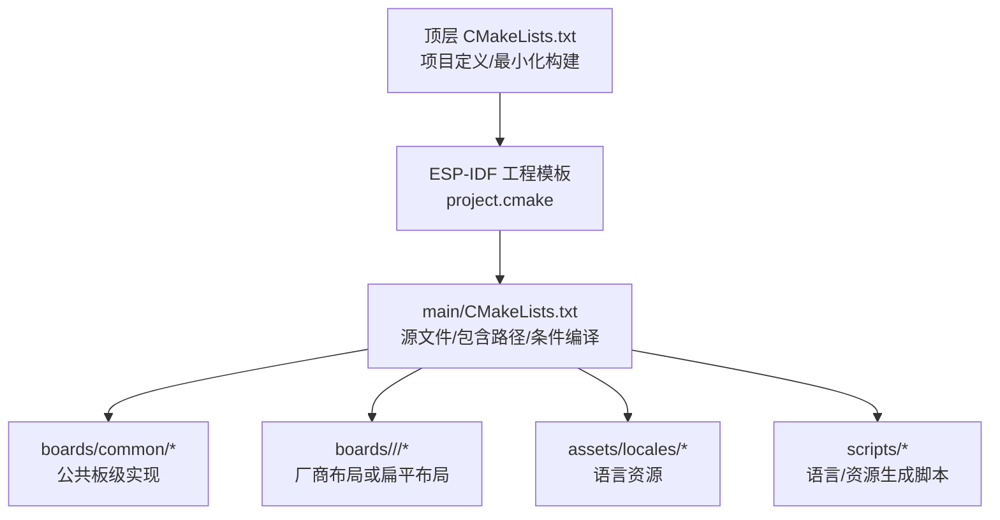
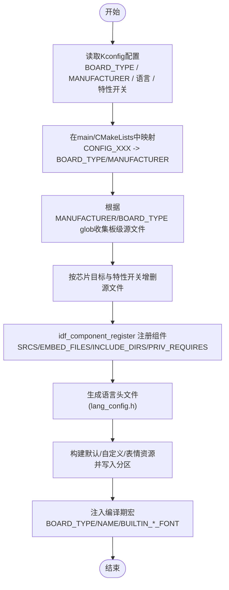
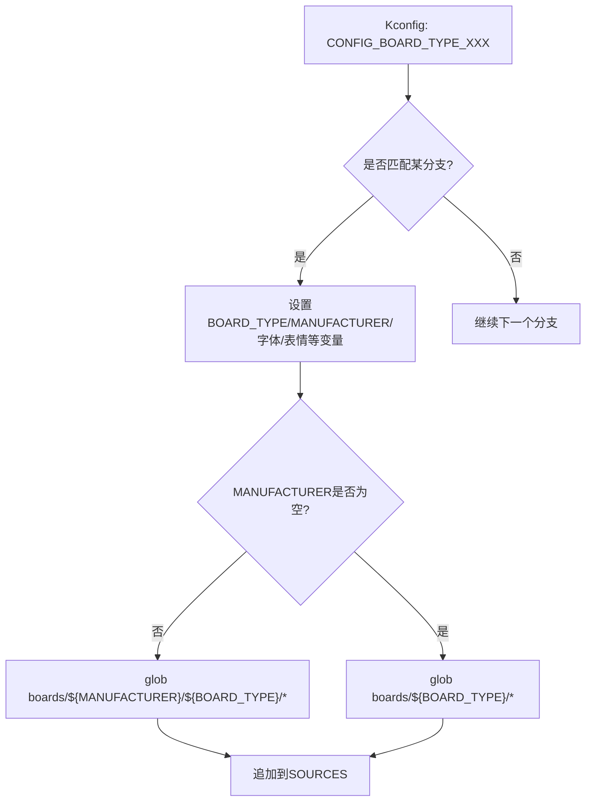
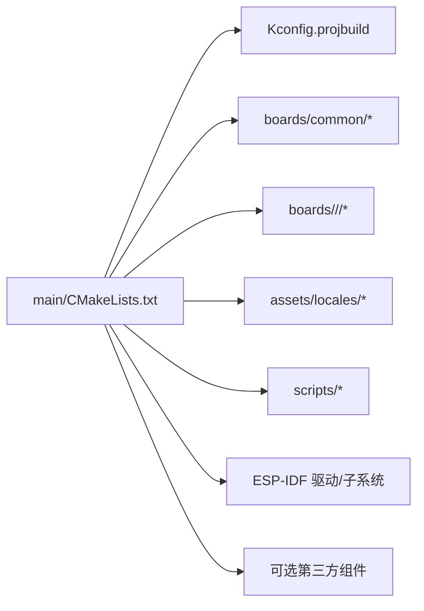

# CMake构建系统

<cite>
**本文引用的文件**   
- [CMakeLists.txt](file://CMakeLists.txt)
- [main/CMakeLists.txt](file://main/CMakeLists.txt)
- [main/Kconfig.projbuild](file://main/Kconfig.projbuild)
- [docs/custom-board.md](file://docs/custom-board.md)
</cite>

## 目录
1. [简介](#简介)
2. [项目结构](#项目结构)
3. [核心组件](#核心组件)
4. [架构总览](#架构总览)
5. [详细组件分析](#详细组件分析)
6. [依赖关系分析](#依赖关系分析)
7. [性能与体积优化](#性能与体积优化)
8. [故障排查指南](#故障排查指南)
9. [结论](#结论)
10. [附录：自定义板型适配最佳实践](#附录自定义板型适配最佳实践)

## 简介
本文件面向ESP-IDF工程中的CMake构建系统，聚焦以下目标：
- 解释顶层CMakeLists.txt的项目定义、工具链/编译选项与最小化构建策略。
- 深入解析main/CMakeLists.txt的动态编译机制：如何根据CONFIG_BOARD_TYPE选择目标板型源代码、动态添加组件文件、条件编译控制。
- 梳理BOARD_TYPE映射逻辑：从Kconfig配置开关到具体板级目录的映射关系（覆盖70+种板型）。
- 说明INCLUDE_DIRS路径管理、源文件分组策略、链接库依赖配置。
- 提供自定义板型适配的CMake配置示例与最佳实践。

## 项目结构
本项目采用“应用层 + 多板型支持”的组织方式：
- 顶层CMakeLists.txt负责引入ESP-IDF工程模板、设置最小化构建、声明项目名称与版本。
- main/CMakeLists.txt负责：
  - 定义通用源文件集合与包含路径；
  - 根据Kconfig的BOARD_TYPE将配置项映射为字符串BOARD_TYPE/MANUFACTURER；
  - 使用glob动态收集对应板型目录下的*.cc/*.c源文件；
  - 按芯片目标与功能开关动态增删源文件；
  - 注册组件、嵌入资源、生成语言头文件、打包默认表情/字体等资产；
  - 将BOARD_TYPE/名称及内置字体等宏注入编译期定义。

图表来源
- [CMakeLists.txt:1-14](file://CMakeLists.txt#L1-L14)
- [main/CMakeLists.txt:1-42](file://main/CMakeLists.txt#L1-L42)

章节来源
- [CMakeLists.txt:1-14](file://CMakeLists.txt#L1-L14)
- [main/CMakeLists.txt:1-42](file://main/CMakeLists.txt#L1-L42)

## 核心组件
- 顶层CMakeLists.txt
  - 设置最低CMake版本、关闭特定警告、引入ESP-IDF工程模板、启用最小化构建、声明项目名与版本。
- main/CMakeLists.txt
  - 源文件清单与包含路径；
  - Kconfig到BOARD_TYPE/MANUFACTURER的映射；
  - 基于MANUFACTURER/BOARD_TYPE的glob动态收集板级源文件；
  - 按芯片目标与特性开关动态增减源文件；
  - 组件注册、私有依赖、嵌入资源、语言头生成、默认表情/字体资产打包；
  - 将BOARD_TYPE/名称与内置字体等宏注入编译期定义。

章节来源
- [CMakeLists.txt:1-14](file://CMakeLists.txt#L1-L14)
- [main/CMakeLists.txt:1-42](file://main/CMakeLists.txt#L1-L42)

## 架构总览
下图展示了从Kconfig配置到最终编译产物之间的关键流程：

图表来源
- [main/CMakeLists.txt:89-880](file://main/CMakeLists.txt#L89-L880)
- [main/CMakeLists.txt:1047-1081](file://main/CMakeLists.txt#L1047-L1081)
- [main/CMakeLists.txt:1084-1098](file://main/CMakeLists.txt#L1084-L1098)
- [main/CMakeLists.txt:1178-1318](file://main/CMakeLists.txt#L1178-L1318)

## 详细组件分析

### 顶层CMakeLists.txt：项目定义与最小化构建
- 作用
  - 指定最低CMake版本；
  - 关闭特定编译器告警；
  - 引入ESP-IDF工程模板；
  - 开启最小化构建以仅包含必要组件；
  - 声明项目名与版本。
- 影响
  - 通过最小化构建减少不必要的组件参与编译，缩短构建时间并降低二进制体积。

章节来源
- [CMakeLists.txt:1-14](file://CMakeLists.txt#L1-L14)

### main/CMakeLists.txt：动态编译机制与源文件组织
- 通用源文件与包含路径
  - 集中声明音频、显示、协议、LED、系统信息等通用源文件；
  - 维护INCLUDE_DIRS列表，便于后续统一注入。
- 公共板级模块
  - 预置common目录下的公共实现（网络、电源、按键、背光、I2C设备、睡眠计时器等）；
  - 根据以太网开关动态加入ethernet_board.cc。
- 条件编译与平台相关源文件
  - 根据USE_AUDIO_PROCESSOR选择音频处理器实现；
  - 根据芯片目标选择唤醒词实现；
  - 根据BLUFI开关加入blufi.cpp；
  - 针对ESP32S3/P4加入esp_video/rndis_board；
  - 针对ESP32S3加入esp32_camera；
  - 针对ESP32目标移除不兼容的编解码器与网络模块。
- 组件注册与依赖
  - idf_component_register注册组件，传入SRCS/EMBED_FILES/INCLUDE_DIRS/PRIV_REQUIRES；
  - 部分板型需要额外私有依赖（如m5stack__m5pm1、触摸传感器组件）。
- 编译期宏注入
  - 将BOARD_TYPE/BOARD_NAME以及BUILTIN_TEXT_FONT/BUILTIN_ICON_FONT作为PRIVATE定义注入。

章节来源
- [main/CMakeLists.txt:1-42](file://main/CMakeLists.txt#L1-L42)
- [main/CMakeLists.txt:44-67](file://main/CMakeLists.txt#L44-L67)
- [main/CMakeLists.txt:882-933](file://main/CMakeLists.txt#L882-L933)
- [main/CMakeLists.txt:895-933](file://main/CMakeLists.txt#L895-L933)
- [main/CMakeLists.txt:1008-1032](file://main/CMakeLists.txt#L1008-L1032)
- [main/CMakeLists.txt:1034-1071](file://main/CMakeLists.txt#L1034-L1071)
- [main/CMakeLists.txt:1073-1081](file://main/CMakeLists.txt#L1073-L1081)

### BOARD_TYPE映射逻辑：从Kconfig到目录
- 映射入口
  - 在main/CMakeLists.txt中，大量if/elseif分支将CONFIG_BOARD_TYPE_XXX映射为字符串BOARD_TYPE，并可同时设置MANUFACTURER、BUILTIN_TEXT_FONT、BUILTIN_ICON_FONT、DEFAULT_EMOJI_COLLECTION、EMOTE_RESOLUTION等。
- 目录定位规则
  - 若设置了MANUFACTURER，则glob主目录为boards/${MANUFACTURER}/${BOARD_TYPE}；
  - 否则回退到boards/${BOARD_TYPE}；
  - 匹配*.cc与*.c文件并追加到SOURCES。
- 典型模式
  - 多数板型直接设置BOARD_TYPE；
  - 部分板型同时设置MANUFACTURER（例如waveshare系列），体现“厂商布局”；
  - 某些板型会调整字体与表情集，以适配屏幕分辨率与UI风格。

图表来源
- [main/CMakeLists.txt:89-867](file://main/CMakeLists.txt#L89-L867)
- [main/CMakeLists.txt:869-880](file://main/CMakeLists.txt#L869-L880)

章节来源
- [main/CMakeLists.txt:89-867](file://main/CMakeLists.txt#L89-L867)
- [main/CMakeLists.txt:869-880](file://main/CMakeLists.txt#L869-L880)

### Kconfig配置项与过滤
- 网络类型选择
  - XIAOZHI_NETWORK_WIFI / XIAOZHI_NETWORK_ETHERNET决定BOARD_TYPE菜单的可见性；
  - 以太网模式下提供ETH_BOARD_TYPE子菜单。
- 板型选择
  - BOARD_TYPE为choice，内部包含70+个具体板型选项，每个选项可附加depends on IDF_TARGET_XXX进行芯片目标过滤。
- 其他相关配置
  - 语言选择、OLED/LCD类型、特定板型的细分选项等。

章节来源
- [main/Kconfig.projbuild:120-145](file://main/Kconfig.projbuild#L120-L145)
- [main/Kconfig.projbuild:146-615](file://main/Kconfig.projbuild#L146-L615)
- [main/Kconfig.projbuild:617-627](file://main/Kconfig.projbuild#L617-L627)

### INCLUDE_DIRS路径管理
- 初始INCLUDE_DIRS包含应用根目录、display、lvgl_display及其子目录、audio、demuxer、protocols等；
- 随后将boards/common加入INCLUDE_DIRS，确保板级公共头文件可被引用；
- 所有包含路径最终随idf_component_register一并注入。

章节来源
- [main/CMakeLists.txt:42](file://main/CMakeLists.txt#L42)
- [main/CMakeLists.txt:67](file://main/CMakeLists.txt#L67)
- [main/CMakeLists.txt:1047-1050](file://main/CMakeLists.txt#L1047-L1050)

### 源文件分组策略
- 通用模块：audio、display、protocols、led、system_info等；
- 公共板级：boards/common下跨板复用的实现；
- 板级专属：按BOARD_TYPE/glob收集的*.cc/*.c；
- 平台相关：按芯片目标与特性开关选择性加入。

章节来源
- [main/CMakeLists.txt:1-42](file://main/CMakeLists.txt#L1-L42)
- [main/CMakeLists.txt:44-67](file://main/CMakeLists.txt#L44-L67)
- [main/CMakeLists.txt:882-933](file://main/CMakeLists.txt#L882-L933)
- [main/CMakeLists.txt:1008-1032](file://main/CMakeLists.txt#L1008-L1032)

### 链接库依赖配置
- PRIV_REQUIRES包含ESP-IDF驱动与应用更新、文件系统、蓝牙、控制台、安全启动等基础组件；
- 部分板型需额外私有依赖（如M5Stack电源管理、触摸传感器组件），通过MAIN_PRIV_REQUIRES_EXTRA动态追加。

章节来源
- [main/CMakeLists.txt:1047-1071](file://main/CMakeLists.txt#L1047-L1071)

### 资源与语言头生成
- 语言选择：根据LANGUAGE_*选择LANG_DIR，收集对应语言音频与json；
- 缺失回退：非en-US时，自动合并en-US中缺失的音频文件；
- 语言头生成：调用gen_lang.py生成lang_config.h，并创建依赖目标保证顺序；
- 默认表情/字体资产：根据BUILTIN_TEXT_FONT、DEFAULT_EMOJI_COLLECTION、EMOTE_RESOLUTION等参数，调用脚本构建assets.bin并刷入分区。

章节来源
- [main/CMakeLists.txt:899-976](file://main/CMakeLists.txt#L899-L976)
- [main/CMakeLists.txt:978-1004](file://main/CMakeLists.txt#L978-L1004)
- [main/CMakeLists.txt:1084-1098](file://main/CMakeLists.txt#L1084-L1098)
- [main/CMakeLists.txt:1178-1227](file://main/CMakeLists.txt#L1178-L1227)
- [main/CMakeLists.txt:1286-1318](file://main/CMakeLists.txt#L1286-L1318)

## 依赖关系分析
- 组件对外依赖
  - ESP-IDF驱动与子系统：gpio、uart、spi、i2c、i2s、jpeg、ppa、app_update、spi_flash、console、efuse、bt、fatfs等；
  - 可选第三方组件：m5stack__m5pm1、espressif__touch_slider_sensor、espressif__touch_button_sensor等。
- 内部耦合
  - main/CMakeLists.txt对Kconfig高度依赖，通过配置项控制源文件与资源生成；
  - 板级代码通过DECLARE_BOARD导出工厂函数，由框架在运行时实例化。

图表来源
- [main/CMakeLists.txt:1047-1071](file://main/CMakeLists.txt#L1047-L1071)
- [main/CMakeLists.txt:869-880](file://main/CMakeLists.txt#L869-L880)
- [main/CMakeLists.txt:899-976](file://main/CMakeLists.txt#L899-L976)

章节来源
- [main/CMakeLists.txt:1047-1071](file://main/CMakeLists.txt#L1047-L1071)
- [main/CMakeLists.txt:869-880](file://main/CMakeLists.txt#L869-L880)

## 性能与体积优化
- 最小化构建：顶层启用MINIMAL_BUILD，避免无关组件参与编译。
- 条件编译：按芯片目标与特性开关剔除不必要源文件，减少二进制体积。
- 资源按需生成：仅生成当前语言与所需表情/字体资源，避免冗余。
- 建议
  - 新增板型时尽量复用common模块，减少重复实现；
  - 合理设置BUILTIN_TEXT_FONT与DEFAULT_EMOJI_COLLECTION，避免过大资源；
  - 仅在必要时启用BLUFI/以太网/摄像头等特性。

[本节为通用指导，无需列出具体文件来源]

## 故障排查指南
- 未找到assets分区
  - 现象：提示未找到assets分区，使用v1分区表。
  - 处理：确认分区表版本与配置项FLASH_DEFAULT_ASSETS/FLASH_CUSTOM_ASSETS/FLASH_EXPRESSION_ASSETS/FLASH_NONE_ASSETS的选择。
- 下载资源失败
  - 现象：下载emoji或外部资源时报错。
  - 处理：检查网络连接与URL有效性，或改用本地文件路径。
- 语言头未生成
  - 现象：缺少lang_config.h导致编译失败。
  - 处理：确认语言选择正确且gen_lang.py可用，清理后重新配置。
- 板型源文件未被收集
  - 现象：编译找不到板级实现。
  - 处理：核对Kconfig中选择的BOARD_TYPE与main/CMakeLists.txt中的映射分支一致，确认MANUFACTURER与目录结构符合预期。

章节来源
- [main/CMakeLists.txt:1286-1318](file://main/CMakeLists.txt#L1286-L1318)
- [main/CMakeLists.txt:1140-1175](file://main/CMakeLists.txt#L1140-L1175)
- [main/CMakeLists.txt:1084-1098](file://main/CMakeLists.txt#L1084-L1098)
- [main/CMakeLists.txt:869-880](file://main/CMakeLists.txt#L869-L880)

## 结论
该CMake构建系统通过Kconfig驱动的动态映射与glob收集，实现了“一套源码、多板型支持”的目标。顶层最小化构建与精细的条件编译进一步保障了构建效率与产物体积。通过合理的INCLUDE_DIRS管理、源文件分组与依赖声明，系统在可扩展性与可维护性之间取得了良好平衡。

[本节为总结性内容，无需列出具体文件来源]

## 附录：自定义板型适配最佳实践
- 目录布局
  - 单一板型：放在main/boards/<board_type>/，并在Kconfig中添加新选项，在main/CMakeLists.txt中增加映射分支，设置BOARD_TYPE及相关变量。
  - 厂商多板型：放在main/boards/<manufacturer>/<board_type>/，同时在映射分支中设置MANUFACTURER与BOARD_TYPE。
- 必要文件
  - 板级实现文件（*.cc/*.c），继承公共基类（如WifiBoard）并通过DECLARE_BOARD导出工厂函数。
  - config.h定义引脚、屏参、音频参数等。
  - README与配置文件（可选）。
- 构建集成要点
  - 在Kconfig中为新板型添加choice项，并根据IDF_TARGET限制可见性；
  - 在main/CMakeLists.txt中增加映射分支，设置BOARD_TYPE/MANUFACTURER/字体/表情等；
  - 如有特殊依赖，通过MAIN_PRIV_REQUIRES_EXTRA追加；
  - 如需定制资源，参考现有逻辑设置DEFAULT_ASSETS_EXTRA_FILES或EMOTE_EXTERNAL_PATH。
- 参考文档
  - 官方自定义板型指南提供了完整的步骤与示例。

章节来源
- [docs/custom-board.md:391-433](file://docs/custom-board.md#L391-L433)