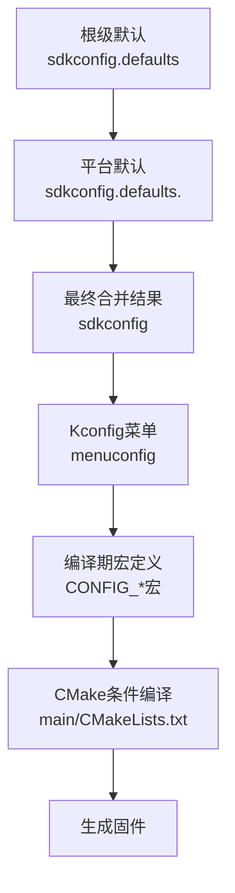
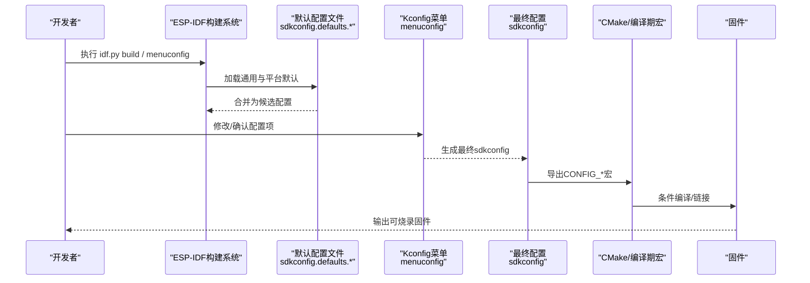
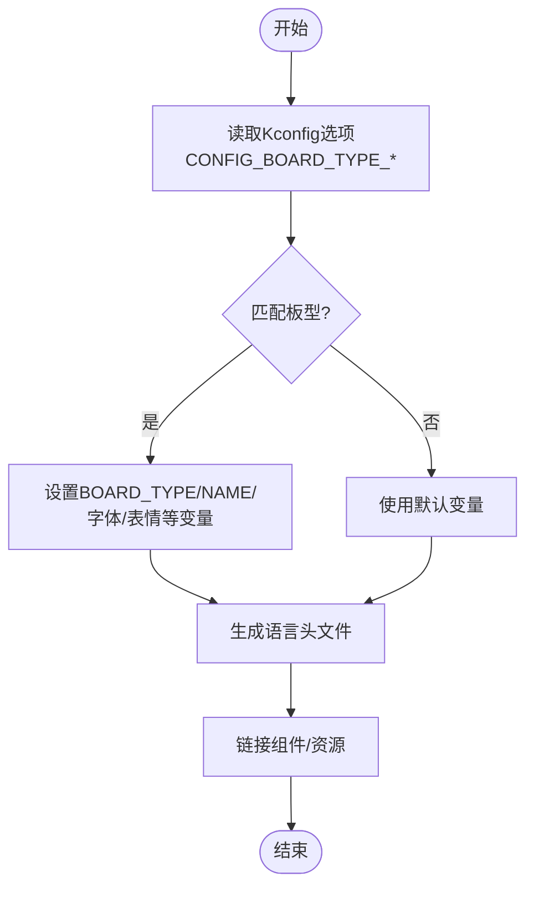
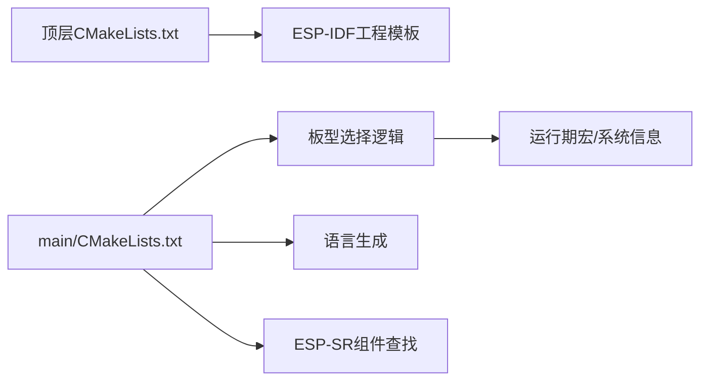

# SDK配置管理

<cite>
**本文引用的文件**   
- [sdkconfig.defaults](file://sdkconfig.defaults)
- [sdkconfig.defaults.esp32s3](file://sdkconfig.defaults.esp32s3)
- [sdkconfig.defaults.esp32c3](file://sdkconfig.defaults.esp32c3)
- [sdkconfig.defaults.esp32p4](file://sdkconfig.defaults.esp32p4)
- [sdkconfig.defaults.esp32](file://sdkconfig.defaults.esp32)
- [sdkconfig.defaults.esp32c5](file://sdkconfig.defaults.esp32c5)
- [sdkconfig.defaults.esp32c6](file://sdkconfig.defaults.esp32c6)
- [main/CMakeLists.txt](file://main/CMakeLists.txt)
- [CMakeLists.txt](file://CMakeLists.txt)
- [docs/custom-board.md](file://docs/custom-board.md)
- [main/system_info.cc](file://main/system_info.cc)
- [main/boards/common/board.cc](file://main/boards/common/board.cc)
</cite>

## 目录
1. [简介](#简介)
2. [项目结构](#项目结构)
3. [核心组件](#核心组件)
4. [架构总览](#架构总览)
5. [详细组件分析](#详细组件分析)
6. [依赖关系分析](#依赖关系分析)
7. [性能考量](#性能考量)
8. [故障排查指南](#故障排查指南)
9. [结论](#结论)
10. [附录](#附录)

## 简介
本文件面向ESP-IDF工程中的SDK配置管理，围绕Kconfig菜单配置、默认值管理、平台特定配置展开，重点说明不同芯片平台的差异化默认配置（esp32s3、esp32c3、esp32p4等），并展示关键配置项：内存管理、网络栈、音频驱动、显示驱动的启用/禁用策略。同时给出配置优先级规则与批量配置、CI/CD集成方案，帮助读者在复杂多板型项目中稳定高效地管理构建配置。

## 项目结构
本项目采用“通用默认 + 平台覆盖”的配置组织方式：
- 根级通用默认：sdkconfig.defaults
- 平台特定默认：sdkconfig.defaults.<target>（如esp32s3、esp32c3、esp32p4）
- 构建系统：顶层CMakeLists.txt引入ESP-IDF工程模板；main/CMakeLists.txt根据Kconfig选项选择板级源文件与资源
- 文档与脚本：docs/custom-board.md提供基于config.json的自动化构建示例

图表来源
- [CMakeLists.txt:1-13](file://CMakeLists.txt#L1-L13)
- [main/CMakeLists.txt:1-40](file://main/CMakeLists.txt#L1-L40)

章节来源
- [CMakeLists.txt:1-13](file://CMakeLists.txt#L1-L13)
- [main/CMakeLists.txt:1-40](file://main/CMakeLists.txt#L1-L40)

## 核心组件
- Kconfig菜单配置：通过idf.py menuconfig进行交互式配置，所有配置项以CONFIG_*形式暴露给C/C++代码和CMake。
- 默认值管理：
  - sdkconfig.defaults：跨平台通用默认
  - sdkconfig.defaults.<target>：按目标芯片覆盖或补充默认值
- 平台特定配置：针对esp32s3、esp32c3、esp32p4等不同芯片的Flash大小、PSRAM、WiFi/LWIP、TTS模型、LVGL特性等进行差异化设置。
- 构建期选择：main/CMakeLists.txt依据Kconfig选项动态选择板级源码与字体/表情等资源。

章节来源
- [sdkconfig.defaults:1-79](file://sdkconfig.defaults#L1-L79)
- [sdkconfig.defaults.esp32s3:1-32](file://sdkconfig.defaults.esp32s3#L1-L32)
- [sdkconfig.defaults.esp32c3:1-15](file://sdkconfig.defaults.esp32c3#L1-L15)
- [sdkconfig.defaults.esp32p4:1-32](file://sdkconfig.defaults.esp32p4#L1-L32)
- [main/CMakeLists.txt:90-120](file://main/CMakeLists.txt#L90-L120)

## 架构总览
下图展示了从默认配置到最终固件生成的端到端流程，以及各层之间的覆盖关系。

图表来源
- [CMakeLists.txt:1-13](file://CMakeLists.txt#L1-L13)
- [main/CMakeLists.txt:1071-1111](file://main/CMakeLists.txt#L1071-L1111)

## 详细组件分析

### 1. 配置优先级规则
- 命令行参数 > sdkconfig（用户保存的菜单配置） > defaults文件（通用+平台特定）
- 平台特定的defaults文件会覆盖通用defaults中同名项
- 若使用scripts/release.py或自定义脚本，可通过sdkconfig_append追加覆盖项，形成更高优先级的覆盖层

建议实践：
- 将稳定的通用默认放在sdkconfig.defaults
- 将平台差异放入sdkconfig.defaults.<target>
- 将CI/CD或发布流水线需要的覆盖项放入config.json的sdkconfig_append

章节来源
- [docs/custom-board.md:90-107](file://docs/custom-board.md#L90-L107)

### 2. 通用默认配置要点（sdkconfig.defaults）
- 编译器与异常：开启C++异常与RTTI，调整异常池大小
- Bootloader：关闭校验、支持回滚
- HTTPD：限制请求头与URI长度
- 分区表：启用自定义分区表，指向v2/16m.csv
- FreeRTOS：任务看门狗超时、运行时统计
- 主任务栈：增大ESP_MAIN_TASK_STACK_SIZE
- mbedTLS：动态缓冲、关闭保留对端证书、关闭重协商
- WiFi：IRAM优化关闭、动态接收管理缓冲、静态/动态RX缓冲数量、企业支持关闭
- Newlib：nano格式
- UART ISR IRAM：避免ML307 FIFO溢出
- LVGL：精简部件集、关闭示例与演示、启用部分功能（如快照）

章节来源
- [sdkconfig.defaults:1-79](file://sdkconfig.defaults#L1-L79)

### 3. 平台特定默认配置对比

#### ESP32-S3（sdkconfig.defaults.esp32s3）
- Flash：16MB、QIO模式
- CPU频率：240MHz
- PSRAM：启用，Octal模式，80MHz，分配策略与内部预留
- mbedTLS：外部内存分配
- WiFi：降低静态/动态RX缓冲、BA窗口、LWIP收发队列大小
- S3缓存：指令缓存32KB、数据缓存行64B
- TTS：启用NIHAOXIAOZHI语音合成
- USB主机控制传输最大尺寸
- LVGL：启用快照功能

章节来源
- [sdkconfig.defaults.esp32s3:1-32](file://sdkconfig.defaults.esp32s3#L1-L32)

#### ESP32-C3（sdkconfig.defaults.esp32c3）
- Flash：16MB，分区表使用16m_c3.csv
- TTS：启用NIHAOXIAOZHI（S系列）
- WiFi：同S3的缓冲与LWIP队列调优
- WPA3 SAE：关闭
- ESP-NOW加密数：0
- FreeRTOS空闲任务栈：768
- IPv6：关闭

章节来源
- [sdkconfig.defaults.esp32c3:1-15](file://sdkconfig.defaults.esp32c3#L1-L15)

#### ESP32-P4（sdkconfig.defaults.esp32p4）
- 目标芯片：esp32p4
- Flash：16MB、QIO
- PSRAM：启用，200MHz，XIP从PSRAM
- 主任务栈：10240
- FreeRTOS：1000Hz、包含核ID的任务列表、运行时统计
- PSRAM分配策略：提高内部预留、尝试为WiFi/LWIP分配PSRAM
- 子目标：slave IDF target esp32c6
- TTS：启用NIHAOXIAOZHI
- 实验特性：开启
- 编译器优化：性能优先
- 视频：启用ISP流水线控制器
- USB主机控制传输最大尺寸
- LVGL：启用快照

章节来源
- [sdkconfig.defaults.esp32p4:1-32](file://sdkconfig.defaults.esp32p4#L1-L32)

#### 其他平台（概览）
- ESP32（sdkconfig.defaults.esp32）：4MB Flash、分区表4m.csv、TTS启用、看门狗超时20秒
- ESP32-C5（sdkconfig.defaults.esp32c5）：16MB、QIO、240MHz、WiFi/LWIP调优、TTS启用、唤醒词支持
- ESP32-C6（sdkconfig.defaults.esp32c6）：16MB、QIO、分区表16m_c3.csv、TTS启用

章节来源
- [sdkconfig.defaults.esp32:1-7](file://sdkconfig.defaults.esp32#L1-L7)
- [sdkconfig.defaults.esp32c5:1-15](file://sdkconfig.defaults.esp32c5#L1-L15)
- [sdkconfig.defaults.esp32c6:1-6](file://sdkconfig.defaults.esp32c6#L1-L6)

### 4. 关键配置项分类与影响

- 内存管理
  - PSRAM相关：SPIRAM、速度、XIP、分配策略、内部预留、MEMTEST开关
  - mbedTLS外部内存分配：降低内部SRAM压力
  - FreeRTOS栈大小与Tick频率：影响实时性与内存占用
  - 影响范围：全局内存布局与稳定性

- 网络栈
  - LWIP收发队列大小、WiFi RX缓冲数量、BA窗口
  - IPv6开关、WPA3 SAE开关、ESP-NOW加密数
  - 影响范围：吞吐、时延、功耗与兼容性

- 音频驱动
  - 板级config.h中I2S引脚、编解码器地址、PA引脚等
  - 是否启用音频处理器（参考板级配置宏）
  - 影响范围：录音/播放质量、CPU占用

- 显示驱动
  - LVGL部件裁剪、快照功能、字体与图片压缩
  - 屏幕分辨率、镜像/交换、背光引脚
  - 影响范围：UI流畅度、Flash/RAM占用

章节来源
- [sdkconfig.defaults:1-79](file://sdkconfig.defaults#L1-L79)
- [sdkconfig.defaults.esp32s3:1-32](file://sdkconfig.defaults.esp32s3#L1-L32)
- [sdkconfig.defaults.esp32c3:1-15](file://sdkconfig.defaults.esp32c3#L1-L15)
- [sdkconfig.defaults.esp32p4:1-32](file://sdkconfig.defaults.esp32p4#L1-L32)
- [docs/custom-board.md:43-88](file://docs/custom-board.md#L43-L88)

### 5. 构建期选择与板级配置联动
- main/CMakeLists.txt根据CONFIG_BOARD_TYPE_*宏选择具体板级源文件与资源（字体、表情集合、EMOTE分辨率等）
- 通过target_compile_definitions注入BOARD_TYPE、BOARD_NAME等宏，供运行时识别
- 语言包生成、ESP-SR组件路径查找、字体组件路径查找均在CMake阶段完成

图表来源
- [main/CMakeLists.txt:90-120](file://main/CMakeLists.txt#L90-L120)
- [main/CMakeLists.txt:1071-1111](file://main/CMakeLists.txt#L1071-L1111)

章节来源
- [main/CMakeLists.txt:90-120](file://main/CMakeLists.txt#L90-L120)
- [main/CMakeLists.txt:1071-1111](file://main/CMakeLists.txt#L1071-L1111)

### 6. 运行期信息输出与配置关联
- 系统信息模块读取CONFIG_IDF_TARGET作为芯片型号
- 应用描述信息（名称、版本、编译时间、IDF版本、ELF SHA256）用于诊断与上报
- 分区表遍历输出，便于核对实际分区布局

章节来源
- [main/system_info.cc:46-57](file://main/system_info.cc#L46-L57)
- [main/boards/common/board.cc:124-150](file://main/boards/common/board.cc#L124-L150)

## 依赖关系分析
- 顶层CMakeLists.txt引入ESP-IDF工程模板，启用最小化构建
- main/CMakeLists.txt负责：
  - 收集源文件与头文件路径
  - 根据Kconfig选项添加以太网等可选源
  - 根据板型选择字体/表情资源
  - 生成语言头文件
  - 动态查找ESP-SR与字体组件路径
- 运行时通过BOARD_TYPE/BOARD_NAME宏与系统信息接口反馈当前配置

图表来源
- [CMakeLists.txt:1-13](file://CMakeLists.txt#L1-L13)
- [main/CMakeLists.txt:1-40](file://main/CMakeLists.txt#L1-L40)
- [main/CMakeLists.txt:1071-1111](file://main/CMakeLists.txt#L1071-L1111)

章节来源
- [CMakeLists.txt:1-13](file://CMakeLists.txt#L1-L13)
- [main/CMakeLists.txt:1-40](file://main/CMakeLists.txt#L1-L40)
- [main/CMakeLists.txt:1071-1111](file://main/CMakeLists.txt#L1071-L1111)

## 性能考量
- 内存
  - 合理设置PSRAM速度与XIP，减少内部SRAM压力
  - 调整FreeRTOS Tick频率与任务栈，平衡实时性与内存占用
- 网络
  - 适当减小WiFi RX缓冲与LWIP队列以降低内存峰值
  - 关闭不必要的协议（IPv6、WPA3 SAE）可减少开销
- 显示
  - 裁剪LVGL部件、关闭示例/演示，按需启用快照
  - 选择合适的字体与图片压缩策略，平衡体积与渲染性能
- 编译
  - 针对不同平台选择合适优化级别（如P4的性能优先）

[本节为通用指导，不直接分析具体文件]

## 故障排查指南
- 配置未生效
  - 检查是否使用了正确的target默认文件（sdkconfig.defaults.<target>）
  - 确认命令行或sdkconfig_append是否覆盖了预期项
- 分区表不一致
  - 核对CONFIG_PARTITION_TABLE_CUSTOM_FILENAME与实际分区文件一致
- 内存不足或崩溃
  - 检查PSRAM分配策略与内部预留、mbedTLS外部内存分配
  - 查看FreeRTOS任务栈与Tick频率设置
- 网络不稳定
  - 调整WiFi RX缓冲、BA窗口与LWIP队列大小
  - 评估是否需关闭IPv6/WPA3 SAE
- 显示卡顿或闪屏
  - 检查LVGL部件裁剪与快照开关
  - 确认屏幕初始化参数与背光极性

章节来源
- [sdkconfig.defaults:1-79](file://sdkconfig.defaults#L1-L79)
- [sdkconfig.defaults.esp32s3:1-32](file://sdkconfig.defaults.esp32s3#L1-L32)
- [sdkconfig.defaults.esp32c3:1-15](file://sdkconfig.defaults.esp32c3#L1-L15)
- [sdkconfig.defaults.esp32p4:1-32](file://sdkconfig.defaults.esp32p4#L1-L32)

## 结论
通过“通用默认 + 平台覆盖 + 构建期选择”的分层配置体系，本项目在多芯片、多板型场景下实现了高内聚、低耦合的配置管理。遵循优先级规则与最佳实践，可在保证稳定性的前提下灵活扩展新功能与适配新硬件。结合config.json与CI/CD流水线，可实现一键式批量构建与发布。

[本节为总结性内容，不直接分析具体文件]

## 附录

### A. 常用命令与操作
- 设置目标芯片：idf.py set-target <target>
- 清理旧配置：idf.py fullclean
- 打开菜单配置：idf.py menuconfig
- 构建与烧录：idf.py build && idf.py flash monitor

章节来源
- [docs/custom-board.md:331-371](file://docs/custom-board.md#L331-L371)

### B. 批量配置与CI/CD集成方案
- 使用config.json集中管理每个板型的target与sdkconfig_append
- 通过scripts/release.py自动执行set-target、追加配置、构建与打包
- CI/CD中：
  - 拉取代码后执行release.py指定板型
  - 将生成的固件产物上传至制品库
  - 记录构建日志与配置快照以便追溯

章节来源
- [docs/custom-board.md:90-107](file://docs/custom-board.md#L90-L107)