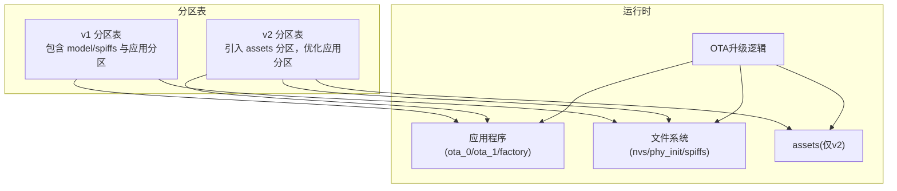
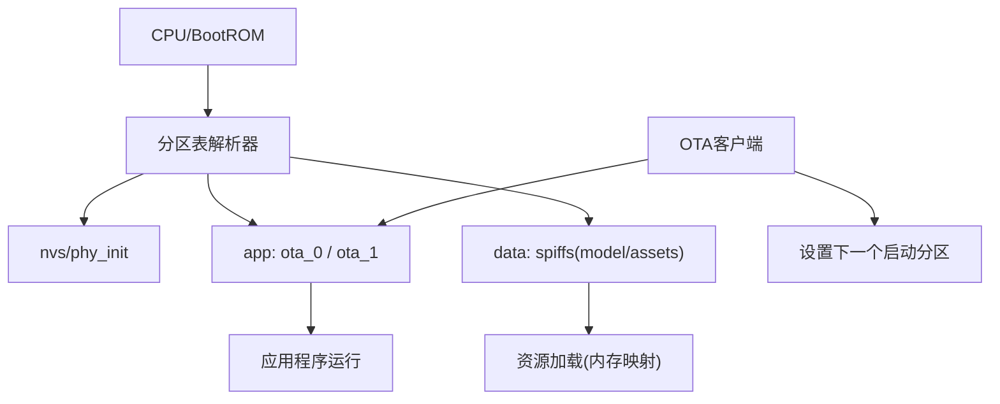
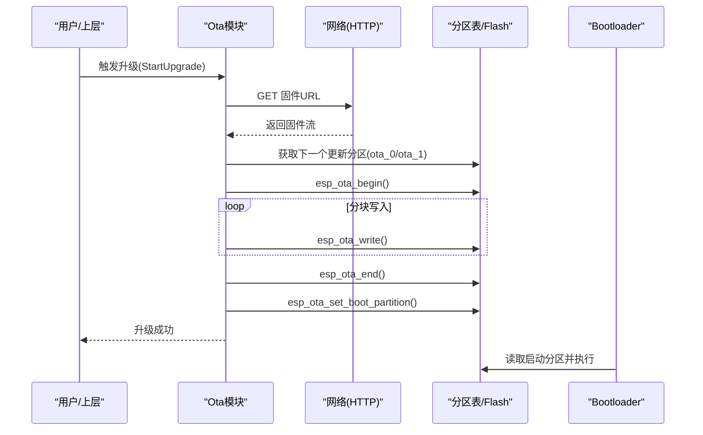
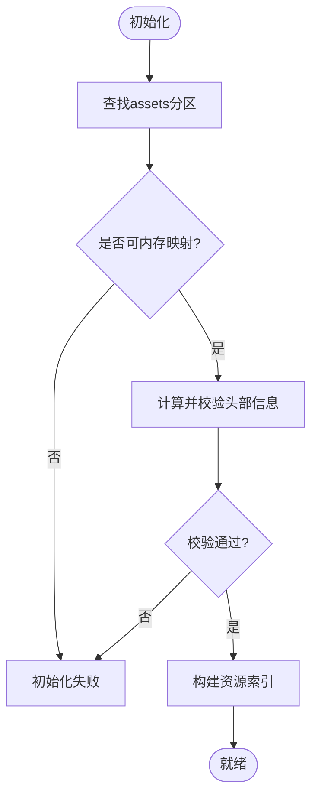
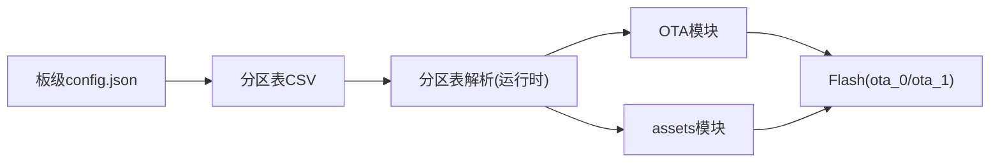

# 分区表配置

<cite>
**本文引用的文件**   
- [partitions/v1/4m.csv](file://partitions/v1/4m.csv)
- [partitions/v1/8m.csv](file://partitions/v1/8m.csv)
- [partitions/v1/16m.csv](file://partitions/v1/16m.csv)
- [partitions/v1/32m.csv](file://partitions/v1/32m.csv)
- [partitions/v1/4m_esp-hi.csv](file://partitions/v1/4m_esp-hi.csv)
- [partitions/v1/16m_custom_wakeword.csv](file://partitions/v1/16m_custom_wakeword.csv)
- [partitions/v1/16m_echoear.csv](file://partitions/v1/16m_echoear.csv)
- [partitions/v2/README.md](file://partitions/v2/README.md)
- [partitions/v2/4m.csv](file://partitions/v2/4m.csv)
- [partitions/v2/8m.csv](file://partitions/v2/8m.csv)
- [partitions/v2/16m.csv](file://partitions/v2/16m.csv)
- [partitions/v2/32m.csv](file://partitions/v2/32m.csv)
- [main/ota.cc](file://main/ota.cc)
- [main/assets.cc](file://main/assets.cc)
- [main/boards/common/board.cc](file://main/boards/common/board.cc)
- [main/boards/atom-echos3r/config.json](file://main/boards/atom-echos3r/config.json)
- [docs/custom-board.md](file://docs/custom-board.md)
</cite>

## 目录
1. [简介](#简介)
2. [项目结构](#项目结构)
3. [核心组件](#核心组件)
4. [架构总览](#架构总览)
5. [详细组件分析](#详细组件分析)
6. [依赖关系分析](#依赖关系分析)
7. [性能考量](#性能考量)
8. [故障排查指南](#故障排查指南)
9. [结论](#结论)
10. [附录](#附录)

## 简介
本文件面向ESP32系列设备的Flash分区与OTA升级，系统性说明：
- 应用程序、OTA双备份、文件系统（含v2新增assets）的分配原则
- v1与v2分区表格式的差异与CSV规范
- 不同Flash容量（4MB、8MB、16MB、32MB）下的分区方案与预留策略
- OTA升级工作原理（双分区备份、回滚机制、升级流程）
- 自定义分区表的创建方法与注意事项

## 项目结构
仓库在 partitions/v1 与 partitions/v2 下提供多套分区表模板，分别对应不同的功能特性与资源布局。v2引入 assets 分区以支持网络下载的可更新资源（如主题、唤醒词模型等），并优化了应用分区大小。

图表来源
- [partitions/v1/16m.csv:1-9](file://partitions/v1/16m.csv#L1-L9)
- [partitions/v2/16m.csv:1-9](file://partitions/v2/16m.csv#L1-L9)
- [partitions/v2/README.md:1-107](file://partitions/v2/README.md#L1-L107)

章节来源
- [partitions/v1/4m.csv:1-8](file://partitions/v1/4m.csv#L1-L8)
- [partitions/v1/8m.csv:1-9](file://partitions/v1/8m.csv#L1-L9)
- [partitions/v1/16m.csv:1-9](file://partitions/v1/16m.csv#L1-L9)
- [partitions/v1/32m.csv:1-11](file://partitions/v1/32m.csv#L1-L11)
- [partitions/v2/4m.csv:1-7](file://partitions/v2/4m.csv#L1-L7)
- [partitions/v2/8m.csv:1-9](file://partitions/v2/8m.csv#L1-L9)
- [partitions/v2/16m.csv:1-9](file://partitions/v2/16m.csv#L1-L9)
- [partitions/v2/32m.csv:1-10](file://partitions/v2/32m.csv#L1-L10)
- [partitions/v2/README.md:1-107](file://partitions/v2/README.md#L1-L107)

## 核心组件
- 分区表CSV：定义nvs、otadata、phy_init、model/assets、app(ota_0/ota_1或factory)等分区及其偏移与大小
- OTA升级模块：负责检查版本、下载固件、写入备用分区、设置启动项、标记有效/回滚
- assets资源管理：v2新增，使用spiffs子类型，支持内存映射与校验，用于动态内容加载

章节来源
- [partitions/v2/README.md:1-107](file://partitions/v2/README.md#L1-L107)
- [main/ota.cc:267-387](file://main/ota.cc#L267-L387)
- [main/assets.cc:130-185](file://main/assets.cc#L130-L185)

## 架构总览
下图展示v2分区布局与运行时访问路径：应用从ota_0/ota_1运行，系统数据存于nvs/phy_init，可更新资源位于assets分区并通过内存映射读取；OTA将新镜像写入另一app分区并在重启后切换。

图表来源
- [partitions/v2/8m.csv:1-9](file://partitions/v2/8m.csv#L1-L9)
- [partitions/v2/16m.csv:1-9](file://partitions/v2/16m.csv#L1-L9)
- [partitions/v2/32m.csv:1-10](file://partitions/v2/32m.csv#L1-L10)
- [main/ota.cc:267-387](file://main/ota.cc#L267-L387)
- [main/assets.cc:130-185](file://main/assets.cc#L130-L185)

## 详细组件分析

### v1与v2分区表格式差异与CSV规范
- CSV列顺序与含义
  - 名称(Name)、类型(Type)、子类型(SubType)、偏移(Offset)、大小(Size)、标志(Flags)
- 关键类型与子类型
  - data/nvs：非易失存储
  - data/ota：OTA元数据
  - data/phy：PHY初始化数据
  - data/spiffs：SPIFFS文件系统（v1中为model，v2中为assets）
  - app/factory：出厂应用
  - app/ota_0、app/ota_1：OTA双分区
- 对齐与边界
  - 某些平台要求应用分区按固定粒度对齐（例如1MB），否则可能导致启动失败或空间浪费
- v1 vs v2要点
  - v1：常见布局包含 model(spiffs) + 两个大app分区（或factory+model）
  - v2：用 assets(spiffs) 替代 model，增大可更新资源空间；适当缩小app分区以容纳assets；提供针对不同Flash容量的优化布局

章节来源
- [partitions/v1/4m.csv:1-8](file://partitions/v1/4m.csv#L1-L8)
- [partitions/v1/8m.csv:1-9](file://partitions/v1/8m.csv#L1-L9)
- [partitions/v1/16m.csv:1-9](file://partitions/v1/16m.csv#L1-L9)
- [partitions/v1/32m.csv:1-11](file://partitions/v1/32m.csv#L1-L11)
- [partitions/v2/4m.csv:1-7](file://partitions/v2/4m.csv#L1-L7)
- [partitions/v2/8m.csv:1-9](file://partitions/v2/8m.csv#L1-L9)
- [partitions/v2/16m.csv:1-9](file://partitions/v2/16m.csv#L1-L9)
- [partitions/v2/32m.csv:1-10](file://partitions/v2/32m.csv#L1-L10)
- [partitions/v2/README.md:1-107](file://partitions/v2/README.md#L1-L107)

### 不同Flash容量的分区方案与预留策略
- 4MB
  - v1：nvs/otadata/phy_init + model(spiffs) + factory(app)
  - v2：nvs/otadata/phy_init + factory(app) + assets(spiffs)
- 8MB
  - v1：nvs/otadata/phy_init + model(spiffs) + ota_0 + ota_1
  - v2：nvs/otadata/phy_init + ota_0 + ota_1 + assets(spiffs)
- 16MB
  - v1：nvs/otadata/phy_init + model(spiffs) + ota_0(6M) + ota_1(6M)
  - v2：nvs/otadata/phy_init + ota_0(4M) + ota_1(4M) + assets(8M)
- 32MB
  - v1：nvsfactory+nvs + otadata + phy_init + model(spiffs) + ota_0(12M)+ota_1(12M)，注释强调app需按1MB对齐
  - v2：nvsfactory+nvs + otadata + phy_init + ota_0(4M)+ota_1(4M)+assets(16M)
- 预留策略
  - 头部保留：nvs/otadata/phy_init固定占用前段空间
  - 文件系统预留：spiffs需要额外开销，建议根据实际资源量预留余量
  - 对齐约束：遵循平台对齐要求（如1MB），避免碎片化与不可用空间

章节来源
- [partitions/v1/4m.csv:1-8](file://partitions/v1/4m.csv#L1-L8)
- [partitions/v1/8m.csv:1-9](file://partitions/v1/8m.csv#L1-L9)
- [partitions/v1/16m.csv:1-9](file://partitions/v1/16m.csv#L1-L9)
- [partitions/v1/32m.csv:1-11](file://partitions/v1/32m.csv#L1-L11)
- [partitions/v2/4m.csv:1-7](file://partitions/v2/4m.csv#L1-L7)
- [partitions/v2/8m.csv:1-9](file://partitions/v2/8m.csv#L1-L9)
- [partitions/v2/16m.csv:1-9](file://partitions/v2/16m.csv#L1-L9)
- [partitions/v2/32m.csv:1-10](file://partitions/v2/32m.csv#L1-L10)
- [partitions/v2/README.md:42-107](file://partitions/v2/README.md#L42-L107)

### OTA升级工作原理（双分区备份、回滚机制、升级流程）
- 双分区备份
  - 使用 app/ota_0 与 app/ota_1 作为A/B槽位，当前运行槽位由bootloader选择
- 回滚机制
  - 若新镜像未通过验证或未标记为有效，系统将回滚至上一可用槽位
- 升级流程
  - 获取目标URL → 建立HTTP连接 → 解析镜像头 → 开始写入备用分区 → 分块写入 → 结束并校验 → 设置下次启动分区 → 重启生效
  - 运行于factory时跳过“标记有效”步骤

图表来源
- [main/ota.cc:267-387](file://main/ota.cc#L267-L387)

章节来源
- [main/ota.cc:247-265](file://main/ota.cc#L247-L265)
- [main/ota.cc:267-387](file://main/ota.cc#L267-L387)

### assets资源管理（v2新增）
- 用途：存放可网络更新的资源（主题、字体、音效、图片、语言包等）
- 实现要点
  - 分区类型为 data/spiffs，便于兼容SPIFFS工具链
  - 运行时通过内存映射直接访问，减少拷贝开销
  - 内置校验和验证，确保资源完整性
  - 支持渐进式下载与回退到默认资源
- 容量规划
  - 小容量设备（如C3）受限于mmap页面数量，assets会相应减小
  - 大容量设备（如32MB）可获得更大assets空间

图表来源
- [main/assets.cc:130-185](file://main/assets.cc#L130-L185)
- [partitions/v2/README.md:86-107](file://partitions/v2/README.md#L86-L107)

章节来源
- [main/assets.cc:130-185](file://main/assets.cc#L130-L185)
- [partitions/v2/README.md:1-107](file://partitions/v2/README.md#L1-L107)

### 自定义分区表的创建方法与注意事项
- 选择基础模板
  - 参考现有v1/v2模板，按目标Flash容量选择最接近的布局
- 调整分区大小与偏移
  - 保持nvs/otadata/phy_init在前部且满足最小尺寸
  - 应用分区需满足平台对齐要求（如1MB）
  - 文件系统（spiffs）需考虑内部开销与碎片率
- 指定分区表文件
  - 在板级config.json中添加sdkconfig_append，指向自定义分区表路径
  - 示例：在板级配置中设置 CONFIG_PARTITION_TABLE_CUSTOM_FILENAME 指向 partitions/v2/xxx.csv
- 验证与测试
  - 编译烧录后，确认各分区地址与大小符合预期
  - 验证OTA与assets读写是否正常

章节来源
- [docs/custom-board.md:90-107](file://docs/custom-board.md#L90-L107)
- [main/boards/atom-echos3r/config.json:1-12](file://main/boards/atom-echos3r/config.json#L1-L12)

## 依赖关系分析
- 构建期
  - 板级config.json决定使用的分区表文件与Flash大小
- 运行期
  - 系统启动时解析分区表，暴露给应用层API
  - OTA模块依赖分区表提供的ota_0/ota_1槽位
  - assets模块依赖data/spiffs分区进行资源存取与映射

图表来源
- [main/boards/atom-echos3r/config.json:1-12](file://main/boards/atom-echos3r/config.json#L1-L12)
- [main/boards/common/board.cc:138-150](file://main/boards/common/board.cc#L138-L150)

章节来源
- [main/boards/common/board.cc:138-150](file://main/boards/common/board.cc#L138-L150)
- [main/boards/atom-echos3r/config.json:1-12](file://main/boards/atom-echos3r/config.json#L1-L12)

## 性能考量
- 内存映射优势：assets采用mmap直读，降低CPU与RAM占用
- 校验开销：assets初始化阶段进行校验和计算，应评估对启动时间的影响
- Flash写入效率：OTA分块写入需合理缓冲，避免频繁擦写
- 对齐与碎片：遵循对齐要求可减少无效空间与碎片，提升整体利用率

[本节为通用指导，不直接分析具体文件]

## 故障排查指南
- OTA相关
  - 无法获取下一个更新分区：检查分区表中是否存在合法的ota_0/ota_1
  - 镜像校验失败：确认固件签名/校验信息完整，网络传输无损坏
  - 回滚发生：检查新镜像是否被正确标记为有效，或是否存在启动失败导致回滚
- assets相关
  - mmap失败：检查可用mmap页面数与分区大小匹配性
  - 校验和不匹配：确认资源打包过程是否正确生成头部与校验值
- 分区表问题
  - 启动异常：核对对齐要求与偏移/大小是否越界
  - 文件系统不可用：确认spiffs分区大小与内部开销匹配

章节来源
- [main/ota.cc:267-387](file://main/ota.cc#L267-L387)
- [main/assets.cc:130-185](file://main/assets.cc#L130-L185)

## 结论
- v2分区表通过引入assets分区显著提升了资源动态更新能力，同时优化了应用分区大小以适应更多场景
- 不同Flash容量下，应选择合适的分区模板并进行必要微调，严格遵循对齐与预留策略
- OTA双分区与回滚机制保障了升级可靠性；assets的内存映射与校验保证了高效与安全

[本节为总结性内容，不直接分析具体文件]

## 附录

### 分区表CSV字段速查
- Name：分区名称（如 nvs、ota_0、assets）
- Type：分区类型（data/app）
- SubType：子类型（nvs、ota、phy、spiffs、factory、ota_0、ota_1）
- Offset：起始偏移（十六进制）
- Size：大小（十六进制或K/M单位）
- Flags：可选标志位

章节来源
- [partitions/v1/4m.csv:1-8](file://partitions/v1/4m.csv#L1-L8)
- [partitions/v2/8m.csv:1-9](file://partitions/v2/8m.csv#L1-L9)