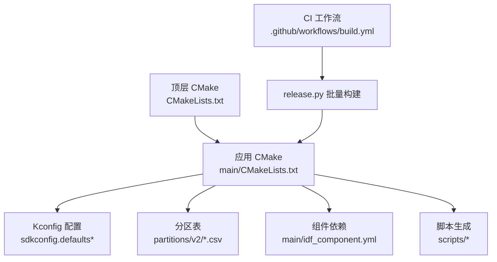
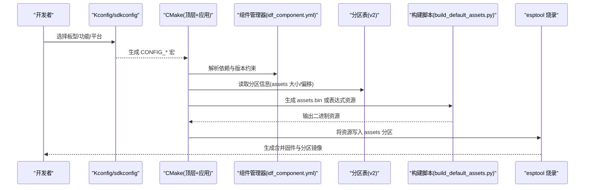
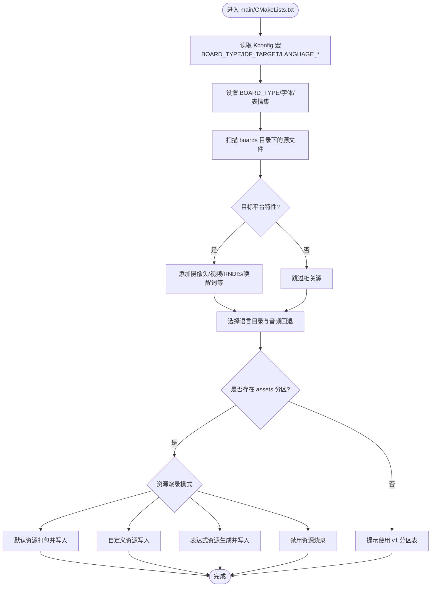
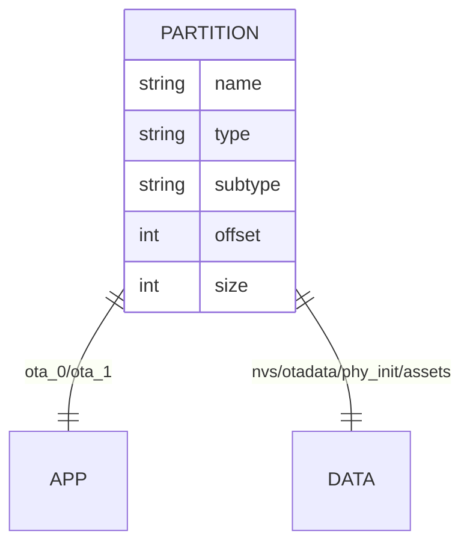
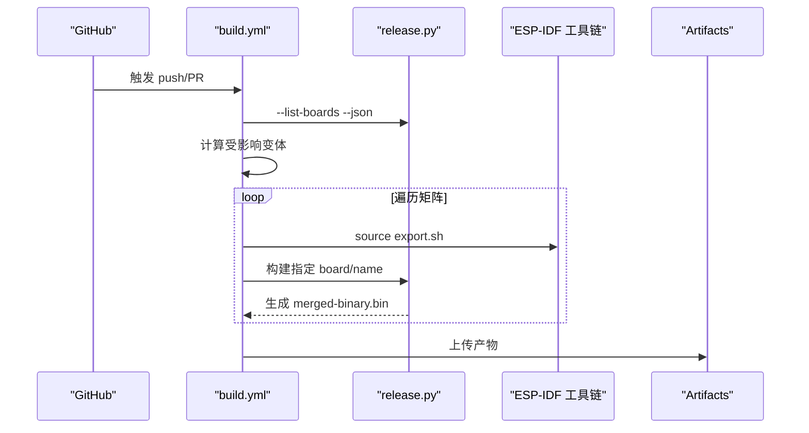
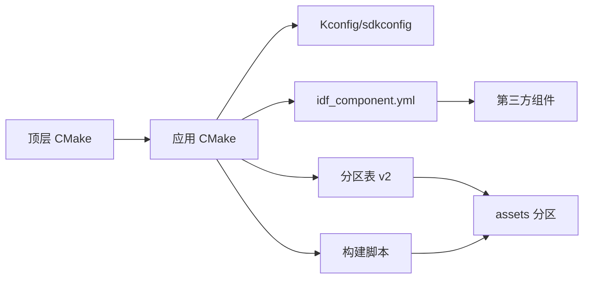

# 构建系统配置

<cite>
**本文引用的文件**   
- [CMakeLists.txt](file://CMakeLists.txt)
- [main/CMakeLists.txt](file://main/CMakeLists.txt)
- [main/idf_component.yml](file://main/idf_component.yml)
- [sdkconfig.defaults](file://sdkconfig.defaults)
- [sdkconfig.defaults.esp32s3](file://sdkconfig.defaults.esp32s3)
- [sdkconfig.defaults.esp32c3](file://sdkconfig.defaults.esp32c3)
- [sdkconfig.defaults.esp32p4](file://sdkconfig.defaults.esp32p4)
- [partitions/v2/16m.csv](file://partitions/v2/16m.csv)
- [partitions/v2/16m_c3.csv](file://partitions/v2/16m_c3.csv)
- [.github/workflows/build.yml](file:.github/workflows/build.yml)
</cite>

## 目录
1. [简介](#简介)
2. [项目结构](#项目结构)
3. [核心组件](#核心组件)
4. [架构总览](#架构总览)
5. [详细组件分析](#详细组件分析)
6. [依赖关系分析](#依赖关系分析)
7. [性能与优化](#性能与优化)
8. [故障排查指南](#故障排查指南)
9. [结论](#结论)
10. [附录](#附录)

## 简介
本文件面向构建系统与配置，系统性说明：
- CMake 动态编译机制：如何根据目标板型选择源代码、链接库与资源。
- 分区表配置：Flash 分区策略、文件系统挂载、OTA 升级分区。
- SDK 配置选项管理：不同芯片平台的默认配置与编译优化。
- idf_component.yml 组件依赖管理与版本兼容性检查。
- 批量构建与自动化部署方案（GitHub Actions + release.py）。

## 项目结构
本项目基于 ESP-IDF v5.5+ 与 CMake 构建系统，顶层 CMake 负责最小化构建与工程初始化；应用层 main/CMakeLists.txt 实现按 Kconfig 与目标平台动态选择源码、字体、表情集、音频资源与外设驱动；分区表位于 partitions/v2；SDK 默认配置通过 sdkconfig.defaults 与各芯片平台 defaults 文件叠加生效；组件依赖由 main/idf_component.yml 声明；CI 使用 GitHub Actions 与 scripts/release.py 进行多板型批量构建与产物上传。

图表来源
- [CMakeLists.txt:1-14](file://CMakeLists.txt#L1-L14)
- [main/CMakeLists.txt:1-120](file://main/CMakeLists.txt#L1-L120)
- [sdkconfig.defaults:1-79](file://sdkconfig.defaults#L1-L79)
- [partitions/v2/16m.csv:1-9](file://partitions/v2/16m.csv#L1-L9)
- [main/idf_component.yml:1-151](file://main/idf_component.yml#L1-L151)
- [.github/workflows/build.yml:1-112](file:.github/workflows/build.yml#L1-L112)

章节来源
- [CMakeLists.txt:1-14](file://CMakeLists.txt#L1-L14)
- [main/CMakeLists.txt:1-120](file://main/CMakeLists.txt#L1-L120)

## 核心组件
- 顶层 CMake：启用最小化构建、设置编译器警告抑制、引入 IDF 工程模板、定义工程名与版本。
- 应用 CMake：
  - 依据 CONFIG_BOARD_TYPE 等 Kconfig 宏动态选择 board 源文件与内置字体/表情集。
  - 依据 CONFIG_IDF_TARGET 与功能开关选择性加入音频处理器、唤醒词、摄像头、视频、RNDIS 等模块。
  - 收集语言包与本地化音频，必要时回退到 en-US 资源。
  - 调用脚本生成语言头、打包默认 assets.bin 或表达式资源，并写入 Flash 的 assets 分区。
- 分区表：v2 格式，包含 NVS、OTA 数据、PHY 初始化、双 OTA App、SPIFFS 资源分区。
- SDK 配置：全局默认与芯片平台默认叠加，控制优化等级、内存、LVGL、WiFi、SR 模型等。
- 组件依赖：idf_component.yml 声明各子组件及 target 规则，强制最低 IDF 版本。
- CI 批量构建：release.py 列出所有变体，按变更范围筛选矩阵，并行构建并上传产物。

章节来源
- [CMakeLists.txt:1-14](file://CMakeLists.txt#L1-L14)
- [main/CMakeLists.txt:1-120](file://main/CMakeLists.txt#L1-L120)
- [main/CMakeLists.txt:880-1080](file://main/CMakeLists.txt#L880-L1080)
- [main/CMakeLists.txt:1178-1318](file://main/CMakeLists.txt#L1178-L1318)
- [sdkconfig.defaults:1-79](file://sdkconfig.defaults#L1-L79)
- [sdkconfig.defaults.esp32s3:1-32](file://sdkconfig.defaults.esp32s3#L1-L32)
- [sdkconfig.defaults.esp32c3:1-15](file://sdkconfig.defaults.esp32c3#L1-L15)
- [sdkconfig.defaults.esp32p4:1-32](file://sdkconfig.defaults.esp32p4#L1-L32)
- [partitions/v2/16m.csv:1-9](file://partitions/v2/16m.csv#L1-L9)
- [partitions/v2/16m_c3.csv:1-9](file://partitions/v2/16m_c3.csv#L1-L9)
- [main/idf_component.yml:1-151](file://main/idf_component.yml#L1-L151)
- [.github/workflows/build.yml:1-112](file:.github/workflows/build.yml#L1-L112)

## 架构总览
下图展示从配置到构建产物的关键路径：Kconfig 决定 BOARD_TYPE 与功能开关，CMake 据此选择源码与资源，分区表提供 Flash 布局，assets 分区用于存放字体/表情/音频等资源，CI 通过 release.py 触发多板型构建。

图表来源
- [main/CMakeLists.txt:1286-1318](file://main/CMakeLists.txt#L1286-L1318)
- [main/idf_component.yml:1-151](file://main/idf_component.yml#L1-L151)
- [partitions/v2/16m.csv:1-9](file://partitions/v2/16m.csv#L1-L9)

## 详细组件分析

### 动态编译机制（按板型与目标）
- 板型选择：
  - 通过大量 CONFIG_BOARD_TYPE_* 分支设置 BOARD_TYPE、BUILTIN_TEXT_FONT、BUILTIN_ICON_FONT、DEFAULT_EMOJI_COLLECTION 等变量。
  - 若存在 MANUFACTURER，则从 boards/<manufacturer>/<board_type> 下扫描 *.cc/*.c；否则从 boards/<board_type> 下扫描。
- 目标平台特性：
  - 依据 CONFIG_IDF_TARGET_ESP32S3/ESP32P4/ESP32 等条件添加/移除特定源文件（如摄像头、视频、RNDIS、部分音频编解码器）。
  - 依据 CONFIG_USE_AUDIO_PROCESSOR 选择 AFE 或空处理器；依据目标平台选择唤醒词实现。
- 语言与资源：
  - 依据 CONFIG_LANGUAGE_* 选择语言目录，收集对应 .ogg 音频；非 en-US 时自动回退缺失的 en-US 音频。
  - 生成语言头文件 lang_config.h，作为构建依赖。
- 资源打包与烧录：
  - 当检测到 assets 分区存在时，根据 CONFIG_FLASH_DEFAULT_ASSETS / CONFIG_FLASH_CUSTOM_ASSETS / CONFIG_FLASH_EXPRESSION_ASSETS / CONFIG_FLASH_NONE_ASSETS 执行不同流程：
    - 默认资源：调用 build_default_assets_bin() 生成 generated_assets.bin，再写入 assets 分区。
    - 自定义资源：下载或定位外部 assets 文件后写入 assets 分区。
    - 表达式资源：针对特定板型（如 ESP-VoCat）生成 expression_assets.bin 并写入。
    - 禁用：跳过资源烧录。

图表来源
- [main/CMakeLists.txt:90-880](file://main/CMakeLists.txt#L90-L880)
- [main/CMakeLists.txt:880-1080](file://main/CMakeLists.txt#L880-L1080)
- [main/CMakeLists.txt:1178-1318](file://main/CMakeLists.txt#L1178-L1318)

章节来源
- [main/CMakeLists.txt:90-880](file://main/CMakeLists.txt#L90-L880)
- [main/CMakeLists.txt:880-1080](file://main/CMakeLists.txt#L880-L1080)
- [main/CMakeLists.txt:1178-1318](file://main/CMakeLists.txt#L1178-L1318)

### 分区表配置（Flash 分区策略、文件系统、OTA）
- 分区表位置与选择：
  - 默认使用 partitions/v2/16m.csv；esp32c3 平台使用 partitions/v2/16m_c3.csv。
- 分区布局要点：
  - nvs：存储设备参数。
  - otadata：OTA 元数据。
  - phy_init：射频校准数据。
  - ota_0/ota_1：两个 OTA 应用槽，支持回滚。
  - assets：data/spiffs 类型，用于存放字体、表情、音频等静态资源。
- 资源写入逻辑：
  - 构建阶段通过 partition_table_get_partition_info 获取 assets 分区 size/offset，确认是否使用 v2 分区表。
  - 根据配置项将生成的 assets.bin 或 expression_assets.bin 写入该分区。

图表来源
- [partitions/v2/16m.csv:1-9](file://partitions/v2/16m.csv#L1-L9)
- [partitions/v2/16m_c3.csv:1-9](file://partitions/v2/16m_c3.csv#L1-L9)
- [main/CMakeLists.txt:1286-1318](file://main/CMakeLists.txt#L1286-L1318)

章节来源
- [partitions/v2/16m.csv:1-9](file://partitions/v2/16m.csv#L1-L9)
- [partitions/v2/16m_c3.csv:1-9](file://partitions/v2/16m_c3.csv#L1-L9)
- [main/CMakeLists.txt:1286-1318](file://main/CMakeLists.txt#L1286-L1318)

### SDK 配置选项管理（默认配置与平台差异）
- 全局默认（sdkconfig.defaults）：
  - 开启最小化 LVGL 部件、关闭示例、启用压缩字体、调整 WiFi 缓冲区、禁用某些安全特性以节省空间。
  - 指定分区表文件名与偏移，启用 app_update、spi_flash、fatfs 等基础组件。
- 平台默认：
  - esp32s3：16MB Flash、QIO、PSRAM 80MHz、较大主任务栈、USB Host 传输大小、LVGL 快照等。
  - esp32c3：16MB Flash、切换 c3 专用分区表、精简 IPv6/WPA3 等。
  - esp32p4：16MB Flash、PSRAM 200MHz、XIP from PSRAM、实验特性、ISP 流水线、USB Host 限制等。
- 覆盖方式：
  - 通过 menuconfig 或 sdkconfig_append 在构建时追加/覆盖默认值。

章节来源
- [sdkconfig.defaults:1-79](file://sdkconfig.defaults#L1-L79)
- [sdkconfig.defaults.esp32s3:1-32](file://sdkconfig.defaults.esp32s3#L1-L32)
- [sdkconfig.defaults.esp32c3:1-15](file://sdkconfig.defaults.esp32c3#L1-L15)
- [sdkconfig.defaults.esp32p4:1-32](file://sdkconfig.defaults.esp32p4#L1-L32)

### 组件依赖与版本兼容（idf_component.yml）
- 依赖声明：
  - 屏幕驱动、触摸、LVGL、音频编解码、语音识别、相机、视频、电池估算、图像播放等组件均在此集中声明。
- 版本与目标规则：
  - 使用 version 字段与 rules.if.target 限定仅在特定目标上启用（如 esp32s3/esp32p4/esp32c3/esp32h2）。
  - 强制最低 IDF 版本 >= 5.5.2，确保 API 一致性。
- 公开组件：
  - 例如 bq27220 标记为 public，供上层组件引用。

章节来源
- [main/idf_component.yml:1-151](file://main/idf_component.yml#L1-L151)

### 批量构建与自动化部署
- 变体发现与筛选：
  - 使用 scripts/release.py --list-boards --json 获取全部变体列表。
  - PR 场景下基于 diff 的文件路径判断是否需要全量构建，或仅构建受影响的 board。
- 并行构建：
  - GitHub Actions matrix 并行构建每个变体，失败不中断其他变体。
- 产物上传：
  - 将 build/merged-binary.bin 作为工件上传，便于后续发布或测试。

图表来源
- [.github/workflows/build.yml:1-112](file:.github/workflows/build.yml#L1-L112)

章节来源
- [.github/workflows/build.yml:1-112](file:.github/workflows/build.yml#L1-L112)

## 依赖关系分析
- 顶层 CMake 引入 IDF 工程模板并启用最小化构建，减少无关组件参与编译。
- 应用 CMake 通过 Kconfig 宏与 find_component_by_pattern 动态定位组件路径（如 esp-sr、xiaozhi-fonts），从而正确传递模型与字体路径给资源打包脚本。
- 组件依赖与目标规则在 idf_component.yml 中集中管理，避免在不同平台上引入不兼容组件。
- 分区表与资源烧录在构建后期执行，确保 assets 分区存在且尺寸/偏移可用。

图表来源
- [CMakeLists.txt:1-14](file://CMakeLists.txt#L1-L14)
- [main/CMakeLists.txt:1-120](file://main/CMakeLists.txt#L1-L120)
- [main/idf_component.yml:1-151](file://main/idf_component.yml#L1-L151)
- [partitions/v2/16m.csv:1-9](file://partitions/v2/16m.csv#L1-L9)

章节来源
- [CMakeLists.txt:1-14](file://CMakeLists.txt#L1-L14)
- [main/CMakeLists.txt:1-120](file://main/CMakeLists.txt#L1-L120)
- [main/idf_component.yml:1-151](file://main/idf_component.yml#L1-L151)
- [partitions/v2/16m.csv:1-9](file://partitions/v2/16m.csv#L1-L9)

## 性能与优化
- 编译优化：
  - 全局默认采用体积优先优化，Bootloader 采用性能优先；可根据需要调整为 perf。
- 内存与缓存：
  - S3/P4 平台启用 PSRAM 与 XIP，合理分配内部保留内存，降低堆碎片风险。
- LVGL 裁剪：
  - 禁用非必要控件与示例，启用压缩字体，减小 Flash 占用。
- 网络与安全：
  - 关闭企业级 WiFi 支持与证书持久化，降低内存占用；按需调整 MBEDTLS 行为。
- 资源打包：
  - 使用默认资源打包脚本，按板型选择字体与表情集，避免冗余资源导致分区溢出。

[本节为通用指导，无需具体文件引用]

## 故障排查指南
- 未找到 assets 分区：
  - 现象：构建日志提示“Assets partition not found, using v1 partition table”。
  - 原因：当前使用的分区表为 v1 或未包含 assets 分区。
  - 处理：切换到 partitions/v2 分区表并确保分区名称为 assets。
- 资源下载失败：
  - 现象：构建脚本报告无法下载某资源文件。
  - 原因：网络不可达或 URL 失效。
  - 处理：检查网络连接、URL 有效性，或使用本地自定义资源。
- 组件版本冲突：
  - 现象：组件管理器报错版本不满足约束。
  - 原因：idf_component.yml 中的版本要求与已安装组件不一致。
  - 处理：更新组件缓存或调整版本约束，确保满足最低 IDF 版本。
- 分区溢出：
  - 现象：烧录时报分区大小不足。
  - 原因：资源过大或分区表划分不合理。
  - 处理：增大 assets 分区或精简资源（字体/表情/音频）。

章节来源
- [main/CMakeLists.txt:1286-1318](file://main/CMakeLists.txt#L1286-L1318)
- [partitions/v2/16m.csv:1-9](file://partitions/v2/16m.csv#L1-L9)
- [main/idf_component.yml:1-151](file://main/idf_component.yml#L1-L151)

## 结论
本项目通过“Kconfig + CMake + 分区表 + 组件依赖 + CI”的组合，实现了高度可配置的跨板型构建体系。借助动态源码选择、资源打包与分区写入，以及按变更范围触发的批量构建，既保证了开发效率，也兼顾了产品化所需的稳定性与可维护性。

[本节为总结性内容，无需具体文件引用]

## 附录
- 常用构建命令（参考 ESP-IDF 文档）：
  - 配置：idf.py menuconfig
  - 构建：idf.py build
  - 烧录：idf.py -p PORT flash
  - 监视：idf.py monitor
- 自定义板型建议：
  - 在 main/boards 下新增目录，提供 config.h、config.json 与板级实现。
  - 在 config.json 中使用 sdkconfig_append 指定 Flash 大小与分区表文件。

[本节为补充说明，无需具体文件引用]